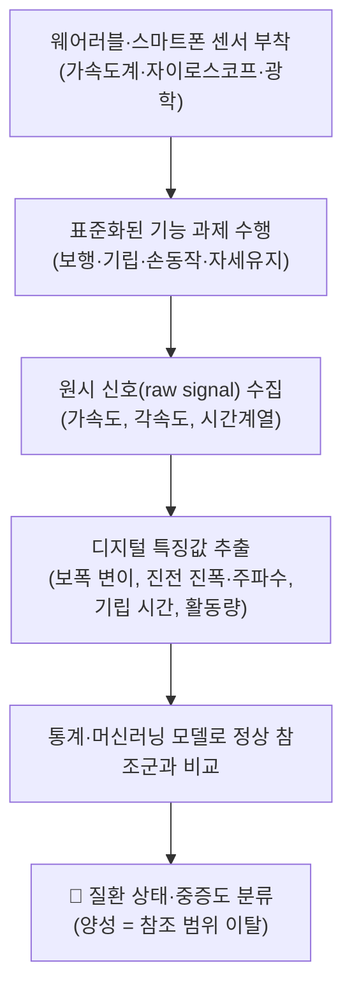
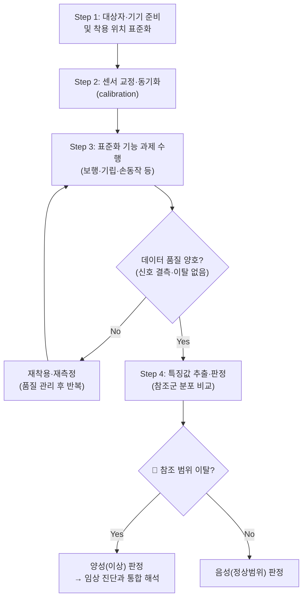

# 🩺 [[디지털 바이오마커]] (Digital Biomarker / 數位生物標誌物, DB)

> **핵심 3줄 요약 (Key Summary)**:
> - 🎯 검사 목적 & 타겟 병소: 웨어러블·스마트폰·센서로 **객관적·연속적·비침습적** 생체 신호를 수집하여 [[파킨슨병]], [[다발성경화증]], [[중증근무력증]], [[근감소증]] 및 노화에 따른 [[생리계통 기능]] 저하를 조기 발견·모니터링한다. 타겟은 특정 해부학적 구조물이 아니라 **보행·균형·진전·운동완서·일상활동(ADL) 등 기능적 디지털 표현형**이다.
> - 🔍 검사 시행 프로토콜 & 양성 반응: 웨어러블(가속도계·자이로스코프) 또는 스마트폰을 표준 위치(허리·손목·발목 등)에 착용시키고, 정해진 과제(예: 일정 거리 보행, 기립-보행, 손가락 두드리기, 자세 유지)를 수행하게 한 뒤 원시 신호(Raw signal)에서 추출한 디지털 특징값(feature)이 정상 참조군 분포를 벗어나면 "양성(이상)"으로 판정한다.
> - 📊 진단 정확도(민감도·특이도) & 임상적 의의: 질환별·알고리즘별로 민감도·특이도 편차가 커 **단일 컷오프 값은 근거 미확인**이며, 대개 임상 척도(UPDRS, EDSS 등)와의 상관·군집 분류 정확도로 성능을 보고한다. 선별(screening)·원격 모니터링·치료 반응 추적에 강점이 있고, 확진은 임상 진단·영상·검사실 검사와 병행한다.
> - ⚠️ 위양성/위음성 요인 & 검사 금기: 기기 착용 위치 이탈, 배터리·동기화 오류, 피부 접촉 불량, 일상 변동성(circadian), 활동량 차이, 연령·동반질환에 의한 위양성 가능. 급성 통증·보행 불가·낙상 고위험·인지장애로 과제 수행이 어려운 환자에서는 표준 프로토콜 적용이 제한되며, 디지털 지표만으로 확진하지 말 것.

---

## 📌 목차
1. [검사 기본 정보 & 진단 목적 (Diagnostic Overview)](#1-검사-기본-정보--진단-목적-diagnostic-overview)
2. [해부학적 유발 메커니즘 & 생체역학적 원리 (Biomechanical Mechanism)](#2-해부학적-유발-메커니즘--생체역학적-원리-biomechanical-mechanism)
3. [표준 검사 시행 절차 (Step-by-Step Clinical Protocol)](#3-표준-검사-시행-절차-step-by-step-clinical-protocol)
4. [양성 반응 판정 기준 & 신경근/조직별 감별 맵핑 (Diagnostic Criteria & Mapping)](#4-양성-반응-판정-기준--신경근조직별-감별-맵핑-diagnostic-criteria--mapping)
5. [연관 검사군 비교 & 다단계 감별 알고리즘 (Differential Battery & Algorithm)](#5-연관-검사군-비교--다단계-감별-알고리즘-differential-battery--algorithm)
6. [양성 소견 시 한의 임상 연계 치료 전략 (Integrative Korean Medicine)](#6-양성-소견-시-한의-임상-연계-치료-전략-integrative-korean-medicine)
7. [💡 사용자 진료실 핵심 필기 & 실전 임상 팁 (원문 보존)](#7--사용자-진료실-핵심-필기--실전-임상-팁-원문-보존)
8. [출처 및 학술 참고 문헌 (References)](#8-출처-및-학술-참고-문헌-references)

---

## 1. 검사 기본 정보 & 진단 목적 (Diagnostic Overview)

| 항목 | 상세 내용 |
| :--- | :--- |
| **검사명 (Test Name)** | Digital Biomarker Assessment (디지털 바이오마커 평가 / DB) |
| **분류 (Category)** | 디지털 계측·기능 평가 / 웨어러블 센서 기반 원격 모니터링 / 운동·보행 분석 |
| **타겟 병소 (Target)** | [[보행 주기]], [[자세 균형]], [[운동완서(Bradykinesia)]], [[진전(Tremor)]], [[골격근량·근력]], [[일상활동량(ADL)]] — 특정 해부 구조물이 아닌 **기능 수행의 디지털 표현형** |
| **의심 질환 (Suspected Pathologies)** | [[파킨슨병]], [[다발성경화증]], [[중증근무력증]], [[근감소증]], [[노화 관련 생리기능 저하]] |
| **진단 정확도 (Diagnostic Accuracy)** | • **민감도 (Sensitivity)**: 질환·기기·알고리즘별 편차가 커 **개별 수치 근거 미확인** • **특이도 (Specificity)**: 동일, 표준화된 컷오프 미확립 (근거 미확인) • **양성 우도비 (LR+)**: 근거 미확인 |
| **시연 영상 (Video Guide)** | [🎥 시연 영상: 채널명 - 검사명](유튜브영상URL) |

> ⚠️ 본 노트는 "이학적 검사" 템플릿에 맞추어 작성되었으나, [[디지털 바이오마커]]는 특정 신체 부위를 압박·견인하여 유발하는 고전적 이학적 검사가 아니라, **디지털 기기로 생체신호를 수집해 질병 상태를 정량화하는 개념 체계**이다. 따라서 각 섹션은 "검사 프로토콜"을 디지털 데이터 수집·판정 절차로 번안하여 서술한다.

---

## 2. 해부학적 유발 메커니즘 & 생체역학적 원리 (Biomechanical Mechanism)

디지털 바이오마커는 고전적 유발 검사처럼 기계적 압박으로 통증을 유발하는 것이 아니라, **병태생리적 변화가 몸의 운동·생리 신호에 남기는 "디지털 흔적(signature)"을 포착**한다. 논문들은 이를 파킨슨병, 다발성경화증, 중증근무력증, 근감소증·노화 영역에서 각각 보고한다. (Sun & Wang 2024, PMID 39169258 / Dillenseger & Weidemann 2021, PMID 34827518 / Bhandage & Chen 2025, PMID 40675736 / Kim & Kim 2026, PMID 42754981 / Lu & Wang 2025, PMID 40517785)

### 1) 병태생리 → 디지털 신호 전달 경로
* [[파킨슨병]]에서는 [[흑질-선조체 도파민성 신경]] 소실로 인한 운동완서·강직·진전·자세 불안정이 **보행 리듬·손동작 속도·진전 주파수** 등의 신호로 나타나며, 웨어러블·스마트폰으로 정밀 진단·모니터링에 활용된다 (PMID 39169258).
* [[다발성경화증]]에서는 탈수초·축삭 손실로 인한 보행 이상, 피로, 인지 저하가 **보행 속도·보행 대칭성·인지 과제 반응시간** 등으로 정량화된다 (PMID 34827518).
* [[중증근무력증]]에서는 [[신경근 접합부]] 전달 장애로 인한 **근피로(반복 자극 후 근력 저하)**가 디지털·혈액 바이오마커로 추적된다 (PMID 40675736).
* [[근감소증]]·노화에서는 골격근 소실과 운동 기능 저하가 **보행 속도, 기상-보행 시간, 신체활동량, 악력 대체 지표**로 포착된다. 분자 기전(단백질 항상성, 미토콘드리아 기능 이상, 만성 염증 등)과의 연결은 Kim & Kim 2026, Nguyen & Dao 2026 (PMID 42754981, 41674227)에서 다룬다.

### 2) 신호 생성의 생리학적 기전
* 병리적 상태에서 운동 단위 동원 패턴·근수축 시간·자세 조절 반사가 변하며, 이 변화는 **가속도·각속도의 크기(amplitude), 시간(time), 주파수(frequency), 변동성(variability)** 이라는 물리량으로 변환된다.
* 예컨대 진전은 주파수 영역 신호로, 보행 장애는 시공간적(spatiotemporal) 보행 변수로, 근피로는 반복 과제 후 수행 저하(repetition decrement)로 측정된다. 단, 개별 질환·기기별 구체 알고리즘 파라미터는 **근거 미확인**이며 원 논문에서 확인해야 한다.

---

## 3. 표준 검사 시행 절차 (Step-by-Step Clinical Protocol)

### Step 1: 대상자·기기 준비 및 착용 위치 표준화
* 대상자에게 검사 목적과 과제를 충분히 설명하고, 편안한 복장·신발을 착용하게 한다.
* 웨어러블(가속도계 등) 또는 스마트폰을 **미리 정한 표준 위치**(예: 허리(요추 후방), 손목, 발목, 상완)에 고정한다. 위치·방향은 측정값에 직접 영향을 주므로 **매 측정마다 동일하게** 재현한다.
* 기기별 착용 부위·과제가 논문마다 상이하므로, 특정 기기의 세부 부착 규격은 **근거 미확인**이다(해당 기기 프로토콜 준수).

### Step 2: 센서 교정·동기화 (Calibration)
* 기기의 캘리브레이션·샘플링 주기·시간 동기화 상태를 점검한다.
* 배터리 잔량, 저장 공간, 피부 접촉·밴드 장력 등을 확인하여 **신호 이탈·결측**을 예방한다.

### Step 3: 표준화 기능 과제 수행 (Standardized Functional Task)
대표적인 과제 유형은 다음과 같으며, 질환별로 적합한 과제가 선택된다.

| 과제 유형 | 측정 신호 예 | 관련 질환 영역 |
| :--- | :--- | :--- |
| 보행 과제 (일정 거리/시간 보행) | 보행 속도, 보폭, 보행 변이 | [[파킨슨병]], [[다발성경화증]], [[근감소증]] |
| 기립-보행 (Timed Up and Go류) | 기상 시간, 자세 전환 | [[근감소증]], 노화 |
| 자세 유지·균형 | 자세 동요(sway) | 파킨슨병, 노화 |
| 손동작(두드리기 등) | 운동 속도·리듬 | 파킨슨병 |
| 반복 근수축 과제 | 반복 후 수행 저하 | [[중증근무력증]] |
| 일상 활동량(자유생활) | 활동 강도·지속시간 | 근감소증, 노화 |

### Step 4: 특징값 추출·판정 및 안전 해제
* 원시 신호에서 특징값을 추출하고, 정상 참조군 분포 또는 사전 정의된 모델과 비교해 이상 여부를 판정한다.
* 과제 중 통증·어지럼·낙상 위험 등 이상 징후가 나타나면 **즉시 중단**하고 안전을 확보한다.
* 디지털 판정은 어디까지나 보조 지표이며, **단독 확진 도구로 사용하지 않는다**(PMID 39169258, 34827518).

---

## 4. 양성 반응 판정 기준 & 신경근/조직별 감별 맵핑 (Diagnostic Criteria & Mapping)

* **양성(이상) 반응 (Positive / Abnormal)**:
  * 추출한 디지털 특징값이 정상 참조군의 분포·컷오프를 벗어나거나, 분류 모델이 해당 질환군으로 분류할 때.
  * 예: 보행 속도 저하·보행 변이 증가, 진전 진폭·주파수 이상, 반복 과제 시 수행 저하 등이 지속적으로 관찰되는 경우.
* **음성 반응 (Negative)**:
  * 특징값이 정상 참조 범위 내에 있고, 일상 변동 범위를 벗어나지 않는 경우.
* **가양성 (False Positive) 감별**:
  * 연령·체격·동반질환(관절염·심혈관질환 등), 활동량 차이, 수면·시간대(circadian) 변동에 의해 위양성이 생길 수 있다.
  * 기기 착용 위치 이탈, 동기화 오류 등 **기술적 요인**에 의한 이상값은 재측정으로 배제한다.

| 질환/영역 | 대표 디지털 바이오마커 신호 | 감별 시 고려할 임상 지표 | 참고 문헌 |
| :--- | :--- | :--- | :--- |
| [[파킨슨병]] | 진전, 운동완서, 보행·자세 이상 | UPDRS 등 임상 척도, 신경영상 | PMID 39169258 |
| [[다발성경화증]] | 보행 이상, 피로, 인지 반응 | EDSS 등 장애 척도, MRI | PMID 34827518 |
| [[중증근무력증]] | 반복 과제 후 근피로 저하 | 혈액 바이오마커(항AChR 항체 등), 반복신경자극 | PMID 40675736 |
| [[근감소증]] | 보행 속도 저하, 활동량 감소 | 악력, DXA·BIA 골격근량, SARC-F | PMID 42754981, 41674227 |
| 노화(지역사회 거주 성인) | 보행·활동·생리계통 지표 추이 | 연령·기능평가, 생리검사 | PMID 40517785 |

> ⚠️ 각 질환별 **정확한 컷오프 값·정밀 특징값 목록은 논문별·기기별로 상이하여 본 노트에서는 근거 미확인**으로 표기한다. 실제 임상 적용 시 원 논문과 기기 매뉴얼을 직접 확인해야 한다.

---

## 5. 연관 검사군 비교 & 다단계 감별 알고리즘 (Differential Battery & Algorithm)

| 검사명 | 검사 수기 및 동작 | 병태생리적 원리 | 임상적 역할 (선별 vs 확진) |
| :--- | :--- | :--- | :--- |
| [[디지털 바이오마커]] (본 검사) | 웨어러블 착용 후 표준 과제 수행, 신호 분석 | 기능 수행 변화의 디지털 정량화 | 원격·연속 모니터링, 선별·추적에 강점 |
| [[혈액 바이오마커]] | 채혈 후 검사실 분석 | 분자·면역·대사 지표 직접 측정 | 특정 질환(예: 중증근무력증) 확진·감별 보조 |
| [[영상의학 검사]] (MRI 등) | 구조·기능 영상 | 병소 구조·탈수초 등 확인 | 구조적 확진·감별 |
| [[임상 기능 척도]] (UPDRS, EDSS 등) | 임상가 관찰 평가 | 표준화된 중증도 평가 | 중증도 판정의 기준(검증 배터리) |

**다단계 감별 알고리즘 (개념도)**

1. 증상·임상 진찰로 의심 질환 설정 →
2. 디지털 바이오마커로 기능 상태·중증도 정량화(선별·모니터링) →
3. 혈액·영상·전기생리 등 확진 검사로 교차 확인 →
4. 치료 반응을 디지털 지표의 종단 추적으로 재평가.

> 중증근무력증(Bhandage & Chen 2025, PMID 40675736)처럼 **혈액 바이오마커와 디지털 바이오마커를 병용**하는 접근이 제안되며, 파킨슨병·다발성경화증에서도 임상 척도와의 병용이 전제된다(PMID 39169258, 34827518).

---

## 6. 양성 소견 시 한의 임상 연계 치료 전략 (Integrative Korean Medicine)

디지털 바이오마커는 한의 임상에서 **치료 전후 기능 변화의 객관적 추적 도구**로 활용 가치가 높다. 다만 아래 한방 치료 전략은 본 노트가 인용한 디지털 바이오마커 논문들에서 직접 검증된 것이 아니며, **병태생리·기능 저하에 대한 일반적 한의 접근**으로 제시한다(근거 미확인 항목 포함).

* **침구 및 전침 치료 (Acupuncture & EA)**:
  * [[근감소증]]·보행 저하 환자에서 하지 근위부·[[족삼리]](ST36), [[현종]](GB39), [[삼음교]](SP6) 등에 자침하고, 2~4Hz 저주파 전침을 통전하여 국소 혈류·근력 개선을 도모한다. (한의 임상 관행에 근거, 디지털 논문 직접 근거 아님)
  * [[파킨슨병]] 등 운동장애에서는 보행·진전 추적용 디지털 지표를 치료 반응 모니터링에 병용할 수 있다.
* **약침 요법 (Pharmacopuncture)**:
  * 근위약·근감소 부위 및 경혈에 약침을 적용해 국소 순환·영양 공급을 도모한다. 구체 혈위·용량은 환자 상태에 따라 결정(근거 미확인).
* **추나 치료 (Chuna Therapy)**:
  * 보행·자세 이상 환자에서 **수기 관절가동추나·감압 기법**을 안전하게 적용한다. 급성 염증기·골절 위험 시 고속저진폭(HVLA) 스러스트는 금기.
* **한약 치료 (Herbal Medicine)**:
  * 기력 저하·근육 위축: [[보중익기탕]], [[십전대보탕]], [[독활기생탕]] (보기·강근 관점).
  * 노화·신허 관련: [[보양환오탕]], [[우차신기환]] 등 (신허·노화 보익 관점).
  * 위 처방 배합은 전통적 변증 논리에 근거하며, 본 노트의 디지털 바이오마커 논문에서 직접 검증된 것은 아니다(근거 미확인).
* **모니터링 연계**:
  * 침·약침·한약 치료 전후 보행 속도·활동량 등 디지털 지표를 반복 측정하여 **치료 반응을 정량적으로 추적**할 수 있다. 단, 표준화된 측정 프로토콜(동일 기기·동일 과제)을 유지해야 비교가 가능하다.

---

## 7. 💡 사용자 진료실 핵심 필기 & 실전 임상 팁 (원문 보존)

* **사용자 원문 필기 (100% 보존)**:
  * 원문 필기 미제공 — 사용자가 제공한 수기 필기·개인 메모가 없어 **원문 보존 항목 없음(근거 미확인)**.
* **진료실 실전 노하우 & 안전 가이드**:
  1. **동일 조건 재현 원칙**: 기기·착용 위치·과제·시간대를 매번 동일하게 유지해야 종단 비교가 성립한다(위치·시간대 변동은 위양성의 주 원인).
  2. **디지털 지표 단독 확진 금지**: 파킨슨병·다발성경화증 등에서 디지털 바이오마커는 임상 척도·영상·검사실 검사와 병용 시 의미가 있다(PMID 39169258, 34827518).
  3. **데이터 품질 우선**: 착용 이탈·배터리·동기화 오류로 생긴 이상값은 반드시 재측정으로 배제한다.
  4. **고령·낙상 고위험군 안전**: 보행·기립 과제는 낙상 위험을 평가한 뒤 시행하고, 보조 인력을 대기시킨다.
  5. **다학제 병용 관점**: 중증근무력증처럼 혈액+디지털 바이오마커 병용이 제안되는 질환에서는 단일 지표 의존을 피한다(PMID 40675736).

---

## 8. 출처 및 학술 참고 문헌 (References)

1. **Sun YM, Wang ZY (2024)**. *Digital biomarkers for precision diagnosis and monitoring in Parkinson's disease*. **NPJ Digital Medicine**. PMID: 39169258
   - **[연구 요약]**: 파킨슨병의 정밀 진단과 모니터링을 위한 디지털 바이오마커(웨어러블·스마트폰 기반 운동·보행 신호 등)의 활용을 다룬다. 정확한 민감도·특이도 수치는 **근거 미확인**(원문 확인 필요).

2. **Dillenseger A, Weidemann ML (2021)**. *Digital Biomarkers in Multiple Sclerosis*. **Brain Sciences**. PMID: 34827518
   - **[연구 요약]**: 다발성경화증에서 보행·인지·피로 등을 정량화하는 디지털 바이오마커 적용을 개관. 개별 성능 지표는 **근거 미확인**.

3. **Lu JK, Wang W (2025)**. *Digital biomarkers of ageing for monitoring physiological systems in community-dwelling adults*. **The Lancet Healthy Longevity**. PMID: 40517785
   - **[연구 요약]**: 지역사회 거주 성인에서 노화에 따른 생리계통 변화를 모니터링하는 디지털 바이오마커를 다룬다. 구체 지표·성능은 **근거 미확인**.

4. **Bhandage AK, Chen J (2025)**. *Blood and digital biomarkers in myasthenia gravis (MG)*. **International Review of Neurobiology**. PMID: 40675736
   - **[연구 요약]**: 중증근무력증에서 혈액 바이오마커와 디지털 바이오마커의 병용 가능성을 다룬다. 세부 수치는 **근거 미확인**.

5. **Kim H, Kim HS (2026)**. *Development and Clinical Application of Digital Biomarkers for Sarcopenia*. **Journal of Bone Metabolism**. PMID: 42754981
   - **[연구 요약]**: 근감소증 진단·관리를 위한 디지털 바이오마커의 개발과 임상 적용을 다룬다. 구체 컷오프·정확도는 **근거 미확인**.

6. **Nguyen TT, Dao T (2026)**. *Sarcopenia and Muscle Aging: Updated Insights into Molecular Mechanisms and Translational Therapeutics*. **Endocrinology and Metabolism (Seoul)**. PMID: 41674227
   - **[연구 요약]**: 근감소증·근육 노화의 분자 기전과 중개 치료 전략을 최신 견지에서 정리. 디지털 지표와의 직접 연결 수치는 **근거 미확인**.

<!-- 보관 태그(1회용·링크오류, 필요시 복원): 바이오마커 -->
