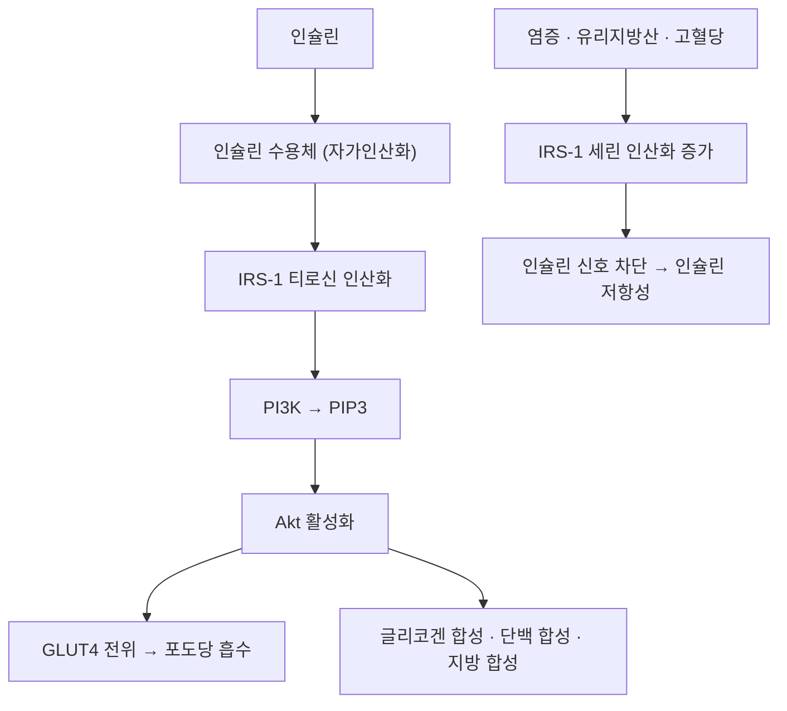

# 🧬 IRS-1 (Insulin Receptor Substrate 1)

> **핵심 요약 (Key Summary)**:
> - 📍 **정체**: 인슐린 수용체의 티로신 키나아제가 인산화하는 **어댑터 단백질(기질)**. 인슐린 신호를 세포 내로 전달하는 첫 연결 고리다 (Sun XJ 등, *Nature* 1991;352(6330):73-77, [PMID 1648180](https://pubmed.ncbi.nlm.nih.gov/1648180/)).
> - 🚩 **기전**: 인슐린 → 수용체 자가인산화 → **IRS-1 티로신 인산화** → [[PI3K-Akt 경로]] → [[GLUT4]] 전위 → 포도당 흡수. 반대로 **세린 인산화**가 늘면 신호가 꺾여 [[인슐린 저항성]]이 생긴다.
> - 🛠️ **임상 의의**: [[제2형 당뇨병]]의 말초 인슐린 저항성에서 IRS-1 티로신 인산화 감소·세린 인산화 증가가 핵심 분자 변화로 제시된다.
> - ⚠️ **주의**: 한약·본초의 'IRS-1/Akt 강화' 기전은 주로 전임상·세포 실험 수준이다. 임상 효능으로 확대 해석하지 않는다.

---

## 📌 목차
1. [정의 & 구조](#1-정의--구조)
2. [기능·기전](#2-기능기전)
3. [임상 의의](#3-임상-의의)
4. [논문 연결](#4-논문-연결)
5. [함께 보기](#5-함께-보기)

---

## 1. 정의 & 구조

* **정의**: 인슐린 수용체 기질 계열(IRS-1~4)의 대표 분자. 인슐린·[[IGF-1]] 수용체 활성화 시 티로신 인산화되어 하위 신호를 개시하는 어댑터 단백질
* **도메인**: N말단 PH(플렉스트린 상동) 도메인 + 인산화 티로신 결합(PTB) 도메인 + 다수의 티로신 인산화 부위
* **발현**: 골격근·지방세포·간 등 인슐린 표적 조직에 광범위하게 발현

---

## 2. 기능·기전

* **정상 경로**: 인슐린 → 수용체 → IRS-1 티로신 인산화 → [[PI3K-Akt 경로]] → [[GLUT4]] 전위·글리코겐 합성·단백 합성
* **저항성 경로**: 염증·유리지방산·고혈당이 **IRS-1 세린 인산화**를 유발하면 티로신 인산화·PI3K 결합이 억제되어 신호가 꺾인다

---

## 3. 임상 의의

* [[제2형 당뇨병]]: 골격근·간에서 IRS-1 티로신 인산화 감소·세린 인산화 증가가 [[인슐린 저항성]]의 분자 표지로 제시된다
* [[GLUT4]] 연결: IRS-1 → PI3K-Akt → GLUT4 전위가 말초 포도당 이용의 최종 단계다
* **본초 기전 해석**: [[홍삼]] [[진세노사이드]]가 IRS-1/Akt 인슐린 신호를 강화해 인슐린 감수성을 개선한다는 기전이 제안됐다 (전임상·기계론 수준) — [PMID 42395024](https://pubmed.ncbi.nlm.nih.gov/42395024/)
* **운동**: 근수축은 AMPK 경로로 GLUT4를 전위시켜, IRS-1 경로와 **독립적으로** 포도당 흡수를 늘린다

---

## 4. 논문 연결

1. **Sun XJ, Rothenberg P, Kahn CR, et al. (1991)**. *Structure of the insulin receptor substrate IRS-1 defines a unique signal transduction protein*. **Nature**, 352(6330):73-77. [PMID 1648180](https://pubmed.ncbi.nlm.nih.gov/1648180/)
   - **[연구 요약]**: IRS-1의 구조를 규명해 인슐린 신호전달의 어댑터 단백질 개념을 확립한 원 논문.
2. **Nam JS, et al. (2026)**. *Efficacy and safety of Korean red ginseng as adjunctive therapy in type 2 diabetes mellitus*. **Journal of Ginseng Research**, 2026;50(4):101068. [PMID 42395024](https://pubmed.ncbi.nlm.nih.gov/42395024/)
   - **[연구 요약]**: 홍삼의 인슐린 감수성 개선 기전으로 IRS-1/Akt 신호 강화를 제시(전임상 수준).

---

## 5. 함께 보기
- [[인슐린]] · [[PI3K-Akt 경로]] · [[GLUT4]] · [[AMPK]] · [[인슐린 저항성]] · [[제2형 당뇨병]] · [[진세노사이드]] · [[홍삼]] · [[경구포도당부하검사]]
- 관련 논문: [[2026-10-10_대사노인질환_심층리뷰]] 1번 · [[2026-10-10_대사노인질환_개념학습]]
