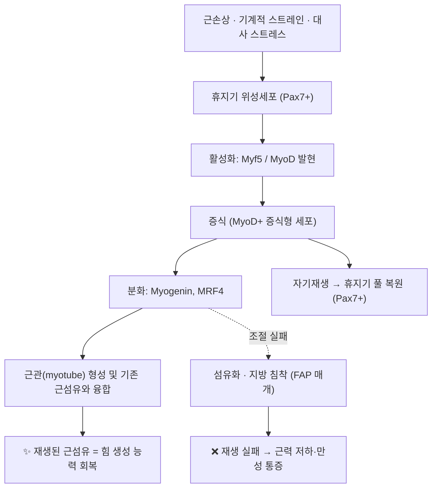

# 🔬 [[위성세포]] (Satellite cell)

![[위성세포(Satellite cell)_1.jpg|540]]
> [그림 1: ① 병태생리·영상 — Alcian blue and periodic acid Schiff (PAS) stained **histological** sections through the **skeletal muscle** of Pe]

![[위성세포(Satellite cell)_2_1.jpg|540]]
> [그림 2: ② 관련 해부 구조물 — Muscle Tissue Skeletal Muscle Fibers (28089114338).jpg]

![[위성세포(Satellite cell)_3_1.jpg|540]]
> [그림 3: ③ 치료·시술점 — Research in progress (IA researchinprogre00howa 0).pdf]

> **핵심 요약 (Key Summary)**:
> [[위성세포]](Satellite cell)는 성숙 [[골격근]]의 근섬유 **근초(sarcolemma)와 기저판(basal lamina) 사이**에 위치하는 상주성 근줄기세포로, [[Pax7]] 발현을 표지자로 삼아 평상시에는 [[휴지기(quiescence)]] 상태로 대기한다.
> 근손상 시 [[Myf5]]·[[MyoD]] 의존적으로 활성화·증식하여 융합(fusion)을 통해 근섬유를 재생하고, 일부는 자기재생(self-renewal)으로 줄기세포 풀을 유지한다([Zammit 2017, PMID: 29127046](https://pubmed.ncbi.nlm.nih.gov/29127046/)).
> 노화·[[근감소증]](sarcopenia)에서는 [[미토콘드리아]] 기능 저하와 니치(niche) 신호 변화로 위성세포 기능이 떨어지며, 최근에는 [[지질나노입자(LNP)]] 기반 CRISPR-Cas9 편집으로 근손상 저항성을 부여하려는 치료 전략이 연구되고 있다([Mochida & Fujimoto 2026, PMID: 41411128](https://pubmed.ncbi.nlm.nih.gov/41411128/)).

---
## 📌 목차
1. [해부학적 정밀 구조 및 지배 신경/혈관](#1-해부학적-정밀-구조-및-지배-신경혈관)
2. [생체역학·토크 분석 & 근막 사슬 (Biomechanical Synergy)](#2-생체역학토크-분석--근막-사슬-biomechanical-synergy)
3. [근막통증증후군(TP) & 연관통 패턴 (Travell & Simons)](#3-근막통증증후군tp--연관통-패턴-travell--simons)
4. [초음파 해부학(Sonoanatomy) 및 중재 시술 랜드마크](#4-초음파-해부학sonoanatomy-및-중재-시술-랜드마크)
5. [⭐ 원장님 심층 임상 고찰 및 원본 필기 (Clinical Pearls)](#5--원장님-심층-임상-고찰-및-원본-필기-clinical-pearls)
6. [관련 임상 질환 및 운동손상 증후군 총괄](#6-관련-임상-질환-및-운동손상-증후군-총괄)
7. [추나·도수치료(MET/PIR) & 침구·약침·재활 프로토콜](#7-추나도수치료metpir--침구약침재활-프로토콜)
8. [출처 및 학술 참고 문헌 (References)](#8-출처-및-학술-참고-문헌-references)

---
## 1. 해부학적 정밀 구조 및 지배 신경/혈관

위성세포는 "근육 하나"가 아니라 **근섬유에 부착해 사는 단일세포 집단**이므로, 해부학적 기술의 축은 ① 세포가 놓인 미세 구획(니치), ② 그 구획을 공유하는 신경·혈관 요소, ③ 세포를 식별하는 분자 표지자로 재편된다.

| 항목 | 상세 내용 |
| :--- | :--- |
| **위치 (Location)** | 성숙 [[골격근]]에서 근섬유의 **근초(sarcolemma)와 기저판(basal lamina) 사이**의 좁은 틈에 단일 세포층으로 위치. 근섬유당 수 개 수준의 소수 집단으로 존재하며, 근섬유 표면을 따라 분포한다. |
| **세포 형태** | 휴지기에는 세포질이 극히 적고 핵이 치우친 방추형. 활성화되면 세포질이 확장되고 [[리보솜]]·[[미토콘드리아]]가 증가하여 증식형(activated/proliferating)으로 변모한다. |
| **분자 표지자** | [[Pax7]] — 휴지기·활성화 위성세포 모두에서 발현되는 대표 표지자. 활성화 시 [[Myf5]], [[MyoD]]가 순차 발현되고, 분화 단계에서 [[Myogenin]], 성숙 단계에서 [[MRF4]]가 관여한다([Zammit 2017, PMID: 29127046](https://pubmed.ncbi.nlm.nih.gov/29127046/)). |
| **니치(Niche) 구성** | 기저판(라미닌·콜라겐 IV), 근섬유 자체, [[섬유-지방 전구세포(FAP)]]·[[대식세포]]·혈관주위세포·운동신경 말단이 니치를 이룬다. 단일세포 RNA 시퀀싱 연구에서 위성세포와 [[섬유-지방 전구세포]] 사이의 **FGF7 신호 매개 상호작용**이 새롭게 보고되었다([Ma & Meng 2024, PMID: 38751367](https://pubmed.ncbi.nlm.nih.gov/38751367/)). |
| **신경 지배** | 위성세포 자체는 운동신경의 직접 지배를 받지 않는다. 다만 [[운동신경]] 말단·[[신경근접합부]]와 같은 근섬유 미세환경을 공유하며, 신경 절단(denervation) 후 위성세포 활성 변화가 보고되어 있다(구체적 신경-위성세포 직접 시냅스 유무는 **근거 미확인**). |
| **혈관 공급** | 근섬유 주위 [[모세혈관망]]을 통해 산소·영양을 공급받는다. 재생 과정에서 혈관 신생과 위성세포 활성화가 시간적으로 동반된다는 것이 일반적 관찰이나, 제공 논문 범위 내 정량 자료는 **근거 미확인**. |
| **발생 기원** | 체절(somite)의 [[진피근절(dermomyotome)]] 기원으로, 배아기 [[Pax3]]/[[Pax7]] 양성 전구세포가 근육 형성 후 잔존하여 위성세포 풀을 형성한다(발생학 교과서 수준 지식, 제공 논문 범위 밖). |

> ⚠️ 임상적으로 중요한 점: 위성세포는 **조직학적 H&E 염색으로는 식별이 어렵고**, [[Pax7]] 면역염색 또는 단일세포 수준 분석(scRNA-seq)으로 확인한다. 근생검 표본에서 위성세포 수·활성도는 재생 능력의 대리 지표로 쓰인다.

---
## 2. 생체역학·토크 분석 & 근막 사슬 (Biomechanical Synergy)

근육–건–근막 수준의 토크 분석은 위성세포에 직접 적용되지 않는다. 위성세포에서 대응되는 개념은 **"세포 수준의 힘-재생 회로"**, 즉 손상 자극 → 활성화 → 증식 → 융합 → 자기재생의 순환이다. 이 순환이 실패하면 근섬유 대신 결합조직·지방이 침착되어 근육의 힘 생성 능력 자체가 영구히 감소한다.

* **근섬유 유형과 재생 역학**: 속근섬유(type II)와 지근섬유(type I)는 손상 취약성과 대사 특성이 달라 재생 반응도 달라질 수 있다. 제공 논문 범위 내 섬유형별 정량 비교는 **근거 미확인**.
* **후성유전학적 조절 (Epigenetic control)**: 위성세포의 운명 결정(휴지 유지 vs 활성화 vs 분화)은 DNA 메틸화, 히스톤 변형, 크로마틴 리모델링, 비암호화 RNA 등 **후성유전학적 기전**으로 조절된다([Massenet & Gardner 2021, PMID: 33431060](https://pubmed.ncbi.nlm.nih.gov/33431060/)). 즉 동일한 유전체를 가진 세포가 니치 신호에 따라 다른 운명을 선택하는 구조이며, 이는 "운동·자극의 종류가 근육 표현형을 바꾼다"는 훈련 원리의 세포학적 기반이 된다. 구체적 히스톤 변형 마크·메틸화 부위는 **원문 확인 필요**.
* **니치-세포 상호작용 (FAP–위성세포 축)**: 단일세포 RNA 시퀀싱으로 위성세포와 [[섬유-지방 전구세포]] 간 **FGF7 신호 매개 상호작용**이 확인되었다([Ma & Meng 2024, PMID: 38751367](https://pubmed.ncbi.nlm.nih.gov/38751367/)). 위성세포-니치 커뮤니케이션이 재생 성공과 섬유-지방 침착 사이의 분기점을 결정한다는 개념으로 해석된다. 리간드 분비 방향(어느 세포가 FGF7을 내고 어느 쪽이 수용하는지)의 세부는 **근거 미확인**.
* **근막 사슬과의 연결**: [[해부학 기차(Anatomy Trains)]]의 사선선·나선선·심부전방선 등 근막 사슬 개념은 거시적 힘 전달 경로를 설명한다. 사슬 상의 만성 과부하는 특정 근군에 반복적 기계적 스트레인을 가하고, 이는 위성세포 활성화의 반복 자극으로 이어진다. 사슬 단위에서의 위성세포 반응 정량 연구는 **근거 미확인**.

---
## 3. 근막통증증후군(TP) & 연관통 패턴 (Travell & Simons)

* **전제 정리**: [[Travell & Simons]]의 [[근막통증증후군]] 체계는 **골격근·근막의 발통점(TrP)과 연관통 패턴**을 다루는 거시적·임상적 모델이다. 위성세포는 세포 수준 개념이므로 **TrP 자체의 발생 부위로 직접 지목되지 않는다**(직접 연관성 **근거 미확인**).
* **개념적 연결 고리**: 발통점이 호발하는 "과사용·만성 과부하 근육"에서는 반복적 미세손상 → 위성세포 활성화 → 재생 실패 시 섬유화·지방 침착이라는 경로가 이론적으로 겹친다. 즉 **위성세포 기능 저하는 만성 근육통의 "조직 기질"을 만드는 요인 중 하나**로 해석할 수 있다. 다만 발통점 내 위성세포 밀도 변화를 정량한 제공 논문은 없다(**근거 미확인**).
* **임상적 시사**: 지연성 근육통(DOMS), 근좌상, 만성 근긴장에서 회복이 지연되는 환자에서는 위성세포 니치 상태(노화, 대사질환, 미토콘드리아 기능 저하)를 함께 고려한다. 이때 치료 목표는 통증 완화(TrP 해소)와 **재생 환경 개선(순환·영양·점진적 부하)** 의 두 축으로 나눈다.
* **연관통 패턴**: 위성세포 단위의 연관통 지도는 존재하지 않으며, 통증 패턴은 해당 근육·발통점의 Travell & Simons 기준을 따른다. 위성세포 관련 통증은 **국소 압통보다 근력 저하·회복 지연·근위축**으로 발현되는 양상이 우세하다.

---
## 4. 초음파 해부학(Sonoanatomy) 및 중재 시술 랜드마크

* **초음파 해상도의 한계**: 위성세포는 크기가 수 ㎛ 수준인 단일세포로 **초음파로 직접 영상화되지 않는다**. 초음파에서 평가하는 것은 위성세포 기능의 **결과 지표**인 근 두께(muscle thickness), 에코 강도(echogenicity), 근주름/섬유 구조(fascicular architecture)이다. 세포 수준 확진은 [[면역조직화학]](Pax7 염색) 또는 [[단일세포 RNA 시퀀싱]]이 필요하다.
* **간접 평가 프로토콜**: ① 근 두께·단면적 측정, ② 에코 강도 증가(지방·섬유 침착 시사), ③ 근육 내 지방 침착 패턴 확인. 노화·근감소증 평가에서 위 지표가 [[미토콘드리아]] 기능 및 위성세포 신호전달 이상과 함께 논의된다([Marzetti & Lozanoska-Ochser 2024, PMID: 38672432](https://pubmed.ncbi.nlm.nih.gov/38672432/)).
* **중재 시술 랜드마크**: 약침·침구 시술 시 위험 구조물(혈관·신경) 회피를 위해 근육 내부 표적과 심부 구조물의 경계를 초음파로 확인한다. 위성세포를 직접 표적하는 임상 시술은 현재 승인된 프로토콜이 없다(**근거 미확인**).
* **실험적 표적 전달 (LNP-CRISPR)**: [[지질나노입자(LNP)]]에 [[CRISPR-Cas9]]을 탑재해 위성세포를 편집하여 근손상 저항성을 부여하는 전략이 전임상 수준에서 보고되었다([Mochida & Fujimoto 2026, PMID: 41411128](https://pubmed.ncbi.nlm.nih.gov/41411128/)). 투여 경로·표적 유전자·국소 주입 랜드마크의 세부는 **원문 확인 필요**.

---
## 5. ⭐ 원장님 심층 임상 고찰 및 원본 필기 (Clinical Pearls)

* **"근육은 근섬유가 아니라 줄기세포가 결정한다"** — 근력이 떨어졌다고 보일 때 근육량만 보지 말고 **회복 이력**을 본다. 회복이 유난히 느린 환자, 같은 부위를 반복적으로 다치는 환자는 위성세포 니치가 불리해진 상태로 생각하고 접근한다.
* **회복 지연 = 경고 신호 3종 세트**: ① 미세손상 후 72시간 이상 지속되는 압통, ② 좌상 반복(연 2회 이상), ③ 근력은 유지되나 근 피로 회복이 느림. 이때는 자극 강도보다 **휴지기(quiescence) 회복 조건**을 먼저 만든다.
* **노화·근감소증 환자의 치료 우선순위**: 미토콘드리아 기능 저하가 위성세포 신호전달을 흐트러뜨린다는 관점에서([[Marzetti & Lozanoska-Ochser 2024, PMID: 38672432](https://pubmed.ncbi.nlm.nih.gov/38672432/)), 유산소성 저강도 자극 + 점진적 저항 훈련 + 영양(단백질·비타민D) 상담을 침 치료와 병행한다. **운동을 "안 시키는" 것도, 한 번에 몰아서 시키는 것도 모두 재생 회로에 불리하다.**
* **후성유전학 관점의 환자 설명 스크립트**: "근육 세포는 유전자가 같아도 켜고 끄는 스위치가 있고, 그 스위치는 반복되는 부하·휴식·대사 환경이 결정합니다"([Massenet & Gardner 2021, PMID: 33431060](https://pubmed.ncbi.nlm.nih.gov/33431060/)). 환자 교육 시 순응도를 높이는 설명으로 유용하다.
* **경혈 선택의 실전 원칙**: 위성세포 재생을 "직접" 자극하는 경혈이 검증된 것은 아니다(**근거 미확인**). 따라서 위(胃)·비(脾)·신(腎) 경 중심의 [[보기생혈]](補氣生血) 접근 + 국소 아시혈(阿是穴) 조합으로 **순환·영양·진통**을 담당시키고, 조직 재생은 부하 관리로 담당시킨다 — 역할을 분리해 생각하는 것이 안전하다.
* **주의**: 위성세포 표적 유전자 편집 치료는 아직 임상 적용 단계가 아니다. 환자에게 "유전자 치료로 근육이 재생된다"고 설명하지 않도록 한다.

---
## 6. 관련 임상 질환 및 운동손상 증후군 총괄

| 임상 질환 / 증후군 | 병리적 연관 기전 | 주요 증상 및 이학적 검사 | 핵심 교정 타깃 |
| :--- | :--- | :--- | :--- |
| [[근감소증]] (Sarcopenia) | 노화에 따른 [[미토콘드리아]] 기능 저하 및 위성세포 신호전달 이상([Marzetti 2024, PMID: 38672432](https://pubmed.ncbi.nlm.nih.gov/38672432/)) | 점진적 근력·근량 저하, 의자 일어서기·보행속도 저하, 악력 감소 | 미토콘드리아 기능 개선, 저항운동, 영양(단백질) |
| [[근좌상]] / 근손상 (Muscle strain) | 기계적 손상 후 위성세포 활성화·융합 실패 또는 지연 | 국소 압통, 신장 시 통증, 근력 저하, 재손상 반복 | 초기 보호 → 점진적 원심성 부하, 순환 개선 |
| [[지연성 근육통]] (DOMS) | 반복적 편심성 수축 후 미세손상과 염증·재생 반응 | 24–72시간 지연성 압통, 관절가동범위 감소 | 부하 조절, 순환 촉진, 회복기 영양 |
| [[섬유-지방 침착]] / 근육 내 지방화 | 위성세포-FAP 상호작용(FGF7 신호) 이상으로 재생 대신 섬유화·지방화([Ma & Meng 2024, PMID: 38751367](https://pubmed.ncbi.nlm.nih.gov/38751367/)) | 근 에코 강도 증가, 근력 대비 기능 저하, 회복 지연 | 니치 환경 개선, 항염·대사 관리 |
| [[듀센 근이영양증]] 등 근이영양증 | 위성세포 자원의 반복적 소진 및 재생 실패(질환별 기전 상이, 제공 논문 범위 내 정량 근거 **미확인**) | 근위부 근력 저하, Gowers 징후, 보행 이상 | 다학제 관리, 재생 능력 보존 |
| [[근위축]] (Disuse atrophy) | 불용(immobilization)·탈신경에 의한 위성세포 활성 저하 가능성(**직접 근거 미확인**) | 둘레 감소, 근력 저하, 근전도 이상 | 조기 가동, 신경근 재교육 |
| 근손상 저항성 (실험적 표적) | LNP-CRISPR-Cas9 기반 위성세포 편집으로 근손상 저항성 부여([Mochida & Fujimoto 2026, PMID: 41411128](https://pubmed.ncbi.nlm.nih.gov/41411128/)) | 해당 없음(전임상 단계) | 연구 단계 — 임상 적용 **미확인** |

---
## 7. 추나·도수치료(MET/PIR) & 침구·약침·재활 프로토콜

* **한의학 경혈 매핑(개념적 연결)**: 위성세포 재생·근육 영양과 연결지어 임상에서 자주 조합되는 혈위 —
  * [[족삼리]](ST36), [[양릉천]](GB34): 하지 근육 위주 접근 시 기본 배혈
  * [[승산]](BL57), [[곤륜]](BL60): 비복근·아킬레스 부위 근손상
  * [[혈해]](SP10), [[격수]](BL17): "혈(血)" 개념의 영양·순환 접근
  * [[신수]](BL23), [[비수]](BL20): 노화·근감소증 환자의 보허(補虛) 접근

  ⚠️ 위 경혈이 위성세포 활성·근 재생을 **직접** 매개한다는 임상 근거는 제공 논문 범위 내에서 확인되지 않는다(**근거 미확인**). 순환 개선·통증 완화·자율신경 조절을 통한 **간접 지원**으로 해석한다.

* **근에너지기법 (MET) / PIR**: 급성 손상 직후 강한 신장은 재생 환경에 불리할 수 있으므로, 초기에는 등척성 수축 위주로 시작하고 호기 시 부드러운 신장을 적용한다. 만성 과부하 근에서는 길항근 억제–주동근 이완 패턴으로 반복 미세손상 고리를 끊는 것을 목표로 한다.
* **전침(電鍼) 및 약침**: 국소 아시혈 + 원위 취혈 조합. 약침은 자침 부위의 통증·순환 관리 목적으로 사용하며, 위성세포 증식이나 근섬유 융합을 촉진한다는 주장은 **임상 근거 미확인**.
* **재활 프로토콜 (단계별 골격)**:
  1. **보호기(0–72시간)**: 통증·부종 조절, 손상 부위 무리한 신장 회피, 필요 시 가벼운 등척성.
  2. **재생기(3일–2주)**: 순환 촉진, 관절가동범위 회복, 저강도 등장성 수축 시작.
  3. **재건기(2–6주)**: 점진적 원심성 부하 — 위성세포 활성화와 융합을 자극하는 핵심 구간.
  4. **복귀기(6주~)**: 기능적·스포츠 특이적 훈련, 재손상 방지.
  각 단계 전환은 **통증이 아니라 기능 지표**(가동범위, 등척성 근력, 일상동작 수행)로 판단한다.
* **노화·근감소증 병행 관리**: 저강도 유산소 + 저항운동 + 단백질 섭취 상담을 병행하며, 미토콘드리아 기능과 위성세포 신호전달 개선이라는 관점에서 접근한다([Marzetti & Lozanoska-Ochser 2024, PMID: 38672432](https://pubmed.ncbi.nlm.nih.gov/38672432/)).

---
## 8. 출처 및 학술 참고 문헌 (References)

1. **Mochida T, Fujimoto N (2026)**. Muscle satellite cell editing by LNP-CRISPR-Cas9 to resist muscle injury. *Cell Rep*. PMID: [41411128](https://pubmed.ncbi.nlm.nih.gov/41411128/)
2. **Massenet J, Gardner E (2021)**. Epigenetic regulation of satellite cell fate during skeletal muscle regeneration. *Skelet Muscle*. PMID: [33431060](https://pubmed.ncbi.nlm.nih.gov/33431060/)
3. **Zammit PS (2017)**. Function of the myogenic regulatory factors Myf5, MyoD, Myogenin and MRF4 in skeletal muscle, satellite cells and regenerative myogenesis. *Semin Cell Dev Biol*. PMID: [29127046](https://pubmed.ncbi.nlm.nih.gov/29127046/)
4. **Marzetti E, Lozanoska-Ochser B (2024)**. Restoring Mitochondrial Function and Muscle Satellite Cell Signaling: Remedies against Age-Related Sarcopenia. *Biomolecules*. PMID: [38672432](https://pubmed.ncbi.nlm.nih.gov/38672432/)
5. **Ma L, Meng Y (2024)**. Single-cell RNA-seq reveals novel interaction between muscle satellite cells and fibro-adipogenic progenitors mediated with FGF7 signalling. *J Cachexia Sarcopenia Muscle*. PMID: [38751367](https://pubmed.ncbi.nlm.nih.gov/38751367/)
6. **Standring, S. (2020)**. *Gray's Anatomy: The Anatomical Basis of Clinical Practice* (42nd ed.). Elsevier.
7. **Travell, J. G., & Simons, D. G. (1999)**. *Myofascial Pain and Dysfunction: The Trigger Point Manual*, Vol. 1.

> 📎 **인용 원칙 메모**: 본 노트의 세포·분자 기전 서술은 위 5편의 제공 논문 범위 내에서 작성하였으며, 제공 논문에서 확인되지 않은 세부 기전·수치·경혈-세포 직접 연관성은 본문에 **근거 미확인**으로 명시하였다.

<!-- 보관 태그(1회용·링크오류, 필요시 복원): Satellite cell, Pax7, Notch, 근줄기세포 -->
