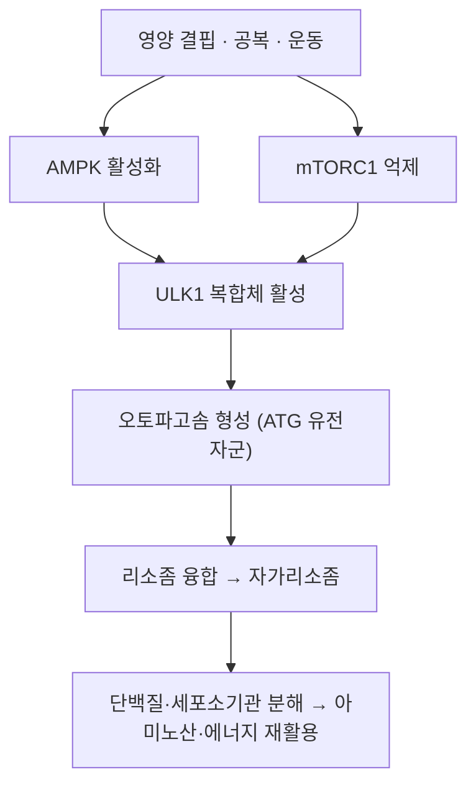

# 🧬 자가포식 (Autophagy)

> **핵심 요약 (Key Summary)**:
> - 📍 **정체**: 세포가 자신의 손상 단백질·노화 세포소기관을 **이중막 소포(autophagosome)로 싸서 리소좀에서 분해·재활용**하는 이화 과정. 세포 내 '재활용·청소' 시스템이다.
> - 🚩 **유도 조건**: 영양 결핍·공복. [[mTOR]] 억제·[[AMPK]] 활성화가 상류 스위치다.
> - 🛠️ **임상 의의**: [[간헐적 단식]]·운동·열량제한에서 증가하며, 노화·신경퇴행·대사질환과 연결된다. 세포 내 이물·병원체를 잡는 포식작용(phagocytosis)과는 다르다 ([[미토파지]]는 미토콘드리아 선택적 자가포식).
> - ⚠️ **주의**: 자가포식은 암에서 양면성을 가진다 — 정상세포 보호와 종양세포 생존에 모두 관여하므로 '무조건 많을수록 좋다'로 설명하지 않는다.

---

## 📌 목차
1. [정의 & 구분](#1-정의--구분)
2. [기전](#2-기전)
3. [생리·임상 의의](#3-생리임상-의의)
4. [논문 연결](#4-논문-연결)
5. [함께 보기](#5-함께-보기)

---

## 1. 정의 & 구분

* **정의**: 세포질 성분(단백질 응집체·세포소기관)을 소포로 격리해 리소좀 효소로 분해하고 구성성분을 재활용하는 이화 경로 (Mizushima N, *Genes Dev* 2007, [PMID 18006683](https://pubmed.ncbi.nlm.nih.gov/18006683/))
* **구분**
  * **대식(macroautophagy)**: 이중막 오토파고솜 → 리소좀 융합. 통상 '자가포식'이라 부르는 것
  * **샤페론 매개 자가포식(CMA)**: 열충격단백질(HSC70)이 기질을 리소좀으로 직접 전달
  * **미세자가포식(microautophagy)**: 리소좀 막이 직접 함입
  * [[미토파지]]: 손상 미토콘드리아를 선택적으로 제거 (PINK1/Parkin)
* **다른 개념과의 구분**: 포식작용(phagocytosis)은 세포 외 이물을 잡아들이는 것으로 기전·목적이 다르다

---

## 2. 기전

* 상류 스위치는 [[mTOR]] 억제 + [[AMPK]] 활성화다. 영양이 풍부하면 mTORC1이 ULK1을 억제해 자가포식을 끈다
* 결과적으로 아미노산·지방산·당이 재활용되어 **에너지·영양 위기에서 세포 생존**을 돕는다

---

## 3. 생리·임상 의의

* **단식·운동과의 연결**: [[간헐적 단식]]의 기전 정리에서 'AMPK 활성·mTOR 억제·자가포식 증가'가 대사 유연성 향상의 축으로 제시된다 — [PMID 40533200](https://pubmed.ncbi.nlm.nih.gov/40533200/) · [PMID 27810402](https://pubmed.ncbi.nlm.nih.gov/27810402/)
* **단백질 항상성**: 이상 단백질 응집(신경퇴행성 질환) 제거와 연관
* **노화**: 세포소기관 품질 관리의 핵심으로, 노화 억제 연구의 주요 표적
* **양면성**: 종양세포는 자가포식을 이용해 항암치료 스트레스에서 생존할 수 있다 → 치료 맥락에서는 촉진·억제가 질환에 따라 갈린다
* **mTOR와의 관계**: 자가포식 증가 = mTOR 억제 = 근단백 합성 감소 방향. 근비대·근력이 목표인 환자에서는 공복 전략과 [[단백질]]·[[저항운동]]을 함께 설계한다

---

## 4. 논문 연결

1. **Mizushima N (2007)**. *Autophagy: process and function*. **Genes & Development**, 21(22):2861-2873. [PMID 18006683](https://pubmed.ncbi.nlm.nih.gov/18006683/)
   - **[연구 요약]**: 자가포식의 분자 과정(ATG 유전자·오토파고솜 형성)과 생리 기능을 정리한 기초 리뷰.
2. **Semnani-Azad Z, et al. (2025)**. *Intermittent fasting strategies and their effects on body weight and other cardiometabolic risk factors*. **BMJ**, 2025;389:e082007. [PMID 40533200](https://pubmed.ncbi.nlm.nih.gov/40533200/)
   - **[연구 요약]**: 단식 기전에서 AMPK 활성·mTOR 억제·자가포식 증가를 언급.
3. **Mattson MP, et al. (2017)**. *Impact of intermittent fasting on health and disease processes*. **Ageing Research Reviews**, 39:46-58. [PMID 27810402](https://pubmed.ncbi.nlm.nih.gov/27810402/)
   - **[연구 요약]**: 단식의 세포 적응(자가포식 포함) 기전 리뷰.

---

## 5. 함께 보기
- [[mTOR]] · [[AMPK]] · [[미토파지]] · [[간헐적 단식]] · [[글리코겐]] · [[케톤체]] · [[산화 스트레스]] · [[지질과산화]] · [[근감소증]]
- 관련 논문: [[2026-10-10_대사노인질환_심층리뷰]] 3번 · [[2026-10-10_대사노인질환_개념학습]]
