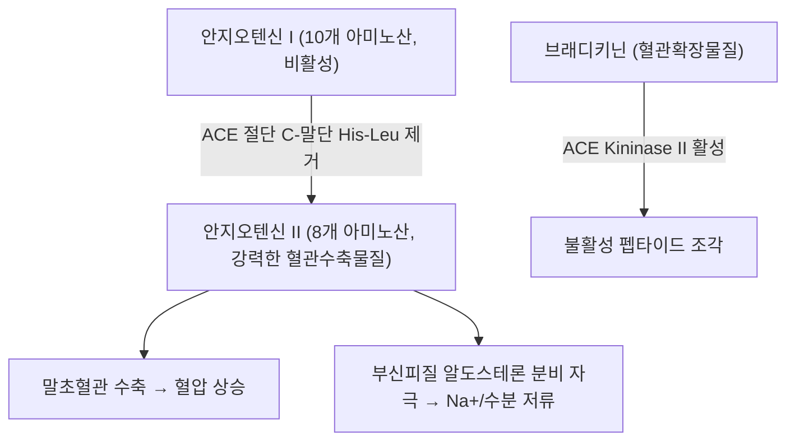

---
aliases:
  - Angiotensin-Converting Enzyme
  - 안지오텐신전환효소
  - 안지오텐신 변환 효소
  - Kininase II
tags:
  - 약리성분
  - 효소
  - RAAS
  - 혈압조절
  - 심혈관계
---

# 🔬 ACE (Angiotensin-Converting Enzyme, 안지오텐신전환효소)

> **핵심 3줄 요약 (Key Summary)**:
> - 🎯 정체: 아연 의존성 금속단백분해효소(zinc metallopeptidase)로, 폐 모세혈관 내피세포 등에 풍부하게 발현하는 막결합형 외막효소(ectoenzyme). 유전자명 *ACE* (17q23.3).
> - ⚙️ 핵심 기능: 레닌-안지오텐신-알도스테론계(RAAS)의 중심 효소로, 비활성 안지오텐신 I(10개 아미노산)에서 C-말단 디펩타이드를 절단해 강력한 혈관수축 물질인 안지오텐신 II(8개 아미노산)를 생성. 동시에 혈관확장 물질인 브래디키닌(Kininase II 활성)을 분해해 불활성화.
> - 🩺 임상적 의의: 혈압 조절의 핵심 표적으로, ACE 억제제(captopril, enalapril, lisinopril 등)가 고혈압·심부전·당뇨병성 신증 등에서 1차 치료제로 널리 사용됨.
> - ⚠️ 유의점: ACE 억제제는 브래디키닌 축적으로 인한 마른기침·혈관부종(angioedema) 부작용을 일으킬 수 있어 임상에서 주의 관찰이 필요.

---

## 📌 목차
1. [기본 정보 (Molecular Identity)](#1-기본-정보-molecular-identity)
2. [구조 및 촉매 기전](#2-구조-및-촉매-기전)
3. [생리적 기능: RAAS와 키닌계](#3-생리적-기능-raas와-키닌계)
4. [조직 분포 & 발현](#4-조직-분포--발현)
5. [관련 질환 & 병태생리](#5-관련-질환--병태생리)
6. [약물 표적으로서의 ACE (ACE 억제제)](#6-약물-표적으로서의-ace-ace-억제제)
7. [한의학적 연계](#7-한의학적-연계)
8. [출처 및 학술 참고 문헌 (References)](#8-출처-및-학술-참고-문헌-references)

---

## 1. 기본 정보 (Molecular Identity)

| 항목 | 상세 내용 |
| :--- | :--- |
| **공식 명칭** | Angiotensin I-Converting Enzyme (Peptidyl-dipeptidase A) |
| **유전자명** | *ACE* (17q23.3) |
| **UniProt ID** | [P12821](https://www.uniprot.org/uniprotkb/P12821/entry) |
| **효소 분류 (EC)** | EC 3.4.15.1 (금속카복시펩티다아제, Zn²⁺ 의존성) |
| **동의어** | Kininase II, Peptidyl-dipeptidase A, CD143 |
| **주요 발현 부위** | 폐 혈관 내피세포(가장 풍부), 신장 근위세뇨관, 혈관 내피세포 전반, 정소(생식기형 ACE) |

---

## 2. 구조 및 촉매 기전

인체 ACE(체성형, somatic ACE)는 서로 약 60%의 아미노산 서열 유사성을 공유하는 두 개의 상동 촉매 도메인(N-도메인, C-도메인)을 가진 단일 폴리펩타이드로, 각 도메인마다 보존된 아연결합모티프(HExxH)를 포함합니다. 아연 이온이 두 개의 히스티딘 잔기와 하나의 글루탐산 잔기에 배위 결합하여 활성 부위를 형성하며, 이를 통해 기질의 C-말단에서 디펩타이드를 절단하는 카복시펩티다아제 활성을 나타냅니다.

---

## 3. 생리적 기능: RAAS와 키닌계

* **안지오텐신 전환**: 신장에서 분비된 레닌이 안지오텐시노겐을 안지오텐신 I로 전환하면, ACE가 폐 모세혈관을 통과하는 혈액에서 안지오텐신 I의 C-말단 히스티딜-류신(His-Leu)을 제거해 안지오텐신 II를 생성합니다.
* **혈압 상승 기전**: 안지오텐신 II는 AT1 수용체를 통해 강력한 혈관수축, 부신피질 알도스테론 분비 촉진(Na⁺·수분 재흡수 증가), 교감신경 활성화 등을 유발하여 혈압을 상승시킵니다.
* **브래디키닌 분해(Kininase II 활성)**: ACE는 동시에 혈관확장·이뇨 작용을 하는 브래디키닌을 분해해 불활성화함으로써, 혈관수축 방향과 혈관확장 억제 방향 모두에서 혈압을 높이는 이중 기전으로 작용합니다.

---

## 4. 조직 분포 & 발현

체성형 ACE는 폐 혈관 내피세포에서 가장 높은 발현을 보이며, 전신 혈관 내피세포, 신장 근위세뇨관 자query세포, 소장 상피 등에도 분포합니다. 정소에는 별도의 짧은 형태인 생식기형 ACE(germinal ACE, gACE)가 발현되어 정자 성숙·수정 과정에 관여합니다.

---

## 5. 관련 질환 & 병태생리

* **고혈압**: RAAS 과활성화는 본태성·이차성 고혈압의 주요 병태생리 기전 중 하나입니다.
* **심부전 & 심근 리모델링**: 만성적인 안지오텐신 II 과다는 심근 비대·섬유화를 촉진해 심부전 진행에 관여합니다.
* **당뇨병성 신증**: 사구체 내압 상승과 관련해 ACE 억제제/ARB가 신장 보호 목적으로 사용됩니다.
* **ACE 유전자 다형성(I/D polymorphism)**: 삽입/결실(I/D) 다형성이 혈중 ACE 활성 및 일부 심혈관 질환 위험도와 연관된다는 연구가 있으나, 인과관계 및 임상적 활용도는 ⚠️ 내용 검토 필요(연구마다 결과가 상이).

---

## 6. 약물 표적으로서의 ACE (ACE 억제제)

* **대표 약물**: captopril, enalapril, lisinopril, ramipril 등 -pril 계열 ACE 억제제.
* **작용 기전**: 활성 부위 아연 이온에 결합하여 ACE를 경쟁적으로 저해, 안지오텐신 II 생성을 줄이고 브래디키닌 분해를 억제(혈관확장 작용 보강).
* **적응증**: 고혈압, 심부전, 심근경색 후 심장 보호, 당뇨병성/비당뇨병성 신질환의 단백뇨 감소.
* **대표 부작용**: 브래디키닌 축적에 의한 마른기침(약 10~20%), 드물게 혈관부종, 고칼륨혈증, 임신 중 금기(태아 신장 발달 장애).

---

## 7. 한의학적 연계

일부 본초 유래 성분(예: 펩타이드류, 플라보노이드류)이 시험관 내(in vitro) 실험에서 ACE 저해 활성을 나타낸다는 연구들이 보고되어 있으나, 이는 대부분 초기 단계의 스크리닝 연구로 임상적 혈압강하 효과가 확립된 것은 아니므로 ⚠️ 내용 검토 필요로 표기합니다. 개별 본초와의 구체적 연계는 각 본초 노트에서 근거와 함께 별도로 확인이 필요합니다.

---

## 8. 출처 및 학술 참고 문헌 (References)

1. **Acharya KR, Sturrock ED, et al. (2024)**. Advances in the structural basis for angiotensin-1 converting enzyme (ACE) inhibitors. *Bioscience Reports*, 44(8), BSR20240130. PMID: [39046229](https://pubmed.ncbi.nlm.nih.gov/39046229/)
   - **[연구 요약]**: ACE의 N-/C-도메인 구조, 아연결합모티프 촉매 기전, 안지오텐신 I 전환 및 브래디키닌 분해의 이중 기능, ACE 억제제 구조 기반 발전사를 정리한 최신 리뷰.
2. UniProt Knowledgebase — Angiotensin-converting enzyme, Homo sapiens (P12821): [https://www.uniprot.org/uniprotkb/P12821/entry](https://www.uniprot.org/uniprotkb/P12821/entry)
3. GeneCards — ACE Gene: [https://www.genecards.org/cgi-bin/carddisp.pl?gene=ACE](https://www.genecards.org/cgi-bin/carddisp.pl?gene=ACE)
