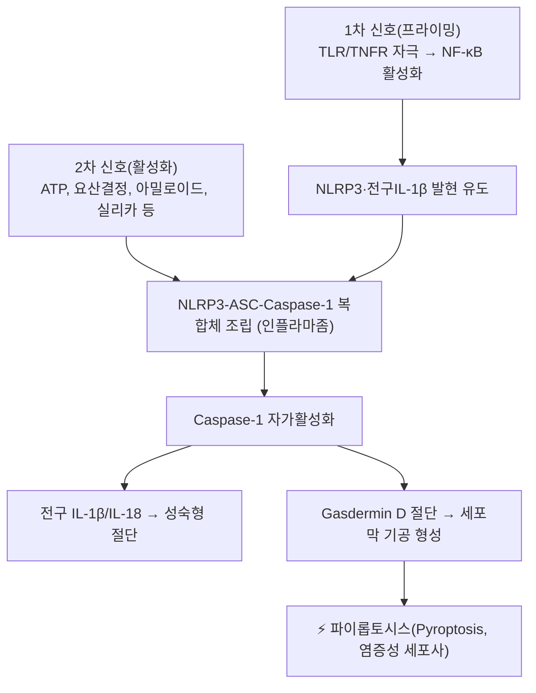

---
aliases:
  - NLRP3 Inflammasome
  - NLRP3 인플라마좀
  - NALP3
  - Cryopyrin
tags:
  - 약리성분
  - 염증
  - 면역
  - 인플라마좀
---

# 🔬 NLRP3 (NLRP3 인플라마좀, NOD-, LRR- and Pyrin domain-containing protein 3)

> **핵심 3줄 요약 (Key Summary)**:
> - 🎯 정체: 선천면역세포(대식세포 등) 세포질 내 위험신호를 감지하는 패턴인식수용체(PRR)로, ASC 어댑터 단백질·caspase-1과 결합해 다단백질 복합체인 "NLRP3 인플라마좀"을 형성. 유전자명 *NLRP3* (1q44).
> - ⚙️ 핵심 기전: 병원체연관분자패턴(PAMP)·손상연관분자패턴(DAMP)에 의한 2단계 활성화(1차 프라이밍 → 2차 활성화 신호)를 거쳐 caspase-1을 활성화하고, 전구 IL-1β·IL-18을 성숙형으로 절단해 분비시키며 gasdermin D 매개 세포막 천공(파이롭토시스)을 유도.
> - 🩺 임상적 의의: 통풍(요산결정), 죽상경화증, 제2형 당뇨병, 알츠하이머병 등 다양한 만성 염증성·대사성 질환의 병태생리에 관여하는 핵심 표적으로 연구되며, IL-1β 차단제(카나키누맙 등)나 NLRP3 억제제(MCC950 등)가 치료제로 개발되고 있음.
> - ⚠️ 유의점: MCC950 등 실험적 NLRP3 저해제는 대부분 전임상/초기 임상 단계이며, 국내 시판 허가된 직접적 NLRP3 표적 치료제는 아직 제한적이므로 특정 본초의 "NLRP3 억제 효능" 주장은 대부분 세포·동물실험 수준임에 유의.

---

## 📌 목차
1. [기본 정보 (Molecular Identity)](#1-기본-정보-molecular-identity)
2. [복합체 구조 및 활성화 2단계 모델](#2-복합체-구조-및-활성화-2단계-모델)
3. [하위 신호전달: IL-1β·IL-18 성숙과 파이롭토시스](#3-하위-신호전달-il-1bil-18-성숙과-파이롭토시스)
4. [관련 질환 & 병태생리](#4-관련-질환--병태생리)
5. [약물 치료 표적으로서의 NLRP3](#5-약물-치료-표적으로서의-nlrp3)
6. [한의학적 연계](#6-한의학적-연계)
7. [출처 및 학술 참고 문헌 (References)](#7-출처-및-학술-참고-문헌-references)

---

## 1. 기본 정보 (Molecular Identity)

| 항목 | 상세 내용 |
| :--- | :--- |
| **공식 명칭** | NLR Family Pyrin Domain Containing 3 (구 명칭: Cryopyrin, NALP3) |
| **유전자명** | *NLRP3* (1q44) |
| **단백질 도메인 구성** | N-말단 파이린 도메인(PYD) — 중심 NACHT 도메인(ATPase) — C-말단 류신-풍부 반복 도메인(LRR) |
| **분류** | 세포질 패턴인식수용체(PRR), NOD-유사 수용체(NLR) 계열 |
| **핵심 파트너 단백질** | ASC(파이린-CARD 도메인 어댑터), Caspase-1(전구효소 형태로 동원·자가활성화) |

---

## 2. 복합체 구조 및 활성화 2단계 모델

* **1차 신호(프라이밍, Priming)**: TLR(톨-유사수용체)이나 TNF 수용체 자극이 NF-κB 경로를 활성화해 NLRP3와 전구 IL-1β의 전사를 유도합니다.
* **2차 신호(활성화, Activation)**: 세포외 ATP, 요산 결정, 콜레스테롤 결정, 아밀로이드-β 응집체, 실리카·석면 입자 등 다양한 위험신호가 세포내 칼륨 유출, 리소좀 파열, 미토콘드리아 활성산소 생성 등을 통해 NLRP3 복합체 조립을 촉발합니다.

---

## 3. 하위 신호전달: IL-1β·IL-18 성숙과 파이롭토시스

활성화된 caspase-1은 전구 IL-1β와 전구 IL-18을 절단해 생물학적으로 활성인 성숙형 사이토카인으로 전환시키고, 동시에 gasdermin D(GSDMD)를 절단해 그 N-말단 조각이 세포막에 기공을 형성하게 합니다. 이 기공을 통해 성숙 IL-1β/IL-18이 세포 밖으로 분비되며, 과도한 기공 형성은 세포 용해를 동반하는 염증성 세포사인 파이롭토시스(pyroptosis)로 이어집니다.

---

## 4. 관련 질환 & 병태생리

* **통풍(Gout)**: 관절 내 요산 결정이 NLRP3를 직접 활성화해 급성 통풍성 관절염의 극심한 염증 반응을 유발합니다.
* **죽상경화증**: 혈관벽 대식세포 내 콜레스테롤 결정 축적이 NLRP3를 활성화해 죽상판 형성·불안정화에 기여한다는 연구가 있습니다.
* **제2형 당뇨병**: 췌장 아밀로이드 응집체 및 유리지방산이 NLRP3를 활성화해 인슐린 저항성·베타세포 손상에 관여한다는 보고가 있습니다.
* **신경퇴행성 질환**: 알츠하이머병 뇌 조직 내 아밀로이드-β 응집체가 미세아교세포의 NLRP3를 활성화한다는 연구가 진행 중입니다.
* **CAPS(Cryopyrin-Associated Periodic Syndromes)**: NLRP3 유전자의 생식세포계 돌연변이로 인한 선천적 자가염증 증후군군으로, 지속적인 인플라마좀 과활성이 원인입니다.

---

## 5. 약물 치료 표적으로서의 NLRP3

* **IL-1β 차단제**: 카나키누맙(단클론항체), 아나킨라(IL-1 수용체 길항제) 등이 CAPS, 통풍성 관절염 등에 임상 사용됩니다.
* **직접 NLRP3 억제제**: MCC950 등 소분자 억제제가 다양한 염증성 질환 동물모델에서 연구되고 있으나, 주로 전임상·초기 임상 단계입니다.

---

## 6. 한의학적 연계

바이칼레인, 방기 유래 성분 등 일부 본초 유래 화합물이 세포·동물 실험에서 NLRP3 인플라마좀 활성을 억제한다는 연구가 보고되어 있습니다(예: [[바이칼레인]], [[목통]], [[방기]] 관련 노트 참고). 다만 이러한 결과는 대부분 시험관·동물 수준이며 임상적 유효성이 확립된 것은 아니므로, 개별 본초의 구체적 효능 주장은 각 본초 노트에서 근거와 함께 별도로 확인해야 합니다.

---

## 7. 출처 및 학술 참고 문헌 (References)

1. **Swanson KV, Deng M, Ting JPY. (2019)**. The NLRP3 inflammasome: molecular activation and regulation to therapeutics. *Nature Reviews Immunology*, 19(8), 477–489. PMID: [31036962](https://pubmed.ncbi.nlm.nih.gov/31036962/)
   - **[연구 요약]**: NLRP3 인플라마좀의 2단계 활성화 모델, 하위 신호전달(IL-1β/IL-18 성숙, 파이롭토시스), 관련 질환 및 치료제 개발 현황을 종합한 대표적 리뷰.
2. GeneCards — NLRP3 Gene: [https://www.genecards.org/cgi-bin/carddisp.pl?gene=NLRP3](https://www.genecards.org/cgi-bin/carddisp.pl?gene=NLRP3)
