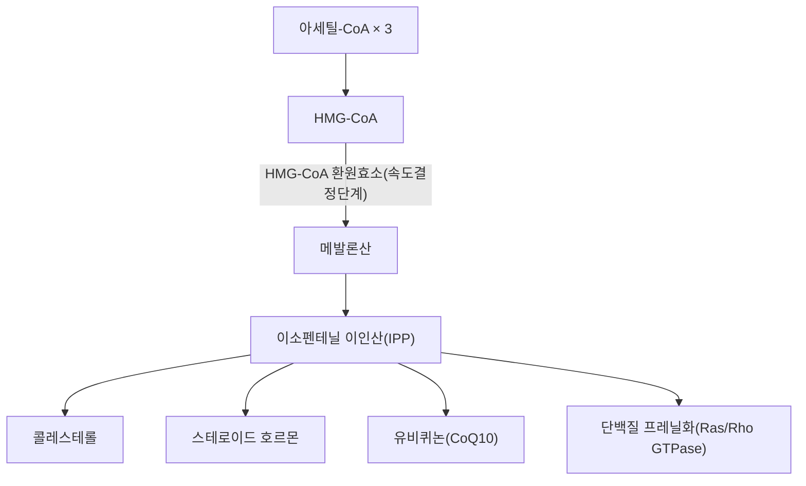

---
aliases:
  - Mevalonic acid
  - Mevalonate
  - 메발론산
tags:
  - 의학개념
  - 대사경로
  - 콜레스테롤
---

# 🧬 메발론산 (Mevalonic acid, Mevalonate)

> **핵심 3줄 요약 (Key Summary)**:
> - 🧪 정의 & 위치: 아세틸-CoA로부터 HMG-CoA 환원효소(HMG-CoA reductase)에 의해 생성되는 6탄소 화합물로, 콜레스테롤·스테로이드 호르몬·유비퀴논·돌리콜 등 모든 이소프레노이드(isoprenoid) 생합성의 필수 중간대사물. 이 경로를 "메발론산 경로(mevalonate pathway)"라 부름.
> - 🎯 핵심 조절 지점: HMG-CoA 환원효소가 메발론산 경로의 속도결정단계(rate-limiting step) 효소로, 스타틴(statin) 계열 약물의 직접적 작용 표적. [[콜레스테롤]] 항상성 조절의 핵심 축.
> - 🩺 임상적 의의: 콜레스테롤 합성 조절을 통한 이상지질혈증 치료(스타틴 기전)뿐 아니라, 이소프레노이드화(prenylation)를 통한 Ras/Rho GTPase 신호 조절, 면역세포 기능, 골대사(비스포스포네이트 기전)와도 연관됨.
> - ⚠️ 참고: 메발론산 자체는 단일 약리성분이라기보다 인체(및 대부분의 진핵생물) 공통의 생화학적 대사 중간체이므로, 본 노트는 대사경로·기전 이해를 위한 의학개념으로 다룹니다.

---

## 📌 목차
1. [기본 화학·생화학 정보](#1-기본-화학생화학-정보)
2. [메발론산 경로 개관](#2-메발론산-경로-개관)
3. [임상적 연계: 스타틴과 콜레스테롤 대사](#3-임상적-연계-스타틴과-콜레스테롤-대사)
4. [출처 및 학술 참고 문헌 (References)](#4-출처-및-학술-참고-문헌-references)

---

## 1. 기본 화학·생화학 정보

> [!abstract]+ 🧪 3D 분자 구조 (Interactive 3D Viewer)
> <iframe src="https://molecule-viewer-rho.vercel.app/?cid=439230" style="width: 100%; height: 600px; border: none; border-radius: 12px; box-shadow: 0 4px 20px rgba(0,0,0,0.15);" allowfullscreen></iframe>

| 항목 | 상세 내용 |
| :--- | :--- |
| **분자식 / 분자량** | C₆H₁₂O₄ / 약 148.16 g/mol |
| **PubChem CID** | [439230](https://pubchem.ncbi.nlm.nih.gov/compound/439230) ((R)-형, 생리활성형) |
| **생성 효소** | HMG-CoA 환원효소(3-hydroxy-3-methylglutaryl-CoA reductase) |
| **분류** | 이소프레노이드 생합성 경로의 핵심 중간대사물 |

---

## 2. 메발론산 경로 개관

메발론산 경로는 아세틸-CoA 3분자가 축합되어 HMG-CoA를 형성하고, 이를 HMG-CoA 환원효소가 메발론산으로 환원시키는 것에서 시작합니다. 이후 여러 단계의 인산화·탈탄산화를 거쳐 이소펜테닐 이인산(IPP)이 생성되며, 이는 콜레스테롤뿐 아니라 스테로이드 호르몬, 유비퀴논(CoQ10), 돌리콜, 그리고 Ras·Rho 계열 GTPase 단백질의 이소프레노이드화(prenylation)에 필요한 모든 이소프레노이드 화합물의 공통 전구체로 사용됩니다.

---

## 3. 임상적 연계: 스타틴과 콜레스테롤 대사

HMG-CoA 환원효소는 메발론산 경로의 속도결정단계 효소로, 스타틴(statin) 계열 고지혈증 치료제([[스타틴]] 노트 참고)가 이 효소를 경쟁적으로 억제하여 간세포 내 콜레스테롤 합성을 감소시키고, 이에 따른 LDL 수용체 발현 증가를 통해 혈중 LDL 콜레스테롤을 낮추는 것이 핵심 작용기전입니다. 또한 메발론산 경로의 산물인 이소프레노이드가 Ras/Rho GTPase의 막 결합(프레닐화)에 필수적이므로, 스타틴은 콜레스테롤 저하 외에도 세포신호 조절을 통한 항염증·면역조절 효과("스타틴의 다면발현 효과", pleiotropic effects)를 나타내는 것으로 논의됩니다.

---

## 4. 출처 및 학술 참고 문헌 (References)

1. **Mevalonate pathway: A review of clinical and therapeutical implications**. *Clinical Biochemistry*. [https://www.sciencedirect.com/science/article/abs/pii/S0009912007001403](https://www.sciencedirect.com/science/article/abs/pii/S0009912007001403)
   - **[연구 요약]**: 메발론산 경로의 생화학적 개관과 임상적 함의를 정리한 리뷰.
2. **Mevalonate Cascade and its Regulation in Cholesterol Metabolism in Different Tissues in Health and Disease**. PMID: [26758949](https://pubmed.ncbi.nlm.nih.gov/26758949/)
   - **[연구 요약]**: 조직별 콜레스테롤 대사에서 메발론산 경로 조절 기전을 정리한 리뷰.
3. PubChem Compound Summary — (R)-(-)-Mevalonic acid (CID 439230): [https://pubchem.ncbi.nlm.nih.gov/compound/439230](https://pubchem.ncbi.nlm.nih.gov/compound/439230)
