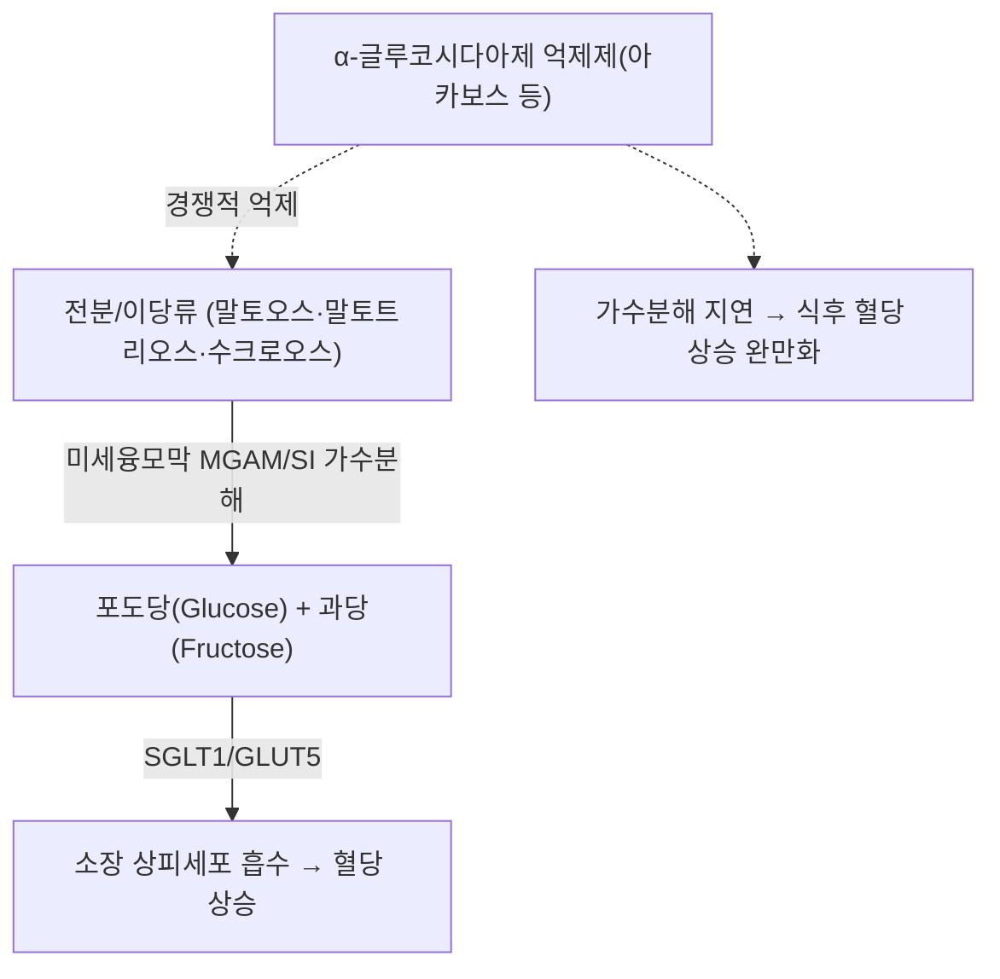

---
aliases:
  - Alpha-glucosidase
  - α-Glucosidase
  - 알파글루코시다아제
  - Maltase-glucoamylase
  - Sucrase-isomaltase
tags:
  - 의학개념
  - 효소
  - 당대사
  - 혈당조절
  - 소화기계
created: 2026-09-18
updated: 2026-09-18
status: complete
---

# 🔬 [[알파-글루코시다아제]] (Alpha-glucosidase, α-Glucosidase)

> **핵심 3줄 요약 (Key Summary)**:
> - 🎯 정체: 소장 융모 미세융모막(brush border)에 발현하는 이당류·올리고당 가수분해 효소군(EC 3.2.1.20)의 총칭. 대표적으로 말타아제-글루코아밀라아제(Maltase-glucoamylase, MGAM)와 수크라아제-이소말타아제(Sucrase-isomaltase, SI) 두 복합효소가 있으며, 이와 별도로 리소좀 내 산성 알파-글루코시다아제(Acid α-glucosidase, GAA)가 존재.
> - ⚙️ 핵심 기능: 소장 미세융모막의 MGAM·SI가 전분 소화의 최종 단계에서 말토오스·말토트리오스·수크로오스 등 이당류·올리고당을 포도당(glucose)·과당(fructose)으로 최종 가수분해해 흡수를 완성함 — 탄수화물 소화의 마지막 관문.
> - 🩺 임상적 의의: α-글루코시다아제 억제제(아카보스, 미글리톨, 보글리보스 등)의 직접 표적으로, 제2형 당뇨병에서 식후 고혈당(postprandial hyperglycemia)을 완화하는 1차 보조 치료제로 사용됨. 리소좀 GAA 유전자(*GAA*) 결손은 별도 질환인 폼페병(Pompe disease, 글리코겐 축적병 II형)을 유발.
> - ⚠️ 유의점: α-글루코시다아제 억제제는 미흡수 이당류가 대장에서 장내세균에 의해 발효되며 가스·복부팽만·연변 등 소화기 부작용을 흔히 유발.

---

## 📌 목차
1. [기본 정보 (Molecular Identity)](#1-기본-정보-molecular-identity)
2. [구조 및 촉매 기전](#2-구조-및-촉매-기전)
3. [생리적 기능: 탄수화물 소화의 마지막 단계](#3-생리적-기능-탄수화물-소화의-마지막-단계)
4. [조직 분포 & 발현](#4-조직-분포--발현)
5. [관련 질환 & 병태생리](#5-관련-질환--병태생리)
6. [약물 표적으로서의 알파-글루코시다아제 (억제제)](#6-약물-표적으로서의-알파-글루코시다아제-억제제)
7. [한의학적 연계](#7-한의학적-연계)
8. [출처 및 학술 참고 문헌 (References)](#8-출처-및-학술-참고-문헌-references)

---

## 1. 기본 정보 (Molecular Identity)

| 항목 | 상세 내용 |
| :--- | :--- |
| **공식 명칭** | Alpha-glucosidase (일반명, 여러 아이소폼의 총칭) |
| **효소 분류 (EC)** | EC 3.2.1.20 (글리코시드 가수분해효소) |
| **대표 아이소폼 ①** | 소장 미세융모막형 — Maltase-glucoamylase(MGAM, 유전자 *MGAM*), UniProt [O43451](https://www.uniprot.org/uniprotkb/O43451/entry) |
| **대표 아이소폼 ②** | 소장 미세융모막형 — Sucrase-isomaltase(SI, 유전자 *SI*), UniProt [P14410](https://www.uniprot.org/uniprotkb/P14410/entry) |
| **대표 아이소폼 ③** | 리소좀형 — Acid α-glucosidase(GAA, 유전자 *GAA*, 17q25.3), UniProt [P10253](https://www.uniprot.org/uniprotkb/P10253/entry) |
| **동의어** | α-Glucosidase, Maltase, Glucoamylase(활성 기준 명칭이 문헌마다 혼용됨) |

---

## 2. 구조 및 촉매 기전

MGAM과 SI는 각각 N-말단·C-말단 두 개의 촉매 도메인을 가진 대형 막결합 당단백질로, 소장 상피세포 미세융모막에 고정되어 관강(lumen) 쪽을 향해 촉매 부위를 노출합니다. 두 효소 모두 α-1,4 글리코시드 결합을 가수분해해 이당류·올리고당의 비환원 말단에서 포도당을 한 분자씩 절단하는 엑소형(exo-type) 글리코시다아제로 작용합니다. 리소좀형 GAA는 세포질 내 리소좀에서 글리코겐의 α-1,4 및 α-1,6 결합을 모두 분해할 수 있는 별도의 효소로, 소장 미세융모막형과는 유전자·발현 위치·기질 특이성이 다릅니다.

---

## 3. 생리적 기능: 탄수화물 소화의 마지막 단계

* **전분 소화의 최종 관문**: 타액·췌장 아밀라아제가 전분을 말토오스·말토올리고당으로 1차 분해한 뒤, 소장 미세융모막의 MGAM·SI가 이를 포도당 단위로 최종 가수분해해야 비로소 SGLT1(나트륨-포도당 공동수송체)을 통한 흡수가 가능해집니다.
* **수크로오스 분해**: SI는 수크로오스(자당)를 포도당과 과당으로 분해하는 유일한 소장 효소로, SI 결손(선천성 수크라아제-이소말타아제 결핍증)은 수크로오스 불내성을 유발합니다.
* **리소좀 GAA의 별도 기능**: 세포질 글리코겐 대사와는 무관하게, 리소좀 내로 유입된 글리코겐을 분해해 리소좀 내 글리코겐 축적을 방지하는 세포 내 항상성 기능을 담당합니다.

---

## 4. 조직 분포 & 발현

MGAM·SI는 소장 상피세포(특히 공장 부위) 미세융모막에서 가장 높은 발현을 보이며, 탄수화물 소화·흡수의 최전선을 담당합니다. 리소좀 GAA는 전신 세포의 리소좀에 보편적으로 존재하나, 특히 골격근·심근에서 결손 시 임상적 영향이 가장 두드러집니다.

---

## 5. 관련 질환 & 병태생리

* **제2형 당뇨병 & 식후 고혈당**: 소장 미세융모막 α-글루코시다아제 활성이 과도하면 식후 혈당이 급격히 상승하며, 이를 약리학적으로 억제하는 것이 당뇨병 관리의 한 축입니다.
* **폼페병(Pompe disease, 글리코겐 축적병 II형)**: *GAA* 유전자 돌연변이로 리소좀 산성 α-글루코시다아제 활성이 결손되면 리소좀 내 글리코겐이 축적되어 근육 약화(특히 심근·호흡근 침범)를 특징으로 하는 상염색체 열성 유전질환이 발생함(PMID 40947720).
* **선천성 수크라아제-이소말타아제 결핍증**: SI 유전자 변이로 수크로오스·전분 소화 장애 및 만성 설사·복부팽만을 유발.

---

## 6. 약물 표적으로서의 알파-글루코시다아제 (억제제)

* **대표 약물**: 아카보스(Acarbose), 미글리톨(Miglitol), 보글리보스(Voglibose) 등 α-글루코시다아제 억제제 계열.
* **작용 기전**: 소장 미세융모막 α-글루코시다아제(MGAM·SI)의 활성 부위에 경쟁적으로 결합해 이당류 가수분해를 지연시킴으로써, 포도당 흡수 속도를 늦추고 식후 혈당 급상승(spike)을 완화함(PMID 8893066, 8549017).
* **임상 근거**: Cochrane 체계적 문헌고찰에서 제2형 당뇨병 환자의 혈당 조절 지표(HbA1c) 개선 효과가 확인되었으나, 다른 경구 혈당강하제 대비 효과 크기는 상대적으로 제한적임(PMID 15616251).
* **대표 부작용**: 미흡수 이당류의 대장 내 장내세균 발효로 인한 가스·복부팽만·연변 등 소화기 증상이 흔함.

---

## 7. 한의학적 연계

여러 본초 유래 플라보노이드·이미노슈가(iminosugar) 성분이 시험관 내(in vitro)에서 α-글루코시다아제 억제 활성을 나타낸다는 연구들이 다수 보고되어 있습니다. 대표적으로 [[상엽]]([[상엽.md|본초 노트]])에 함유된 [[1-DNJ]](1-Deoxynojirimycin)와 플라보노이드 아글리콘이 재조합 말타아제-글루코아밀라아제 아형을 상승적으로 억제함이 확인되었습니다(PMID 32806121). 다만 이러한 in vitro·동물 실험 결과가 인체 임상에서 양약 수준의 혈당강하 효과로 직결되는지는 개별 본초·성분 노트에서 근거 수준과 함께 별도 확인이 필요합니다.

---

## 8. 출처 및 학술 참고 문헌 (References)

1. **(1996)**. *Acarbose: an alpha-glucosidase inhibitor*. Clinical Pharmacy / American Journal of Health-System Pharmacy.
   - [PubMed: PMID 8893066](https://pubmed.ncbi.nlm.nih.gov/8893066/)
   - **[연구 요약]**: 아카보스의 α-글루코시다아제 경쟁적 억제 기전과 제2형 당뇨병 임상 적용을 정리한 초기 리뷰.
2. **(1996)**. *The mechanism of alpha-glucosidase inhibition in the management of diabetes*.
   - [PubMed: PMID 8549017](https://pubmed.ncbi.nlm.nih.gov/8549017/)
   - **[연구 요약]**: 소장 미세융모막 α-글루코시다아제 억제를 통한 식후 혈당 조절의 분자·생리학적 기전을 설명.
3. **(2005)**. *Alpha-glucosidase inhibitors for patients with type 2 diabetes: results from a Cochrane systematic review and meta-analysis*.
   - [PubMed: PMID 15616251](https://pubmed.ncbi.nlm.nih.gov/15616251/)
   - **[연구 요약]**: α-글루코시다아제 억제제 계열의 HbA1c 개선 효과와 부작용 프로파일을 체계적으로 분석한 메타분석.
4. **(2020)**. *Dietary 5,6,7-Trihydroxy-flavonoid Aglycones and 1-Deoxynojirimycin Synergistically Inhibit the Recombinant Maltase-Glucoamylase Subunit of α-Glucosidase and Lower Postprandial Blood Glucose*.
   - [PubMed: PMID 32806121](https://pubmed.ncbi.nlm.nih.gov/32806121/)
   - **[연구 요약]**: 플라보노이드 아글리콘과 1-DNJ가 재조합 말타아제-글루코아밀라아제 아형을 상승적으로 억제해 식후 혈당을 낮춤을 규명.
5. **(2025)**. *Pompe Disease: A Review of Diagnosis, Molecular Genetics, and Treatment Management*.
   - [PubMed: PMID 40947720](https://pubmed.ncbi.nlm.nih.gov/40947720/)
   - **[연구 요약]**: 리소좀 산성 α-글루코시다아제(GAA) 결손에 의한 폼페병의 병태생리·유전학·진단·치료를 종합한 최신 리뷰.
6. UniProt Knowledgebase — Maltase-glucoamylase, Homo sapiens (O43451): [https://www.uniprot.org/uniprotkb/O43451/entry](https://www.uniprot.org/uniprotkb/O43451/entry)
7. UniProt Knowledgebase — Sucrase-isomaltase, Homo sapiens (P14410): [https://www.uniprot.org/uniprotkb/P14410/entry](https://www.uniprot.org/uniprotkb/P14410/entry)
8. UniProt Knowledgebase — Lysosomal acid alpha-glucosidase, Homo sapiens (P10253): [https://www.uniprot.org/uniprotkb/P10253/entry](https://www.uniprot.org/uniprotkb/P10253/entry)

> ⚠️ 확인 불가/추정 표시 총괄: 진료실 임상 필기는 아직 반영되지 않았습니다(비오님 필기 추가 시 다빈치가 다음 순찰에서 정리 예정). 상기 EC 번호·UniProt ID·PMID 5건은 모두 실제 데이터베이스에서 확인된 값입니다.
