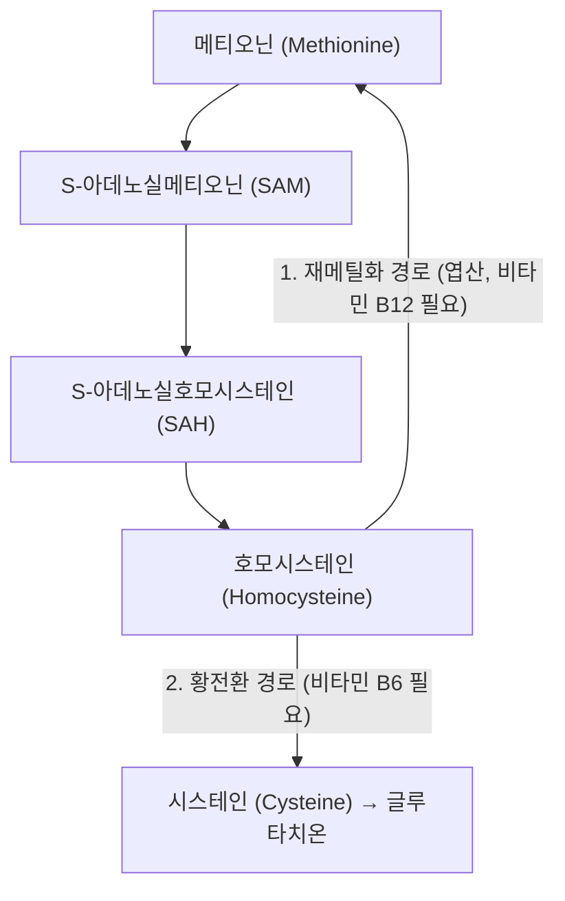
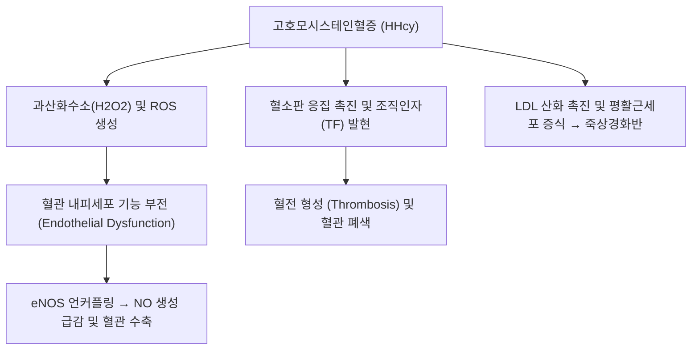

---
aliases:
  - Homocysteine
  - Hcy
  - 고호모시스테인혈증
tags:
  - 분자기전
  - 대사물질
  - 혈관질환
  - 동맥경화
  - 혈전증
  - 어혈
---

# 호모시스테인 (Homocysteine, Hcy)

> 핵심 요약 (Key Summary):
> 필수 아미노산인 메티오닌(Methionine)이 체내에서 대사되는 과정에서 생성되는 황 함유 아미노산 중간체.
> 비타민 B9(엽산), B12, B6의 결핍이나 MTHFR 유전자 변이로 인해 대사가 정체되면 혈중 농도가 15 $\mu\text{mol/L}$ 이상으로 상승(고호모시스테인혈증, Hyperhomocysteinemia).
> 혈관 내피세포의 직접적 산화 손상, 혈전 형성 촉진, LDL 산화 및 동맥경화를 유발하는 심뇌혈관 질환([[중풍]], 심근경색, 치매)의 독립적 핵심 위험 인자이자 현대 한의학적 [[어혈]](瘀血)의 분자 바이오마커.

---

## 1. 생화학적 대사 경로 (Metabolic Pathways)

> [!abstract]+ 🧪 3D 약리 분자 구조 (Interactive 3D Viewer)
> <iframe src="https://molecule-viewer-rho.vercel.app/?cid=778" style="width: 100%; height: 600px; border: none; border-radius: 12px; box-shadow: 0 4px 20px rgba(0,0,0,0.15);" allowfullscreen></iframe>

호모시스테인은 식이 단백질에서 유래한 메티오닌에서 합성되며, 두 가지 주요 경로를 통해 즉시 무독화되어야 합니다:

1. **재메틸화 경로 (Remethylation Pathway - 간 및 전신)**:
   * 메티오닌 합성효소(Methionine synthase, MS)에 의해 메틸기를 다시 받아 메티오닌으로 재생.
   * 필수 보효소: **비타민 B12(코발라민)** 및 **비타민 B9(5-MTHF, 엽산)**. MTHFR(메틸렌테트라하이드로엽산 환원효소)이 핵심 조절 효소.
2. **황전환 경로 (Transsulfuration Pathway - 간 및 신장)**:
   * 시스타티오닌 $\beta$-합성효소(CBS)에 의해 세린과 결합하여 시스타티오닌을 거쳐 항산화제인 글루타치온(Glutathione)의 원료인 시스테인으로 분해.
   * 필수 보효소: **비타민 B6(피리독신)**.

---

## 2. 혈관 독성 및 죽상경화 유발 기전 (Pathophysiology)

### 1) 혈관 내피세포 직접 손상 및 산화질소([[NO]]) 고갈
- 호모시스테인의 자가산화 과정에서 반응성 활성산소(ROS)가 대량 발생하여 혈관 내피를 공격합니다.
- eNOS의 보효소인 $BH_4$를 산화시켜 eNOS 언커플링을 유발, 혈관 확장 물질인 NO 생성을 억제하고 혈관 과긴장성 수축을 초래합니다.

### 2) 혈전 형성 촉진 (Prothrombotic State)
- 응고 인자인 인자 V(Factor V)와 조직인자(TF)의 활성을 촉진하고, 천연 항응고 물질인 단백질 C(Protein C) 활성화를 차단하여 동맥 및 정맥 혈전증을 유발합니다.

### 3) 뇌신경 독성 및 인지 기능 저하
- 신경세포의 NMDA 글루타메이트 수용체를 과활성화하여 칼슘 독성(Excitotoxicity)을 유발하고 뇌혈관 장벽(BBB)을 손상시켜 혈관성 치매 및 알츠하이머병 진행을 가속화합니다.

---

## 3. 임상 기준치 및 질환 연계 (Clinical Significance)

* **혈중 농도 기준치 (Fasting Total Homocysteine)**:
  * 정상: 5~15 $\mu\text{mol/L}$
  * 경도 상승: 15~30 $\mu\text{mol/L}$
  * 중등도 상승: 30~100 $\mu\text{mol/L}$
  * 중증 (호모시스틴뇨증 등): > 100 $\mu\text{mol/L}$
* **주요 호발 질환**:
  * 조기 발병 관상동맥 질환, 뇌졸중([[중풍]]), 심부정맥 혈전증(DVT).
  * 습관성 유산(태반 미세혈전증), 인지 장애 및 노인성 [[치매]].

---

## 4. 한의학적 해석 및 임상 치료 접근

* **어혈(瘀血)과 담음(痰飮)의 현대 분자적 실체**:
  * 한의학에서 혈액 순환 장애와 노폐물 축적으로 정의하는 '어혈(瘀血)'의 병태생리가 혈관 내피 손상 및 혈전증을 유발하는 고호모시스테인혈증과 완벽히 일치합니다.
* **활혈거어(活血祛瘀) 약재의 내피 보호 기전**:
  * [[단삼]] ([[살비아놀산 B]]): eNOS 활성을 회복시켜 호모시스테인으로 손상된 혈관 내피를 복구.
  * [[은행엽]]: 혈소판 응집 억제 및 뇌 미세혈류 촉진.
* **대표 처방 연계**:
  * [[도핵승기탕]], [[혈부축어탕]]: 심뇌혈관 질환 고위험군의 어혈성 혈관 정체 해소.
  * 사물탕 가미방: 조혈 및 엽산·비타민 B군 대사를 보조하는 한양방 융합 치료.

---

## 5. 📚 출처 및 학술 연구 요약 (References)

1. Clarke, R., et al. (1991). "Hyperhomocysteinemia: an independent risk factor for vascular disease." *New England Journal of Medicine*, 324(17), 1149-1155.
   - [연구 요약] 고호모시스테인혈증이 고콜레스테롤혈증 및 흡연과 독립적으로 관상동맥, 뇌혈관, 말초혈관 질환의 강력한 조기 발병 위험 인자임을 최초로 대규모 입증.
2. Seshadri, S., et al. (2002). "Plasma homocysteine as a risk factor for dementia and Alzheimer's disease." *New England Journal of Medicine*, 346(7), 476-483.
   - [연구 요약] 프래밍험 심장 연구(Framingham Study) 코호트 추적을 통해 혈중 호모시스테인 농도가 높을수록 알츠하이머병 및 치매 발생 위험이 2배 가까이 증가함을 규명.
