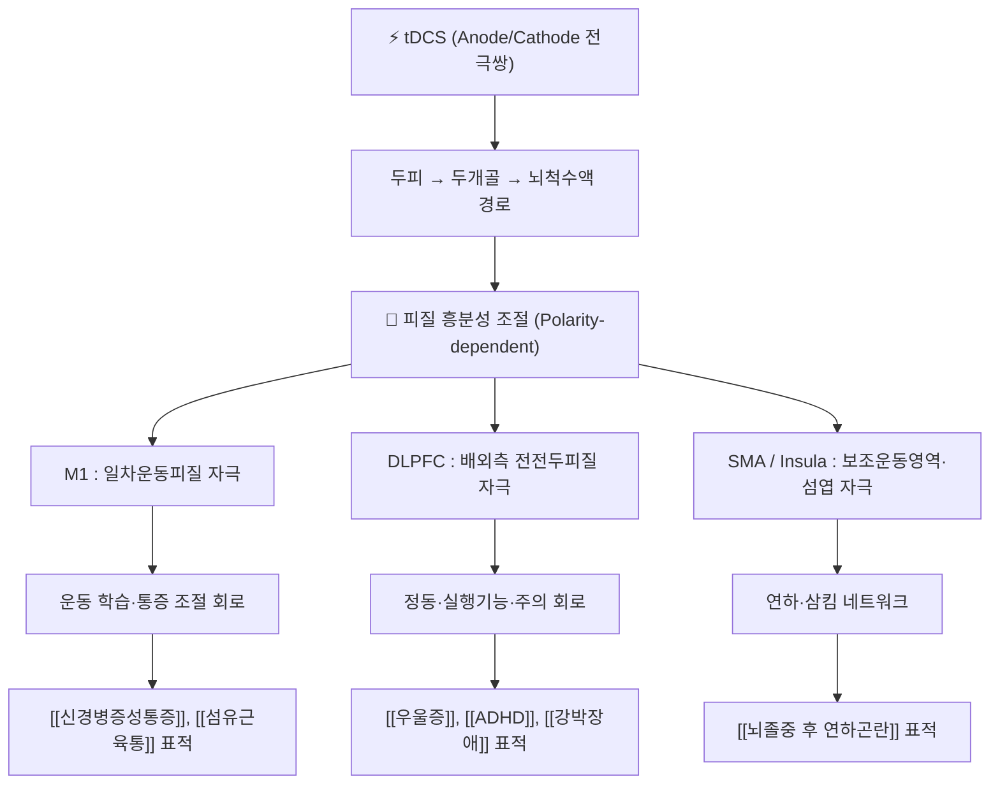

# ⚡ [[tDCS]] (경두개 직류자극 / transcranial direct current stimulation / 經頭蓋直流刺戟)

![[tDCS_1_1.jpg|540]]
> [그림 1: ① 병태생리·영상 — Brain stimulation methods to reduce the seizure symptoms.jpg]

> **핵심 3줄 요약 (Key Summary)**:
> - 🗺️ 자극 원리 & 표적 회로: 두피 위 두 개의 전극(양극 Anode / 음극 Cathode) 사이에 **1~2 mA 수준의 미세 직류 전류**를 흘려, 대뇌피질의 **휴지기 막전위(Resting membrane potential)를 극성 의존적으로 이동**시켜 피질 흥분성을 조절하는 비침습 뇌자극([[Neuromodulation]]) 기법. ① 두개골·두피를 통한 전류 분포, ② 전극 크기·재질·접촉 매질에 따른 전류 밀도(Current density)가 자극 강도를 결정한다.
> - 🎯 표적 네트워크 & 임상 영역: [[일차운동피질]](M1), [[배외측 전전두피질]](DLPFC), [[보조운동영역]](SMA), [[섬엽]](Insula) 등이 주요 표적이며, [[신경병증성통증]], [[섬유근육통]], [[만성통증]], [[뇌졸중 후 연하곤란]], [[소아청소년 정신질환]](우울·ADHD·자폐·강박) 등에서 연구된다.
> - ⚠️ 주요 부작용 & 안전 이슈: 두피 작열감·발적·두통·가려움 등이 가장 흔하고, 경련 병력·두개 내 금속 임플란트·심장박동기·두개골 결손 부위는 **상대적/절대적 주의 대상**. 전극-피부 접촉 저항 상승 시 전류가 국소에 집중되어 화상 위험이 증가하므로 **전극 재질·겔 도포·고정 상태 점검**이 필수.
> - 🔍 주요 평가 & 안전 지표: 통증은 [[NRS]]·[[VAS]]·[[DN4]]·[[PainDETECT]], 기능은 [[FMA]], 연하는 [[침습성 연하검사]]·[[VFSS]], 소아 정신과는 [[CBCL]]·[[CGI]] 등으로 평가. 안전 관리는 전극 저항 점검, 자극 전/중/후 이상감각 문진, 병력 스크리닝(경련·임플란트)으로 구성된다.

---

> [!IMPORTANT]
> **🧪 본 노트의 근거 등급 및 서술 원칙 (Anti-Hallucination Rule)**
> 1. **인용 범위 엄수**: 본 노트의 학술 인용은 상단에 제공된 PubMed 논문 6편(PMID: 38082316 / 37031798 / 33081965 / 30389077 / 39580221 / 34062145)만 사용한다. 출처가 없는 수치·프로토콜·효과크기는 창작하지 않는다.
> 2. **수치 서술 원칙**: 자극 강도·시간·전극 면적 등은 통상적으로 통용되는 범용 원칙과 원문 확인 범위를 구분하여 기술하고, 개별 연구의 구체 수치(예: 특정 mA·분·반응률)는 **원문 미확인 시 '근거 미확인'**으로 명시한다.
> 3. **한의 결합 서술 원칙**: 경혈 전극 배치, 침-tDCS 병용 프로토콜 등 한의학 접목 내용 중 위 6편에서 확인되지 않는 항목은 **'근거 미확인(가설적 임상 응용)'**으로 표기한다.
> 4. **개념 구분**: tDCS는 개별 말초신경이 아니라 **뇌자극 기법(Modality)**이므로, 본 노트는 '신경(Peripheral nerve)' 템플릿 구조를 **'자극 기법 – 표적 회로 – 안전 이슈 – 적응증'** 축으로 재해석하여 유지한다.

---

## 📌 목차
1. [자극 원리 & 전극 배치 해부학 (Mechanism & Montage)](#1-자극-원리--전극-배치-해부학-mechanism--montage)
2. [자극 표적 맵 & 기능 네트워크 (Target Map)](#2-자극-표적-맵--기능-네트워크-target-map)
3. [호발 문제 부위 & 전극·안전 병태생리](#3-호발-문제-부위--전극안전-병태생리)
4. [자극 프로토콜별 적응증 & 임상 효과 매트릭스](#4-자극-프로토콜별-적응증--임상-효과-매트릭스)
5. [관련 평가 도구 & 감별 매트릭스](#5-관련-평가-도구--감별-매트릭스)
6. [한의 신경 치료 프로토콜 (침·전침·약침과의 결합)](#6-한의-신경-치료-프로토콜-침전침약침과의-결합)
7. [💡 사용자 진료실 핵심 필기 & 임상 팁 (원문 보존)](#7--사용자-진료실-핵심-필기--임상-팁-원문-보존)
8. [출처 및 학술 참고 문헌 (References)](#8-출처-및-학술-참고-문헌-references)

---

## 1. 자극 원리 & 전극 배치 해부학 (Mechanism & Montage)

tDCS는 **약물·수술과 달리 두개골을 열지 않고**, 두피에 부착한 전극을 통해 국소적으로 미세한 직류를 흘려보내는 기법이다. 핵심은 "신경을 직접 발화시키는 것"이 아니라 **자극이 지속되는 동안 신경막의 흥분 역치를 이동시켜, 그 이후의 자발적 활동·학습(가소성)을 조절하는 것**이다.

* **전극 극성에 따른 방향성 (Polarity Principle)**:
  * **양극(Anodal, +)**: 전류가 조직 내로 유입되어 피라미드세포의 **탈분극 방향**으로 막전위를 이동시켜 **피질 흥분성 증가** 방향으로 작용한다는 것이 고전적 설명이다.
  * **음극(Cathodal, −)**: 전류가 조직 밖으로 유출되어 **과분극 방향**으로 작용, **피질 흥분성 감소** 방향으로 설명된다.
  * ⚠️ 실제 효과는 자극 시간·강도·전극 위치·개인 두개골 두께·뇌 상태(병변 유무)에 따라 상당히 가변적이며, 단순한 "양극=증가, 음극=감소" 도식이 임상 반응을 전부 설명하지는 못한다. 이 가변성의 구체적 원인·비율은 **근거 미확인**.

* **전기적 파라미터의 기본 골격 (일반 원칙)**:
  * **전류 강도**: 통상 1~2 mA 범위가 임상 연구에서 널리 쓰인다.
  * **자극 시간**: 통상 10~30분(세션당) 범위.
  * **전극 면적**: 통상 25~35 cm² 급의 스펀지 전극이 사용되며, 전극이 작을수록 전류 밀도가 높아진다.
  * **전류 밀도(Current density)**: 전류(mA) ÷ 전극 면적(cm²)으로 계산. 두피 작열감·피부 자극의 주요 결정 인자.
  * ⚠️ 위 수치는 **분야에서 통상적으로 통용되는 범용 범위**이며, 각 개별 임상시험의 정확한 파라미터 값은 본 노트에서 원문 대조하지 않았으므로 **'근거 미확인'**으로 취급한다.

* **전극 재질·형태·접촉 매질 (Electrode Characteristics)**:
  * Solomons CD, Shanmugasundaram V의 리뷰(Med Eng Phys, 2020; PMID: 33081965)는 tDCS 전극의 **재질(금속·고무·스펀지·전도성 폴리머 등), 기하학적 형태, 접촉 매질(젤·식염수), 피부-전극 계면 저항**이 전류 분포와 자극의 재현성에 미치는 영향을 정리하였다.
  * 임상적 함의: 전극 저항이 비균일하면 의도한 전류가 표적 피질이 아닌 **국소 피부 접촉부에 집중**되어 자극 강도가 왜곡되고 피부 자극 위험이 상승한다.
  * 구체적 전극 재질별 임피던스 수치 및 우열 비교는 **원문 미확인**.

* **해부학적 주행 = 전류 경로 (Current Pathway)**:
  * 전류는 전극 A → 두피 → 두개골 → 뇌척수액 → 피질/백질 → 다시 두개골 → 두피 → 전극 B의 경로로 흐른다.
  * **두개골은 전기 저항이 매우 높은 조직**이며, 뇌척수액은 상대적으로 전도성이 높아 전류가 "분류(shunt)"되는 특성이 있다. 따라서 두피 전극 위치가 같아도 개인별 뇌 조직 도달 전류는 동일하지 않다.

---

## 2. 자극 표적 맵 & 기능 네트워크 (Target Map)

### 1) 주요 자극 표적과 기능 축 (Target–Function Axis)

| 자극 표적 | 통상적 전극 위치(국제 10-20 시스템) | 기대되는 기능 축 | 본 노트 인용 논문과의 연결 |
| :--- | :--- | :--- | :--- |
| [[일차운동피질]] (M1) | C3 / C4 부근 | 운동 흥분성, 통증 조절, 운동 재학습 | 신경병증성 통증(PMID: 39580221), 만성통증(PMID: 34062145) |
| [[배외측 전전두피질]] (DLPFC) | F3 / F4 부근 | 정동 조절, 실행기능, 주의 | 소아청소년 정신질환(PMID: 30389077) |
| [[보조운동영역]]·[[섬엽]] | 정중선 인근·측두 피질 인근 | 삼킴(연하) 네트워크 조절 | 뇌졸중 후 연하곤란(PMID: 38082316) |
| 상부 M1–전전두 영역 | 두피 광범위 배치 | 중추 감작·통증 억제 하향성 조절 | 섬유근육통(PMID: 37031798), 만성통증(PMID: 34062145) |

> ※ 위 전극 위치(예: F3, C3)는 **국제 10-20 시스템에 기반한 통상적 임상 관행**을 정리한 것이며, 논문별 정확한 좌표·전극 크기·배치는 본 노트에서 원문 대조하지 않았으므로 **'근거 미확인'**으로 취급한다.

### 2) 자극 후 지속되는 가소성 (After-effect) 개념

* tDCS의 임상적 가치는 자극 중 일시적 흥분성 변화보다 **자극 종료 후 수십 분~수 시간 지속되는 가소성 변화**에 있다는 것이 일반적 설명이다.
* 이 지속 효과는 NMDA 수용체 의존성 기전과 연관된다는 설명이 통용되나, 본 노트 인용 6편의 범위에서는 기전 세부 확인이 어려우므로 **기전 세부 '근거 미확인'**으로 표기한다.
* 임상적 활용: 물리치료·언어치료·인지훈련 등 **행동 치료와의 시간적 결합(priming)**이 효과를 증폭시키는 전략으로 논의된다.

---

## 3. 호발 문제 부위 & 전극·안전 병태생리

신경 노트의 "포착 터널(Entrapment)" 개념을 tDCS에 대응시키면, **"자극이 왜곡되거나 부작용이 집중되는 지점"**이 이에 해당한다.

* **제1 문제 지점 — 전극-피부 계면 (Electrode–Skin Interface)**:
  * 가장 흔한 이상반응은 **두피 작열감(Burning), 발적(Erythema), 가려움, 두통**이다.
  * 병태생리: 접촉 저항이 상승하면(젤 건조, 머리카락 개재, 전극 압박 불균일) 동일 전류에서도 **국소 전류 밀도가 급증**하여 피부 자극·화상 위험이 커진다.
  * 관리: 자극 전 저항 확인, 충분한 전도성 매질 도포, 전극 밀착 균일화, 자극 중 이상감각 즉시 확인 후 중단.
  * 전극 재질·면적·매질이 저항과 전류 분포에 미치는 영향은 Solomons 등(PMID: 33081965)이 정리하였다.

* **제2 문제 지점 — 전류 분포의 비균일성 (Current Shunting)**:
  * 두개골의 높은 저항과 뇌척수액·뇌실계의 낮은 저항으로 인해 전류가 **의도한 피질이 아닌 경로로 분산**될 수 있다.
  * 결과적으로 두피 전극 위치가 동일해도 개인 간·좌우 간 자극 강도가 달라져 **임상 반응의 이질성(Heterogeneity)**이 발생한다. 이 이질성은 여러 체계적 문헌고찰에서 일관되게 지적되는 제한점이다(PMID: 37031798, PMID: 38082316).

* **제3 문제 지점 — 병변 뇌의 비대칭성 (Stroke / Atrophy)**:
  * 뇌졸중 등 병변이 있는 뇌에서는 위축·뇌척수액 공간 확장·두개골 결손 등으로 전류 경로가 정상 뇌와 달라진다.
  * 따라서 **병변 반구 자극 프로토콜**은 정상 대조군 프로토콜을 그대로 이식할 수 없다는 점이 임상적 쟁점이다. 구체적 보정 방법은 **근거 미확인**.

* **안전성 스크리닝 표 (일반 원칙 정리)**:

| 구분 | 항목 | 임상 대응 |
| :--- | :--- | :--- |
| **절대적 주의/금기** | 두개 내 금속 임플란트·전극·코일, 심장박동기 등 이식형 전자기기 | 시행하지 않음(또는 담당 전문의 협진) |
| **절대적 주의/금기** | 두개골 결손 부위 및 그 인접부 전극 배치 | 전극 위치 변경 |
| **상대적 주의** | 경련(발작) 병력, 뇌전증 관련 질환 | 위험-이익 재평가, 의뢰 |
| **상대적 주의** | 임신, 피부 질환·상처 부위, 소아청소년 | 개별 판단, 강도·시간 신중 |
| **흔한 경미 반응** | 작열감, 발적, 두통, 피로, 일시적 집중력 저하 | 자극 강도 조정, 즉시 중단 |

> ※ 위 표는 tDCS 분야에서 통상적으로 통용되는 안전성 권고를 정리한 것이며, 인용 6편 중 안전성 데이터를 정량적으로 제시한 문헌은 소아청소년 정신질환 리뷰(PMID: 30389077)와 만성통증 리뷰(PMID: 34062145) 정도이다. 개별 금기 항목별 발생률 수치는 **'근거 미확인'**.

---

## 4. 자극 프로토콜별 적응증 & 임상 효과 매트릭스

| 적응증 (표적 질환) | 연구 유형 | 인용 논문 | 보고된 방향성 | 근거 수준 및 한계 |
| :--- | :--- | :--- | :--- | :--- |
| **뇌졸중 후 연하곤란** | 메타분석 | Gómez-García N, Álvarez-Barrio L (2023), J Neuroeng Rehabil, PMID: 38082316 | tDCS가 뇌졸중 후 연하 기능 개선에 유리한 방향의 결과를 보고 | 연구 간 자극 프로토콜·평가 도구 이질성, 표본 규모 제한. 세부 효과크기·반응률 **근거 미확인** |
| **섬유근육통** | 체계적 문헌고찰 (tDCS 및 TMS) | Conde-Antón Á, Hernando-Garijo I (2023), Neurologia (Engl Ed), PMID: 37031798 | tDCS·TMS 모두 통증 강도 감소 방향의 결과 보고 | 이질성·소규모 연구 다수, 장기 추적 부족. 표준 프로토콜 미확립 |
| **신경병증성 통증** | 서술적 리뷰 (Neuromodulation 총론) | da Cunha PHM, Lapa JDDS (2024), Int Rev Neurobiol, PMID: 39580221 | 비침습 뇌자극(tDCS/rTMS)을 포함한 신경조절 전략이 신경병증성 통증 관리에 위치함을 정리 | 침습적 조절법(SCS 등)과의 비교·환자 선택 기준은 미확정 |
| **만성 통증 (총론)** | 리뷰 | Knotkova H, Hamani C (2021), Lancet, PMID: 34062145 | 만성 통증 신경조절의 스펙트럼 안에서 tDCS가 비침습적 옵션으로 제시 | 적응증별 근거 강도 편차 큼. 최적 표적·용량 **근거 미확인** |
| **소아청소년 정신질환** | 리뷰 | Lee JC, Kenney-Jung DL (2019), Child Adolesc Psychiatr Clin N Am, PMID: 30389077 | 우울·ADHD·자폐스펙트럼·강박·조현병 등에서 예비적 근거, 전반적 내약성 양호 | 대부분 소규모 개방표지/예비 연구. 성인 프로토콜의 직접 이식 불가 |
| **전극 재질·재현성** | 기기·공학 리뷰 | Solomons CD, Shanmugasundaram V (2020), Med Eng Phys, PMID: 33081965 | 전극 특성이 전류 분포·재현성에 결정적 영향을 미침 | 임상 결과 지표 아님(공학적 근거) |

**프로토콜 운용 시 실무 체크리스트 (일반 원칙)**:
1. **표적 결정**: 통증 축(M1)인지, 정동·인지 축(DLPFC)인지, 연하 축(운동/섬엽 네트워크)인지 먼저 결정.
2. **극성 결정**: 증상 방향에 따라 흥분성 증가/감소 중 어느 방향이 목표인지 설정.
3. **용량 설정**: 강도(mA) × 시간(min) × 전극 면적(cm²) 조합으로 결정. 면적 축소 시 전류 밀도 상승 주의.
4. **병용 설계**: 물리치료·작업치료·언어(연하)치료·인지훈련과의 시간적 결합 여부 결정.
5. **세션 수**: 단회 vs 반복(수 주) 프로토콜 중 선택. 반복 프로토콜의 최적 횟수는 적응증별로 **근거 미확인**.
6. **안전 스크리닝 및 사후 관찰**: 자극 전 저항·병력 확인, 자극 중 이상감각 확인, 자극 후 피부 상태 확인.

---

## 5. 관련 평가 도구 & 감별 매트릭스

| 평가 영역 | 도구/검사 | 측정 내용 | 관련 적응증 | 인용 논문 연결 |
| :--- | :--- | :--- | :--- | :--- |
| 통증 강도 | [[NRS]], [[VAS]] | 주관적 통증 강도 | 섬유근육통, 만성통증 | PMID: 37031798, PMID: 34062145 |
| 신경병증성 통증 특성 | [[DN4]], [[PainDETECT]] | 작열통·저림·이질통 등 신경병증성 성분 | 신경병증성 통증 | PMID: 39580221 |
| 삼킴 기능 | [[VFSS]], [[침습성 연하검사]], 연하 임상척도 | 연하 안전성·침습 여부 | 뇌졸중 후 연하곤란 | PMID: 38082316 |
| 운동 기능 | [[FMA]], [[MAS]] | 상·하지 운동 회복 정도 | 뇌졸중 재활 | PMID: 38082316(간접) |
| 정신·행동 | [[CGI]], [[CBCL]], [[ADHD-RS]] 등 | 정동·행동 증상 중증도 | 소아청소년 정신질환 | PMID: 30389077 |
| 안전성 | 자극 중/후 부작용 문진, 피부 관찰 | 작열감·발적·두통 | 전 적응증 | PMID: 34062145, PMID: 30389077 |

**감별 시 핵심 고려사항**:
* tDCS의 효과는 **위약(Sham) 대조에서 효과크기가 작게 나타나는 경향**이 여러 고찰에서 문제로 지적된다. 따라서 "tDCS 단독"인지 "표준 재활 + tDCS"인지 설계를 명확히 구분해야 한다.
* 통증 질환에서 tDCS는 **약물·주사·신경차단의 대체가 아니라 병용 옵션**으로 위치시켜야 하며, 이것이 만성통증 리뷰(PMID: 34062145) 및 신경병증성 통증 리뷰(PMID: 39580221)의 기본 논조이다.
* 섬유근육통에서는 tDCS와 rTMS가 함께 검토되므로, 두 기법의 선택 기준(환자 선호, 부작용 프로파일, 접근성)을 진료실 차원에서 정해 두는 것이 실용적이다(PMID: 37031798).

---

## 6. 한의 신경 치료 프로토콜 (침·전침·약침과의 결합)

> ⚠️ 아래 내용 중 상단 인용 6편에서 직접 확인되지 않는 항목은 **'근거 미확인(임상 응용 가설)'**로 표기한다.

* **치료 목표 정렬 (Goal Alignment)**:
  * 한의학의 침·전침이 "국소 경락 순환 + 중추 조절"을 목표로 한다면, tDCS는 "피질 흥분성 조절"을 목표로 한다. 진료실에서는 **두 기법을 시간적으로 분리 또는 결합**하여 중추-말초 조절을 함께 노리는 설계가 논의된다. **결합 프로토콜의 우월성은 본 노트 인용 범위에서 근거 미확인.**

* **전침(EA)과의 개념 비교**:
  * 전침은 침 자침 부위에 **교류·맥동 전류**를 흘려 말초 구심성 섬유(특히 Aδ, C섬유) 자극을 통해 하향성 통증 억제를 유도하는 접근으로 설명된다.
  * tDCS는 **직류**로 두피를 통해 피질을 직접 조절한다는 점에서 자극 대상(말초 vs 중추), 전류 파형(맥동 vs 직류), 목표 회로가 다르다.
  * 두 접근의 동일 환자 병용 시 상승효과 여부·최적 순서·간격은 **근거 미확인**.

* **경혈 전극 배치 (가설적 응용)**:
  * 이론적으로 두피 경혈(예: [[백회]](GV20), [[사신총]](EX-HN1), [[풍지]](GB20) 등)이 전극 위치 후보로 거론될 수 있으나, 이는 **국제 10-20 시스템 좌표와 일치하지 않으며**, 인용 6편 어디에서도 경혈 기반 전극 배치를 검증하지 않았다. **근거 미확인.**

* **안전 관행의 결합**:
  * 침 치료의 기본 안전 원칙(금침 부위 확인, 감염 관리)과 tDCS의 안전 원칙(전극 저항·피부 상태·병력 스크리닝)을 **별개의 체크리스트로 관리**할 것을 권한다.
  * 특히 두개골 결손·두개 내 임플란트 환자에서는 침 치료 여부와 무관하게 **tDCS는 시행하지 않는 것이 원칙**이다.

* **문진·평가 통합 예시**:
  1. 통증 질환: 초진 시 [[NRS]]·[[DN4]] 기록 → tDCS 세션 전후 통증 강도 변화 기록 → 2~4주 후 재평가.
  2. 연하곤란: [[VFSS]] 또는 임상 연하평가를 기준선으로 설정 → 재활 프로그램에 tDCS 병용 여부 결정(PMID: 38082316 참조).
  3. 소아청소년 정신질환: 보호자 동의·발달력·경련 병력 확인 후 신중 접근(PMID: 30389077 참조).

---

## 7. 💡 사용자 진료실 핵심 필기 & 임상 팁 (원문 보존)

* **사용자 원문 필기**:
  * (현재 이 노트에 기존 등록된 진료실 원문 필기는 없음 — 추후 실제 임상 메모 발생 시 이 항목에 100% 원문 그대로 보존한다.)
  * 노트 별칭: `tDCS`, `경두개 직류자극`, `경두개직류전기자극`, `transcranial direct current stimulation`
  * 태그: `신경조절`, `비침습 뇌자극`, `tDCS`, `신경병증성통증`, `NeuPSIG`

* **진료실 활용 실무 팁 (일반 원칙 기반)**:
  1. **"tDCS는 단독 치료가 아니다"** — 재활·약물·수기치료의 부가 옵션으로 설명하는 것이 환자 기대 조절에 유리하다.
  2. **부작용 1순위는 두피 작열감** — 시술 전 전극 밀착과 전도성 매질 상태를 확인하고, 시술 중 불편감을 반드시 구두로 확인한다.
  3. **효과 판정 시점** — 단회 자극으로 판정하지 말고, 수 주 반복 후 기능 지표(통증 NRS, 연하 기능, 운동 기능)로 재평가한다.
  4. **환자 선택의 우선순위** — 경련 병력, 두개 내 금속, 이식형 전자기기 여부를 최우선 스크리닝 항목으로 둔다.
  5. **근거 수준을 정직하게 전달** — 섬유근육통·신경병증성 통증·소아청소년 정신질환 영역은 "예비적 근거" 단계이며, 표준 프로토콜이 확립되어 있지 않다는 점을 환자·보호자에게 설명한다(PMID: 37031798, PMID: 39580221, PMID: 30389077).

* **기록 템플릿 (진료 차트용)**:
  * `[tDCS 세션] 날짜 / 적응증 / 표적(예: 좌 M1) / 극성 / 강도(mA) / 시간(min) / 전극 면적(cm²) / 병용치료 / 자극 중 이상반응(무·작열감·두통 등) / 자극 후 피부 소견 / 직후 평가 지표`

---

## 8. 출처 및 학술 참고 문헌 (References)

1. **Gómez-García N, Álvarez-Barrio L (2023)**. *Transcranial direct current stimulation for post-stroke dysphagia: a meta-analysis*. **J Neuroeng Rehabil**. **PMID: 38082316**
   - **[연구 요약]**: 뇌졸중 후 연하곤란 환자를 대상으로 tDCS의 효과를 메타분석한 연구. tDCS가 연하 기능 개선에 유리한 방향의 결과를 보고하였으며, 프로토콜·평가도구의 이질성과 표본 규모가 주요 제한점으로 지적된다.
2. **Conde-Antón Á, Hernando-Garijo I (2023)**. *Effects of transcranial direct current stimulation and transcranial magnetic stimulation in patients with fibromyalgia. A systematic review*. **Neurologia (Engl Ed)**. **PMID: 37031798**
   - **[연구 요약]**: 섬유근육통 환자에서 tDCS 및 TMS의 효과를 체계적으로 고찰. 두 기법 모두 통증 강도 감소 방향의 결과가 보고되었으나 연구 간 이질성과 장기 추적 부족이 한계로 정리되었다.
3. **Solomons CD, Shanmugasundaram V (2020)**. *Transcranial direct current stimulation: A review of electrode characteristics and materials*. **Med Eng Phys**. **PMID: 33081965**
   - **[연구 요약]**: tDCS 전극의 재질·형태·접촉 매질이 전류 분포, 피부-전극 계면 저항, 자극 재현성에 미치는 영향을 정리한 공학적 리뷰. 자극 왜곡과 피부 자극 위험 관리의 근거가 된다.
4. **Lee JC, Kenney-Jung DL (2019)**. *Transcranial Direct Current Stimulation in Child and Adolescent Psychiatric Disorders*. **Child Adolesc Psychiatr Clin N Am**. **PMID: 30389077**
   - **[연구 요약]**: 소아청소년 정신질환(우울, ADHD, 자폐스펙트럼, 강박, 조현병 등)에서 tDCS의 적용 근거와 안전성·내약성을 정리. 대부분 예비적 근거 수준이며 성인 프로토콜의 직접 이식은 제한적임을 시사한다.
5. **da Cunha PHM, Lapa JDDS (2024)**. *Neuromodulation for neuropathic pain*. **Int Rev Neurobiol**. **PMID: 39580221**
   - **[연구 요약]**: 신경병증성 통증에 대한 신경조절 전략을 총론적으로 정리한 리뷰로, 비침습 뇌자극(tDCS/rTMS)이 침습적 조절법과 함께 치료 스펙트럼 내에 위치함을 설명한다.
6. **Knotkova H, Hamani C (2021)**. *Neuromodulation for chronic pain*. **Lancet**. **PMID: 34062145**
   - **[연구 요약]**: 만성 통증에서의 신경조절 기법 전반(척수자극, 뇌심부자극, 운동피질자극, 비침습 자극 등)을 정리한 Lancet 리뷰. tDCS는 비침습적 옵션으로서 적응증별 근거 강도의 편차가 큼을 시사한다.

> **📎 근거 등급 요약**: 본 노트의 인용 문헌은 메타분석 1편(PMID: 38082316), 체계적 문헌고찰 1편(PMID: 37031798), 서술적/총론 리뷰 4편(PMID: 33081965, 30389077, 39580221, 34062145)으로 구성된다. 무작위대조시험 개별 연구, 용량-반응 연구, 신경생리학적 기전 원저는 본 노트에 포함되어 있지 않으므로, 기전 세부 및 정량 파라미터는 **'근거 미확인'**으로 취급한다.