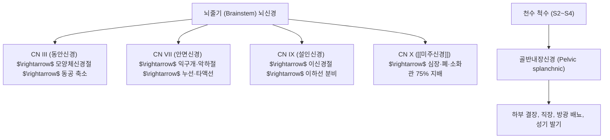
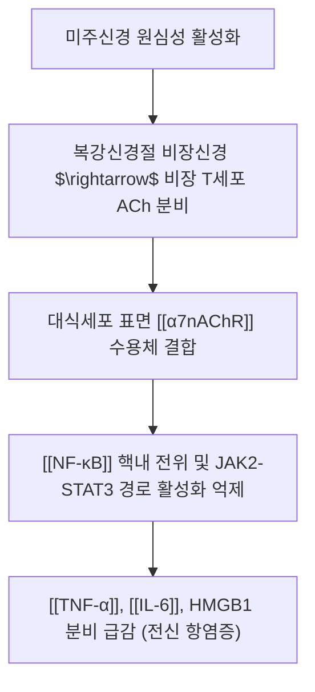

---
aliases:
  - 부교감신경
  - 부교감신경계
  - Parasympathetic nervous system
  - PNS
tags:
  - 의학개념
  - 신경생리
  - 자율신경
  - 미주신경
  - 아세틸콜린
---
# 🌿 [[부교감신경]] (Parasympathetic Nervous System, PNS)

> **핵심 요약 (Key Summary)뇌분과(Cranial outflow)**와 **천수분과(Sacral outflow)**의 뇌천수계로 구성됩니다.

* **신경절 구조의 특징 (긴 절전, 극히 짧은 절후)**:
  * **절전 섬유(Preganglionic fiber)**: 기원핵에서 나와 표적 장기 바로 인접부 또는 장기 벽 내부(Intramural ganglion)까지 길게 주행.
  * **절후 섬유(Postganglionic fiber)**: 장기 벽 내 신경절에서 표적 세포까지의 거리가 수 밀리미터(mm)에 불과하여 국소적이고 정밀한 조절 가능 (교감신경의 전신 폭발성 반응과 대비).

---

## 2. 신경전달물질 및 수용체 매핑 (ACh & Receptors)

* **신경전달물질**:
  * 절전 신경과 절후 신경 말단 모두에서 을 분비.
* **수용체 아형 및 표적 장기 분포**:

| 수용체 아형 | 주요 분포 장기 | 세포 내 신호 기전 | 생리적 반응 |
| :--- | :--- | :--- | :--- |
| **M1** | 중추신경계, 위점막 벽세포 | Gq 단백질 ($\text{IP}_3/\text{DAG}$) | 위산 분비 촉진, 인지 기능 |
| **M2** | 심장(동방결절, 방실결절) | Gi 단백질 (cAMP 감소, $\text{K}^+$ 유출) | 심박수 감소(음성 변시), 수축력 억제 |
| **M3** | 평활근(기관지, 방광, 위장관), 외분비선 | Gq 단백질 ($\text{Ca}^{2+}$ 증가, eNOS) | 소화관 연동 촉진, 기관지 수축, 배뇨, 타액·땀 분비 |
| **M4 / M5** | 중추신경계 기저핵, 흑질 | Gi / Gq 단백질 | 도파민 유리 조절, 운동 제어 |

---

## 3. 주요 장기별 생리 기능 (Rest and Digest)

* **심혈관계**:
  * 심박수 감소(Bradycardia), 방실전도 지연, 심박출량 감소로 심장 휴식 및 산소 소비량 절감.
* **소화기계**:
  * 위장관 평활근 연동운동 항진, 오디 괄약근 이완, 소화효소 및 위산·담즙 분비 촉진.
* **호흡기계**:
  * 기관지 평활근 수축 및 점액 분비 증가 (휴식 시 기도 직경 감소).
* **비뇨생식기계**:
  * 방광 배뇨근 수축 및 내요도괄약근 이완으로 배뇨 촉진, 음경 해면체 혈관 확장으로 발기 유도.
* **안구**:
  * 동공괄약근 수축(축동, Miosis) 및 모양체근 수축(근거리 조절).

---

## 4. 미주신경성 콜린성 항염증 경로 (Vagus Anti-inflammatory)

* **신경-면역 인터페이스**:
  * 트레이시(Kevin Tracey) 연구진에 의해 규명된 반사 회로로, 뇌가 미주신경을 통해 체내 과도한 사이토카인 폭풍과 패혈증 반응을 즉각 차단하는 생체 면역 브레이크 역할 수행.

---

## 5. 자율신경 불균형 & 관련 임상 질환

* **부교감신경 저하 (교감신경 과항진)**:
  * 만성 스트레스, 불안장애, 불면증, 고혈압, 기능성 소화불량, 과민성 대장 증후군, 심박변이도(HRV) 저하.
* **미주신경성 실신 (Vasovagal Syncope)**:
  * 급격한 통증, 공포, 기립 시 미주신경이 과도하게 흥분하여 심박수 급감 및 혈관 확장으로 일시적 뇌허혈 유발.

---

## 6. 한의학적 조절 기전 (침구·추나·한약)

* **침구 치료의 미주신경 활성화 기전**:
  * : 심비골신경 자극을 통해 복강신경총-비장 축을 거쳐 미주신경 항염증 경로를 유의하게 가동함이 세계 유수 학술지에 다수 입증.
  * : 정중신경 자극 $\rightarrow$ 연수 고립로핵(NTS)을 통해 미주신경 심장 가지 활성화 $\rightarrow$ 심계항진 진정 및 소화관 운동 정상화.
  * : 이개(귀)의 이갑강(Concha) 부위는 미주신경 이개분지가 직접 분포하는 인체 유일의 체표 부위로, 신문·심혈 자극 시 부교감신경 톤 즉각 상향.
* **추나요법**:
  * **상부 경추 및 후두골 이완(C0-C1-C2)**: 경정맥공(Jugular foramen)을 빠져나오는 미주신경의 물리적 포착 및 두개내 긴장 해소.
  * **천골 추나(S2-S4)**: 골반내장신경 긴장을 완화하여 골반저 기능부전 및 비뇨기 질환 개선.
* **한약 치료**:
  * **자율신경 안정 처방**: [[시호가용골모려탕]], [[온담탕]], [[산조인탕]], [[귀비탕]].

---

## 7. 출처 및 학술 참고 문헌 (References)
* Tracey KJ. The inflammatory reflex. *Nature*. 2002;420(6917):853-859.
  * `[연구 요약]`: 미주신경과 아세틸콜린 매개 콜린성 항염증 경로(CAP)의 분자생물학적 기전 최초 규명.
* Guyton AC, Hall JE. *Textbook of Medical Physiology*. 14th ed. Elsevier, 2021: 761-772.
  * `[연구 요약]`: 자율신경계 부교감신경의 뇌천수계 해부학, 아세틸콜린 수용체 아형 및 장기별 생리 기능 총괄.
