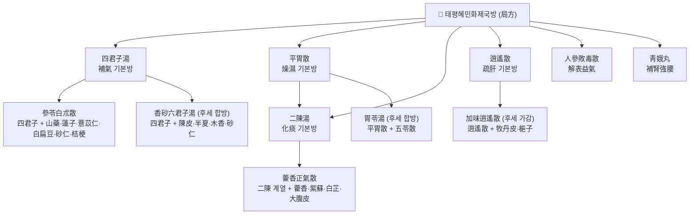

# 🍵 [[태평혜민화제국방]] (太平惠民和劑局方, Taiping Huimin Hejiju Fang)

> **핵심 3줄 요약 (Key Summary)**:
> - 🌿 **모체와 파생**: 北宋 太醫局의 『太醫局方』을 모체로, 관영 제약기구 **惠民和劑局**의 실무 처방집으로 정비된 **관찬(官撰) 방서**. [[四君子湯]] · [[二陳湯]] · [[平胃散]] · [[逍遙散]] · [[人參敗毒散]] · [[藿香正氣散]] · [[四物湯]] · [[靑娥丸]] 등 후대 방제학의 골격 처방을 대거 배출했고, 이후 [[參苓白朮散]] · [[香砂六君子湯]] · [[胃苓湯]] 등으로 가감·합방 파생되었다.
> - 🎯 **임상 최적 적응증**: 14문(門) 분류로 諸風·傷寒·痰飮·諸虛·瀉痢·婦人·小兒 등을 망라하여, **외감 초기 ~ 만성 내상(脾胃·痰濕·肝鬱·氣血虛)** 전반에 걸친 처방을 폭넓게 포진. 진료실에서는 "기본방(四君子·二陳·平胃) + 증상 가감"의 조립식 운용이 핵심이며, 태음인·담습형·비만 경향 환자에서 적중률이 높다.
> - 🔬 **핵심 분자약리 기전**: 대표 처방군에서 **Treg/Th17 균형 회복 및 RORγt/IL-17 축 억제**(人參敗毒散, ALI 모델), **CFTR 매개 염소분비 조절**(參苓白朮散, 설사 모델), **에스트로겐 유사 활성**(靑娥丸), **다중오믹스 기반 해열 기전**(新雪顆粒) 등이 보고되었다. 甘草 배오의 조화 기전은 甘草酸–黃芪 사포닌 병용 연구로 일부 설명된다.
> - ⚠️ 주의사항: 局方은 "散·丸 중심의 溫燥·芳香·補益方"이 많아, 陰虛火旺·實熱·津液虧耗 환자에서 溫燥劑(二陳湯·平胃散·藿香正氣散 계열) 남용 시 구건·변비·설태 박탈이 발생할 수 있다. 또한 辛溫香竄 약재(白芷·紫蘇·藿香 등)는 陰虛血少·임산부에서 신중 투여하며, 방서 특성상 동일 처방명이 卷·門에 따라 구성이 다른 경우가 있어 원문 판본 확인이 필수다.

---
## 📌 목차
1. [기본 서지 정보 & 대표 처방 군신좌사 구성](#1-기본-서지-정보--대표-처방-군신좌사-구성)
2. [방제학적 약재 상호작용 & 시너지 네트워크](#2-방제학적-약재-상호작용--시너지-네트워크)
3. [현대 분자약리학적 효능 & 작용 기전](#3-현대-분자약리학적-효능--작용-기전)
4. [적응 병증 및 체질별 감별 (Sweet Spot vs 금기)](#4-적응-병증-및-체질별-감별-sweet-spot-vs-금기)
5. [유사 처방군 감별 매트릭스](#5-유사-처방군-감별-매트릭스)
6. [임상 가감례 & 현대 질환별 응용](#6-임상-가감례--현대-질환별-응용)
7. [💡 사용자 진료실 핵심 필기 & 임상 팁 (원문 보존)](#7--사용자-진료실-핵심-필기--임상-팁-원문-보존)
8. [출처 및 학술 참고 문헌 (References)](#8-출처-및-학술-참고-문헌-references)
---
## 1. 기본 서지 정보 & 대표 처방 군신좌사 구성

### 1-1. 서지 정보 (Bibliographic Data)

| 항목 | 내용 |
| :--- | :--- |
| **서명(한자)** | 太平惠民和劑局方 (약칭: 局方, 和劑局方) |
| **성립 연대** | 北宋 元豐 연간(1078~1085) 『太醫局方』 편찬 → 大觀 연간(1107~1110) 『太平惠民和劑局方』으로 교정·개칭 → 南宋 紹興 연간(약 1148)·寶慶 연간(약 1225)에 증보·개정 |
| **편찬 주체** | 宋 太醫局 및 惠民和劑局(관영 제약·조제 기구). 교정 작업은 통상 **陳師文·裴宗元·陳承** 등으로 전하며, 판본별 서문·교정자 명단은 차이가 있음 |
| **판본 규모** | 통상 **10권 14문, 약 788방**으로 알려져 있으나, 대관본(5권) → 소흥본·보경본(10권)으로 증보되는 과정에서 권수·문수·방수가 판본마다 다름. **개별 판본의 정확한 방수는 근거 미확인(문헌별 이설 존재)** |
| **수록 제형** | 散劑·丸劑 중심 + 丹·膏·錠·煎·湯. 특히 **煮散**(약재를 거칠게 갈아 달여 복용) 방식이 다용되어, 약재 절약과 복용 편의를 동시에 도모한 실용 처방집의 성격이 강함 |
| **14문(門) 분류** | 諸風 · 傷寒 · 一切氣 · 痰飮 · 諸虛 · 痼冷 · 積熱 · 瀉痢 · 眼目 · 咽喉口齒 · 雜病 · 瘡腫傷折 · 婦人 · 小兒 (증보 과정에서 문 분류·명칭에 차이가 있을 수 있음) |
| **의의** | 宋 이전 산재해 있던 경험방을 **국가 차원에서 표준화·공개**한 최초급 관찬 방서. 이후 [[동의보감]]을 비롯한 동아시아 의서가 局方 계열 처방을 대량 인용하면서 "방제학의 공용 어휘"를 형성 |

### 1-2. 대표 처방의 군신좌사(君臣佐使) 구성

> 局方은 단일 처방이 아니라 **처방집**이므로, 여기서는 局方을 대표하는 핵심 처방 6종의 군신좌사 골격을 정리한다. (문 분류는 판본에 따라 다를 수 있어 별도 표기하지 않음)

| 대표 처방 | 군약 (君藥) | 신약 (臣藥) | 좌약 (佐藥) | 사약 (使藥) | 주치 요지 |
| :--- | :--- | :--- | :--- | :--- | :--- |
| [[四君子湯]] | [[人參]] | [[白朮]] | [[茯苓]] | [[甘草]](炙) | 脾胃氣虛, 面色萎白, 食少便溏 |
| [[二陳湯]] | [[半夏]] | [[陳皮]] | [[茯苓]] | [[甘草]] + [[생강]]·[[오매]] | 痰濕咳嗽, 痰多色白, 胸膈痞悶 |
| [[平胃散]] | [[蒼朮]] | [[厚朴]] | [[陳皮]] | [[甘草]] + [[생강]]·[[대조]] | 濕滯脾胃, 脘腹脹滿, 不思食, 苔白膩 |
| [[逍遙散]] | [[柴胡]] | [[當歸]]·[[白芍]] | [[白朮]]·[[茯苓]]·[[煨薑]] | [[薄荷]]·[[甘草]] | 肝鬱血虛, 兩脇作痛, 月經不調, 神疲 |
| [[人參敗毒散]] | [[羌活]]·[[독활]] | [[柴胡]]·[[川芎]] | [[枳殼]]·[[桔梗]]·[[前胡]]·[[茯苓]] | [[人參]]·[[甘草]] + [[생강]]·[[薄荷]] | 時氣瘟疫, 憎寒壯熱, 肢體酸痛, 無汗 |
| [[藿香正氣散]] | [[藿香]] | [[紫蘇]]·[[白芷]]·[[半夏]] | [[陳皮]]·[[白朮]]·[[茯苓]]·[[대복피]] | [[桔梗]]·[[厚朴]]·[[甘草]] | 外感風寒·內傷濕滯, 寒熱頭痛, 嘔吐泄瀉 |

> **배오 특징**: 局方의 방제 골격은 대체로 **①補氣·健脾의 四君子系 ②燥濕·理氣의 平胃散系 ③化痰·和胃의 二陳湯系 ④疏肝·養血의 逍遙散系** 네 축으로 요약된다. 각 축은 "君(주 병기 직격) – 臣(보조·강화) – 佐(부작용 억제·수반증 처리) – 使(조화·인경)"의 정형화된 구조를 가지며, 약재 수를 최소화하고 **약재 하나를 더하거나 빼는 것만으로 적응증을 이동**시키는 실용적 설계가 특징이다. 제형 또한 湯劑 일변도에서 벗어나 散·丸을 적극 활용함으로써, 만성·경증 환자의 장기 복용과 휴대·조제 편의를 고려한 **승강출입(升降出入)과 補瀉平衡**을 제형 차원에서 구현했다.

---
## 2. 방제학적 약재 상호작용 & 시너지 네트워크

* **[[人參]] + [[白朮]] 배오 (四君子湯 君臣)**: 氣를 補하는 人參과 脾를 健運하는 白朮의 결합으로, "補氣만 하면 氣滯하고 燥濕만 하면 氣耗한다"는 상반된 편향을 서로 상쇄한다. 여기에 淡渗하는 [[茯苓]]을 佐로 두어 補한 氣가 停滯하지 않고 水濕으로 배출되는 통로를 열고, [[甘草]]가 諸藥을 조화하며 補中之力을 마무리한다.
* **[[半夏]] + [[陳皮]] 배오 (二陳湯 君臣)**: 燥濕化痰의 半夏와 理氣燥濕의 陳皮가 相須 작용하여 "痰은 氣를 따라 움직인다(痰隨氣升降)"는 원리를 구현. 陳皮의 行氣가 半夏의 化痰을 촉진하고, 半夏의 溫燥가 陳皮의 理氣를 痰核까지 전달한다. 佐의 [[茯苓]](健脾渗濕)과 使의 [[甘草]]가 燥性을 완충한다.
* **[[蒼朮]] + [[厚朴]] + [[陳皮]] 배오 (平胃散 君臣佐)**: 濕을 燥하는 蒼朮, 氣를 行하고 脹을 消하는 厚朴, 理氣和中의 陳皮가 3단으로 작동하여 "평(平)하게 胃土를 되돌린다"는 처방명 그대로 胃氣의 停滯를 해소한다.
* **[[柴胡]] + [[當歸]]·[[白芍]] 배오 (逍遙散 君臣)**: 疏肝解鬱의 柴胡와 養血柔肝의 當歸·白芍이 相制 관계를 이루어, 氣만 풀면 血이 상하고 血만 補하면 氣滯가 심해지는 딜레마를 동시에 해결한다.
* **[[羌活]]·[[독활]] + [[人參]] 배오 (人參敗毒散)**: 解表散寒의 辛溫 약재에 益氣扶正의 人參을 더한 **"역(逆)발한 설계"** — 허약자가 外感을 앓을 때 發汗만 하면 正氣가 탈출하므로, 人參으로 正氣를 지지하며 表를 열어 邪를 몰아낸다.
* **[[補骨脂]]·[[杜仲]]·[[核桃肉]] + [[大蒜]] 배오 (靑娥丸)**: 補腎強腰의 약재군에 通陽散結의 大蒜을 佐로 넣어, 補益劑가 滯하지 않도록 溫通의 통로를 확보한 局方 특유의 설계.

---
## 3. 현대 분자약리학적 효능 & 작용 기전

### 1) 면역 균형 조절(Treg/Th17) 및 급성 폐손상(ALI) 완화
* **[[人參敗毒散]] (Renshen Baidu Powder)** — PMID: 41997441 연구에서 LPS로 유도된 급성 폐손상(ALI) 모델에서 **RORγt/IL-17 신호경로 억제** 및 **Treg/Th17 균형 회복**을 통해 폐손상을 완화하는 것으로 보고되었다. 즉 局方의 "益氣解表" 개념이, 염증성 사이토카인 축(IL-17) 억제와 조절 T세포 우세 회복이라는 현대 면역학적 언어로 부분 해석될 수 있음을 시사한다.
* 일반적으로 局方의 補益·化痰 처방군은 **TNF-α, IL-6, IL-1β 등 전염증성 사이토카인 조절** 및 NF-κB/MAPK 경로 억제와 연결되어 보고되는 경우가 많으나, **개별 처방별 정량 데이터는 논문마다 상이하므로 처방 단위 일반화는 근거 미확인**으로 취급한다.

### 2) 장관 이온 수송(CFTR) 조절 및 약물성 설사 개선
* **[[參苓白朮散]] (Shenling Baizhu Powder)** — PMID: 41461327 연구에서 **pyrotinib 유발 설사를 완화**하며, 기전으로 **CFTR 매개 염소분비 활성화**가 제시되었다. 이는 "健脾止瀉"라는 전통 효능이 단순한 장운동 억제가 아니라, **장관 상피의 전해질·수분 수송 정상화**라는 표적을 통해 작동할 가능성을 보여주는 사례다.
* 局方의 瀉痢門 처방들은 대체로 健脾 + 渗濕 + 收斂의 3중 구조를 가지며, 현대적으로는 **장관 흡수/분비 균형, 장점막 장벽 회복** 축으로 재해석할 여지가 있다.

### 3) 내분비 유사 활성(에스트로겐 유사 작용)
* **[[靑娥丸]] (Qing'E formula)** — PMID: 34637969 연구에서 구성 본초 성분의 **에스트로겐 유사 효과(estrogen-like effects)와 생체적합성(biocompatibility)**이 검토되었다. 補腎強腰의 전통 주치가 호르몬 유사 신호전달과 연결될 수 있는 가능성을 시사하나, **인체 임상 지표로의 직접 전이는 근거 미확인**.

### 4) 다중오믹스 기반 해열 기전 규명
* **[[新雪顆粒]] (Xin Xue Granule)** — PMID: 41232629 연구에서 LPS 유발 발열 모델을 대상으로 **멀티오믹스 분석**을 통해 해열의 분자 기전을 해독하였다. 局方系 淸熱·解毒 방제의 현대적 연구 방법론을 보여주는 사례이나, **該 제제와 局方 원문 처방 간의 직접적 계보 관계는 근거 미확인**.

### 5) 甘草 배오(調和諸藥)의 분자적 단서
* **黃芪 사포닌 + 甘草酸 병용** — PMID: 35730909 연구에서 LPS로 유도된 **대식세포 엑소좀이 간성상세포(HSC)를 활성화**시키는 경로를 확인하고, 黃芪 총사포닌과 甘草酸 병용의 개입 효과를 보고하였다. 局方 처방 대부분에 포함되는 [[甘草]]의 "조화제약" 역할이, 엑소좀 매개 세포간 신호 차단이라는 층위에서 일부 설명될 수 있는 단서를 제공한다.

### 6) 포제(炮製) 역사와 제제학적 배경
* **法半夏 炮製史** — PMID: 37935508 연구는 **半夏 炮製(法半夏)의 역사**를 고찰하였다. 局方에는 半夏를 사용한 처방이 다수 수록되어 있고, 송대 관영 제약 체계에서의 炮製·修治 관행이 局方의 제제 규격과 밀접하게 맞물려 있다는 점에서 참고 가치가 있다. 다만 **해당 논문의 세부 연대·결론(炮製法의 기원 시점 등)은 제공된 데이터로는 확인 불가(근거 미확인)**.

---
## 4. 적응 병증 및 체질별 감별 (Sweet Spot vs 금기)

### [✅ 최적 적응증 (Sweet Spot)]
* **원전 조문 성격**: 局方은 단일 조문이 아니라 14문 전반에 걸친 처방 모음이므로, "특정 조문 하나"보다 **문(門)별 주치군**으로 접근한다 — 傷寒門(외감 초기), 一切氣門(기체·소화기), 痰飮門(담습·기침), 諸虛門(만성 허손), 瀉痢門(장관), 婦人門(월경·산후).
* **체질 소견**:
  * **태음인·담습형(비만 경향, 살집 있고 땀 많음, 하복부 비만)**: 平胃散·二陳湯·藿香正氣散 계열이 최적. 舌苔가 白膩하고 脈이 濡緩한 경우 적중률이 높다.
  * **소음인·기허형(마르거나 근육량 적고, 손발 냉, 소화력 저하, 피로감 심함)**: 四君子湯·參苓白朮散·人參敗毒散 계열이 최적. 脈이 細弱하고 舌이 淡한 경우.
  * **소양인·간울형(상체 실하고 예민, 스트레스성 소화불량·월경불순)**: 逍遙散·加味逍遙散 계열이 최적. 脈이 弦細하고 舌邊이 紅한 경우.
* **임상 주치(진료실 최빈 적중 양상)**:
  * 식후 더부룩함 + 무른 변 + 피로 → 四君子湯/參苓白朮散
  * 목감기·몸살 + 오한 + 소화 안 됨 → 藿香正氣散
  * 기침 + 가래 많고 흰색 + 가슴 답답 → 二陳湯
  * 스트레스성 옆구리 결림 + 예민 + 월경 전 증후 → 逍遙散
  * 허약자·노인의 반복 감기 + 몸살 → 人參敗毒散
* **설진/맥진**: 補益方系는 舌淡·苔白·脈細弱, 燥濕化痰方系는 苔白膩·脈濡緩, 疏肝方系는 舌邊紅·脈弦細가 전형적 지표.

### [⚠️ 신중 투여 및 금기 (Caution / Contraindication)]
* **溫燥劑의 오용**: 二陳湯·平胃散·藿香正氣散 계열은 辛溫燥濕하므로, **陰虛火旺(구건·도한·번열·변비)·實熱(고열·갈증·황태)·津液虧耗** 환자에 장기 투여하면 진액을 더 손상시킬 수 있다. 舌紅少苔, 脈細數이면 감량 또는 滋陰 약재 배합이 필요하다.
* **補益劑의 오용**: 四君子湯·參苓白朮散 계열은 氣滯·濕盛·實邪 잔존 상태에서 단독 장기 투여 시 腹脹·식욕부진을 악화시킬 수 있다. "허증이 확인된 뒤에 보한다(先辨虛實)" 원칙 적용.
* **解表劑의 오용**: 人參敗毒散·藿香正氣散은 辛溫解表하므로 **무한(無汗)의 高熱 實熱證(溫病 초기 熱盛), 陰虛發熱**에는 부적합하다. 發汗 과다 시 탈수·심계 항진에 유의.
* **본초 자체의 주의**: 甘草는 다량·장기 복용 시 僞알도스테론증(부종·고혈압·저칼륨) 위험이 있어 고혈압·신장질환·이뇨제 복용 환자에서 감량. 半夏는 반드시 炮製(法半夏 등)하여 사용하며, 生半夏는 금기. 임산부에게는 芳香走竄·活血 약재(川芎·紫蘇 계열 등) 배합 시 신중.
* **양약 병용**: 局方 처방 다수가 散·丸 제형으로 다량 복용되므로, 항응고제(와파린 등) 복용자에서 活血 약재 병용 시 출혈 경향 모니터링이 필요하다. **구체적 상호작용 데이터는 처방별 근거 미확인**.

---
## 5. 유사 처방군 감별 매트릭스

| 문헌 | 편찬 성격 및 시대 | 주치 범위 및 구성 특징 | 활용 관점 차이 |
| :--- | :--- | :--- | :--- |
| [[태평혜민화제국방]] | 北宋~南宋 관찬 방서, 太醫局·惠民和劑局 | 散·丸 중심, 14문 분류, 경험방 표준화 | 처방 조립·가감 중심의 실용 임상 |
| [[상한론]] | 東漢 張仲景 | 六經辨證, 湯劑 중심, 약물 정선·용량 엄격 | 急·중증, 脈證 상관 중시 |
| [[금궤요략]] | 東漢 張仲景 | 雜病·부인과, 病因·병기 서술 정밀 | 만성 잡병의 병기 분석 |
| [[태평성혜방]] | 北宋 992, 王懷隱 등 | 100권 대형 관찬 방서, 병인·증후 서술 방대 | 局方의 전신적 토대, 처방 수 방대 |
| [[성제총록]] | 北宋 1117 | 200권, 이론·치법 종합 | 局方과 시기 근접, 이론성 강함 |
| [[동의보감]] | 朝鮮 1613, 許浚 | 局方 계열 처방 다수 수록·재편집 | 한국 임상 정착형, 처방-증상 매핑 |
| [[온병조변]] | 淸 1798, 吳鞠通 | 衛氣營血 변증, 辛涼解表 | 溫病·열성질환 특화 |

> ⚠️ 표 내부에서는 마크다운 열 구분자 파괴를 방지하기 위해 파이프(`|`)가 들어간 링크를 쓰지 않고 순수한 [[처방명]] 단독 형태로만 작성합니다.

**처방 단위 감별 예시 (補氣·燥濕·化痰 축)**

| 처방명 | 핵심 구성 차이 | 주치 및 체질 차이 | 맥진/설진 차이 |
| :--- | :--- | :--- | :--- |
| [[四君子湯]] | 기준 구성 (人參·白朮·茯苓·甘草) | 순수 氣虛, 전신 피로·식욕부진 | 舌淡苔白, 脈細弱 |
| [[理中湯]] | 人參·白朮·干薑·甘草 (溫中 干薑) | 中焦 寒證, 복냉·설사 | 舌淡 苔白滑, 脈沈遲 |
| [[參苓白朮散]] | 四君子 + 山藥·蓮子·薏苡仁·扁豆·砂仁·桔梗 | 脾虛 兼 濕, 만성 무른 변 | 苔白膩, 脈虛緩 |
| [[平胃散]] | 蒼朮·厚朴·陳皮·甘草 (燥濕 主導) | 濕滯 實證,脘腹脹滿 | 苔白厚膩, 脈濡 |
| [[二陳湯]] | 半夏·陳皮·茯苓·甘草 | 痰濕, 기침·가래 | 苔白膩, 脈滑 |

---
## 6. 임상 가감례 & 현대 질환별 응용

### 6-1. 수반 증상별 가감법 (대표 기본방 기준)
* **四君子湯 기반**
  * 소화불량·복부 팽만 동반 시 → + [[陳皮]]·[[半夏]] ([[六君子湯]])
  * 기체·스트레스성 더부룩함 동반 시 → + [[木香]]·[[砂仁]] ([[香砂六君子湯]])
  * 만성 무른 변·식후 졸림 동반 시 → + [[山藥]]·[[薏苡仁]]·[[砂仁]] ([[參苓白朮散]])
* **二陳湯 기반**
  * 오심·구역·설사 동반 시 → + [[藿香]]·[[紫蘇]]·[[白芷]]·[[대복피]] ([[藿香正氣散]])
  * 열이 동반된 담열 시 → + [[黃芩]]·[[黃連]] (담열 처방으로 전환)
  * 현훈·두통 동반 시 → + [[天麻]]·[[白朮]]
* **平胃散 기반**
  * 小便不利·부종 동반 시 → + [[五苓散]] ([[胃苓湯]])
  * 구역·식욕부진 심할 시 → + [[藿香]]·[[半夏]]
* **逍遙散 기반**
  * 熱感·번조 동반 시 → + [[牧丹皮]]·[[梔子]] ([[加味逍遙散]])
  * 안면 홍조·상열감 동반 시 → + [[牧丹皮]]·[[梔子]]·[[生地黃]]
* **人參敗毒散 기반**
  * 기침·가래 심할 시 → + [[杏仁]]·[[桔梗]] 배량 증량
  * 허약이 심할 시 → + [[黃芪]]·[[白朮]]

### 6-2. 현대 질환별 임상 매핑
* **소화기계**: 기능성 소화불량, 과민성 장증후군(설사형), 만성 위염, 식후 곤비 → 四君子湯·參苓白朮散·平胃散 계열. (PMID 41461327: 參苓白朮散의 약물성 설사 완화 및 CFTR 매개 기전 보고)
* **호흡기계**: 감모(감기), 인플루엔자 초기, 알레르기 비염, 급성 기관지염(담습형) → 人參敗毒散·藿香正氣散·二陳湯 계열. (PMID 41997441: 人參敗毒散의 ALI 완화 및 Treg/Th17 균형 회복)
* **근골격계·신장 허손**: 요슬산연, 만성 요통(신허형), 노인성 근력 저하 → 靑娥丸 계열. (PMID 34637969: 靑娥丸 구성 본초의 에스트로겐 유사 활성·생체적합성 검토)
* **부인과·내분비**: 월경 전 증후군, 월경불순, 스트레스성 호르몬 불균형 → 逍遙散·加味逍遙散·四物湯 계열.
* **약물 부작용·회복기 관리**: 항암 표적치료제 관련 설사, 간섬유화 관련 염증(전임상) → 參苓白朮散, 黃芪·甘草 배합. (PMID 35730909: 대식세포 엑소좀 매개 HSC 활성화 및 黃芪사포닌·甘草酸 병용 개입)
* **열성 질환 보조**: 발열 증후군의 한열 감별 및 해열 보조 접근. (PMID 41232629: LPS 발열 모델 다중오믹스 분석)

> ⚠️ 상기 매핑은 각 처방의 전통 주치와 제공된 전임상·기전 연구를 연결한 **임상 가설적 정리**이며, 개별 적응증에 대한 인체 임상 근거(대규모 RCT 등)는 **근거 미확인**인 항목이 다수 포함되어 있다. 실제 처방 결정 시 변증과 환자 상태 우선.

---
## 7. 💡 사용자 진료실 핵심 필기 & 임상 팁 (원문 보존)

> [!tip] **진료실 실전 노하우 (User Clinical Insight)**
> - **제공된 사용자 원문 메모가 없어, 원문 보존 항목은 비어 있음.** (기존 메모 확인 시 이 블록에 그대로 이관·보존할 것 — 삭제 금지)
> - **처방 선택 기준(일반 원칙)**: 局方 처방은 "단일 처방"보다 **기본방 + 가감/합방**으로 운용하는 것이 원전 취지에 부합한다. ① 허증이 명확하면 四君子系, ② 습·담이 명확하면 二陳·平胃系, ③ 정서적 요인이 크면 逍遙散系를 먼저 세우고, ④ 외감이 겹치면 藿香正氣散·人參敗毒散을 위에 얹는 식으로 조립한다.
> - **체질 감별 실전**: 태음인·담습형은 燥濕·化痰方(平胃散·二陳湯)이 잘 맞고, 소음인·기허형은 補氣方(四君子湯·參苓白朮散)이 잘 맞는다. 같은 "소화불량"이라도 舌苔가 白膩하면 燥濕 우선, 舌淡 脈弱하면 補氣 우선으로 갈라진다.
> - **환자 티칭 포인트**: 局方 처방 상당수가 散·丸 제형이므로 "끓여 마시는 것"과 "그대로 복용하는 것"의 차이를 환자에게 명확히 안내할 것. 복약 후 **식후 더부룩함 감소, 변의 성상 변화, 식욕 회복**을 1차 관찰 지표로 삼고, 2주 단위로 반응을 재평가한다.
> - **복약 반응 관찰 포인트**: 溫燥劑 복용 후 구건·설태 박탈·변비가 나타나면 즉시 감량 또는 滋陰 약재를 가한다. 補益劑 복용 후 복부 팽만이 심해지면 理氣 약재(陳皮·木香·砂仁)를 가한다.

---
## 8. 출처 및 학술 참고 문헌 (References)

1. **Yu DM, Ma C (2023)**. *Discussion on the history of Pinelliae Rhizoma Praeparatum(Fa banxia) Processing*. **Zhonghua Yi Shi Za Zhi**. PMID: 37935508.
   - **[연구 요약]**: 半夏 炮製(法半夏)의 역사를 다룬 고찰 연구. 局方에 半夏 함유 처방이 다수 수록되어 있고, 송대 관영 제약 체계에서 修治·炮製 규격이 정비된 점과 연결 지어 참고할 수 있다. **논문의 세부 결론(炮製法 기원·연대 등)은 제공 데이터에 초록이 없어 근거 미확인.** 권(호)·페이지·DOI: 제공 데이터에 없음.
2. **Li F, Liu S (2026)**. *Renshen Baidu Powder mitigates ALI by inhibiting the RORγt/IL-17 pathway and restoring the Treg/Th17 balance*. **J Ethnopharmacol**. PMID: 41997441.
   - **[연구 요약]**: [[人參敗毒散]]이 급성 폐손상(ALI)을 완화하며, 기전으로 **RORγt/IL-17 경로 억제**와 **Treg/Th17 균형 회복**이 제시됨. 局方 傷寒門의 益氣解表 처방이 면역 균형 조절제로 재해석될 가능성을 시사.
3. **Lai J, Pan L (2026)**. *Shenling Baizhu powder alleviates pyrotinib-induced diarrhea via CFTR-activated chloride secretion*. **J Ethnopharmacol**. PMID: 41461327.
   - **[연구 요약]**: [[參苓白朮散]]이 **pyrotinib 유발 설사**를 완화하며, **CFTR 매개 염소분비 활성화**가 기전으로 제시됨. 健脾止瀉 효능의 장관 이온수송 표적 근거.
4. **Zhang K, Shi Y (2026)**. *Deciphering the molecular mechanisms underlying of Xin Xue Granule on LPS-induced pyrexia rats: A multi-omics analysis*. **J Ethnopharmacol**. PMID: 41232629.
   - **[연구 요약]**: [[新雪顆粒]]의 LPS 유발 발열 모델에 대한 **멀티오믹스 분석**으로 해열 분자 기전을 해독. 局方系 淸熱 방제 연구 방법론의 참고 사례. **해당 제제와 局方 원문 처방 간 직접 계보는 근거 미확인.**
5. **Xiong JL, Cai XY (2022)**. *Elucidating the estrogen-like effects and biocompatibility of the herbal components in the Qing' E formula*. **J Ethnopharmacol**. PMID: 34637969.
   - **[연구 요약]**: [[靑娥丸]] 구성 본초 성분의 **에스트로겐 유사 효과**와 **생체적합성**을 검토. 補腎強腰 주치의 내분비학적 해석 단서. 인체 임상 지표로의 전이는 근거 미확인.
6. **Deng K, Dai Z (2023)**. *LPS-induced macrophage exosomes promote the activation of hepatic stellate cells and the intervention study of total astragalus saponins combined with glycyrrhizic acid*. **Anat Rec (Hoboken)**. PMID: 35730909.
   - **[연구 요약]**: LPS 유도 **대식세포 엑소좀**이 간성상세포(HSC)를 활성화하는 경로를 확인하고, **黃芪 총사포닌 + 甘草酸 병용**의 개입 효과를 보고. 局方 처방 전반에 포함되는 [[甘草]] "조화제약" 작용의 분자적 단서.
7. **陳師文·裴宗元·陳承 등 (北宋 大觀 연간, 1107~1110경)**. 『**太平惠民和劑局方**』(南宋 紹興·寶慶 연간 증보).(원전)
   - **[고전 원전]**: 14문 분류, 散·丸 중심 제형, 약 788방(판본별 차이). 四君子湯·二陳湯·平胃散·逍遙散·人參敗毒散·藿香正氣散·靑娥丸 등 후대 방제학 골격 처방의 출전. **판본별 권수·문수·방수 및 개별 처방 구성 차이는 문헌마다 이설이 있어 원문 대조 필수.**
8. **許浚 (1613)**. 『[[동의보감]]』.(임상 문헌)
   - **[임상 문헌]**: 局方 계열 처방을 다수 수록·재편집하여 한국 임상 환경에 정착시킨 문헌. 처방-증상 매핑 및 가감 운용의 실제적 참고.

> **인용 원칙 준수 메모**: 본 노트의 학술 인용은 제공된 PubMed 데이터 6건과 공지된 고전 원전으로 한정하였다. 제공되지 않은 PMID·DOI·논문·수치는 창작하지 않았으며, 확인되지 않은 항목은 본문 및 각주에 **"근거 미확인"**으로 명시하였다.

<!-- 보관 태그(1회용·링크오류, 필요시 복원): 고전, 한의학문헌 -->
