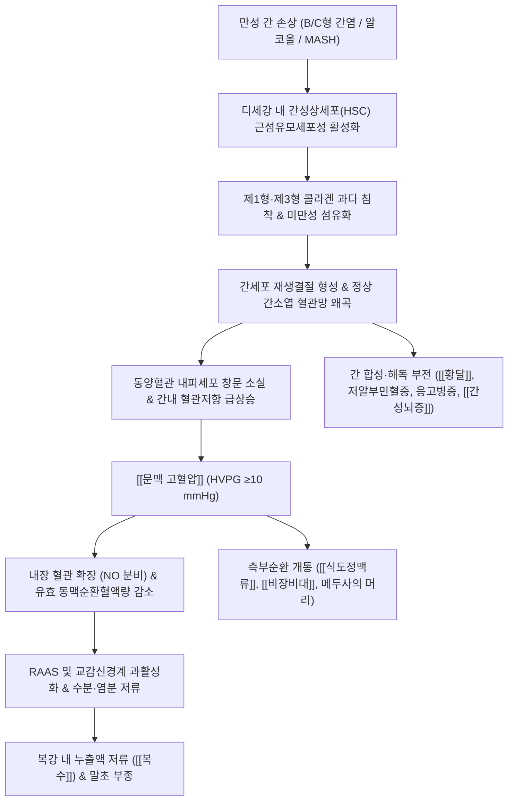

# 🩺 [[간경화]] (간경변증, Liver Cirrhosis, ICD-10 K74)

> **핵심 3줄 요약 (Key Summary)**:
> - 📍 병소 부위 & 해부·병태생리: 만성 간 실질 손상과 [[성상세포]] 활성화로 광범위 섬유화 및 재생결절이 형성되어 정상 간소엽 구조가 파괴되고 [[문맥 고혈압]]과 간기능 부전이 비가역적으로 고착되는 만성 간질환의 최종 병태.
> - 🚩 전형적 임상 양상 & 3대 징후: 보상기 40% 무증상 잠복 후, 비대상기 진행 시 [[황달]], [[복수]](하지 부종), 거미혈관종·수장홍반([[에스트로겐]] 분해 저하), 비장비대, 메두사머리, 응고인자 결핍에 의한 반상출혈 및 [[간성뇌증]] 발현.
> - 🛠️ 핵심 감별 검사 & 한·양방 다각적 치료 전략: 복부 초음파/CT/간섬유화스캔(FibroScan) 및 Child-Pugh/MELD 점수로 중증도를 평가하며, 한의학에서는 공법(攻法) 남용을 엄금하고 보비보기(補脾補氣, [[사군자탕]] 중심)를 기본으로 삼되 [[당귀]]·[[적작약]] 등 활혈약의 문맥압 영향성을 신중히 감별 투여.
> - ⚠️ 응급 의뢰 레드플래그 & 악화 요인: 식도·위정맥류 파열로 인한 대량 토혈(Hematemesis), 흑색변, 급성 복막염(SBP) 의심 발열/복통, 혼수 상태의 간성뇌증 발현 시 즉시 응급 전원 조치.

---

## 📌 목차
1. [질환 개요 & 해부학적 병태생리](#1-질환-개요--해부학적-병태생리)
2. [병태생리 메커니즘 & 생체역학적 악순환 네트워크](#2-병태생리-메커니즘--생체역학적-악순환-네트워크)
3. [임상 증상 & 이학적 검사(Physical Exam) 알고리즘](#3-임상-증상--이학적-검사physical-exam-알고리즘)
4. [감별 진단 매트릭스 (Differential Diagnosis)](#4-감별-진단-매트릭스-differential-diagnosis)
5. [한의 통합 치료 프로토콜 (침·약침·추나·한약)](#5-한의-통합-치료-프로토콜-침약침추나한약)
6. [양방 치료 & 병용·의뢰 기준 (Conventional Treatment & Referral)](#6-양방-치료--병용의뢰-기준-conventional-treatment--referral)
7. [재활 운동 & 생활습관 티칭 가이드](#6-재활-운동--생활습관-티칭-가이드)
8. [💡 사용자 진료실 핵심 필기 & 임상 노하우 (Melt-In 잔여 심화 집약)](#7--사용자-진료실-핵심-필기--임상-노하우-melt-in-잔여-심화-집약)
9. [출처 및 학술 참고 문헌 (References)](#8-출처-및-학술-참고-문헌-references)

---

## 1. 질환 개요 & 해부학적 병태생리

![[간경변증_정상간_간경변_비교_병태생리_일러스트.png|450]]
> [그림 1: 정상 간의 매끄러운 표면과 간경변증(Liver Cirrhosis)의 광범위 섬유화 및 재생결절 형성으로 인한 축소·결절화 메디컬 일러스트]

* **질환 정의 및 개요**:
  * [[간경화]](간경변증)는 만성적인 간 실질 염증과 간세포 괴사가 장기간 지속됨에 따라, 정상적인 간 조직이 세포외기질(ECM) 및 교원질(콜라겐)이 침착된 섬유성 결절로 대체되어 간의 정상 구조와 혈관망이 영구적으로 왜곡되는 만성 간질환의 최종 단계입니다.
  * 한의학에서는 형태학적 단단함과 복부 팽만을 가리켜 징가(癥瘕), 적취(積聚), 고창(鼓脹), 황달(黃疸), 협통(脅痛)의 범주에서 파악하며, 간과 비장이 단단해지고 복강 내에 수습(水濕)이 정체되는 병리로 이해합니다.
* **주요 원인 및 역학**:
  * **바이러스성 간염**: 만성 B형 간염(국내 최다 원인), 만성 C형 간염.
  * **알코올성 간질환**: 만성 과다 음주로 인한 알코올성 지방간염 및 간경변증.
  * **비알코올성 지방간질환(MASLD/MASH)**: 대사증후군, 비만, 당뇨병과 연계된 지방간염의 진행.
  * **간독성 물질 및 자가면역**: 약물 유발성 간손상, 자가면역성 간염, 원발성 담즙성 담관염(PBC).
* **관련 해부학적 구조물**:
  * **간 실질 및 간소엽(Hepatic Lobule)**: 간세포(Hepatocyte)와 동양혈관(Sinusoid), 디세강(Space of Disse)의 구조 파괴.
  * **간 혈관계**: [[간문맥]](Portal Vein)과 간동맥(Hepatic Artery)이 유입되어 하대정맥으로 유출되는 중심정맥계 저항 급증.
  * **측부순환 혈관계**: 식도정맥총, 배꼽주위 정맥망(Paraumbilical Veins), 상·하직장정맥총.

---

## 2. 병태생리 메커니즘 & 생체역학적 악순환 네트워크

![[간문맥계_정맥순환_해부도_Gray591.png|450]]
> [그림 2: 간문맥계를 형성하는 상장간막정맥, 하장간막정맥, 비장정맥의 해부학적 주행과 간경변 시 발생하는 측부순환 정맥망 해부도]

### 1) 간섬유화 및 재생결절 형성 기전
* 만성 간세포 손상 시 방출되는 염증성 사이토카인(TGF-β, PDGF)이 디세강(Space of Disse)에 존재하는 간성상세포(Hepatic Stellate Cell)를 활성화시켜 근섬유모세포(Myofibroblast)로 분화시킵니다.
* 활성화된 성상세포는 제1형 및 제3형 콜라겐을 대량 분비하여 동양혈관의 창문(Fenestration)을 폐쇄하고 기저막을 형성(Sinusoidal Capillarization)하여 산소 및 물질교환을 차단합니다.
* 파괴된 간세포 사이로 비정상적인 재생결절(Regenerative Nodule)이 증식하면서 혈관을 물리적으로 압박하고 간 실질을 경화시킵니다.

### 2) 간문맥 고혈압과 혈역학적 악순환
* 구조적 섬유화 저항(70%)과 내피세포성 일산화질소(NO) 생성 결핍에 의한 동양혈관 수축(30%)이 결합하여 간내 혈류 저항이 급증합니다.
* 간문맥압 항진증(HVPG ≥10 mmHg)이 초래되면 전신 내장혈관이 보상성으로 확장되고 유효 동맥순환혈액량이 급감합니다.
* 신장에서는 이를 순환 혈액량 부족으로 오인하여 레닌-안지오텐신-알도스테론계(RAAS)와 항이뇨호르몬(ADH) 분비를 극대화하여 나트륨과 수분을 재흡수함으로써 복수가 급격히 악화됩니다.

---

## 3. 임상 증상 & 이학적 검사(Physical Exam) 알고리즘

![[간경변증_간부전_임상증상_전신도해.png|450]]
> [그림 3: 만성 간경변 환자에서 나타나는 우상복부 둔통, 간부전 징후 및 전신성 합병증 임상 모식도]

### 1) 보상기 vs 비대상기 임상 양상
* **보상기 간경변 (Compensated, 약 40%)**:
  * 환자의 약 40%는 가장 후기까지 뚜렷한 주소증 없이 무증상 상태를 유지합니다.
  * 간세포가 장기간 손상과 재생 수복을 거친 후에는 **간효소 수치(AST/ALT)가 의외로 정상 범위로 나오는 경우**가 흔하므로, 혈액검사 간수치만으로 간경변을 배제해서는 안 됩니다.
  * 피로감, 전신 쇠약감, 식욕 부진, 소화불량 등 비특이적 증상이 잠행성으로 진행됩니다.
* **비대상기 간경변 (Decompensated, 3대 주요 합병증)**:
  * [[황달]] (Jaundice): 간세포의 빌리루빈 포합 및 배설 장애로 공막과 피부가 황변함.
  * [[복수]] (Ascites) 및 말초 부종: 복부 팽만, 이동성 탁음(Shifting dullness), 양측 하지 함요 부종(Pitting edema).
  * **정맥류 출혈** (Variceal Bleeding): 식도 및 위 기저부 정맥류 파열로 인한 대량 토혈 및 흑색변.
  * [[간성뇌증]] (Hepatic Encephalopathy): 암모니아 해독 실패로 인한 일주기 리듬 역전, 수전증(Asterixis, 자세고정못함증), 혼미, 혼수.

### 2) 특징적 신체 징후 (Physical Signs)
* **호르몬 대사 이상 징후** ([[에스트로겐]] 분해 저하):
  * **수장홍반 (Palmar Erythema)**: 손바닥의 엄지구(Thenar)와 소지구(Hypothenar)가 선홍색으로 발적됨. 생식샘에서 합성된 에스트로겐의 간 대사 분해가 저하되어 말초 모세혈관이 확장됨.
  * **거미혈관종 (Spider Angioma)**: 얼굴, 목, 상흉부 피부에 중심 세동맥을 중심으로 방사형 모세혈관이 거미 모양으로 확장됨. 압박 시 소퇴했다가 떼면 중심에서부터 재충류됨.
  * **남성 여성화증 (Gynecomastia) & 고환 위축**: 남성 환자에서 에스트로겐 축적으로 유선 발달 및 체모 소실.
* **문맥압 항진 및 응고병증 징후**:
  * **메두사의 머리 (Caput Medusae)**: 배꼽 주변 피하 정맥망이 방사상으로 노장되어 돌출됨.
  * **비장비대 (Splenomegaly)**: 문맥혈 울혈로 비장이 종대되고 혈소판이 파괴되어 저혈소판혈증 초래.
  * **지혈 장애 및 반상출혈**: 프로트롬빈 등 간 합성 응고인자 감소로 경미한 타박에도 멍이 쉽게 들고 잘 사라지지 않음.

---

## 4. 감별 진단 매트릭스 (Differential Diagnosis)

| 감별 질환 | 병소 및 원인 | 간 실질 및 혈관 소견 | 감별 핵심 포인트 |
| :--- | :--- | :--- | :--- |
| [[간경화]] (본 질환) | 만성 간염·알코올 등 미만성 실질 손상 | 재생결절, 간소엽 왜곡, 간문맥 고혈압 | Child-Pugh 점수, 혈소판 감소, 섬유화스캔 고수치 |
| [[비알코올성 지방간질환]] | 대사증후군, 인슐린 저항성 | 간세포 내 지방 침착, 결절 구조 없음 | 초음파상 음영 증가, 비알코올성 간섬유화 점수 낮음 |
| [[원발성 간암]] | 간세포 악성 종양 (HCC) | 국소적 종괴(Mass), 동맥기 조영증강 | 혈청 AFP/PIVKA-II 급상승, 동적 CT/MRI상 종괴 확인 |
| [[울혈성 심부전]] (심인성 간경변) | 우심부전, 삼첨판 폐쇄부전 | 하대정맥 및 간정맥 확장(Nutmeg liver) | 경정맥 노장, 심초음파상 EF 저하, 간문맥류 없음 |
| [[버드-키아리 증후군]] | 간정맥 또는 하대정맥 혈전성 폐색 | 간정맥 혈류 소실, 미상엽(Caudate) 비대 | 도플러 초음파상 간정맥 폐색, 급격한 복수와 간종대 |

---

## 5. 한의 통합 치료 프로토콜 (침·약침·추나·한약)

![[간경변증_복수_복부천자술_시술도해.png|450]]
> [그림 4: 비대상성 간경변증의 대량 복수 발생 시 임상적 복부 천자술(Abdominal Paracentesis) 배액 처치 도해]

* **한의 치료의 대원칙: 공법(攻法) 엄금 & 보비보기(補脾補氣)**:
  * 한의학 고전에서 간경화 복수를 고창(鼓脹) 폐증으로 보아 준하축수약(十棗湯, 舟車丸 등 극렬한 설사약)을 무리하게 사용하는 공법(攻法)은 **간신증후군(HRS) 및 전신 탈진, 간성혼수를 촉발하므로 절대 금기**입니다.
  * 손상된 간세포의 잔여 기능을 보존하고 복수 및 영양실조를 회복하기 위해 **보기보혈(補氣補血) 및 건비온양(健脾溫陽)**을 치료의 주축으로 삼습니다.

### 1) 한약 치료 프로토콜
* **비위허약형 (보상기 기본 처방)**:
  * [[사군자탕]], [[이공산]], [[보중익기탕]]: 비위의 운화 기능을 북돋워 알부민 합성을 돕고 전신 쇠약과 소화불량을 개선.
* **간비울체 및 수습정체형 (경도 복수·부종)**:
  * [[오령산]], [[위령탕]], [[사령탕]]: 신장 손상 없이 완만하게 수습을 통리(通利)시키고 이뇨 작용을 촉진.
* **간담습열형 (황달 동반기)**:
  * [[인진호탕]], [[인진오령산]]: 담즙 배설을 촉진하고 혈청 빌리루빈을 강하.
* **⚠️ 보혈약·활혈약 투여 시 극도의 신중 원칙**:
  * [[당귀]], [[적작약]], [[단삼]] 등 보혈·활혈거어제는 간섬유화 억제 기전이 연구되어 있으나, 문맥압 항진 상태에서 **내장 혈관 확장을 촉진하여 식도정맥류 출혈 위험을 가중시킬 수 있으므로 허혈 상태 및 혈관 노장도를 면밀히 감별하여 제한적으로 사용**해야 합니다.

### 2) 침구 치료 (Acupuncture)
* **선혈 원칙**: 건비익기(健脾益氣), 소간이기(疏肝理氣), 이수소종(利水消腫).
* **주요 혈자리**:
  * 족삼리(足三里), 음릉천(陰陵泉): 비위 기능을 강화하고 수습 정체와 하지 부종 완화.
  * 태충(太衝), 양릉천(陽陵泉): 간기울결을 풀고 담즙 순환을 개선.
  * 간수(肝兪), 비수(脾兪), 중완(中脘), 기해(氣海): 온보비신(溫補脾腎) 자침 및 완만한 뜸 치료.
* **주의사항**: 출혈 경향(PT 지연, 혈소판 감소)이 심한 환자에게 심자(深刺)를 금하며, 얕은 자침과 지혈 압박을 철저히 시행합니다.

---

## 6. 양방 치료 & 병용·의뢰 기준 (Conventional Treatment & Referral)

> 🎯 **이 섹션의 목적**: 환자가 **양방약을 이미 복용 중인 경우가 많다.** 한의원 1차 진료에서 양방 치료를 이해하고, 병용 가능·주의·금기를 판단하며, 언제 의뢰할지 결정한다.

* **약물 치료 (Medication)**:
  * 계열별 약물·용량·기간 — 국내 처방 관행 반영.
  * 작용 기전과 한의 치료와의 상호작용.
* **비약물 시술 (Procedures)**:
  * 주사·차단술·물리치료·보조기 등.
* **수술·시술 적응증 (Surgical Indication)**:
  * 언제 수술로 가는가 — 절대·상대 적응증, 수술 후 경과.
* **한의 병용 판단 (Combination Therapy)**:
  * 병용 가능 / 주의 / 금기. 복용 중 환자의 감량 타이밍·반동 현상.
* **양방·전문과 의뢰 기준 (Referral Criteria)**:
  * 응급 의뢰 트리거와 전문과 의뢰 기준(정형외과·신경외과·내과 등).

	(작성 필요)

---

## 7. 재활 운동 & 생활습관 티칭 가이드

* **식이 요법 및 영양 관리**:
  * **염분 제한 (저염식)**: 하루 나트륨 섭취를 2g(소금 5g) 이하로 엄격히 제한하여 복수와 부종 축적을 방지.
  * **단백질 섭취 원칙**: 근감소증(Sarcopenia) 예방을 위해 체중당 1.2~1.5g의 충분한 단백질을 섭취하되, [[간성뇌증]] 기왕력이 있는 경우 식물성 단백질(대두, 두부)과 분지쇄아미노산(BCAA) 위주로 조절.
  * **야간 간식(Late Evening Snack, LES)**: 간경변 환자는 공복 시 빠른 단백질 분해가 일어나므로, 취침 전 탄수화물/BCAA 간식을 섭취하여 야간 당신생 및 근소실 억제.
* **생활습관 및 절대 금기**:
  * **완전 금주 (Zero Alcohol)**: 알코올성뿐 아니라 바이러스성 간경변 환자에서도 단 한 잔의 알코올도 간암 위험과 사망률을 급증시킴.
  * **미검증 민간요법 및 농축 엑기스 금지**: 붕어즙, 헛개나무 고농축액, 야생 버섯 등은 급성 독성 간손상을 유발해 급성-만성 간부전(ACLF)으로 직결되므로 엄금.
  * **매일 아침 복위(배둘레) 및 체중 측정**: 체중이 3일간 2kg 이상 급증하거나 배가 급격히 부풀어 오르면 즉시 내원하도록 지도.

---

## 8. 💡 사용자 진료실 핵심 필기 & 임상 노하우 (Melt-In 잔여 심화 집약)

* **진료실 감별 팁: "간수치(AST/ALT)가 정상이라고 간이 건강한 것은 아니다"**:
  * 간경변 환자의 약 40%는 후기까지 무증상이며, 혈액검사에서 AST/ALT가 정상으로 나오는 경우가 흔함. 이는 간세포가 이미 광범위하게 섬유화되어 더 이상 파괴되어 흘러나올 효소 자체가 고갈되었기 때문임.
  * 반드시 혈소판(Platelet <100,000/μL), 알부민, 빌리루빈, 프로트롬빈 시간(PT INR), 알부민/글로불린 비(A/G ratio)를 종합 판독해야 함.
* **공법(攻法) 금기 및 비위 회복의 절대성**:
  * 임상에서 복수가 찬 간경화 환자를 보면 당장 물을 빼고자 이뇨제나 사하성 한약을 강하게 쓰고 싶은 유혹에 빠지기 쉬우나, 이는 신장 관류압을 떨어뜨려 치명적인 간신증후군(Hepatorenal syndrome)을 부름.
  * 반드시 [[사군자탕]]을 기본 축으로 삼아 비위(脾胃)를 보하고 기혈(氣血)을 보충하여 생체 회복력을 지지하는 방향으로 신중히 접근해야 함.
* **보혈약(당귀·적작약) 사용 시의 문맥압 리스크 고려**:
  * 만성 간질환에서 활혈보혈(活血補血) 목적으로 [[당귀]], [[적작약]]을 상용하나, 중증 간경변으로 인한 [[문맥 고혈압]] 상태에서는 내장 혈관 확장으로 인해 문맥압을 오히려 상승시키거나 정맥류 파열을 유발할 위험성이 이론적으로 존재함.
  * 허혈 상태와 정맥류 노장도를 신중히 확인한 후 극소량부터 조심스럽게 감별 투여할 것.
* **국내 임상 환경에서의 현실적 대처**:
  * 간질환 환자는 양방 병의원에서 "한약 절대 복용 금지" 교육을 강하게 받고 내원하는 경우가 대부분임.
  * 무리하게 단독 한방 치료를 고집하기보다, 양방의 정기적 초음파/내시경/혈액검사 모니터링을 병행하도록 유도하고, 한의원에서는 비위 기능 보강, 만성 피로 개선, 근감소증 완화 등 보조적 지지 요법에 집중하여 안전성을 철저히 확보해야 함.

---

## 9. 출처 및 학술 참고 문헌 (References)

* Ginès P, Krag A, Abraldes JG, Solà E, Fabrellas N, Kamath PS. Liver cirrhosis. *Lancet*. 2021;398(10308):1359-1376. [PubMed](https://pubmed.ncbi.nlm.nih.gov/34543610/)
  * [연구 요약] 간경변증의 병태생리, 보상기에서 비대상기로의 이환 기전, 전신 염증 및 문맥압 항진증의 최신 병태와 다기관 관리 전략을 총괄 정리한 란셋 세미나 종설.
* European Association for the Study of the Liver. EASL Clinical Practice Guidelines for the management of patients with decompensated cirrhosis. *J Hepatol*. 2018;69(2):406-460. [PubMed](https://pubmed.ncbi.nlm.nih.gov/29653741/)
  * [연구 요약] 비대상성 간경변 환자의 복수 관리, 자발성 세균성 복막염(SBP), 간신증후군 및 간성뇌증의 표준 치료 가이드라인 제시.
* Tsochatzis EA, Bosch J, Burroughs AK. Liver cirrhosis. *Lancet*. 2014;383(9930):1749-1761. [PubMed](https://pubmed.ncbi.nlm.nih.gov/24480518/)
  * [연구 요약] 간섬유화 가역성, 문맥압 항진증의 혈역학적 진행 기전 및 간경변 합병증의 조기 진단 알고리즘을 규명한 란셋 리뷰.
* Fuzheng Huayu tablets reduces the risk of further decompensation after the first decompensation in patients with HBV-related cirrhosis: protocol for a randomized, double-blind, placebo-controlled, multicenter trial. *Front Pharmacol*. 2026. [PubMed](https://pubmed.ncbi.nlm.nih.gov/42465987/)
  * [연구 요약] 한약 복합제 복정화어(Fuzheng Huayu) 제제가 B형 간염 연관 간경변 환자의 비대상화 위험을 감소시키고 간섬유화를 개선함을 규명하는 다기관 이중맹검 RCT 임상 프로토콜.