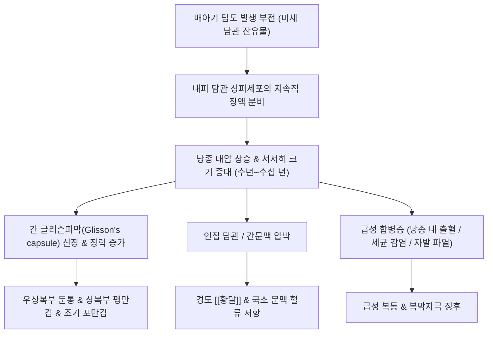

---
aliases:
  - 간 낭종
  - 단순 간낭종
  - 간 물혹
  - Hepatic Cyst
  - Liver Cyst
  - K76.8
tags:
  - 질환
  - 간질환
  - 소화기
  - 간낭종
  - 낭성간질환
---

# 🩺 [[간낭종]] (단순 간낭종, Hepatic Cyst, ICD-10 K76.8)

> **핵심 3줄 요약 (Key Summary)**:
> - 📍 병소 부위 & 해부·병태생리: 배아기 담관 발달 이상 또는 담관 미세과오종(von Meyenburg complexes) 유래로 간 실질 내에 담도 상피세포로 둘러싸인 단방성 장액성 낭포(물혹)가 형성되는 양성 병변.
> - 🚩 전형적 임상 양상 & 3대 징후: 전체의 85~95%는 평생 무증상(건강검진 복부 초음파상 우연 발견)이나, 낭종이 거대화(>5~10cm)되거나 합병증 발생 시 우상복부 둔통 및 팽만감, 조기 포만감, 담관 압박으로 인한 경도 [[황달]] 발현.
> - 🛠️ 핵심 감별 검사 & 한·양방 다각적 치료 전략: 복부 초음파상 전형적 3대 소견(무에코성 원형, 매끄러운 얇은 벽, 후방음향증강)으로 확진하며, 무증상 단순 낭종은 추적 관찰이 원칙이나 한의학적으로 복부 팽만과 기체어혈 동반 시 징가(癥瘕)·적취(積聚)로 변증하여 [[계지복령환]] 가감방([[계지]], [[복령]], [[목단피]], [[적작약]], [[향부자]])을 응용.
> - ⚠️ 응급 의뢰 레드플래그 & 악화 요인: 낭종 내 급성 출혈·파열로 인한 격심한 우상복부 산통 및 복막자극 징후, 세균 감염성 농양화(고열, 오한, 백혈구 급증), 초음파상 두꺼운 격벽·내부 결절 발견 시 점액성 낭성 종양(MCN) 감별을 위한 상급병원 전원.

---

## 📌 목차
1. [질환 개요 & 해부학적 병태생리](#1-질환-개요--해부학적-병태생리)
2. [병태생리 메커니즘 & 생체역학적 악순환 네트워크](#2-병태생리-메커니즘--생체역학적-악순환-네트워크)
3. [임상 증상 & 이학적 검사(Physical Exam) 알고리즘](#3-임상-증상--이학적-검사physical-exam-알고리즘)
4. [감별 진단 매트릭스 (Differential Diagnosis)](#4-감별-진단-매트릭스-differential-diagnosis)
5. [한의 통합 치료 프로토콜 (침·약침·추나·한약)](#5-한의-통합-치료-프로토콜-침약침추나한약)
6. [재활 운동 & 생활습관 티칭 가이드](#6-재활-운동--생활습관-티칭-가이드)
7. [💡 사용자 진료실 핵심 필기 & 임상 노하우 (Melt-In 잔여 심화 집약)](#7--사용자-진료실-핵심-필기--임상-노하우-melt-in-잔여-심화-집약)
8. [출처 및 학술 참고 문헌 (References)](#8-출처-및-학술-참고-문헌-references)

---

## 1. 질환 개요 & 해부학적 병태생리

![[간낭종_복부초음파_단순낭종_특징소견.jpg|450]]
> [그림 1: 복부 초음파(US) 검사상 간 실질 내에 관찰되는 전형적인 단순 간낭종의 무에코성(Anechoic) 원형 병변과 얇고 매끄러운 벽, 후방음향증강(Posterior acoustic enhancement) 소견]

* **질환 정의 및 개요**:
  * [[간낭종]](단순 간낭종, Simple Hepatic Cyst)은 간 실질 내부에 얇은 상피세포 단층 막으로 둘러싸인 공간이 생기고 그 내부에 담즙이 섞이지 않은 맑은 장액성 체액이 차 있는 양성 물혹 질환입니다.
  * 한의학에서는 간 부위가 단단하거나 붓는 징후를 가리켜 징가(癥瘕), 적취(積聚) 또는 협하적(脅下積)으로 분류하며, 장부의 기운이 울체되어 담음(痰飮)과 어혈(瘀血)이 간혈락(肝血絡)에 엉겨 덩어리를 형성한 병리로 인식합니다.
* **역학 및 발생 원인**:
  * **선천성 발달 기원**: 태생기 간내 담관망 발생 과정에서 발생 분절의 퇴화 실패로 정상 담관수(Biliary tree)와 연결이 끊긴 미세 잔존 담관 과오종(von Meyenburg complex)이 점진적으로 팽창하여 형성됩니다.
  * **유병률**: 건강검진 복부 초음파가 대중화되면서 전 인구의 약 5~18%에서 발견되며, 연령이 증가함에 따라 빈도가 증가하고 여성에서 남성보다 약 1.5~2배 흔하게 관찰됩니다.
  * **이차성 원인**: 드물게 외상 후 낭종, 간농양 후 잔존 낭종, 기생충 감염([[포충낭종]], Echinococcus granulosus), 다낭성 간질환(Polycystic Liver Disease, PLD) 등이 있습니다.
* **관련 해부학적 구조물**:
  * **간 실질 및 글리슨피막(Glisson's capsule)**: 대부분 간 우엽에 호발하며 글리슨피막 하에 위치할 경우 팽창 시 피막 신경을 자극하여 둔통 유발.
  * **간내 담도 및 문맥계**: 낭종이 거대해질 경우 인접한 간내 담관을 물리적으로 압박하여 국소 담즙 정체 유발.

---

## 2. 병태생리 메커니즘 & 생체역학적 악순환 네트워크

![[간_담낭_담도계_해부구조_일러스트.jpg|400]]
> [그림 2: 간, 담낭 및 간내외 담도계와 주요 혈관의 해부학적 구조 일러스트]

### 1) 낭종 팽창의 분자병태 기전
* 낭종 내벽은 입방형 또는 원주형 담관 상피세포(Cholangiocyte) 단층으로 덮여 있습니다.
* 이 상피세포는 cAMP 의존성 염화물 통로(CFTR)를 통해 수분과 전해질을 낭종 내강으로 끊임없이 능동 분비하며, 정상 담도와 연결 통로가 없기 때문에 분비액이 배출되지 못하고 수년~수십 년에 걸쳐 서서히 팽창합니다.
* 낭종액은 전해질 조성이 혈청과 유사한 무색 투명한 장액(Serous fluid)이며, 빌리루빈이나 아밀라아제는 검출되지 않습니다.

### 2) 주변 장기 압박과 합병증 연쇄
* 낭종의 직경이 5cm 이하일 때는 주변 간 실질의 보상적 유연성으로 인해 기능 장애를 일으키지 않습니다.
* 그러나 직경이 10cm 이상의 '거대 간낭종(Giant Hepatic Cyst)'으로 자라나면 위, 십이지장, 하대정맥을 전방 및 후방으로 압박하여 식후 조기 포만감, 오심, 구토, 하지 부종을 유발합니다.
* 낭종벽의 미세혈관이 파열되면 낭종 내 출혈(Intracystic hemorrhage)이 발생하여 낭종이 급격히 팽창하며 급성 복통을 촉발합니다.

---

## 3. 임상 증상 & 이학적 검사(Physical Exam) 알고리즘

![[다낭성_간질환_복부CT_다발성간낭종_소견.jpg|400]]
> [그림 3: 상염색체 우성 다낭신(ADPKD) 환자에서 동반된 다발성 간낭종(Polycystic Liver Disease)의 복부 CT 횡단면 소견]

### 1) 무증상 잠복기 vs 유증상 낭종
* **무증상 잠복 (85~95%)**:
  * 대부분의 단순 간낭종 환자는 자각 증상이 전혀 없으며, 건강검진이나 타 질환 검사 중 복부 초음파에서 우연히 발견됩니다.
  * 간세포 자체의 파괴나 염증이 동반되지 않으므로 혈청 간수치(AST, ALT, ALP, 빌리루빈)는 완전히 정상 범위를 유지합니다.
* **유증상 거대 낭종 및 압박 증상**:
  * **상복부 불쾌감 및 둔통**: 우상복부의 묵직한 중압감, 뻐근함, 팽만감.
  * **소화기 압박 증상**: 위장관 압박으로 인한 소화불량, 식사 후 조기 포만감, 식욕 감소, 체중 감소, 간혹 오심.
  * **담즙 정체 증상**: 거대 낭종이 간문부 주담관을 압박할 경우 폐쇄성 [[황달]] 및 가려움증이 나타날 수 있음.
* **급성 합병증 증상 (레드플래그)**:
  * **낭종 내 출혈**: 갑작스러운 우상복부 찌르는 듯한 격통, 발한, 빈맥.
  * **세균성 감염 (낭종 농양)**: 38℃ 이상의 고열, 오한, 간 부위 심한 타통.
  * **자발성 또는 외상성 파열**: 급성 복막염 소견, 복벽 강직, 복강 내 혈복증/담즙성 복막염.

### 2) 이학적 검사법 (Physical Examination)
* **복부 촉진 (Abdominal Palpation)**:
  * 우상복부 간 하연에서 매끄럽고 둥글며 파동성(Fluctuant)을 띠는 무통성 종괴가 촉지될 수 있음.
  * 정상 간연과 달리 부드럽고 단단하지 않은 탄력성 팽륜이 특징적임.
* **머피 징후 (Murphy's Sign) 감별**:
  * 단순 간낭종에서는 음성(Negative). 만약 양성이면 급성 담낭염이나 낭종 감염을 의심.
* **간 타진 (Liver Percussion)**:
  * 간 탁음계(Liver dullness)의 상하 폭이 확장되어 간비대 양상을 나타낼 수 있음.

---

## 4. 감별 진단 매트릭스 (Differential Diagnosis)

| 감별 질환 | 초음파 및 영상학적 특징 | 임상 증상 및 검사 소견 | 치료 및 예후 차이점 |
| :--- | :--- | :--- | :--- |
| [[간낭종]] (단순 낭종) | 무에코성, 얇은 벽, 후방음향증강, 격벽 없음 | 대부분 무증상, 간기능 정상 | 증상 없으면 경과 관찰(치료 불요) |
| 점액성 낭성 종양 (MCN) | 내부 다방성 격벽(Septation), 벽 결절, 석회화 | 중년 여성 호발, CA19-9 상승 가능 | 전암성 병변으로 수술적 완전 절제 필수 |
| 간농양 (Liver Abscess) | 불규칙한 두꺼운 벽, 내부 저에코성 파편/공기 | 고열, 오한, 심한 우상복부 통증, 백혈구 증가 | 항생제 투여 및 경피적 배액술 즉시 시행 |
| [[포충낭종]] (기생충 낭종) | 모낭종 내 자낭종(Daughter cysts), 수레바퀴상 | 양/개 접촉력, 호산구 증가, 혈청 항체 양성 | 알벤다졸 투여 및 천자 시 아나필락시스 주의 |
| [[다낭성 간질환]] (PLD) | 간 전체에 수십~수백 개의 크고 작은 다발성 낭종 | 복부 둘레 팽창, 다낭신(ADPKD) 동반 흔함 | 신기능 감시, 소마토스타틴 유사체 고려 |

---

## 5. 한의 통합 치료 프로토콜 (침·약침·추나·한약)

* **한의 치료의 기본 방침: "무증상 관찰" & "유증상 시 연견소적(軟堅消積)"**:
  * 현대의학과 마찬가지로 우연히 발견된 무증상 소형 단순 간낭종은 인위적으로 약물을 써서 크기를 줄이려 하지 않으며, 환자의 불필요한 공포심을 안심시키고 정기 추적 관찰을 유도합니다.
  * 그러나 간 부위의 중압감, 복부 팽만, 피로감, 소화불량 및 한의학적 어혈·기체 징후가 뚜렷할 경우 징가(癥瘕)·적취(積聚)에 준하여 **활혈거어(活血祛瘀), 이기소적(理氣消積), 건비화습(健脾化濕)** 치료를 적용합니다.

### 1) 한약 치료 프로토콜
* **징가어혈형 (복부 팽만, 우상복부 둔통, 암자설, 삽맥)**:
  * [[계지복령환]] 가감방: [[계지]], [[복령]], [[목단피]], [[적작약]], [[향부자]]를 기본 배합하여 간혈락의 어혈을 풀고 단단하게 엉긴 적(積)을 완화하며 복강 내 혈류 순환을 촉진.
* **간울기체형 (스트레스성 협통, 상복부 팽만감, 잦은 트림)**:
  * [[시호소간산]], [[가미소요산]]: 간기울결(肝氣鬱結)을 소통시켜 협하부의 팽만감과 긴장을 이완.
* **담음저체 및 비위허약형 (피로, 소화불량, 백태, 연변)**:
  * [[이진탕]], [[육군자탕]]: 비위의 운화 기능을 도와 체내 병리적 수습과 담음의 추가 축적을 예방.

### 2) 침구 치료 (Acupuncture)
* **선혈 원칙**: 소간해울(疏肝解鬱), 화어통락(化瘀通絡), 건비화위(健脾和胃).
* **주요 혈자리**:
  * 기문(期門), 일월(日月): 간과 담의 모혈(募穴)로서 간담 기기(氣機)의 울체 완화.
  * 태충(太衝), 양릉천(陽陵泉): 간기 소통 및 근막 이완, 담즙 배설 보조.
  * 족삼리(足三里), 중완(中脘): 비위 기운을 북돋워 소화불량 및 상복부 팽만 해소.
  * 삼음교(三陰交), 혈해(血海): 혈액 순환을 촉진하고 어혈을 제거.
* **주의사항**: 우상복부에 거대 낭종이 의심되는 환자에게 상복부 혈자리(기문, 거궐 등)의 과도한 심자(深刺)는 낭종 손상 위험이 있으므로 침은 사자(斜刺) 또는 얕은 직자로 안전하게 자침합니다.

---

## 6. 재활 운동 & 생활습관 티칭 가이드

* **환자 안심 티칭 (Reassurance)**:
  * 간낭종은 암으로 변하지 않는(악성 변성 위험 0%에 수렴하는) 완전한 양성 물혹임을 설명하여 환자의 불안감을 해소합니다.
  * "간에 혹이 있다"는 건강검진 소견에 지나치게 놀라 불필요한 민간요법에 매달리지 않도록 지도합니다.
* **복압 관리 및 외상 방지**:
  * 거대 낭종 환자의 경우 복부에 강한 충격을 주는 격투기나 낙상 위험 스포츠를 피하도록 권고합니다.
  * 벨트를 지나치게 꽉 조이거나 무거운 물건을 갑자기 들어 복압을 급상승시키는 동작을 주의하도록 티칭합니다.
* **정기 영상 추적 관찰**:
  * 단순 낭종으로 진단된 경우라도 첫 1~2년은 연 1회 복부 초음파를 시행하여 낭종의 급격한 크기 증가(연간 1cm 이상)나 내부 격벽 형성 여부를 모니터링하도록 안내합니다.

---

## 7. 💡 사용자 진료실 핵심 필기 & 임상 노하우 (Melt-In 잔여 심화 집약)

* **진료실 실제 내원 환자 패턴과 원장실 상담 팁**:
  * 간낭종 자체의 증상으로 내원하는 환자는 거의 없음. 대다수는 건강검진에서 "간에 물혹(낭종)이 몇 개 발견되었다"는 통보를 받고 암으로 진행할까 봐 극도로 불안해하며 한의원에 내원함.
  * 진료실 1차 목표는 불안 해소임: "간낭종은 피부의 점이나 물집처럼 선천적으로 생긴 물혹이며, 간암으로 발전하지 않는 양성 혹입니다"라고 명확히 설명해줄 것.
* **진찰 중 '간 부위 부종'과 간낭종의 연계 판독**:
  * 복진이나 초음파상 간 부위가 붓고 종괴감이 느껴지는데도 피검사상 간효소 수치가 정상이고 환자가 특이 간질환 기왕력이 없다면 [[간낭종]] 상태를 우선적으로 염두에 둘 수 있음.
  * 간 실질의 기능 장애가 없더라도 우상복부 팽만감, 소화불량, 어두운 안색, 설암(舌暗), 삽맥이 관찰된다면 한의학적 징가(癥瘕) 병증으로 접근하여 신체 전반의 기혈 순환을 돕는 치료가 유효함.
* **실전 한약 배오 노하우: 활혈소적(活血消積)**:
  * 낭종이 확인되고 복부 팽만과 피로를 호소하는 환자에게는 [[계지]], [[복령]], [[목단피]], [[적작약]], [[향부자]]의 배합이 다용됨.
  * 이는 낭종의 물을 억지로 빼내는 것이 아니라, 낭종 주변 간문맥 순환과 미세 혈락의 어혈(瘀血)을 제거하고 비위 기능을 도와 복강 내 장간막 순환을 원활하게 만들어 자각 증상을 획기적으로 개선함.
* **레드플래그 감별: "언제 상급병원으로 보낼 것인가"**:
  * 낭종 내부에 초음파상 격벽(Septa)이 보이거나, 벽이 울퉁불퉁하게 두꺼워져 있거나, 내부에 결절성 돌기(Nodule)가 자라나 있는 소견이 영상 판독지에 적혀 있다면 단순 낭종이 아닌 점액성 낭성 종양(MCN)일 가능성이 있으므로 즉시 간담췌외과로 정밀 CT/MRI 의뢰를 권고해야 함.

---

## 8. 출처 및 학술 참고 문헌 (References)

* European Association for the Study of the Liver. EASL Clinical Practice Guidelines on the management of cystic liver diseases. *J Hepatol*. 2022;77(4):1083-1108. [PubMed](https://pubmed.ncbi.nlm.nih.gov/35728731/)
  * [연구 요약] 단순 간낭종, 점액성 낭성 종양(MCN), 다낭성 간질환 및 포충낭종의 감별 진단과 크기·증상별 보존적 관찰 및 중재적 치료 표준 알고리즘 제시.
* Mavilia MG, Pakala T, Molina M, Wu GY. Differentiating Cystic Liver Lesions: A Review of Imaging Modalities, Diagnosis and Management. *J Clin Transl Hepatol*. 2018;6(2):208-216. [PubMed](https://pubmed.ncbi.nlm.nih.gov/29951366/)
  * [연구 요약] 초음파, CT, MRI를 활용한 간내 낭성 병변의 영상의학적 감별 진단 포인트와 단순 낭종의 양성 경과 및 치료 적응증 분석.
* Scoping Review on Polycystic Liver Disease in PKD1/PKD2 Gene Carriers: Genetic Aspects, Pathophysiology, and Therapeutic Approaches. *J Clin Exp Hepatol*. 2026. [PubMed](https://pubmed.ncbi.nlm.nih.gov/42701438/)
  * [연구 요약] 다낭성 간질환의 유전적 발생 메커니즘, 담관 상피세포 분비 병태생리 및 최신 약물·수술적 치료 접근법에 관한 종합 종설.