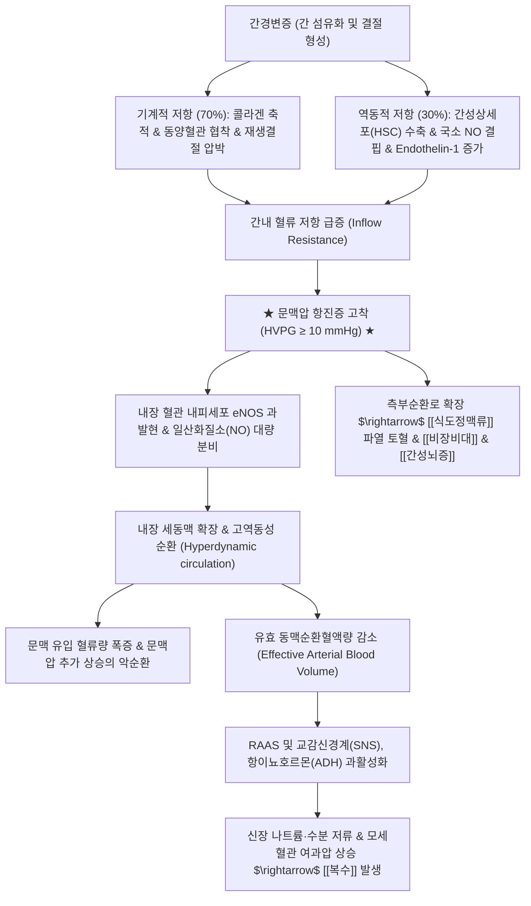

---
aliases:
  - 문맥압 항진증
  - 문맥고혈압
  - Portal Hypertension
  - PHTN
  - K76.6
tags:
  - 질환
  - 간질환
  - 소화기
  - 간문맥고혈압
  - 문맥압항진증
---

# 🩺 [[간문맥 고혈압]] (문맥압 항진증, Portal Hypertension, ICD-10 K76.6)

> **핵심 3줄 요약 (Key Summary)**:
> - 📍 병소 부위 & 해부·병태생리: [[간문맥]]계(Portal venous system)의 혈류 저항 증가 및 내장 혈관 확장에 따른 혈류량 증가로 인해 간정맥압력차(HVPG)가 정상 범위(1~5 mmHg)를 초과하여 10 mmHg 이상(임상적으로 유의미한 문맥압 항진, CSPH)으로 상승한 혈역학적 병태.
> - 🚩 전형적 임상 양상 & 3대 징후: 측부순환 발달로 인한 [[식도정맥류]] 파열(대량 토혈·흑색변), 복강 내 체액 저류에 의한 [[복수]](하지 부종), 비기능 항진증으로 인한 [[비장비대]](혈소판·백혈구 감소증) 및 장 유래 독성 물질의 뇌 직행으로 인한 [[간성뇌증]].
> - 🛠️ 핵심 감별 검사 & 한·양방 다각적 치료 전략: 간정맥카테터(HVPG 측정) 및 도플러 초음파, 상부위장관 내시경으로 정맥류를 평가하고 비선택적 베타차단제(NSBB) 및 EVL로 감압·지혈하며, 한의학에서는 고창(鼓脹)·징가(癥瘕)로 보아 건비이수(健脾利水, [[오령산]], [[실비음]])를 중심으로 다스리되 활혈거어제([[단삼]], [[적작약]], [[당귀]])는 문맥압 혈역학적 상태에 따라 극히 신중히 감별 투여.
> - ⚠️ 응급 의뢰 레드플래그 & 악화 요인: 식도·위정맥류 파열로 인한 대량 토혈(HVPG ≥12 mmHg 위험), 저혈량성 쇼크, 급성 자발성 세균성 복막염(SBP) 발열·복통, 간신증후군(HRS) 급성 핍뇨 발생 시 즉시 119 구급 이송 및 상급병원 응급 지혈 처치.

---

## 📌 목차
1. [질환 개요 & 해부학적 병태생리](#1-질환-개요--해부학적-병태생리)
2. [병태생리 메커니즘 & 생체역학적 악순환 네트워크](#2-병태생리-메커니즘--생체역학적-악순환-네트워크)
3. [임상 증상 & 이학적 검사(Physical Exam) 알고리즘](#3-임상-증상--이학적-검사physical-exam-알고리즘)
4. [감별 진단 매트릭스 (Differential Diagnosis)](#4-감별-진단-매트릭스-differential-diagnosis)
5. [한의 통합 치료 프로토콜 (침·약침·추나·한약)](#5-한의-통합-치료-프로토콜-침약침추나한약)
6. [재활 운동 & 생활습관 티칭 가이드](#6-재활-운동--생활습관-티칭-가이드)
7. [💡 사용자 진료실 핵심 필기 & 임상 노하우 (Melt-In 잔여 심화 집약)](#7--사용자-진료실-핵심-필기--임상-노하우-melt-in-잔여-심화-집약)
8. [출처 및 학술 참고 문헌 (References)](#8-출처-및-학술-참고-문헌-references)

---

## 1. 질환 개요 & 해부학적 병태생리

![[간문맥계_정맥순환_해부도_Gray591.png|450]]
> [그림 1: 비장정맥, 상장간막정맥, 하장간막정맥이 합류하여 간으로 유입되는 간문맥계(Portal Vein System) 해부도 및 문맥압 항진 시 개통되는 주요 측부순환 정맥망]

* **질환 정의 및 진단 기준**:
  * [[간문맥 고혈압]](Portal Hypertension, PHTN)은 간문맥 혈관계 내의 압력이 비정상적으로 상승한 상태로, 간정맥쐐기압(WHVP)과 자유간정맥압(FHVP)의 차이인 간정맥압력차(Hepatic Venous Pressure Gradient, HVPG)로 정의됩니다.
  * **정상 압력**: 1~5 mmHg.
  * **문맥고혈압**: HVPG > 5 mmHg.
  * **임상적으로 유의미한 문맥압 항진 (CSPH, Clinically Significant Portal Hypertension)**: HVPG ≥ 10 mmHg (복수, 정맥류 형성 시작).
  * **정맥류 출혈 고위험군**: HVPG ≥ 12 mmHg (정맥류 파열 및 급성 출혈 위험 급증).
* **해부학적 분류 (Anatomical Classification)**:
  * **간전성 (Pre-hepatic)**: 간문맥 혈전증(PVT), 비장정맥 혈전증, 선천성 문맥 협착.
  * **간내성 (Intra-hepatic, 전체의 90% 이상)**:
    * *동양혈관전성 (Presinusoidal)*: 주혈흡충증, 특발성 문맥압 항진증, 초기 원발성 담즙성 담관염(PBC).
    * *동양혈관성 (Sinusoidal)*: [[간경화]](간경변증, 최다 원인), 알코올성 간염.
    * *동양혈관후성 (Postsinusoidal)*: 간정맥폐색질환(VOD / SOS).
  * **간후성 (Post-hepatic)**: 버드-키아리 증후군(Budd-Chiari syndrome), 울혈성 심부전, 수축성 심막염.
* **관련 해부학적 구조물**:
  * **간문맥 본간 (Main Portal Vein)**: 상장간막정맥(SMV)과 비장정맥(Splenic vein)이 췌장 경부 뒤에서 합류하여 형성.
  * **4대 문맥-전신 측부순환로 (Portosystemic Collateral Pathways)**:
    1. *식도-위 연결부*: 좌위정맥(관상정맥) $\rightarrow$ 기정맥(Azygos vein) $\rightarrow$ [[식도정맥류]] 형성.
    2. *배꼽 주위*: 잔존 제정맥(Umbilical vein) 개통 $\rightarrow$ 복벽피하정맥 $\rightarrow$ 메두사의 머리(Caput medusae).
    3. *직장 연결부*: 상직장정맥 $\rightarrow$ 중·하직장정맥 $\rightarrow$ 내장골정맥 $\rightarrow$ 직장 정맥류(치핵과 감별).
    4. *후복막강*: 레치우스 정맥(Veins of Retzius) $\rightarrow$ 하대정맥계.

---

## 2. 병태생리 메커니즘 & 생체역학적 악순환 네트워크

![[간문맥_도플러초음파_혈류역류_소견.jpg|450]]
> [그림 2: 도플러 초음파(Doppler US) 검사상 간문맥 고혈압 환자에서 관찰되는 간문맥 혈류 속도 저하 및 문맥 혈류의 구간성(Hepatofugal, 역류) 혈역학적 소견]

### 1) 구조적 저항(Structural)과 역동적 저항(Dynamic)의 결합
* **구조적 혈관 저항 (Structural Resistance, 약 70%)**: 간 실질 내 제1형·제3형 콜라겐 침착, 동양혈관 내피세포 창문(Fenestration) 소실 및 기저막 형성, 재생결절에 의한 미세정맥 기계적 압박.
* **역동적 혈관 저항 (Dynamic Resistance, 약 30%)**: 디세강 내 활성화된 간성상세포와 혈관 평활근의 과수축. 간내 미세순환계에서 혈관확장인자인 일산화질소(NO) 생성이 고갈되는 반면, 강력한 혈관수축인자인 엔도텔린-1(Endothelin-1), 트롬복산 A2(TXA2), 안지오텐신 II의 분비가 급증하여 동양혈관이 지속적으로 수축함.

### 2) 내장 혈관 확장과 고역동성 순환(Hyperdynamic State)
* 간문맥압이 상승하면 내장 혈관 내피세포의 전단응력(Shear stress)과 세균 전위(Bacterial translocation)에 따른 내독소(LPS) 자극으로 장간막 순환계에서 eNOS가 과발현되어 일산화질소(NO)가 과잉 방출됩니다.
* 이로 인해 비장·장간막 세동맥이 극단적으로 확장되고, 전신 혈관저항이 감소하며, 심박출량이 증가하는 **고역동성 순환 상태(Hyperdynamic state)**가 초래됩니다.
* 내장 혈관 확장은 간문맥으로 흘러 들어가는 혈류량을 급증시켜 문맥압을 더욱 악화시키는 치명적인 악순환을 형성합니다.

---

## 3. 임상 증상 & 이학적 검사(Physical Exam) 알고리즘

![[간경변증_간부전_임상증상_전신도해.png|450]]
> [그림 3: 간문맥 고혈압 및 간경변 환자에서 나타나는 복수, 측부순환 메두사머리, 비장비대, 거미혈관종, 황달의 전신 임상 소견]

### 1) 4대 주요 합병증 및 전형적 주소증
* [[식도정맥류]] 및 위정맥류 출혈 (Variceal Bleeding):
  * HVPG ≥ 12 mmHg 시 얇은 식도 점막하 정맥류 벽의 장력이 한계를 초과하여 파열됨.
  * 전구 증상 없이 갑작스러운 선홍색 대량 토혈(Hematemesis), 흑색변(Melena), 어지러움, 빈맥, 혈압 강하 및 저혈량성 쇼크 발생.
* [[복수]] (Ascites) 및 자발성 세균성 복막염 (SBP):
  * 문맥압 상승(모세혈관 정수압 증가) + 저알부민혈증(혈장 교질삼투압 저하) + 신장의 수분·염분 재흡수가 결합하여 발생.
  * 복부 팽만, 이동성 탁음, 호흡곤란 및 복막강 내 장내 세균 감염으로 인한 복통과 발열.
* **비장종대 (Splenomegaly) 및 비기능 항진증 (Hypersplenism)**:
  * 비장 정맥의 혈류 배출 장애로 비장이 거대화되며, 혈구 격리 및 파괴가 증가하여 혈소판 감소증(Platelet <100,000/μL), 백혈구 감소증, 빈혈 초래.
  * 경미한 타박에도 멍이 잘 들고 지혈이 지연됨.
* [[간성뇌증]] (Hepatic Encephalopathy):
  * 장에서 단백질 분해로 생성된 암모니아 등 신경독소가 간세포의 요소회로 해독을 거치지 않고 확장된 측부순환로를 통해 전신 순환 및 뇌로 직행.
  * 수면 주기 역전, 성격 변화, 수전증(Asterixis, Flapping tremor), 지남력 상실, 혼수 유발.

### 2) 필수 이학적 검사법 (Physical Examination)
* **복벽 측부순환 혈류 방향 검사 (Caput Medusae Examination)**:
  * 배꼽 주위의 확장된 피하 정맥을 양 손가락으로 압박하여 혈액을 비운 후, 한쪽 손가락을 떼어 혈류 방향을 관찰.
  * 문맥고혈압 환자는 **배꼽을 중심으로 사방으로 방사상(원심성) 혈류**가 흐름 (하대정맥 폐색증은 상방 일방향 흐름과 감별).
* **복수 이학적 검사**:
  * **이동성 탁음 (Shifting Dullness)**: 앙와위에서 측와위로 자세 변경 시 탁음 경계가 중력에 따라 이동.
  * **액체 파동 검사 (Fluid Wave Test)**: 환자의 손으로 복부 중앙을 누른 상태에서 한쪽 측복부를 가볍게 쳤을 때 반대측 손에 파동이 전달됨.
* **비장 촉진법 (Splenic Palpation)**:
  * 우측와위(Right lateral decubitus) 자세에서 흡기 시 좌측 늑골연 하방에서 단단한 비장 하연이 촉지됨.

---

## 4. 감별 진단 매트릭스 (Differential Diagnosis)

| 감별 질환 | 병소 및 원인 | 혈역학적 소견 (HVPG) | 초음파 및 영상학적 감별점 |
| :--- | :--- | :--- | :--- |
| [[간문맥 고혈압]] (간내성) | [[간경화]], 알코올, 바이러스 간염 | HVPG ≥ 10 mmHg (간정맥압 상승) | 간 표면 결절화, 재생결절, 비장종대, 복수 |
| 간문맥 혈전증 (PVT, 간전성) | 혈전증, 췌장염, 악성종양 침윤 | HVPG 정상 (동양혈관압 정상) | 도플러 초음파상 문맥 내 혈전, 해면상 혈관 변성 |
| 버드-키아리 증후군 (간후성) | 간정맥 또는 하대정맥 혈전성 폐색 | 간정맥 개통 불가, 하대정맥압 상승 | 간정맥 혈류 결손, 미상엽(Caudate) 보상성 비대 |
| 특발성 문맥압 항진증 (INCPH) | 간내 미세 문맥 분지 섬유성 폐색 | HVPG 정상 또는 경도 상승 | 간경변 소견 없으나 정맥류와 비장비대 뚜렷 |
| 울혈성 심부전 (심인성 간울혈) | 삼첨판 폐쇄부전, 우심부전 | 하대정맥압과 간정맥압 동반 상승 | 경정맥 노장, 간정맥 확장, 간박동(Liver pulsation) |

---

## 5. 한의 통합 치료 프로토콜 (침·약침·추나·한약)

* **한의 치료의 핵심 원칙: 기체혈어(氣滯血瘀) 개선 & 비위보강 & 급성 출혈 위험성 차단**:
  * 문맥압 항진증은 한의학에서 기체(氣滯) $\rightarrow$ 혈어(血瘀) $\rightarrow$ 수습정체(水濕停滯)의 복합 병기로 형성된 고창(鼓脹), 징가(癥瘕), 협통(脅痛)입니다.
  * 혈관 내피세포의 기능 장애와 미세 순환 부전을 해소하기 위해 활혈화어(活血化瘀)와 건비이수(健脾利水)를 결합하되, **정맥류 파열 위험이 있는 고위험 환자에게 무리한 파어약(破瘀藥)이나 공하약(攻下藥) 사용을 절대 금지**합니다.

### 1) 한약 치료 프로토콜
* **초기 미세순환 개선 및 항섬유화 (보상기 문맥압 상승기)**:
  * [[단삼]], [[적작약]], [[별갑]], [[울금]]: 간내 미세순환 저항을 감소시키고 간성상세포 활성화를 억제.
  * 복정화어(Fuzheng Huayu) 제제 계열의 익기활혈(益氣活血) 원리를 차용하여 간혈류를 개선.
* **중기 복수 및 수습 정체기 (경·중등도 복수)**:
  * [[오령산]], [[실비음]], [[사령탕]]: 비신(脾腎)의 양기를 북돋워 신장의 수분 배설을 촉진하고 알부민 저하로 인한 삼투압 불균형 완화.
* **말기 황달 및 습열 독소 정체기**:
  * [[인진호탕]], [[인진오령산]], [[대황목단피탕]] 가감: 담즙 배출을 돕고 장내 암모니아 및 내독소 배출을 유도.
* **⚠️ 보혈약·활혈약 투여 시 극도의 주의**:
  * [[당귀]], [[적작약]] 등은 보혈 및 혈액순환 개선 효과가 있으나, 문맥압 항진 상태에서 내장 세동맥 확장을 과도하게 촉진하면 문맥 유입 혈류량을 늘려 정맥류 내압을 상승시킬 수 있으므로 **HVPG 고위험군에서는 반드시 거어약의 용량을 최소화하고 건비보기약을 군약(君藥)으로 배합**해야 함.

### 2) 침구 치료 (Acupuncture)
* **선혈 원칙**: 소간소종(疏肝消腫), 건비삼습(健脾滲濕), 온보비신(溫補脾腎).
* **주요 혈자리**:
  * 족삼리(足三里), 삼음교(三陰交), 음릉천(陰陵泉): 비경과 신경을 조절하여 하지 부종과 수습 정체 배출.
  * 기문(期門), 일월(日月): 간담의 기기 울체를 완화하고 국소 혈류 개선.
  * 간수(肝兪), 비수(脾兪), 수분(水分), 기해(氣海): 복수 조절 및 비위 기능 진작.
* **주의사항**: 저혈소판혈증(혈소판 <50,000/μL) 및 응고인자 결핍 환자에게 심자(深刺) 시 혈종이 발생할 수 있으므로, 가는 침(0.20mm 이하)으로 얕게 자침하고 발침 후 3분 이상 지혈 압박을 철저히 시행합니다.

---

## 6. 재활 운동 & 생활습관 티칭 가이드

* **복압 급상승 유발 동작 절대 금기**:
  * 무거운 물건 들기(데드리프트, 스쿼트 등 발살바 호흡 운동), 배에 힘을 강하게 주는 행위, 심한 변비 시 과도한 힘주기는 식도정맥류의 압력을 순간적으로 급상승시켜 파열을 유발하므로 금지.
  * 변비를 예방하기 위해 배변 완화제(락툴로오스 등) 복용 및 섬유질 섭취 지도.
* **식이 관리 및 염분 제한**:
  * **저염식**: 하루 나트륨 2g(소금 5g) 이하로 철저히 제한.
  * **단백질 조절**: 간성뇌증 예방을 위해 동물성 적색육보다는 식물성 단백질 및 분지쇄아미노산(BCAA) 위주 섭취.
* **정기 상부위장관 내시경 검진**:
  * 모든 문맥고혈압 의심 환자는 1~2년 주기로 내시경을 시행하여 정맥류 크기(F1, F2, F3)와 발적 징후(Red color sign)를 확인하고 필요 시 내시경 정맥류 결찰술(EVL) 예방 치료를 받도록 교육.

---

## 7. 💡 사용자 진료실 핵심 필기 & 임상 노하우 (Melt-In 잔여 심화 집약)

* **진료실 혈액검사 판독 팁: "혈소판 수치는 문맥고혈압의 가장 정직한 거울이다"**:
  * 일반 로컬 한의원에서 간정맥압(HVPG)을 직접 측정할 수는 없음.
  * 환자가 가져온 피검사지에서 **혈소판 수치가 100,000/μL 이하로 떨어져 있고 비장이 만져진다면, 십중팔구 임상적으로 유의미한 간문맥 고혈압(CSPH)이 이미 형성된 상태**임.
  * 이 경우 초음파상 간이 크게 손상되어 보이지 않더라도 이미 문맥압 항진 합병증(정맥류, 복수) 위험군으로 간주해야 함.
* **한약 처방 시 활혈약(당귀·적작약)과 문맥압의 상관관계**:
  * 한의학에서 간질환에 [[당귀]], [[적작약]], [[단삼]]을 빈용하나, 문맥고혈압 환자는 이미 전신 내장 혈관이 과도하게 확장되어 고역동성 순환에 빠져 있는 상태임.
  * 강력한 혈관확장성 활혈약을 다량 투여할 경우 내장 혈관이 더 확장되어 문맥압을 일시적으로 더 끌어올리는 역효과를 낼 위험이 있음.
  * 따라서 복수나 정맥류가 있는 중증기에는 활혈약을 가볍게 보조적으로만 쓰고, **비위를 보해 알부민 합성을 돕는 [[사군자탕]], [[보중익기탕]] 계열을 중심축**에 놓아야 안전함.
* **정맥류 파열 응급 레드플래그 티칭**:
  * 문맥고혈압 환자 및 보호자에게는 "자장면 색깔의 검은 변(Melena)을 보거나, 피를 한 숟가락이라도 토하면 지체 없이 119를 불러 큰 병원 응급실로 가야 한다"는 사실을 반드시 사전 교육해야 함.
  * 이는 진료실에서 환자의 생명을 지키는 가장 결정적인 골든타임 티칭임.

---

## 8. 출처 및 학술 참고 문헌 (References)

* de Franchis R; Baveno VII Faculty. Baveno VII - Renewing consensus in portal hypertension. *J Hepatol*. 2022;76(4):959-974. [PubMed](https://pubmed.ncbi.nlm.nih.gov/35120736/)
  * [연구 요약] 임상적으로 유의미한 문맥고혈압(CSPH)의 비침습적 진단 기준(간섬유화스캔 및 혈소판 수치)과 비선택적 베타차단제 예방 요법의 최신 국제 표준 가이드라인 제시.
* Iwakiri Y, Trebicka J. Portal hypertension in cirrhosis: Pathophysiological mechanisms and therapy. *JHEP Rep*. 2021;3(4):100316. [PubMed](https://pubmed.ncbi.nlm.nih.gov/34337369/)
  * [연구 요약] 간내 미세순환 저항 증가와 내장 혈관 확장에 따른 고역동성 순환의 분자생물학적 기전 및 혈관 타겟 치료제의 최신 지견 총괄 리뷰.
* Bosch J, Abraldes JG, Berzigotti A, García-Pagan JC. The clinical use of HVPG measurements in chronic liver sickness. *Nat Rev Gastroenterol Hepatol*. 2009;6(10):573-582. [PubMed](https://pubmed.ncbi.nlm.nih.gov/19724251/)
  * [연구 요약] 간정맥압력차(HVPG) 측정의 표준화 프로토콜 및 문맥압 수치에 따른 정맥류 출혈·복수 발생 위험도 예측 임상 가치 규명.
