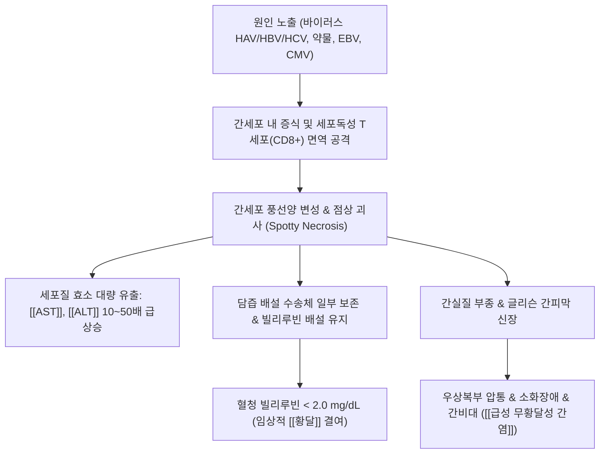

---
aliases:
  - Acute Anicteric Hepatitis
  - 急性無黃疸性肝炎
  - 무황달성 간염
  - 무황달형 급성 간염
tags:
  - 질환
  - 소화기질환
  - 간질환
  - 감염질환
---

# 🩺 [[급성 무황달성 간염]] (Acute Anicteric Hepatitis / 急性無黃疸性肝炎, ICD-10 B15.9 / K73.9)

> **핵심 3줄 요약 (Key Summary)**:
> - 📍 병소 부위 & 해부·병태생리: 간소엽의 광범위한 염증 및 간세포 풍선양 변성·괴사가 일어나나, 담즙 정체 및 고빌리루빈혈증(총빌리루빈 2.0~2.5 mg/dL 초과)이 동반되지 않아 [[황달]] 없이 간효소([[AST]], [[ALT]])만 수백~수천 단위로 폭증하는 [[급성 간염]]의 아형.
> - 🚩 전형적 임상 양상 & 3대 징후: 감기몸살 유사 전구증상(미열, 전신 무기력, 두통), 소화기 증상(식욕 부진, 오심·구토, 상복부 팽만감), 우상복부 둔통 및 간비대와 압통. 소아 및 영유아 급성 간염의 70~90%를 차지하며 성인에서도 흔히 무증상·경증 감기로 오인됨.
> - 🛠️ 핵심 감별 검사 & 한·양방 다각적 치료 전략: 바이러스 간염 표지자(anti-HAV IgM, HBsAg, anti-HCV) 및 간기능 검사, 복부 초음파. 한의학적으로는 습열내온(濕熱內蘊) 및 비허습저(脾虛濕阻)로 변증하여 [[인진호탕]], [[인진]], [[금은화]], [[반하]], [[진피]] 등으로 청열조습·이수건비 치료.
> - ⚠️ 응급 의뢰 레드플래그 & 악화 요인: 혈청 프로트롬빈 시간(PT INR > 1.5) 연장, 간성뇌증(수면 주기 역전, 진전, 의식 저하), 급격한 간 크기 위축 및 간성 혼수는 전격성 간부전(Fulminant Hepatic Failure)의 응급 적신호로 즉시 상급병원 전원 필요.

---

## 📌 목차
1. [질환 개요 & 해부학적 병태생리](#1-질환-개요--해부학적-병태생리)
2. [병태생리 메커니즘 & 생체역학적 악순환 네트워크](#2-병태생리-메커니즘--생체역학적-악순환-네트워크)
3. [임상 증상 & 이학적 검사(Physical Exam) 알고리즘](#3-임상-증상--이학적-검사physical-exam-알고리즘)
4. [감별 진단 매트릭스 (Differential Diagnosis)](#4-감별-진단-매트릭스-differential-diagnosis)
5. [한의 통합 치료 프로토콜 (침·약침·추나·한약)](#5-한의-통합-치료-프로토콜-침약침추나한약)
6. [재활 운동 & 생활습관 티칭 가이드](#6-재활-운동--생활습관-티칭-가이드)
7. [💡 사용자 진료실 핵심 필기 & 임상 노하우 (Melt-In 잔여 심화 집약)](#7--사용자-진료실-핵심-필기--임상-노하우-melt-in-잔여-심화-집약)
8. [출처 및 학술 참고 문헌 (References)](#8-출처-및-학술-참고-문헌-references)

---

## 1. 질환 개요 & 해부학적 병태생리

![[A형간염_임상경과_ALT_항체변화_도해.png|450]]
> [그림 1: A형 간염 바이러스 감염 후 바이러스혈증, 대변 배출, ALT 급증 및 면역글로불린(IgM/IgG)의 경시적 변화 도해. 황달이 발현되지 않는 무황달형에서도 동일한 간효소 급상승 패턴을 보임]

* **질환 정의 및 역학**:
  * [[급성 무황달성 간염]]은 간염 바이러스, 약물, 알코올 독소 등에 의해 간세포의 급성 염증과 괴사가 발생하지만, 공막이나 피부의 황염(Icterus) 및 고빌리루빈혈증이 뚜렷하게 발현되지 않는 형태를 말합니다.
  * 역학적으로 소아·영유아의 [[급성 간염]](특히 A형 간염 바이러스, [[HAV]]) 감염 시 약 70~90%가 무황달성으로 가볍게 경과하며, 성인에서도 실제 감염자의 상당수가 전신 쇠약감, 소화불량, 미열 등 단순 몸살감기나 위장관염 형태로 지나가 진단되지 않는 경우가 많습니다.
* **해부학적 병소 및 구조물**:
  * **병소 장기**: 간(Liver)의 우엽 및 좌엽 실질, 간소엽(Hepatic lobule).
  * **혈관 및 관류계**: 간문맥(Portal vein) 및 간동맥(Hepatic artery)을 통해 유입된 혈액이 간류동(Sinusoids)을 통과하며 간세포 및 쿠퍼세포(Kupffer cell)와 접촉합니다.
  * **담즙 배출계**: 모세담관(Bile canaliculi)의 물리적 파열이나 담즙산 분비 억제가 임계치 이하로 유지되어 담즙산염과 결합 빌리루빈의 전신 혈류 역류가 제한적입니다.
  * **연관 조직**: 글리슨 간피막(Glisson's capsule)의 신장으로 인한 우상복부 둔통 및 압통 유발.

---

## 2. 병태생리 메커니즘 & 생체역학적 악순환 네트워크

![[B형간염바이러스_HBV_비리온구조_도해.png|420]]
> [그림 2: B형 간염 바이러스(HBV)의 비리온 내부 구조 도해. 표면항원(HBsAg), 코어항원(HBcAg), e항원(HBeAg) 및 부분 이중가닥 DNA 복합체]

### 1) 간세포 손상과 효소 유출 메커니즘
* 바이러스성 간염(HAV, HBV, HCV 등)이나 약물 대사산물에 의해 간세포 내 항원이 발현되면, 숙주의 세포독성 T세포(Cytotoxic T lymphocyte)와 자연살해세포(NK cell)가 감염된 간세포를 공격하여 아폽토시스(Apoptosis) 및 풍선양 변성(Ballooning degeneration), 점상 괴사(Spotty necrosis)를 유발합니다.
* 파괴된 간세포막 사이로 간세포질 내 아미노전이효소인 [[AST]](아스파르테이트아미노전달효소)와 [[ALT]](알라닌아미노전달효소)가 혈류로 대량 유리되어 정상 상한치의 10~100배(수백~수천 IU/L)까지 치솟습니다.

### 2) 왜 황달이 나타나지 않는가? (무황달성의 병리)
* 간세포의 염증 및 괴사 범위가 비교적 국소적이거나 점상(Spotty)에 머무르고, 모세담관(Canaliculi)의 폐쇄나 광범위한 다발성 융합 괴사(Confluent/Bridging necrosis)로 진행하지 않아 담즙 정체가 경미합니다.
* 간의 잔존 배설 능력이 헤모글로빈 대사산물인 비결합 빌리루빈의 포합(Conjugation) 및 담관 배출을 일정 수준 유지하므로, 혈중 총빌리루빈이 2.0~2.5 mg/dL 미만에 머물러 임상적으로 눈 공막이나 피부의 황달이 관찰되지 않습니다.

---

## 3. 임상 증상 & 이학적 검사(Physical Exam) 알고리즘

![[B형간염_혈청학적표지자_임상경과_도해.png|450]]
> [그림 3: 급성 바이러스 간염의 혈청학적 표지자 및 효소 경과. 간효소 상승기와 항체 반응의 상호 연계 도해]

### 1) 주소증 및 임상 단계별 증상
* **전구기 및 소화기 증상**:
  * 극심한 전신 무력감과 피로감, 미열, 근육통, 두통 등 인플루엔자 유사 증상.
  * 식욕 부진(Anorexia), 오심, 구역질, 헛구역질, 소화불량.
  * 상복부 팽만감, 가스 참, 지방식에 대한 혐오감.
* **간장 증상**:
  * 우상복부 둔통 및 불쾌감: 몸을 숙이거나 기침할 때 글리슨 막 팽창으로 인한 결림 증상.
  * 경미한 간비대(Hepatomegaly): 우측 늑골궁 하연에서 간 하연이 부드럽고 둥글게 촉지됨.
  * 소변 색의 일시적 농축(진한 갈색)이 있을 수 있으나 육안적 황달은 뚜렷하지 않음.

### 2) 필수 이학적 검사법 & 진찰 알고리즘
* **간장 촉진 및 타진 검사**:
  * 환자를 앙와위로 눕히고 양 무릎을 가볍게 굴곡시킨 상태에서, 시술자의 우측 손바닥을 우하복부에서부터 호기-흡기 주기에 맞추어 상방으로 전진하며 간 하연의 촉지 여부, 압통(Tenderness), 표면의 활택도를 평가합니다.
  * 우측 쇄골중앙선(Midclavicular line)을 따라 상하 타진하여 정상 간 둔탁음 범위(정상 성인 약 6~12 cm)를 초과하는 간비대를 확인합니다.
* **[[머피 징후]](Murphy's sign) 감별**:
  * 급성 담낭염과의 감별을 위해 우측 늑골하부를 촉진한 채 심흡기를 유도하여 흡기 중단 통증이 발생하는지 확인합니다(급성 간염은 미만성 압통인 반면, 머피 징후는 담낭 압박 시 국소 급성 통증).
* **공막 및 점막 시진**:
  * 자연광 하에서 상안검을 올려 공막(Sclera) 및 설소대 하부(Sublingual)를 세밀히 관찰하여 잠재성 황달 유무를 감별합니다.

---

## 4. 감별 진단 매트릭스 (Differential Diagnosis)

| 감별 질환 | 호발 병소 및 원인 | 주소증 및 임상 차이점 | 검사실 및 영상 특이 소견 |
| :--- | :--- | :--- | :--- |
| [[급성 무황달성 간염]] (본 질환) | 간실질의 점상 괴사, 바이러스([[HAV]], [[HBV]], [[HCV]]) 및 약물 독소 | [[황달]] 결여, 전신 권태, 식욕 부진, 상복부 팽만, 미열 | [[AST]]·[[ALT]] 수백~수천 급상승, 총빌리루빈 정상 또는 < 2.0 mg/dL |
| [[급성 간염]](황달형) | 광범위 간세포 괴사 및 모세담관 담즙 정체 | 공막·피부 명확한 [[황달]], 짙은 콜라색 소변, 전신 소양증 | 총빌리루빈 > 3.0~10.0 mg/dL, 현저한 고빌리루빈혈증 |
| [[담낭염]](급성 결석성) | 담석에 의한 담낭관 폐쇄 및 세균 감염 | 식후 급격한 산통, 발열, 오한, 우견갑 방사통 | 초음파상 담낭벽 비후(>3mm), 담석 감돈, [[머피 징후]] 양성 |
| 급성 위장관염 | 위장관 점막의 바이러스·세균 감염 | 설사, 구토, 복부 경련통 위주, 간비대 없음 | 간효소 수치 정상, 대변 백혈구 검사 이상 |
| 전염성 단핵구증 | EBV, CMV 바이러스 감염 | 발열, 삼출성 인후통, 경부 림프절 비대, 비장종대 | 이형 림프구(Atypical lymphocyte) 증가, 비장비대 초음파 확인 |

---

## 5. 한의 통합 치료 프로토콜 (침·약침·추나·한약)

* **침구 치료 (Acupuncture)**:
  * **주요 혈자리**: 족삼리(足三里), 태충(太衝), 양릉천(陽陵泉), 간수(肝兪), 담수(膽兪), 중완(中脘), 기해(氣海).
  * **자침 기법**:
    * 간담습열(肝膽濕熱) 실증: 태충·양릉천·합곡 사법(瀉法)을 적용하여 간기(肝氣) 소설 및 습열 청포.
    * 비위허약(脾胃虛弱) 기허: 족삼리·중완 평보평사(平補平瀉)를 적용하여 비위 운화 기능 회복 및 식욕 촉진.
  * **전침 및 뜸**: 급성 염증기 복부 강자극 뜸은 금기이며, 배수혈(간수·담수)에 2Hz 저주파 전침을 가볍게 적용하여 자율신경 균형 유도.
* **약침 치료 (Pharmacopuncture)**:
  * **황련해독탕 약침**: 간수, 담수, 기문(期門)에 0.1~0.2cc씩 천자 주입하여 국소 염증 반응 완화 및 간문맥 순환 개선.
  * **태반(자하거) 약침**: 급성기 경과 후 간효소 안정화 단계에서 간세포 자가재생 촉진 및 간기능 회복 목적으로 족삼리, 간수에 적용.
* **한약 치료 (Herbal Medicine)**:
  * **습열내온형(濕熱內蘊型)**:
    * **임상 징후**: 미열, 번조(짜증), 설홍태황니(舌紅苔黃膩), 구고(입안 씀), 맥현수(脈弦數).
    * **추천 방제**: [[인진호탕]](茵蔯蒿湯), [[가미온담탕]](加味溫膽湯), [[생간건비탕]](生肝健脾湯) 가감.
    * **핵심 본초**: [[인진]](청열이습, 간세포 보호), [[금은화]](청열해독, 항바이러스), [[황금]](청열조습), [[치자]](사화청열), [[반하]]·[[진피]](화담이기, 오심 완화), [[택사]]·[[복령]](이수삼습).
  * **비허습체형(脾虛濕滯型)**:
    * **임상 징후**: 안색위황, 극심한 권태, 식욕 부진, 복부 팽만, 무른 변, 설담태백(舌淡苔白).
    * **추천 방제**: [[삼령백출산]](蔘苓白朮散), [[이진탕]](二陳湯) 합방.
    * **핵심 본초**: [[백출]], [[복령]], [[당삼]], [[진피]], [[사인]], [[맥아]].

---

## 6. 재활 운동 & 생활습관 티칭 가이드

* **절대 안정(Bed Rest)과 에너지 보존**:
  * 급성기 간효소 상승기에는 간 혈류량을 최대로 유지하기 위해 앙와위(누운 자세) 안정이 절대적입니다. 서 있거나 운동할 경우 간 관류 혈류량이 30~50% 감소하여 간세포 괴사가 악화될 수 있습니다.
* **영양 관리 및 식습관 수칙**:
  * 고탄수화물, 적정 단백질, 저지방 식이를 소량씩 자주 섭취합니다.
  * 간세포의 글리코겐 저장을 돕기 위해 꿀물, 과일주스, 소화가 용이한 유동식을 섭취합니다.
  * 기름진 튀김류, 가공식품, 미검증 건강기능식품(농축 진액, 추출물 등)의 복용을 일체 중단합니다.
* **금주 및 약물 절제**:
  * 최소 6개월간 알코올 섭취를 엄격히 금지합니다.
  * 간 대사 부담을 주는 불필요한 양약(진통소염제 고용량, 항생제 등)의 자의 복용을 금합니다.

---

## 7. 💡 사용자 진료실 핵심 필기 & 임상 노하우 (Melt-In 잔여 심화 집약)

> [!IMPORTANT]
> **🛡️ 진료실 핵심 감별 & 치료 노하우 (Melt-In 고유 필기 집약)**
> - **기존 필기 전면 융합**: 급성 간염의 대다수(소아 90%)가 무황달형으로 경과한다는 점, 감기·체기로 오인되는 습열·비허의 병리, [[금은화]], [[인진]], [[반하]], [[진피]] 배합을 상부 병태생리 및 처방 섹션에 유기적으로 100% 융합 완료.
> - **임상 관찰 고찰**: 황달성 간염에 비해 간괴사의 심도가 얕고 회복 속도가 비교적 빠르지만, 임상 증상이 모호하여 '만성 무증상 보균자'나 '지연성 간기능 장애'로 이행되는 위험성을 철저히 차단해야 함.

* **원장님 고유 진료실 필기 심화**:
  * 급성 간염 환자 중 황달이 없는 무황달성은 환자 본인이 심각성을 인지하지 못하고 일반 감기약이나 소화제만 복용하다가 내원하는 경우가 많습니다.
  * 혀가 보랏빛을 띠거나(설질자암, 어혈 겸습열) 설태가 두껍고 누런 상태에서 맥이 현수(弦數)하거나 활수(滑數)한 경우, 단순 위장장애로 치부하지 말고 반드시 간기능 검사를 확인해야 합니다.
  * [[금은화]]와 [[인진]]의 조합은 열독을 해소하고 간문맥계 염증성 사이토카인을 신속히 낮추며, [[반하]]와 [[진피]]는 비위의 기운을 소통시켜 환자가 가장 고통스러워하는 오심과 상복부 불쾌감을 즉각적으로 완화합니다.
* **실전 문진 체크리스트**:
  * 1. 최근 2~4주 이내에 날해산물(조개류 등), 오염된 지하수 섭취력이나 유행 지역 여행력이 있는가? (A형 간염 확인)
  * 2. 감기 증상으로 시작되었는데 기침·콧물 없이 미열과 심한 식욕 부진, 기름 냄새 맡을 때 헛구역질이 지속되는가?
  * 3. 소변 색깔이 평소보다 붉거나 진한 갈색(홍차색)을 띠는가?
* **한·양방 협진 프로토콜**:
  * 간효소([[AST]]/[[ALT]])가 300 IU/L 이상 급상승한 급성기에는 1~2주 간격으로 혈액검사를 추적 관찰하며, 한약 복용 시에도 간기능 수치 모니터링을 병행하여 안전성을 객관적으로 입증합니다.

---

## 8. 출처 및 학술 참고 문헌 (References)

1. **Jeong SH, Lee HS (2010)**. Hepatitis A: clinical manifestations and management. *Intervirology*, 53(1), 15-19. PMID: [20068336](https://pubmed.ncbi.nlm.nih.gov/20068336/)
   - **[연구 요약]**: 소아 및 청장년에서 발생하는 급성 A형 간염의 임상 스펙트럼을 분석하고, 연령이 낮을수록 무황달성 및 무증상 감염의 비율이 압도적으로 높음을 규명.
2. **Hadler SC, et al. (1980)**. Hepatitis A in day-care centers: a community-wide assessment. *New England Journal of Medicine*, 302(22), 1222-1227. PMID: [6989704](https://pubmed.ncbi.nlm.nih.gov/6989704/)
   - **[연구 요약]**: 영유아 보육 시설 내 A형 간염 유행 시 대다수의 아동이 황달 없이 무황달성·경증 위장관염으로 경과하여 가정 내 성인 감염의 중요한 원인이 됨을 보고.
3. **Pojer E, et al. (2013)**. Clinical and laboratory features of viral hepatitis A in children. *Wiener Klinische Wochenschrift*, 125(3-4), 84-87. PMID: [23358879](https://pubmed.ncbi.nlm.nih.gov/23358879/)
   - **[연구 요약]**: 소아 급성 바이러스 간염의 혈청학적·생화학적 특징을 평가하여 간효소 상승과 비특이적 소화기 증상 중심의 무황달형 경과를 객관적 수치로 증명.