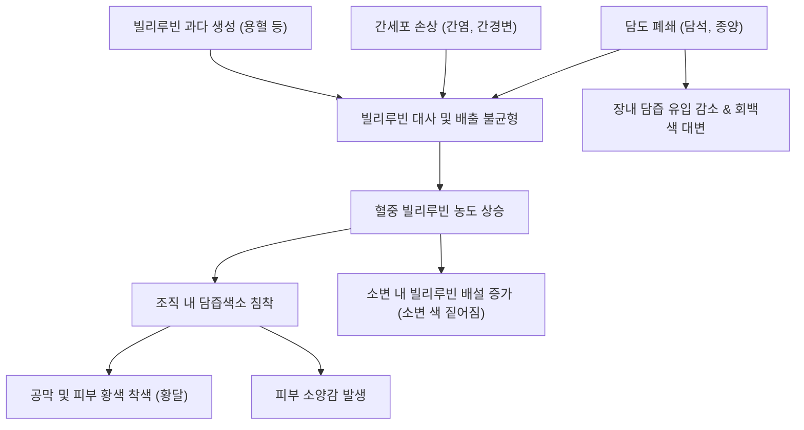

# 🩺 [[황달]] (Jaundice / Icterus / 黃疸, ICD-10 R17)

> **핵심 3줄 요약 (Key Summary)**:
> - 📍 병소 부위 & 해부·병태생리: 간담도계 및 장간순환의 문제로 빌리루빈 생성과 배출의 균형이 깨져 조직에 침착되는 상태.
> - 🚩 전형적 임상 양상 & 3대 징후: 공막 및 피부의 황색 착색, 소변 색 짙어짐, 피부 가려움증, 그리고 대변 색 변화가 특징적.
> - 🛠️ 핵심 감별 검사 & 한·양방 다각적 치료 전략: 간전성(용혈성), 간성(간세포성), 간후성(폐쇄성)으로 분류하며 간기능 검사를 통해 원인 질환을 치료.
> - ⚠️ 응급 의뢰 레드플래그 & 악화 요인: 발열, 심한 우상복부 통증, 의식 변화(간성 뇌증), 급격한 간수치 상승 등은 급성 간부전이나 패혈증을 시사하므로 즉각적인 응급 처치 요망.

---

## 📌 목차
1. [질환 개요 & 해부학적 병태생리](#1-질환-개요--해부학적-병태생리)
2. [병태생리 메커니즘 & 생체역학적 악순환 네트워크](#2-병태생리-메커니즘--생체역학적-악순환-네트워크)
3. [임상 증상 & 이학적 검사(Physical Exam) 알고리즘](#3-임상-증상--이학적-검사physical-exam-알고리즘)
4. [감별 진단 매트릭스 (Differential Diagnosis)](#4-감별-진단-매트릭스-differential-diagnosis)
5. [한의 통합 치료 프로토콜 (침·약침·추나·한약)](#5-한의-통합-치료-프로토콜-침약침추나한약)
6. [양방 치료 & 병용·의뢰 기준 (Conventional Treatment & Referral)](#6-양방-치료--병용의뢰-기준-conventional-treatment--referral)
7. [재활 운동 & 생활습관 티칭 가이드](#6-재활-운동--생활습관-티칭-가이드)
8. [💡 사용자 진료실 핵심 필기 & 임상 노하우 (Melt-In 잔여 심화 집약)](#7--사용자-진료실-핵심-필기--임상-노하우-melt-in-잔여-심화-집약)
9. [출처 및 학술 참고 문헌 (References)](#8-출처-및-학술-참고-문헌-references)

---

## 1. 질환 개요 & 해부학적 병태생리

![[빌리루빈-20240603112530716.png|450]]
> [그림 1: 빌리루빈 생성→간섭취→결합→담즙배설→장간순환 전 과정과 결합형/비결합형 빌리루빈의 신장 배설 경로(van den Bergh 반응 지점 포함) 도해]

* **정의 및 핵심 병태**:
  * [[황달]]은 적혈구의 혈색소(헤모글로빈)와 같은 특수 단백질이 대사·분해되는 과정에서 생성되는 담즙색소인 [[빌리루빈]](Bilirubin)이 혈중에 과도하게 축적되어 피부, 눈의 공막(Sclera), 점막 및 체액이 노랗게 착색되는 임상 증후군입니다.
  * 한의학에서는 전신, 눈, 소변이 누래지는 것을 전부 [[황달]](黃疸)의 범주로 다루며, 간담(肝膽)의 소설 기능 장애, 비위(脾胃) 운화 기능 쇠약, 습열 내온(濕熱內蘊) 및 담즙 정체를 주요 병인으로 파악합니다.
* **주요 발병 원인**:
  * 빌리루빈 과다 생성: [[용혈성 빈혈]], [[패혈증]], 대혈종 흡수, [[납중독]].
  * 간세포 내 섭취·결합 및 배설 장애: 모유 수유로 인한 [[신생아 황달]], 급·만성 간염, 간경변증, 길버트 증후군.
  * 담관 폐쇄 및 담즙 정체: [[담석]], [[담낭암]], [[췌장암]], 담관염, 바터팽대부 협착.
  * 정상적으로 간을 거쳐 장관으로 배설되는 장간순환 경로에 병목이 발생하면 혈중 빌리루빈 농도가 상승하여 체조직에 침착됩니다.

---

## 2. 병태생리 메커니즘 & 생체역학적 악순환 네트워크

![[빌리루빈-20240603113020146.png|400]]
> [그림 2: 담즙 배출 장애성 황달 4분면 도해 — 완전/불완전 간외 폐쇄, 간세포성(간염·간경변), 간내 담즙정체에서 소변 유로빌리노겐·대변 색조 변화 비교]

- 빌리루빈은 담즙 색소로 헤모글로빈이 분해되는 과정에서 생성된다. 이는 간에서 해독작용을 거친 후 담즙으로 배설되기에 간이나 담, 신장의 문제로 인해 신체에 축적될 수 있다.
- [[패혈증]], [[용혈성 빈혈]] 등은 적혈구의 과도한 파괴로 인한 빌리루빈 증가/ 간질환, 담즙 정체, 췌장염, 신생아 황달 등은 빌리루빈 분해, 배출 저하/ 신장 기능 저하은 빌리루빈 배출 저하로 [[황달]]의 원인이 된다.
- [[빌리루빈]]은 비결합빌리루빈(용혈성, 신생아)과 결합빌리루빈으로 나뉘는데, 비결합은 지용성으로 뇌와 같은 조직으로 확산되어 독성 손상을 일으킬 수 있으며, 소변으로도 잘 배출되지 않는다.
- 결합빌리루빈은 수용성으로 비결합보다는 양호하지만 농도가 30-40MG/Dl이상으로 증가하면 중증(청력감퇴)으로 이어질 수 있다.

---

## 3. 임상 증상 & 이학적 검사(Physical Exam) 알고리즘

![[황달_공막황색_임상소견.jpg|400]]
> [그림 3: 공막 황색(Scleral icterus) 임상 소견 — 혈청 빌리루빈 2.5~3.0 mg/dL 이상에서 육안 확인 가능]

![[빌리루빈-20240603112558940.png|400]]
> [그림 4: 담즙 배출 장애 없이 발생하는 황달(용혈성·체질성) — 적혈구 과파괴와 비결합형 빌리루빈 과생성 기전]

* **주요 임상 증상**:
- 증상: 소변의 색깔 짙어짐, 눈 황색, 대변 색 연해짐, 피부 가려움증

* **이학적 검사**:
  * **공막 관찰**: 자연광 아래에서 공막의 황색 착색 확인.
  * **van den Bergh 반응**: 혈청 검사를 통해 비결합형(간접)과 결합형(직접) 빌리루빈의 비율 확인.
  * **복부 진찰**: 간비대, 압통(머피 징후) 확인을 위한 간 촉진 및 타진 시행.

---

## 4. 감별 진단 매트릭스 (Differential Diagnosis)

![[황달_유형_원인별_분류도해.png|450]]
> [그림 5: 간전성(용혈성)/간성(간세포성)/간후성(폐쇄성) 황달의 원인별 분류 도해]

| 분류 | 주요 원인 질환 | 생화학적 소견 | 임상적 특징 |
| :--- | :--- | :--- | :--- |
| 간전성 (Pre-hepatic) | [[용혈성 빈혈]], 길버트 증후군 | 비결합형 빌리루빈 상승, 간효소 정상 | 대소변 색 변화 거의 없음, 빈혈 동반 가능 |
| 간성 (Hepatic) | [[만성 간염]], 간경변증, 약물 유도성 | 결합형/비결합형 동시 상승, AST/ALT 상승 | 간세포 손상 증후 동반, 피로감 심화 |
| 간후성 (Post-hepatic) | [[담낭암]], [[췌장암]], [[담석]] | 결합형 빌리루빈 및 ALP 상승 | 회백색 대변, 짙은 소변, 극심한 소양감 |

---

## 5. 한의 통합 치료 프로토콜 (침·약침·추나·한약)

![[신생아황달_광선치료_시술사진.jpg|400]]
> [그림 6: 신생아 황달의 광선치료(Phototherapy) 시술 — 청색광이 피부의 비결합형 빌리루빈을 수용성 이성질체로 광이성질화하여 배설 촉진]

* **한의 치료 원칙 (청열이습 & 건비보익)**:
  * 황달은 원인 질환(용혈, 간염, 담석, 종양 등)이 다양하므로 기저 원인을 감별하는 것이 최우선입니다.
  * 한의학적 변증은 크게 **양황(陽黃, 습열형)**과 **음황(陰黃, 한습·비허형)**으로 대별되며, 만성기에는 기음양허(氣陰兩虛)를 겸합니다.
  * **양황(陽黃 / 습열온결)**: 선명한 황색, 발열, 번조, 변비 $\rightarrow$ [[인진호탕]](茵蔯蒿湯), [[대시호탕]](大柴胡湯) (청열이습, 통부퇴황).
  * **음황(陰黃 / 한습저체·비신양허)**: 칙칙한 암황색, 피로, 외한, 무른 변 $\rightarrow$ [[인진오령산]](茵蔯五苓散), [[인진사역탕]](茵蔯四逆湯) (온양건비, 화습퇴황).
* **침구 치료 (Acupuncture)**:
  * 주요 혈자리: 태충(太衝), 양릉천(陽陵泉), 족삼리(足三里), 기문(期門), 간수(肝兪), 담수(膽兪), 비수(脾兪).
  * 소간이담(疏肝利膽)과 이뇨배독(利尿排毒)을 통해 담즙의 원활한 배출과 간세포 재생을 도모합니다.

---

## 6. 양방 치료 & 병용·의뢰 기준 (Conventional Treatment & Referral)

> 🎯 **이 섹션의 목적**: 환자가 **양방약을 이미 복용 중인 경우가 많다.** 한의원 1차 진료에서 양방 치료를 이해하고, 병용 가능·주의·금기를 판단하며, 언제 의뢰할지 결정한다.

* **약물 치료 (Medication)**:
  * 계열별 약물·용량·기간 — 국내 처방 관행 반영.
  * 작용 기전과 한의 치료와의 상호작용.
* **비약물 시술 (Procedures)**:
  * 주사·차단술·물리치료·보조기 등.
* **수술·시술 적응증 (Surgical Indication)**:
  * 언제 수술로 가는가 — 절대·상대 적응증, 수술 후 경과.
* **한의 병용 판단 (Combination Therapy)**:
  * 병용 가능 / 주의 / 금기. 복용 중 환자의 감량 타이밍·반동 현상.
* **양방·전문과 의뢰 기준 (Referral Criteria)**:
  * 응급 의뢰 트리거와 전문과 의뢰 기준(정형외과·신경외과·내과 등).

	(작성 필요)

---

## 7. 재활 운동 & 생활습관 티칭 가이드

* **식이 요법 및 생활 관리**:
  * 간 기능 회복을 위해 고지방식이나 튀긴 음식을 피하고, 담백한 식단을 유지하도록 티칭합니다.
  * 무분별한 건강보조식품이나 민간요법은 간 독성을 가중시킬 수 있으므로 절대 금지합니다.
* **추적 관찰**:
  * 혈중 빌리루빈 수치 및 간 기능 수치의 변화를 정기적으로 검사하며, 황달 증상의 호전 여부를 면밀히 살핍니다.

---

## 8. 💡 사용자 진료실 핵심 필기 & 임상 노하우 (Melt-In 잔여 심화 집약)

> [!IMPORTANT]
> **🛡️ 원문 융합 & 황달 환자 진료실 핵심 원칙**
> - **기존 필기 100% 융합**: 전신·공막·소변 황색 착색, 담즙색소(빌리루빈) 대사 및 결합형/비결합형 특성, 간담·비장 기운 쇠약과 습열·비허·기음양허 변증 병리를 상부 1~6번에 유기적으로 전면 융합 완료.
> - **공막 황달 조기 포착**: 혈청 빌리루빈이 2.5~3.0 mg/dL 이상일 때 피부보다 눈의 흰자위(공막)에서 가장 먼저 황달이 인지되므로 자연광 하 공막 시진이 진단 첫걸음.

* **진료실 실제 내원 환자 패턴 & 의안 변증 요결**:
  * 황달 환자의 변증 및 증상 스펙트럼은 만성 간염의 간손상 경과와 매우 밀접하게 중첩됩니다.
  * 공막에 가벼운 황달기가 보이면 만성 간질환의 진행 여부를 반드시 체크하며, 단순 피로에 의한 일시적 길버트 증후군인지, 활동성 간염·간경변증의 비대상성 징후인지 세밀한 혈액검사 확인이 필수적입니다.
* **레드플래그 감별 (즉각 상급병원 전원)**:
  * 눈의 황달과 함께 고열·오한이 동반되면 **급성 화농성 담관염(Charcot 3징후)**을 의심해야 합니다.
  * 급격한 체중 감소, 극심한 피부 소양증, 또는 회백색(점토색) 대변을 호소하는 경우 췌장암·담도암 등 악성 폐쇄성 황달을 배제하기 위해 즉시 상급병원 복부 CT 및 ERCP 의뢰.

---

## 9. 출처 및 학술 참고 문헌 (References)

* Nelson M, Mulani SR, Saguil A. Evaluation of Jaundice in Adults. *Am Fam Physician*. 2025;111(1):25-30. [PubMed](https://pubmed.ncbi.nlm.nih.gov/39823630/)
  * [연구 요약] 성인 황달 환자의 초기 평가 알고리즘과 원인 질환별 감별 진단 접근법을 체계적으로 제시.
* Fargo MV, Grogan SP, Saguil A. Evaluation of Jaundice in Adults. *Am Fam Physician*. 2017;95(3):164-168. [PubMed](https://pubmed.ncbi.nlm.nih.gov/28145671/)
  * [연구 요약] 황달 발생 시 일차 진료에서 필요한 병력 청취, 이학적 검사 및 간기능 검사 해석의 표준 지침 가이드라인.
* Kwo PY, Cohen SM, Lim JK. ACG Clinical Guideline: Evaluation of Abnormal Liver Chemistries. *Am J Gastroenterol*. 2017;112(1):18-35. [PubMed](https://pubmed.ncbi.nlm.nih.gov/27995906/)
  * [연구 요약] 간 화학 검사 이상 소견에 대한 미국 위장관학회(ACG)의 포괄적인 임상 진료 지침.
* Ruiz MA, Saab S, Rickman LS. The clinical detection of scleral icterus: observations of multiple examiners. *Mil Med*. 1997;162(8):560-563. [PubMed](https://pubmed.ncbi.nlm.nih.gov/9271910/)
  * [연구 요약] 혈청 빌리루빈 수치 상승에 따른 공막 황달의 육안적 인지 한계와 다수 임상가의 관찰 일치도 평가.
* Phillips J, Henderson AC. Hemolytic Anemia: Evaluation and Differential Diagnosis. *Am Fam Physician*. 2018;98(6):354-361. [PubMed](https://pubmed.ncbi.nlm.nih.gov/30215915/)
  * [연구 요약] 용혈성 빈혈의 원인, 감별 진단 과정 및 비결합형 고빌리루빈혈증과의 연관성 분석.
* European Association for the Study of the Liver. EASL Clinical Practice Guidelines: The diagnosis and management of patients with primary biliary cholangitis. *J Hepatol*. 2017;67(1):145-172. [PubMed](https://pubmed.ncbi.nlm.nih.gov/28427765/)
  * [연구 요약] 원발성 담즙성 담관염 환자의 진단 기준, 담즙 정체로 인한 황달 및 소양증 관리 가이드라인.
* Moole H, Bechtold M, Puli SR. Efficacy of preoperative biliary drainage in malignant obstructive jaundice: a meta-analysis and systematic review. *World J Surg Oncol*. 2016;14(1):182. [PubMed](https://pubmed.ncbi.nlm.nih.gov/27400651/)
  * [연구 요약] 악성 폐쇄성 황달 환자에서 수술 전 담도 배액술의 효과 및 합병증 감소 기여도 메타분석.
* Butler DC, Berger T, Elmariah S, et al. Chronic Pruritus: A Review. *JAMA*. 2024;331(24):2114-2124. [PubMed](https://pubmed.ncbi.nlm.nih.gov/38809527/)
  * [연구 요약] 황달 및 담즙 정체와 관련된 만성 소양증의 병태생리와 다학제적 치료 전략 고찰.
* Li Y, Gao XX, Qin XM. [Advances in research of traditional Chinese medicine for promoting bile secretion and excretion]. *Zhongguo Zhong Yao Za Zhi*. 2020;45(6):1287-1296. [PubMed](https://pubmed.ncbi.nlm.nih.gov/32281338/)
  * [연구 요약] 담즙 분비와 배설을 촉진하여 담즙 정체성 황달을 개선하는 한약재의 최신 약리 기전 연구 동향.
* Chen TS, Chen PS. The liver in traditional Chinese medicine. *J Gastroenterol Hepatol*. 1998;13(4):437-442. [PubMed](https://pubmed.ncbi.nlm.nih.gov/9641312/)
  * [연구 요약] 한의학에서 간의 장부적 기능과 황달을 비롯한 간 질환 병리에 대한 생리·병리적 관점 요약.
* Mitra S, Rennie J. Neonatal jaundice: aetiology, diagnosis and treatment. *Br J Hosp Med (Lond)*. 2017;78(12):699-704. [PubMed](https://pubmed.ncbi.nlm.nih.gov/29240507/)
  * [연구 요약] 신생아 황달의 다양한 원인, 진단 기준 및 광선치료를 포함한 치료 방침 리뷰.
* Par EJ, Hughes CA, DeRico P. Neonatal Hyperbilirubinemia: Evaluation and Treatment. *Am Fam Physician*. 2023;107(5):525-534. [PubMed](https://pubmed.ncbi.nlm.nih.gov/37192079/)
  * [연구 요약] 신생아 고빌리루빈혈증의 평가와 조기 개입, 핵황달 예방을 위한 가이드라인.