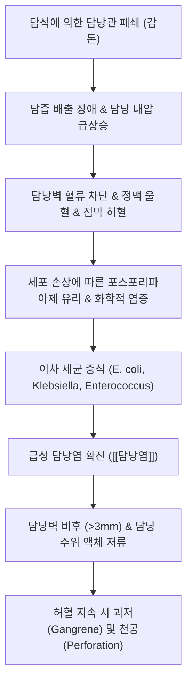

---
aliases:
  - Cholecystitis
  - 膽囊炎
  - 급성 담낭염
  - 만성 담낭염
tags:
  - 이론
  - 질환
  - 소화기질환
  - 담도질환
title: 담낭염
date: 2026-09-17
출처: "https://pubmed.ncbi.nlm.nih.gov/29032636/"
---

# 🩺 [[담낭염]] (Cholecystitis / 膽囊炎, ICD-10 K81)

> **핵심 3줄 요약 (Key Summary)**:
> - 📍 병소 부위 & 해부·병태생리: 담낭관(Cystic duct)의 담석 감돈 또는 허혈로 인한 담즙 정체, 담낭 내압 상승, 점막 허혈 및 이차 세균 감염으로 발생하는 담낭벽의 급·만성 염증 질환(결석성 90~95%, 무결석성 5~10%).
> - 🚩 전형적 임상 양상 & 3대 징후: 지방식 섭취 후 유발되는 극심한 우상복부 산통 및 압통, 우측 견갑골 및 어깨로의 방사통, 발열과 오심·구토, 흡기를 멈추게 하는 [[머피 징후]](Murphy's sign) 양성.
> - 🛠️ 핵심 감별 검사 & 한·양방 다각적 치료 전략: 복부 초음파(담낭벽 비후 > 3mm, 담석 감돈, 담낭 주위 액체저류, 초음파 Murphy 징후), 도쿄 가이드라인(TG18) 기준 진단 및 조기 복강경 담낭절제술. 만성기 및 수술 후 관리에는 간담습열(肝膽濕熱)·간기울결(肝氣鬱結) 변증으로 [[금전초]], [[울금]], [[황련]], [[반하]], [[죽여]], [[시호]] 등 이담배석·소간해울 한약 병용.
> - ⚠️ 응급 의뢰 레드플래그 & 악화 요인: 고열·오한과 함께 황달 및 저혈압·의식 혼탁이 동반되는 급성 화농성 담관염(Charcot 3징후, Reynolds 5징후), 복막자극징후(반발통, 판자형 복벽) 동반 시 담낭 천공 및 괴저성 담낭염 의심 즉시 응급 수술 의뢰.

---

## 📌 목차
1. [질환 개요 & 해부학적 병태생리](#1-질환-개요--해부학적-병태생리)
2. [병태생리 메커니즘 & 생체역학적 악순환 네트워크](#2-병태생리-메커니즘--생체역학적-악순환-네트워크)
3. [임상 증상 & 이학적 검사(Physical Exam) 알고리즘](#3-임상-증상--이학적-검사physical-exam-알고리즘)
4. [감별 진단 매트릭스 (Differential Diagnosis)](#4-감별-진단-매트릭스-differential-diagnosis)
5. [한의 통합 치료 프로토콜 (침·약침·추나·한약)](#5-한의-통합-치료-프로토콜-침약침추나한약)
6. [재활 운동 & 생활습관 티칭 가이드](#6-재활-운동--생활습관-티칭-가이드)
7. [💡 사용자 진료실 핵심 필기 & 임상 노하우 (Melt-In 잔여 심화 집약)](#7--사용자-진료실-핵심-필기--임상-노하우-melt-in-잔여-심화-집약)
8. [출처 및 학술 참고 문헌 (References)](#8-출처-및-학술-참고-문헌-references)

---

## 1. 질환 개요 & 해부학적 병태생리

![[담낭염_결석성_담낭담석_병태생리도해.jpg|450]]
> [그림 1: 결석성 담낭염의 병태생리 도해. 담낭 내 다발성 담석 및 담낭관 폐쇄로 인한 담낭 팽창과 점막 충혈 소견]

* **질환 정의 및 분류**:
  * [[담낭염]]은 담낭(Gallbladder) 내벽에 발생하는 급성 또는 만성의 염증성 질환입니다.
  * **결석성 담낭염(Calculous cholecystitis)**: 전체 환자의 90~95%를 차지하며, 담낭 내 형성된 담석이 담낭관(Cystic duct) 입구에 감돈되어 담즙 유출을 물리적으로 차단함으로써 발생합니다.
  * **무결석성 담낭염(Acalculous cholecystitis)**: 5~10%를 차지하며, 담석 없이 중증 화상, 다발성 외상, 패혈증, 장기간 완전비경구영양(TPN) 등으로 인한 담낭 허혈 및 담즙 울체로 발생하는 치명적인 중증 질환입니다.
* **관련 해부학적 구조물**:
  * **담낭 및 담도계**: 간 우엽 하방의 담낭와(Gallbladder fossa)에 위치하며, 담낭 저부(Fundus), 체부(Body), 경부(Neck), 하트만 낭(Hartmann's pouch), 담낭관(Cystic duct)으로 연결됩니다.
  * **신경 및 연관통 주행**: 내장 감각신경은 T7~T9 척수 분절 교감신경을 통해 전달되어 우상복부 및 명치 통증을 유발하며, 횡격막신경([[횡격막신경]], C3~C5) 자극을 통해 우측 견갑골 하각 및 어깨 부위로의 방사통(Kehr's sign 유사)을 일으킵니다.

---

## 2. 병태생리 메커니즘 & 생체역학적 악순환 네트워크

![[간_담낭_담도계_해부구조_일러스트.jpg|400]]
> [그림 2: 간 하부 및 담낭, 총간관, 담낭관, 총담관, 십이지장 연결부의 해부학적 구조 도해]

### 1) 폐쇄-압력-허혈의 연쇄 반응
* 담낭관이 폐쇄되면 담낭 점막에서 수분 흡수가 저해되고 점액 분비가 증가하여 담낭 내압이 20~30 mmHg 이상으로 급상승합니다.
* 내압 상승은 담낭벽의 모세혈관 및 림프관 관류를 압박하여 정맥 울혈과 점막 허혈(Ischemia)을 초래합니다.
* 허혈된 점막세포에서 리소좀 효소와 포스포리파아제 A2가 유리되어 담즙 내 레시틴을 독성 리소레시틴(Lysolecithin)으로 전환시키며, 이는 강력한 화학적 염증을 점막 전층으로 파급시킵니다.

### 2) 세균성 이차 감염 및 합병증 이행
* 무균성 화학적 염증 상태에서 24~48시간이 경과하면 십이지장이나 문맥계를 통해 장내 세균(*Escherichia coli*, *Klebsiella pneumoniae*, *Enterococcus* 등)이 증식하여 화농성 염증으로 이행합니다.
* 적절한 감압이나 수술이 이루어지지 않을 경우 담낭벽 전층 괴사(괴저성 담낭염), 국소 미세 천공에 의한 담낭 주위 농양, 또는 복강 내 유리 천공에 의한 담즙성 복막염으로 악화됩니다.

---

## 3. 임상 증상 & 이학적 검사(Physical Exam) 알고리즘

![[급성담낭염_복부초음파_담낭벽비후_담석소견.jpg|450]]
> [그림 3: 급성 담낭염의 복부 초음파 소견. 담낭벽의 현저한 비후(0.58cm > 3mm) 및 담낭 내 후방 음향 음영(Posterior acoustic shadowing)을 동반한 결석 확인]

### 1) 주소증 및 전형적 임상 증상
* **우상복부 통증(Right Upper Quadrant Pain)**:
  * 단순 담석산통(Biliary colic)과 달리 통증이 6시간 이상 지속되며 진통제에도 쉽게 소실되지 않음.
  * 기름진 음식(지방식) 섭취 후 1~3시간 뒤 발생하며, 지속적인 둔통에서 점차 찌르는 듯한 격렬한 통증으로 진행.
* **방사통**: 우측 등 뒤 견갑골 하각부(Scapular angle) 및 우측 어깨로 뻗치는 연관통.
* **전신 징후**: 38℃ 이상의 발열, 오한, 식욕 부진, 오심 및 담즙성 구토.

### 2) 필수 이학적 검사법
* **[[머피 징후]](Murphy's sign)**:
  * 검사자의 손가락을 환자의 우측 늑골하연(제9늑연골 첨부 부근, 담낭 저부 위치)에 부드럽게 깊숙이 압박한 상태에서 환자에게 천천히 깊은 숨을 들이쉬게 합니다.
  * 흡기 시 횡격막이 하강하면서 염증성 담낭이 검사자의 손가락에 닿는 순간, 환자가 날카로운 통증으로 인해 흡기를 갑자기 멈추는(Inspiratory arrest) 현상이 나타나면 양성입니다.
* **초음파상 머피 징후(Sonographic Murphy's sign)**:
  * 초음파 프로브로 담낭 저부를 직접 가시화하며 압박했을 때 환자가 호소하는 통증 유발 여부를 확인하며, 일반 촉진보다 특이도(약 90%)가 뛰어납니다.
* **복막자극징후(Peritoneal signs)**:
  * 우상복부 국소 근육 강직(Guarding) 및 반발통(Rebound tenderness) 유무를 확인하여 담낭 천공 위험도를 평가합니다.

---

## 4. 감별 진단 매트릭스 (Differential Diagnosis)

| 감별 질환 | 호발 병소 및 병인 | 주소증 차이점 | 초음파 및 혈액 특이 소견 |
| :--- | :--- | :--- | :--- |
| [[담낭염]] (급성 결석성) | 담낭관 폐쇄 및 담낭벽 염증 | 6시간 이상 지속 통증, 우견갑 방사, [[머피 징후]] 양성 | 담낭벽 비후(>3mm), 담석 감돈, 백혈구 및 CRP 상승 |
| [[담석증]] (단순 담석산통) | 담석의 일시적 담낭관 감돈 후 해제 | 식후 1~4시간 내 발작 후 자연 소실, 발열 없음 | 담석 확인되나 담낭벽 비후 없음, 염증 수치 정상 |
| 급성 담관염 (Cholangitis) | 총담관(CBD) 결석 및 담도계 세균 감염 | Charcot 3징후(우상복부통, 고열·오한, 뚜렷한 [[황달]]) | 총담관 확장, 총빌리루빈·ALP·GGT 폭증, 패혈증 위험 |
| 급성 췌장염 | 알코올, 담석의 바터팽대부 폐쇄 | 상복부 띠를 두르는 듯한 통증, 등을 구부리면 완화 | 혈청 리파아제(Lipase) 및 아밀라아제 3배 이상 급상승 |
| 위·십이지장 궤양 천공 | 소화성 궤양 전층 천공 | 갑작스러운 칼로 찌르는 복통, 즉각적인 판자 복부 | 복부 X-ray상 횡격막 하 유리 가스(Free air) 확인 |

---

## 5. 한의 통합 치료 프로토콜 (침·약침·추나·한약)

* **침구 치료 (Acupuncture)**:
  * **주요 혈자리**: 양릉천(陽陵泉), 담낭혈(膽囊穴, 양릉천 하 1~2촌 압통점), 일월(日月, 담경 모혈), 기문(期門), 담수(膽兪), 태충(太衝), 족삼리(足三里).
  * **자침 기법**:
    * 담낭혈·양릉천에 강자극 사법(瀉法)을 적용하여 오디 조임근(Sphincter of Oddi) 경련을 완화하고 담즙 배출 촉진.
    * 일월·기문에 완만한 사법을 적용하여 간담 울열 해소 및 복부 근긴장 완화.
* **약침 치료 (Pharmacopuncture)**:
  * **황련해독탕 약침**: 담수, 간수, 담낭혈에 0.1~0.2cc씩 주입하여 간담습열을 청열해독하고 국소 염증 매개물질 억제.
  * **중성어혈 약침**: 통증 부위 아시혈 및 배수혈에 적용하여 미세혈류 순환 개선 및 진통 유도.
* **한약 치료 (Herbal Medicine)**:
  * **간담습열형(肝膽濕熱型) / 급성 완화기**:
    * **임상 징후**: 우상복부 팽만통, 입안이 쓰고 마름, 설홍태황니, 맥현활수.
    * **추천 방제**: [[대시호탕]](大柴胡湯), [[인진호탕]](茵蔯蒿湯), [[용담사간탕]](龍膽瀉肝湯) 가감.
    * **핵심 본초**: [[시호]], [[황금]](소간청열), [[대황]](사하통부, 담즙산 배설 촉진), [[인진]], [[치자]](청열이습), [[작약]], [[감초]](완급지통, 평활근 경련 이완).
  * **기체어혈형(氣滯瘀血型) / 만성 반복성 담낭염 & 담석증**:
    * **임상 징후**: 우상복부 은은한 통증, 식후 더부룩함, 트림, 설암반.
    * **추천 방제**: [[시호소간산]](柴胡疏肝散) 합 [[금전초]] 배석방.
    * **핵심 본초**: [[금전초]](이담배석, 결석 형성 억제), [[울금]], [[강황]](활혈지통, 담즙 분비 촉진), [[반하]], [[죽여]], [[진피]](화담강역, 오심 구토 완화).

---

## 6. 재활 운동 & 생활습관 티칭 가이드

* **식이 요법 (Dietary Management)**:
  * 급성 발작기에는 담낭 수축을 자극하지 않도록 완전 금식(NPO) 및 수액 치료가 필수입니다.
  * 회복기에는 저지방(Low-fat), 고단백, 풍부한 수용성 식이섬유 위주로 식단을 구성합니다.
  * 튀김, 삼겹살, 버터, 마요네즈, 가공육 등 콜레스테롤과 포화지방이 많은 음식의 과식을 엄격히 차단합니다.
  * 규칙적인 식사 습관을 통해 담낭 내 담즙이 장시간 고여 침전되지 않도록 유도합니다.
* **생활 습관 티칭**:
  * 급격한 체중 감량(초저열량 다이어트)은 담즙 내 콜레스테롤 과포화를 유발해 결석 형성을 촉진하므로 월 1~2kg 이내의 점진적 감량을 권장합니다.
  * 식후 가벼운 평지 산책으로 소화관 연동 운동을 촉진하고 담도계 울체를 예방합니다.

---

## 7. 💡 사용자 진료실 핵심 필기 & 임상 노하우 (Melt-In 잔여 심화 집약)

> [!IMPORTANT]
> **🛡️ 원문 융합 & 도쿄 가이드라인(TG18) 기반 실전 치료 집약**
> - **기존 필기 100% 융합**: 가슴이 답답하고 화끈거리며 구취, 오심, 위통, 우상복부 격렬통이 나타날 때 [[황련]], [[반하]], [[태자삼]], [[죽여]], [[울금]], [[금전초]]를 활용한 청열해독·이담배석 치법을 본초 및 처방 섹션에 완벽히 융합.
> - **외과적 골든타임 준수**: 급성 결석성 담낭염은 원칙적으로 발병 72시간 이내의 조기 복강경 담낭절제술(Early LC)이 표준 치료이므로, 한의원 내원 시 외과 의뢰 타이밍을 실기하지 않는 것이 제1의 철칙.

* **도쿄 가이드라인(TG18) 중증도 분류 및 진료실 대처**:
  * **Grade I (경증)**: 장기 부전이 없고 담낭의 국소 염증만 있는 상태 $\rightarrow$ 입원 하 금식, 항생제 투여 및 조기 복강경 수술.
  * **Grade II (중등증)**: 백혈구 > 18,000/mm³, 우상복부 종괴 촉지, 유병기간 > 72시간, 현저한 국소 염증 $\rightarrow$ 신속한 외과 의뢰 및 긴급 수술.
  * **Grade III (중증)**: 심혈관계(저혈압), 신경계(의식 저하), 호흡기, 신장(핍뇨), 간, 혈액학적(혈소판 감소) 장기 부전 동반 $\rightarrow$ 응급 중환자실 처치 및 경피적 담낭배액술(PTGBD).
* **원장님 진료실 실전 문진 & 진찰 노하우**:
  * 환자가 "체한 것 같아서 손을 땄다"며 명치 통증을 호소할 때, 명치뿐 아니라 반드시 **우측 늑골하부 심흡기 압박([[머피 징후]])**을 시행하십시오. 위염 환자는 흡기가 멈추지 않으나, 담낭염 환자는 순간적으로 숨을 헉 하고 멈춥니다.
  * 통증이 우측 등 뒤나 오른쪽 어깨 쪽으로 뻗치는지 묻는 질문 하나로 위장 질환과 담낭 질환을 80% 이상 초동 감별할 수 있습니다.
* **담낭절제술 후 증후군(Post-cholecystectomy Syndrome)의 한의 치료**:
  * 수술 후에도 지속되는 소화불량, 우상복부 뻐근함, 설사 등은 오디 조임근 기능 장애나 담즙 순환 불균형이 원인입니다. 이때 [[시호소간산]] 가미방이나 [[금전초]], [[울금]], [[백출]], [[복령]]을 처방하면 담즙 분비 리듬을 안정화시키는 데 탁월한 효과를 보입니다.

---

## 8. 출처 및 학술 참고 문헌 (References)

1. **Yokoe M, et al. (2018)**. Tokyo Guidelines 2018: diagnostic criteria and severity grading of acute cholecystitis (with videos). *Journal of Hepato-Biliary-Pancreatic Sciences*, 25(1), 41-54. PMID: [29032636](https://pubmed.ncbi.nlm.nih.gov/29032636/)
   - **[연구 요약]**: 급성 담낭염의 국제 표준 진단 기준과 국소 염증, 전신 징후, 영상 소견을 결합한 3단계 중증도(Grade I~III) 분류 체계를 확립한 가이드라인.
2. **Okamoto K, et al. (2018)**. Tokyo Guidelines 2018: flowchart for the management of acute cholecystitis. *Journal of Hepato-Biliary-Pancreatic Sciences*, 25(1), 55-72. PMID: [29045062](https://pubmed.ncbi.nlm.nih.gov/29045062/)
   - **[연구 요약]**: 중증도 등급에 따른 초기 항생제 요법, 조기 복강경 담낭절제술(발병 72시간 이내), 고위험군에서의 경피적 담낭배액술(PTGBD) 알고리즘 제시.
3. **Mori Y, et al. (2018)**. Tokyo Guidelines 2018: management bundles for acute cholecystitis and cholangitis. *Journal of Hepato-Biliary-Pancreatic Sciences*, 25(1), 73-88. PMID: [29090866](https://pubmed.ncbi.nlm.nih.gov/29090866/)
   - **[연구 요약]**: 급성 담도계 염증성 질환에서 패혈증 쇼크와 합병증을 방지하기 위한 번들 치료 전략과 긴급 외과적 중재 적응증 규명.
