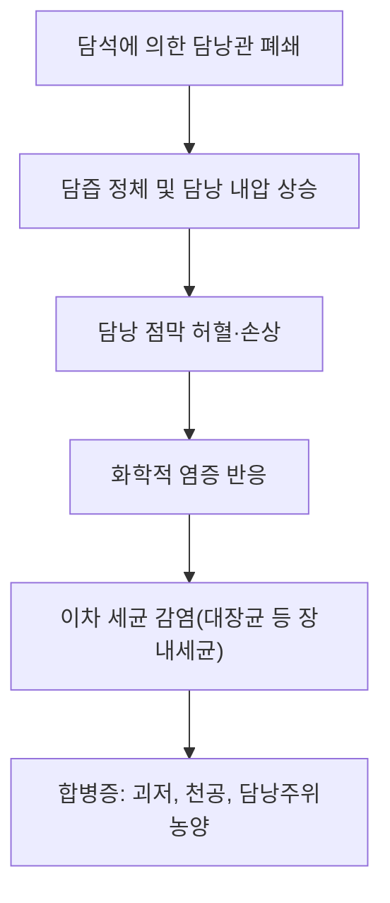

---
aliases:
  - Cholecystitis
  - 膽囊炎
  - 급성 담낭염
  - 만성 담낭염
tags:
  - 질환
  - 소화기질환
  - 담도질환
---

# 🩺 담낭염 (膽囊炎, Cholecystitis — ICD-10 K81)

> **핵심 3줄 요약 (Key Summary)**:
> - 📍 병소 부위 & 병태생리: 담낭(쓸개)의 염증으로, 약 90~95%가 담석이 담낭관을 폐쇄해 발생하는 결석성 담낭염(Calculous cholecystitis)이며, 담석 없이 발생하는 무결석성 담낭염(Acalculous cholecystitis)은 중증 환자·장기 금식 환자에서 발생하는 드물지만 위중한 형태.
> - 🚩 전형적 임상 양상: 우상복부 통증(식후 악화, 특히 지방식 후), 발열, 오심·구토. Murphy 징후(우상복부 촉진 시 흡기 중단)가 이학적 검사에서 특징적.
> - 🛠️ 핵심 진단 & 치료: 복부 초음파가 1차 선택 영상검사(담낭벽 비후, 담석, 담낭 주위 액체저류, 초음파 Murphy 징후). 도쿄 가이드라인(Tokyo Guidelines)이 국제 표준 진단·중증도 기준으로 활용됨. 치료는 금식·수액·항생제 및 조기 복강경 담낭절제술이 표준.
> - ⚠️ 응급 레드플래그: 고열·오한을 동반한 패혈증 징후, 황달 동반(총담관결석·담관염 의심), 심한 복막자극징후는 응급 수술적 처치가 필요한 중증 담낭염 또는 합병증(천공, 괴저성 담낭염)을 시사.

---

## 📌 목차
1. [질환 개요 & 분류](#1-질환-개요--분류)
2. [병태생리](#2-병태생리)
3. [임상 증상 & 진단](#3-임상-증상--진단)
4. [도쿄 가이드라인 진단·중증도 기준](#4-도쿄-가이드라인-진단중증도-기준)
5. [치료 전략](#5-치료-전략)
6. [한의학적 연계](#6-한의학적-연계)
7. [출처 및 학술 참고 문헌 (References)](#7-출처-및-학술-참고-문헌-references)

---

## 1. 질환 개요 & 분류

* **결석성 담낭염(Calculous cholecystitis)**: 전체 담낭염의 90~95%를 차지하며, 담석이 담낭관을 폐쇄해 담즙 정체와 이차적 염증·감염을 유발합니다.
* **무결석성 담낭염(Acalculous cholecystitis)**: 담석 없이 담낭 허혈·담즙 정체로 발생하며, 중환자실 환자, 장기간 완전비경구영양(TPN), 심한 외상·화상 환자 등에서 발생하는 중증도가 높은 형태입니다.

---

## 2. 병태생리

담낭관 폐쇄로 인한 담즙 정체는 담낭 내압을 상승시켜 점막 허혈과 화학적 염증을 유발하며, 이후 장내세균(대장균, 클렙시엘라 등)에 의한 이차 감염이 더해지면서 임상적 담낭염으로 진행합니다. 치료가 지연되면 괴저성 담낭염, 천공, 담낭주위농양 등 중증 합병증으로 진행할 수 있습니다.

---

## 3. 임상 증상 & 진단

* **증상**: 지속적인 우상복부 또는 명치 통증(수 시간 이상 지속, 담석산통과 달리 저절로 호전되지 않음), 우견갑골로의 방사통, 발열, 오심·구토, 식욕부진.
* **이학적 검사**: Murphy 징후(검사자가 우상복부를 촉진한 상태에서 환자가 깊게 숨을 들이쉴 때 통증으로 흡기가 중단되는 소견) 양성.
* **검사실 소견**: 백혈구 증가, CRP 상승. 황달·간효소 상승이 동반되면 총담관결석·담관염 동반을 의심해야 합니다.
* **영상검사**: 복부 초음파가 1차 선택검사로, 담낭벽 비후(>3mm), 담석, 담낭 주위 액체저류, 초음파 Murphy 징후를 확인합니다. HIDA 스캔(간담도 신티그라피)은 진단이 불명확할 때 담낭관 폐쇄를 확인하는 데 유용합니다.

---

## 4. 도쿄 가이드라인 진단·중증도 기준

2007년 처음 발표되고 이후 개정된 도쿄 가이드라인(Tokyo Guidelines)은 급성 담낭염의 국제 표준 진단 기준으로, ① 국소 염증 징후(Murphy 징후, 우상복부 통증·압통·종괴), ② 전신 염증 징후(발열, CRP 상승, 백혈구증가), ③ 영상 소견을 종합해 진단하며, 중증도를 경증(Grade I)·중등증(Grade II)·중증(Grade III, 장기부전 동반)으로 분류해 치료 방침(항생제 단독 vs 조기 수술 vs 담낭배액술)을 결정하는 데 활용됩니다.

---

## 5. 치료 전략

* **초기 처치**: 금식, 정맥 수액, 진통제, 광범위 항생제(장내세균·혐기성균 커버).
* **수술적 치료**: 발병 72시간 이내 조기 복강경 담낭절제술이 표준 치료로 권고되며, 지연 수술 대비 합병증·재발을 줄이는 것으로 알려져 있습니다.
* **경피적 담낭배액술**: 수술 위험이 높은 중증·고령 환자에서 우선 담낭 감압 후 추후 수술을 고려하는 가교적(bridging) 치료로 활용됩니다.

---

## 6. 한의학적 연계

담낭염의 우상복부 통증·발열·오심은 한의학적으로 간담습열(肝膽濕熱) 또는 간울기체(肝鬱氣滯)로 변증하는 경우가 많으며, 청열이습(淸熱利濕)·소간이담(疏肝利膽) 치법이 보조적으로 활용될 수 있습니다.

* **의안 변증 예시**: 가슴이 답답하고 화끈거리며 식욕이 적고 배변에서 냄새가 나며 위가 아프고 메스꺼움, 우상복부 격렬한 통증이 있는 경우 [[황련]]·[[반하]]·태자삼·[[죽여]]·[[울금]]·[[금전초]]를 사용해 청열해독·진통 목적으로 변증 치료하는 임상례가 볼트 내 강의록에 기록되어 있습니다 ([[만성 담낭염]] 노트 참고).
* [[담석증]]에는 [[금전초]]·옥미수·[[울금]]·[[강황]] 등이 이담(利膽)·배석(排石) 목적으로 활용됩니다.

다만 급성 담낭염은 패혈증·천공 등으로 진행할 수 있는 외과적 응급질환이므로, 한약 치료가 표준 항생제·수술적 치료를 대체할 수 없으며 반드시 병원 진료를 우선해야 합니다.

> 📎 만성 반복성 담낭염의 한의학적 변증·치료에 관한 임상 강의 기록은 [[만성 담낭염]] 노트 참고.

---

## 7. 출처 및 학술 참고 문헌 (References)

1. **Yokoe M, et al.** Tokyo Guidelines 2018: diagnostic criteria and severity grading of acute cholecystitis. *Journal of Hepato-Biliary-Pancreatic Sciences*.
   - **[요약]**: 급성 담낭염의 국제 표준 진단 기준 및 중증도 분류 체계를 제시한 개정 가이드라인.
2. **Diagnostic criteria and severity assessment of acute cholecystitis: Tokyo Guidelines**. PMID: [17252300](https://pubmed.ncbi.nlm.nih.gov/17252300/)
   - **[연구 요약]**: 도쿄 가이드라인의 초판 진단 기준 및 중증도 평가 체계를 제시한 원 논문.
