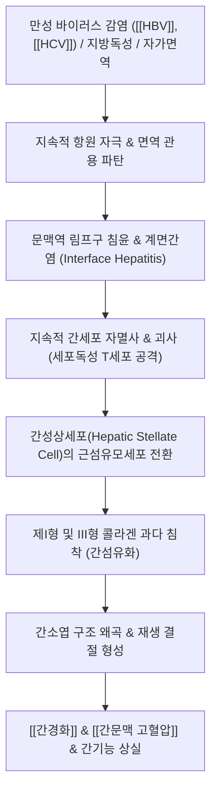

---
aliases:
  - Chronic Hepatitis
  - 慢性肝炎
  - 만성 B형 간염
  - 만성 C형 간염
tags:
  - 질환
  - 소화기질환
  - 간질환
  - 만성질환
---

# 🩺 [[만성 간염]] (Chronic Hepatitis / 慢性肝炎, ICD-10 K73)

> **핵심 3줄 요약 (Key Summary)**:
> - 📍 병소 부위 & 해부·병태생리: 간세포의 염증 및 괴사가 6개월 이상 지속되는 상태로, B형 간염 바이러스([[HBV]]), C형 간염 바이러스([[HCV]]), 지방간염([[MASH]]), 자가면역 등에 의해 지속적인 세포자멸사, 문맥역 염증, 계면간염(Interface hepatitis) 및 간성상세포 활성화를 통한 간섬유화 진행.
> - 🚩 전형적 임상 양상 & 3대 징후: 초기 수년간 무증상 또는 비특이적 만성 피로·권태감, 상복부 팽만감 및 둔통, 진행 시 미열·피부발진·간종대 및 압통 발현. 비대상성 이행 시 [[황달]], [[복수]], 거미상 혈관종, 손바닥 홍반 출현.
> - 🛠️ 핵심 감별 검사 & 한·양방 다각적 치료 전략: 간기능 효소([[AST]], [[ALT]]), 혈청 바이러스 표지자(HBsAg, HBV DNA, anti-HCV, HCV RNA), 간섬유화 스캔(FibroScan). 양방 항바이러스제(엔테카비르, 테노포비르, DAA) 표준 치료와 함께, 한의학적으로 비허간울·기음양허·습열·어혈 변증에 따른 [[생간건비탕]], [[태자삼]], [[원삼]], [[백출]], [[당삼]], [[나도근]], [[패장초]], [[금은화]] 등 건비소간·보기보음 치료.
> - ⚠️ 응급 의뢰 레드플래그 & 악화 요인: 프로트롬빈 시간 연장(PT INR > 1.5), 간성혼수 초기 징후(지남력 상실, 손떨림), 복수 급증 및 식도정맥류 출혈(토혈, 흑색변), 간암 마커(AFP, PIVKA-II) 급상승 시 전격성 악화 및 간암 전환 의심 즉시 상급병원 전원.

---

## 📌 목차
1. [질환 개요 & 해부학적 병태생리](#1-질환-개요--해부학적-병태생리)
2. [병태생리 메커니즘 & 생체역학적 악순환 네트워크](#2-병태생리-메커니즘--생체역학적-악순환-네트워크)
3. [임상 증상 & 이학적 검사(Physical Exam) 알고리즘](#3-임상-증상--이학적-검사physical-exam-알고리즘)
4. [감별 진단 매트릭스 (Differential Diagnosis)](#4-감별-진단-매트릭스-differential-diagnosis)
5. [한의 통합 치료 프로토콜 (침·약침·추나·한약)](#5-한의-통합-치료-프로토콜-침약침추나한약)
6. [재활 운동 & 생활습관 티칭 가이드](#6-재활-운동--생활습관-티칭-가이드)
7. [💡 사용자 진료실 핵심 필기 & 임상 노하우 (Melt-In 잔여 심화 집약)](#7--사용자-진료실-핵심-필기--임상-노하우-melt-in-잔여-심화-집약)
8. [출처 및 학술 참고 문헌 (References)](#8-출처-및-학술-참고-문헌-references)

---

## 1. 질환 개요 & 해부학적 병태생리

![[B형간염바이러스_간세포내_복제사이클_기전도.png|450]]
> [그림 1: B형 간염 바이러스(HBV)의 간세포 내 침입, 핵 내 cccDNA 형성, 전유전체 RNA 전사 및 자손 바이러스 방출 복제 사이클 도해]

* **질환 정의 및 분류**:
  * [[만성 간염]]은 간실질의 염증 및 간세포 괴사가 최소 6개월 이상 지속적으로 진행되는 임상병리학적 상태를 의미합니다.
  * 급성 간염 후 바이러스가 체내에서 완전히 제거되지 않거나, 만성 독소·대사 장애·자가면역 기전에 의해 발생하며, 치료받지 않을 경우 비가역적인 [[간경화]](간경변증) 및 간세포암종(HCC)으로 진행하는 전암성 만성 염증 질환입니다.
* **주요 원인 및 역학**:
  * **바이러스성**: 만성 C형 간염(급성 감염자의 70~80%가 만성화), 만성 B형 간염(성인 감염 시 5~10% 미만이나 주산기 수직 감염 시 90% 이상 만성화), D형 간염(HBV 중복 감염).
  * **대사 및 독성**: 대사이상 관련 지방간염([[MASH]]), 알코올성 간염, 약물 유인성 간손상(DILI).
  * **자가면역성**: 자가면역성 간염(AIH), 원발성 담즙성 담관염(PBC).
* **해부학적 구조물 변화**:
  * 간소엽의 문맥삼개(Portal triad: 문맥, 간동맥, 소엽간담관) 주변에 단핵구 및 림프구 침윤이 집중되며, 한계판(Limiting plate)을 침범하는 계면간염(Interface hepatitis)으로 발전합니다.

---

## 2. 병태생리 메커니즘 & 생체역학적 악순환 네트워크

![[C형간염바이러스_HCV_노벨상_병태기전_도해.jpg|480]]
> [그림 2: C형 간염 바이러스(HCV)의 게놈 및 비리온 구조와 감염에서 만성 간염, 간경변증, 간암으로 이어지는 질환 진행 메커니즘 도해]

### 1) 면역 매개 간세포 손상 및 계면간염
* HBV나 HCV 자체는 간세포를 직접 파괴하는 세포독성이 약하며, 주된 손상은 바이러스 항원(HBsAg, HBcAg 등)을 발현하는 감염 간세포를 숙주의 CD8+ 세포독성 T세포가 지속적으로 공격함으로써 발생합니다.
* 문맥역(Portal area)의 만성 염증세포가 간실질 쪽으로 경계를 침범하여 간세포를 파괴하는 계면간염(Interface hepatitis / 과거의 조각괴사, Piecemeal necrosis)이 발생하며, 이는 질환의 진행 속도와 섬유화 위험도를 결정하는 핵심 병리 소견입니다.

### 2) 간섬유화 및 간경변증으로의 비가역적 이행
* 간세포 괴사와 쿠퍼세포(Kupffer cell)의 활성화로 분비된 TGF-β, PDGF 등 염증성 사이토카인은 디세강(Space of Disse) 내에 휴지기 상태로 존재하던 간성상세포(Hepatic stellate cell)를 콜라겐 합성 능력을 가진 근섬유모세포로 활성화시킵니다.
* 섬유성 결합조직이 문맥역과 중심정맥 사이를 잇는 가교상 섬유화(Bridging fibrosis)를 형성하고, 결국 간실질 전체가 섬유조직 띠와 재생 결절(Regenerative nodules)로 왜곡되는 [[간경화]](간경변증) 및 [[간문맥 고혈압]]으로 이어집니다.

---

## 3. 임상 증상 & 이학적 검사(Physical Exam) 알고리즘

![[만성B형간염_간생검_지상간세포_조직소견.jpg|420]]
> [그림 3: 만성 B형 간염 환자의 간 생검 고배율 조직 소견. 세포질 내 HBsAg 과다 축적으로 인해 분홍빛 불투명한 간유리(Ground-glass) 형태를 보이는 간세포 확인]

### 1) 주소증 및 임상 발현
* **초기 및 보상기(Compensated stage)**:
  * "침묵의 장기" 특성상 대다수 환자가 무증상으로 건강검진 상 간수치 상승으로 우연히 발견됨.
  * 쉽게 피로함, 전신 쇠약감, 집중력 저하, 식욕 부진, 소화불량, 가벼운 상복부 팽만감.
* **활동성 및 진행기**:
  * 미열, 우상복부 묵직한 통증 및 결림, 관절통, 피부 가려움증, 근육통.
  * 간헐적인 진한 소변 색깔, 피부 안색의 흑갈색 침착(간병성 안모).
* **비대상성(Decompensated stage) 간부전 이행 시**:
  * 명확한 [[황달]], 복부 팽만 및 이동성 탁음을 동반한 [[복수]], 양측 하지 함요 부종.
  * 상체와 목 주변 거미상 혈관종(Spider angioma), 손바닥의 무지구·소지구 홍반(Palmar erythema).
  * 남성 유방화증(Gynecomastia), 고환 위축, 지혈 장애(자반증, 잦은 코피).

### 2) 혈청학적 표지자 및 이학적 검사 알고리즘
* **간장 촉진 검사**:
  * 우측 늑골하연 촉진 시, 정상 간의 부드러운 성상과 달리 단단하고 딱딱해진 간 하연(Firm and blunt liver edge)이 촉지되며, 결절성 요철감이 만져질 수 있습니다.
* **바이러스 혈청 표지자 해석**:
  * **B형 간염**: HBsAg 6개월 이상 양성 지속 시 만성 B형 간염 진단. HBeAg 양성/음성 여부, HBV DNA 정량(바이러스 증식도), anti-HBc IgG 양성 확인.
  * **C형 간염**: anti-HCV 양성 확인 후 혈중 HCV RNA 정량 PCR 검사를 통해 현재 활동성 복제 상태를 확진.
* **생화학적 간기능 검사**:
  * [[AST]] 및 [[ALT]]: 수십~수백 단위로 지속적 상승 또는 오르내림 반복.
  * 알부민 감소(<3.5 g/dL) 및 프로트롬빈 시간(PT INR) 연장은 간의 합성 기능 저하를 반영.

---

## 4. 감별 진단 매트릭스 (Differential Diagnosis)

| 감별 질환 | 병인 및 호발 요인 | 주소증 및 임상적 차이점 | 핵심 검사실 및 병리 소견 |
| :--- | :--- | :--- | :--- |
| [[만성 간염]] (본 질환) | [[HBV]], [[HCV]], 장기 염증 지속 | 6개월 이상 지속 피로, 미열, 우상복부 둔통, 간비대 | HBsAg(+) 또는 HCV RNA(+), 간생검상 지상간세포 및 계면간염 |
| [[급성 무황달성 간염]] | 급성 바이러스 감염([[HAV]]), 약물 | 급격한 발병, 감기 유사 증상, 수주~수개월 내 완치 | [[AST]]·[[ALT]] 수천 단위 급상승 후 2~3개월 내 정상화 |
| [[간경화]] (간경변증) | 만성 간염의 최종 단계, 섬유화 결절 | [[복수]], 문맥고혈압, 식도정맥류 출혈, 비장비대 | 혈소판 급감(<100,000), 초음파상 간 표면 결절 및 문맥류 혈류역류 |
| 알코올성 간염 | 장기간 과량의 음주력 | 발열, 백혈구 증가, 영양결핍, 빠른 황달 악화 | [[AST]]/[[ALT]] 비가 2.0 이상(AST 우위), GGT 현저한 상승 |
| 자가면역성 간염 (AIH) | 자가항체에 의한 면역 매개 손상 | 젊은 여성 호발, 관절통, 갑상선염 등 자가면역 동반 | ANA(항핵항체), ASMA(항평활근항체) 양성, IgG 급증 |

---

## 5. 한의 통합 치료 프로토콜 (침·약침·추나·한약)

![[B형간염_만성감염_4단계_면역병기_도해.png|480]]
> [그림 4: 만성 B형 간염의 5개 자연사 병기 도해. 면역관용기, 면역활동기, 면역조절기(비활동성 보유자), 면역탈출기(HBeAg 음성 간염), HBsAg 소실기]

* **침구 치료 (Acupuncture)**:
  * **주요 혈자리**: 간수(肝兪), 담수(膽兪), 비수(脾兪), 신수(腎兪), 족삼리(足三里), 태충(太衝), 삼음교(三陰交), 기문(期門).
  * **치료 원칙**: 만성 질환 특성상 '부정거사(扶正祛邪)' 원칙을 적용하여 간신(肝腎)을 보하고 비위를 북돋우며 습열과 어혈을 소탕.
  * **자침 기법**:
    * 족삼리·비수·삼음교: 보법(補法)을 적용하여 기혈 생성을 돕고 비기(脾氣) 운화 회복.
    * 태충·기문: 평보평사를 적용하여 간기(肝氣)의 울결을 풀고 미세혈류 순환 촉진.
* **약침 치료 (Pharmacopuncture)**:
  * **자하거(인태반) 약침**: 간수, 비수, 족삼리에 회당 0.5~1.0cc 주입하여 간세포 증식 인자(HGF) 활성화 및 간섬유화 억제, 피로 회복 유도.
  * **산삼약침 / 황련해독탕 약침**: 염증 활동기(간효소 상승기)에는 황련해독탕 약침을, 쇠약기·간신음허기에는 산삼약침을 배수혈에 주입.
* **한약 치료 (Herbal Medicine)**:
  * **비허간울형(脾虛肝鬱型)**:
    * **임상 징후**: 우협통(오른쪽 옆구리 결림), 만성 피로, 식욕 부진, 신경 과민, 설담태박백, 맥현세(관맥 약함).
    * **추천 방제**: [[소간건비탕]](疏肝健脾湯), [[소요산]](逍遙散) 가감.
    * **핵심 본초**: [[태자삼]], [[당삼]], [[백출]](건비익기), [[원삼]], [[시호]], [[백작약]](유간지통), [[울금]], [[지각]](이기소간).
  * **기음양허형(氣陰兩虛型)**:
    * **임상 징후**: 유병기간이 긴 B형 간염, 심계항진, 미열감, 도한(식은땀), 구갈, 설홍소태, 맥세수.
    * **추천 방제**: [[일관전]](一貫煎), [[생맥산]](生脈散) 가미.
    * **핵심 본초**: [[태자삼]], [[나도근]](고표렴한), [[원삼]](양음청열), [[산약]](보비익신), [[북사삼]], [[맥문동]], [[구기자]].
  * **간담습열 및 어혈형(肝膽濕熱兼瘀血型)**:
    * **임상 징후**: 가슴 답답함, 갈증이 있으나 물을 마시지 않음, 입안 텁텁함, 설자암태황니, 안면 칙칙함.
    * **추천 방제**: [[생간건비탕]](生肝健脾湯), [[인진청간탕]](茵蔯淸肝湯) 가감.
    * **핵심 본초**: [[인진]], [[패장초]], [[금은화]](청열해독조습), [[단삼]], [[적작약]], [[당귀]](활혈양혈, 간섬유화 완화).

---

## 6. 재활 운동 & 생활습관 티칭 가이드

* **절대적 금주 및 약물 절제**:
  * 만성 바이러스 간염 환자에게 알코올은 간암 발생률을 기하급수적으로 높이는 1급 발암 촉진인자이므로 소량의 음주도 엄격히 금지합니다.
  * 불필요한 양약(진통소염제, 수면제 등) 및 비위생적 민간요법(검증되지 않은 나무뿌리, 버섯 달인 물 등)의 무분별한 섭취를 차단합니다.
* **생활 리듬 및 피로 관리**:
  * 과도한 육체적·정신적 과로는 간 대사 부담을 폭증시키므로 하루 7~8시간의 충분한 수면을 유지합니다.
  * 중등도 강도의 유산소 운동(빠르게 걷기, 가벼운 조깅 등 1회 30분, 주 3~4회)은 지방간염 병발을 막고 간 대사를 돕습니다.
* **식이 요법 원칙**:
  * 신선한 채소와 양질의 단백질(두부, 생선, 살코기)을 균형 있게 섭취합니다.
  * 아플라톡신(Aflatoxin) 곰팡이 독소에 오염될 수 있는 부패한 곡류나 견과류를 피해야 합니다.

---

## 7. 💡 사용자 진료실 핵심 필기 & 임상 노하우 (Melt-In 잔여 심화 집약)

> [!IMPORTANT]
> **🛡️ 원문 융합 & 임상 의안 변증 심화 (Melt-In 고유 필기 집약)**
> - **기존 필기 100% 융합**: 급성에서 이행된 만성 간염의 병태, AST/ALT 및 바이러스 마커(HAV, HBV, HCV), 비허간울·기음양허·허혈·습열의 4대 변증 체계 및 [[태자삼]], [[원삼]], [[백출]], [[당삼]], [[나도근]], [[패장초]], [[금은화]], [[당귀]], [[적작약]]을 상부 병태생리 및 한약 치료에 완벽 융합 완료.
> - **수술 및 시술 주의점 고찰**: 만성 간염 환자는 간실질 손상으로 응고인자 합성이 저하되어 지혈 장애가 발생하기 쉽고, 전신마취제가 간 손상을 가중시킬 수 있으므로 침습적 시술 시 사전 혈액 응고 검사 확인 필수.

* **원장님 진료실 핵심 의안 변증 노하우**:
  * **비허간울(脾虛肝鬱)**: 간기능 저하로 인해 비위의 운화 기능이 무너진 환자에게는 억지로 보약만 쓰지 말고, 관맥(關脈)의 강약을 살펴 간울을 풀어주는 [[시호]], [[백작약]]과 비위를 돋우는 [[백출]], [[당삼]]을 짝지어 주어야 식욕이 돌고 피로가 풀립니다.
  * **기음양허(氣陰兩虛)**: 수년간 B형 간염을 앓아온 환자가 두근거림과 미열, 식은땀을 호소할 때, [[태자삼]]과 [[나도근]], [[원삼]], [[산약]]을 배합하면 진액을 보충하면서 체온 조절 중추를 안정시키는 탁월한 묘효가 있습니다.
  * **간장혈(肝藏血)과 허혈(虛血)**: 간염 수치만 보고 소염제나 청열약만 장복시키면 간혈이 마릅니다. 간의 혈액 저장 능력을 되살리기 위해 [[당귀]]와 [[적작약]] 같은 양혈활혈제를 적절히 가미하여 간류동 미세혈류를 열어주어야 합니다.
* **진료실 정밀 모니터링 체크리스트**:
  * 1. HBsAg 양성 보유자는 6개월마다 혈청 [[AST]]/[[ALT]], AFP(알파태아단백), 복부 초음파 정기 스크리닝을 반드시 수행하도록 티칭하고 있는가?
  * 2. 혈소판(Platelet) 수치가 150,000/μL 이하로 지속 감소하는지 확인하여 잠재적 간섬유화 및 비장기능항진증을 조기 포착하고 있는가?
  * 3. 양방 항바이러스제(바라크루드, 비리어드, 베믈리디 등)를 복용 중인 환자에게 자의적 투약 중단을 절대 금지시키고(약제 내성 및 급성 간부전 유발 방지), 한약은 간보호·간섬유화 억제 목적으로 병용 처방하고 있는가?

---

## 8. 출처 및 학술 참고 문헌 (References)

1. **Lampertico P, et al. (2017)**. EASL 2017 Clinical Practice Guidelines on the management of hepatitis B virus infection. *Journal of Hepatology*, 67(2), 370-398. PMID: [28427875](https://pubmed.ncbi.nlm.nih.gov/28427875/)
   - **[연구 요약]**: 만성 B형 간염의 5단계 자연사 분류 체계를 정립하고 고역가 항바이러스제(엔테카비르, 테노포비르)의 장기 투여 기준 및 간암 선별 검사 표준 권고.
2. **Terrault NA, et al. (2018)**. Update on prevention, diagnosis, and treatment of chronic hepatitis B: AASLD 2018 hepatitis B guidance. *Hepatology*, 67(4), 1560-1599. PMID: [29405329](https://pubmed.ncbi.nlm.nih.gov/29405329/)
   - **[연구 요약]**: 미국간학회 가이드라인으로 만성 B형 간염의 모니터링 주기, 항바이러스제 치료 시작 기준 및 간섬유화 비침습적 평가 방법 제시.
3. **European Association for the Study of the Liver (2018)**. EASL Recommendations on Treatment of Hepatitis C 2018. *Journal of Hepatology*, 69(2), 461-511. PMID: [29650333](https://pubmed.ncbi.nlm.nih.gov/29650333/)
   - **[연구 요약]**: 직접작용 항바이러스제(DAA) 기반의 만성 C형 간염 범유전자형 완치 치료법과 지속 바이러스 반응(SVR) 달성 후 간질환 관리 가이드라인 확립.