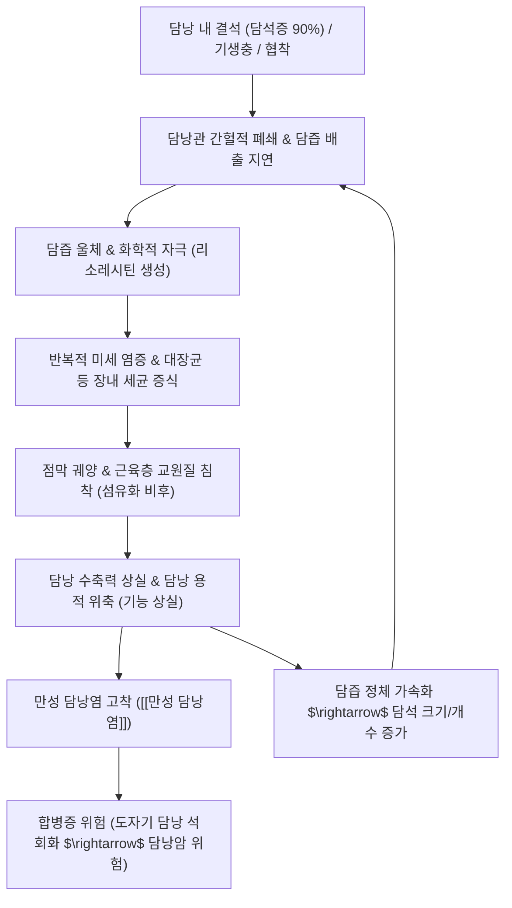

---
aliases:
  - Chronic Cholecystitis
  - 慢性膽囊炎
  - 만성 담석성 담낭염
tags:
  - 이론
  - 질환
  - 소화기질환
  - 담도질환
  - 간질환
title: 만성 담낭염
date: 2026-09-17
출처: "https://pubmed.ncbi.nlm.nih.gov/29261986/"
---

# 🩺 [[만성 담낭염]] (Chronic Cholecystitis / 慢性膽囊炎, ICD-10 K81.1)

> **핵심 3줄 요약 (Key Summary)**:
> - 📍 병소 부위 & 해부·병태생리: 반복적인 담석(90%) 감돈, 담관 협착, 세균 및 기생충 감염 등으로 담낭 점막과 근육층에 만성 염증, 섬유화 및 비후가 유발되어 담낭의 수축력과 담즙 농축 기능이 비가역적으로 황폐화되는 질환.
> - 🚩 전형적 임상 양상 & 3대 징후: 식후(특히 고지방식) 발생하는 우상복부 및 명치부 둔통·담도산통, 우측 견갑골 방사통, 트림·조기 포만감·오심·구토 등 만성 소화불량 및 담즙 울체로 인한 대변 색조 이상(회백색변/녹색변).
> - 🛠️ 핵심 감별 검사 & 한·양방 다각적 치료 전략: 복부 초음파(담석 유무, 담낭벽 불규칙 비후, 도자기 담낭 석회화 평가), 증상 악화 시 복강경 담낭절제술 시행. 한의학에서는 간담습열(肝膽濕熱)·간울기체(肝鬱氣滯) 변증 하에 [[금전초]], [[울금]], [[황련]], [[반하]], [[죽여]], [[옥미수]], [[강황]]을 배합하여 이담배석(利膽排石) 및 평활근 경련 완화.
> - ⚠️ 응급 의뢰 레드플래그 & 악화 요인: 급성 담낭염으로의 재발 악화, 고열·오한·황달 동반 시 급성 화농성 담관염(Charcot 3징후), 복막자극징후(반발통), 도자기 담낭(Porcelain gallbladder) 관찰 시 담낭암 발생 고위험군으로 즉시 외과 수술 의뢰.

---

## 📌 목차
1. [질환 개요 & 해부학적 병태생리](#1-질환-개요--해부학적-병태생리)
2. [병태생리 메커니즘 & 생체역학적 악순환 네트워크](#2-병태생리-메커니즘--생체역학적-악순환-네트워크)
3. [임상 증상 & 이학적 검사(Physical Exam) 알고리즘](#3-임상-증상--이학적-검사physical-exam-알고리즘)
4. [감별 진단 매트릭스 (Differential Diagnosis)](#4-감별-진단-매트릭스-differential-diagnosis)
5. [한의 통합 치료 프로토콜 (침·약침·추나·한약)](#5-한의-통합-치료-프로토콜-침약침추나한약)
6. [재활 운동 & 생활습관 티칭 가이드](#6-재활-운동--생활습관-티칭-가이드)
7. [💡 사용자 진료실 핵심 필기 & 임상 노하우 (Melt-In 잔여 심화 집약)](#7--사용자-진료실-핵심-필기--임상-노하우-melt-in-잔여-심화-집약)
8. [출처 및 학술 참고 문헌 (References)](#8-출처-및-학술-참고-문헌-references)

---

## 1. 질환 개요 & 해부학적 병태생리

![[담낭염_결석성_담낭담석_병태생리도해.jpg|450]]
> [그림 1: 만성 담낭염의 병태생리 모식도. 담낭 내 만성 결석 감돈과 반복적인 미세 염증으로 인해 담낭벽이 섬유화되고 수축 기능이 저하되는 과정]

* **질환 정의 및 개요**:
  * [[만성 담낭염]]은 담낭벽에 장기간에 걸쳐 지속적·반복적으로 발생하는 만성 염증성 질환입니다.
  * 급성 담낭염의 반복적인 재발 후유증으로 발생하거나, 뚜렷한 급성 발작 없이 잠행성으로 담석의 기계적 자극에 의해 서서히 진행됩니다.
  * 담낭 점막의 상피세포 탈락, 고유판 및 근육층의 섬유화(Fibrosis)와 비후, 점막이 근육층으로 함입되는 록키탄스키-아쇼프 동(Rokitansky-Aschoff sinuses) 형성이 특징적인 병리 소견입니다.
  * 담낭염 전반의 급성기 병태생리, 도쿄 가이드라인(TG18) 진단 기준 및 응급 처치는 [[담낭염]] 노트를 참조하십시오.
* **주요 원인 및 감염 경로**:
  * **[[담석증]] (최다 원인, 90% 이상)**: 담낭 내 콜레스테롤 결석 및 색소성 결석이 담낭관 입구를 간헐적으로 폐쇄하여 담즙 울체와 화학적 점막 자극을 유발합니다.
  * **세균 감염**: 담즙 정체 시 십이지장 상행성 또는 문맥혈류를 통해 대장균(*Escherichia coli*), 폐렴간균(*Klebsiella pneumoniae*), 장구균(*Enterococcus*), 포도상구균, 연쇄구균 등이 증식하여 만성 염증을 지속시킵니다.
  * **기타 위험 인자**: 수술 후 담관 협착, 선천성 담도 기형, 기생충(간흡충, 회충) 감염, [[당뇨병]](자율신경병증으로 인한 담낭 운동 저하), 외상 및 허혈성 혈관염.
* **관련 해부학적 구조물**:
  * **담낭 (Gallbladder)**: 간 우엽 하면의 담낭와에 위치하며 용적은 약 30~50 mL입니다.
  * **담도계 배출 경로**: 담낭 저부 $\rightarrow$ 체부 $\rightarrow$ 경부 $\rightarrow$ 하트만 낭(Hartmann's pouch) $\rightarrow$ 담낭관(Cystic duct, 나선판포) $\rightarrow$ 총담관(CBD) $\rightarrow$ 오디 조임근(Sphincter of Oddi) $\rightarrow$ 십이지장 하행부.
  * **신경 주행 및 방사통**: T7~T9 척수 분절의 교감신경 섬유가 내장통(우상복부 및 명치 둔통)을 매개하며, 우측 [[횡격막신경]](C3~C5) 및 복강신경총 자극이 우측 견갑골 하각과 우측 어깨로의 방사통을 일으킵니다.

---

## 2. 병태생리 메커니즘 & 생체역학적 악순환 네트워크

![[간_담낭_담도계_해부구조_일러스트.jpg|400]]
> [그림 2: 간, 담낭, 담낭관, 총간관, 총담관 및 십이지장으로 이어지는 담도계 해부 구조 도해]

### 1) 반복적 폐쇄와 조직학적 개형 (Remodeling)
* 담낭관이 일시적으로 막혔다 풀리는 과정이 수개월~수년간 반복되면서 담낭 점막에 미세 궤양과 재생이 일어납니다.
* 염증 세포(림프구, 형질세포, 대식세포)의 만성 침윤으로 결합조직이 증식하며, 담낭벽 근육층이 두꺼워지고 결국 섬유화(Fibrosis)되어 담낭벽이 탄력성을 잃고 뻣뻣해집니다.
* 심한 경우 점막이 근육층 깊숙이 밀려 들어가는 록키탄스키-아쇼프 동(Rokitansky-Aschoff sinuses)이 현저해지며, 담낭 내강이 좁아지고 수축력이 완전히 소실되어 무기능성 담낭(Non-functioning gallbladder)으로 전락합니다.

### 2) 담즙 생화학 및 색조 변화 기전
* **담즙 울체와 대변 색조의 연관성**:
  * 정상 담즙은 간에서 분비되어 담낭에 농축된 후 십이지장으로 배출되며, 빌리루빈이 장내 세균에 의해 유로빌리노겐과 스테르코빌린(Stercobilin)으로 환원되어 대변의 고유한 갈색을 만듭니다.
  * 담석이나 협착으로 담즙 배출이 심하게 차단되면 장내로 빌리루빈이 도달하지 못해 **회백색(점토색, 아콜릭 스툴 Acolic stool) 또는 옅은 노란색 대변**이 나타납니다.
  * 반대로 담즙이 일시적으로 대량 배출되거나, 장염 등으로 인해 장운동이 과도하게 빨라지면 담즙 색소인 빌리베르딘(Biliverdin)이 황색 스테르코빌린으로 전환될 시간 없이 배출되어 **녹색 변(Green stool)**이 배출됩니다.

---

## 3. 임상 증상 & 이학적 검사(Physical Exam) 알고리즘

![[급성담낭염_복부초음파_담낭벽비후_담석소견.jpg|450]]
> [그림 3: 복부 초음파 검사상 관찰되는 담낭벽의 비후 및 담낭 내 후방 음향 음영을 동반한 결석 소견]

### 1) 주소증 및 임상적 특징
* **반복성 우상복부 둔통 및 담도산통 (Biliary Colic)**:
  * 전형적으로 기름진 음식(삼겹살, 튀김류, 피자 등 고지방식)이나 과식 후 1~3시간 뒤 발생합니다.
  * 급성 담낭염처럼 6시간 이상 지속되는 격렬통보다는, 1~4시간가량 뻐근하고 쥐어짜는 듯한 둔통이 우상복부나 명치(심와부)에 머물다 서서히 경감됩니다.
* **만성 소화불량 증상**:
  * 잦은 트림, 조기 포만감, 가스 팽만, 식욕 부진, 간헐적 오심.
  * 환자들은 단순 "위장병", "만성 소화불량", "체기"로 오인하여 내시경 검사를 반복하지만 위장에 특이 병변이 없는 경우가 흔합니다.
* **연관통 및 전신 징후**:
  * 우측 견갑골 하각 또는 우측 등·어깨로 뻗치는 뻐근한 연관통.
  * 급성 발작이 동반되지 않는 한 발열이나 백혈구 증다증은 경미하거나 없습니다.

### 2) 필수 이학적 검사법
* **[[머피 징후]](Murphy's sign)**:
  * 우측 늑골하연(담낭 부위)을 깊숙이 촉진한 상태에서 심흡기를 시킬 때 통증으로 흡기가 멈추는지 평가합니다.
  * 만성 담낭염에서는 급성 담낭염만큼 극적인 흡기 정지가 나타나지 않을 수 있으나, 심흡기 시 우상복부의 뚜렷한 압통과 불쾌감이 유발됩니다.
* **담낭 종괴 촉지 및 복벽 진찰**:
  * 만성 염증으로 담낭벽이 섬유화되어 위축된 경우 담낭이 촉지되지 않으나, 담낭수종(Hydrops)이 동반된 경우 우상복부에서 매끄러운 둥근 종괴가 만져질 수 있습니다.
  * 복막자극징후(반발통, 복부 강직)가 나타나면 급성 염증의 재발 또는 담낭 천공을 시사하므로 즉각적인 감별이 필요합니다.

---

## 4. 감별 진단 매트릭스 (Differential Diagnosis)

| 감별 질환 | 호발 병소 및 병인 | 주소증 차이점 | 특이적 영상 및 검사 소견 |
| :--- | :--- | :--- | :--- |
| [[만성 담낭염]] (본 질환) | 담석에 의한 반복적 담낭벽 섬유화 | 식후 둔통, 우견갑 방사통, 만성 소화장애 | 초음파상 담낭벽 비후, 결석, 담낭 위축 |
| [[담낭염]] (급성 결석성) | 급성 담낭관 폐쇄 및 화농성 세균 감염 | 6시간 이상 지속되는 극심통, 발열, 오한 | 담낭벽 비후(>3mm), 담낭 주위 액체 저류, [[머피 징후]] 양성 |
| 단순 담석산통 ([[담석증]]) | 결석의 일시적 감돈 후 해제 | 식후 1~4시간 내 발작적 통증 후 완전 소실 | 결석은 확인되나 담낭벽 비후나 만성 염증 소견 없음 |
| 소화성 궤양 (위·십이지장궤양) | 위점막 방어기전 파괴 및 위산 손상 | 공복통, 야간통, 제산제 복용 시 즉각 완화 | 위내시경 검사상 점막 결손 및 궤양 확인 |
| 위식도역류질환 ([[역류성 식도염]]) | 하부식도조임근 이완 및 위산 역류 | 흉골 뒤 작열감(Heartburn), 신트림 | 내시경 검사상 식도 점막 미란, PPI 반응성 |
| 기능성 소화불량증 | 위장관 운동 저하 및 내장 감각과민 | 식후 조기 포만감, 상복부 팽만감, 통증 경미 | 초음파, 내시경, 혈액검사상 기질적 병변 전무 |
| 담낭선근종증 (Adenomyomatosis) | 담낭 점막 과형성 및 로키탄스키 동 증식 | 무증상 다수, 만성 담낭염 유사 둔통 | 초음파상 로키탄스키-아쇼프 동 내 미세결석(혜성꼬리 음영) |

---

## 5. 한의 통합 치료 프로토콜 (침·약침·추나·한약)

* **침구 치료 (Acupuncture)**:
  * **주요 혈자리**: 양릉천(陽陵泉), 담낭혈(膽囊穴, 양릉천 하 1~2촌 압통점), 일월(日月, 담경 모혈), 기문(期門), 담수(膽兪), 간수(肝兪), 족삼리(足三里), 태충(太衝).
  * **자침 기법**:
    * 담낭혈과 양릉천에 평보평사(平補平瀉) 또는 약자극 전침을 적용하여 담낭 평활근 긴장을 완화하고 오디 조임근의 협조적 이완을 유도.
    * 일월·기문혈에 완만한 유침(20분)을 통해 간담 울체와 복벽 근육 긴장을 해소.
* **약침 치료 (Pharmacopuncture)**:
  * **황련해독탕 약침**: 담수, 간수, 담낭혈에 각 0.1~0.2 mL 주입하여 간담습열을 청열해독하고 국소 염증성 사이토카인을 억제.
  * **중성어혈 약침**: 담낭 주변 아시혈 및 배수혈에 주입하여 만성적인 미세 혈류 순환 장애와 섬유화 울혈을 개선.
* **추나 치료 (Chuna Manipulation)**:
  * **흉추 가동 및 신전 기법**: T5~T9 분절의 추골 변위를 교정하여 복강신경총 및 내장 교감신경의 과항진을 정상화.
  * **우측 늑골하 근막 이완 수기(JS)**: 간·담낭 부위 복벽 근막 및 횡격막을 부드럽게 이완하여 담도계 림프 및 혈류 순환을 촉진.
* **한약 치료 (Herbal Medicine)**:
  * **간담습열형 (肝膽濕熱型)**:
    * **임상 징후**: 우상복부 팽만 둔통, 구고(입안이 씀), 구역, 설홍태황니, 맥현활.
    * **처방**: [[대시호탕]](大柴胡湯) 또는 [[인진호탕]](茵蔯蒿湯) 가감.
    * **핵심 본초**: [[시호]], [[황금]](청열소간), [[대황]](사하통부, 담즙산 배설 촉진), [[인진]], [[치자]](청열이습), [[작약]], [[감초]](완급지통).
  * **간울기체 및 담석 정체형 (肝鬱氣滯·膽石型)**:
    * **임상 징후**: 스트레스 시 악화되는 협통, 잦은 트림, 소화불량, 가스 참.
    * **처방**: [[시호소간산]](柴胡疏肝散) 합 금전초배석방.
    * **핵심 본초**: [[금전초]](이담배석의 군약, 콜레스테롤 결정화 억제), [[옥미수]](이뇨이담), [[울금]], [[강황]](소간이기, 담즙 분비 촉진), [[반하]], [[죽여]](강역화담, 메스꺼움 완화).
  * **비위허약 및 습열 내울형 (脾胃虛弱·濕熱型)**:
    * **임상 징후**: 만성 피로, 식욕 부진, 무른 변, 복명, 가슴 답답함.
    * **처방**: 보간건비탕(補肝健脾湯) 가미방.
    * **핵심 본초**: [[태자삼]], [[백출]], [[복령]](건비익기), [[황련]](제습청열), [[진피]](이기건비).

---

## 6. 재활 운동 & 생활습관 티칭 가이드

* **식이 요법 (Dietary Management)**:
  * **엄격한 저지방 식이**: 동물성 포화지방(삼겹살, 갈비, 버터, 마요네즈), 튀김류, 가공육의 섭취를 최소화하여 담낭의 급격한 과수축 발작을 방지합니다.
  * **규칙적인 소식(小食) 습관**: 과식을 피하고 하루 3끼를 일정한 시간에 소량씩 섭취하여 담즙이 담낭에 지나치게 장시간 고여 침전되는 것을 방지합니다.
  * **식이섬유 풍부 식단**: 통곡물, 채소, 해조류 등 수용성 식이섬유는 장내 담즙산 재흡수를 조절하고 콜레스테롤 결석 형성을 억제합니다.
  * **급격한 금식 다이어트 금기**: 단기간의 극단적 절식이나 초저칼로리 다이어트는 담즙 내 콜레스테롤 과포화를 유발하여 담석을 급증시키므로 월 1~2kg 이내의 완만한 감량을 권장합니다.
* **운동 및 일상생활 티칭**:
  * 식후 바로 눕지 않고 20~30분간 가볍게 평지를 걷는 유산소 운동은 소화관 운동을 활성화하고 담도계 울체를 예방합니다.
  * 꽉 끼는 복대나 보정속옷 착용을 피해 복강 내 압력이 불필요하게 상승하는 것을 방지합니다.

---

## 7. 💡 사용자 진료실 핵심 필기 & 임상 노하우 (Melt-In 잔여 심화 집약)

> [!IMPORTANT]
> **🛡️ 원문 융합(Melt-In) 및 외과적 수술 적응증 감별 원칙**
> - **기존 필기 100% 융합**: 담석·협착·세균성 담낭염의 통증 병리와 양방 항생제 대처의 한계, 의안 변증의 [[황련]], [[반하]], [[태자삼]], [[죽여]], [[울금]], [[금전초]] 청열해독·진통 치법과 배석 약재([[금전초]], [[옥미수]], [[울금]], [[강황]]), 그리고 대변 색조(담즙 울체 시 회백색변 vs 장 통과 가속 시 녹색변)의 생화학적 기전을 상부 1~6번에 전면 융합 완료.
> - **도자기 담낭(Porcelain Gallbladder)의 암 전구 병변 감시**: 만성 담낭염 환자의 초음파/CT에서 담낭벽 전층에 광범위한 석회화(Calcification)가 관찰되는 '도자기 담낭'은 담낭암(Gallbladder Cancer) 발생 위험이 유의미하므로 무증상이더라도 반드시 간담췌외과로 전원하여 예방적 담낭절제술 여부를 상의해야 합니다.

* **원장실 실전 문진 체크리스트 & 위장병 오인 탈출 노하우**:
  1. **"위내시경은 깨끗한데 소화제를 달고 산다"는 환자**:
     - 상복부 팽만과 소화불량을 호소하나 위내시경에서 경미한 표재성 위염 외에 이상이 없다면, 십중팔구 담석을 동반한 [[만성 담낭염]]입니다.
     - 즉시 간담도 초음파 검사를 의뢰하거나 의무기록 초음파 결과를 확인하십시오.
  2. **대변 색깔 문진의 임상적 가치**:
     - "변 색깔이 평소와 다른가요?"를 물으십시오.
     - 대변이 흰색/회백색이나 옅은 노란색으로 바뀐다면 담낭관이나 총담관 폐색으로 담즙이 장으로 전혀 나오지 못하고 있음을 뜻하며, 황달 및 담관염 진행 위험 신호입니다.
     - 설사와 함께 짙은 녹색 변이 배출된다면 담즙이 분비된 후 장내 세균에 의해 분해될 틈도 없이 초고속으로 통과하는 급성 장운동 항진 상태임을 환자에게 설명하십시오.
  3. **의안 변증 실전 처방 조합 노하우**:
     - 가슴이 답답하고 화끈거리며, 식욕이 떨어지고 입냄새와 변 냄새가 지독하며, 위가 뻐근하게 아프고 오심과 함께 우상복부 둔통이 반복될 때:
     - 청열사화하는 [[황련]]에 화담강역하는 [[반하]], [[죽여]]를 합치고, 비위 기운을 북돋는 [[태자삼]]과 활혈이기·이담배석의 요약인 [[울금]], [[금전초]]를 군신좌사로 정밀 배합하면 담낭 평활근 경련성 통증과 소화불량이 신속히 해소됩니다.
     - 담석 배석을 목표로 할 때는 [[금전초]](30~60g 대용량)를 위주로 [[옥미수]], [[울금]], [[강황]]을 군약으로 삼아 탕전하여 복용시킵니다.

---

## 8. 출처 및 학술 참고 문헌 (References)

1. **Jones MW, et al. (2026)**. Chronic Cholecystitis. *StatPearls Publishing*, Treasure Island (FL). PMID: [29261986](https://pubmed.ncbi.nlm.nih.gov/29261986/)
   - **[연구 요약]**: 만성 담낭염의 역학, 담석에 의한 기계적 자극 및 세균성 병태생리, 초음파를 통한 담낭벽 비후 평가 및 복강경 담낭절제술의 표준 적응증을 총괄 정리한 임상 종설.
2. **European Association for the Study of the Liver (EASL) (2016)**. EASL Clinical Practice Guidelines on the prevention, diagnosis and treatment of gallstones. *Journal of Hepatology*, 65(1), 146-181. PMID: [27085810](https://pubmed.ncbi.nlm.nih.gov/27085810/)
   - **[연구 요약]**: 담석증 및 이로 인한 만성 담낭염의 예방, 약물 치료(우르소데옥시콜산), 진단적 초음파 평가, 그리고 증상성 담석 질환에서의 외과적 절제술 권고 기준을 체계화한 유럽간학회 가이드라인.
3. **Schnelldorfer T. (2013)**. Porcelain gallbladder: a benign process or concern for malignancy? *Journal of Gastrointestinal Surgery*, 17(6), 1161-1168. PMID: [23423431](https://pubmed.ncbi.nlm.nih.gov/23423431/)
   - **[연구 요약]**: 만성 담낭염의 합병증인 도자기 담낭(담낭벽 석회화)의 병리학적 메커니즘과 담낭암 발생 위험도에 관한 대규모 메타분석으로, 점막 불완전 석회화 시 예방적 담낭절제술의 필요성을 규명.