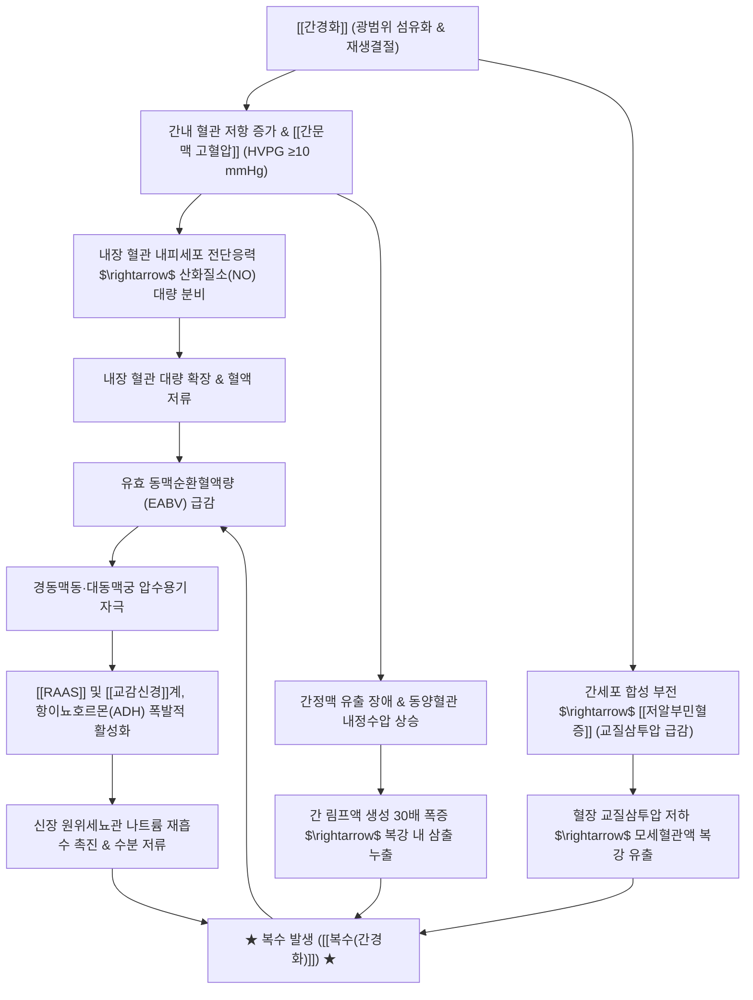

---
aliases:
  - Cirrhotic Ascites
  - Hepatic Ascites
  - 간경변성 복수
  - 간경화 복수
tags:
  - 질환
  - 간질환
  - 소화기질환
  - 복수
  - 간경변증
---

# 🩺 [[복수(간경화)]] (Cirrhotic Ascites / 肝硬變性 腹水, ICD-10 R18 / K74)

> **핵심 3줄 요약 (Key Summary)**:
> - 📍 병소 부위 & 해부·병태생리: [[간경화]]로 인한 [[간문맥 고혈압]]과 저알부민혈증(교질삼투압 저하), 내장 혈관 확장에 따른 유효 순환 혈장량 감소로 [[RAAS]] 및 교감신경계가 과활성화되어 신장의 나트륨·수분 재흡수가 촉진되고, 간 림프액 누출이 흡수 능력을 초과하여 복막강(Peritoneal cavity) 내에 다량 저류되는 질환.
> - 🚩 전형적 임상 양상 & 3대 징후: 가파른 체중 증가 및 팽팽한 복부 팽만, 측복부 타진 시 이동성 탁음(Shifting dullness) 및 수액파동(Fluid wave), 횡격막 압박에 의한 호흡곤란, 복압 상승으로 인한 제대탈장, 고환 부종, 하지 함요 부종 및 간성 흉수.
> - 🛠️ 핵심 감별 검사 & 한·양방 다각적 치료 전략: 복부 초음파 및 진단적 복부천자(SAAG ≥ 1.1 g/dL, 호중구수 < 250/mm³ 평가), 저염식(1일 나트륨 2g 제한), 이뇨제(스피로놀락톤 + 푸로세미드 100:40 비율 투여). 한의학에서는 고창(鼓脹)으로 보아 비신(脾腎) 기능을 보익하고 기혈 정체를 풀어주는 보음·보기·건비이수(健脾利水, [[황기]], [[복령]], [[실비음]], [[오령산]])를 중심으로 다스리되 공하제 남용 엄금.
> - ⚠️ 응급 의뢰 레드플래그 & 악화 요인: 복수 천자액의 호중구 수 ≥ 250/mm³(자발성 세균성 복막염 SBP 의심 고열·복통), 급성 핍뇨 및 크레아티닌 급상승(간신증후군 HRS), 식도정맥류 파열 대량 토혈 발생 시 즉시 응급 입원 및 정맥 항생제/알부민 투여 의뢰.

---

## 📌 목차
1. [질환 개요 & 해부학적 병태생리](#1-질환-개요--해부학적-병태생리)
2. [병태생리 메커니즘 & 생체역학적 악순환 네트워크](#2-병태생리-메커니즘--생체역학적-악순환-네트워크)
3. [임상 증상 & 이학적 검사(Physical Exam) 알고리즘](#3-임상-증상--이학적-검사physical-exam-알고리즘)
4. [감별 진단 매트릭스 (Differential Diagnosis)](#4-감별-진단-매트릭스-differential-diagnosis)
5. [한의 통합 치료 프로토콜 (침·약침·추나·한약)](#5-한의-통합-치료-프로토콜-침약침추나한약)
6. [재활 운동 & 생활습관 티칭 가이드](#6-재활-운동--생활습관-티칭-가이드)
7. [💡 사용자 진료실 핵심 필기 & 임상 노하우 (Melt-In 잔여 심화 집약)](#7--사용자-진료실-핵심-필기--임상-노하우-melt-in-잔여-심화-집약)
8. [출처 및 학술 참고 문헌 (References)](#8-출처-및-학술-참고-문헌-references)

---

## 1. 질환 개요 & 해부학적 병태생리

![[Pasted image 20240404142956.png|450]]
> [그림 1: 간경화에서 복수가 발생하는 병태생리 기전도. 간 실질 손상에 의한 알부민 합성 저하(교질삼투압 감소)와 간내 혈관 폐색(문맥압 상승 및 간 림프액 누출)이 결합하여 복수를 유발하고, 유효 순환혈장량 감소가 레닌-안지오텐신-알도스테론계 및 교감신경계를 활성화하여 신장의 나트륨 재흡수를 영구적으로 촉진하는 악순환 모식도]

* **질환 정의 및 역학**:
  * [[복수(간경화)]]는 전체 복수 환자의 약 85%를 차지하는 가장 대표적인 형태로, 간경변증(Liver Cirrhosis)이 진행하여 비대상성(Decompensated) 단계로 진입했음을 알리는 핵심 지표입니다.
  * 혈액 중 혈장 성분이 모세혈관 및 림프관 밖으로 누출되어 복강(Peritoneal cavity) 내에 비정상적으로 고이는 병태이며, 체내 총 나트륨과 수분이 과도하게 축적된 상태를 대변합니다.
  * 보상성 간경변 환자에서 10년 이내에 복수가 발생할 확률은 약 50%에 달하며, 복수가 발현되면 1년 생존율은 약 50%로 급감하므로 정밀한 내과적 관리가 필수적입니다.
* **관련 해부학적 구조물**:
  * **복막강 (Peritoneal Cavity)**: 벽측 복막(Parietal peritoneum)과 장측 복막(Visceral peritoneum) 사이의 잠재적 공간으로, 정상 상태에서는 장기 활주를 돕는 장액이 50~100 mL 이하로 존재합니다.
  * **[[간문맥]] 및 동양혈관 (Hepatic Sinusoids)**: 간경화 조직의 광범위한 결절과 섬유화로 동양혈관 내피세포 창문이 소실되고 간내 혈류 저항이 급증하여 문맥압 항진(HVPG ≥ 10 mmHg)을 형성합니다.
  * **간 림프관계 및 디세강 (Space of Disse)**: 동양혈관 내 정수압 상승으로 간 림프액 생성이 정상의 30배까지 폭증하며, 흉관(Thoracic duct)의 배액 용량을 초과한 림프액이 간 표면의 글리슨 피막(Glisson's capsule)을 통해 복강 내로 직접 흘러넘치게(Weeping) 됩니다.

---

## 2. 병태생리 메커니즘 & 생체역학적 악순환 네트워크

![[청강의감16_복수_발생기전.png|450]]
> [그림 2: 정상 복강(Healthy)과 간경변 환자의 복강 내 다량의 체액 저류(Diseased, ASCITES)로 인한 복벽 돌출 및 내장 압박 해부 비교도]

### 1) 혈관 확장 학설 (Peripheral Arterial Vasodilation Hypothesis)
* **내장 혈관 확장과 저혈량증 오인**:
  * 간문맥 고혈압이 형성되면 내장 순환계의 내피세포에서 산화질소(NO), 프로스타사이클린 등 혈관확장물질이 과잉 방출됩니다.
  * 이로 인해 장간막 세동맥이 대량 확장되어 내장 정맥총에 혈액이 심각하게 고이게 되며, 전신 동맥압이 저하되고 **유효 동맥순환혈액량(Effective Arterial Blood Volume, EABV)**이 급격히 감소합니다.
* **신장의 나트륨·수분 과잉 재흡수**:
  * 심장과 뇌의 용적수용기는 순환 혈액량이 부족하다고 판단하여 레닌-안지오텐신-알도스테론계([[RAAS]])를 강력히 활성화하고, 교감신경계([[교감신경]]) 및 항이뇨호르몬(ADH, Vasopressin) 분비를 촉진합니다.
  * 알도스테론은 신장 세뇨관에서 나트륨 재흡수를 극대화하고, ADH는 집합관에서 유리수를 흡수하여 체내에 물과 염분이 영구적으로 저류되는 생화학적 악순환을 완성합니다.

### 2) 간정맥 유출 장애와 림프액 복강 삼출
* 간경화에 의해 간정맥지와 간내문맥지가 압박을 받으면 간정맥 유출 장애(Hepatic venous outflow block)가 발생합니다.
* 굴모양혈관(동양혈관)의 내정수압과 문맥압이 상승하면서 간 림프 생성이 정상의 수십 배로 폭증하고, 투과성이 항진된 간내문맥 말초지와 간 표면 캡슐을 통해 단백질이 풍부한 림프액이 복강 내로 뚝뚝 떨어져 고이게 됩니다.
* 동시에 간기능 저하로 혈청 알부민 합성이 결핍되어 저알부민혈증이 초래되면, 스탈링의 법칙(Starling's forces)에 따라 혈장 교질삼투압이 급락하여 혈관 내 수분을 붙잡지 못하고 복강과 피하 조직으로 체액이 지속적으로 빠져나갑니다.
* 간문맥 고혈압은 이와 더불어 **1) 복수, 2) 문맥전신정맥지름길 형성(Portosystemic shunts), 3) 울혈성 비장비대(Splenomegaly), 4) [[간성뇌증]]**의 4대 치명적 병태를 연쇄적으로 초래합니다.

---

## 3. 임상 증상 & 이학적 검사(Physical Exam) 알고리즘

![[간경변증_복수_복부천자술_시술도해.png|450]]
> [그림 3: 대량 복수 환자에서 복부 팽만 완화 및 복수 분석을 위해 시행하는 복부 천자술(Abdominal Paracentesis) 시술 도해]

### 1) 전형적 주소증 및 전신 임상 소견
* **복부 팽만 및 체중 급증**:
  * 벨트나 바지 치수가 빠르게 증가하며, 단기간에 체중이 수 kg 이상 급증합니다.
  * 복부 팽만감, 헛배부름, 조기 포만감, 소화장애, 복통을 호소합니다.
* **복압 상승에 따른 이차 합병증**:
  * **호흡곤란 (Dyspnea)**: 팽창된 복수가 횡격막을 상방으로 강하게 압박하여 폐 용적이 감소하고 앙와위(누운 자세)에서 호흡곤란이 심화됩니다.
  * **제대탈장 (Umbilical Hernia)**: 얇아진 배꼽 부위 복벽이 복압을 이기지 못하고 돌출되며, 심할 경우 피부 괴사 및 파열의 위험이 있습니다.
  * **고환 부종 및 음낭 수종**: 서혜관을 통해 복압과 복수가 전달되어 음낭이 거대하게 종창됩니다.
  * **간성 흉수 (Hepatic Hydrothorax)**: 횡격막의 림프관 결손(주로 우측)을 통해 복수가 흉막강으로 이동하여 대량의 흉수를 유발합니다.
* **피부 및 전신 징후**:
  * 복벽 피부가 얇아지고 번들거리며 창백해짐.
  * 양측 하지의 함요 부종(Pitting edema), 소변량의 현저한 감소(핍뇨), 입마름 및 전신 탈수 증상.

### 2) 필수 이학적 검사법 (Physical Examination)
* **이동성 탁음 검사 (Shifting Dullness)**:
  * 환자를 앙와위로 눕히고 배꼽에서부터 측복부(옆구리) 쪽으로 방사상 타진을 진행하여 고창음(Tympanitic sound)이 탁음(Dullness)으로 바뀌는 경계선을 확인합니다.
  * 환자를 측와위(옆으로 누운 자세)로 돌려 눕히면, 복수가 중력에 의해 아래쪽으로 쏠리므로 위쪽이 된 옆구리는 장관이 떠올라 고창음으로 바뀌고 아래쪽은 탁음으로 이동합니다.
  * 약 1,500 mL 이상의 복수가 존재할 때 높은 민감도(70~80%)를 보입니다.
* **수액 파동 검사 (Fluid Wave Test)**:
  * 조수의 손바닥을 환자의 복부 중앙 정중선에 세워 복벽 피하 지방층의 진동 전달을 차단합니다.
  * 검사자가 환자의 한쪽 옆구리를 톡톡 쳤을 때 반대편 옆구리에 댄 손바닥으로 액체 파동이 충격파처럼 전달되는지 확인합니다.
  * 대량 복수(2,000 mL 이상)에서 뚜렷하게 양성으로 나타납니다.
* **복부 초음파 (Abdominal Ultrasonography)**:
  * 약 100 mL 미만의 미세 복수까지 감지할 수 있는 가장 정확한 표준 영상 검사법입니다.

---

## 4. 감별 진단 매트릭스 (Differential Diagnosis)

| 감별 질환 | 병소 및 주요 원인 | 혈청-복수 알부민차 (SAAG) | 복수 총단백 및 임상 특징 |
| :--- | :--- | :--- | :--- |
| [[복수(간경화)]] (본 질환) | [[간경화]], [[간문맥 고혈압]] | **고구배 (SAAG ≥ 1.1 g/dL)** | 총단백 < 2.5 g/dL (누출액), 이동성 탁음, 저알부민 |
| 심인성 복수 (울혈성 [[심부전]]) | 우심부전, 수축성 심막염 | **고구배 (SAAG ≥ 1.1 g/dL)** | **총단백 ≥ 2.5 g/dL**, 경정맥 노장, 간비대 |
| 버드-키아리 증후군 | 간정맥/하대정맥 혈전성 폐색 | **고구배 (SAAG ≥ 1.1 g/dL)** | **총단백 ≥ 2.5 g/dL**, 급성 간종대 및 심한 복통 |
| 악성 복수 (복막 암종증) | 위암·난소암·대장암 복막 파종 | **저구배 (SAAG < 1.1 g/dL)** | 총단백 ≥ 2.5 g/dL (삼출액), 세포진 검사 암세포 양성 |
| 결핵성 복막염 | 결핵균 복막 감염 | **저구배 (SAAG < 1.1 g/dL)** | 림프구 우세, 복수 ADA ≥ 30~40 U/L 상승 |
| 신인성 복수 ([[신장 증후군]]) | 사구체 기저막 파괴, 다량 단백뇨 | **저구배 (SAAG < 1.1 g/dL)** | 총단백 < 2.5 g/dL, 전신 부종(아나사카), 단백뇨 >3.5g |

---

## 5. 한의 통합 치료 프로토콜 (침·약침·추나·한약)

* **한의 치료의 대원칙: 건비보신(健脾補腎) & 소간화어(疏肝化瘀) & 완만한 이수(利水)**:
  * 한의학에서 간경화 복수는 고창(鼓脹), 수종(水腫)의 범주에 속하며, 병소는 간·비·신(肝脾腎) 3장에 걸쳐 있습니다.
  * 비기(脾氣)가 허하여 수습을 운화하지 못하고, 간기(肝氣)가 울체되어 어혈이 생기며, 신양(腎陽)이 쇠약해져 수액을 기화시키지 못하는 복합 허실(虛實) 협잡 병태입니다.
  * **무리한 대량 사하제(대황, 파두, 감수 등 준하축수약)의 남용은 탈수, 전해질 붕괴, 간성뇌증 및 신부전을 유발하므로 절대 금기**이며, 보기보음(補氣補陰)을 바탕으로 부드러운 이수삼습(利水滲濕)을 유도해야 합니다.

### 1) 변증별 한약 처방 프로토콜
* **음허형 (陰虛型)**:
  * **임상 징후**: 복부 팽만, 하지 부종, 구갈 및 음수 과다, 피부 건조, 혀가 붉고 갈라짐(설홍열), 맥세삭(細數).
  * **치료 원칙**: 자음보간(滋陰補肝), 청열이수.
  * **추천 처방**: 일관전(一貫煎) 합 사령탕 가감.
  * **핵심 본초**: [[생지황]], [[당귀]], [[구기자]](자음보간), [[단삼]](활혈양혈, 미세순환 개선), [[복령]], [[택사]](담삼이수).
* **습열형 (濕熱型)**:
  * **임상 징후**: 전신 부종, 얼굴색이 어둡고 칙칙함, 심한 복부 팽만, 소변 농축 및 황달 동반, 혀는 붉고 황태가 두꺼움, 맥침활(沈滑).
  * **치료 원칙**: 청열조습(淸熱燥濕), 소간이담.
  * **추천 처방**: [[인진호탕]](茵蔯蒿湯) 또는 중만분소환(中滿分消丸) 가감.
  * **핵심 본초**: [[인진호]], [[치자]](청열이습), [[구기자]](간음 보호), [[대황]](미량 완하 투여로 장내 내독소 배출).
* **기음양허 및 어혈형 (氣陰兩虛·瘀血型)**:
  * **임상 징후**: 극심한 피로감, 마른 체형(근육 소모), 복수 및 하지 부종, 설홍자암 유어반(舌紅紫暗 有瘀斑), 맥현완(弦緩).
  * **치료 원칙**: 익기보음(益氣補陰), 활혈화어(活血化瘀), 청열해독.
  * **추천 처방**: [[실비음]](實脾飮) 가감방 또는 보기활혈이수탕.
  * **핵심 본초**: [[황기]](대량 투여로 혈관외 수분 재흡수 및 알부민 합성 촉진), [[복령]], [[목방기]], [[적소두]](이수소종), [[백화사설초]](청열해독, 복막 미세염증 완화), [[단삼]](화어지통).

### 2) 침구 치료 (Acupuncture)
* **주요 혈자리**: 수분(水分, 복수 소퇴의 요혈), 음릉천(陰陵泉), 족삼리(足三里), 삼음교(三陰交), 비수(脾兪), 신수(腎兪), 간수(肝兪), 기해(氣海), 관원(關元).
* **자침 기법**:
  * 수분·음릉천·삼음교에 보법(補法) 또는 뜸(간접구)을 병용하여 비신 양기를 고무하고 이뇨를 촉진.
  * 복부 직접 자침 시에는 비후된 복벽과 팽창된 복수로 인한 복막염 감염 위험이 있으므로, 배꼽 주위 혈자리는 얕게 자침하거나 사지 말단 및 배수혈 위주로 안전하게 선혈.

---

## 6. 재활 운동 & 생활습관 티칭 가이드

* **철저한 저염식 (Low-Sodium Diet)**:
  * 복수 조절의 가장 기본적이고 핵심적인 치료는 **염분(소금) 섭취 제한**입니다.
  * 1일 소금 섭취량을 5g 이하(순수 나트륨 기준 2g 또는 88 mEq/일 미만)로 엄격히 제한합니다.
  * 국물, 찌개, 젓갈, 장아찌, 라면, 통조림 등 가공식품의 섭취를 완전히 금지하고, 짠맛 대신 레몬즙, 식초, 파, 마늘 등으로 풍미를 돋웁니다.
  * 수분 섭취 제한은 저나트륨혈증(혈청 Na < 125 mEq/L)이 발생하지 않는 한 통상적으로는 엄격히 제한하지 않으나, 체중 증가 속도에 맞춰 1일 1~1.5L 이내로 조절합니다.
* **매일 아침 공복 체중 및 복위 측정**:
  * 환자에게 기상 직후 소변을 본 뒤 동일한 옷차림으로 매일 체중을 측정하여 기록하도록 티칭합니다.
  * 이뇨제 투여 시 권장 체중 감량 속도는 하지 부종이 있는 경우 하루 1.0 kg 이내, 부종이 없는 단순 복수의 경우 하루 0.5 kg 이내로 제한해야 신장 손상과 탈수를 예방할 수 있습니다.
* **안정과 침상 휴식**:
  * 서 있거나 앉아 있는 직립 자세는 레닌-안지오텐신계를 활성화하여 신장 혈류량을 감소시키므로, 낮 시간 동안 적절한 침상 앙와위 휴식이 신장 혈류를 증가시키고 이뇨 작용을 돕습니다.

---

## 7. 💡 사용자 진료실 핵심 필기 & 임상 노하우 (Melt-In 잔여 심화 집약)

![[청강의감16_복수환자_케이스.jpg|400]]
> [그림 4: 진료실 내원 간경화 복수 환자의 임상 증례. 팽팽한 복부 팽만과 복벽 긴장도 소견]

> [!IMPORTANT]
> **🛡️ 원문 융합(Melt-In) 및 진료실 복수 환자 관리 불변 원칙**
> - **기존 필기 100% 융합**: 한의학적 간·비·신·심 기혈 정체와 비신 기능 상실 병리, 옆구리 이동성 탁음 진단, 간문맥압 상승 및 NO 분비 $\rightarrow$ 내장 혈관 확장 $\rightarrow$ 신장 나트륨 재흡수(RAAS, 교감신경 항진) 기전, 간정맥 유출 장애와 굴모양혈관 내정수압 상승 및 간림프 삼출, 문맥고혈압 4대 합병증, 의안 3대 변증(음허증의 생지황·당귀·구기자·단삼, 습열증의 대황·구기자·인진호, 기음양허+어혈의 황기·복령·목방기·적소두·백화사설초), 보음·보기·보비간과 저염식의 중요성을 상부 1~6번에 전면 융합 완료.
> - **자발성 세균성 복막염(SBP) 골든타임 감시**: 간경화 복수 환자가 열이 나거나(37.5℃ 이상), 복부 압통/반발통을 호소하거나, 갑자기 의식이 멍해지며 간성뇌증이 악화되면 SBP 발생 신호이므로 지체 없이 진단적 복부천자 및 3세대 세팔로스포린 항생제 투여가 가능한 상급병원으로 긴급 전원해야 합니다.

* **원장실 실전 복약 & 진료 노하우**:
  1. **"부종 환자에게 이뇨제/사하제만 쓰면 반드시 패착한다"**:
     - 복수가 찬 간경화 환자를 보고 단순히 물을 빼내겠다는 생각으로 강한 이뇨 약재나 대황, 파두 계열의 사하제를 과량 투여하면 유효 순환 혈류량이 더욱 고갈되어 **간신증후군(HRS)**이나 **간성혼수**로 직행합니다.
     - 반드시 [[황기]], [[백출]], [[태자삼]] 등으로 비장과 폐의 기운을 끌어올리고, [[생지황]], [[구기자]]로 간신(肝腎)의 진액을 보충하면서 미량의 [[복령]], [[목방기]], [[적소두]], [[택사]]로 물길을 열어주어야 합니다.
  2. **기음양허 및 어혈 환자의 실전 방제 노하우**:
     - 피로가 극심하고 몸은 비쩍 말랐는데 배만 불룩하게 솟아오르고 혀에 어혈 반점이 있는 환자에게는:
     - [[황기]](30~60g)를 군약으로 삼아 교질삼투압 형성을 돕고, [[복령]], [[목방기]], [[적소두]]로 수액을 완만히 배출하며, 복강 내 미세 염증과 독소를 해소하는 [[백화사설초]]와 미세혈관 저항을 줄이는 [[단삼]]을 절묘하게 배합하면 양방 이뇨제에 반응하지 않던 난치성 복수가 안정적으로 감량됩니다.
  3. **환자 티칭 스크립트 (소금과의 전쟁)**:
     - "어르신, 복수는 몸 안에 소금이 물을 끌어안고 있어서 빠져나가지 못하는 병입니다. 한약을 아무리 잘 드셔도 소금기 있는 국물을 한 대접 드시면 물이 다시 차오릅니다. 간장, 된장, 김치, 찌개 국물을 오늘부터 딱 끊으시고, 체중계를 매일 아침 화장실 다녀온 직후에 재서 기록해 오십시오."

---

## 8. 출처 및 학술 참고 문헌 (References)

1. **Biggins SW, et al. (2021)**. Diagnosis, Evaluation, and Management of Ascites, Spontaneous Bacterial Peritonitis and Hepatorenal Syndrome: 2021 Practice Guidance by the American Association for the Study of Liver Diseases. *Hepatology*, 74(2), 1014-1048. PMID: [33942342](https://pubmed.ncbi.nlm.nih.gov/33942342/)
   - **[연구 요약]**: 간경변성 복수의 3단계 분류(Grade 1~3), 진단적 복부천자술, 1차 약물 치료(스피로놀락톤과 푸로세미드 병용), 난치성 복수의 대량 천자술 및 알부민 보충 프로토콜을 명시한 미국간학회(AASLD) 공식 임상 지침.
2. **European Association for the Study of the Liver (EASL) (2018)**. EASL Clinical Practice Guidelines for the management of patients with decompensated cirrhosis. *Journal of Hepatology*, 69(2), 406-460. PMID: [29656966](https://pubmed.ncbi.nlm.nih.gov/29656966/)
   - **[연구 요약]**: 비대상성 간경변의 주요 합병증인 복수, 자발성 세균성 복막염(SBP), 간신증후군(HRS)의 최신 혈역학적 병태생리와 단계별 환자 관리 지침을 수립한 유럽간학회 가이드라인.
3. **Ginès P, Cárdenas A, Arroyo V, Rodés J. (2004)**. Management of cirrhosis and ascites. *New England Journal of Medicine*, 350(16), 1646-1654. PMID: [15084697](https://pubmed.ncbi.nlm.nih.gov/15084697/)
   - **[연구 요약]**: 간경변에서 내장 혈관 확장과 신장의 나트륨 저류 기전을 규명하고, 저염식과 이뇨제 반응성 평가, 대량 천자 시 복부천자 후 순환부전(PICD)을 방지하기 위한 정맥 알부민 투여 원리를 확립한 랜드마크 종설.