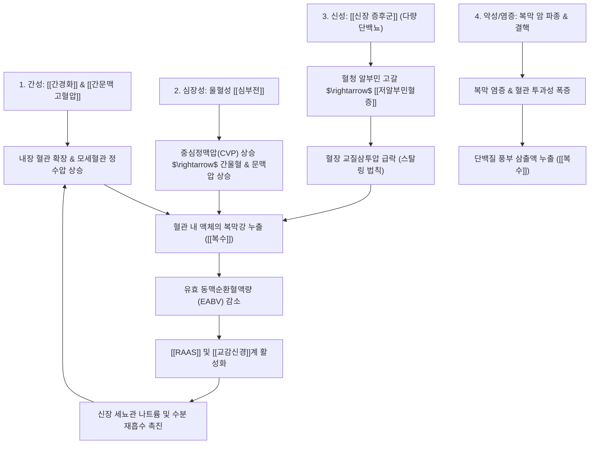

---
aliases:
  - Ascites
  - 腹水
  - 복수증
tags:
  - 질환
  - 소화기질환
  - 간질환
  - 신장질환
  - 순환기질환
---

# 🩺 [[복수]] (Ascites / 腹水, ICD-10 R18)

> **핵심 3줄 요약 (Key Summary)**:
> - 📍 병소 부위 & 해부·병태생리: 복막강(Peritoneal cavity) 내에 비정상적으로 체액이 25 mL 이상 과다 축적되는 증후군으로, 간성(간경화 85%), 심장성(울혈성 심부전), 신성(신증후군), 악성 종양(복막 파종) 및 감염성(결핵성 복막염) 등 다발성 장기 병태에 기인.
> - 🚩 전형적 임상 양상 & 3대 징후: 진행성 복부 팽만과 체중 증가, 옆구리 타진 시 이동성 탁음(Shifting dullness) 및 수액파동(Fluid wave), 호흡곤란·하지 부종·소변량 감소.
> - 🛠️ 핵심 감별 검사 & 한·양방 다각적 치료 전략: 진단적 복부천자를 통한 혈청-복수 알부민 농도차(SAAG ≥ 1.1 g/dL 문맥압 항진성 vs < 1.1 g/dL 비문맥압 항진성) 감별 및 총단백 분석. 한의학에서는 고창(鼓脹)·수종(水腫)으로 분류하여 수습정체(水濕停滯), 비신양허(脾腎陽虛), 어혈조체(瘀血阻滯) 변증 하에 건비온신(健脾溫腎), 이수삼습(利水滲濕, [[오령산]], [[실비음]], [[진무탕]])으로 원인별 치료.
> - ⚠️ 응급 의뢰 레드플래그 & 악화 요인: 복수 다핵백혈구(PMN) ≥ 250/mm³(자발성 세균성 복막염 SBP 의심 발열·반발통), 급성 무뇨/핍뇨(간신증후군 HRS), 암 환자의 급격한 악액질 및 장폐색 징후 시 즉시 상급병원 응급 전원.

---

## 📌 목차
1. [질환 개요 & 해부학적 병태생리](#1-질환-개요--해부학적-병태생리)
2. [병태생리 메커니즘 & 생체역학적 악순환 네트워크](#2-병태생리-메커니즘--생체역학적-악순환-네트워크)
3. [임상 증상 & 이학적 검사(Physical Exam) 알고리즘](#3-임상-증상--이학적-검사physical-exam-알고리즘)
4. [감별 진단 매트릭스 (Differential Diagnosis)](#4-감별-진단-매트릭스-differential-diagnosis)
5. [한의 통합 치료 프로토콜 (침·약침·추나·한약)](#5-한의-통합-치료-프로토콜-침약침추나한약)
6. [재활 운동 & 생활습관 티칭 가이드](#6-재활-운동--생활습관-티칭-가이드)
7. [💡 사용자 진료실 핵심 필기 & 임상 노하우 (Melt-In 잔여 심화 집약)](#7--사용자-진료실-핵심-필기--임상-노하우-melt-in-잔여-심화-집약)
8. [출처 및 학술 참고 문헌 (References)](#8-출처-및-학술-참고-문헌-references)

---

## 1. 질환 개요 & 해부학적 병태생리

![[청강의감16_복수_발생기전.png|450]]
> [그림 1: 정상 복강(Healthy)과 복수 환자의 복강 내 다량 체액 저류(Diseased, ASCITES)로 인한 복벽 돌출 및 내장 장기 압박 상태 비교 해부도]

* **질환 정의 및 개요**:
  * [[복수]](Ascites)는 복막강(Peritoneal cavity) 내에 체액이 병적으로 과다하게 고이는 상태를 총칭합니다.
  * 정상 성인의 복막강에는 장간막과 복부 장기 사이의 마찰을 줄이기 위해 약 25~50 mL의 생리적 장액만이 존재하지만, 다양한 질환에 의해 생산량이 흡수량을 초과하면 수 리터에서 십여 리터까지 체액이 저류됩니다.
  * 단일 질환이 아닌 다양한 전신 질환(간, 심장, 신장, 악성 종양, 결핵 등)의 결과물로 발현되는 중증 임상 증후군입니다.
  * 간경화에 특이적으로 유발되는 복수의 정밀한 병태생리와 치료는 [[복수(간경화)]] 노트를 참조하십시오.
* **원인 질환별 분류 및 빈도**:
  * **간성 복수 (Hepatic Ascites, 약 80~85%)**: [[간경화]](간경변증), 급성 간부전, 알코올성 간염 등으로 인한 문맥압 항진증.
  * **악성 복수 (Malignant Ascites, 약 10%)**: 위암, 대장암, 난소암, 췌장암 등의 복막 파종(Peritoneal carcinomatosis) 및 원발성 복막중피종.
  * **심장성 복수 (Cardiac Ascites, 약 3~5%)**: 울혈성 [[심부전]](Congestive Heart Failure), 수축성 심막염.
  * **신성 복수 (Renal Ascites, 약 1~2%)**: [[신장 증후군]](신증후군), 말기 신부전(투석 환자).
  * **기타 감염 및 염증 질환 (약 1~2%)**: 결핵성 복막염, 췌장염(췌장성 복수), 담즙성 복막염.
* **관련 해부학적 구조물**:
  * **복막 (Peritoneum)**: 표면적이 약 1.7 m²에 달하는 반투과성 막으로 벽측 복막과 장측 복막으로 구성되며, 미세혈관 및 림프관이 고도로 분포합니다.
  * **간문맥 및 하대정맥계**: 장간막 정맥혈이 합류하여 간으로 들어가는 문맥 순환계와, 심장으로 환류되는 하대정맥계의 정수압 균형이 체액 이동을 결정합니다.

---

## 2. 병태생리 메커니즘 & 생체역학적 악순환 네트워크

![[Pasted image 20240404142956.png|450]]
> [그림 2: 복수 형성의 4대 원인별 병태생리 메커니즘. 간경화에서의 문맥압 상승과 알부민 합성 저하, 스탈링 법칙에 따른 체액 이동, 유효 순환혈장량 감소와 RAAS/교감신경계 활성화가 신장 나트륨 재흡수를 유도하는 핵심 흐름도]

### 1) 4대 병인별 세부 발병 기전
1. **간성 복수 (Hepatic Ascites)**:
   - [[간경화]]로 인한 간내 혈관 저항 증가로 [[간문맥 고혈압]]이 발생합니다.
   - 내장 혈관이 대량 확장되어 내장 정맥에 피가 고이며, 유효 동맥순환혈액량이 급감합니다.
   - 신장으로의 혈류량이 줄어들자 신장은 체내 순환 혈액이 부족하다고 오인하여 [[RAAS]]를 활성화하고 교감신경계를 흥분시킵니다.
   - 알도스테론은 나트륨 재흡수를, 항이뇨호르몬(ADH)은 수분 재흡수를 촉진하여 복막강으로 수분이 지속 누출됩니다.
2. **신성 복수 (Renal Ascites)**:
   - [[신장 증후군]]에서는 사구체 기저막의 손상으로 심한 사구체성 [[단백뇨]](하루 3.5g 이상)가 배출되어 극심한 [[저알부민혈증]]이 초래됩니다.
   - 혈청 알부민 저하는 혈장 교질삼투압을 급격히 떨어뜨려 스탈링의 법칙(Starling's hypothesis)에 따라 혈관 내 수분이 조직 간질과 복막강으로 이동합니다.
   - 순환 혈장량이 감소함에 따라 이차적으로 [[RAAS]]와 교감신경계가 활성화되어 나트륨 저류가 가속화됩니다.
3. **심장성 복수 (Cardiac Ascites)**:
   - 울혈성 [[심부전]]에서 우심방압이 상승하면 상·하대정맥의 울혈이 간 중심정맥압을 상승시켜 간종대, 비장종대, 복수를 유발합니다(심장성 간경화, Cardiac cirrhosis).
   - 심박출량 저하로 인한 전신 유효순환혈액량 감소가 신장의 사구체여과율(GFR)을 떨어뜨리고 [[RAAS]]를 촉진합니다.
4. **악성 종양 및 염증성 복수 (Malignant / Inflammatory Ascites)**:
   - 위암, 난소암, 대장암의 복막 전이나 결핵균 감염은 복막의 혈관 내피세포를 파괴하고 국소 사이토카인을 방출하여 모세혈관 투과성을 극대화합니다.
   - 복막 림프관이 암세포로 폐색되어 림프 배액이 차단되므로 단백질과 LDH가 풍부한 삼출액(Exudate)이 복강 내로 쏟아져 나옵니다.

---

## 3. 임상 증상 & 이학적 검사(Physical Exam) 알고리즘

![[간경변증_복수_복부천자술_시술도해.png|450]]
> [그림 3: 복수의 원인 규명(진단적) 및 복압 완화(치료적)를 위해 좌하복부에서 시행하는 복부 천자술(Paracentesis)의 해부학적 천자 부위 및 시술 도해]

### 1) 주요 주소증 및 신체 증상
* **복부 팽만 및 체중 증가**:
  * 환자가 "최근 배가 급격히 불러오고 옷이나 바지가 맞지 않는다"며 내원.
  * 단기간에 체중이 수 kg 이상 불어나지만, 얼굴이나 팔은 오히려 수척해지는 중심성 복부 팽만을 보입니다.
* **호흡곤란 및 소화 장애**:
  * 횡격막이 거상되어 폐 용적이 축소됨에 따라 누웠을 때 숨이 차는 기좌호흡 또는 운동 시 호흡곤란.
  * 위 압박으로 인한 조기 만복감, 식욕 부진, 트림, 속쓰림.
* **원인 질환별 특이 동반 증상**:
  * *간성*: 황달, 거미혈관종, 수장홍반, 비장비대, 여성형 유방.
  * *심장성*: 경정맥 노장(JVD), 간종대, 호흡곤란, 양측 하지 함요 부종.
  * *신성*: 안검 부종(눈 주위 부종), 전신성 부종(Anasarca), 거품뇨.
  * *악성*: 악액질(Cachexia), 급격한 체중 감소, 원발암 증상.

### 2) 필수 이학적 검사법 (Physical Examination)
* **이동성 탁음 (Shifting Dullness)**:
  * 앙와위 타진 시 복부 중앙은 장관 공기로 인한 고창음, 측복부는 액체 저류로 인한 탁음이 들림.
  * 환자를 옆으로 돌려 눕히면 액체가 아래로 이동하여 위쪽 옆구리가 고창음으로 바뀌는 현상(약 1,500 mL 이상 존재 시 양성).
* **수액 파동 (Fluid Wave Test)**:
  * 환자의 정중선 복벽에 제3자의 손을 세워 피하지방 진동을 차단한 후 한쪽 옆구리를 쳤을 때 반대쪽 손에 파동이 전달되는지 평가(2,000 mL 이상 대량 복수 시 양성).
* **진단적 복부천자술 (Diagnostic Paracentesis)**:
  * 새로 발생한 모든 복수 환자에서 원인 감별을 위해 필수적으로 시행(보통 좌하복부 맥버니 반대편 부위 천자).
  * 복수액 육안 소견(맑은 짚색 = 간경화/심부전, 혼탁 = 감염/SBP, 유백색 = 유미복수, 혈성 = 악성 종양).

---

## 4. 감별 진단 매트릭스 (Differential Diagnosis)

> [!NOTE]
> **SAAG (혈청-복수 알부민 농도차) 계산법**:
> $$\text{SAAG} = \text{혈청 알부민 (g/dL)} - \text{복수 알부민 (g/dL)}$$
> - **SAAG ≥ 1.1 g/dL**: [[간문맥 고혈압]] 존재 (정수압 상승 매개 누출액)
> - **SAAG < 1.1 g/dL**: 간문맥 고혈압 없음 (혈관 투과성 증가 또는 교질삼투압 저하)

| 감별 질환 | SAAG (g/dL) | 복수 총단백 (g/dL) | 핵심 병태 및 감별 검사 소견 |
| :--- | :--- | :--- | :--- |
| [[복수(간경화)]] | **≥ 1.1 (고구배)** | **< 2.5 (저단백)** | 간 섬유화, 문맥압 항진, 알부민 합성 저하 |
| 심인성 복수 ([[심부전]]) | **≥ 1.1 (고구배)** | **≥ 2.5 (고단백)** | 우심부전, 경정맥 노장, BNP 상승, 심초음파 이상 |
| 버드-키아리 증후군 | **≥ 1.1 (고구배)** | **≥ 2.5 (고단백)** | 간정맥/하대정맥 혈전 폐색, 급성 간종대 및 심한 통증 |
| 악성 복막 암종증 | **< 1.1 (저구배)** | **≥ 2.5 (고단백)** | 위·난소·대장암 전이, 복수 세포진 검사 악성 세포 확인 |
| 결핵성 복막염 | **< 1.1 (저구배)** | **≥ 2.5 (고단백)** | 림프구 우세, 복수 ADA ≥ 30~40 U/L, 결핵균 PCR 양성 |
| 신인성 복수 ([[신장 증후군]]) | **< 1.1 (저구배)** | **< 2.5 (저단백)** | 사구체 손상, 다량 단백뇨(>3.5g), 전신 부종(아나사카) |
| 췌장성 복수 | **< 1.1 (저구배)** | **≥ 2.5 (고단백)** | 만성 췌장염, 가성낭종 파열, 복수 아밀라아제 폭증 |

---

## 5. 한의 통합 치료 프로토콜 (침·약침·추나·한약)

* **한의 감별 변증 및 치료 대원칙: 허실(虛實) 감별 & 건비온신(健脾溫腎) & 이수소종(利水消腫)**:
  * 한의학에서 복수는 고창(鼓脹), 수종(水腫)의 범주에 속합니다.
  * 기(氣)·혈(血)·수(水)의 운행 실조로 발생하며, 실증(습열, 기체, 어혈)과 허증(비허, 신허, 음허)을 정밀히 구분하여 다스립니다.
  * 원인 질환(간·심·신)에 따라 약재 배합의 군신좌사를 완전히 달리해야 합니다.

### 1) 병인별 한약 처방 프로토콜
* **비신양허형 (脾腎陽虛型 / 간경화 말기·심부전·신증후군)**:
  * **임상 징후**: 복부 팽만, 사지 냉증, 얼굴이 창백함, 소변 불리, 대변 당설, 설담태백미, 맥침세무력.
  * **치료 원칙**: 온보비신(溫補脾腎), 화기이수(化氣利水).
  * **추천 처방**: [[실비음]](實脾飮) 또는 [[진무탕]](眞武湯) 합 [[오령산]](五苓散).
  * **핵심 본초**: [[부자]], [[건강]](온양화기), [[백출]], [[복령]](건비삼습), [[택사]], [[저령]](이뇨소종), [[목향]], [[후박]](행기소창).
* **습열온결형 (濕熱蘊結型 / 간염·간경화 급성 악화·염증성 복수)**:
  * **임상 징후**: 팽팽한 복부, 구갈(갈증), 소변 단적, 황달, 번조, 변비, 설홍태황니, 맥활수.
  * **치료 원칙**: 청열이습(淸熱利濕), 해독이수.
  * **추천 처방**: [[인진호탕]](茵蔯蒿湯) 또는 중만분소환(中滿分消丸) 가감.
  * **핵심 본초**: [[인진호]], [[치자]](청열사화), [[황백]], [[황련]](조습), [[저령]], [[택사]](통리수도).
* **기체어혈형 (氣滯瘀血型 / 암성 복막 전이·만성 간경변)**:
  * **임상 징후**: 복벽의 정맥 노장, 협하 경결(비장비대/간종대), 찌르는 듯한 통증, 설자암 유어반, 맥침현.
  * **치료 원칙**: 활혈거어(活血祛瘀), 행기소적(行氣消積).
  * **추천 처방**: 조간궤견탕(調肝潰堅湯) 또는 도홍사물탕 합 보기활혈방.
  * **핵심 본초**: [[단삼]], [[적작약]], [[별갑]](연견산결), [[황기]](보기승양), [[백화사설초]](청열해독).

### 2) 침구 치료 (Acupuncture)
* **주요 혈자리**: 수분(水分, 이뇨 이수), 음릉천(陰陵泉, 비경 합혈), 족삼리(足三里), 삼음교(三陰交), 관원(關元), 기해(氣海), 신수(腎兪), 비수(脾兪).
* **치료 기법**:
  * 비신양허에는 관원, 기해, 수분에 온구(간접 뜸)를 시행하여 하초의 양기를 북돋워 신장 혈류를 촉진.
  * 음릉천과 족삼리에 보법 전침을 걸어 비위의 수습 운화 기능을 극대화.

---

## 6. 재활 운동 & 생활습관 티칭 가이드

* **저염 식이 요법 (Sodium Restriction)**:
  * 복수의 모든 원인에서 가장 선행되어야 할 생활 교정은 **나트륨 섭취 제한**입니다.
  * 1일 나트륨 섭취량을 2g 이하(소금 5g 미만)로 제한하여 신장의 수분 저류를 막습니다.
  * 찌개류 국물 섭취 금지, 장아찌 및 젓갈 배제, 인스턴트 식품 완전 차단.
* **수분 섭취 조절**:
  * 저나트륨혈증(혈청 나트륨 < 125 mEq/L)이 발생한 경우에 한해 1일 수분 섭취를 1,000~1,500 mL 이내로 제한합니다.
* **매일 아침 동일 조건 체중 측정**:
  * 기상 직후 첫 배뇨 후 공복 상태에서 체중을 측정하여 기록합니다.
  * 하지 부종 동반 시 하루 1.0 kg, 부종이 없는 복수는 하루 0.5 kg 이내로 감량 속도를 조절하여 저혈량증과 급성 신손상을 방지합니다.
* **자세 요법 (Postural Teaching)**:
  * 서 있거나 장시간 앉아 있으면 신장 혈관이 수축하므로, 낮 시간 동안 1~2시간씩 누워서 안정을 취하면 신장 관류량이 증가하여 자연 이뇨가 촉진됩니다.

---

## 7. 💡 사용자 진료실 핵심 필기 & 임상 노하우 (Melt-In 잔여 심화 집약)

> [!IMPORTANT]
> **🛡️ 원문 융합(Melt-In) 및 원인별 복수 감별 불변 법칙**
> - **기존 필기 100% 융합**: 간성 복수의 간문맥압 상승 및 유효순환량 감소와 RAAS/교감신경 활성화 기전, 신성 복수의 사구체성 단백뇨 $\rightarrow$ 저알부민혈증 $\rightarrow$ 스탈링 법칙에 따른 간질액 누출 및 이차적 RAAS 활성화, 심장성 복수의 우심방압 상승에 따른 중심정맥압 상승과 간종대/복수(심장성 간경화) 및 심박출량 저하 매개 기전, 악성 종양 및 염증의 복막 파종으로 인한 혈관투과성 증가 기전을 상부 1~6번에 전면 융합 완료.
> - **SAAG에 기반한 진료실 1초 감별 직관**: 복수 환자가 천자 결과를 가지고 내원했을 때, 다른 복잡한 수치에 앞서 **SAAG(혈청 알부민 - 복수 알부민)**를 먼저 확인하십시오. 1.1 이상이면 무조건 간이나 심장의 혈관 압력(문맥고혈압) 문제이고, 1.1 미만이면 복막 자체의 염증, 암 파종, 혹은 신장 질환입니다.

* **원장실 실전 문진 및 감별 진단 팁**:
  1. **목의 혈관(경정맥)을 먼저 보라**:
     - 복수가 찬 환자가 내원했을 때 환자의 상체를 45도 기울이고 우측 목의 내경정맥을 관찰하십시오.
     - 경정맥이 불룩하게 솟아 뛰고 있다면(JVD 양성), 간경화가 아니라 **울혈성 심부전**이나 **수축성 심막염**에 의한 심장성 복수일 확률이 매우 높습니다.
  2. **소변 검사 시험지(Dipstick)의 즉각적 활용**:
     - 전신이 붓고 복수가 찬 환자에서 외래용 뇨스틱 검사를 즉시 시행하여 단백뇨 3+ 이상이 확인되면, 간질환보다 **신증후군**에 의한 저알부민혈증성 복수를 최우선으로 의심해야 합니다.
  3. **암성 복수의 임상적 직관**:
     - 이전 암 병력이 있는 고령 환자에서 황달이나 간경변 징후 없이 복수가 차오르고, 복부 촉진 시 복벽이나 장간막에 울퉁불퉁한 결절이 만져지며, 급격한 체중 감소(악액질)가 동반된다면 즉시 영상의학과 CT 및 종양내과 전원을 결정해야 합니다.
  4. **한약 처방 시 금기 수칙**:
     - 복수 환자에게 섣부른 통두(소변 빼기)를 위해 감수, 파두, 대황 등 준하축수약을 고용량으로 쓰면 복수는 빠지지 않고 신장만 망가집니다.
     - 양기(陽氣)가 살아야 물길이 열린다는 음양가화(陰陽氣化)의 원리에 따라 [[부자]], [[백출]], [[황기]]로 비신을 보온하면서 부드럽게 이수시키는 것이 안전한 첩경입니다.

---

## 8. 출처 및 학술 참고 문헌 (References)

1. **Runyon BA, Montano AA, Akriviadis EA, et al. (1992)**. The serum-ascites albumin gradient is superior to the exudate-transudate concept in the differential diagnosis of ascites. *Annals of Internal Medicine*, 117(3), 215-220. PMID: [1616215](https://pubmed.ncbi.nlm.nih.gov/1616215/)
   - **[연구 요약]**: 기존의 여출액/삼출액 개념을 대체하여, 혈청-복수 알부민 농도차(SAAG ≥ 1.1 g/dL)가 97%의 높은 정확도로 문맥압 항진증 유무를 감별함을 최초로 입증한 랜드마크 논문.
2. **Fede G, et al. (2023)**. Differential diagnosis of ascites: etiologies, ascitic fluid analysis, diagnostic algorithm. *Clinical Chemistry and Laboratory Medicine*, 62(7), 1266-1276. PMID: [38165039](https://pubmed.ncbi.nlm.nih.gov/38165039/)
   - **[연구 요약]**: 간성, 심인성, 신성, 악성, 결핵성 복수의 최신 진단 알고리즘, 복수액 생화학 검사(총단백, 세포수, ADA, 아밀라아제) 및 감별 진단 매트릭스를 집대성한 종설.
3. **Biggins SW, et al. (2021)**. Diagnosis, Evaluation, and Management of Ascites, Spontaneous Bacterial Peritonitis and Hepatorenal Syndrome: 2021 Practice Guidance by the American Association for the Study of Liver Diseases. *Hepatology*, 74(2), 1014-1048. PMID: [33942342](https://pubmed.ncbi.nlm.nih.gov/33942342/)
   - **[연구 요약]**: 복수의 초기 평가, 진단적 복부천자술 시행 원칙, 저염식과 이뇨제 투여, 자발성 세균성 복막염 예방 및 합병증 관리를 다룬 미국간학회(AASLD) 공식 임상 가이드라인.