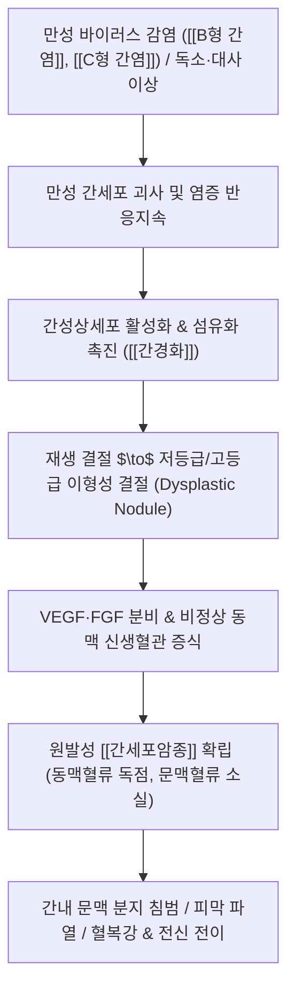

---
aliases:
  - 원발성 간암
  - 원발성간암
  - 간세포암
  - 간암
  - Hepatocellular Carcinoma
  - HCC
  - Liver Cancer
  - 原發性 肝癌
  - C22.0
tags:
  - 이론
  - 질환
  - 간질환
  - 종양
title: 원발성 간암
date: 2026-09-17
출처: "https://pubmed.ncbi.nlm.nih.gov/29622381/"
---

# 🩺 [[원발성 간암]] (Primary Liver Cancer / 原發性 肝癌, ICD-10 C22.0)

> **핵심 3줄 요약 (Key Summary)**:
> - 📍 병소 부위 & 해부·병태생리: 간실질 세포(간세포암종, HCC 85~90%) 및 간내 담관상피세포(간내담관암, ICC 10~15%)에서 기원하는 악성 종양으로, [[만성 간염]](HBV·HCV)과 [[간경화]](간경변증), [[지방간]](대사성 간질환)에 의한 지속적 간세포 괴사·재생 결절 형성 및 신생혈관(동맥혈류) 과형성 악순환.
> - 🚩 전형적 임상 양상 & 3대 징후: 초기 무증상 또는 막연한 피로감·소화불량, 진행 시 우상복부 둔통 및 단단하고 결절성의 종괴 촉지, 원인 미상의 급격한 [[체중 감소]] 및 기존 간질환의 급성 악화([[황달]], [[복수]] 발생).
> - 🛠️ 핵심 감별 검사 & 한·양방 다각적 치료 전략: 4기 동적 조영 CT/MRI(동맥기 조영증강 및 문맥·지연기 씻김 현상 Washout), 종양표지자([[알파태아단백]] AFP, [[PIVKA-II]]), BCLC 병기에 따른 근치적 절제·간이식·국소소작술(RFA)·경동맥화학색전술(TACE)·면역표적항암치료, 한의 통합 치료([[소간활혈]], [[연견산결]], [[청열해독]], 암성 피로 개선 및 항암 부작용 완화).
> - ⚠️ 응급 의뢰 레드플래그 & 악화 요인: 종양 파열(Tumor Rupture)에 따른 급격한 우상복부 팽만통·혈복강 및 저혈량성 쇼크, 급성 간성 뇌증, 식도정맥류 파열 출혈, 문맥 주간 침범에 따른 급성 간부전.

---

## 📌 목차
1. [질환 개요 & 해부학적 병태생리](#1-질환-개요--해부학적-병태생리)
2. [병태생리 메커니즘 & 생체역학적 악순환 네트워크](#2-병태생리-메커니즘--생체역학적-악순환-네트워크)
3. [임상 증상 & 이학적 검사(Physical Exam) 알고리즘](#3-임상-증상--이학적-검사physical-exam-알고리즘)
4. [감별 진단 매트릭스 (Differential Diagnosis)](#4-감별-진단-매트릭스-differential-diagnosis)
5. [한의 통합 치료 프로토콜 (침·약침·추나·한약)](#5-한의-통합-치료-프로토콜-침약침추나한약)
6. [재활 운동 & 생활습관 티칭 가이드](#6-재활-운동--생활습관-티칭-가이드)
7. [💡 사용자 진료실 핵심 필기 & 임상 노하우 (Melt-In 잔여 심화 집약)](#7--사용자-진료실-핵심-필기--임상-노하우-melt-in-잔여-심화-집약)
8. [출처 및 학술 참고 문헌 (References)](#8-출처-및-학술-참고-문헌-references)

---

## 1. 질환 개요 & 해부학적 병태생리

![[원발성간암_간세포암종_육안병리소견.jpg|450]]
> [그림 1: 원발성 간암(간세포암종)의 육안 병리 소견. 간경변성 배경 간실질 내에 다발성 결절 및 모자이크 패턴을 보이는 거대 황백색 종괴가 형성되어 있다.]

* **질환 정의 및 분류**:
  * **정의**: 간 자체의 실질 세포에서 일차적으로 발생하는 원발성 악성 종양을 통칭한다.
  * **주요 조직학적 분류**:
    * **[[간세포암종]](Hepatocellular Carcinoma, HCC)**: 원발성 간암의 85~90%를 차지하며, 대다수가 [[B형 간염]], [[C형 간염]], [[알코올성 간질환]], [[간경화]] 등 만성 간질환 환자에서 발생한다.
    * **[[간내담관암]](Intrahepatic Cholangiocarcinoma, ICC)**: 약 10~15%를 차지하며, 간내 담관 상피세포에서 기원하여 혈관 침범 및 림프절 전이가 빠르다.
    * **기타 희귀암**: 간모세포종(Hepatoblastoma, 소아 호발), 혈관육종(Angiosarcoma) 등.
* **관련 해부학적 구조물**:
  * **혈액 공급의 역전 (Dual Blood Supply Shifting)**: 정상 간실질은 [[간문맥]](Portal Vein)으로부터 75%, [[간동맥]](Hepatic Artery)으로부터 25%의 혈류를 공급받으나, 종양이 발생하여 이형성 결절에서 진행성 간세포암으로 발전하면 비정상적 신생혈관 형성을 통해 간동맥 혈류가 90~100%를 독점 공급하게 된다. 이 혈역학적 특성이 조영 CT/MRI의 '동맥기 조영증강 후 문맥기 씻김' 소견 및 경동맥화학색전술(TACE)의 치료 근거가 된다.
  * **간실질 및 간엽 구조**: [[간소엽]], [[글리손 간피막]](Glisson's capsule), 쿠퍼세포(Kupffer cells), 간성상세포(Hepatic stellate cells).
  * **인접 신경 및 연관통**: 우측 횡격막신경([[횡격막신경]]) 자극 시 우측 어깨 및 쇄골 상와 부위로 연관통이 방사되며, 벽측 복막 자극 시 우상복부의 날카로운 국소 체성 통증이 발생한다.

---

## 2. 병태생리 메커니즘 & 생체역학적 악순환 네트워크

![[간세포암종_동적CT_동맥기조영증강_문맥기씻김_특징소견.jpg|450]]
> [그림 2: 간세포암종의 4기 다중 동적 CT 소견. 조영전(A), 동맥기(B)에서의 강한 조영증강(APHE, 화살표), 문맥기(C) 및 지연기(D)에서의 급격한 조영 씻김(Washout) 현상이 뚜렷하게 관찰된다.]

### 1) 다단계 발암 과정 (Multistep Hepatocarcinogenesis)
* **만성 염증과 유전자 변이 축적**: HBV DNA의 숙주 게놈 삽입, HCV 코어 단백질에 의한 활성산소종(ROS) 발생, 알코올 대사산물(아세트알데하이드)의 DNA 손상 등이 지속적인 간세포 손상과 재생을 유도하여 TERT 프로모터, TP53, CTNNB1(β-catenin) 등의 체세포 돌연변이가 축적된다.
* **혈류 공급의 재편**: 전암성 병변(이형성 결절) 단계에서는 문맥 혈류가 감소하고 동맥 혈류가 점진적으로 증가하며, 최종적으로 악성 탈분화가 완료되면 정상 쿠퍼세포가 소실되고 비정상적인 종양성 굴모양혈관(sinusoids)과 간동맥 분지가 종양을 둘러싸게 된다.

### 2) 간기능 부전과 문맥압 항진의 상호 증폭
* 종양이 성장하면서 간실질을 압박하고 문맥 가지를 직접 침범(문맥종양혈전, PVTT)하면 [[간문맥 고혈압]]이 급격히 악화되어 정맥류 파열, 불응성 [[복수]], 비장 비대가 동반된다.
* 배경 간질환([[간경화]])으로 인해 잔여 간기능(Child-Pugh Score, ALBI Grade)이 극도로 저하되어 있어 공격적인 치료(수술, 색전술) 적용 시 간부전(Hepatic Failure) 위험이 배가되는 임상적 딜레마가 발생한다.

---

## 3. 임상 증상 & 이학적 검사(Physical Exam) 알고리즘

![[간세포암종_조직병리_소견.jpg|450]]
> [그림 3: 간세포암종의 고배율 조직병리 소견(Masson's trichrome 염색). 비정상적으로 증식된 간세포삭(Trabeculae)과 다형성 핵, 호산성 세포질이 관찰되며 주변부로 청록색의 교원섬유화 결합조직이 둘러싸고 있다.]

### 1) 주소증 및 신경학적·전신 증상
* **초기 증상**: '침묵의 장기' 특성상 종양 초기에는 자각 증상이 거의 없으며, 만성 간염의 기본 증상인 피로감, 식욕 부진, 상복부 팽만감만이 간헐적으로 나타난다.
* **진행기 증상**:
  * **우상복부 통증**: 간피막([[글리손 간피막]])이 종양 팽창으로 신장되면서 발생하는 둔통 또는 지속적인 압박통.
  * **복부 종괴 촉지**: 우측 늑골궁 하연에서 단단하고 표면이 울퉁불퉁한 결절성 종괴가 흡기 시 손끝에 만져진다.
  * **급격한 대상부전**: 잘 조절되던 환자에서 갑작스럽게 조절되지 않는 [[복수]], 심화되는 [[황달]], 원인 미상의 간성 뇌증 발생.
  * **체중 감소 및 악액질**: 단백질·지질 이화작용 항진으로 인한 급격한 근감소증과 전신 쇠약.

### 2) 필수 이학적 검사법 & 진단 알고리즘
* **간 종괴 촉진 및 간 비대 검사**:
  * 환자를 앙와위로 눕히고 양 무릎을 굽힌 상태에서 검사자의 손을 우측 늑골하 마진에 대고 심호흡을 유도한다. 흡기 말기에 간 하연이 3cm 이상 돌출되거나 불규칙하고 단단한 결절이 만져지면 원발성 간암을 강력히 의심한다.
* **혈청 종양표지자 선별 검사**:
  * **[[알파태아단백]](AFP)**: 20 ng/mL 이상 시 주의, 200~400 ng/mL 이상 시 간세포암종의 특이도가 급격히 상승한다.
  * **[[PIVKA-II]](DCP)**: 비타민 K 결핍 또는 결핍 유도 단백질로, AFP와 상호 보완적으로 종양의 혈관 침범 및 진행도를 반영한다.
* **영상 진단 알고리즘**:
  * 고위험군(HBV·HCV 보균자, 간경변증 환자)은 6개월 간격으로 복부 초음파 + 혈청 AFP 선별 검사를 시행한다.
  * 1cm 이상의 결절 발견 시 동적 조영 다단선 CT 또는 조영증강 MRI를 시행하여 동맥기 조영증강(APHE) 및 문맥/지연기 씻김(Washout)이 확인되면 조직검사 없이도 간세포암종으로 확진한다.

---

## 4. 감별 진단 매트릭스 (Differential Diagnosis)

| 감별 질환 | 호발 병소 및 원인 | 주소증 차이점 | 특이적 이학적 & 영상의학적 소견 |
| :--- | :--- | :--- | :--- |
| [[원발성 간암]] (간세포암종) | 간경변·만성 간염 배경 간실질 | 우상복부 둔통, 체중 감소, 종괴 촉지 | 동적 CT상 동맥기 조영증강 + 문맥기 씻김(Washout), [[알파태아단백]] 급상승 |
| [[간농양]] (화농성/아메바성) | 담도계 감염, 혈행성 파급 | 오한을 동반한 고열, 극심한 우상복부 압통 | 백혈구 및 CRP 급증, 초음파상 경계가 불명확한 저에코성 낭종성 병변 |
| [[간혈관종]] (Hemangioma) | 선천성 혈관 기형 (양성 종양) | 대부분 무증상, 우연히 발견 | 동적 CT상 조영제 변연부 결절성 증강 후 중심부로의 점진적 지연 충만 (Fill-in) |
| [[간전이암]] (Metastatic Liver Cancer) | 대장·위·췌장·유방 등 타 장기 악성종양 | 원발암 증상(혈변, 장폐색) 동반 | 초음파상 다발성 '과녁 징후(Target/Bull's eye sign)', 원발 장기 병소 확인 |
| [[간낭종]] (단순 낭종) | 담관 발달 이상 (양성 병변) | 무증상, 합병증 없을 시 통증 없음 | 초음파상 완전한 무에코(Anechoic), 얇은 벽, 후방 음영 증강 소견 |

---

## 5. 한의 통합 치료 프로토콜 (침·약침·추나·한약)

* **침구 치료 (Acupuncture)**:
  * **취혈 원칙**: [[간수(BL18)]], [[담수(BL19)]], [[비수(BL20)]], [[기해(CV6)]], [[관원(CV4)]], [[족삼리(ST36)]], [[태충(LR3)]], [[양릉천(GB34)]].
  * **치료 목적**: 간기능 보존, 복강 내 혈류 개선, 암성 피로 및 식욕부진 등 소화기 계통 부작용 완화.
  * **전침 자극**: [[족삼리(ST36)]]-[[태충(LR3)]] 2~4Hz 저주파 통전으로 자율신경계 안정 및 엔도르핀 분비 촉진.
* **약침 치료 (Pharmacopuncture)**:
  * **주요 제제**: [[황련해독탕]] 약침(청열해독, 종양 주위 미세염증 완화), [[산삼약침]](면역세포 NK세포 활성화, 기력 보충, 항암 화학요법 부작용 저감).
  * **시술 부위**: [[간수(BL18)]], [[비수(BL20)]], [[족삼리(ST36)]] 등 배수혈 및 사지 원위혈에 0.1~0.3cc씩 분할 주입 (복부 종양 부위 직접 자침은 파열 위험으로 절대 금기).
* **한약 치료 (Herbal Medicine)**:
  * **간암 환자의 기본 병기**: 기체혈어(氣滯血瘀), 습열온결(濕熱蘊結), 간신음허(肝腎陰虛), 비허습담(脾虛濕痰).
  * **1) 소간활혈·연견산결 (초기~진행기 종괴 억제 및 혈류 개선)**:
    * 처방: [[복원활혈탕]], [[별갑전환]] 합 [[생간건비탕]] 가감.
    * 구성 약재: [[별갑]](연견산결), [[단삼]](활혈거어), [[아출]](파혈소적), [[삼릉]](행기소적), [[시호]](소간해울), [[백화사설초]](청열해독·항종양).
  * **2) 청열조습·청간이담 ([[황달]] 및 간기능 수치 상승 동반 시)**:
    * 처방: [[인진호탕]], [[생간건비탕]] 가감.
    * 구성 약재: [[인진호]](이담퇴황), [[치자]](청열사화), [[대황]](사하청열), [[생지황]](자음양혈).
  * **3) 보익기혈·청열보음 (수술·TACE·항암 후 기력 쇠약 및 음허발열 시)**:
    * 처방: [[보중익기탕]] 또는 [[일관전]] 가감.
    * 구성 약재: [[황기]](보기승양), [[당삼]](보비익기), [[구기자]](보간명목), [[맥문동]](양음생진), [[지골피]](청허열).

---

## 6. 재활 운동 & 생활습관 티칭 가이드

* **체력 보존 및 저강도 유산소 운동**:
  * 종양의 대사 소모로 인한 근감소증(Sarcopenia)을 방지하기 위해 일 20~30분간 평지 걷기, 가벼운 관절 가동 운동을 권장한다.
  * 복압을 급격히 높이는 고중량 웨이트 트레이닝이나 복부 압박 운동은 종양 피막 파열 위험이 있으므로 엄격히 금지한다.
* **식이 및 영양 관리 티칭**:
  * **고단백·균형 식단**: 복수나 간성 뇌증이 없는 경우 식물성/가금류 단백질을 체중당 1.2~1.5g 섭취하여 알부민 합성을 유도한다.
  * **절대 금주 및 아플라톡신 회피**: 알코올은 완벽히 차단하며, 곰팡이가 핀 곡류/견과류(아플라톡신 B1 함유) 섭취를 철저히 금한다.
  * **검증되지 않은 민간요법 금지**: 붕어즙, 상황버섯 농축액, 고용량 녹즙 등 독성 간염을 유발할 수 있는 비표준 건강기능식품 복용을 엄격히 제한한다.

---

## 7. 💡 사용자 진료실 핵심 필기 & 임상 노하우 (Melt-In 잔여 심화 집약)

> [!IMPORTANT]
> **🛡️ 원발성 간암 한의 진료실 핵심 수칙 (Crucial Clinical Rules)**
> - 원발성 간암은 초기 발견 여부가 생존율을 완전히 좌우하므로, B형·C형 간염 보균자 및 간경변 환자에서 **혈청 AFP 상승이나 원인 미상의 피로·체중 감소가 확인되면 즉각 상급병원 동적 CT/MRI를 의뢰**하는 것이 제1원칙이다.
> - 복부 종괴 부위(우상복부)에 대한 직접적인 심자(Deep needling), 도침, 강한 복부 추나 안복법(Abdominal pressure)은 종양 파열에 의한 복강 내 출혈 및 암세포 파종(Seeding)을 유발할 수 있으므로 **절대 금기**이다.

* **간암 병기 분류와 치료 가이드라인 (BCLC Staging System)**:
  * **0기 (극초기, Single < 2cm, Child-Pugh A)**: 수술적 간절제(Resection) 또는 국소소작술(RFA)로 완치 목표.
  * **A기 (초기, Single or 3개 이하 < 3cm, Child-Pugh A-B)**: 간절제, 간이식(Liver Transplantation), RFA.
  * **B기 (중간기, 다발성 결절, 혈관 침범 없음, Child-Pugh A-B)**: 경동맥화학색전술(TACE) 표준 요법.
  * **C기 (진행기, 문맥 침범 PVTT 또는 간외 전이, PS 1-2)**: 전신 전신요법(아테졸리주맙+베바시주맙 면역항암 병용요법 또는 소라페닙/렌바티닙 표적치료).
  * **D기 (말기, Child-Pugh C, 심각한 수행능력 저하)**: 대증 치료 및 완화 의료.
* **TACE(경동맥화학색전술) 후 증후군(Post-TACE Syndrome)의 한의 관리 프로토콜**:
  * 환자가 색전술 후 극심한 발열, 구역, 복통, 간기능 수치(AST/ALT) 급상승을 보일 때:
    * [[생간건비탕]] 합 [[곽향정기산]] 가감 처방으로 소화기 구역감을 진정시키고 담즙 울체를 완화.
    * 침 치료([[족삼리]], [[내관]])를 병행하여 항암색전술 후 오심·구토를 비약물적으로 신속히 경감.

---

## 8. 출처 및 학술 참고 문헌 (References)

1. **European Association for the Study of the Liver (EASL)** (2018). *EASL Clinical Practice Guidelines: Management of hepatocellular carcinoma*. **Journal of Hepatology**, 69(1), 182-236.
   - [PubMed: 29622381](https://pubmed.ncbi.nlm.nih.gov/29622381/)
   - **[연구 요약]**: 간세포암종의 고위험군 감시체계(초음파 및 AFP), 4기 다중 동적 CT/MRI 기반 비침습적 진단 기준, BCLC 병기별 표준 치료 알고리즘을 체계적으로 정립한 국제 표준 가이드라인.

2. **Singal, A. G., Llovet, J. M., Yarchoan, M., et al.** (2023). *AASLD Practice Guidance on prevention, diagnosis, and treatment of hepatocellular carcinoma*. **Hepatology**, 78(6), 1922-1965.
   - [PubMed: 37199193](https://pubmed.ncbi.nlm.nih.gov/37199193/)
   - **[연구 요약]**: 간세포암종 선별 검사 및 면역관문억제제 병용요법(Atezolizumab + Bevacizumab) 등 최신 1차 전신 항암치료 지침과 다학제적 통합 치료 접근법 제시.

3. **Llovet, J. M., Kelley, R. K., Villanueva, A., et al.** (2021). *Hepatocellular carcinoma*. **Nature Reviews Disease Primers**, 7(1), 6.
   - [PubMed: 33479224](https://pubmed.ncbi.nlm.nih.gov/33479224/)
   - **[연구 요약]**: 간세포암종의 분자생물학적 발암 기전, 종양 이질성, 신생혈관 형성 메커니즘 및 분자 표적 치료제의 약리 기전을 종합적으로 분석한 종설.

<!-- 보관 태그(1회용·링크오류, 필요시 복원): 간암 -->
