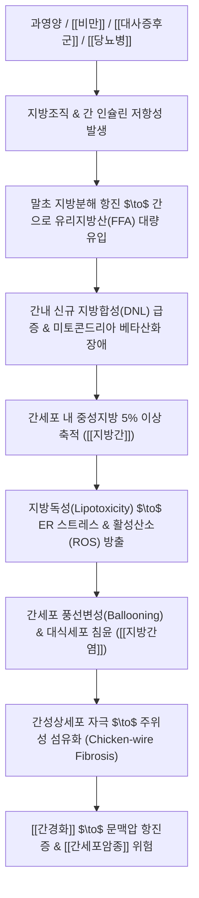

---
aliases:
  - 지방간
  - Fatty Liver Disease
  - 비알코올성 지방간질환
  - NAFLD
  - MASLD
  - 비알코올성 지방간염
  - MASH
  - 脂肪肝
  - K76.0
tags:
  - 질환
  - 간질환
  - 소화기
  - 지방간
---

# 🩺 [[지방간]] (Fatty Liver Disease / 脂肪肝, ICD-10 K76.0 / K70.0)

> **핵심 3줄 요약 (Key Summary)**:
> - 📍 병소 부위 & 해부·병태생리: 간세포 내 중성지방(Triglyceride)이 간 무게의 5% 이상 비정상적으로 축적되는 대사성 간질환군으로, 인슐린 저항성·유리지방산 유입 증가·베타 산화 장애에 따른 단순 지방간(Steatosis)에서 간세포 괴사 및 풍선변성(Ballooning)이 동반되는 대사이상 관련 지방간염([[비알코올성 지방간염]] MASH) 및 [[간경화]]로 진행.
> - 🚩 전형적 임상 양상 & 3대 징후: 대다수 무증상 또는 막연한 만성 피로감·우상복부 팽만감, 비만·고지혈증·당뇨병 등 [[대사증후군]] 징후 동반, 월경 불순 및 사지 부종.
> - 🛠️ 핵심 감별 검사 & 한·양방 다각적 치료 전략: 복부 초음파(간-신장 음영 대조 Hepatorenal contrast 증강, Bright liver), 간섬유화 스캔(FibroScan CAP & LSM), 혈청 간기능(ALT/AST, GGT) 및 비침습적 섬유화 지표(FIB-4), 양방 생활요법(체중 7~10% 감량, GLP-1 수용체 작용제), 한의 통합 치료([[건비조습]], [[소간청열]], [[활혈거어]], [[대시호탕]], [[생간건비탕]]).
> - ⚠️ 응급 의뢰 레드플래그 & 악화 요인: 단순 지방간에서 MASH를 거쳐 비대상성 간경변으로의 무증상 은밀한 진행, 문맥압 항진성 정맥류 출혈, 복수 및 비알코올성 간암(HCC) 병발.

---

## 📌 목차
1. [질환 개요 & 해부학적 병태생리](#1-질환-개요--해부학적-병태생리)
2. [병태생리 메커니즘 & 생체역학적 악순환 네트워크](#2-병태생리-메커니즘--생체역학적-악순환-네트워크)
3. [임상 증상 & 이학적 검사(Physical Exam) 알고리즘](#3-임상-증상--이학적-검사physical-exam-알고리즘)
4. [감별 진단 매트릭스 (Differential Diagnosis)](#4-감별-진단-매트릭스-differential-diagnosis)
5. [한의 통합 치료 프로토콜 (침·약침·추나·한약)](#5-한의-통합-치료-프로토콜-침약침추나한약)
6. [재활 운동 & 생활습관 티칭 가이드](#6-재활-운동--생활습관-티칭-가이드)
7. [💡 사용자 진료실 핵심 필기 & 임상 노하우 (Melt-In 잔여 심화 집약)](#7--사용자-진료실-핵심-필기--임상-노하우-melt-in-잔여-심화-집약)
8. [출처 및 학술 참고 문헌 (References)](#8-출처-및-학술-참고-문헌-references)

---

## 1. 질환 개요 & 해부학적 병태생리

![[지방간질환_단순지방간_지방간염_간경변_진행도.jpg|450]]
> [그림 1: 대사이상 관련 지방간염(MASH)의 조직병리 소견(Masson's trichrome 염색). 간세포질 내 거대한 투명 원형의 대수포성 지방구 침윤과 함께 중심정맥 주위로 청록색의 세포간·굴모양혈관주위 섬유화(Chicken-wire fibrosis)가 형성되어 있다.]

* **질환 정의 및 2023 다학제 글로벌 명칭 개정 (MASLD/MASH)**:
  * **정의**: 간세포 내에 중성지방이 간 무게의 5% 이상 또는 간생검상 간세포의 5% 이상에 침착된 상태를 의미한다.
  * **최신 표준 분류 체계**:
    * **[[대사이상 관련 지방간질환]](MASLD, 구 NAFLD)**: 심혈관-대사 위험 인자(비만, 당뇨병, 고지혈증, 고혈압)를 최소 1개 이상 동반하고 유의미한 음주력이 없는 지방간.
    * **[[대사이상 관련 지방간염]](MASH, 구 NASH)**: 지방 침윤뿐만 아니라 간세포 손상(풍선변성 Ballooning)과 소엽 내 염증, 섬유화가 동반되어 [[간경화]] 및 [[원발성 간암]]으로 진행 위험이 높은 고위험군.
    * **[[알코올성 지방간]](ALD)**: 남성 주당 210g, 여성 주당 140g 이상의 지속적 과음으로 유발된 지방간.
    * **MetALD**: 대사 위험 인자와 함께 중등도 이상의 음주력(남성 140~350g/주, 여성 140~280g/주)이 복합 작용하는 혼합형.
    * **이차성 지방간**: 부신피질 호르몬제([[스테로이드]]), 여성 호르몬제(타목시펜), 아미오다론, 메토트렉세이트 복용 등 약물성 간손상 및 총정맥영양(TPN).
* **관련 해부학적 구조물**:
  * **간소엽 3구역(Zone 3, 중심정맥 주위 Centrilobular zone)**: 산소 분압이 가장 낮은 구역으로, 지방 침윤 및 지방독성에 의한 괴사, 섬유화가 가장 먼저 시작되는 호발 부위이다.
  * **지질방울(Lipid Droplets) 및 간성상세포(Hepatic Stellate Cells)**: 비정상적 지질 과잉이 성상세포를 근섬유모세포로 형질전환시켜 교원질(Collagen)을 침착시킨다.

---

## 2. 병태생리 메커니즘 & 생체역학적 악순환 네트워크

![[지방간_간세포내_대수포성지방축적_병태도해.png|450]]
> [그림 2: 지방간의 복부 전산화단층촬영(CT) 소견. 간실질의 방사선 흡수 음영(Hounsfield Unit)이 비장(Spleen)보다 뚜렷하게 저하되어 간 전체가 어둡게 관찰되는 전형적인 미만성 지방간 소견을 나타낸다.]

### 1) 다중 타격 병태생리 (Multiple-Hit Hypothesis)
* **1차 타격 (지방 축적)**: 인슐린 저항성으로 인해 지방조직에서 유리지방산(FFA) 방출이 억제되지 못하고 간으로 쏟아져 들어오며, 간 자체의 신규 지질 합성(De Novo Lipogenesis)이 SREBP-1c 전사인자 활성화로 폭증하여 간세포질 내 대수포성(Macrovesicular) 지질 방울이 축적된다.
* **2차 다중 타격 (염증 및 괴사)**: 축적된 포화지방산과 다이아실글리세롤(DAG)이 세포소기관에 지방독성(Lipotoxicity)을 유발하여 소포체(ER) 스트레스, 미토콘드리아 호흡 사슬 장애, 활성산소(ROS) 과다 발생을 초래한다.
* **3차 섬유화 연쇄**: 손상된 간세포에서 방출된 DAMPs(위험인식분자)가 쿠퍼세포의 TLR4를 자극하여 TNF-α, TGF-β1을 분비시키고, 이는 간성상세포를 활성화하여 동맥 주위 모세혈관화(Capillarization) 및 결합조직 침착을 가속화한다.

---

## 3. 임상 증상 & 이학적 검사(Physical Exam) 알고리즘

![[지방간_복부초음파_고에코_간신음영대조_소견.jpg|450]]
> [그림 3: 복부 초음파상 관찰되는 전형적인 고에코성 'Bright liver' 소견. 간실질의 음영이 인접한 우측 신장 피질에 비해 현저하게 밝고 하얗게 대조(Hepatorenal echo contrast)되고 있다.]

### 1) 주소증 및 전신 대사 증상
* **무증상 및 잠복성**: 환자의 70~80%는 특이 증상이 없어 건강검진이나 혈액검사에서 우연히 발견된다.
* **전신 권태 및 소화기 증상**: 만성적인 전신 피로감, 나른함, 상복부의 불쾌감이나 둔탁한 팽만통(간종대에 따른 피막 신장).
* **대사 이상 징후**: 비만(특히 복부 내장비만), 사지 말단 부종, 피부 착색(흑색극세포증, Acanthosis nigricans), 여성 환자에서의 희발월경 또는 [[무월경]](다낭성 난소 증후군 병발).

### 2) 필수 진단 검사 및 영상의학적 소견
* **혈액 생화학 검사**:
  * ALT 및 AST 경도~중등도 상승 (단, 정상 수치인 MASH도 30~40%에 달하므로 정상 효소치라도 안심할 수 없음).
  * 알코올성 간질환의 경우 AST/ALT 비 > 2, GGT의 현저한 상승이 특징적이다.
* **비침습적 간섬유화 선별 지표 (FIB-4 Index)**:
  * $\text{FIB-4} = \frac{\text{Age} \times \text{AST}}{\text{Platelets} \times \sqrt{\text{ALT}}}$.
  * 1.3 이하(저위험군), 1.3~2.67(중간군), 2.67 이상(진행성 간섬유화 고위험군 $\to$ 상급병원 전원 권고).
* **초음파 검사 (Ultrasonography)**:
  * **간-신장 음영 대조(Hepatorenal contrast) 증가**: 정상에서는 간과 신장 피질의 밝기가 유사하나, 지방간에서는 간이 하얗게 빛난다(Bright liver).
  * **심부 감쇄(Deep attenuation)** 및 **간내 혈관벽 윤곽 흐려짐**.
* **순간탄성측정법 (FibroScan)**:
  * 제어감쇄매개변수(CAP)를 통한 간내 지방량 정량화(dB/m) 및 간 탄성도(LSM, kPa) 측정을 통한 섬유화 단계 정밀 판정.

---

## 4. 감별 진단 매트릭스 (Differential Diagnosis)

| 감별 질환 | 주원인 및 대사 인자 | 음주력 기준 | 주된 검사 소견 특징 |
| :--- | :--- | :--- | :--- |
| [[대사이상 관련 지방간]](MASLD) | [[비만]], [[당뇨병]], [[대사증후군]] | 주당 순수 알코올 남 < 210g, 여 < 140g | 초음파상 Bright liver, ALT > AST 우세 |
| [[알코올성 간질환]](ALD) | 지속적 과도한 알코올 섭취 | 주당 순수 알코올 남 $\ge$ 210g, 여 $\ge$ 140g | AST/ALT 비 > 2, GGT 및 MCV 현저 상승 |
| [[만성 C형 간염]] (Genotype 3) | HCV 감염 | 무관 | HCV RNA(+), 간세포 내 지방 변성 동반 |
| [[약물유발성 간손상]](지방간형) | [[스테로이드]], 타목시펜, 발프로산 | 무관 | 투약력 확인, 약물 중단 후 영상 소견 호전 |
| [[윌슨병]](Wilson's disease) | 선천성 구리 대사 이상 | 무관 | 혈청 세룰로플라스민 저하, 각막 KF 링 관찰 |

---

## 5. 한의 통합 치료 프로토콜 (침·약침·추나·한약)

* **침구 치료 (Acupuncture)**:
  * **추천 혈자리**: [[간수(BL18)]], [[비수(BL20)]], [[중완(CV12)]], [[기해(CV4)]], [[풍륭(ST40)]], [[족삼리(ST36)]], [[태충(LR3)]], [[음릉천(SP9)]].
  * **혈위 기전**: [[풍륭(ST40)]]·[[음릉천(SP9)]]은 거습화담(祛濕化痰)하여 지질 대사를 촉진하고, [[중완(CV12)]]·[[족삼리(ST36)]]은 비위의 운화 기능을 회복시킨다.
  * **전침 요법**: [[풍륭(ST40)]]-[[족삼리(ST36)]] 2Hz 저주파 통전으로 인슐린 감수성 개선 및 내장 지방 분해 자극.
* **약침 치료 (Pharmacopuncture)**:
  * **주요 제제**: [[황련해독탕]] 약침(간열을 내리고 간세포 내 염증 사이토카인 억제), [[중성어혈약침]](복부 어혈 및 미세순환 정체 해소).
  * **시술 부위**: [[간수(BL18)]], [[비수(BL20)]], [[천추(ST25)]]에 0.1~0.2cc씩 주입.
* **한약 치료 (Herbal Medicine)**:
  * **한의학적 핵심 병기**: 비허습담(脾虛濕痰), 간담습열(肝膽濕熱), 어혈조체(瘀血阻滯), 간비불화(肝脾不和).
  * **1) 건비화담·거습연견 (체중 과다, 사지 부종, 월경량 감소, 비허습담형)**:
    * 원문 의안 수록 처방: [[창출]], [[반하]], [[남성]], [[해조]]를 군약으로 배오.
    * 처방: [[이진탕]] 합 [[도담탕]] 가감.
    * 방의: [[창출]]·[[반하]]는 비장의 수습(水濕)을 말리고 담음(痰飮)을 제거하며, [[남성]]·[[해조]]는 완고하게 엉킨 탁한 담핵과 지방 덩어리를 연견산결(軟堅散結)하여 간세포 내 중성지방 축적을 해소한다.
  * **2) 청간사열·소식도체·활혈화어 (간열, 대사증후군, 고지혈증 동반형)**:
    * 원문 필기 수록 처방: [[결명자]], [[시호]], [[산사]], [[적작약]] 배오.
    * 처방: [[대시호탕]] 또는 [[생간건비탕]] 가감.
    * 방의: [[결명자]]는 청간명목(淸肝明目)하고 장관 지질 흡수를 억제하며, [[시호]]는 간기를 소통시켜 인슐린 저항성을 개선하고, [[산사]]는 육적(肉積)과 혈중 지질을 분해하며, [[적작약]]은 청열양혈(淸熱凉血)·거어지통(祛瘀止痛)하여 간내 미세순환 울체를 소통시킨다.
  * **3) 태음인 대사성 지방간 특화 처방**:
    * 처방: [[태음조위탕]] 또는 [[열다한소탕]] 가감 ([[마황]], [[의이인]], [[갈근]], [[황금]]).

---

## 6. 재활 운동 & 생활습관 티칭 가이드

* **체중 감량 목표 설정 (치료의 핵심)**:
  * 단순 지방간의 호전을 위해서는 **기존 체중의 5% 감량**, 간세포 괴사 및 염증(MASH) 완화를 위해서는 **7~10% 감량**이 필수적이다.
  * 급격한 단식이나 초저열량 다이어트(주당 1.5kg 초과 감량)는 말초 유리지방산의 간내 급속 유입을 유발하여 오히려 지방간염 및 간섬유화를 급격히 악화시키므로 **월 1~2kg의 점진적 감량**을 지도한다.
* **운동 요법 (유산소 + 저항성 병용)**:
  * 유산소 운동: 중강도 유산소 운동(빠르게 걷기, 조깅, 수영 등)을 주 3~5회, 회당 최소 30~50분(주당 총 150분 이상) 실시.
  * 저항성 운동: 큰 근육군(허벅지, 등, 가슴) 중심의 스쿼트, 런지 등을 주 2~3회 병행하여 골격근 인슐린 수용체 밀도를 증대시킨다.
* **식이 구조 개혁 (과당 및 알코올 엄격 제한)**:
  * **액상과당 차단**: 탄산음료, 가당 주스, 시럽 등 액상과당은 장관에서 흡수되어 인슐린을 거치지 않고 간으로 직행하여 신규 지방합성(DNL)을 극대화하므로 완전 금지한다.
  * **단순 당질 및 탄수화물 절감**: 밥, 빵, 떡, 면의 섭취량을 30% 감량하고 통곡물 및 채소류 위주로 식단을 재편한다.

---

## 7. 💡 사용자 진료실 핵심 필기 & 임상 노하우 (Melt-In 잔여 심화 집약)

> [!IMPORTANT]
> **🛡️ 지방간 한의 진료실 감별 및 문진 핵심 원칙**
> - 지방간은 증상이 없거나 단순 만성 피로로 내원하므로 **맥진이나 한의 변증만으로는 지방 침착도나 섬유화 단계를 절대로 과신해서는 안 되며, 반드시 양방 복부 초음파 및 혈액 검사 소견을 확인**해야 한다.
> - 알코올 중독, 고도 비만, 당뇨병, 고지혈증, 부신피질 호르몬제([[스테로이드]])나 여성 호르몬제를 복용 중인 환자가 피로·간기능 이상을 호소하면 우선적으로 지방간을 의심하고, 지방간을 간질환의 고립된 형태가 아닌 **전신 대사증후군이 간에 표현된 전신 혈관·대사 질환의 일부**로 접근해야 한다.

* **환자 체형별 실전 한약 운용 노하우**:
  * 1. **비만형 습담 체질 (체중 과다, 부종, 둔중감, 설태 백후)**: [[창출]], [[반하]], [[남성]], [[해조]]를 기본으로 [[의이인]], [[복령]]을 가미하여 체내 수습을 말리고 장관 습담 배출을 최우선으로 한다.
  * 2. **열성 비만·지질 이상형 (혈압 상승, 안면 홍조, 변비, 맥 활삭)**: [[결명자]], [[시호]], [[산사]], [[적작약]]을 바탕으로 한 [[대시호탕]]을 사용하여 간열을 내리고 혈액 속의 기름때(탁지 濁脂)를 씻어내는 거어활혈(祛瘀活血) 치료를 집중 적용한다.
* **실전 문진 체크리스트**:
  * 1. 매일 또는 주 3회 이상 음주를 지속하고 있는가? (음주량 계산 필수)
  * 2. 평소 탄산음료, 믹스커피, 과일 주스 등 단 음료를 매일 마시는가?
  * 3. 고혈압, 당뇨병, 이상지질혈증 약물을 복용 중이거나 스테로이드 제제를 장기 투여한 적이 있는가?
  * 4. 최근 수개월 사이에 체중이 급격히 증가하였는가?

---

## 8. 출처 및 학술 참고 문헌 (References)

1. **Rinella, M. E., Lazarus, J. V., Ratziu, V., et al.** (2023). *A multi-society Delphi consensus statement on new fatty liver disease nomenclature*. **Hepatology**, 78(6), 1966-1986.
   - [PubMed: 37364816](https://pubmed.ncbi.nlm.nih.gov/37364816/)
   - **[연구 요약]**: 전 세계 간학회 연합 델파이 합의를 통해 기존 NAFLD를 대사이상 관련 지방간질환(MASLD)으로 재정의하고, 알코올 복합형인 MetALD 범주를 신설하여 진단 정확도와 환자 낙인 효과를 개선한 기념비적 가이드라인.

2. **Chalasani, N., Younossi, Z., Lavine, J. E., et al.** (2018). *The diagnosis and management of nonalcoholic fatty liver disease: Practice guidance from the American Association for the Study of Liver Diseases*. **Hepatology**, 67(1), 328-357.
   - [PubMed: 28714183](https://pubmed.ncbi.nlm.nih.gov/28714183/)
   - **[연구 요약]**: 비알코올성 지방간질환(NAFLD/NASH)의 선별 검사, 고위험 섬유화 감별 알고리즘, 체중 감량(7~10%) 및 비타민 E·피오글리타존 등 약물 요법 지침 제시.

3. **European Association for the Study of the Liver (EASL), EASD, EASO** (2024). *EASL-EASD-EASO Clinical Practice Guidelines for the management of metabolic dysfunction-associated steatotic liver disease (MASLD)*. **Journal of Hepatology**, 81(3), 492-542.
   - [PubMed: 38851969](https://pubmed.ncbi.nlm.nih.gov/38851969/)
   - **[연구 요약]**: 유럽 3대 학회(간·당뇨·비만)의 MASLD 진단 및 관리 최신 가이드라인으로, 비침습적 섬유화 검사(FIB-4, FibroScan)를 1차 진료에서 필수 선별 도구로 채택하고 다학제적 대사 중재 권고.