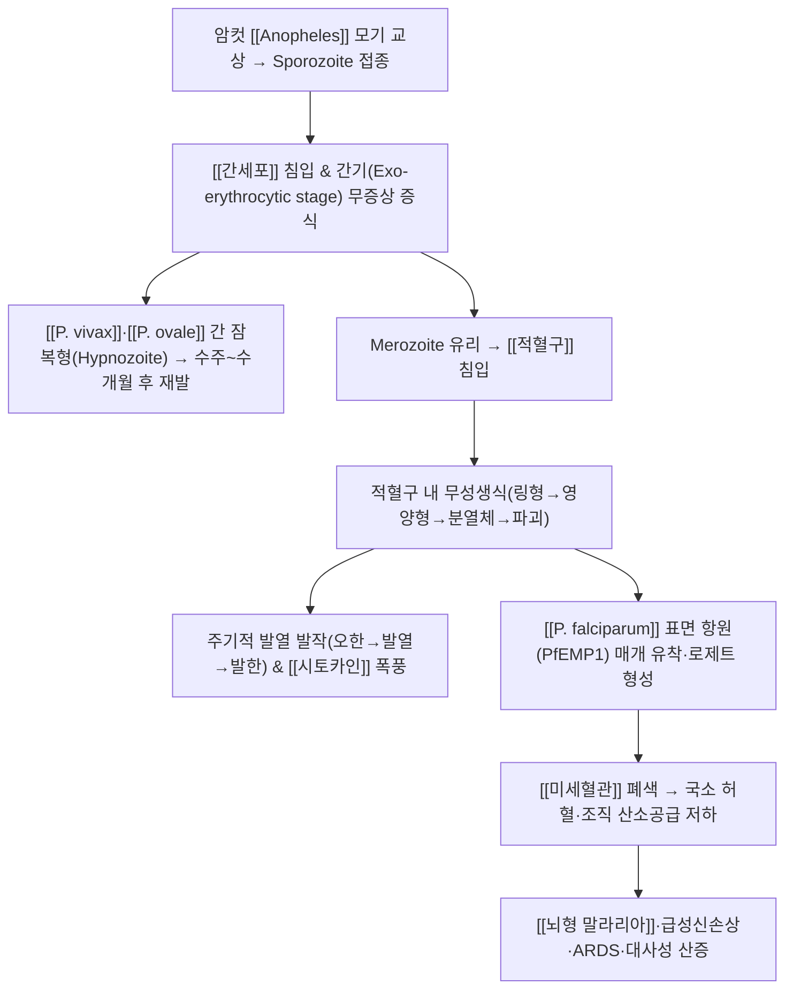

# 🩺 [[말라리아]] (Malaria / 瘧疾, ICD-10 B50–B54 / KCD B50–B54)

![[말라리아_1.jpg|540]]
> [그림 1: ① 병태생리·영상 — 말라리아_1]
![[말라리아_4.jpg|540]]
> [그림 2: ② 관련 해부 구조물 — Blood barrier differences between brain and lung during <b>malaria</b>. (a) Cerebral microvasculature and (b) lung micro]

> **핵심 3줄 요약 (Key Summary)**:
> - 📍 병소 부위 & 해부·병태생리: 주 표적은 [[적혈구]](적혈구 내 무성생식·용혈)이며, [[간세포]](간기) → [[미세혈관]]·[[비장]]·[[뇌혈관]] 순으로 이환된다. [[P. falciparum]]은 적혈구 표면 항원(PfEMP1) 매개 **유착(cytoadherence)·로제트 형성**으로 미세혈관 폐색과 국소 허혈을 일으킨다.
> - 🚩 전형적 임상 양상 & 3대 징후: **寒熱往來(오한 → 발열 → 발한)의 주기적 발열 발작**, **[[비장종대]]**, **[[빈혈]]·[[황달]]**. 열대열 말라리아는 주기성이 뚜렷하지 않은 지속열·불규칙열이 흔하다.
> - 🛠️ 핵심 감별 검사 & 한·양방 다각적 치료 전략: [[말초혈액 도말검사]](Giemsa 염색), [[신속진단검사]](RDT), [[중합효소연쇄반응]](PCR) + 少陽邪·暑熱·痰瘀 변증에 따른 [[소시호탕]]·[[달원음]]·[[청호]]·[[상산]] 계열 처방. **표준 항말라리아 화학요법이 근간이며 한의 치료는 보조·대증·회복기 관리로 한정**한다.
> - ⚠️ 응급 의뢰 레드플래그 & 악화 요인: 의식 변화·경련·혼수([[뇌형 말라리아]]), 호흡곤란(ARDS), 무뇨(급성신손상), 출혈 경향, 심한 빈혈, 고기생충혈증, 저혈당, 임신·영아·면역저하자. 절대 금기: 급성 발열기·탈수·중증빈혈 환자에 대한 강자극 수기/추나.

---

## 📌 목차
1. [질환 개요 & 해부학적 병태생리](#1-질환-개요--해부학적-병태생리)
2. [병태생리 메커니즘 & 생체역학적 악순환 네트워크](#2-병태생리-메커니즘--생체역학적-악순환-네트워크)
3. [임상 증상 & 이학적 검사(Physical Exam) 알고리즘](#3-임상-증상--이학적-검사physical-exam-알고리즘)
4. [감별 진단 매트릭스 (Differential Diagnosis)](#4-감별-진단-매트릭스-differential-diagnosis)
5. [한의 통합 치료 프로토콜 (침·약침·추나·한약)](#5-한의-통합-치료-프로토콜-침약침추나한약)
6. [재활 운동 & 생활습관 티칭 가이드](#6-재활-운동--생활습관-티칭-가이드)
7. [💡 사용자 진료실 핵심 필기 & 임상 노하우 (Melt-In 잔여 심화 집약)](#7--사용자-진료실-핵심-필기--임상-노하우-melt-in-잔여-심화-집약)
8. [출처 및 학술 참고 문헌 (References)](#8-출처-및-학술-참고-문헌-references)

---

## 1. 질환 개요 & 해부학적 병태생리

![[말라리아_1.jpg|540]]
> [그림 1: Plasmodium falciparum 01.png

* **질환 정의 및 분류**:
  * **정의**: 암컷 [[Anopheles]] 속 모기에 의해 전파되는 [[Plasmodium|Plasmodium 속]] 원충 감염질환. 원충이 [[적혈구]]에 침입해 주기적으로 파괴하면서 발열 발작·용혈성 빈혈·비장종대를 일으키는 급성 열성 감염병이다. 한의학에서는 **瘧疾(학질)** 로 지칭하며, 寒熱往來·休作有時(발작과 무증상기가 교대하는 특징)를 핵심 변증 지표로 삼아 少陽·少陽陽明 합병·痰瘀·久瘧 등의 병기로 나누어 접근해 왔다.
  * **ICD-10 / KCD 코드**:
    * **B50** 열대열 말라리아(*[[P. falciparum]]*)
    * **B51** 삼일열 말라리아(*[[P. vivax]]*)
    * **B52** 사일열 말라리아(*P. malariae*)
    * **B53** 난형 말라리아(*P. ovale*)
    * **B54** 기타/미분류 말라리아(*P. knowlesi* 등)
  * **원인 병원체(Plasmodium 속)**: Gozalo & Robinson(2024, PMID: 38902006)의 개요에 따르면 사람에 감염되는 주요 종은 *P. falciparum*, *P. vivax*, *P. ovale*, *P. malariae*이며, 동남아 지역에서는 *P. knowlesi*(원숭이 유래)가 인체 감염을 일으킨다. 종별로 잠복기·발열 주기·재발 기전이 다르므로 **종 동정이 치료 전략을 결정**한다.
  * **매개체 및 전파 경로**: Savi(2022, PMID: 36649040)는 전파 기전을 매개체(Anopheles 암컷 모기), 환경 요인, 인구 이동, 통제 개입(살충제 처리 망, 실내 잔류 살포, 항말라리아제 투여)으로 정리하고, 이들이 수학적 모델링의 핵심 변수임을 설명한다. 그 밖에 수혈·주사기 공동 사용·선천성(모체→태아)·장기이식 등 드문 비매개체 전파 경로가 있다.
  * **역학적 특성**: 열대·아열대 지역(사하라 이남 아프리카, 동남아, 남미 일부)에 집중되며, 국내에서는 대부분 **해외 유입 사례**이고 삼일열 말라리아의 경우 휴전선 접경 지역에서의 국내 발생 보고가 있었다(연도별 발생 규모의 구체적 수치는 **근거 미확인**). 소아·임신부·면역저하자·비장절제자는 중증화 위험이 높다.
* **관련 해부학적 구조물(감염병 모델에 맞춘 표적 장기 정리)**:
  * **혈액**: [[적혈구]] — 원충의 주 증식·용혈 부위. [[혈소판]](혈소판감소 흔함), [[혈장]](유리 헤모글로빈·빌리루빈 상승).
  * **실질 장기**: [[간세포]](간기 증식 및 잠복형 hypnozoite 보유), [[비장]](적혈구 격리·파괴로 인한 종대, 만성기 섬유화), [[골수]](적혈구 생성 억제).
  * **미세혈관·신경**: [[미세혈관]](유착·폐색), [[혈뇌장벽]](투과성 항진), [[뇌혈관]]·[[망막혈관]](뇌형 말라리아의 병소), [[신장]](급성신손상), [[폐]](ARDS).
  * **매개체 구조**: [[Anopheles]] 모기의 **침샘(sporozoite 저장)** 과 타액선, 중장(gametocyte 융합·접합).
  * **면역 조절 지점**: [[대식세포]], [[시토카인]](TNF-α 등 염증 매개체), [[보체]].

---

## 2. 병태생리 메커니즘 & 생체역학적 악순환 네트워크

### 1) 병소별 감염·증식 기전 (해부학적 포착 및 압박 기전에 대응)
* **간기(Exo-erythrocytic stage)**: sporozoite가 간세포에 침입하여 무성 증식하며 이 시기에는 **증상이 없다(무증상 잠복기)**. *P. vivax*와 *P. ovale*는 간세포 내 **hypnozoite(잠복형)** 를 남겨 수주~수개월 뒤 **재발(relapse)** 을 일으키는 것이 다른 종과의 결정적 차이다.
* **적혈구기(Erythrocytic stage)**: merozoite가 적혈구에 침입해 링형→영양형→분열체로 성숙하고, 적혈구가 파괴되면서 **유리 merozoite + 원충 대사산물 + 적혈구 잔해**가 혈류로 방출된다. 이 물질들이 내인성 발열원으로 작용해 발열 발작을 유발한다. 종별 적혈구 주기 차이(삼일열 약 48시간, 사일열 약 72시간)가 발열 주기의 차이로 나타나지만 **개체차·혼합감염으로 주기성이 소실되는 경우가 많다**.
* **유착·격리(sequestration)**: *P. falciparum*은 감염 적혈구 표면에 PfEMP1을 발현시켜 [[미세혈관]] 내피에 부착(cytoadherence)하고, 비감염 적혈구와 로제트를 형성한다. 그 결과 **[[뇌혈관]], [[신장]], [[폐]], [[태반]]의 미세혈관이 물리적으로 폐색**되어 국소 허혈·산소공급 저하·대사성 산증이 발생한다. 이것이 뇌형 말라리아·중증 말라리아의 핵심 기전이다(Luzolo & Ngoyi, 2019, PMID: 30658131).
* **면역·염증 반응**: TNF-α 등 전염증성 [[시토카인]] 상승이 발열·오한·근통을 매개하며, 과도한 염증 반응은 [[혈뇌장벽]] 투과성 항진과 뇌부종에 기여한다. 동시에 반복 감염은 부분 면역(premunition)을 형성해 무증상 보유자(carrier)를 만들어낸다.
* **건기 저수지(reservoir)**: Andrade & Carrasquilla(2024, PMID: 39284949)는 **감염 지속 기간과 숙주 환경(영양·면역 상태·벡터 밀도 등)** 이 *P. falciparum*의 건기 저수지 유지에 영향을 준다고 보고하였다. 즉 증상이 없어도 원충이 남아 다음 우기 전파의 씨앗이 될 수 있으며, 이는 **"증상 소실 = 완치"가 아니라는 임상적 경고**로 직결된다.

### 2) 악순환 연쇄 반응 (Kinetic Chain에 대응하는 '병태 연쇄')
* **용혈 → 빈혈 → 조직 저산소증 → 심박출량 증가 → 심부하**의 순환이 반복되면 회복이 지연된다.
* **비장 격리·파괴 증가 → 비장종대 → 혈구 감소(빈혈·혈소판감소) → 출혈 경향**으로 이어진다.
* **미세혈관 폐색 → 뇌부종·경련 → 의식 저하 → 흡인·저환기**로 진행되면 뇌형 말라리아의 치명적 경로가 완성된다.
* **저혈당·젖산산증·급성신손상**이 겹치면 중증도가 급격히 상승한다.

---

## 3. 임상 증상 & 이학적 검사(Physical Exam) 알고리즘

### 1) 주소증 및 임상 증상
* **발열 발작(핵심 3징후)**: **오한(cold stage) → 고열(fever stage) → 발한(sweating stage)** 의 3단계 발작이 특징적이며, 한의학적으로는 **寒熱往來**에 해당한다. 발작 사이에 무증상기(休作有時)가 있는 것이 전형적이나 열대열에서는 불규칙하다.
* **전신 증상**: 두통, 근육통, 관절통, 권태감, 오심·구토, 식욕부진, 설사, 복통.
* **신경학적 증상([[뇌형 말라리아]] 의심)**: 의식 혼탁, 섬망, 경련, 국소 신경학적 결손, 혼수. Luzolo & Ngoyi(2019)는 뇌형 말라리아를 주로 *P. falciparum* 감염 소아에게서 나타나는 **뇌증(encephalopathy) 증후군**으로 정리하며, 미세혈관 폐색·혈뇌장벽 손상·염증이 핵심 기전임을 강조한다.
* **혈액·대사 증상**: 빈혈에 따른 창백·운동 시 호흡곤란, 황달(용혈), 소변색 진해(혈색소뇨 시 **검붉은 소변**), 혈소판감소에 따른 점상출혈·잇몸출혈.
* **소화기·기타**: 비장종대에 따른 좌상복부 불쾌감, 간종대.

### 2) 필수 이학적 검사법 (Physical Examination)
* **[[체온 곡선 확인]]**: 발열 패턴(지속열·간헐열·주기열)과 발작 3단계 양상 확인. 해열제 반응만으로 감별하지 않는다.
* **[[비장 촉진]](splenomegaly)**: 좌측 늑골하연에서 흡기 시 촉진. 종대 정도는 감염 기간·종에 따라 다르며, 급성기에는 압통을 동반할 수 있다. **외상성 파열 위험**이 있으므로 거친 심부 촉진·복부 수기는 피한다.
* **[[간 촉진]] 및 공막 황달 확인**: 간종대·압통, 공막/피부 황달.
* **[[의식수준 평가]](GCS) 및 [[수막자극징후]](Kernig, Brudzinski)**: 뇌형 말라리아 대 뇌수막염 감별에 필수.
* **[[안저검사]]**: 망막 출혈·백반(retinal whitening) 등 말라리아 망막병증 소견은 중증도 평가에 도움.
* **[[탈수 및 순환 평가]]**: 모세혈관 재충만, 혈압, 요량 확인.
* **현미경·검사실 확진(진단 알고리즘의 중심)**:
  * **[[말초혈액 도말검사]]**(Giemsa 염색) — 종 동정과 기생충혈증(parasitemia) 정량이 가능한 표준 검사. 발열 주기와 무관하게 **수 시간 간격 반복 채혈**이 필요하다.
  * **[[신속진단검사]](RDT)** — 신속 선별에 유용하나 종 감별·정량에 한계가 있고, *P. falciparum* HRP2 결손주에서는 위음성이 가능하다(구체적 민감도·특이도 수치는 **근거 미확인**).
  * **[[중합효소연쇄반응]](PCR)** — 혼합감염·저기생충혈증·종 감별에 유용.
  * **[[전혈구검사]](CBC)**, [[빌리루빈]], [[젖산]], [[혈당]], [[크레아티닌]], [[전해질]], 혈액배양(동반 세균감염 감별).
  * **비열대열 말라리아의 중요성**: Ranjbar & Tegegn Woldemariam(2024, PMID: 38997728)은 우간다 자료 검토에서 **비열대열 말라리아(*P. vivax*, *P. ovale*, *P. malariae* 등)** 감염이 단순히 "경한 말라리아"로 치부될 수 없으며, 재발·만성 빈혈·진단 누락 등 임상적 부담이 존재함을 지적한다. 즉 **종 감별 없이 열대열만 의심하는 진단 습관은 위험**하다.

---

## 4. 감별 진단 매트릭스 (Differential Diagnosis)

| 감별 질환 | 호발 병소 및 원인 | 주소증 차이점 | 특이적 검사 소견 |
| :--- | :--- | :--- | :--- |
| [[말라리아]] (본 질환) | [[적혈구]] 내 Plasmodium, 모기 매개 | 오한-발열-발한 발작, 비장종대, 빈혈·황달 | [[말초혈액 도말검사]] 양성, [[신속진단검사]] 양성 |
| [[장티푸스]] | 소화기 림프조직, *Salmonella* Typhi | 계단식 상승열, 서맥, 장미진, 복통·설사/변비 교대 | 혈액·골수 배양 양성, 도말 음성 |
| [[뎅기열]] | 혈관내피, 바이러스 | 급격한 고열, 심한 근육통·관절통, 발진, 혈소판 급감 | NS1 항원/혈청학 양성, 도말 음성 |
| [[인플루엔자]]·[[COVID-19]] | 호흡기 점막, 바이러스 | 인후통·기침·콧물 등 호흡기 증상 우세 | 호흡기 바이러스 PCR 양성 |
| [[렙토스피라증]] | 간·신장·근육, *Leptospira* | 오한·근통(특히 장딴지), 결막출혈, 황달·신손상 | 혈청학(MAT)·PCR 양성 |
| [[급성 세균성 뇌수막염]]·[[바이러스성 뇌염]] | 뇌수막·뇌실질 | 두통·경부강직·의식변화, 발진 | 뇌척수액 검사(세포증가·단백 상승), 도말 음성 |
| [[아메바성 간농양]] | 간 실질 | 우상복부 통증·압통, 고열, 설사 병력 | 영상(농양), 혈청학, 도말 음성 |

> **감별 핵심 포인트**: **여행력(해외 체류·접경 지역 방문) + 주기적 발열 + 비장종대**의 조합은 말라리아를 최우선으로 의심하게 하는 임상 트리아드다. 다만 국내에서는 유입 사례가 대부분이므로 **문진에서 여행력을 놓치면 진단이 통째로 지연**된다.

---

## 5. 한의 통합 치료 프로토콜 (침·약침·추나·한약)

> **치료 원칙(반드시 준수)**: 말라리아는 **원충 자체를 제거하는 표준 항말라리아 화학요법(예: ACT 등)** 이 근간 치료이며, 중증 말라리아는 입원·집중 치료 대상이다. 한의 치료는 ① 발열·오한·근통 등 **증상 완화**, ② 항말라리아제 치료 중 발생하는 **오심·식욕부진·피로 등 부작용 및 회복기 허약 관리**, ③ 빈혈·기력 회복 촉진을 목표로 하는 **보조 요법**으로 위치시킨다. **한약 단독으로 확진된 말라리아를 치료하는 것은 금기**이며, 처방 상호작용(간독성·출혈 위험 등)은 **근거 미확인** 항목이 많으므로 투여 전 반드시 확인한다.

* **침구 치료 (Acupuncture)**:
  * **발열·오한기(급성기)**: [[대추]](大椎, 點刺出血 또는 瀉法), [[곡지]](曲池), [[합곡]](合谷), [[외관]](外關), [[풍지]] — 少陽·陽明 淸熱 배혈.
  * **寒熱往來·간헐열**: [[내관]](內關), [[지구]](支溝), [[양릉천]](陽陵泉) — 少陽經 樞機 조절.
  * **회복기·기허**: [[족삼리]](足三里), [[기해]], [[관원]], [[삼음교]] — 補氣健脾, 자침은 補法 위주, 전침은 저주파(2–4 Hz)로 자극량을 낮춘다.
  * **비장종대 동반 시**: 좌상복부에 대한 **직접 심자(深刺)·강자극은 금기**(비장 파열 위험).
  * **주의**: 고열·탈수·중증빈혈·혈소판감소 환자에서는 자침 개수와 자극량을 최소화하고, 출혈 경향 시 자침 자체를 신중히 결정한다.
* **약침 치료 (Pharmacopuncture)**:
  * 급성 발열기에는 **약침 시술을 원칙적으로 보류**한다(발열·감염 활성기에 침습적 시술은 상태 평가를 흐릴 수 있음).
  * 회복기에 [[족삼리]]·[[신수]]·[[간수]]·[[비수]] 등 배수혈에 淸熱·補氣 계열 약침을 소량 적용하는 방식을 고려할 수 있으나, **말라리아에 대한 약침의 유효성·안전성은 근거 미확인**이며 시술 여부는 환자 상태와 동의를 바탕으로 판단한다.
* **추나 치료 (Chuna Manipulation)**:
  * **말라리아 급성기(발열·탈수·중증빈혈·비장종대)에는 추나 및 강자극 수기 전면 금기**.
  * 회복기 근육통·전신 권태에 대해 **근막 이완(JS) 수기, 경추·흉추 관절가동술**을 저강도로 적용할 수 있으나, 열성 질환의 급성 염증이 완전히 소실된 뒤로 시기를 제한한다.
* **한약 치료 (Herbal Medicine)**:
  * **少陽 寒熱往來**: [[소시호탕]](小柴胡湯) — 往來寒熱, 胸脅苦滿, 心煩喜嘔에 대응. 和解少陽의 대표 처방.
  * **濕熱·暑熱 疫毒(달원음 계열)**: [[달원음]](達原飮)·[[시호달원음]] — 憎寒壯熱, 舌苔垢膩 등 邪伏膜原 병기에 적용.
  * **痰瘀·久瘧(만성·비장종대)**: [[별갑전환]](鼈甲煎丸), [[오제산]] 등 軟堅散結·活血 처방 계열. 다만 **장기 복용 시 간기능·출혈 위험 모니터링 필요(근거 미확인 항목 포함)**.
  * **회복기 氣血 兩虛**: [[청비탕]]·[[보중익기탕]]·[[십전대보탕]] 계열로 補氣血, 빈혈·피로 회복을 보조.
  * **항말라리아 한약 소재와 현대 약리**: [[상산]](常山, Dichroa febrifuga)은 한의학 고전에서 抗瘧의 대표 약재로 쓰였고, [[청호]](靑蒿, *Artemisia annua*, 그림 2)에서 유래한 **아르테미시닌(artemisinin)** 은 현대 항말라리아 화학요법(ACT)의 핵심 성분이 되었다. 즉 고전 처방의 抗瘧 약재가 현대 약리로 검증된 대표적 사례다. 다만 **한약 원재료를 임의로 달여 복용하는 방식은 성분 함량·독성(예: 상산의 구토 유발 등)이 표준화되지 않아 권장되지 않는다.**
  * **금기·주의**: 임신부는 活血·峻下 계열 처방 금기. [[G6PD 결핍증]] 환자에서는 프리마퀸 등 양방 항말라리아제의 용혈 위험이 크므로 **양방 처방과 함께 반드시 G6PD 상태를 확인**한다(한약 성분에 의한 G6PD 관련 용혈 위험은 **근거 미확인**).

---

## 6. 재활 운동 & 생활습관 티칭 가이드

* **회복기 단계별 활동 재개(단계화가 핵심)**:
  * **급성 발열기**: 절대 안정. 수분·전해질 보충, 해열·통증 조절.
  * **해열 후 1주**: 실내 가벼운 보행, 호흡 운동, 관절 가동 범위 운동.
  * **해열 후 2–4주**: 점진적 유산소 운동(대화가 가능한 강도). **빈혈이 교정되기 전 과도한 유산소 운동은 금지**.
  * **중증(뇌형·신손상) 회귀 후**: 신경학적 결손·인지기능 저하에 대한 재활 프로그램 연계, 보호자 교육 동반.
* **이완 및 스트레칭 (Stretching)**: 발열기 종료 후 전신 근육 이완(흉쇄유돌근·경추 주변·요방형근), 10–20초 정적 스트레칭 위주. 고열 후 근육통이 남은 시기에는 온열 요법을 병행.
* **강화 및 안정화 운동 (Strengthening)**: 빈혈·기력 저하가 회복된 뒤 심부 안정화 및 하지 대근육 강화(브릿지, 앉았다 일어서기)를 저강도로 시작.
* **신경 활주 운동 (Neurodynamics)**: 뇌형 말라리아 이후 신경학적 후유증(감각 이상·근력 저하)이 남은 경우, 신경 슬라이딩 운동을 통증 한계 내에서 시행하되 **급성 신경학적 악화 신호가 있으면 중단**.
* **생활습관 및 재감염 예방 티칭(가장 중요한 교육 항목)**:
  * **모기 회피**: 긴소매·긴바지, 야간 외출 시 방충제(DEET 등) 사용, 모기장·방충망 사용, 고인 물 제거.
  * **여행 상담**: 유행 지역 방문 전 [[항말라리아 예방요법]] 여부를 의료기관과 상의(약제 선택은 지역 내 저항성에 따라 다르며 **구체적 처방 기준은 근거 미확인**).
  * **재발 감시**: *P. vivax*·*P. ovale*는 hypnozoite로 인해 **수개월 후 재발**할 수 있으므로 치료 후에도 발열 재발 시 즉시 재검사. 삼일열에서는 근치 요법(프리마퀸 등) 여부가 재발률을 좌우한다.
  * **헌혈·수혈**: 감염력 소실 전 헌혈 금지 기준을 확인(구체적 기간은 **근거 미확인**).
  * **임신·소아**: 임신부는 중증화·태아 영향 위험이 높아 여행 자체를 재고하고, 소아는 발열 시 조기 검사.

---

## 7. 💡 사용자 진료실 핵심 필기 & 임상 노하우 (Melt-In 잔여 심화 집약)

> [!IMPORTANT]
> 아래는 상부 1~6번 섹션에 이미 녹여낸 일반 원칙을 반복하지 않고, **진료실에서만 쓰이는 고유 실전 필기**만을 압축한 것이다.

* **상부 섹션에 미처 다 담지 못한 고유 원문 필기**:
  * **"말라리아는 학질(瘧疾)"이라는 한의학적 정체성**: 고전에서 瘧疾은 **寒熱往來 · 休作有時 · 一日一發/間日發/三日發**으로 분류되어 왔고, 이 분류가 곧 현대의 발열 주기 관찰(삼일열·사일열)과 놀랍도록 겹친다. 즉 **한의학의 발작 주기 문진이 종 감별의 실마리를 줄 수 있다**는 것이 임상적 의의다.
  * **"불규칙열 = 열대열 가능성"이라는 실전 감각**: 주기가 예쁘게 맞지 않고 지속열·불규칙열로 오면 열대열(*P. falciparum*)과 중증화 위험을 먼저 떠올린다. 반대로 48시간 주기가 뚜렷하면 삼일열, 72시간이면 사일열 쪽으로 무게를 둔다.
  * **"증상 소실 ≠ 완치"**: 건기 저수지 연구(PMID: 39284949)가 시사하듯 무증상 보유 상태가 유지될 수 있고, *P. vivax*·*P. ovale*는 hypnozoite 재발이 있으므로 **"열이 내렸다"는 이유로 치료를 중단하지 않도록** 환자에게 명확히 교육한다.
  * **비열대열 말라리아를 얕보지 말 것**: PMID: 38997728 리뷰가 지적하듯 비열대열 감염도 재발·만성 빈혈 등으로 임상적 부담을 준다. "vivax는 가볍다"는 통념은 진단 누락으로 이어질 수 있다.
* **진료실 실전 감별 & 치료 노하우**:
  * 1. **실전 문진 체크리스트(3분 스크리닝)**:
    * **① 여행력**: 최근 1년 내 해외 체류(특히 사하라 이남 아프리카·동남아), 국내 접경 지역 방문 여부. **시점·지역·체류 기간**을 구체적으로 확인.
    * **② 발열 양상**: 발작의 3단계(오한→고열→발한), 발작 간격, 무증상기 존재 여부, 해열제 반응.
    * **③ 동반 증상**: 두통·의식 변화(즉시 응급), 황달·진한 소변, 좌상복부 불쾌감(비장종대 시사), 설사·복통.
    * **④ 고위험 인자**: 임신, 영아, 60세 이상, 비장절제, 면역억제제 복용, [[G6PD 결핍증]] 병력(프리마퀸 전 필수 확인).
    * **⑤ 약물력**: 자가 복용한 항말라리아제 유무 — 복용 후에는 도말 검사가 음성으로 나올 수 있어 진단이 어려워진다.
  * 2. **치료 순서 및 손맛 노하우**:
    * **순서 원칙**: ① 응급도 평가(의식·호흡·요량·혈압) → ② 확진 검사 의뢰(도말/RDT) → ③ **표준 항말라리아 치료 연계** → ④ 그 위에 한방 보조 치료를 얹는다. 순서를 뒤집으면 안 된다.
    * **자침 시**: 급성 발열기에는 대추·곡지·합곡 등 소수 혈자리로 淸熱 목적만 짧게 운용하고, 회복기로 넘어가면 족삼리·관원·삼음교 중심의 補法으로 전환한다. **고열·탈수 환자에게 장시간 유침·강전침은 피한다.**
    * **복부 수기 절대 금기 손맛**: 비장종대가 의심되면 좌상복부를 누르거나 두드리지 않는다. 복진 시에도 **가벼운 접촉부터** 시작한다.
    * **약침·추나는 시기 조절이 전부**: 열성 질환의 활성 염증이 가라앉기 전에는 침습적 시술을 미루는 것이 안전하다. 회복기 재개 시에도 첫 회는 자극량을 절반 이하로 줄여 반응을 본다.
  * 3. **환자 티칭 스크립트(그대로 읽어줄 수 있는 멘트)**:
    * *"이 병은 모기에 물려서 옮는 병이고, 열이 오한-고열-땀 순서로 규칙적으로 오는 게 특징입니다. 열이 내려도 원충이 몸 안에 남아 있을 수 있어서, 처방받은 항말라리아 약은 **열이 없다고 임의로 끊지 않는 것**이 가장 중요합니다."*
    * *"삼일열 말라리아는 간에 잠복해 있다가 몇 달 뒤에 다시 열이 오를 수 있습니다. 그래서 치료가 끝난 뒤에도 다시 열이 나면 바로 병원에 오셔서 피 검사를 받으셔야 합니다."*
    * *"유행 지역에 다시 가실 때는 모기장·방충제·긴 옷을 준비하시고, 출발 전에 예방약을 먹을지 의료기관과 상의하세요."*
    * *"회복기에는 빈혈이 남아 있어서 갑자기 운동을 세게 하면 어지럽고 숨이 찰 수 있습니다. 2~4주에 걸쳐 조금씩 늘려가세요."*
  * 4. **응급 의뢰 판단의 실전 감각**: 발열 + **의식 변화/경련**이면 뇌형 말라리아를 최우선으로 두고 즉시 상급병원 이송. **호흡곤란, 무뇨, 검붉은 소변, 심한 출혈 경향, 임신부 발열**은 모두 한방 진료실에서 붙잡을 상황이 아니며, 혈액 도말 결과를 기다리지 말고 이송이 우선이다.

---

## 8. 출처 및 학술 참고 문헌 (References)

1. **『黃帝內經』 素問 瘧論篇 / 『東醫寶鑑』 瘧疾(학질) 조문** — 寒熱往來·休作有時·발작 주기에 따른 변증 분류의 고전적 근거(한의학 병인·변증 체계).
2. **대한감염학회 감염학 교과서(말라리아 항목)** — 진단(도말·RDT·PCR) 및 표준 항말라리아 치료 원칙의 임상 표준.
3. **Savi MK (2022)**. *An Overview of Malaria Transmission Mechanisms, Control, and Modeling*. **Med Sci (Basel)**. PMID: 36649040
   - **[연구 요약]**: 매개체(Anopheles)·환경·인간 이동·통제 개입을 변수로 한 전파 기전과 수학적 모델링을 개괄. 본 노트의 "매개체→간기→적혈구기" 전파 흐름 및 예방 전략(모기 회피·살충 개입) 서술의 근거.
4. **Gozalo AS, Robinson CK (2024)**. *Overview of Plasmodium spp. and Animal Models in Malaria Research*. **Comp Med**. PMID: 38902006
   - **[연구 요약]**: 인체 감염 Plasmodium 종(*falciparum*, *vivax*, *ovale*, *malariae*, *knowlesi*)의 개요와 연구용 동물모델을 정리. 종별 특성·숙주 특이성 서술의 근거.
5. **Nordling L (2023)**. *Malaria's modelling problem*. **Nature**. PMID: 37380676
   - **[연구 요약]**: 말라리아 모델링이 안고 있는 데이터·가정·예측 한계를 지적한 기사. 모델 예측치를 임상에서 그대로 신뢰하지 말아야 한다는 유의점의 근거.
6. **Ranjbar M, Tegegn Woldemariam Y (2024)**. *Non-falciparum malaria infections in Uganda, does it matter? A review of the published literature*. **Malar J**. PMID: 38997728
   - **[연구 요약]**: 비열대열 말라리아(*P. vivax*, *P. ovale*, *P. malariae* 등) 감염의 임상적·역학적 부담을 검토. 종 감별과 재발 관리의 중요성 서술의 근거.
7. **Andrade CM, Carrasquilla M (2024)**. *Infection length and host environment influence on Plasmodium falciparum dry season reservoir*. **EMBO Mol Med**. PMID: 39284949
   - **[연구 요약]**: 감염 지속 기간과 숙주 환경이 *P. falciparum* 건기 저수지 유지에 미치는 영향 분석. "증상 소실 ≠ 완치" 및 무증상 보유자 개념의 근거.
8. **Luzolo AL, Ngoyi DM (2019)**. *Cerebral malaria*. **Brain Res Bull**. PMID: 30658131
   - **[연구 요약]**: 뇌형 말라리아의 병태생리(미세혈관 폐색·혈뇌장벽 손상·염증)와 임상 양상 리뷰. 본 노트 Red Flag 및 신경학적 합병증 서술의 근거.

<!-- 보관 태그(1회용·링크오류, 필요시 복원): 말라리아, 학질, 열성질환 -->
