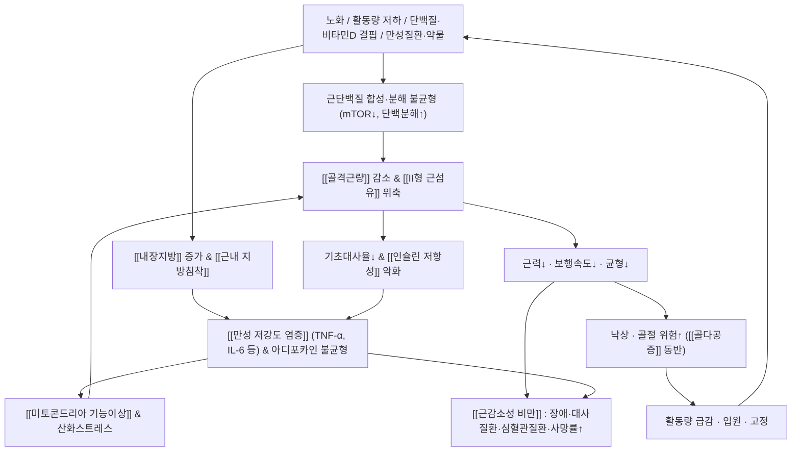

# 🩺 [[근감소성 비만]] (Sarcopenic Obesity / 肌少症性肥満, ICD-10: E66.- (비만) + M62.84 (근감소증) 병기 / KCD-8: E66.9)

> **핵심 3줄 요약 (Key Summary)**:
> - 📍 병소 부위 & 해부·병태생리: 특정 관절 하나가 아니라 **전신 [[골격근]]·[[지방조직]]·[[골]]을 아우르는 대사-근골격 복합 병태**다. 골격근량·근력 감소와 체지방량 증가가 **동시에** 진행되며, [[미토콘드리아 기능이상]], [[만성 저강도 염증]], [[인슐린 저항성]], 근내 지방침착(myosteatosis)이 서로를 증폭하는 악순환을 형성한다 (Prado & Batsis 2024, PMID 38321142; Axelrod & Dantas 2023, PMID 37380015).
> - 🚩 전형적 임상 양상 & 3대 징후: ① **체중은 정상~증가하는데 근력은 떨어지는** 불균형(의자에서 일어나기·계단 오르기·무거운 물건 들기 힘듦) ② **보행속도 저하와 반복 낙상** ③ **허리둘레 증가 + 만성 피로 + 혈당·지질 이상**. 체중 감량을 시도한 뒤 오히려 더 쇠약해졌다는 병력이 매우 특징적이다.
> - 🛠️ 핵심 감별 검사 & 한·양방 다각적 치료 전략: **악력계(grip strength) + 의자 일어서기(5회 STS) + 보행속도 + 체성분(BIA/DXA)** 4종 세트가 진단의 축이며([[악력검사]], [[보행속도검사]], [[생체전기저항분석]]), 핵심 처방은 **저항운동 + 단백질 최적화 영양 + 대사조절**이다. 한의학적으로는 脾虛痰濕·腎氣虛 변증에 따라 健脾益氣·補腎·化痰祛濕(침·약침·추나·한약)을 병용한다(한약·약침의 개별 효과에 대한 근거 수준은 **근거 미확인**).
> - ⚠️ 응급 의뢰 레드플래그 & 악화 요인: ① 원인 불명의 **급격한 체중 감소(악액질·암·결핵 감별 필수)** ② **반복 낙상·고관절/척추 골절 의심 통증·기형** ③ 갑작스러운 **하지 근력 마비·배뇨장애(마미증후군)** ④ 발열·전신 쇠약·야간통. 또한 **체중 감량만 단독으로 강행하는 것**과, 중증 [[골다공증]]·척추 골절 환자에 대한 **강한 복부·요추 추나 수기**는 절대 금기/주의 대상이다.

---

## 📌 목차
1. [질환 개요 & 해부학적 병태생리](#1-질환-개요--해부학적-병태생리)
2. [병태생리 메커니즘 & 생체역학적 악순환 네트워크](#2-병태생리-메커니즘--생체역학적-악순환-네트워크)
3. [임상 증상 & 이학적 검사(Physical Exam) 알고리즘](#3-임상-증상--이학적-검사physical-exam-알고리즘)
4. [감별 진단 매트릭스 (Differential Diagnosis)](#4-감별-진단-매트릭스-differential-diagnosis)
5. [한의 통합 치료 프로토콜 (침·약침·추나·한약)](#5-한의-통합-치료-프로토콜-침약침추나한약)
6. [재활 운동 & 생활습관 티칭 가이드](#6-재활-운동--생활습관-티칭-가이드)
7. [💡 사용자 진료실 핵심 필기 & 임상 노하우 (Melt-In 잔여 심화 집약)](#7--사용자-진료실-핵심-필기--임상-노하우-melt-in-잔여-심화-집약)
8. [출처 및 학술 참고 문헌 (References)](#8-출처-및-학술-참고-문헌-references)

---

## 1. 질환 개요 & 해부학적 병태생리

![[근감소성 비만_1_1.jpg|540]]
> [그림 1: ① 병태생리·영상 — 1025 Atrophy.png]

![[근감소성 비만_4.jpg|540]]
> [그림 2: ① 병태생리·영상 — Myoblast signaling associated with EPA, Palmitate and TNF-α interaction. Palmitate induces lipotoxicity in skeletal myob]

* **질환 정의 및 분류**:
  * **정의**: 근감소성 비만(Sarcopenic Obesity)은 **골격근량(skeletal muscle mass) 및 근력의 감소**와 **체지방량(특히 내장지방)의 증가**가 동시에 존재하는 복합 표현형이다. 단순 비만(근육량은 유지)도, 단순 근감소증(체중·지방은 감소 또는 정상)도 아니며, **두 병태가 상호작용하여 각각보다 더 나쁜 대사·기능·사망률 예후**를 만든다는 점이 임상적 핵심이다 (Prado & Batsis 2024, PMID 38321142; Wei & Nguyen 2023, PMID 37455897).
  * **분류**:
    * **일차성(원발성)**: 노화에 따른 자연스러운 근단백질 대사 변화, 호르몬 저하, 신경-근 접합부 퇴화가 주 원인.
    * **이차성**: 만성질환(당뇨병·만성콩팥병·COPD·암), 활동 저하(입원·골절 후 고정), 영양 결핍(단백질·비타민D), 약물(스테로이드 등)에 의해 촉발 또는 악화. 진료실에서는 **이차성 원인을 먼저 배제하는 것**이 실질적으로 치료 가능한 표적을 찾는 지름길이다 (Borba & Costa 2025, PMID 40215288).
    * **급성/만성 구분**: 최근의 급성 저활동·질병기(수 주)와 수년간 진행된 만성기(노화성)를 구분하면 치료 전략(회복 재활 vs 장기 관리)이 달라진다.
  * **호발 연령/성별/직업군**: 주로 **고령층**(특히 60세 이후)에서 유병률이 급증하며, 노화에 따른 근육량 감소는 성별·체구성에 따라 진행 속도 차이가 보고된다. 여성은 폐경 후 에스트로겐 저하로 체지방 재분포(내장지방↑)와 골밀도 저하가 겹쳐 위험이 커지고, 남성은 상대적으로 근육량 자체가 많아 **"마른 비만" 형태로 오래 숨겨지는** 경향이 있다. 장시간 좌식 직업군, 활동량 급감 후(은퇴·입원·골절 후)의 생활 패턴 변화가 주요 위험 요인이다. 진단 기준(EWGSOP/ AWGS 등)이 연구마다 달라 **보고된 유병률의 편차가 크며 정확한 대표 수치는 근거 미확인**이다 (Wei & Nguyen 2023, PMID 37455897).
  * **역학적 특성 및 임상적 의의**: 근감소성 비만은 **[[대사증후군]], [[제2형 당뇨병]], [[심혈관질환]], [[골다공증]] 및 골절 위험, 신체기능 저하(장애), 낙상, 그리고 사망률 증가**와 연관된다는 점이 여러 리뷰에서 일관되게 보고된다 (Wei & Nguyen 2023, PMID 37455897; Nishikawa & Asai 2021, PMID 34684520; Fan & Cai 2024, PMID 39147076). 즉 근감소성 비만은 "미용 문제"가 아니라 **기능·대사·생존을 좌우하는 예후 인자**로 다루어야 한다.

* **관련 해부학적 구조물**:
  * **골격 및 관절**: [[대퇴골]], [[요추]], [[고관절]]. 근감소성 비만은 **골밀도 저하(골감소증·골다공증)와 밀접하게 동반**되며, 골-근 상호작용(bone-muscle crosstalk) 관점에서 근육의 기계적 자극 감소가 골형성 자극 감소로 이어진다. 관련 핫스팟 연구가 활발하다 (Fan & Cai 2024, PMID 39147076). 따라서 **골절 위험(특히 고관절·척추·요골 원위부)** 평가가 필수다.
  * **근육 및 근막**: [[대퇴사두근]], [[둔근]], [[척추기립근]], [[복횡근]] 등 **대근군(anti-gravity muscles) 중심으로 위축**이 두드러진다. 특히 **[[II형 근섬유]](속근섬유)의 선택적 위축**이 기능 저하와 낙상 위험을 키운다. 근육 내부·근주위로 지방이 침착되는 **[[근내 지방침착(myosteatosis)]]**이 근감소성 비만의 특징적 소견이며, 근육의 "질(quality)" 저하를 반영한다 (Axelrod & Dantas 2023, PMID 37380015).
  * **신경 및 혈관**: [[말초신경]](운동단위 재편성 및 운동신경 손실), [[모세혈관밀도]] 감소. 미토콘드리아 밀도 및 기능 저하는 근육의 산화능 저하 → 피로·운동 내성 저하로 이어진다 (Axelrod & Dantas 2023, PMID 37380015). 대혈관 수준에서는 **[[내장지방]]-유래 염증성 사이토카인과 인슐린 저항성이 혈관내피 기능을 악화**시켜 심혈관 위험을 상승시킨다 (Wei & Nguyen 2023, PMID 37455897).
  * **대사·내분비 조직(핵심 부위)**: [[지방조직]](특히 내장지방), [[간]], [[골격근]]이 삼각 구도를 이루는 **대사 기관으로서의 근육** 관점이 이 질환 이해의 중심이다. 근육은 포도당 흡수의 최대 저장고이므로, 근육 손실 자체가 [[인슐린 저항성]]을 악화시키고, 인슐린 저항성은 다시 근단백질 합성을 억제하는 **양방향 악순환**을 만든다 (Nishikawa & Asai 2021, PMID 34684520; Axelrod & Dantas 2023, PMID 37380015).

> ⚠️ 참고: 본 노트에는 아직 메디컬 일러스트/해부 도해 이미지가 등록되어 있지 않다. 이미지 파일이 확보되면 진료실에서 환자 설명용으로 활용할 수 있도록 별도 관리할 것.

---

## 2. 병태생리 메커니즘 & 생체역학적 악순환 네트워크

### 1) 해부학적·분자적 발생 기전
* **근단백질 항상성 붕괴**: 노화 및 저활동 상태에서는 mTORC1 신호를 통한 **근단백질 합성 자극이 둔화**(아미노산 저항성)되고, ubiquitin-proteasome계·autophagy계를 통한 **분해가 상대적으로 우세**해진다. 여기에 염증성 사이토카인이 단백분해를 추가로 촉진한다 (Axelrod & Dantas 2023, PMID 37380015; Prado & Batsis 2024, PMID 38321142).
* **지방-근육 상호작용(Myosteatosis)**: 내장지방 및 근주위 지방조직에서 분비되는 아디포카인·염증성 매개체가 근육의 인슐린 신호를 방해하고 지방산 산화를 교란한다. 지방이 근섬유 사이로 침착되면 **근육의 수축 효율과 대사 효율이 동시에 떨어진다.** 이는 체중이나 BMI만으로는 잡히지 않는 병태다 (Axelrod & Dantas 2023, PMID 37380015).
* **미토콘드리아 기능이상**: 근육 내 미토콘드리아 수·기능 저하는 에너지 생산 저하 → 피로·활동량 감소 → 추가 근손실의 자기강화 루프를 만든다. 이 축이 근감소성 비만의 **치료 표적으로 부각**되고 있다 (Axelrod & Dantas 2023, PMID 37380015).
* **호르몬·영양 요인**: 성장호르몬/IGF-1, 테스토스테론, 에스트로겐 저하, 비타민D 결핍, 단백질 섭취 부족 및 불균형이 복합적으로 작용한다. 비타민D는 근기능과 골대사 양쪽에 관여하므로 근감소성 비만 + 골다공증 동반 환자에서 특히 중요하다 (Fan & Cai 2024, PMID 39147076).
* **만성 염증과 인슐린 저항성의 이중고리**: 지방조직 증가 → 염증성 사이토카인 상승 → 근육 인슐린 저항성 → 근육 포도당 흡수 저하 → 혈당 상승 및 지방 재축적 → 다시 염증 상승. 대사증후군과 근감소증이 서로를 촉진한다는 개념이 정리되어 있다 (Nishikawa & Asai 2021, PMID 34684520).

### 2) 생체역학적 연쇄 반응 (Kinetic Chain) 및 기능적 악순환
* **하지 근력 저하**([[대퇴사두근]], [[둔근]]) → **보행속도 저하·의자 일어서기 곤란** → 보행 시 **균형 전략이 고관절/체간 의존형으로 변형** → 낙상 위험 증가.
* **체간·심부 안정화 근육 약화**([[복횡근]], [[다열근]]) → 요추 분절 안정성 저하 → 만성 요통 및 요추 퇴행 가속. 비만으로 인한 복압·체중 부하 증가가 이를 증폭시킨다.
* **낙상 → 골절(특히 고관절) → 수술·고정 → 급성 근손실 → 더 깊은 근감소성 비만**으로 이어지는 전형적 노쇠 악순환. 이 고리에서 **골다공증이 동반될 때 결과가 급격히 나빠진다** (Fan & Cai 2024, PMID 39147076).
* **임상적 함의**: 따라서 치료 목표는 "체중 감량" 단일 목표가 아니라 **근력·기능 보존 + 체지방 감소 + 대사 개선**을 동시에 달성하는 것이어야 한다. 체중 감량만 강행하면 근육 손실이 함께 진행되어 오히려 예후가 나빠질 수 있다는 점이 최신 리뷰들의 핵심 경고다 (Prado & Batsis 2024, PMID 38321142).

---

## 3. 임상 증상 & 이학적 검사(Physical Exam) 알고리즘

### 1) 주소증 및 신경학적·기능적 증상
* **운동 기능 저하(가장 흔한 주소증)**:
  * 계단 오르기, 의자에서 일어나기, 버스 계단 오르기, 무거운 장바구니 들기가 힘들어짐.
  * **보행속도 저하**, 뒤처져 걷게 됨, 횡단보도 신호 내에 건너지 못함.
  * **반복 낙상**(특히 방향 전환, 어두운 곳, 욕실).
* **체성분 관련**: 체중은 **정상이거나 오히려 증가**했는데 몸이 물러지고 배만 나오는 형태. 허리둘레 증가, 옷 사이즈는 그대로인데 체형이 변함. **"살은 쪘는데 힘은 빠졌다"**는 표현이 전형적이다.
* **대사·전신 증상**: 만성 피로, 식후 졸림, 혈당·중성지방·혈압 상승(대사증후군 소견), 지방간, 수면무호흡 의심(코골이·주간 졸림).
* **감각 이상/신경학적 증상**: 근감소성 비만 자체의 필수 증상은 아니나, 동반 요추 퇴행·척추관 협착·당뇨병성 말초신경병증이 있으면 하지 저림·감각 저하가 병발한다. **저림이 주 증상이라면 근감소성 비만보다 신경 포착성 질환 감별이 우선**이다.
* **혈관/자율신경 증상**: 하지 부종, 정맥순환 저하, 냉감. 특히 비만 동반 시 만성 정맥부전 소견이 흔하다.
* **정신·인지**: 우울, 의욕 저하, 인지기능 저하와의 연관성이 논의된다(상호 인과 방향은 **근거 미확인**, 임상적으로는 동반 평가 필요).

### 2) 필수 이학적 검사법 (Physical Examination)
진단의 축은 **"근육량(mass) + 근력(strength) + 신체수행능력(performance)" 3요소**를 각각 측정하는 것이다.

* [[악력검사]] (Handgrip Strength, 악력계):
  * **목적**: 전신 근력의 대리 지표. 가장 간편하고 재현성이 높아 선별검사로 최우선.
  * **측정법**: 앉은 자세, 팔꿈치 90도, 좌우 각 2~3회 측정 후 최대값. 좌우 차이 및 절대값 모두 기록.
  * **해석**: 진단 기준(컷오프)은 사용하는 지침(EWGSOP2, AWGS 등)과 인구집단에 따라 다르므로 **본원에서 사용하는 지침의 컷오프를 명시해 기록**할 것. 수치 기준을 혼용하면 추적 관찰이 불가능하다.
* [[의자일어서기검사]] (5회 Sit-to-Stand, 5-STS):
  * **목적**: 하지 근력 및 기능적 수행능력 평가. 진료실에서 1분 내 시행 가능.
  * **양성 소견**: 팔걸이를 사용하지 않고 5회 일어서는 데 과도한 시간이 걸리거나, 마지막에 팔을 짚어야 하는 경우. 낙상 위험 및 하지 근력 저하를 시사.
* [[보행속도검사]] (Gait Speed, 4m 또는 6m):
  * **목적**: 신체 수행능력의 핵심 지표. 사망률·장애 예측력이 좋다고 알려져 있다.
  * **주의**: 보행속도는 관절 질환·신경병증·심폐질환의 영향을 받으므로, **단독으로 근감소성 비만을 진단하지 않는다.**
* [[생체전기저항분석]] (BIA) / [[이중에너지X선흡수계측]] (DXA):
  * **목적**: 사지골격근량(ASM/ALM) 및 체지방률 평가. BIA는 진료실 친화적, DXA는 표준 참조법에 가깝다.
  * **해석 포인트**: 체중·BMI만 보면 놓친다. **반드시 체지방률·내장지방 지표와 근육량을 함께** 본다. BMI가 정상인 "마른 비만형 근감소성 비만"이 존재한다 (Prado & Batsis 2024, PMID 38321142).
* [[허리둘레]] 및 체형 평가: 내장지방의 간접 지표. 체중보다 변화 추적이 유용하다.
* 추가 평가:
  * **균형·이동성**: 일어나 걷기 검사(TUG), 간단 균형 검사(SPPB 등).
  * **혈액검사**: 공복혈당/HbA1c, 지질 프로필, hs-CRP, 간기능(지방간), 신기능, 갑상선 기능(갑상선기능저하 감별), 비타민D, 알부민·총단백, 필요 시 테스토스테론.
  * **이차성 원인 선별**: 체중 변화 병력, 약물력(스테로이드·면역억제제), 종양 선별 필요성 판단.

### 3) 한의학적 사진(四診) 포인트
* **望診**: 체형(복부 비만형/전신 비만형), 안색(萎黃·晦暗), 설진(舌體 胖大, 齒痕, 苔白膩/黃膩 → 痰濕).
* **聞診**: 기식(氣息) 저하, 무기력한 음성.
* **問診**: 食慾·消化(痞滿, 腹脹), 大便(軟便·不爽), 小便, 手足冷·熱, 汗出, 睡眠, 疲勞度, 腰膝酸軟 유무.
* **切診**: 脈(沈細弱 → 氣虛·腎虛, 滑 → 痰濕), 腹診(心下痞硬, 腹壁軟弱無力).
* **변증 요약**: 脾氣虛, 腎氣/腎陽虛, 痰濕內阻, 氣滯血瘀가 복합된 형태가 많다(전통 이론).

---

## 4. 감별 진단 매트릭스 (Differential Diagnosis)

| 감별 질환 | 호발 병소 및 원인 | 주소증 차이점 | 특이적 이학적 검사 소견 |
| :--- | :--- | :--- | :--- |
| **[[근감소성 비만]]** (본 질환) | 전신 [[골격근]] + [[내장지방]] + 골, 노화/저활동/영양·대사 이상 | 근력↓ + 체지방↑ 동시. 체중은 정상~증가, "살쪘는데 힘 빠짐", 보행속도 저하·낙상 | 악력 저하 + 5-STS 지연 + 체지방률↑ · 근육량↓ (BIA/DXA) |
| **[[단순 비만]]** | 지방조직(주로 내장·피하) | 체중·BMI 증가 중심, 근력은 상대적으로 보존 | 악력 정상 범위, 체성분상 근육량 보존 |
| **[[단순 근감소증]]** | 골격근(노화·단백질 결핍) | 마르고 근력 저하, 체중 감소·저체중 흔함 | 악력 저하, 근육량 저하, **체지방률은 정상 이하** |
| **[[악액질]](Cancer Cachexia)/[[만성소모성질환]]** | 악성종양, 만성감염(결핵 등), 심부전, COPD | **최근 수개월 내 의도치 않은 급격한 체중 감소**, 야간통·발열·식욕 급감 | 전신 쇠약, 염증지표 상승, 종양 표지자·영상검사 이상 |
| **[[갑상선기능저하증]]** | 갑상선 | 체중 증가 + 무기력 + 추위 탐 + 부종 + 변비 | TSH↑/Free T4↓, 서맥, 深腱反射 지연 |
| **[[갑상선기능항진증]]** | 갑상선 | 체중 감소 + 근력 저하(근병증) + 더위 탐 심계항진 | TSH↓/Free T4↑, 빈맥, 진전 |
| **[[쿠싱증후군]]** | 부신(또는 스테로이드 과다) | 중심성 비만 + 근위축 + 피부 자색선조 + 고혈압 | 24h 소변 코르티솔, 야간 타액 코르티솔 이상 |
| **[[당뇨병성 근위축]]/[[당뇨병성 말초신경병증]]** | 말초신경·근육 | 대칭성 하지 저림·감각저하 + 근력 저하 | 단일섬유근전도, 진동각 저하, 족부 병변 |
| **[[요추 척추관 협착증]] / [[신경근병증]]** | 요추 신경근 | **간헐적 파행**, 특정 자세에서 통증·저림, 방사통 | SLR/신경긴장검사, 감각·근력 분절 분포 이상 |
| **[[염증성 근병증]](다발근육염 등)** | 골격근 염증 | 근위부 근력 저하 + 근육통 + 발진(피부근육염) | CK 상승, 근전도/근생검 이상, 자가항체 |
| **[[골다공증]] / [[골절 후유증]]** | 골(특히 척추·고관절) | 급성 통증·기형, 키 감소, 낙상 후 통증 | DXA T-score 저하, 척추 압박골절 소견 |

> **실전 정리**: 근감소성 비만은 **"배제 진단"의 성격**을 강하게 가진다. 즉, 갑상선 질환·악액질·쿠싱·신경근 질환을 배제한 뒤 "근력↓ + 근육량↓ + 체지방↑"이 동시에 확인될 때 진단이 성립한다 (Borba & Costa 2025, PMID 40215288).

---

## 5. 한의 통합 치료 프로토콜 (침·약침·추나·한약)

* **치료 목표 설정(가장 중요)**:
  1. **근력·기능 보존/증가** 2. **내장지방 감소** 3. **인슐린 저항성·혈당·지질 개선** 4. **낙상·골절 예방** 5. **식욕·소화·수면 개선을 통한 삶의 질 향상**.
  * ⚠️ **"체중 감량"만을 목표로 삼지 않는다.** 근육 손실을 동반한 체중 감량은 예후를 악화시킬 수 있다 (Prado & Batsis 2024, PMID 38321142).

* **침구 치료 (Acupuncture)**:
  * **기본 방향**: 健脾益氣 · 補腎强腰 · 化痰祛濕 · 理氣活血.
  * **대표 혈위**:
    * 기능·근력 강화: [[足三里]](ST36), [[三陰交]](SP6), [[太谿]](KI3), [[腎兪]](BL23), [[脾兪]](BL20), [[氣海]](CV6), [[關元]](CV4), [[百會]](GV20).
    * 대사·복부 관리: [[中脘]](CV12), [[天樞]](ST25), [[滑肉門]](ST24), [[帶脈]](GB26), [[陰陵泉]](SP9), [[豐隆]](ST40).
    * 하지 근력·균형: [[髀關]](ST31), [[伏兎]](ST32), [[梁丘]](ST34), [[血海]](SP10), [[陽陵泉]](GB34), [[崑崙]](BL60).
    * 요배부: [[大杼]](BL11), [[膈兪]](BL17), [[大腸兪]](BL25), [[命門]](GV4).
  * **전침(電針)**: 근위축·근력 개선 목적으로 저~중빈도 자극을 하지·복부 근군에 적용하는 방식이 임상에서 활용되나, **근감소성 비만 특정 프로토콜(주파수·시간·횟수)에 대한 근거는 미확인**이다. 환자 내약성에 맞추어 강도를 조절하고, 심박동기·임신 등 금기 여부를 반드시 확인한다.
  * **치료 주기(임상 운영)**: 주 2회 × 4주를 1블록으로 설정하고, 이후 주 1회 유지. 매 방문 시 악력·허리둘레·체중을 동일 조건에서 기록한다.
  * **자침 시 주의**: 고령·피부 취약·항응고제 복용 환자에서는 자침 깊이와 자극량을 줄이고 출혈 관리에 유의한다.

* **약침 치료 (Pharmacopuncture)**:
  * **적용 개념**: 국소 지방대사·복부 순환 개선을 목표로 하는 체표 부위 자극 + 근위축 부위 및 골·근 부착부 자극.
  * **체표 적용 부위(임상 활용 예)**: [[中脘]](CV12), [[天樞]](ST25), [[滑肉門]](ST24), [[帶脈]](GB26) 주위 복벽, 복직근 상·하부. 얕은 자입·소량 주입으로 멍·통증 최소화.
  * **근골격 적용 부위**: [[足三里]](ST36), [[腎兪]](BL23), [[太谿]](KI3), [[大杼]](BL11), [[懸鍾]](GB39) 등.
  * **주의**: 복부 자입 시 **장관 손상·혈종 위험**을 고려해 천자 각도와 깊이를 보수적으로 설정하고, 시술 전 장 폐색·탈장·임신 여부를 확인한다. 항응고제 복용자는 출혈 위험을 사전 설명한다.
  * **근거 수준**: 특정 약침 종류·용량이 근감소성 비만의 근육량·지방량을 개선한다는 고수준 임상 근거는 **근거 미확인**. 본 노트에서는 임상 경험적 활용으로만 기술한다.

* **추나 치료 (Chuna Manipulation)**:
  * **목적**: 요추·골반 정렬 회복, 복부·흉요부 근막 이완, 호흡 역학 개선, 소화관 운동 자극.
  * **기법 예시**:
    * 흉요추 교정 및 골반(장골) 정렬 추나 — 장시간 좌식·복부 비만으로 인한 전방 경사 보정.
    * 연부조직 이완(JS 계열 근막 이완) — [[요방형근]], [[척추기립근]], [[장요근]], 복직근.
    * 복부 추나(가벼운 복벽 이완 및 장운동 자극) — **반드시 환자 호흡에 맞춰 부드럽게**, 강압 금지.
    * 흉곽·횡격막 이완 유도 호흡 기법 병행.
  * **금기·주의 수기**: 중증 [[골다공증]](특히 T-score 심한 저하), **척추 압박골절 또는 급성 골절 의심**, 척추 전이암, 활동성 감염, 급성 요추 디스크 탈출로 인한 심한 방사통, 항응고 치료 중 강한 도수 교정. 이 경우 **근막 이완·호흡·관절가동범위 운동으로 대체**한다.

* **한약 치료 (Herbal Medicine)**:
  * **변증별 접근(전통 이론 기반)**:
    * 脾氣虛·氣虛형(무기력, 식욕不振, 腹脹, 軟便): [[補中益氣湯]], [[四君子湯]], [[六君子湯]] 계열 — 健脾益氣.
    * 痰濕內阻형(복부 비만, 舌苔白膩, 重倦感): [[二陳湯]], [[導痰湯]], [[防己黃耆湯]] 계열 — 化痰祛濕, 益氣利水.
    * 腎氣虛·腎陽虛형(腰膝酸軟, 手足冷, 夜尿): [[六味地黃丸]], [[八味地黃丸]] 계열 — 補腎.
    * 氣滯血瘀형(만성 통증·어혈 소견): [[血府逐瘀湯]] 등 — 理氣活血.
    * 수면·소화 불량 동반 시: [[歸脾湯]] 계열 고려.
  * **복용 지침**: 고령자의 경우 위장장애·다약제 복용(항응고제·혈당강하제)과의 상호작용을 반드시 확인하고, 시작 시 소량으로 반응을 본 후 조절한다.
  * **근거 수준**: 위 처방들은 전통적 변증 활용이며, **근감소성 비만을 1차 표적으로 한 임상시험 근거는 이 노트에서 확인되지 않음(근거 미확인)**. 특히 체중감량 목적의 한약 사용은 맹목적으로 하지 말 것.

* **통합 치료 운영 요약표**:

| 치료 축 | 목표 | 대표 적용 | 핵심 주의 |
| :--- | :--- | :--- | :--- |
| 침·전침 | 근력·기능, 대사 조절 | ST36, SP6, KI3, CV12, ST25, GB26 | 고령·항응고제 시 자극량 조절 |
| 약침 | 복부·근위축 국소 자극 | CV12, ST25, ST24, GB26, ST36 | 복부 자입 깊이·출혈 관리 |
| 추나 | 정렬·근막·호흡역학 | 흉요추·골반 교정, 근막 이완 | 골다공증·골절 시 강수기 금기 |
| 한약 | 변증 기반 전신 조정 | 補中益氣湯, 防己黃耆湯, 六味地黃丸 등 | 상호작용·위장장애 확인 |
| 운동·영양 | 근육량·기능 유지 (핵심) | 저항운동 + 단백질 최적화 | 체중감량 단독 금지 |

---

## 6. 재활 운동 & 생활습관 티칭 가이드

> **핵심 원칙**: 근감소성 비만에서 **운동은 선택이 아니라 치료의 본체**다. 특히 **저항운동(resistance exercise)**이 근육량·근력을 지키면서 체지방을 줄이는 핵심 축으로 강조된다 (Prado & Batsis 2024, PMID 38321142; Wei & Nguyen 2023, PMID 37455897; Axelrod & Dantas 2023, PMID 37380015).

* **저항운동 (Strengthening) — 최우선**:
  * **빈도/구성**: 주 2~3회, 전신 대근군(하지·둔부·등·가슴·복부 심부).
  * **강도 원칙**: **점진적 과부하**. 처음에는 맨몸/밴드/의자 활용으로 시작 → 자세가 안정되면 가벼운 아령·저항 밴드 → 무게 증가.
  * **진료실 처방 예시(초급)**:
    1. 의자 일어서기(팔 사용 최소화) 10회 × 2~3세트
    2. 앉아서 무릎 펴기(밴드) 좌우 10회 × 2세트
    3. 벽 밀기(푸시업 대체) 10회 × 2세트
    4. 앉아서 밴드 당기기(등) 10회 × 2세트
    5. 발끝/뒤꿈치 들기 15회 × 2세트
  * **주의**: 어지럼·흉통·호흡곤란 시 즉시 중단. 고관절 골절 병력자는 회내·회외 자세에서 균형 보조를 확보한 상태로 시행.

* **유산소 운동 (Aerobic)**:
  * 목적은 **내장지방 감소 및 심폐기능 유지**. 빠른 걷기·고정식 자전거·수중 운동(관절 부담 적음) 권장.
  * 근손실을 우려해 유산소만 과도하게 하는 것은 바람직하지 않으며, **반드시 저항운동과 병행**한다.

* **이완 및 스트레칭 (Stretching)**:
  * 단축되기 쉬운 부위: [[장요근]], [[요방형근]], [[대퇴직근]], [[슬굴곡근]], [[흉근]], [[광배근]].
  * 정적 스트레칭은 운동 후 또는 별도 세션으로 20~30초 × 2~3회. 통증 유발 범위까지 밀어붙이지 않는다.

* **신경 활주 운동 (Neurodynamics)**:
  * 하지 저림·신경병증이 동반된 경우에만 선별 적용(좌골신경 슬라이딩 등). **통증을 악화시키는 신경 긴장 기법은 금지**하며, 저림이 증가하면 즉시 중단한다.

* **영양 티칭**:
  * **단백질**: 고령자에서는 일반 성인보다 **높은 수준의 단백질 섭취가 권장**된다는 논의가 있으며, 끼니별 분배 섭취가 강조된다. **구체적 g/kg 용량은 사용 지침·개별 신기능에 따라 달라지므로 본원 기준을 명시해 지도할 것(정확 용량 근거 미확인)**.
  * **비타민D·칼슘**: 골다공증 동반 시 특히 중요. 결핍 확인 후 보충 (Fan & Cai 2024, PMID 39147076).
  * **가공식품·정제당·음주** 감소, 식이섬유·채소·통곡물 중심.
  * **극단적 저열량 다이어트 금지**: 근육 손실을 가속한다.

* **일상생활 자세 및 환경 (Ergonomics)**:
  * **낙상 예방 환경**: 욕실 미끄럼 방지 매트, 야간 조명, 문턱 제거, 안전 손잡이, 잘 맞는 신발(미끄럽지 않은 밑창).
  * **좌식 시간 감소**: 30~60분마다 기립·가벼운 스트레칭. "앉아 있는 시간 총량" 자체를 줄이는 목표 설정.
  * **수면**: 수면무호흡 의심 증상(심한 코골이·주간 졸림) 시 수면 클리닉 의뢰 고려.
  * **금연·절주**, 정기 체성분·악력 추적(3개월 간격 권장).

---

## 7. 💡 사용자 진료실 핵심 필기 & 임상 노하우 (Melt-In 잔여 심화 집약)

> [!IMPORTANT]
> 아래 내용은 상부 1~6번 섹션에서 다루지 않은 **진료실 운영·문진·설명 스크립트 중심의 실전 노하우**만을 정리한 것이다. (기본 정의·병태생리·검사·치료 원칙은 상부에 이미 통합되어 있음.)
> 본 섹션의 수기·약침 활용은 **임상 경험 기반**이며, 개별 중재의 효과 크기에 대한 학술적 근거는 **근거 미확인**임을 전제로 한다.

### 1) 실전 문진 체크리스트 (내원 5분 안에 확인)
1. **"최근 6개월~1년 사이에 몸무게가 어떻게 변했습니까?"** → 증가/유지/감소 확인. **의도치 않은 급격한 감소**는 악액질·종양 선별로 직행.
2. **"의자에서 일어날 때, 계단 오를 때 예전보다 힘들어졌습니까?"** → 하지 근력 저하의 핵심 스크리닝 질문.
3. **"지난 1년간 넘어진 적이 있습니까? 몇 번입니까?"** → 낙상력은 기능 저하의 가장 강력한 실마리.
4. **"무거운 장바구니를 들 수 있습니까? 병뚜껑을 열 수 있습니까?"** → 상지 악력 저하 간접 확인.
5. **"체중을 줄이려고 굶거나 원푸드 다이어트를 하신 적이 있습니까? 그때 기운은 어떠셨습니까?"** → **감량 후 더 쇠약해진 병력**은 근감소성 비만의 전형적 단서이자 최고의 교육 타이밍.
6. **"식사에서 고기·생선·달걀·콩 제품을 하루에 몇 번 드십니까?"** → 단백질 섭취 실태 파악(대부분 부족).
7. **"허리둘레를 재본 적이 있습니까?"** → 체중보다 허리둘레가 내장지방 추적에 유용.
8. **"소변·대변, 수면(코골이), 복부 팽만, 손발 냉증은 어떠십니까?"** → 한방 변증(脾·腎·痰濕) 및 대사 합병증 단서.
9. **"복용 중인 약(스테로이드, 혈당약, 항응고제)이 있습니까?"** → 이차성 원인·시술 안전성 확인.
10. **"하루에 몇 시간 앉아 지내십니까?"** → 좌식 시간은 교정 가능한 핵심 표적.

### 2) 진료실 실전 감별 & 판단 노하우
* **체중계에 속지 말 것**: 체중과 BMI가 정상이어도 **악력 저하 + 체지방률 증가 + 보행속도 저하**면 근감소성 비만이다. 진료실에 체성분계가 있다면 **모든 60세 이상 신규 환자에서 기본 세트(체성분 + 악력 + 5-STS)** 를 루틴화하는 것이 좋다.
* **"마른 비만 + 근력 저하"는 특히 위험**: 겉으로 봐서는 정상 체형이라 가족도 환자도 심각성을 인지하지 못한다. 이 그룹에서 낙상·골절이 갑자기 발생한다.
* **저림이 주소증이면 순서를 바꿔라**: 근감소성 비만 관리를 시작하기 전에 요추 척추관 협착·당뇨병성 신경병증 등 **신경 포착성/말초신경병증 감별을 먼저** 배제한다. 저림 환자에게 강한 하지 근력 운동을 바로 처방하면 증상이 악화될 수 있다.
* **급격한 체중 감소는 절대 놓치지 말 것**: "살이 빠져서 좋아졌다"는 말에 동조하면 안 된다. **의도하지 않은 감소**는 악액질·결핵·갑상선기능항진·당뇨 조절 불량의 신호일 수 있다.
* **골다공증 동반 여부를 항상 의식**: 근감소성 비만 + 골다공증 조합은 추나 수기 선택과 운동 강도를 완전히 바꾼다 (Fan & Cai 2024, PMID 39147076).

### 3) 치료 순서 및 손맛 노하우
* **자침 순서(권장 동선)**: 환자를 앙와위로 눕히고 → 복부(中脘·天樞·帶脈) → 하지(足三里·三陰交·陰陵泉) → 필요 시 太谿. 이후 복와위로 전환하여 腎兪·脾兪·大杼 → 하지 후면. **고령자는 체위 변경 시 어지럼이 흔하므로 천천히, 필요 시 중간 휴식.**
* **복부 자침의 손맛**: 복벽이 두꺼운 환자에서 깊게 넣으려 하지 말고, **피부에서 얕게 자극을 주는 방식**이 멍·통증이 적고 순응도가 높다. 복부 시술 전 반드시 배뇨 여부를 확인한다.
* **복부 약침의 각도**: 복직근 초음파 해부를 상상하며 **피부에 대해 예각(거의 평행에 가깝게)으로 얕게** 접근하면 장관 천공 위험을 줄일 수 있다. 주입량은 소량씩, 여러 점에 분산.
* **추나 적용 체위 팁**: 복부 비만이 심한 환자는 앙와위 복부 수기가 매우 불편하므로, **측와위 또는 좌위에서 호흡 유도와 흉요추 이완**을 먼저 하고 복부는 마지막에 짧게 시행한다. 호기를 내쉴 때 손을 얹어 이완을 유도하는 방식이 효과적.
* **전침 활용 시**: 근위축 부위에는 자극을 주되, 환자가 "저릿하다"고 표현하는 강도 이상은 올리지 않는다. 고령자에서 과자극은 다음 방문 불이행으로 이어진다.
* **치료 반응 평가 타이밍**: 4주 차에 **악력·5-STS 시간·허리둘레** 세 가지를 재측정해 변화를 보여준다. 체중은 오히려 그대로여도 악력이 오르고 의자 일어서기가 빨라지면 **성공적인 치료**로 설명해 준다.

### 4) 환자 티칭 스크립트 (그대로 읽어도 되는 문장)
* **개념 설명**:
  > "선생님은 살이 쪘는데 근육이 같이 빠진 상태입니다. 그래서 몸무게는 그대로여도 힘이 빠지고 계단이 힘들어진 겁니다. 이건 단순히 살을 빼는 문제가 아니라 **근육을 지키면서 지방을 줄이는** 문제입니다."
* **체중 감량 단독 금지 설명**:
  > "무조건 굶어서 살을 빼면 근육이 먼저 빠집니다. 그러면 체중은 줄어도 더 쇠약해지고, 넘어질 위험이 오히려 커집니다. 그래서 저는 **운동을 먼저 잡고, 영양을 채우면서, 서서히 지방을 줄이는 순서**로 갑니다."
* **운동 교육**:
  > "집에서 하실 운동은 딱 하나만 기억하시면 됩니다. **의자에서 팔 안 짚고 일어나기**, 하루 10번씩 3세트. 이게 안 되면 밴드를 잡고 하셔도 됩니다. 이 동작이 다리와 엉덩이 근육을 지켜 줍니다."
* **단백질 교육**:
  > "한 끼에 단백질 반찬을 꼭 하나 넣어 주세요. 고기·생선·달걀·두부·콩 중 하나입니다. 세 끼 모두 드시는 게 목표입니다."
* **낙상 예방**:
  > "욕실에 미끄럼 방지 매트와 손잡이, 밤에 화장실 갈 때 켜는 작은 불을 꼭 준비해 주세요. 지금은 넘어지면 뼈가 부러질 수 있는 상태라 예방이 치료보다 중요합니다."
* **추적 관리**:
  > "3개월마다 근력과 허리둘레를 재겠습니다. 몸무게가 안 줄어도 근력이 올라가면 좋아지고 있는 겁니다."

### 5) 변증 감별 직관 요약 (진료실용)
| 변증 | 진료실에서 보이는 특징 | 치료 방향 |
| :--- | :--- | :--- |
| 脾氣虛 | 무기력, 식후 졸림, 腹脹, 軟便, 舌胖大 齒痕 | 健脾益氣 (足三里·中脘·脾兪) |
| 腎氣/腎陽虛 | 腰膝酸軟, 手足冷, 夜尿, 脈沈細 | 補腎 (關元·腎兪·太谿·命門) |
| 痰濕內阻 | 복부 비만, 身重, 苔白膩/黃膩 | 化痰祛濕 (陰陵泉·豐隆·天樞·帶脈) |
| 氣滯血瘀 | 만성 통증, 어혈 소견, 舌紫暗 | 理氣活血 (膈兪·血海·太衝) |
| 혼합형(실제 대부분) | 위 항목 2~3개 동시 | 주증 위주로 배합 |

---

## 8. 출처 및 학술 참고 문헌 (References)

1. **Prado CM, Batsis JA (2024)**. *Sarcopenic obesity in older adults: a clinical overview*. **Nature Reviews Endocrinology**. PMID: 38321142
   - **[연구 요약]**: 고령자 근감소성 비만의 임상 개요를 정리한 리뷰. 정의와 진단적 접근(근육량·근력·신체수행능력), 임상 결과, 그리고 **체중 감량 단독이 아닌 근육 보존 중심의 관리 전략**의 필요성을 강조한다. 본 노트의 정의·진단 프레임 및 "체중 감량 편중 금지" 원칙의 근거로 인용.
2. **Wei S, Nguyen TT (2023)**. *Sarcopenic obesity: epidemiology, pathophysiology, cardiovascular disease, mortality, and management*. **Frontiers in Endocrinology (Lausanne)**. PMID: 37455897
   - **[연구 요약]**: 역학, 병태생리, 심혈관질환 및 사망률과의 연관성, 관리 전략을 포괄적으로 다룬 리뷰. 근감소성 비만이 심혈관 위험 및 사망률 증가와 연관됨을 정리하여, 본 노트의 예후·역학 파트 근거로 인용.
3. **Axelrod CL, Dantas WS (2023)**. *Sarcopenic obesity: emerging mechanisms and therapeutic potential*. **Metabolism**. PMID: 37380015
   - **[연구 요약]**: 미토콘드리아 기능이상, 만성 염증, 인슐린 저항성, 근내 지방침착 등 **기전 중심** 리뷰와 치료 가능성(운동 등)을 제시. 본 노트 2번 섹션 병태생리 네트워크의 핵심 근거.
4. **Borba VZC, Costa TMDRL (2025)**. *Sarcopenic obesity: a review*. **Archives of Endocrinology and Metabolism**. PMID: 40215288
   - **[연구 요약]**: 근감소성 비만 전반을 최신 시점에서 정리한 리뷰. 진단 기준의 이질성과 감별 진단의 중요성(이차성 원인 배제)을 시사. 본 노트의 감별 진단 매트릭스 및 진단 기준 주의사항 근거.
5. **Nishikawa H, Asai A (2021)**. *Metabolic Syndrome and Sarcopenia*. **Nutrients**. PMID: 34684520
   - **[연구 요약]**: 대사증후군과 근감소증의 상호 연관성(인슐린 저항성, 염증, 지방간 등)을 정리. 본 노트의 "대사-근육 양방향 악순환" 개념의 근거.
6. **Fan S, Cai Y (2024)**. *Sarcopenic obesity and osteoporosis: Research progress and hot spots*. **Experimental Gerontology**. PMID: 39147076
   - **[연구 요약]**: 근감소성 비만과 골다공증의 연관성 및 연구 동향·핫스팟을 정리. 골-근 상호작용, 골절 위험, 비타민D·칼슘의 중요성에 대한 본 노트 서술의 근거.

> **인용 원칙 메모**: 본 노트의 모든 학술 인용은 위 6편의 실제 PubMed 문헌으로 한정하였다. 그 외 수치·기준(악력 컷오프, 단백질 섭취 권장량, 약침·한약의 특정 효능)은 노트 내에서 **근거 미확인**으로 명시하였으며, 진료실 적용 시 최신 지침 원문을 별도 확인할 것.

<!-- 보관 태그(1회용·링크오류, 필요시 복원): obesity, 만성염증 -->
