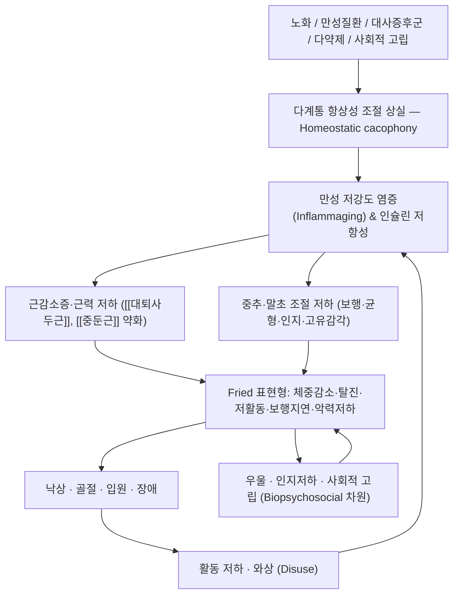

# 🩺 [[Frailty]] (Frailty / Frailty syndrome / 老衰·虛弱, ICD-10 R54 / KCD-8 R54)

> **핵심 3줄 요약 (Key Summary)**:
> - 📍 병소 부위 & 해부·병태생리: 단일 장기가 아닌 **다계통(골격근·신경·내분비·면역·대사) 질환**이다. [[골격근]]([[근감소증]]과 중복), [[시상하부-뇌하수체-부신축]], 만성 저강도 염증(inflammaging), 에너지 대사 조절계가 동시에 흐트러지며, Fried & Cohen(2021)은 이를 "항상성 교향곡(homeostatic symphony)에서 불협화음(cacophony)으로의 이행"으로 개념화했다. PMID: 34476409
> - 🚩 전형적 임상 양상 & 3대 징후: ① 의도치 않은 **체중 감소**, ② **탈진(exhaustion)**, ③ **저활동**, ④ **보행 속도 저하**, ⑤ **악력 저하** — 이 5개 표현형 중 3개 이상이면 노쇠, 1~2개면 전노쇠(pre-frail)로 분류한다(Fried & Tangen, 2001, PMID: 11253156). 여기에 낙상·인지저하·우울·사회적 고립이 겹치며 **낙상 위험이 유의하게 상승**한다(PMID: 35946721).
> - 🛠️ 핵심 감별 검사 & 한·양방 다각적 치료 전략: [[악력계]] 측정, [[보행속도 검사]](4 m/15 ft), [[TUG 검사]], [[의자 일어서기 검사]], [[버그 균형 척도]]로 기능을 정량화하고, 원인 질환(대사증후군·갑상선·우울·RA/OA 등)을 감별한다. 한방에서는 [[보익제]](補益劑) 계열 한약 + [[족삼리]]·[[기해]]·[[관원]]·[[신수]] 중심 침·전침·약침, 그리고 저항성·균형 운동을 묶은 **다영역 복합 중재**가 기본 골격이다.
> - ⚠️ 응급 의뢰 레드플래그 & 악화 요인: 급격한 체중 감소(악성종양·결핵·갑상선항진 감별), 설명되지 않는 낙상 반복(경추·고관절 골절, 경막하출혈 위험), 급성 섬망·의식변화, 발열·요로감염, 심부전 급성 악화, 전해질 이상, 다약제(polypharmacy)로 인한 어지럼·기립성 저혈압. 와상·장기간 침상 안정(disuse)과 영양결핍은 노쇠 악순환을 즉시 가속하므로 최우선 교정 대상이다.

---

## 📌 목차
1. [질환 개요 & 해부학적 병태생리](#1-질환-개요--해부학적-병태생리)
2. [병태생리 메커니즘 & 생체역학적 악순환 네트워크](#2-병태생리-메커니즘--생체역학적-악순환-네트워크)
3. [임상 증상 & 이학적 검사(Physical Exam) 알고리즘](#3-임상-증상--이학적-검사physical-exam-알고리즘)
4. [감별 진단 매트릭스 (Differential Diagnosis)](#4-감별-진단-매트릭스-differential-diagnosis)
5. [한의 통합 치료 프로토콜 (침·약침·추나·한약)](#5-한의-통합-치료-프로토콜-침약침추나한약)
6. [양방 치료 & 병용·의뢰 기준 (Conventional Treatment & Referral)](#6-양방-치료--병용의뢰-기준-conventional-treatment--referral)
7. [재활 운동 & 생활습관 티칭 가이드](#6-재활-운동--생활습관-티칭-가이드)
8. [💡 사용자 진료실 핵심 필기 & 임상 노하우 (Melt-In 잔여 심화 집약)](#7--사용자-진료실-핵심-필기--임상-노하우-melt-in-잔여-심화-집약)
9. [출처 및 학술 참고 문헌 (References)](#8-출처-및-학술-참고-문헌-references)

---

## 1. 질환 개요 & 해부학적 병태생리

![[Frailty_3_1.jpg|540]]
> [그림 1: ① 병태생리·영상 — Acupuncture chart, large intestine channel of hand yangming Wellcome L0037489.jpg]

* **질환 정의 및 분류**:
  * **노쇠(Frailty)**는 단순한 "나이 듦"이나 "허약감"이 아니라, **스트레스(감염·수술·낙상·약물 변경 등)에 대한 생리적 예비능(reserve)이 저하되어 기능 저하·장애·입원·사망 위험이 비례적으로 증가하는 임상 증후군**이다. Cohen & Benyaminov(2023)는 노쇠를 **신체적·심리적·사회적 차원이 얽힌 다차원적 생물심리사회적 증후군(a multidimensional biopsychosocial syndrome)**으로 규정한다(PMID: 36402498). 따라서 악력 하나, 보행속도 하나만 보는 접근은 진단적 민감도를 놓치기 쉽고, **기능·인지·정서·사회적 지지·영양·다약제를 함께 봐야 한다**.
  * **표현형(Phenotype) 모델**: Fried & Tangen(2001)의 Cardiovascular Health Study 기반 신체적 노쇠 표현형이 임상·연구 표준으로 가장 널리 쓰인다(PMID: 11253156).
    | 구성 요소 | 평가 방법(원논문 기준) | 임상적 의미 |
    | :--- | :--- | :--- |
    | ① 체중 감소 | 지난 1년간 **비의도적 체중 감소**(원논문 자가보고 기준, 대략 4.5 kg/10 lb 수준) | 영양결핍·악액질·갑상선 감별 필요 |
    | ② 탈진(Exhaustion) | CES-D 기반 문항("모든 일이 힘들다" 등) | 우울·심부전·빈혈 감별 필요 |
    | ③ 저활동(Low activity) | 주당 신체활동 소모량(남녀별 기준) | 근감소증의 직접 원인 |
    | ④ 보행 속도 저하 | 일정 구간(15 ft) 보행 시간, **신장·성별 보정 기준** | 운동기능·생존 예후의 강력한 지표 |
    | ⑤ 악력 저하 | 악력계, **BMI 분위별 기준** | 전신 근력·영양 상태 반영 |
    | **판정** | **3개 이상 = Frail / 1~2개 = Pre-frail / 0개 = Robust** | 전노쇠 단계가 중재의 최적 창(window) |
    * ※ 위 다섯 항목의 **정확한 수치 컷오프는 성별·신장·BMI 보정표로 제시**되므로, 실제 차트 기재 시에는 원논문(PMID: 11253156)의 기준표를 확인해 적용한다(노트 내 수치 단정은 지양).
  * **호발군**: 고령(특히 75세 이상), 여성, 만성질환 복수 보유자, 다약제 복용자, 사회적 고립·독거, 최근 입원·수술력, 낙상력 1회 이상. 정확한 유병률 수치는 제공된 논문 범위에서 확인되지 않음(**근거 미확인**) — 지역사회·요양시설·급성기 병원별로 크게 다르므로 기관 데이터를 우선한다.
  * **분류(임상 실용 분류)**:
    * **신체적 노쇠(Physical frailty)** — Fried 표현형 중심.
    * **인지적 노쇠(Cognitive frailty)** — 신체적 노쇠 + 인지기능 저하의 공존.
    * **이차성 노쇠(Secondary frailty)** — [[류마티스관절염]], [[골관절염]] 등 만성 염증성·퇴행성 관절질환, 만성 신장병, 심부전, COPD, 종양 등 **기저질환에 의해 가속화된 노쇠**(Salaffi & Farah, 2020, PMID: 32420963).
    * **대사성 노쇠(Metabolic frailty)** — [[대사증후군]] 중증도가 높을수록 노쇠 진행 위험이 커진다는 종단연구 결과가 있다(Zeng & Li, 2024, PMID: 39152431).
  * **한의학적 개념 대응**: 한의학에서 노쇠는 **허로(虛勞)·노쇠(老衰)·기혈양허(氣血兩虛)·비신양허(脾腎陽虛)**의 범주로 다뤄져 왔다. "노인은 비위(脾胃)가 약하고 신기(腎氣)가 쇠한다"는 생리관에 따라 **보익(補益)·온양(溫陽)·건비익기(健脾益氣)·자음(滋陰)**이 치료 대강이 된다. 단, 노쇠에 대한 침·한약의 무작위대조시험 근거는 **본 노트에 수록된 논문 범위에서는 확인되지 않음(근거 미확인)** — 서양의학적 기능평가와 병행하는 통합 접근으로 이해한다.

* **관련 해부학적 구조물** (노쇠는 다계통 질환이므로 "병소"를 계통별로 분해해 정리한다):
  * **골격 및 관절**: [[고관절]], [[대퇴골]], [[요추]], [[슬관절]] — 골밀도 저하([[골다공증]])와 관절 퇴행([[골관절염]])이 겹치면 낙상 1회가 골절·와상·사망으로 직결된다. 염증성 관절질환에서는 만성 통증 —> 활동 저하 —> 노쇠의 이차성 경로가 뚜렷하다(PMID: 32420963).
  * **근육 및 근막**: [[대퇴사두근]], [[둔근]](특히 [[중둔근]]), [[척추기립근]], [[장요근]], [[전경골근]], [[비복근]] — 근감소증(sarcopenia)에 의한 **근육량·근력·근기능의 동시 감소**가 노쇠의 핵심 실행기(executor)다. 특히 **하지 근력과 기립·착석 동작(의자 일어서기)** 이 낙상 내성의 결정적 변수다.
  * **신경 및 혈관**: [[중추신경계]](보행·균형·인지 조절), [[말초신경]](고유감각), [[전정계]], 시각계 — 고유감각 저하 + 반응시간 지연 + 인지적 주의분배 저하는 **"균형 잡히다 넘어지는" 전형적 낙상 기전**을 만든다(PMID: 35946721). 자율신경 조절 저하는 **기립성 저혈압**·어지럼으로 낙상 위험을 한층 높인다.
  * **내분비·면역·대사**: [[시상하부]]-[[뇌하수체]]-[[부신축]](HPA axis), [[골격근]]의 인슐린 감수성, 지방조직 사이토카인 — 만성 저강도 염증과 대사 조절 실패가 노쇠 표현형의 생물학적 기반을 형성한다(PMID: 34476409, PMID: 39152431).

---

## 2. 병태생리 메커니즘 & 생체역학적 악순환 네트워크

### 1) 해부학적·생리학적 조절 상실 기전 — "교향곡에서 불협화음으로"
* Fried & Cohen(2021)은 노쇠를 **개별 장기의 고장이 아니라, 에너지 대사·염증·스트레스 반응·신경내분비 축이 서로 맞물려 조율되던 "항상성 교향곡"이 다계통 불협화음(cacophony)으로 무너지는 상태**로 설명한다(PMID: 34476409). 즉
  * **에너지 조절계**: 식욕·근단백 합성·미토콘드리아 기능 저하 → 비의도적 체중 감소 + 근력 저하.
  * **염증 조절계**: 만성 저강도 염증(inflammaging) → 근단백 분해 촉진, 신경 기능 저하.
  * **스트레스 반응계**: HPA축 반응 둔화 또는 항진 → 회복 지연, 탈진감.
  * **신경 조절계**: 중추 통합·반응시간·고유감각 저하 → 보행 속도 저하·균형 실조.
  * 이 계통들이 **동시에, 서로를 악화시키는 방향으로** 어긋나기 때문에 단일 표적 치료가 잘 듣지 않는다 — 이것이 노쇠 중재가 **다영역(multidomain) 복합 개입**이어야 하는 이유다.
* **대사 축과의 연결**: Zeng & Li(2024)는 중국 중·노년층 종단 코호트에서 **대사증후군 중증도가 높을수록 노쇠 진행(frailty progression) 위험이 증가**함을 보고했다(PMID: 39152431). 즉 복부비만·고혈압·고혈당·이상지질혈증의 누적 부담이 노쇠의 **가속 페달**로 작동한다. 따라서 노쇠 환자에서 혈압·혈당·지질·허리둘레 관리는 선택이 아니라 **노쇠 진행 억제 전략의 일부**다.
* **이차성 노쇠의 염증 경로**: 류마티스관절염·증상성 골관절염 등 류마티스 질환에서 노쇠가 새로운 임상 개념으로 부각되며, 만성 활막 염증·통증·기능 제한·스테로이드 및 항류마티스약물 부작용이 노쇠를 앞당기는 것으로 논의된다(Salaffi & Farah, 2020, PMID: 32420963). 관절질환 환자를 볼 때 **관절 증상만이 아니라 악력·보행·체중·활동량을 함께 스크리닝**해야 하는 근거다.

### 2) 생체역학적 연쇄 반응 (Kinetic Chain)
* **하지 근력 저하 → 기립·보행 전략 변화**: 대퇴사두근·중둔근 약화로 기립 시 체간 전방 shift가 커지고, 보폭 단축·유각기 연장·양발 지지 시간 증가가 나타난다. 이는 **"느린 보행(slowed gait)"** 이라는 표현형 항목으로 직접 관찰된다.
* **균형 전략의 퇴행**: 발목 전략(ankle strategy)에서 고관절 전략(hip strategy)으로, 나아가 **잡기·부축 의존 전략**으로 후퇴한다. 이 단계에서는 작은 외란(어지럼, 시야 흐림, 야간 화장실)만으로도 낙상이 발생한다.
* **골-근-신경 삼각 악순환**: 낙상 → 골절(특히 [[고관절 골절]]) → 수술·와상 → **disuse로 인한 근감소증 급가속** → 재낙상. 이 고리는 개입 없이는 자발적으로 끊기지 않는다.
* **보상성 과부하**: 보행 시 체간을 앞으로 숙이는 자세는 요추 신전근 과부하 → 요통 → 활동량 추가 감소 → 노쇠 심화로 이어진다.

---

## 3. 임상 증상 & 이학적 검사(Physical Exam) 알고리즘

### 1) 주소증 및 임상 증상
* **체중·영양 관련**: "밥맛이 없다", "옷이 헐렁해졌다", 식사량 감소, 저작·연하 불편(치아·의치 문제, 연하곤란), 단백질 섭취 부족.
* **탈진·활동 저하**: "기운이 없다", "계단이 무섭다", 이전에 하던 산책·장보기·계단 오르기를 **스스로 줄임**. 주목할 점은 **환자가 "아프다"고 표현하지 않는 경우가 많다**는 것 — 기능이 줄어드는 것을 "나이 탓"으로 정상화(normalize)하기 때문이다.
* **운동기능 저하**: 보행이 느려짐, 보폭이 짧아짐, 방향 전환 시 휘청거림, 의자에서 일어날 때 팔걸이를 짚음, 계단 내려갈 때 난간 의존.
* **낙상 관련**: 지난 1년간 낙상력, "넘어질 뻔함(near-fall)", 야간 화장실 낙상, 낙상 시 손목으로 짚는 습관(요골 원위부 골절 vs 고관절 골절의 갈림길). 지역사회 노인에서 **노쇠는 낙상 위험의 유의한 위험인자**로 보고되었다(PMID: 35946721).
* **인지·정서·사회적 증상**: 집중력 저하, 최근 기억 저하, 의욕 저하·우울, 불면, 독거·경제적 어려움·돌봄 공백. Cohen & Benyaminov(2023)가 강조하듯 이는 **증후군의 한 축**이지 단순 동반 증상이 아니다(PMID: 36402498).
* **자율신경·순환 증상**: 기립 시 어지럼, 식후 저혈압, 손발 냉감, 부종, 야간뇨.
* **다약제 관련 증상**: 진정·어지럼·변비·요저류·낙상 — **약물 자체가 노쇠 표현형을 모방**할 수 있다.

### 2) 필수 이학적 검사법 (Physical Examination)
* **[[악력계]](Handgrip Dynamometry)**: 노쇠 표현형의 핵심 항목. 좌우 각 2~3회 측정 후 최대값 채택, BMI 분위별 컷오프 적용(원논문 기준표 확인). 전신 근력·영양·예후의 대리 지표로 가장 재현성이 좋다.
* **[[보행속도 검사]](Gait Speed, 4 m 또는 15 ft)**: 일상 보행 속도로 측정. "제6의 활력징후"라 불릴 만큼 예후 예측력이 높고, 측정이 1분 내로 끝나 외래에서 가장 실용적이다.
* **[[TUG 검사]](Timed Up and Go)**: 의자에서 일어나 3 m 왕복 후 착석까지 시간. 낙상 위험 및 이동 능력 평가. 시행 중 **관찰 소견**(팔걸이 사용, 몸통 흔들림, 보폭 비대칭)이 수치만큼 중요하다.
* **[[의자 일어서기 검사]](5× Sit-to-Stand)**: 하지 근력·기립 기능 평가. 팔걸이 없이 5회 일어서는 시간 및 **보조 필요 여부**를 기록.
* **[[버그 균형 척도]](Berg Balance Scale) / [[일어서서 걷기 균형 평가]]**: 정적·동적 균형을 세분화해 낙상 위험 및 운동 처방 강도 결정에 사용.
* **[[보행·자세 관찰]]**: 보폭, 발 들기 높이, 체간 전방 굴곡, 회전 시 계단식(pivot) 여부, 신발(미끄러운 슬리퍼·뒤꿈치 높은 신발) 확인.
* **[[신경학적 검사]]**: 심부건 반사, 고유감각(진동·위치감각), 족저 굽힘/등쪽 굽힘 근력, 병적 반사. 말초신경병증(당뇨) 감별.
* **[[기립성 저혈압 측정]]**: 누운 자세 —> 기립 1분·3분 혈압. 어지럼·낙상 원인 감별의 필수 항목.
* **[[인지·정서 선별검사]]**: [[MMSE-DS]]/[[MoCA]], [[노인우울척도(GDS-K)]] — 노쇠 표현형의 "탈진" 항목과 우울은 구별이 어려워 반드시 병행한다.
* **복약 검토(Medication Review)**: 처방·비처방·건강기능식품 전체 목록화. 항콜린성 부담, 벤조디아제핀, 진정제, 이뇨제, 항고혈압제 타이밍 점검.
* **검사실 검사(원인·감별 목적)**: CBC(빈혈), 갑상선기능(TSH·free T4), 신기능·전해질, 간기능, 혈당·HbA1c, 지질, 비타민D, 비타민B12·엽산, 알부민·총단백, CRP 등. 정확한 검사 패널은 기관 프로토콜에 따르며, 노쇠 자체의 확진 검사는 존재하지 않는다(**근거 미확인** — 노쇠는 배제 진단적 성격이 강하다).

---

## 4. 감별 진단 매트릭스 (Differential Diagnosis)

| 감별 질환 | 호발 병소 및 원인 | 주소증 차이점 | 특이적 이학적 검사 소견 |
| :--- | :--- | :--- | :--- |
| **[[Frailty]]** (본 질환) | 다계통(근골격·신경·내분비·면역·대사) + 심리·사회 | Fried 표현형 **3개 이상** 충족, 스트레스 후 회복 지연 | 악력 저하 + 보행속도 저하 + TUG 지연 + 비의도적 체중 감소 동반 |
| [[정상 노화]] (Aging) | 생리적 노화 | 기능 저하가 **느리고 단일 영역**, 스트레스 후 회복됨 | 표현형 0~2개(Robust/Pre-frail 상한), 일상생활 독립 |
| [[근감소증]] (Sarcopenia) | 골격근 | 근력·근육량 저하가 중심, 체중 감소 동반 가능 | 악력 저하 + 근육량 감소(영상·체성분), 보행은 상대적 보존 |
| [[갑상선기능저하증]] | 내분비 | 피로·체중 증가·냉감·변비·서맥 | TSH 상승, 심부건 반사 이완기 지연, 피부 건조 |
| [[우울증]] / 가성치매 | 중추 | 의욕 저하·탈진감이 두드러지나 **노력 시 기능 호전** | GDS-K·PHQ-9 양성, 인지검사 동기 저하 패턴 |
| [[만성 심부전]] / [[COPD]] / [[만성신장병]] | 심폐·신장 | 호흡곤란·부종·운동 내성 저하, 야간 기좌호흡 | NT-proBNP·폐기능·eGFR 이상, 산소포화도 저하 |
| [[류마티스관절염]] / [[골관절염]] (이차성 노쇠) | 활막·관절 | 관절통·종창·조조강직 후 **활동량 급감** | 관절 압통·종창, DAS28 상승, 악력 저하(관절 통증성 원인 포함) |
| [[대사증후군]] | 대사(내장지방·혈압·혈당·지질) | 자각 증상이 적으나 **노쇠 진행 위험 증가** | 허리둘레↑, 혈압↑, 공복혈당↑, TG↑/HDL↓ (PMID: 39152431) |
| [[빈혈]] / [[비타민D 결핍]] / [[단백질-에너지 영양실조]] | 혈액·영양 | 어지럼·근력 저하·보행 불안정 | Hb↓, 25-OH-D↓, 알부민↓, 악력 저하 |
| [[약물 유발성 노쇠]] (Polypharmacy) | 중추·자율신경 | 약물 변경 시점과 증상 악화가 일치 | 처방 검토에서 원인 약물 확인, 감량 후 기능 호전 |
| [[섬망]](Delirium) | 중추 | **급성(수시간~수일)** 발병, 주의력 변동 | CAM 양성, 각성도 변동 — 노쇠와 달리 **응급** |

---

## 5. 한의 통합 치료 프로토콜 (침·약침·추나·한약)

> ⚠️ 아래 한의학적 변증·처방·경혈 구성은 **한의학 전통 이론 및 임상 관행**에 근거한 정리이며, 본 노트에 수록된 PubMed 논문들에서 노쇠에 대한 침·약침·한약의 유효성을 검증한 근거는 **확인되지 않음(근거 미확인)**. 서양의학적 기능 평가(악력·보행·TUG)·영양·운동·복약 조정과 **병행**하는 통합 관리로 위치시킨다.

* **침구 치료 (Acupuncture)**:
  * **치료 목표 설정**: ① 통증·강직 완화로 **활동량 회복**(가장 중요한 연결고리), ② 하지 근력·균형 자극, ③ 수면·소화·정서 안정, ④ 변비·야간뇨 등 낙상 유발 인자 조정.
  * **기본 배혈(변증 가감)**: [[족삼리]](ST36)·[[삼음교]](SP6)·[[기해]](CV6)·[[관원]](CV4)·[[중완]](CV12)·[[신수]](BL23)·[[명문]](GV4)·[[태계]](KI3)·[[백회]](GV20)·[[사신총]](EX-HN1)·[[천추]](ST25).
    | 변증 | 주 증상 | 배혈 방향 |
    | :--- | :--- | :--- |
    | 기혈양허(氣血兩虛) | 탈진·어지럼·창백·식욕부진 | 족삼리·기해·관원·삼음교·중완 |
    | 비신양허(脾腎陽虛) | 냉감·야간뇨·요슬산연·변당 | 신수·명문·관원·태계 + 온침/뜸 |
    | 간신음허(肝腎陰虛) | 오심번열·불면·건조 | 태계·삼음교·신수·백회 |
    | 기허혈어(氣虛血瘀) | 만성 통증·관절 강직 | 족삼리 + 아시혈·격수(BL17) |
  * **국소·기능 혈 활용**: 하지 근력 저하 시 [[양릉천]](GB34)·[[족삼리]]·[[현종]](GB39)·[[곤륜]](BL60); 요통 동반 시 [[대장수]](BL25)·[[위중]](BL40); 인지·정서 문제 동반 시 [[사신총]]·[[신문]](HT7)·[[태충]](LR3).
  * **전침(Electroacupuncture) 세팅**: 근력·순환 목적에는 **저주파(2~4 Hz)** 자극을 하지 혈(족삼리·양릉천 등)에 적용하고, 통증·진정 목적에는 2/100 Hz 교대 또는 고주파를 병용한다. 노인은 **자극 강도를 낮게 시작**하고(피부 위축·감각 저하), 세션 시간은 15~20분 내외로 짧게 잡되 주 2회 이상 규칙적으로 유지한다. 와상·인지저하 환자에서는 **뜸·온침 시 화상 위험**을 항상 먼저 점검한다.
  * **부항·온구**: 허증(虛證)에는 자락(刺絡)보다 **온자극 위주**가 원칙. 피부가 얇고 멍이 잘 드는 노인에게는 음압을 약하게, 시간을 짧게.

* **약침 치료 (Pharmacopuncture)**:
  * **목표 부위**: ① 만성 통증·강직의 **국소 연부조직(근막 통증유발점)**, ② 하지 근력 관련 **경혈(족삼리·양릉천·신수)**, ③ 변증 보익 목적의 **복부·배수혈**.
    | 적용 목적 | 국소 부위 예시 | 통상 사용 약침(예) |
    | :--- | :--- | :--- |
    | 보기양혈·허로 보익 | 족삼리·기해·관원·신수 | [[자하거 약침]], [[녹용 약침]] 등 보익 계열 |
    | 근육 이완·통증 완화 | 대퇴사두근·중둔근·척추기립근 TP | [[홍화 약침]], [[오수유 약침]], [[봉독 약침]](과민 여부 확인) |
    | 관절·인대 부착부 소염 | 슬관절 주위, 고관절 주위, 견관절 | 소염·활혈 계열 약침 |
  * **시술 원칙**: 자침 후 **국소 염증·과자극을 최소화**하기 위해 1회 주입량을 적게(부위당 0.1~0.5 mL 수준), 주 1~2회 간격. **항응고제·항혈소판제 복용자**는 출혈·멍 위험을 반드시 사전 확인하고, 피부 감염·궤양 부위는 절대 천자하지 않는다. 봉독 약침은 아나필락시스 위험을 항상 염두에 두고 소량 테스트 후 진행한다.
  * **금기·주의**: 와상 환자의 압박성 궤양 부위, 하지 부종·림프부종, 당뇨병성 말초신경병증에 의한 감각 소실 부위(화상·감염 위험 증가), 심한 혈소판 감소증.

* **추나 치료 (Chuna Manipulation)**:
  * **적용 대상**: 노쇠 자체보다는 **노쇠를 악화시키는 가역적 기계적 인자** — 흉추 후만(rounded thorax), 요추 신전근 긴장, 골반 정렬 이상, 고관절 가동 제한.
  * **주요 기법**: [[흉추 신전 가동 추나]]로 호흡·자세 개선, [[골반·요추 근막 이완(JS 수기)]]로 체간 유연성 확보, [[고관절 가동 추나]](관절낭·장요근 이완)로 보폭과 계단 오르기 개선. 경추 회전 가동은 **고령자에서 매우 신중**하게(경추 불안정·동맥 박리 위험).
  * **금기 및 안전 규칙**:
    * **골다공증 중증(T-score 매우 낮음)·척추 압박골절 의심·전이성 종양·급성 감염·항응고제 복용+강한 추나**는 절대 금기.
    * 고속 저진폭(HVLA) 기법은 고령·동맥경화 환자에서 **회피**하고, 저속 저진폭·연부조직 이완 기법 위주로 시행.
    * 시술 전 **낙상 위험 환경(침대 높이, 보행 보조기 위치, 바닥 미끄럼)** 을 확인한다. 노쇠 환자의 사고는 치료 내용보다 **이동 동선**에서 발생한다.

* **한약 치료 (Herbal Medicine)**:
  * **변증별 처방 골격**:
    | 변증 | 치료법 | 대표 처방(예) |
    | :--- | :--- | :--- |
    | 기혈양허(氣血兩虛) | 익기양혈(益氣養血) | [[十全大補湯]], [[八珍湯]], [[歸脾湯]] |
    | 비기허(脾氣虛) | 보중익기(補中益氣) | [[補中益氣湯]], [[四君子湯]], [[蔘苓白朮散]] |
    | 신양허(腎陽虛) | 온보신양(溫補腎陽) | [[八味地黃丸]]([[濟生腎氣丸]] 계열), [[右歸飮]] |
    | 신음허(腎陰虛) | 자음보신(滋陰補腎) | [[六味地黃丸]], [[左歸飮]] |
    | 기허혈어(氣虛血瘀) | 익기활혈(益氣活血) | [[補陽還五湯]], [[血府逐瘀湯]] 가미 |
  * **처방 시 반드시 고려할 실무 포인트**:
    * **다약제(polypharmacy) 환자**: 와파린·DOAC 복용자에서 [[당귀]]·[[단삼]]·[[홍화]] 등 활혈제는 출혈 위험 상승 가능 — 반드시 복용 약물 전체를 확인하고 감량·제외를 고려한다.
    * **신기능 저하**: 신장 기능(eGFR) 저하 환자에서 일부 본초의 축적·전해질 부담을 고려해 용량을 조절한다.
    * **소화기 부담**: 노인은 위장관 내약성이 낮아 **소량から 시작·식후 복용·탕제 농도 조절**이 원칙이며, 변비·설사 여부를 매 방문 확인한다.
    * **당뇨·고혈압 관리 중**: 감초(甘草)의 가성 알도스테론증(부종·혈압 상승·저칼륨) 및 혈당 영향 가능성을 항상 상기한다.
    * **급성기(감염·탈수·섬망·급성 심부전)에는 보익제 투여를 중단**하고 양방 응급 평가가 우선이다. "허하니 보한다"는 원칙은 **급성 병증이 배제된 안정기 만성 관리**에서 적용한다.

---

## 6. 양방 치료 & 병용·의뢰 기준 (Conventional Treatment & Referral)

> 🎯 **이 섹션의 목적**: 환자가 **양방약을 이미 복용 중인 경우가 많다.** 한의원 1차 진료에서 양방 치료를 이해하고, 병용 가능·주의·금기를 판단하며, 언제 의뢰할지 결정한다.

* **약물 치료 (Medication)**:
  * 계열별 약물·용량·기간 — 국내 처방 관행 반영.
  * 작용 기전과 한의 치료와의 상호작용.
* **비약물 시술 (Procedures)**:
  * 주사·차단술·물리치료·보조기 등.
* **수술·시술 적응증 (Surgical Indication)**:
  * 언제 수술로 가는가 — 절대·상대 적응증, 수술 후 경과.
* **한의 병용 판단 (Combination Therapy)**:
  * 병용 가능 / 주의 / 금기. 복용 중 환자의 감량 타이밍·반동 현상.
* **양방·전문과 의뢰 기준 (Referral Criteria)**:
  * 응급 의뢰 트리거와 전문과 의뢰 기준(정형외과·신경외과·내과 등).

	(작성 필요)

---

## 7. 재활 운동 & 생활습관 티칭 가이드

> 아래 운동·영양 권고는 노쇠 관리의 **일반적 임상 원칙**이며, 본 노트에 수록된 논문에서 특정 프로토콜의 효과를 직접 검증한 수치는 **확인되지 않음(근거 미확인)**. 환자의 심폐·관절·인지 상태에 맞춰 강도를 개별화한다.

* **강화 및 안정화 운동 (Strengthening)** — 가장 근거 중심적인 축:
  * **하지 저항 운동**: 의자 일어서기(팔걸이 없이) → 무릎 신전 → 계단 한 칸 오르내리기 순으로 진행. 주 2~3회, 8~12회 × 2~3세트, **버틸 수 있는 범위에서 점진 부하**.
  * **중둔근·골반 안정화**: 옆으로 누워 다리 들기, 서서 옆으로 다리 벌리기(난간 잡고), 브릿지. 골반 안정은 보행 시 체간 흔들림을 줄인다.
  * **악력·상지**: 가벼운 악력구, 물병 들기, 밴드 당기기. 악력은 표현형 항목이면서 **개입 가능한 표적**이기도 하다.
* **균형 및 낙상 예방 운동 (Balance)**:
  * **정적 균형**: 한 발 서기(난간·벽 옆에서 반드시 시행), 반(半)일렬 서기 → 일렬 서기.
  * **동적 균형**: 제자리 걷기 중 방향 전환, 사이드 스텝, 뒤로 걷기(보조 하), 8자 걷기.
  * **기능적 과제**: 일어서기-걷기-돌아오기-앉기(TUG 동작 자체를 훈련), 물건 집어 들기, 계단 오르기.
  * **주의**: 어지럼·기립성 저혈압 환자는 **앉아서 하는 운동부터** 시작하고, 갑작스러운 자세 변경을 피한다. 낙상 이력자는 반드시 보호자 동반 또는 지지대 확보 후 시행.
* **유산소 및 활동량 (Aerobic / Activity)**:
  * 걷기 목표는 "많이"가 아니라 **"매일, 짧게, 중단 없이"**. 10분 × 3회가 30분 1회보다 노쇠 환자에서 지속률이 높다.
  * 일상활동(ADL) 자체를 운동으로 활용: 장보기, 화단 관리, 집안 청소, 계단 이용 — **"쓰지 않으면 잃는다(use it or lose it)"**.
* **신경 활주 운동 (Neurodynamics)**: 하지 저림·당뇨병성 말초신경병증 동반 시 좌골신경·대퇴신경 슬라이딩을 **저강도로**. 통증을 유발하지 않는 범위에서만 시행한다.
* **영양 (Nutrition)**:
  * **단백질 우선**: 노쇠 위험 노인에서 단백질 섭취량을 충분히 유지하는 것이 일반 권고되며, 신기능 저하 시 용량 조정이 필요하다. 정확한 g/kg 기준은 개별 질환·신기능에 따라 결정(**근거 미확인**, 영양사 협진 권장).
  * **식사 패턴**: 3식 균등 분배(한 끼 몰아 먹기 회피), 저작·연하 문제 시 질감 조정, 수분 섭취(특히 여름·이뇨제 복용자).
  * **비타민D·칼슘**: 골절 예방 관점에서 결핍 시 보충 고려.
* **일상생활 자세 티칭 (Ergonomics) — 낙상 예방 환경 조정**:
  * **화장실**: 야간 조명(센서등), 안전 손잡이, 미끄럼 방지 매트, 변기 높이 보조. **야간뇨는 낙상의 최대 취약 시간대**.
  * **침실**: 침대 높이는 앉았을 때 발바닥이 바닥에 닿고 무릎이 90도가 되는 높이, 침대 옆 즉시 켤 수 있는 조명, 늘어지는 전선·러그 정리.
  * **신발**: 뒤꿈치가 잡히고 미끄럽지 않은 신발. **슬리퍼·양말만 신고 다니는 습관 교정**.
  * **거실·현관**: 계단 손잡이 양측 설치, 단차 표시(노란 테이프), 밝기 확보.
  * **약통·안경·보청기**: 시력·청력 미교정은 낙상 위험을 높인다. 안경 도수 재확인, 보청기 착용 습관화.
* **복약·사회적 관리**: 복약 달력·요일별 약통 사용, 다약제 정기 검토, 독거 노인은 사회적 연결(경로당·복지관 프로그램) 유지 자체가 기능 유지의 예후 인자다.

---

## 8. 💡 사용자 진료실 핵심 필기 & 임상 노하우 (Melt-In 잔여 심화 집약)

* **상부 섹션에 미처 다 담지 못한 고유 원문 필기**:
  * **"노쇠는 진단명이 아니라 '취약성의 정도'다."** 차트에 "노쇠"라고 한 줄 적으면 끝나는 게 아니라, **어떤 영역이 얼마나 취약한지**를 기록해야 다음 방문에서 변화를 볼 수 있다. 그래서 본 노트는 표현형(신체) + 인지·정서 + 사회·환경 + 복약까지 **4축 기록**을 권한다.
  * **노쇠의 가장 흔한 착시**: "검사는 정상인데 환자는 쇠약하다." 노쇠는 **검사실 수치로 확진되지 않는다.** 혈액검사 정상 = 노쇠 아님, 이 아니다. 반대로 "검사 이상이 있으니 노쇠"도 아니다. **기능(function)이 진단의 핵심 언어**다.
  * **Reverse cascade 개념**: 노쇠는 나선형으로 나빠지지만, 반대로 **작은 개입 하나가 연쇄적으로 좋아지는 구간**이 있다. 예: 야간뇨 조정 → 수면 개선 → 주간 활동량 증가 → 악력·보행 개선 → 낙상 공포 감소 → 외출 재개. **가장 끊기 쉬운 고리 하나를 찾는 것이 진료의 승부처**다.
  * **환자·보호자 언어 차이**: 환자는 "기운 없다"고 하고, 보호자는 "자꾸 넘어진다"고 한다. 두 진술이 다르면 **둘 다 진실**이며, 각각 다른 축(주관적 탈진 / 객관적 기능)을 말하고 있다.
  * **노쇠와 [[근감소증]]의 관계 정리**: 근감소증은 노쇠의 **필요조건이 아니라 주요 실행 기전**이다. 근감소증 없는 노쇠도 있고, 근감소증이 있어도 노쇠 기준을 충족하지 않는 경우가 있다. 임상에서는 두 개념을 **겹치는 벤다이어그램**으로 이해하고 각각 평가한다.

* **진료실 실전 감별 & 치료 노하우**:
  * **1. 실전 문진 체크리스트 (5분 스크리닝 5문항)** — 외래에서 순서대로 물으면 된다.
    1. **"지난 1년 사이, 특별히 노력하지 않았는데 체중이 줄었습니까?"** (체중 감소 — 악성종양·결핵·갑상선항진 감별 트리거)
    2. **"계단 한 층, 또는 버스 한 정거장 걷는 게 예전보다 힘들어졌습니까?"** (보행·활동 저하)
    3. **"지난 1년 동안 넘어진 적이 있습니까? 넘어질 뻔한 적은요?"** (낙상력 — near-fall을 반드시 별도로 묻는다. 환자는 '넘어질 뻔함'을 낙상으로 세지 않는다.)
    4. **"요즘 하루가 어떻게 지나가는지, 하루 종일 해보면 기운이 남습니까?"** (탈진·우울·사회적 고립 동시 스크리닝)
    5. **"지금 드시는 약(처방약·영양제·한약·파스까지)을 모두 가져오실 수 있습니까?"** (다약제 — 실제 약봉투를 눈으로 확인하는 것이 최선. 구두 확인은 누락이 많다.)
  * **2. 치료 순서 및 손맛 노하우**:
    * **자세(체위)부터 안전하게**: 노쇠 환자는 복와위(엎드린 자세) 유지가 어렵고, 엎드렸다 일어날 때 어지럼·낙상이 생긴다. **측와위 또는 반측와위를 기본**으로 하고, 복와위는 짧게. 기립 시에는 **30초 이상 앉아 안정 후** 일어서도록 안내한다.
    * **자침 순서**: ① 원위부(사지 말단: 족삼리·태계·삼음교) → ② 국소·배부(신수·명문) → ③ 복부(기해·관원·중완) → ④ 두부(백회·사신총). 이유는 **자극에 대한 반응을 관찰하기 쉽고**, 복부·두부 자침 후 자세 변경이 적어 안전하기 때문이다.
    * **자극량의 황금률**: 노인은 "약하게 오래"보다 **"약하게, 자주"**. 강한 자극은 다음 날 멍·피로·낙상으로 이어져 내원 지속률을 떨어뜨린다. 첫 방문에서 **환자가 "편안했다"고 느끼는 강도**를 기준점으로 삼고, 그 이상 올리지 않는다.
    * **전침은 '감각 확인' 후**: 피부 감각 저하(당뇨·말초신경병증) 환자에서 전침 강도를 환자에게 물어 정하게 하면 과자극이 된다. **의료진이 근수축 정도를 눈으로 확인**해 결정한다.
    * **약침 각도 팁**: 하지 근육(대퇴사두근·중둔근)은 근복 방향으로 **비교적 얕게(피하~근막 상층)**, 배수혈(신수)은 척추 극돌기에서 **1.5~2횡지 외측, 척추체를 향해 약 30~45도 내측 사면**으로. 흉추 배수혈은 **늑골·흉막 천자 위험**을 항상 염두에 두고 깊이를 제한한다.
    * **추나 적용 체위 팁**: 노쇠 환자에서는 **측와위 흉추·요추 가동**이 가장 안전하고 순응도가 좋다. 복와위 흉추 신전 추나는 **골다공증이 배제된 경우에만** 짧게, 시술대 높이를 낮춰 환자가 오르내리는 부담을 줄인다.
    * **방문 마무리 30초**: "오늘 치료 후 어지럽지는 않으신지, 화장실까지 걸어가 보시겠어요?" — 치료 직후 **실제 보행을 눈으로 확인**하는 것이 노쇠 진료의 마지막 안전장치다.
  * **3. 환자 티칭 스크립트 (그대로 읽어도 되는 문장)**:
    * **노쇠 개념 설명**: "어르신, 이건 병 이름이라기보다 **몸의 여유분이 줄어든 상태**예요. 젊을 때는 넘어져도 금방 회복되지만, 지금은 회복할 힘이 적어서 작은 일에도 크게 흔들릴 수 있어요. 그래서 **넘어지지 않게 하는 것**과 **기운을 조금씩 늘리는 것**이 같이 필요합니다."
    * **운동 설명**: "무리하게 많이 하지 마시고, **하루 한 번 의자에서 벌떡 일어나기 10번**만 해보세요. 이게 다리 힘을 지키는 가장 좋은 운동입니다. 안 되면 팔걸이를 짚어도 괜찮아요. 매일 하는 게 한 번 많이 하는 것보다 훨씬 좋습니다."
    * **낙상 예방 설명**: "넘어지는 건 대개 **밤에 화장실 갈 때** 생깁니다. 그래서 오늘부터 세 가지를 부탁드릴게요. ① 화장실까지 가는 길에 **작은 불 하나** 켜두기, ② 잠에서 깨면 **침대에 앉아 30초 있다가** 일어나기, ③ **양말만 신고 걷지 않기**."
    * **약·영양 설명**: "지금 드시는 약이 많으면 **어지럽고 힘이 빠지는 증상이 약 때문에 생길 수도** 있습니다. 다음에 오실 때 **약봉투를 전부 가져오시면** 하나씩 같이 정리해 봅시다."
    * **보호자 설명**: "어머님(아버님)이 '게을러진 게 아니라' **회복 예비능이 줄어든 상태**입니다. 대신 해드리는 것도 필요하지만, **스스로 할 수 있는 일(식사 준비 돕기, 짧은 산책 동행)은 남겨두는 것**이 기능 유지에 도움이 됩니다."
  * **_의학/04_임상 감별 직관 팁 (놓치기 쉬운 함정)**:
    * **"갑자기 쇠약해졌다"는 노쇠가 아니다.** 수일~수주 내 급격한 기능 저하는 감염(요로·폐렴), 섬망, 급성 심부전, 약물 부작용, 뇌졸중, 골절(숨은 고관절 골절)을 먼저 배제한다. **급성이면 노쇠가 아니라 응급**이다.
    * **체중 감소가 동반되면 반드시 악성종양·결핵·갑상선항진·우울증을 감별**한다. 노쇠로 단정하고 넘기면 진단 기회를 놓친다.
    * **반복 낙상 + 두통·인지 변화**면 만성 경막하출혈을 고려한다. 노인에서는 출혈량이 적어도 증상이 서서히 나타난다.
    * **악력만 정상이라고 안심하지 않는다.** 보행·균형·인지·영양 중 하나라도 무너지면 기능적 노쇠는 진행 중일 수 있다.
    * **이차성 노쇠를 항상 의심**: 류마티스관절염·골관절염 환자가 "관절은 그런데 요즘 기운이 없다"고 하면, 관절 치료와 별개로 **노쇠 스크리닝을 추가**한다(PMID: 32420963). 대사증후군이 뚜렷한 중·장년 환자도 **노쇠 진행 위험군**으로 장기 추적할 가치가 있다(PMID: 39152431).
    * **한방 치료 반응의 해석**: 노쇠 환자에서 "통증이 줄었다"와 "기능이 늘었다"는 다르다. 통증 척도만 보지 말고 **보행·기립·계단·외출 빈도**를 함께 기록해야 치료의 실제 가치가 보인다.

---

## 9. 출처 및 학술 참고 문헌 (References)

1. **한의학 교과서류(본초학·방제학·침구학) 및 대한노인병학회 등 국내 임상 지침** — 한의 변증·처방·경혈 구성의 전통적 근거. 본 노트의 한약·침·약침 내용은 **개별 PMID로 검증된 것이 아니라 전통 이론 및 임상 관행에 기반**하며, 노쇠에 대한 침·한약 RCT 근거는 본 노트 범위에서 **확인되지 않음(근거 미확인)**.
2. **Cohen CI, Benyaminov R (2023)**. *Frailty: A Multidimensional Biopsychosocial Syndrome*. **Med Clin North Am**. PMID: 36402498
   - **[연구 요약]**: 노쇠를 신체적 손상만이 아니라 심리적·사회적 요인이 결합된 **다차원적 생물심리사회적 증후군**으로 재정의. 진단·평가에서 기능, 인지·정서, 사회적 지지, 환경, 복약 등을 포괄적으로 봐야 한다는 임상 프레임을 제공한다. 본 노트의 1·3·7번 섹션(다축 평가 원칙)의 근거.
3. **Taguchi CK, Menezes PL (2022)**. *Frailty syndrome and risks for falling in the elderly community*. **Codas**. PMID: 35946721
   - **[연구 요약]**: 지역사회 노인에서 **노쇠 증후군이 낙상 위험과 연관**됨을 보고. 노쇠 평가와 낙상 위험 평가를 분리해서 시행하면 위험군을 놓칠 수 있음을 시사하며, 본 노트의 낙상 스크리닝(문진 5문항 중 3번, 균형·보행 평가) 근거가 된다.
4. **Zeng P, Li M (2024)**. *Association of metabolic syndrome severity with frailty progression among Chinese middle and old-aged adults: a longitudinal study*. **Cardiovasc Diabetol**. PMID: 39152431
   - **[연구 요약]**: 중국 중·노년층 **종단(longitudinal) 코호트**에서 **대사증후군 중증도가 높을수록 노쇠 진행 위험이 증가**함을 확인. 대사 위험 인자 관리가 노쇠 진행 억제의 잠재적 전략이 될 수 있음을 시사한다. 본 노트 2번 섹션(대사 축)과 4번 섹션 감별표의 근거.
5. **Fried LP, Cohen AA (2021)**. *The physical frailty syndrome as a transition from homeostatic symphony to cacophony*. **Nat Aging**. PMID: 34476409
   - **[연구 요약]**: 노쇠를 **다계통 항상성 조절의 붕괴(cacophony)** 로 개념화한 이론 논문. 에너지 대사·염증·스트레스 반응·신경 조절계의 상호작용 실패가 노쇠 표현형을 만든다는 통합 모델을 제시한다. 본 노트 2번 섹션 병태생리의 핵심 근거.
6. **Fried LP, Tangen CM (2001)**. *Frailty in older adults: evidence for a phenotype*. **J Gerontol A Biol Sci Med Sci**. PMID: 11253156
   - **[연구 요약]**: Cardiovascular Health Study 기반으로 **신체적 노쇠 표현형 5요소(체중 감소·탈진·저활동·보행 속도 저하·악력 저하)** 를 제시하고, **3개 이상 충족 시 노쇠, 1~2개는 전노쇠**로 분류. 노쇠 진단·연구의 사실상 표준 기준이며, 본 노트 1·3번 섹션의 핵심 근거. **세부 컷오프 수치는 원논문 기준표 확인 필요.**
7. **Salaffi F, Farah S (2020)**. *Frailty syndrome in rheumatoid arthritis and symptomatic osteoarthritis: an emerging concept in rheumatology*. **Acta Biomed**. PMID: 32420963
   - **[연구 요약]**: 류마티스관절염 및 증상성 골관절염 환자에서 **노쇠가 새롭게 부각되는 임상 개념**임을 정리. 만성 염증·통증·기능 제한·약물이 노쇠를 촉진할 수 있어, 류마티스 진료에서도 노쇠 평가가 필요함을 시사한다. 본 노트 1·2·4·7번 섹션(이차성 노쇠)의 근거.

<!-- 보관 태그(1회용·링크오류, 필요시 복원): 노인의학, Geriatrics, Frailty, Sarcopenia -->
