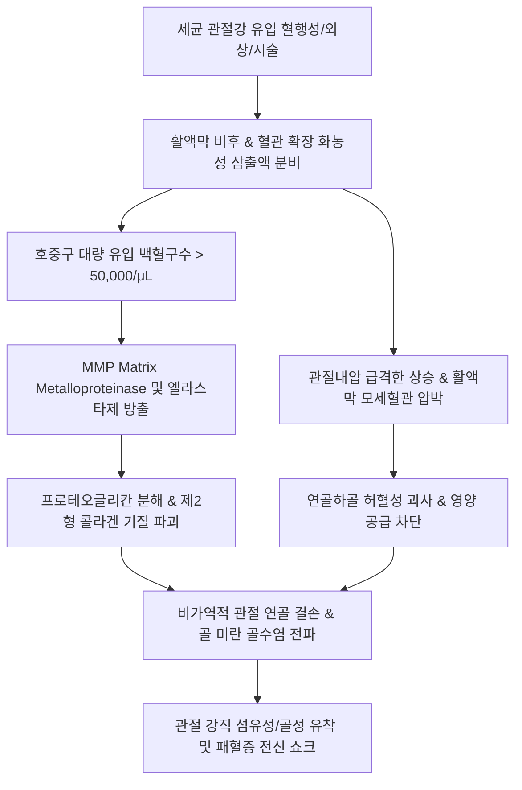

# 🩺 감염성 관절염 (Infectious Arthritis / Septic Arthritis)

> **핵심 3줄 요약 (Key Summary)**:
> - 📍 **병소 부위 & 해부·병태생리**: 주로 단일 대관절(슬관절 50% 이상, 고관절, 견관절)의 관절강(synovial cavity) 내로 화농성 세균(*Staphylococcus aureus* 50~60%, *Streptococcus*, *Neisseria gonorrhoeae*)이 혈행성으로 전파되거나 직접 침투하여 활액막 염증과 급속한 연골 기질 파괴를 일으키는 정형외과적 응급 질환이다.
> - 🚩 **전형적 임상 양상**: 급격히 발생하는 극심한 단관절의 열감·발적·종창, 체중 부하 불능, 능동 및 수동 관절 가동 범위(ROM)의 심각한 제한, 고열 및 오한이 특징이다.
> - 🛠️ **핵심 검사 & 치료 전략**: 즉각적인 관절천자(Arthrocentesis)를 통한 활액 검사(백혈구수 > 50,000/μL, 중성구 비율 > 90%, 그람염색 및 배양)가 확진 기준이며, 경험적 정맥 항생제 투여와 신속한 관절강 세척·배농이 필수적이다. 한의 임상에서는 급성 화농기 관절강 자침이 절대 금기이며, 감염 완해 후 아급성 회복기 및 만성 후유증기(연골 손상·관절 구축)에 한해 침·뜸·한약 재활을 적용한다.
> - ⚠️ **응급 의뢰 레드플래그**: 급성 단관절 종창 환자에서 발열 동반, 관절 가동 시 극심한 통증으로 인한 완전한 체중 부하 불능, 패혈증 징후(빈맥, 저혈압, 빈호흡) 확인 시 일체의 국소 침습 시술을 중단하고 즉시 3차 응급의료센터로 전원한다.

---

## 📌 목차
1. [질환 개요 & 해부학적 병태생리](#1-질환-개요--해부학적-병태생리)
2. [병태생리 메커니즘 & 생체역학적 악순환 네트워크](#2-병태생리-메커니즘--생체역학적-악순환-네트워크)
3. [임상 증상 & 이학적 검사(Physical Exam) 알고리즘](#3-임상-증상--이학적-검사physical-exam-알고리즘)
4. [감별 진단 매트릭스 (Differential Diagnosis)](#4-감별-진단-매트릭스-differential-diagnosis)
5. [한의 통합 치료 프로토콜 (침·약침·추나·한약)](#5-한의-통합-치료-프로토콜-침약침추나한약)
6. [양방 치료 & 병용·의뢰 기준 (Conventional Treatment & Referral)](#6-양방-치료--병용의뢰-기준-conventional-treatment--referral)
7. [재활 운동 & 생활습관 티칭 가이드](#7-재활-운동--생활습관-티칭-가이드)
8. [💡 사용자 진료실 핵심 필기 & 임상 노하우 (Melt-In 잔여 심화 집약)](#8--사용자-진료실-핵심-필기--임상-노하우-melt-in-잔여-심화-집약)
9. [출처 및 학술 참고 문헌 (References)](#9-출처-및-학술-참고-문헌--references)

---

## 1. 질환 개요 & 해부학적 병태생리

감염성 관절염(Septic Arthritis, 化膿性關節炎)은 활액막으로 둘러싸인 관절강 내에 세균, 진균, 마이코박테리아, 또는 바이러스가 침범하여 활액막과 관절 연골에 급성 화농성 파괴를 유발하는 질환이다. 조기 진단과 적절한 배농 및 항생제 투여가 이루어지지 않을 경우 불과 24~48시간 이내에 비가역적인 관절 연골 소실과 골 파괴가 초래되어 영구적인 관절 기능 장애나 패혈증으로 진행할 수 있는 대표적인 근골격계 응급 질환이다.

![[감염성_관절염_01_슬관절낭및활액막해부구조도해.png]]
> [그림 1: ① 병태생리·해부 — Wikimedia Commons — File:Gray345.png (Gray's Anatomy Plate 345)]

### 해부학적 취약성과 침범 경로
1. **활액막의 구조적 특성**: 활액막(synovial membrane)은 혈류 공급이 매우 풍부하지만 기저막(basement membrane)이 결여되어 있어, 혈류 내에 존재하는 세균이 모세혈관벽을 쉽게 통과하여 관절강 내 활액으로 침투한다.
2. **침범 경로**:
   - **혈행성 파종(Hematogenous seeding, 가장 흔함 > 70%)**: 원격 감염소(피부 감염, 요로감염, 폐렴, 심내막염)에서 균이 혈류를 타고 활액막으로 유입.
   - **직접 접종(Direct inoculation)**: 관절강 내 주사 시술, 관절경 수술, 관통상 외상에 의한 오염.
   - **인접 조직 전파(Contiguous spread)**: 인접한 골수염(osteomyelitis), 화농성 활액낭염, 봉와직염의 관절강 내 파급.
3. **주요 원인균**:
   - 비임균성(Non-gonococcal): *Staphylococcus aureus*(메티실린 감수성/내성 MSSA/MRSA 포함, 약 50~60%), 연쇄구균(*Streptococcus spp.* 15~20%), 그람음성 간균(면역저하자, 고령자).
   - 임균성(Gonococcal): 성적으로 활동적인 젊은 성인에서 *Neisseria gonorrhoeae*에 의한 파종성 임균 감염(DGI).

---

## 2. 병태생리 메커니즘 & 생체역학적 악순환 네트워크

감염성 관절염에서 연골이 급속도로 파괴되는 핵심 기전은 세균 자체의 독소뿐만 아니라, 숙주의 호중구(Neutrophil)가 대거 침윤하면서 방출하는 단백분해효소(proteases)와 사이토카인의 연쇄 반응이다.

![[감염성_관절염_02_화농성감염관절천자흡인활액소견.png]]
> [그림 2: ② 관련 검체 영상 — Wikimedia Commons — File:SepticJointFluid.jpg]

### 병태생리 파괴 단계
1. **활액막 침착 및 증식 (0~24시간)**: 세균의 피브로넥틴 결합 단백(FnBP) 등이 연골 표면에 부착하고 독소를 분비하여 급성 활액막염을 유도한다.
2. **호중구 탈과립 및 연골 분해 (24~48시간)**: 활액 내로 침윤한 호중구가 활성산소종(ROS)과 MMPs(특히 MMP-1, MMP-13), 라이소자임을 방출하여 프로테오글리칸을 수일 내에 소실시킨다.
3. **관절내압 상승 및 허혈 (48시간 이후)**: 관절강 내에 농양(pus)이 가득 차면서 내압이 모세혈관 관류압을 초과하여 연골하 골수와 연골세포에 허혈성 괴사를 일으킨다.

---

## 3. 임상 증상 & 이학적 검사(Physical Exam) 알고리즘

### 임상 양상 (Clinical Presentation)
- **전형적 삼징후(Classic Triad)**: 관절통, 관절 종창, 발열(단, 고령자나 면역억제제 복용 환자의 30~40%는 발열이 없거나 미열에 그침).
- **관절 침범 부위**: 80~90%에서 단관절(monoarticular) 침범. 슬관절(50%), 고관절(20%), 견관절(8%), 족관절(7%), 완관절(5%) 순.
- **통증의 특징**: 환부를 만지거나 살짝 움직이기만 해도 자지러지는 듯한 극심한 안정통과 압통.
- **가동역 제한**: 능동적 움직임은 물론, 수동적 관절 굴곡·신전 모두 전 범위에서 심각한 통증과 근경련(muscle spasm)으로 인해 거의 완전 정지(pseudo-paralysis) 상태를 보임.

### 진단 검사 및 이학적 검사 알고리즘
1. **관절 부유 검사(Patellar Tap Test / Ballottement Test)**:
   - 슬개상낭(suprapatellar bursa)을 하방으로 압박한 상태에서 슬개골을 대퇴골 활차 방향으로 탭핑하여 관절강 내 대량 삼출액 유무를 확인한다.
2. **체온 및 전신 활력징후(V/S) 측정**:
   - 체온 > 38.3℃, 빈맥(HR > 90회/분), 저혈압(SBP < 90mmHg) 동반 시 전신 패혈성 쇼크 위험 평가.
3. **관절천자(Arthrocentesis, 최우선 표준 진단검사)**:
   - 의심 환자 발견 즉시 양방 응급실 또는 정형외과로 의뢰하여 관절액 흡인을 시행해야 한다.
   - **활액 성상 판정**:
     - 외관: 탁하고 불투명(opaque), 노란색~녹색의 고름 양상, 점도 현저히 감소.
     - 백혈구수(WBC count): 대개 > 50,000/μL (종종 > 100,000/μL), 중성구(PMN) 비율 > 90%.
     - 활액 당(glucose): 혈당 대비 50% 미만으로 현저히 감소.
     - 활액 젖산(lactate): 상승 (> 10 mmol/L).
     - 그람 염색 및 배양 검사: 50~70%에서 원인균 동정.

---

## 4. 감별 진단 매트릭스 (Differential Diagnosis)

| 감별 질환 | 호발 연령 / 부위 | 발병 양상 | 활액 분석 (WBC / 결정체) | 감별 핵심 포인트 (Discriminator) |
| :--- | :--- | :--- | :--- | :--- |
| **감염성 관절염 (Septic Arthritis)** | 전 연령 (고령·소아 고위험), 슬관절·고관절 | 수시간~수일 내 급성 | WBC > 50,000/μL (PMN > 90%), 배양 양성 | 수동 ROM 시 극심한 통증으로 완전 가동 불능, 화농성 삼출액 |
| **[[통풍성 관절염]] (Gout)** | 40~60대 남성, 제1 중족족지관절(엄지발가락) | 야간 돌발성 극심한 통증 | WBC 2,000~50,000/μL, **편광현미경 바늘모양 요산결정(MSU)** | 음성 복굴절 바늘형 결정, 고요산혈증, 음주·고기 섭취 후 유발 |
| **[[가성통풍]] (CPPD)** | 65세 이상 고령자, 슬관절·완관절 | 급성 단관절염 | WBC 2,000~50,000/μL, **마름모형 피로인산칼슘결정** | 양성 복굴절 능형 결정, 단순 X-ray 상 연골석회화증(chondrocalcinosis) |
| **[[류마티스 관절염]] (RA)** | 30~50대 여성, 완관절·MCP/PIP | 아급성·만성 대칭성 | WBC 5,000~25,000/μL, 무균성, RF/anti-CCP 양성 | 다발성 대칭성 소관절염, 1시간 이상의 조조강직, 전신 자가면역 소견 |
| **[[퇴행성 관절염]] 급성 악화 (OA)** | 60대 이상, 슬관절·고관절 | 만성적 진행 중 과사용 후 악화 | WBC < 2,000/μL (비염증성), 투명 황색 | 발열 없음, 운동 시 악화 및 휴식 시 완화, X-ray 관절강 협착·골극 |
| **슬관절 주위 [[봉와직염]] (Cellulitis)** | 전 연령, 하지 피부 | 피부 발적·종창 | 피부 연조직 감염, 관절강 내 삼출액 없음 | 관절 가동 자체는 보존(경미한 제한), 피부 표재성 열감·홍반 우세 |

---

## 5. 한의 통합 치료 프로토콜 (침·약침·추나·한약)

> 🚨 **임상 대원칙**: **급성 화농성 감염기에는 관절강 및 병소 주변 침습 시술(침, 약침, 사혈, 관절내 주입)이 절대 금기**이다. 무리한 자침은 감염을 악화시키거나 2차 균혈증을 유발할 수 있다.
> 본 프로토콜은 **양방 정형외과/감염내과에서 항생제 치료 및 배농이 완료되어 감염 지표(CRP, ESR, 체온, 활액 배양 음성)가 정상화된 후, 아급성 회복기 및 만성 후유증기(관절 강직, 연골 손상, 위축된 근력 회복)** 환자를 대상으로 한다.

![[감염성_관절염_05_침구치료하지및슬관절주위혈위도해.png]]
> [그림 3: ③ 치료·시술점 — Wikimedia Commons — File:Acu-moxa chart; Channels and acupoints of the leg and foot Wellcome L0037972.jpg (CC BY 4.0)]

### 1) 침구 치료 (회복기 관절 유착 방지 및 근위축 개선)
- **주요 혈위**:
  - [[독비]](ST35) & 내[[슬안]](EX-LE4): 슬개골 하연 내외측 함요처로 슬관절강 주변 혈행 개선 및 활액막 잔여 섬유화 완화.
  - [[양릉천]](GB34): 근회(筋會) 혈위로 비골두 전하방, 슬관절 주변 인대·건 유착 완화.
  - [[음릉천]](SP9): 비경의 합혈로 경골 내측과 하연, 관절 주위 잔여 부종 및 습사(濕邪) 배출.
  - [[족삼리]](ST36): 위경의 합혈, 대퇴사두근 건측·환측 활성화 및 전신 기혈 보강.
  - [[혈해]](SP10) & [[양구]](ST34): 슬개골 상연 대퇴사두근 내외측 연접부로 관절 가동역 회복 촉진.
- **전침 치료**: 양릉천-음릉천, 혈해-양구 간 2Hz 저주파 전침을 20분간 적용하여 대퇴사두근 위축을 방지하고 잔여 둔통을 완화.
- **온구 요법(Moxibustion)**: 감염이 완전히 박멸된 후 한습성 관절 냉통 및 굴신불리(屈伸不利)에 간접구(신기구) 적용.

### 2) 약침 치료 (염증 완해 후 조직 재생기)
- **적용 조건**: 혈액검사 상 CRP 정상화, 국소 발열 및 홍반 완전 소실 확인 후 시행.
- **제제 및 부위**:
  - **신바로약침**: 슬관절낭 외측 연부조직 및 대퇴사두근건 부착부에 0.5~1.0cc 분할 주입하여 연골하골 미세염증 억제 및 보호.
  - **자하거약침(Hominis Placenta)**: 만성기 연골 마모 및 극심한 기혈 허약 상태에서 관절 주변 인대 강화 목적으로 0.5cc 주입.

### 3) 추나요법 (Chuna Manual Therapy)
- **관절 신연 기법(Traction)**: 슬관절 관절강 내 압박을 줄이고 관절면 간격을 확보하는 축성 신연(long-axis traction).
- **수동적 관절 가동술(Passive Mobilization)**: 감염 후 발생한 관절낭 섬유성 유착을 서서히 박리하기 위한 Maitland Grade I~II의 부드러운 전후방 활주(AP gliding).
- **대퇴사두근 근막 이완(Myofascial Release)**: 장기간의 고정(immobilization)으로 단축된 대퇴직근, 내측광근, 햄스트링 이완.

### 4) 한약 치료 (변증별 방제)
- **아급성 여독형(餘毒未淸型)**: 감염은 조절되었으나 관절 주위 미열감과 경미한 부종이 잔존할 때.
  - [[오적산]](五積散) 가 [[금은화]], [[포공영]], [[토복령]] — 잔여 습열 독소 배출 및 기혈 순환.
- **풍한습비형(風寒濕痺型)**: 기후 변화에 따라 관절이 쑤시고 묵직하며 굴신이 어려운 만성 후유기.
  - [[대방풍탕]](大防風湯) 또는 [[당귀점통탕]](當歸拈痛湯) — 부정거사(扶正祛邪), 거풍제습(祛風除濕) 및 관절 기능 복원.
- **기혈양허·간신부족형(氣血兩虛·肝腎不足型)**: 장기 투병으로 근육이 마르고 골다공증성 변화가 동반된 경우.
  - [[독활기생탕]](獨活寄生湯) 또는 삼기음(三氣飲) — 보간신(補肝腎), 강근골(强筋骨), 익기혈(益氣血).

---

## 6. 양방 치료 & 병용·의뢰 기준 (Conventional Treatment & Referral)

### 1) 표준 양방 치료 (Standard Conventional Management)
- **경험적 정맥 항생제 (Empiric IV Antibiotics)**:
  - 그람양성균(MSSA/MRSA 의심): Vancomycin (15~20mg/kg q12h) 또는 Cefazolin (2g q8h IV).
  - 그람음성균 위험군: 3세대 Cephalosporin (Ceftriaxone 2g qd IV) 병용.
  - 배양 검사 및 항생제 감수성 결과에 따라 표적 항생제로 변경하며, 총 투여 기간은 보통 3~4주(정맥 투여 2주 후 경구 전환).
- **관절강 배농 및 세척 (Joint Drainage & Lavage)**:
  - 매일 반복적인 관절강 침 흡인(needle aspiration) 또는
  - 관절경적 세척술(Arthroscopic debridement & lavage, 슬관절에서 흔히 선호).
  - 고관절이나 소아, 다방성 농양(loculated effusion)인 경우 조기 관절절개 배농술(Open arthrotomy) 시행.

### 2) 한의 병용 판단 및 상호작용
- **급성기 병용 금기**: 정맥 항생제 투여 및 배농이 진행되는 급성기에는 어떠한 침습적 한의 시술도 관절 부위에 시행하지 않는다.
- **아급성기 병용 이점**: 항생제 치료 종료 후 잔여 관절 강직과 운동장애에 침·추나·한약 복용을 병용하면 관절 가동역 회복 속도를 현저히 높이고 조기 일상 복귀를 돕는다.
- **항생제 복용 중 한약 투여**: 장기 광범위 항생제 사용으로 인한 항생제 연관 설사(AAD)나 위장관 장애 발생 시 곽향정기산이나 삼령백출산 병용 고려 가능.

### 3) 양방·전문과 응급 전원 기준 (Immediate Emergency Referral)
- **무조건 즉시 전원 트리거**:
  1. 단관절의 급성 열감·종창·극심한 동통과 함께 38℃ 이상의 발열이 확인될 때.
  2. 체중 부하가 불가능하고 수동적 미세 관절 움직임에도 극심한 통증과 방어성 근수축을 보일 때.
  3. 최근 관절 주사, 침 시술, 관절경 수술 후 수일~수주 내에 관절이 급격히 부어오를 때.
  4. 혈압 저하, 빈맥, 의식 혼미 등 패혈증(Sepsis) 의심 징후 동반 시.

---

## 7. 재활 운동 & 생활습관 티칭 가이드

### 1) 급성기 안정 및 부목 고정 (Acute Immobilization)
- 감염 초기 관절 연골에 가해지는 전단력을 방지하기 위해 48~72시간 동안 단기 부목(splint)으로 안정 유지.

### 2) 아급성기 등장성/등척성 근력 운동 (Subacute Isometric Exercise)
- 통증과 염증이 가라앉은 즉시 대퇴사두근 등척성 수축 운동(Quadriceps Setting Exercise, Q-setting):
  - 무릎 뒤에 수건을 말아 넣고 바닥 방향으로 지그시 5초간 누르기, 15회씩 3세트.
- 하지 직거상 운동(Straight Leg Raise, SLR): 관절 연골에 체중 부하를 주지 않으면서 대퇴근육 활성화.

### 3) 만성기 점진적 가동역 운동 및 수중 운동
- 관절낭 섬유화 방지를 위한 부드러운 능동-보조 관절 가동 운동(AAROM).
- 관절 부하를 최소화하면서 유산소 근력을 회복할 수 있는 수영 및 수중 에어로빅 권장.

---

## 8. 💡 사용자 진료실 핵심 필기 & 임상 노하우 (Melt-In 잔여 심화 집약)

1. **감별의 골든타임(Golden Time)**:
   - 통풍 환자가 관절이 부어 내원했을 때, "원래 통풍이 있어요"라는 말을 맹신하면 안 된다. 통풍 관절염과 감염성 관절염은 공존할 수 있으며(동시 발생률 약 1.5~5%), 감염성 관절염을 통풍으로 오인해 스테로이드나 NSAIDs만 투여할 경우 48시간 내 관절 연골이 녹아내려 인공관절 수술로 이어지는 참사가 발생한다.
2. **관절 가동성(ROM) 검사의 임상 팁**:
   - 통풍이나 관절염은 극심한 통증 속에서도 환자가 어느 정도의 미세 굴곡을 허용하지만, 감염성 관절염은 검사자가 손을 대고 1~2도만 움직이려 해도 비명을 지르며 완전히 경직된다(Spasm-locked joint). 이 소견 하나만으로도 즉시 응급실로 보내야 한다.
3. **침 시술 부위의 발적 감별**:
   - 한의원에서 무릎 통증으로 침을 맞던 환자가 다음 날 무릎이 부었다고 올 경우, 단순 침 반응(국소 멍, 피하 혈종)인지 관절강 내 감염인지를 확인해야 한다. 피부 표재성 발열·발적에 그치고 능동 ROM이 보존되면 표재성 봉와직염 또는 단순 염증 반응이나, 심부 관절 내 팽만감과 ROM 완전 제한이 있으면 즉시 천자 의뢰를 진행한다.

---

## 9. 출처 및 학술 참고 문헌 (References)

1. **Margaretten ME, et al. (2007)**. Does this adult patient have septic arthritis? *JAMA*, 297(13):1478-1488. [PMID: 17405973](https://pubmed.ncbi.nlm.nih.gov/17405973/)

2. **Mathews CJ, et al. (2010)**. Bacterial septic arthritis in adults. *The Lancet*, 375(9717):846-855. [PMID: 20206778](https://pubmed.ncbi.nlm.nih.gov/20206778/)

3. **Ross JJ. (2017)**. Septic Arthritis of Native Joints. *Infectious Disease Clinics of North America*, 31(2):203-218. [PMID: 28366221](https://pubmed.ncbi.nlm.nih.gov/28366221/)

---

## 관련 노트

- [[퇴행성 관절염]]
- [[통풍성 관절염]]
- [[류마티스 관절염]]
- [[가성통풍]]
- [[봉와직염]]
- [[반월상 연골판 파열]]
