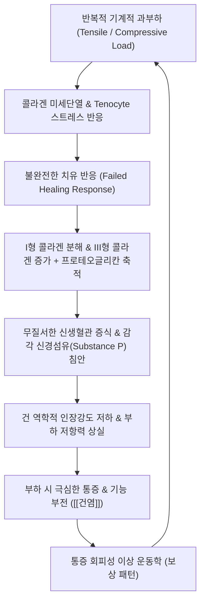

# 🩺 [[건염]] (Tendinitis / Tendinopathy / 腱炎, M77.9 / ICD-10)

> **핵심 3줄 요약 (Key Summary)**:
> - 📍 병소 부위 & 해부·병태생리: 근육과 골격을 잇는 건(Tendon) 및 건-골 부착부([[골격계|Enthesis]]), 기계적 과부하에 따른 콜라겐 섬유 불연속, 점액성 퇴행, 건실질 내 신생혈관 증식([[아킬레스건]], [[극상근]], [[상완이두근]], [[슬개건]]).
> - 🚩 전형적 임상 양상 & 3대 징후: 부하 시 국소 통증(Load-related localized pain), 건 부착부의 예리한 압통, 아침 기상 시 뻣뻣함(Morning stiffness) 및 초기 활동 후 호전 후 과사용 시 악화.
> - 🛠️ 핵심 감별 검사 & 한·양방 다각적 치료 전략: 저항성 수축 및 수동 신장 검사([[스피드 검사]], [[야가손 검사]], [[핀켈스타인 검사]]), 건 주변 침·전침·약침([[봉독약침]]) 및 편심성 부하 운동(Eccentric exercise).
> - ⚠️ 응급 의뢰 레드플래그 & 악화 요인: 건의 완전 파열(갑작스러운 뚝 소리와 함께 관절 운동 소실), 국소 발적·열감·고열 동반 시 화농성 감염, 불필요한 건 실질 내 스테로이드 직접 주사로 인한 건 괴사 위험.

---

## 📌 목차
1. [질환 개요 & 해부학적 병태생리](#1-질환-개요--해부학적-병태생리)
2. [병태생리 메커니즘 & 생체역학적 악순환 네트워크](#2-병태생리-메커니즘--생체역학적-악순환-네트워크)
3. [임상 증상 & 이학적 검사(Physical Exam) 알고리즘](#3-임상-증상--이학적-검사physical-exam-알고리즘)
4. [감별 진단 매트릭스 (Differential Diagnosis)](#4-감별-진단-매트릭스-differential-diagnosis)
5. [한의 통합 치료 프로토콜 (침·약침·추나·한약)](#5-한의-통합-치료-프로토콜-침약침추나한약)
6. [양방 치료 & 병용·의뢰 기준 (Conventional Treatment & Referral)](#6-양방-치료--병용의뢰-기준-conventional-treatment--referral)
7. [재활 운동 & 생활습관 티칭 가이드](#7-재활-운동--생활습관-티칭-가이드)
8. [💡 사용자 진료실 핵심 필기 & 임상 노하우 (Melt-In 잔여 심화 집약)](#8--사용자-진료실-핵심-필기--임상-노하우-melt-in-잔여-심화-집약)
9. [출처 및 학술 참고 문헌 (References)](#9-출처-및-학술-참고-문헌-references)

---

## 1. 질환 개요 & 해부학적 병태생리

![[건염_01_환부실사_슬개건염.jpg|450]]
> [그림 1: ① 환부 실사 — 슬개건 부착부(경골조면 상방)의 국소 종창 및 압통 부위 — Wikimedia Commons (CC BY-SA 4.0)]

![[건염_01_영상소견_석회성건염_Xray.jpg|450]]
> [그림 2: ② 영상 소견(X-ray) — 견관절 극상근건 부착부의 석회 침착성 건병증 소견 — Wikimedia Commons (CC BY 4.0)]

![[슬개건병증_초음파_소견.jpg|450]]
> [그림 3: ② 영상 소견(초음파) — 건실질의 저에코성 비후(Hypoechoic thickening) 및 혈류 증가 소견 — Simbio Vault Archive]

* **질환 정의 및 명칭의 현대적 변천**:
  * 과거에는 건에 발생한 통증을 단순 염증성 질환으로 보아 **건염(Tendinitis)**이라 칭하였으나, 현대 조직병리학적 연구에 따르면 만성 건 질환의 대다수는 염증 세포의 침윤보다는 건세포(Tenocyte)의 변성, I형 콜라겐의 분해 및 비정상적인 III형 콜라겐으로의 대체, 무형질 기질(Ground substance)의 점액성 팽윤을 동반하는 퇴행성 병변임이 밝혀졌습니다. 이에 따라 현대 의학에서는 이를 포괄하여 **건병증(Tendinopathy)**으로 통칭합니다.
  * 호발 부위는 반복적인 인장력(Tensile load) 및 마찰을 받는 [[아킬레스건]], [[슬개건]], 회전근개의 [[극상근]] 건, 상완골 외측상과 부착부(테니스 엘보), [[상완이두근]] 장두건 등입니다.
* **호발 역학 및 소인**:
  * 스포츠 선수(달리기, 점프, 투구 종목)뿐만 아니라 반복적인 수작업을 수행하는 생산직·사무직 근로자, 그리고 건의 탄력성과 혈류 공급이 감소하는 40대 이상의 중장년층에서 호발합니다.
  * 당뇨병, 비만, 고지혈증, 통풍 등 전신 대사성 질환 및 플루오로퀴놀론계([[퀴놀론계 항생제]]) 복용력은 건 변성을 촉진하는 주요 전신성 위험 인자입니다.
* **관련 해부학적 구조물**:
  * **골격 및 관절**: 건이 뼈에 단단히 고정되는 골-건 부착부(Enthesis)는 샤피 섬유(Sharpey's fibers)와 섬유연골 이행대를 거치며, 기계적 응력이 가장 집중되는 취약 구역입니다.
  * **근육 및 건막**: 근복(Muscle belly)에서 시작된 힘줄은 근건접합부(Myotendinous junction, MTJ)를 지나 관절을 가로지르며, 마찰이 큰 부위에는 건초(Tendon sheath)와 [[윤활낭염|활액낭(Bursa)]]이 위치합니다.
  * **신경 및 혈관망**: 건 실질은 본래 혈관 분포가 매우 희소한 저혈행성 조직(Bradytrophic tissue)으로, 대사율이 낮아 손상 후 회복 속도가 인접 근육에 비해 현저히 느립니다. 병리적 상태에서는 통증 유발 자유신경종말을 동반한 무질서한 신생혈관(Neovascularization)이 증식합니다.

---

## 2. 병태생리 메커니즘 & 생체역학적 악순환 네트워크

![[건염_02_해부도해_건염병태.png|450]]
> [그림 4: ③ 관련 해부학적 구조물 / 건-골 부착부(Enthesis) 및 미세손상 병태 도해 — Smart-Servier (CC BY-SA 3.0)]

### 1) 건병증 연속체 모델 (Continuum Model of Tendinopathy)
* Cook과 Purdam의 연속체 모델(Cook JL, et al. 2016)에 따르면 건병증은 세 단계의 스펙트럼으로 진행합니다:
  * **1단계: 반응성 건병증(Reactive Tendinopathy)** — 급격한 과부하에 대한 비염증성 적응 증식 반응으로, 건세포 활성화와 프로테오글리칸 증가로 단기적 건 비후가 발생합니다. 가역적 단계입니다.
  * **2단계: 건 부전/이상반응(Tendon Disrepair)** — 부하가 지속되어 콜라겐 기질의 분리가 심화되고 세포외 기질의 무질서화가 시작되는 단계입니다.
  * **3단계: 퇴행성 건병증(Degenerative Tendinopathy)** — 건세포의 광범위한 고사(Apoptosis), 무혈관 부위의 세포외 기질 붕괴, 불규칙한 신생혈관 및 감각 신경 침범이 고착화되어 건 파열의 위험이 급증하는 비가역적 단계입니다.

### 2) 생체역학적 연쇄 반응 (Kinetic Chain) 및 국소 허혈
* 단축되거나 과긴장된 주동근([[비복근]], [[대퇴사두근]], 회전근개 근육군)은 건 부착부에 지속적인 정적 장력(Static tension)을 가합니다.
* 관절 가동성 제한(예: 족관절 배굴 제한으로 인한 아킬레스건 과부하, 흉추 후만으로 인한 견봉하 공간 협착)은 건의 활주 공간을 침범하여 압박성 마찰력을 가중시킵니다.

---

## 3. 임상 증상 & 이학적 검사(Physical Exam) 알고리즘

### 1) 전형적 주소증 및 임상 단계
* **부하 의존적 국소 통증 (Load-related pain)**:
  * 휴식 시에는 통증이 경미하나, 해당 건에 장력이 걸리는 동작(계단 오르내리기, 달리기, 물건 들어올리기) 시 날카로운 국소 통증이 유발됩니다.
* **워밍업 현상 (Warm-up phenomenon)**:
  * 운동 초반에는 뻣뻣하고 아프다가 활동을 지속하면 일시적으로 통증이 경감되나, 운동이 끝난 후 휴식기나 다음 날 아침에 통증이 현저히 악화되는 특징적인 양상을 보입니다.
* **국소 압통 및 건 비후**:
  * 건 실질 또는 골 부착부를 직접 촉진 시 명확한 압통(Well-localized tenderness)이 확인되며, 만성 환자에서는 건이 굵어지거나 딱딱한 결절이 만져집니다.

### 2) 필수 이학적 검사법 (Physical Examination)

![[스피드검사_3단계_결절간구_상완이두근장두건_통증평가.jpg|420]]
> [그림 5: ④ 이학적 검사 시연 — 상완이두근 장두건염 평가를 위한 스피드 검사(Speed's test) 시행 — Simbio Vault Archive]

* [[스피드 검사]] (Speed's Test):
  * **검사 목적**: 상완이두근 장두건염 및 건초염 감별.
  * **방법**: 환자의 주관절을 신전, 전완을 회와위(Supination)로 둔 상태에서 견관절을 90도 전방 굴곡시킬 때 검사자가 아래로 저항을 가합니다.
  * **양성 소견**: 결절간구(Bicipital groove) 부위의 통증 유발.
* [[핀켈스타인 검사]] (Finkelstein's Test):
  * **검사 목적**: 수근부 건초염(드퀘르벵 병) 감별.
  * **방법**: 엄지손가락을 쥐어 주먹을 쥔 후 손목을 척측으로 수동 편위(Ulnar deviation)시킵니다.
  * **양성 소견**: 요골 경상돌기 부착부(단무지신근, 장무지외전근)의 극심한 통증.
* **저항 수축 및 수동 신장 검사**:
  * 건 질환의 대원칙: 해당 근육의 **능동적 저항 수축(Resisted isometric contraction)** 시 통증 + 해당 근육의 **최대 수동 신장(Passive stretching)** 시 통증이 동시에 일치하면 건의 병변으로 확진합니다.

---

## 4. 감별 진단 매트릭스 (Differential Diagnosis)

| 감별 질환 | 호발 병소 및 병태원인 | 주소증 및 통증 특징 | 감별 핵심 소견 & 이학적 검사 |
| :--- | :--- | :--- | :--- |
| **[[건염]] / [[건병증]] (본 질환)** | 건 실질 및 부착부, 기계적 미세손상 및 퇴행 | 부하 시 국소 통증, 워밍업 현상, 아침 뻣뻣함 | 저항 수축 시 국소 통증, 명확한 국소 압통, 초음파상 건 비후 |
| **[[점액낭염]] (Bursitis)** | 활액낭(견봉하, 전자부, 후종골 등), 마찰/감염 | 야간통 극심, 능동/수동 관절 운동 전반의 호선 통증 | 건 저항 수축 시 무통, 활액낭 직접 압박 시 통증 극대화 |
| **[[건초염]] (Tenosynovitis)** | 건을 둘러싼 활액건초의 활액막염 | 활주 시 마찰음(Crepitus), 건 주행을 따른 선상 부종 | 건 주행 경로 전체의 붓기, 활주 시 염발음 |
| **건 완전 파열 (Tendon Rupture)** | 퇴행성 건의 급격한 과부하 단열 | 순간적인 팝(Pop) 소리, 급성 무력증, 관절 운동 상실 | 결손부 함몰(Palpable gap), 톰슨 검사(Thompson test) 양성 |
| **[[감염성 관절염]] (Septic Arthritis)** | 관절강 내 세균 감염 (응급 레드플래그) | 관절 전반의 극심한 박동성 통증, 고열, 오한 | 관절 내 다량 삼출액, 능동·수동 운동 완전 불가능 |
| **[[피로골절]] (Stress Fracture)** | 골피질의 반복 부하 미세단열 | 체중 부하 시 깊고 둔한 통증, 야간통 | 뼈를 누르는 골 압통, 튜닝포크(소리굽쇠) 진동 검사 양성 |

---

## 5. 한의 통합 치료 프로토콜 (침·약침·추나·한약)

![[요추추간판탈출증_05_침치료실사.jpg|400]]
> [그림 6: ⑤ 한의 술기 실사 — 건 부착부 및 연계 근복 TP 전침·침도 치료 시술 실사 — Simbio Vault Archive]

![[좌골대퇴충돌증후군_초음파유도_주사_시술도.png|400]]
> [그림 7: ⑥ 초음파 유도 시술 실사 — 초음파 유도하 건초 및 건 주변부 정밀 약침 주입 도해 — Simbio Vault Archive]

* **침구 및 침도 치료 (Acupuncture & Acupotomy)**:
  * **건 주변 자침(Peri-tendinous needling)**: 건 실질 내의 직접 손상을 피하고 건초 및 건 주변 지대(Paratenon)를 목표로 0.25~0.30mm 호침을 빗각으로 자침합니다. 국소 미세혈류 순환을 촉진하고 섬유아세포를 자극하여 콜라겐 합성을 유도합니다(Cox J, et al. 2016).
  * **근복 트리거포인트([[TP]]) 해소**: 건에 가해지는 만성 인장력을 줄이기 위해 해당 건과 연결된 상위 근복(예: 아킬레스건염 시 비복근/가자미근 TP, 테니스 엘보 시 요측수근신근 TP)에 전침(2Hz 저주파)을 적용하여 근긴장도를 떨어뜨립니다.
  * **만성 유착부 침도 치료**: 만성 섬유화 및 석회화가 진행된 건 부착부의 병리적 유착을 소침도로 미세 절개하여 감압 및 신생 조직 재생 반응을 유도합니다.
* **약침 치료 (Pharmacopuncture)**:
  * **[[봉독약침]] (Bee Venom)**: 멜리틴 성분의 강력한 소염진통 작용 및 미세순환 증진을 위해 건 주변 혈위(0.1~0.2cc)에 분할 주입합니다.
  * **[[중성어혈약침]] / 자하거약침**: 퇴행성 변화가 주된 만성 건병증에는 조직 재생과 영양 공급을 위해 자하거 약침을 건 부착부 심부에 시술합니다.
* **추나 요법 (Chuna Manipulation)**:
  * **근막 이완 기법 (Myofascial Release)**: 단축된 근막경선과 건초 사이의 글라이딩 장애를 수기 신장으로 해소합니다.
  * **관절 가동 추나**: 건에 가해지는 비정상적 전단력을 분산시키기 위해 인접 관절(거퇴관절, 견갑흉곽관절, 완관절)의 정렬을 바로잡습니다.
* **한약 치료 (Herbal Medicine)**:
  * **급성기 어혈 습열형**: 국소 열감과 부종이 동반될 때 [[당귀점통탕]], [[오약순기산]], [[대호경근탕]]을 투여하여 미세순환을 촉진하고 염증성 부종을 흡수합니다.
  * **만성기 간신부족·기혈어체형**: 장기화된 건 퇴행에는 근건을 강화하는 [[독활기생탕]], [[서경탕]], [[보양환오탕]]을 처방하여 건세포 대사 활성을 돕습니다.

---

## 6. 양방 치료 & 병용·의뢰 기준 (Conventional Treatment & Referral)

* **약물 치료 (Medication)**:
  * **NSAIDs 계열**: 이부프로펜, 나프록센, 세레콕시브(Celecoxib) 등 경구 소염진통제는 급성기 통증 완화에는 유효하나, 만성 건병증에서 장기 복용 시 건세포의 기질 합성 과정을 저해할 수 있어 1~2주 이내의 단기 사용이 권장됩니다.
* **비약물 시술 및 주사 치료 (Procedures)**:
  * **체외충격파 치료 (ESWT)**: 방사형(Radial) 또는 초점형(Focused) 충격파를 통해 건 부착부의 석회 분해와 혈류 공급을 유도합니다.
  * **국소 스테로이드 주사(CSI)**: 급성 통증 호전에는 탁월하나, 콜라겐 합성 억제 및 건세포 괴사를 유발하여 장기적으로 건 파열 위험을 급증시킵니다(Coombes BK, et al. 2010). 건 실질 내 직접 주입은 절대 금기이며, 활액낭염이 동반된 경우에 한해 초음파 유도하에 건 주위로 극소량 사용되어야 합니다.
  * **PRP (자가혈소판 풍부 혈장) 주사**: 건 치유 인자 분비를 촉진하는 재생 목적으로 활용됩니다.
* **수술적 치료 적응증 (Surgical Indication)**:
  * 최소 3~6개월 이상의 적극적인 보존적 치료(한의 치료, 운동 치료, 충격파 등)에도 불구하고 일상생활이 불가능할 정도의 통증과 기능 장애가 지속되는 경우, 관절경하 건 변성 부위 절제술(Debridement) 또는 건 재건술을 고려합니다.
* **한의 병용 판단 (Combination Therapy)**:
  * **병용 가능**: 급성 통증 조절을 위한 단기 NSAIDs 복용 중 침·약침 병용은 통증 완화 시너지를 내며 안전합니다.
  * **주의 및 모니터링**: 국소 스테로이드 주사를 최근 4주 이내에 맞은 환자는 건 조직이 매우 취약해져 있으므로, 해당 부위에 강한 수기 자침이나 깊은 침도 시술, 과도한 강도의 도수치료를 피하고 완만한 물리요법과 침치료 위주로 접근합니다.
* **양방·전문과 의뢰 기준 (Referral Criteria)**:
  * **즉시 정형외과 응급 의뢰**: 뚝 소리와 함께 건이 함몰되고 족저굴곡이나 관절 거상이 완전히 소실된 건 급성 파열 의심 소견.
  * **감염 의뢰**: 국소 발적, 열감, 급격한 종창과 함께 체온 상승이 동반되어 화농성 건초염이나 화농성 관절낭염이 의심될 때.

---

## 7. 재활 운동 & 생활습관 티칭 가이드

![[건염_07_재활운동_편심성신장.png|400]]
> [그림 8: ⑦ 재활 운동 실사 — 건 재형성을 촉진하는 편심성 수축(Eccentric contraction) 부하 운동 — Wikimedia Commons (CC BY-SA 3.0)]

* **편심성 부하 운동 (Eccentric Loading Exercise — Alfredson Protocol)**:
  * 건병증 재활의 핵심 표준입니다. 근육이 늘어나면서 힘을 쓰는 편심성 수축 운동은 건 섬유에 적절한 기계적 장력을 전달하여 정상적인 I형 콜라겐 배열과 리모델링을 촉진합니다.
  * 예: 아킬레스건병증 환자의 경우 계단 끝에 발 앞부분만 딛고 뒤꿈치를 천천히 내리는 동작(Heel drop)을 하루 180회(3세트×15회, 아침/저녁) 실시합니다.
* **등척성 운동 (Isometric Exercise)**:
  * 초기 급성 통증기에는 관절 각도를 고정한 상태에서 45초간 유지하는 등척성 부하 운동(Isometric hold)을 시행하여 통증 억제 기전(Cortical inhibition 완화)을 작동시킵니다.
* **생활습관 및 부하 관리 (Load Management)**:
  * **완전한 침상 안정(Complete rest)은 금기**: 건은 부하를 받지 않으면 오히려 인장강도가 약화되므로, 통증 점수(VAS) 3~4점 이내의 조절된 부하(Optimal loading)를 유지해야 합니다.
  * 급성기 냉찜질(10~15분), 만성기 온찜질 및 족욕.
  * 딱딱한 신발이나 하이힐 착용을 제한하고 뒤꿈치 힐 리프트 패드를 활용하여 아킬레스건의 정적 긴장도를 경감합니다.

---

## 8. 💡 사용자 진료실 핵심 필기 & 임상 노하우 (Melt-In 잔여 심화 집약)

> 🛡️ **Melt-In 원칙**: 기존 스텁의 빈 뼈대를 상부 섹션에 완전 수용하고, 본 섹션에는 원장님의 실전 진료실 노하우를 집약합니다.

* **실전 문진 & 진찰 체크리스트**:
  * 1. **"아침 첫 발을 디딜 때나 첫 동작 시 뻣뻣한가요?"** $\rightarrow$ 전형적인 퇴행성 건병증의 기상 직후 뻣뻣함 확인.
  * 2. **"조금 움직이면 부드러워지다가 운동 후 집에 오면 더 아픈가요?"** $\rightarrow$ 워밍업 현상 및 지연성 통증 여부 확인.
  * 3. **"최근 3개월 내에 뼈주사(스테로이드)를 맞으신 적이 있나요?"** $\rightarrow$ 건 파열 위험군 스크리닝 및 침도/강자침 금기 설정.
* **치료 순서 및 손맛 노하우**:
  * **원위부 근복 긴장 먼저 해제**: 아킬레스건이나 슬개건 자체를 먼저 강자극하면 반사성 근수축으로 오히려 건에 장력이 심해집니다. 반드시 비복근, 가자미근, 대퇴사두근의 근복 TP에 호침과 온침을 시술하여 근육 긴장을 완전히 푼 뒤, 마지막에 건초 주변에 세침으로 가볍게 자침합니다.
  * **약침 주입 깊이 조절**: 건 실질은 저항이 매우 커 약액이 잘 들어가지 않으며 강제로 밀어 넣으면 미세 파열을 유발할 수 있습니다. 바늘 끝이 건 실질에 닿았을 때 느껴지는 단단한 저항감에서 살짝 1mm 후퇴하여, 건초와 건 주위 활주 공간(Paratenon space)에 약액이 퍼지도록 주입해야 통증이 적고 효과가 빠릅니다.
* **환자 티칭 스크립트**:
  * "환자분, 이 힘줄은 고무줄과 같아서 염증약을 먹는다고 하루아침에 낮지 않습니다. 고무줄이 헐거워져 낡았기 때문에, 서서히 힘을 주는 특수 운동(편심성 운동)을 통해 새 살이 차오르도록 6주에서 12주간 꾸준히 운동과 침 치료를 병행해야 재발하지 않습니다."

---

## 9. 출처 및 학술 참고 문헌 (References)

1. **대한정형외과학회**. (2020). *정형외과학 제8판*. 최신의학사.
2. **Cook JL, et al**. (2016). Revisiting the continuum model of tendon pathology: what is its merit in clinical practice and research? *Br J Sports Med*, 50(19):1187-1191. [PMID 27127294](https://pubmed.ncbi.nlm.nih.gov/27127294/)
   - **[연구 요약]**: 건병증을 반응성, 건 부전, 퇴행성의 3단계 연속체 모델로 체계화하여 임상적 부하 관리 및 치료 방향을 제시한 핵심 종설.
3. **Coombes BK, et al**. (2010). Efficacy and safety of corticosteroid injections and other injections for management of tendinopathy: a systematic review of randomised controlled trials. *Lancet*, 376(9754):1751-1767. [PMID 20970844](https://pubmed.ncbi.nlm.nih.gov/20970844/)
   - **[연구 요약]**: 스테로이드 주사가 단기 통증 완화에는 우수하나 장기적으로는 건 파열 및 재발률을 높이고 생체역학적 회복을 방해함을 대규모 무작위 대조 시험(RCT) 메타분석으로 규명.
4. **Cox J, et al**. (2016). Effectiveness of Acupuncture Therapies to Manage Musculoskeletal Disorders of the Extremities: A Systematic Review. *J Orthop Sports Phys Ther*, 46(6):409-429. [PMID 27117725](https://pubmed.ncbi.nlm.nih.gov/27117725/)
   - **[연구 요약]**: 사지 관절의 건병증 및 근골격계 질환에 대한 침구 치료의 임상적 유효성 및 통증 경감 효과를 검증한 체계적 문헌고찰.
5. **Aicale R, et al**. (2020). Management of Achilles and patellar tendinopathy: what we know, what we can do. *J Foot Ankle Res*, 13(1):59. [PMID 32993702](https://pubmed.ncbi.nlm.nih.gov/32993702/)
   - **[연구 요약]**: 아킬레스건 및 슬개건병증의 최신 보존적 치료 지침 및 편심성 운동, 비침습적 중재술의 효과를 집대성한 종설.

---

## 관련 노트

- [[건초염]]
- [[아킬레스건]]
- [[극상근]]
- [[상완이두근]]
- [[슬개건]]
- [[스피드 검사]]
- [[야가손 검사]]
- [[핀켈스타인 검사]]
- [[봉독약침]]
- [[중성어혈약침]]
- [[점액낭염]]
- [[감염성 관절염]]
- [[골격계]]
- [[비복근]]
- [[대퇴사두근]]
