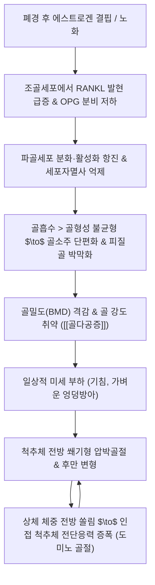

# 🩺 [[골다공증]] (Osteoporosis / 骨多孔症, ICD-10 M80 / M81)

> **핵심 3줄 요약 (Key Summary)**:
> - 📍 병소 부위 & 해부·병태생리: 전신 해면골(Trabecular bone) 및 피질골(Cortical bone)의 미세구조 파괴와 골량 소실로 골 강도가 급격히 취약해지는 전신 골격계 질환으로, 에스트로겐 결핍 및 노화에 따른 파골세포(RANKL 경로 항진)의 골 흡수가 조골세포(OPG 분비 저하)의 골 형성을 초과하여 발생.
> - 🚩 전형적 임상 양상 & 3대 징후: 골절 발생 전까지 무증상의 잠복 진행(Silent Killer), 경미한 외상(낙상, 엉덩방아, 기침) 후 발생하는 극심한 흉요추 이행부 급성 둔통, 점진적인 신장 단축(키 감소 >4cm) 및 흉추 후만 변형(Dowager's hump).
> - 🛠️ 핵심 감별 검사 & 한·양방 다각적 치료 전략: 이중에너지 X선 흡수계측법(DEXA) T-score 판정(T $\le$ -2.5 확진), 척추 단순 방사선(X-ray 척추체 설상 압박 변형), 양방 표준 골흡수억제제(비스포스포네이트, 데노수맙) 및 골형성촉진제(테리파라타이드), 한의 신주골(腎主骨) 기반 보신장골·자음강화([[독활기생탕]], [[좌귀환]], [[녹용]], [[두충]], [[속단]], [[음양곽]]) 및 체중부하 저항 운동 티칭.
> - ⚠️ 응급 의뢰 레드플래그 & 악화 요인: 대퇴골 경부 골절(1년 내 사망률 20%의 치명적 합병증), 척추 압박골절 후 마미 증후군(대소변 장애, 안장 부위 감각 소실), 고령자 낙상 후 보행 불능.

---

## 📌 목차
1. [질환 개요 & 해부학적 병태생리](#1-질환-개요--해부학적-병태생리)
2. [병태생리 메커니즘 & 생체역학적 악순환 네트워크](#2-병태생리-메커니즘--생체역학적-악순환-네트워크)
3. [임상 증상 & 이학적 검사(Physical Exam) 알고리즘](#3-임상-증상--이학적-검사physical-exam-알고리즘)
4. [감별 진단 매트릭스 (Differential Diagnosis)](#4-감별-진단-매트릭스-differential-diagnosis)
5. [한의 통합 치료 프로토콜 (침·약침·추나·한약)](#5-한의-통합-치료-프로토콜-침약침추나한약)
6. [양방 치료 & 병용·의뢰 기준 (Conventional Treatment & Referral)](#6-양방-치료--병용의뢰-기준-conventional-treatment--referral)
7. [재활 운동 & 생활습관 티칭 가이드](#6-재활-운동--생활습관-티칭-가이드)
8. [💡 사용자 진료실 핵심 필기 & 임상 노하우 (Melt-In 잔여 심화 집약)](#7--사용자-진료실-핵심-필기--임상-노하우-melt-in-잔여-심화-집약)
9. [출처 및 학술 참고 문헌 (References)](#8-출처-및-학술-참고-문헌-references)

---

## 1. 질환 개요 & 해부학적 병태생리

![[골다공증_정상골_대_골다공증골_미세구조_비교도해.png|450]]
> [그림 1: 정상 여성과 골다공증 여성의 체형 변화 및 해면골 미세구조 비교. 골흡수 항진으로 골소주(Trabeculae) 두께가 얇아지고 다공성 결손이 발생하면서 척추 후만증과 신장 단축이 초래된다.]

* **질환 정의 및 분류**:
  * **정의**: 골량(Bone mass)의 현저한 감소와 뼈 미세구조(Microarchitecture)의 퇴행성 손상으로 인해 뼈가 취약해져 경미한 충격(자명성 낙상, 기침, 비틀림)에도 쉽게 골절이 발생하는 전신 골격 질환이다.
  * **분류**:
    * **원발성 골다공증**:
      * 제1형 (폐경 후 골다공증): 폐경 후 급격한 에스트로겐 결핍으로 해면골 소실이 피질골 소실보다 3배 빠르게 진행 (척추 및 원위 요골 골절 호발).
      * 제2형 (노인성 골다공증): 70세 이상 남녀에서 장관 칼슘 흡수 장애 및 조골세포 활성 저하로 피질골과 해면골이 균등하게 소실 (대퇴골 경부 및 골반 골절 호발).
    * **이차성 골다공증**: 글루코코르티코이드([[스테로이드]]) 장기 투여, [[갑상선 기능 항진증]], 부갑상선 기능 항진증, 만성 신부전, 장기 부동화.
* **관련 해부학적 구조물**:
  * **해면골(Trabecular/Cancellous bone)**: 척추체 내부, 대퇴골 전자부, 요골 원위부에 풍부하며 표면적이 넓어 대사 회전율이 높아 호르몬 결핍 시 가장 먼저 파괴된다.
  * **피질골(Cortical/Compact bone)**: 장골 간부(Diaphysis)를 둘러싸는 치밀한 외벽 구조물.
  * **인접 랜드마크**: 제12흉추-제1요추([[흉요추 이행부]]), 대퇴골 경부(Femoral neck), 요골 원위부 경상돌기.

---

## 2. 병태생리 메커니즘 & 생체역학적 악순환 네트워크

![[골다공증_척추압박골절_및_척추후만_병태도해.jpg|450]]
> [그림 2: 골다공증에 의한 척추 압박골절 병태도해. 정상 척추체(좌)와 비교하여 골량 소실로 척추 전방부가 쐐기형으로 압박 붕괴되면서(우) 척추 전만 소실 및 흉추 후만 곡선이 병적으로 증폭된다.]

### 1) 분자생물학적 기전: RANKL / RANK / OPG 축
* 조골세포 기질세포에서 분비되는 **RANKL**이 파골전구세포 표면의 **RANK** 수용체와 결합하면 NF-κB 경로가 활성화되어 성숙 파골세포로 분화하고 골 흡수를 개시한다.
* 정상 상태에서는 조골세포가 가용성 유인 수용체인 **OPG(Osteoprotegerin)**를 분비하여 RANKL을 중화하나, 에스트로겐이 고갈되면 OPG 생성이 급감하고 RANKL이 폭증하여 골소주가 관통·파괴된다.

### 2) 생체역학적 도미노 골절 연쇄 (Vertebral Domino Effect)
* 척추체의 전방 1/3은 압축 하중에 취약하다. 한 분절의 척추체 전방이 무너지면(Wedge fracture) 시상면 척추 균형이 무너지며 무게중심이 전방으로 이동한다.
* 이로 인해 굴곡 모멘트 암(Flexion moment arm)이 길어져 인접 분절에 가해지는 축성 하중이 2~3배 급증하게 되며, 추가 골절이 잇따르는 '도미노 압박골절' 악순환이 완성된다.

---

## 3. 임상 증상 & 이학적 검사(Physical Exam) 알고리즘

![[골다공증_골밀도검사_DEXA_Tscore_판독소견.jpg|450]]
> [그림 3: 대퇴골 근위부 이중에너지 X선 흡수계측법(DEXA) 판독 소견. 환자의 골밀도 측정치가 적색 영역(Osteoporosis, T-Score -2.8 이하)에 위치하여 중증 골다공증으로 확진된다.]

### 1) 주소증 및 골절 호발 패턴
* **침묵의 잠복기**: 골절이 발생하기 전까지는 어떠한 통증이나 관절 가동 제한도 없는 완전한 무증상 상태이다.
* **주요 3대 골절 호발 부위**:
  * **1) 척추 압박골절**: 무거운 물건을 들거나 기침 후 급격한 흉요추부 격통, 침상에서 체위 변경 시(뒤척일 때) 극심한 통증. 만성적으로는 신장 4cm 이상 감소 및 흉추 후만증(곱사등).
  * **2) 대퇴골 경부 골절**: 빙판길이나 욕실에서 미끄러진 뒤 서혜부 격통 및 보행 불능, 하지의 외회전·단축 기형.
  * **3) 원위 요골 골절(Colles 골절)**: 넘어질 때 손을 짚으면서 발생하는 손목의 포크형 변형(Dinner-fork deformity).

### 2) 필수 진단 검사 (DEXA T-Score 기준)
* **골밀도 검사(Dual-Energy X-ray Absorptiometry, DEXA)**: 요추(L1~L4) 및 대퇴골(Femur neck/total)을 측정하여 가장 낮은 수치를 채택한다.
  * **정상 (Normal)**: $T \ge -1.0$
  * **골감소증 (Osteopenia)**: $-2.5 < T < -1.0$ (생활습관 교정 및 칼슘·비타민 D 투여)
  * **골다공증 (Osteoporosis)**: $T \le -2.5$ (적극적 약물 치료 필수)
  * **중증 골다공증 (Severe Osteoporosis)**: $T \le -2.5$ + 비외상성 취약 골절 1개 이상 동반.
* **척추 방사선 검사(X-ray)**: 흉요추 측면 촬영을 통해 척추체 전방 높이가 후방에 비해 20% 이상 감소된 압박골절 여부를 확인한다.
* **이학적 척추 고타통 검사(Percussion Test)**: 환자의 척추 극돌기를 검사자의 주먹이나 타진기로 가볍게 두드렸을 때 국소적인 날카로운 압통이 유발되면 급성 압박골절을 즉각 의심한다.

---

## 4. 감별 진단 매트릭스 (Differential Diagnosis)

| 감별 질환 | 호발 병소 및 병태 기전 | 임상 주소증 차이 | 진단적 검사 핵심 소견 |
| :--- | :--- | :--- | :--- |
| [[골다공증]] (본 질환) | 전신 해면골, 골흡수 항진 | 골절 전 무증상, 골절 시 국소 격통 | DEXA상 T-score $\le$ -2.5, 혈청 칼슘/인 정상 |
| [[골연화증]] (Osteomalacia) | 비타민 D 결핍, 골기질 석회화 장애 | 전신 골통증, 근위부 근력 약화 | 혈청 ALP 급상승, 비타민 D 저하, 가성골절선(Looser's zones) |
| [[다발성 골수종]] (Multiple Myeloma) | 형질세포 클론성 증식, 골용해 | 안정 시 및 야간성 뼈 통증, 빈혈 | 단백뇨(Bence-Jones), M단백 혈청 양성, 천공상 골융해(Punch-out lesion) |
| [[골전이암]] (Bone Metastasis) | 전립선·유방·폐암 등의 척추 전이 | 완고한 난치성 야간통, 체중 감소 | X-ray상 척추경(Pedicle) 소실(Winking owl sign), MRI 조영 |
| [[강직성 척추염]] (Ankylosing Spondylitis) | 천장관절 및 척추 부착부 염증 | 젊은 남성(20~30대)의 조조강직, 활동 시 호전 | HLA-B27 양성, 천장관절염, 척추 죽상 변화(Bamboo spine) |

---

## 5. 한의 통합 치료 프로토콜 (침·약침·추나·한약)

* **침구 치료 (Acupuncture)**:
  * **주요 혈자리**: [[신수(BL23)]], [[명문(GV4)]], [[지실(BL52)]], [[대저(BL11)]](골회 骨會), [[현종(GB39)]](수회 髓會), [[태계(KI3)]], [[족삼리(ST36)]], [[관원(CV4)]].
  * **치료 기전**: [[신수]]·[[대저]]·[[현종]]은 신정(腎精)을 자양하여 조골세포 증식을 촉진하고 척추 기립근 긴장을 완화한다.
  * **전침 요법**: [[신수(BL23)]]-[[대저(BL11)]] 2~4Hz 저주파 통전으로 골아세포 분화 유전자(Runx2, Osteocalcin) 발현 유도.
* **약침 치료 (Pharmacopuncture)**:
  * **주요 제제**: [[자하거약침]](보기양혈·자음보신, 골밀도 감소 지연), [[녹용약침]](Wnt/β-catenin 신호전달 촉진 및 파골세포 활성 억제).
  * **시술 부위**: [[신수(BL23)]], [[관원수(BL26)]], [[족삼리(ST36)]]에 0.2~0.3cc 주입.
* **추나 치료 (Chuna Manipulation)**:
  * **⚠️ 절대 금기**: 고속 저진폭 관절교정기법(HVLA, Thrust)은 골다공증 환자에게 늑골 및 척추체 인위적 골절을 유발하므로 **절대 금기**이다.
  * **권장 기법**: 척추 주변 근막 이완(JS 근막추나), 천장관절 완만한 가동추나(Mobilization), 복와위 경성 신연(Traction) 기법으로 척추 부하 경감.
* **한약 치료 (Herbal Medicine)**:
  * **한의학적 핵심 병기**: 신정부족(腎精不足), 간신휴허(肝腎虧虛), 비신기허(脾腎氣虛), 기혈양허(氣血兩虛).
  * **1) 보신장골·자음강화 (골다공증 및 골감소증 표준 치료)**:
    * 처방: [[좌귀환]] 또는 [[육미지황탕]] 합 [[팔미지황탕]] 가감.
    * 핵심 약재: [[숙지황]], [[산수유]], [[구기자]], [[녹용]], [[두충]], [[속단]], [[우슬]], [[보골지]], [[음양곽]](이카린 성분의 강력한 조골 활성).
  * **2) 보기혈·장근골 (만성 요통 및 퇴행성 관절염 복합형)**:
    * 처방: [[독활기생탕]] 또는 [[삼기음]] 가감.
    * 약재: [[독활]], [[상기생]], [[진교]], [[당귀]], [[백작약]], [[천궁]], [[인삼]], [[복령]].

---

## 6. 양방 치료 & 병용·의뢰 기준 (Conventional Treatment & Referral)

> 🎯 **이 섹션의 목적**: 환자가 **양방약을 이미 복용 중인 경우가 많다.** 한의원 1차 진료에서 양방 치료를 이해하고, 병용 가능·주의·금기를 판단하며, 언제 의뢰할지 결정한다.

* **약물 치료 (Medication)**:
  * 계열별 약물·용량·기간 — 국내 처방 관행 반영.
  * 작용 기전과 한의 치료와의 상호작용.
* **비약물 시술 (Procedures)**:
  * 주사·차단술·물리치료·보조기 등.
* **수술·시술 적응증 (Surgical Indication)**:
  * 언제 수술로 가는가 — 절대·상대 적응증, 수술 후 경과.
* **한의 병용 판단 (Combination Therapy)**:
  * 병용 가능 / 주의 / 금기. 복용 중 환자의 감량 타이밍·반동 현상.
* **양방·전문과 의뢰 기준 (Referral Criteria)**:
  * 응급 의뢰 트리거와 전문과 의뢰 기준(정형외과·신경외과·내과 등).

	(작성 필요)

---

## 7. 재활 운동 & 생활습관 티칭 가이드

* **체중 부하 저항 운동 (Weight-Bearing Exercise)**:
  * 뼈는 역학적 스트레스(Wolff의 법칙)를 받을 때 칼슘 침착이 증가한다.
  * 권장 운동: 빠르게 걷기(하루 30~40분), 계단 오르기, 가벼운 덤벨을 이용한 상체 저항 운동, 맨몸 스쿼트.
  * **피해야 할 동작**: 몸통을 과도하게 앞으로 숙이는 윗몸 일으키기, 요추 굴곡 스트레칭, 골프 스윙 등 급격한 척추 회전 동작(압박골절 유발 위험).
* **낙상 예방 (Fall Prevention) 환경 조성**:
  * 노인 골다공증 관리의 궁극적 목표는 '골절 예방'이다.
  * 욕실 미끄럼 방지 매트 및 안전 손잡이 설치, 실내 조명 밝게 유지, 슬리퍼 대신 미끄럼 방지 양말 착용.
  * 고유수용성 감각 및 균형 감각 강화를 위해 한 발 서기, 탠덤 보행(일자 보행) 훈련 지도.
* **식이 및 영양 티칭**:
  * **칼슘 섭취**: 일일 1,000~1,200mg 섭취 (우유, 멸치, 짙은 녹색 채소, 두부).
  * **비타민 D 합성**: 일일 800~1,000 IU 권장, 주 2~3회 낮 시간대 20분 이상 팔다리 햇빛 노출.
  * **골흡수 촉진 요인 차단**: 과도한 카페인(일 2잔 초과), 탄산음료(인산 함유), 흡연, 과음 철저 제한.

---

## 8. 💡 사용자 진료실 핵심 필기 & 임상 노하우 (Melt-In 잔여 심화 집약)

> [!IMPORTANT]
> **🛡️ 골다공증 환자 진료실 안전 수칙 (Absolute Safety Rules)**
> - 65세 이상 여성 및 T-score -2.5 이하 환자에게 **흉추·요추 교정(Thrust)이나 체중을 실은 강한 흉추 배부 압박 수기는 절대로 시행하지 않는다.**
> - 환자가 "무거운 화분을 들다가 삐끗한 뒤 돌아눕지도 못하겠다"고 호소하면 단순 염좌로 오진하지 말고 **척추 극돌기 고타통 검사 및 즉각적인 X-ray/MRI를 의뢰하여 압박골절을 확인**해야 한다.

* **실전 문진 체크리스트**:
  * 1. 20대 때의 가장 컸던 키에 비해 현재 키가 4cm 이상 줄어들었는가?
  * 2. 가벼운 기침이나 엉덩방아를 찧은 후 갑자기 허리가 끊어질 듯 아픈 적이 있는가?
  * 3. 류마티스 관절염, 천식 등으로 스테로이드([[부신피질호르몬제]])를 3개월 이상 복용한 적이 있는가?
  * 4. 양방에서 6개월에 한 번 맞는 골다공증 주사(프롤리아/데노수맙)나 매주 먹는 알약(비스포스포네이트)을 복용 중인가?
* **양방 골다공증 약물(비스포스포네이트·데노수맙) 복용 환자 상담 팁**:
  * 비스포스포네이트 복용 환자는 장기 복용 시 악골 괴사(BRONJ) 및 비전형 대퇴골 골절 위험이 있으므로, 발치나 임플란트 치과 치료 전 3~4개월간 약물 휴지기(Drug holiday) 여부를 담당 주치의와 상의하도록 안내.
  * 한의 치료([[보신장골제]], 약침)는 뼈의 기질 단백질 형성을 도와 양방 골흡수 억제제와 병용 시 골밀도 상승에 뛰어난 시너지 효과를 냄을 설명하여 환자의 치료 순응도를 극대화.

---

## 9. 출처 및 학술 참고 문헌 (References)

1. **Cosman, F., de Beur, S. J., LeBoff, M. S., et al.** (2014). *Clinician's Guide to Prevention and Treatment of Osteoporosis*. **Osteoporosis International**, 25(10), 2359-2381.
   - [PubMed: 25182228](https://pubmed.ncbi.nlm.nih.gov/25182228/)
   - **[연구 요약]**: 전 세계 골대사학회의 골다공증 진단 기준(DEXA T-score $\le$ -2.5), FRAX 골절 위험도 산출 도구, 1차 치료제 적응증 및 낙상 예방 지침을 체계화한 임상 표준 가이드라인.

2. **Eastell, R., Rosen, C. J., Black, D. M., et al.** (2019). *Pharmacological Management of Osteoporosis in Postmenopausal Women: An Endocrine Society Clinical Practice Guideline*. **The Journal of Clinical Endocrinology & Metabolism**, 104(5), 1595-1622.
   - [PubMed: 30907953](https://pubmed.ncbi.nlm.nih.gov/30907953/)
   - **[연구 요약]**: 폐경 후 여성 골다공증 환자에 대한 비스포스포네이트, 데노수맙, 테리파라타이드의 약리 작용 비교 및 골절 고위험군에 대한 순차 치료(Sequential therapy) 전략 제시.

3. **Sambrook, P., & Cooper, C.** (2006). *Osteoporosis*. **The Lancet**, 367(9527), 2010-2018.
   - [PubMed: 16782492](https://pubmed.ncbi.nlm.nih.gov/16782492/)
   - **[연구 요약]**: RANKL/OPG 분자 경로를 중심으로 한 파골세포-조골세포 리모델링 불균형 기전, 역학적 위험 인자 및 대퇴골·척추 골절의 공중보건학적 예후를 분석한 종설.

---
## 📎 개념 학습 보충 (2026-09-23 논문 연계)

### 골감소증 단계에서 시작하는 저항운동 — '유지'가 1차 목표 (J Bone Miner Res 2020;35(9):1634-1644, [PMID: 32270891](https://pubmed.ncbi.nlm.nih.gov/32270891/))
- **논문에서의 역할**: 지역사회 거주 73~91세 남성 43명(골감소증 또는 골다공증 + [[근감소증]] = [[골감소성 근감소증]])을 **주 2회·단일 세트 고강도 저항운동 12개월**로 중재한 결과, **요추 골밀도는 운동군에서 유지**되고 대조군에서는 유의하게 감소했다(P<0.001, SMD 0.90). 고관절 전체 골밀도는 **유의차 미달(P=0.064, SMD 0.65)**
- **임상 명제 재정의**: 골다공증 치료의 1차 목표를 "골밀도 증가"로 잡으면 환자·의료진 모두 실망한다. 이 근거가 뒷받침하는 목표는 **"골소실을 멈추는 것(유지)"** 이며, 그 수단이 **기계적 부하 + 영양([[칼슘]]·[[비타민 D]]·[[유청단백]])** 이다 → [[골 재형성]]
- **진료실 처방 세트**: ① 저항운동 주 2회(기계·밴드·체중 어느 것이든, 초기 8~12주는 자세 학습) ② 칼슘 1,000 mg/일·비타민 D 800 IU/일 ③ 단백질 1.2~1.5 g/kg/일 ④ **부위별 반응 차이 설명**(요추는 지켜지고 고관절은 경향성만) ⑤ 골밀도 추적 1~2년 → [[골밀도]]
- **⚠️ 안전선 유지**: 12개월에 손상 0건이었으나 이는 **감독 하·탈진 전 종료·4주 회복주**라는 규율의 결과다. 본 노트 §7의 **추력 교정·체중 실은 배부 압박 금지** 원칙은 그대로 적용된다
- 관련: [[골감소증]] · [[골감소성 근감소증]] · [[저항운동]] · [[주기화]] · [[2026-09-23_재활운동의학_심층리뷰]] 3번
