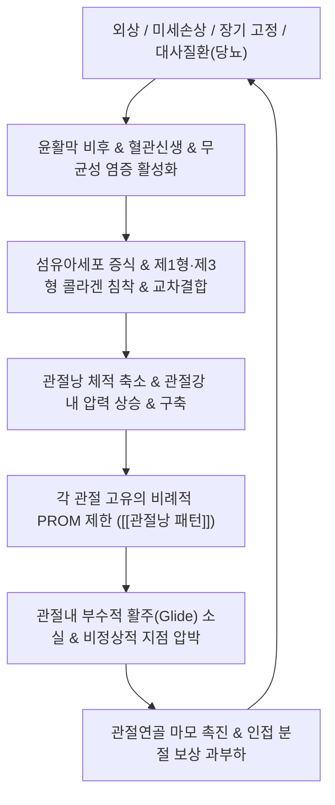

---
aliases:
  - 관절낭 패턴
  - 관절낭패턴
  - Capsular Pattern
  - 관절낭성 패턴
  - 關節囊 形態
tags:
  - 질환
  - 근골격계
  - 진단학
  - 정형의학
---

# 🩺 [[관절낭 패턴]] (Capsular Pattern / 關節囊 形態, Cyriax Selective Tissue Testing)

> **핵심 3줄 요약 (Key Summary)**:
> - 📍 병소 부위 & 해부·병태생리: 윤활관절을 감싸는 전체 관절낭(Articular Capsule) 및 활액막의 미만성 염증, 유착, 섬유화 구축으로 인해 관절의 수동 가동범위(PROM)가 관절 고유의 비례적 순서로 제한되는 임상 패턴.
> - 🚩 전형적 임상 양상 & 3대 징후: 능동 및 수동 관절가동범위의 특징적 비례 제한(견관절: 외회전 > 외전 > 내회전, 슬관절: 굴곡 > 신전 10:1, 고관절: 내회전 > 외전 > 굴곡), 관절낭성 단단한 끝느낌(Capsular End-feel), [[비관절낭 패턴]]과의 뚜렷한 대조.
> - 🛠️ 핵심 감별 검사 & 한·양방 다각적 치료 전략: 시리악스(Cyriax) 선택적 조직 검사(Selective Tissue Examination), [[둔부 징후]](Sign of the Buttock) 감별, 관절낭 신장 관절가동추나 기법, 심부 관절강 소염 약침 및 어혈 거풍습 한약 처방.
> - ⚠️ 응급 의뢰 레드플래그 & 악화 요인: [[둔부 징후]] 양성 시 의심되는 둔부 심부 감염·농양·종양, 급성 화농성 관절염, 관절 내 골절 및 급성 탈구 시의 무리한 강제 수동 관절 가동 금기.

---

## 📌 목차
1. [질환 개요 & 해부학적 병태생리](#1-질환-개요--해부학적-병태생리)
2. [병태생리 메커니즘 & 생체역학적 악순환 네트워크](#2-병태생리-메커니즘--생체역학적-악순환-네트워크)
3. [임상 증상 & 이학적 검사(Physical Exam) 알고리즘](#3-임상-증상--이학적-검사physical-exam-알고리즘)
4. [감별 진단 매트릭스 (Differential Diagnosis)](#4-감별-진단-매트릭스-differential-diagnosis)
5. [한의 통합 치료 프로토콜 (침·약침·추나·한약)](#5-한의-통합-치료-프로토콜-침약침추나한약)
6. [재활 운동 & 생활습관 티칭 가이드](#6-재활-운동--생활습관-티칭-가이드)
7. [💡 사용자 진료실 핵심 필기 & 임상 노하우 (Melt-In 잔여 심화 집약)](#7--사용자-진료실-핵심-필기--임상-노하우-melt-in-잔여-심화-집약)
8. [출처 및 학술 참고 문헌 (References)](#8-출처-및-학술-참고-문헌-references)

---

## 1. 질환 개요 & 해부학적 병태생리

![[관절낭패턴_오십견_유착성관절낭염_관절낭수축_도해.jpg|450]]
> [그림 1: 유착성 관절낭염(오십견)에서 발생하는 정상 관절낭 대비 관절낭 비후, 활액막 염증 및 섬유성 수축 도해]

* **질환 정의 및 개념**:
  * 관절낭 패턴(Capsular Pattern)은 정형의학의 창시자 제임스 시리악스(James Cyriax)가 정립한 개념으로, 윤활관절의 관절낭 전체(Entire Joint Capsule) 또는 활액막에 광범위한 염증, 부종, 유착, 퇴행성 섬유화가 발생했을 때 나타나는 **특징적이고 예측 가능한 수동 관절가동범위(PROM) 제한의 고유 비례 패턴**을 의미합니다.
  * 단일 인대 손상, 건초염, 근육 파열, 유리체(Loose body) 같은 국소 병변은 특정 한 방향의 움직임만 제한되는 [[비관절낭 패턴]](Non-capsular pattern)을 보이는 반면, 관절낭염이나 관절염은 관절낭 전체가 영향을 받으므로 각 관절마다 해부학적으로 가장 큰 긴장을 받는 방향 순서대로 규칙적인 제한이 일어납니다.
* **관련 해부학적 구조물**:
  * **골격 및 관절**: [[상완골]], [[견갑골]], [[대퇴골]], [[골반]], [[경골]], [[요골]], [[척골]], [[거골]], [[종골]] 등 전신 윤활관절(Diarthrodial joint).
  * **관절낭 및 인대 구조**: 관절낭 외층의 치밀결합조직 섬유막(Fibrous capsule), 내층의 윤활막(Synovial membrane), 관절낭 보강 인대군(예: 견관절의 [[오훼상완인대]], 상·중·하 [[관절상완인대]], 고관절의 [[장골대퇴인대]], [[치골대퇴인대]], [[좌골대퇴인대]]).
  * **인접 근육 및 건**: 견관절의 [[극하근]], [[견갑하근]], [[극상근]], [[소원근]] (회전근개), 고관절의 [[장요근]], [[이상근]], [[대퇴근막장근]], 슬관절의 [[대퇴사두근]], [[햄스트링]].
  * **신경 및 혈관**: 관절낭에 풍부하게 분포하는 루피니(Ruffini) 소체, 파시니(Pacinian) 소체, 자유신경종말(통각 수용체), 관절 주위 혈관망.

---

## 2. 병태생리 메커니즘 & 생체역학적 악순환 네트워크

![[관절낭패턴_견관절_관절낭_및_오훼상완인대_해부도해.png|450]]
> [그림 2: 견관절 관절낭의 섬유막 구조 및 오훼상완인대, 관절상완인대 해부학적 도해]

### 1) 해부학적 관절낭 구축 및 용적 축소 기전
* **염증 및 활액막 반응**: 외상, 장기간의 깁스 고정, 특발성 유착성 관절낭염, 류마티스 관절염, 퇴행성 관절염 등에 의해 활액막에 사이토카인(IL-1β, TNF-α, TGF-β)이 분비되면서 섬유모세포가 근섬유모세포(Myofibroblast)로 분화합니다.
* **콜라겐 과축적과 관절낭 수축**: 관절낭 벽이 두꺼워지고 콜라겐 교차결합이 증가하면서 관절낭의 탄성과 유연성이 소실됩니다. 정상 관절강 내 용적이 15~30ml에서 2~3ml 이하로 급감하고, 하부 관절낭 오목(Axillary pouch)이 유착되어 닫힙니다.
* **비례적 가동제한의 형성 원리**: 관절낭이 전반적으로 균일하게 오그라들면, 해부학적으로 관절낭 섬유가 가장 팽팽하게 당겨지는 동작(Taut position)부터 순차적으로 걸리게 됩니다. 예컨대 견관절에서는 전하방 관절낭이 가장 큰 장력을 받는 외회전이 1차로 극심하게 제한되고, 이어 외전, 내회전 순으로 제한이 파급됩니다.

### 2) 생체역학적 연쇄 반응 (Kinetic Chain)
* **관절 내 보조 운동(Arthrokinematics) 결손**: 구름(Roll)과 활주(Glide)가 결합하여 일어나는 정상 생체역학에서 관절낭 구축 시 활주가 소실되어 뼈두가 비정상적으로 관절와순이나 골단을 충돌(Impingement)시킵니다.
* **보상 운동과 근막 불균형**: 견관절 가동성 저하 시 [[승모근]] 상부 섬유 및 [[견갑거근]]이 과도하게 수축하여 견갑골 상방회전을 억지로 유도하며, 요추부와 경추부의 대상성 과전만이 유발됩니다.

---

## 3. 임상 증상 & 이학적 검사(Physical Exam) 알고리즘

![[관절낭패턴_유착성관절낭염_하부오목_관절낭비후_MRI소견.jpg|450]]
> [그림 3: 유착성 관절낭염 환자의 MRI 조영 소견: 하부 관절상완인대 복합체 및 액와낭(Axillary pouch) 부위의 현저한 관절낭 비후와 조영 증강]

### 1) 전신 관절별 관절낭 패턴 (Capsular Patterns Summary)
시리악스 기준 전신 주요 윤활관절의 제한 순서(가장 제한이 심한 동작 순서대로 나열):

* **견관절 (Glenohumeral joint)**:
  * **외회전 > 외전 > 내회전** 순서로 제한 (External Rotation > Abduction > Internal Rotation).
  * 외회전이 거의 0도에 가깝게 잠기며, 외전 시 견갑골 거상 보상 작용이 조기에 발생합니다.
* **주관절 (Elbow joint)**:
  * **굴곡 > 신전** 순서로 제한 (Flexion > Extension). (예: 굴곡 30도 제한 시 신전은 약 10도 제한).
  * 회내/회외는 정상 관절낭염 단독에서는 비교적 보존됩니다.
* **고관절 (Hip joint)**:
  * **내회전 > 외전 > 굴곡 > 외회전** 순서로 제한 (Internal Rotation > Abduction > Flexion > External Rotation).
  * 초기 고관절 관절염 및 대퇴골두 무혈성 괴사에서 가장 먼저 내회전 각도가 급감합니다.
* **슬관절 (Knee joint)**:
  * **굴곡 > 신전 (약 10:1 비율)** 제한 (Flexion markedly more than Extension).
  * 굴곡이 90도 이하로 심하게 제한될 때 신전은 5~10도 정도 약간 제한되는 양상을 보입니다.
* **수근관절 (Wrist joint)**:
  * **굴곡과 신전이 동등하게 제한** (Flexion = Extension), 요측/척측 편위는 덜 제한됩니다.
* **모지 수근중수관절 (Trapeziometacarpal joint / 1st CMC joint)**:
  * **외전 제한** (Abduction limitation while extension remains relatively preserved).
* **거골하관절 (Subtalar joint / Talocalcaneal joint)**:
  * **내반 > 외반** 제한 (Inversion > Eversion).
* **족관절 (Talocrural joint)**:
  * **족저굴곡 > 배측굴곡** 제한 (Plantarflexion > Dorsiflexion).
* **중족골관절 및 족지관절 (Tarsal / Metatarsophalangeal joints)**:
  * 중족간 관절: 내전, 내회전 제한.
  * 제1 중족지절관절(1st MTP): **신전 > 굴곡** 제한 (Hallux rigidus 전형 양상).
* **척추 분절 (Spine)**:
  * **굴곡을 제외한 모든 운동(신전, 측굴, 회전)이 대칭적으로 제한** (Flexion relatively preserved, extension, lateral flexion, and rotation restricted).

### 2) 필수 이학적 검사 및 감별 징후 (Physical Examination)
* **시리악스 선택적 조직 검사 (Selective Tissue Examination)**:
  * **능동 운동(AROM)**: 환자 스스로 움직여 통증 호와 가동범위 확인.
  * **수동 운동(PROM)**: 검사자가 관절을 끝까지 움직여 수동 ROM 제한 비율과 최종 끝느낌(End-feel) 평가. 관절낭 패턴에서는 딱딱하고 팽팽한 저항감이 느껴지는 '관절낭성 끝느낌(Capsular end-feel)'이 나타남.
  * **저항성 등척성 수축 검사(Resisted Isometric Test)**: 관절을 중립위에 두고 근육만 수축시켜 통증 여부 확인. 순수 관절낭 문제인 경우 저항 수축 시 통증이 없음(Painless strong or painless weak).
* **[[둔부 징후]] (Sign of the Buttock)**:
  * **검사 방법**: 앙와위에서 하지직거상(SLR) 검사를 시행하여 고관절 굴곡 제한 및 통증을 확인한 후, 무릎을 굴곡시킨 상태에서 고관절을 더 깊이 굴곡시켜 봅니다.
  * **음성 반응 (통상적 좌골신경통 / 햄스트링 단축)**: 무릎을 구부리면 고관절 굴곡 각도가 즉시 현저히 증가함.
  * **양성 반응 (Sign of the Buttock 양성)**: 무릎을 90도로 굴곡시켰음에도 불구하고 고관절 굴곡이 전혀 증가하지 않고 통증과 저항이 지속됨.
  * **임상적 중대 의미**: 고관절 자체의 관절낭염이 아니라, 둔부 심부의 심각한 병변(좌골활액낭염, 골반 농양, 골반/대퇴골 근위부 골수염, 골반 내 악성 종양, 천장관절염)을 시사하는 강력한 레드플래그.

---

## 4. 감별 진단 매트릭스 (Differential Diagnosis)

| 감별 질환 | 병소 및 병태생리 | PROM 제한 특징 | 저항 등척성 검사 소견 |
| :--- | :--- | :--- | :--- |
| [[관절낭 패턴]] (본 질환) | 전체 관절낭염, 유착성 관절낭염, 류마티스/골관절염 | 관절 고유의 비례적 다방향 제한 (예: 외회전>외전>내회전) | 통증 없음 (음성) |
| [[인대염좌]] (Ligament Sprain) | 특정 관절 외측/내측 인대 부분 손상 | 해당 인대가 팽팽히 신장되는 단 1개 방향에서만 통증 및 끝느낌 제한 | 통증 없음 (음성) |
| [[내부 장애]] (Internal Derangement) | 관절 내 유리체(Loose body), 반월판 파열, 디스크 탈출 | 급작스럽고 불규칙한 한 방향의 심한 잠김(Locking) 및 가동 제한 | 통증 없거나 기계적 걸림 유발 |
| 건염 및 건초염 (Tendinopathy) | 특정 건/근육 부착부의 염증 및 퇴행 | 수동 운동 시 반대 방향 신장 통증 (비관절낭성 국소 통증) | 해당 건 저항 수축 시 뚜렷한 통증 양성 |
| [[둔부 징후]] 양성 병변 | 골반 농양, 좌골활액낭염, 골반 골수염/종양 | 무릎 굴곡 후에도 고관절 굴곡 불가, 비관절낭 패턴의 전방위 잠김 | 전신 발열, 체중 감소, 야간 안정시 통증 동반 |

---

## 5. 한의 통합 치료 프로토콜 (침·약침·추나·한약)

* **침구 치료 (Acupuncture)**:
  * 타겟 관절낭 주위 경혈 및 근막 유착부 자침: 견관절 견우(肩髃), 견료(肩髎), 견정(肩貞), 거골(巨骨); 고관절 환도(環跳), 거료(居髎), 질변(秩邊); 슬관절 독비(犢鼻), 내슬안(內膝眼), 양릉천(陽陵泉).
  * 관절낭 심부 유착 분리를 위한 심자(Deep needling) 및 전침(2~100Hz 혼합파)을 인가하여 국소 혈류 개선 및 엔도르핀 분비 촉진.
* **약침 치료 (Pharmacopuncture)**:
  * **급성 염증기**: 황련해독탕 약침 또는 소염약침을 관절강 내 및 관절낭 부착부에 주입하여 활액막염 급성 염증 및 부종 억제.
  * **만성 섬유화 구축기**: 신바로약침, 오공약침, 자하거 약침을 관절낭 주변 인대(오훼상완인대, 장골대퇴인대 등)에 주입하여 콜라겐 섬유화 완화 및 인대 조직 재생 유도.
* **추나 치료 (Chuna Manipulation)**:
  * **관절가동추나 (Mobilization)**: 칼텐본(Kaltenborn) 관절면 오목-볼록 법칙(Convex-Concave rule)에 입각한 활주(Glide) 기법 적용. 견관절 하방 활주(외전 제한 개선), 후방 활주(내회전 및 굴곡 개선), 전방 활주(외회전 개선).
  * **경근추나 (Myofascial Release)**: 관절낭을 압박하는 주변 단축 근육군(견갑하근, 대흉근, 장요근 등)에 대한 근에너지기법(MET) 및 허혈성 압박(JS).
  * ⚠️ 절대 금기: 급성기 관절낭 부종 시의 과도한 고속저진폭(HVLA) 스러스트 추나 기법은 관절낭 미세 파열과 반발성 섬유화를 유발하므로 금기.
* **한약 치료 (Herbal Medicine)**:
  * **초기 활액막염·종통**: 거풍습통, 활혈지통의 처방 ([[오적산]], [[대강활탕]], [[방기황기탕]]).
  * **만성 유착·관절낭 구축기**: 기혈허증 및 어혈 교착을 다스리는 처방 ([[서경탕]], [[독활기생탕]], [[당귀사역탕]]).

---

## 6. 재활 운동 & 생활습관 티칭 가이드

* **추 운동 및 완만한 지속 신장 (Codman Pendulum & Sustained Stretch)**:
  * 어깨 관절낭 구축 환자는 덤벨(0.5~1kg)을 쥐고 상체를 숙여 전후/좌우/회전 시계추 운동을 시행하여 관절강 견인 효과 유도.
  * 벽 타고 오르기(Finger ladder) 운동 및 막대를 이용한 수동 외회전 스트레칭.
* **등척성 관절 중심화 운동**:
  * 관절 가동범위 한계 내에서 통증 없는 범위의 가벼운 등척성 수축을 통해 관절낭 고유수용감각 피드백 재활성화.
* **온열 요법 및 온수욕**:
  * 스트레칭 전 15~20분간 심부 온열 찜질 또는 온수 샤워를 통해 콜라겐 조직의 점탄성을 일시적으로 높인 상태에서 가동화 진행.

---

## 7. 💡 사용자 진료실 핵심 필기 & 임상 노하우 (Melt-In 잔여 심화 집약)

* **관절낭 패턴 vs 비관절낭 패턴의 초고속 10초 감별 공식**:
  * 환자가 능동 움직임에서 제한을 호소할 때, **검사자가 수동으로 관절을 끝까지 돌려보았을 때 전형적인 비례 순서(외회전>외전>내회전 등)로 다방향이 잠기면 관절낭 패턴**입니다.
  * 만약 외회전과 내회전은 정상인데 팔을 옆으로 올릴 때(외전)만 딱 걸리거나 찌릿하다면 이는 관절낭 질환이 아니라 극상근건염, 견봉하 점액낭염, 관절순 파열 등 [[비관절낭 패턴]]입니다.
* **인대 손상과 관절내 유리체의 현장 구분**:
  * **인대 염좌**: 해당 인대가 늘어나는 특정 한 방향에서만 국소 통증과 끝느낌 제한이 발생하며, 반대 방향 움직임은 완전히 정상입니다.
  * **내부 장애(디스크 탈출증, 슬관절 유리체, 반월판 손상)**: 관절낭처럼 서서히 굳는 것이 아니라, 어느 날 갑자기 특정 방향으로 움직이지 않는 급작스러운 잠김(Locking)과 심한 통증이 발생합니다.
* **진료실 필수 체크리스트: [[둔부 징후]](Sign of the Buttock)**:
  * 만성 요통이나 엉덩이 통증 환자에게 SLR 검사를 할 때 무릎을 굽힌 뒤에도 고관절 굴곡이 안 되고 둔부 깊은 곳에서 극심한 통증을 호소한다면 **절대 단순 디스크나 이상근증후군으로 오판하여 강한 추나나 침 치료를 반복해서는 안 됩니다.**
  * 즉시 상급 병원 골반 MRI를 의뢰하여 골반 농양, 좌골점액낭염, 골수염, 골반 종양 여부를 스크리닝해야 합니다.

---

## 8. 출처 및 학술 참고 문헌 (References)

* Fritz JM, Delitto A, Erhard RE, Roman M. (1998). An examination of the selective tissue testing concept and capsular patterns in physical therapy. *Journal of Orthopaedic & Sports Physical Therapy*, 27(2), 107-115.
  * [PubMed Link](https://pubmed.ncbi.nlm.nih.gov/9475143/)
  * [연구 요약] 시리악스의 선택적 조직 검사 원리와 견관절 관절낭 패턴(외회전>외전>내회전)의 검사 신뢰도를 임상적으로 분석하고, 능동/수동/저항 검사 조합이 활액막염 및 관절낭 구축 진단에 가지는 통계적 유의성을 검증함.
* Hayes KW, Petersen C, Falconer J. (2001). Reliability of passive range-of-motion measures and capsular pattern in patients with shoulder pain. *Physical Therapy*, 81(4), 990-1001.
  * [PubMed Link](https://pubmed.ncbi.nlm.nih.gov/11276182/)
  * [연구 요약] 견관절 통증 환자 100명을 대상으로 수동 관절가동범위와 관절낭 패턴의 평가자 간 신뢰도를 측정하였으며, 외회전의 비례적 제한이 유착성 관절낭염 진단에서 가장 민감하고 재현성이 높은 지표임을 규명함.
* Cyriax J. (1982). *Textbook of Orthopaedic Medicine, Volume 1: Diagnosis of Soft Tissue Lesions*. 8th Edition. Baillière Tindall, London.
  * [연구 요약] 윤활관절 질환 감별의 핵심 개념인 관절낭 패턴(Capsular pattern)과 비관절낭 패턴(Non-capsular pattern), 저항성 등척성 검사 및 둔부 징후(Sign of the buttock)를 최초로 체계화한 정형의학의 고전 원전.