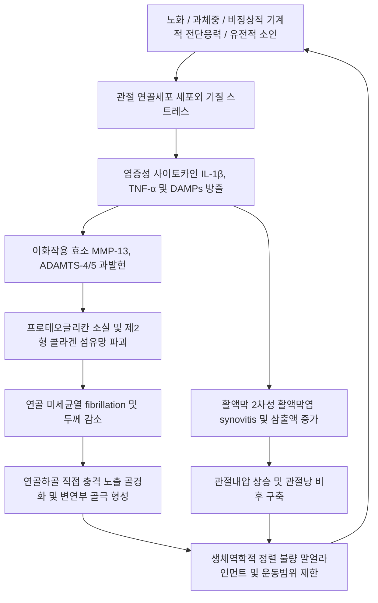

# 🩺 관절염 (Arthritis, 關節炎)

> **핵심 3줄 요약 (Key Summary)**:
> - 📍 **병소 부위 & 해부·병태생리**: 활액관절(synovial joint)을 구성하는 관절 연골(articular cartilage), 활액막(synovium), 연골하골(subchondral bone), 관절낭의 염증성 및 퇴행성 손상 질환군으로, 기계적 마모와 염증성 사이토카인(IL-1β, TNF-α)에 의한 기질 분해효소(MMP, ADAMTS) 활성화로 인해 관절강 협착과 골극(osteophyte)이 형성된다.
> - 🚩 **전형적 임상 양상**: 관절통, 관절 종창, 뻣뻣함(stiffness), 가동역(ROM) 제한, 관절 마찰음(crepitus)이 공통적으로 나타나며, 비염증성(골관절염: 활동 시 악화, 조조강직 < 30분)과 염증성(류마티스: 휴식 후 악화, 조조강직 > 1시간)으로 대별된다.
> - 🛠️ **핵심 검사 & 치료 전략**: 체중부하 방사선 단순촬영(X-ray: Kellgren-Lawrence 분류), 활액 분석, 혈액 염증 지표(ESR, CRP, 자가항체)로 원인 질환을 감별하며, 한의 임상에서는 [[독비]]·[[슬안]]·[[양릉천]] 중심 침구치료, 소염진통 [[약침치료]], 관절 가동 [[추나요법]], [[대방풍탕]]·[[독활기생탕]] 등 비증(痺證) 변증 한약을 통합 적용한다.
> - ⚠️ **응급 의뢰 레드플래그**: 급성 단관절의 극심한 발적·종창과 고열(38.3℃ 이상), 체중 부하 완전 불능, 수동 가동 시 비명(감염성 관절염 의심) 확인 시 즉각 관절천자 및 정맥 항생제 치료를 위해 3차 상급병원 응급실로 전원한다.

---

## 📌 목차
1. [질환 개요 & 해부학적 병태생리](#1-질환-개요--해부학적-병태생리)
2. [병태생리 메커니즘 & 생체역학적 악순환 네트워크](#2-병태생리-메커니즘--생체역학적-악순환-네트워크)
3. [임상 증상 & 이학적 검사(Physical Exam) 알고리즘](#3-임상-증상--이학적-검사physical-exam-알고리즘)
4. [감별 진단 매트릭스 (Differential Diagnosis)](#4-감별-진단-매트릭스-differential-diagnosis)
5. [한의 통합 치료 프로토콜 (침·약침·추나·한약)](#5-한의-통합-치료-프로토콜-침약침추나한약)
6. [양방 치료 & 병용·의뢰 기준 (Conventional Treatment & Referral)](#6-양방-치료--병용의뢰-기준-conventional-treatment--referral)
7. [재활 운동 & 생활습관 티칭 가이드](#7-재활-운동--생활습관-티칭-가이드)
8. [💡 사용자 진료실 핵심 필기 & 임상 노하우 (Melt-In 잔여 심화 집약)](#8--사용자-진료실-핵심-필기--임상-노하우-melt-in-잔여-심화-집약)
9. [출처 및 학술 참고 문헌 (References)](#9-출처-및-학술-참고-문헌--references)

---

## 1. 질환 개요 & 해부학적 병태생리

관절염(Arthritis)은 관절에 염증이나 퇴행성 변성이 발생하여 통증, 종창, 관절 강직을 유발하는 모든 질환을 포괄하는 총칭이다. 인체에는 100가지가 넘는 관절염 유형이 존재하지만, 임상적으로는 크게 **비염증성·퇴행성 관절염**인 [[퇴행성 관절염]](Osteoarthritis, OA)과 **염증성·자가면역성/결정성 관절염**인 [[류마티스 관절염]](Rheumatoid Arthritis, RA), [[통풍성 관절염]](Gout), [[강직성 척추염]](Ankylosing Spondylitis, AS), [[감염성 관절염]](Septic Arthritis)으로 양분된다.

![[관절염_01_퇴행성관절염무릎및발목단순방사선Xray소견.png]]
> [그림 1: ① 병태생리·방사선 도해 — 국가건강정보포털 골관절염 (cntntsSn: 6876) — 질병관리청]

### 활액관절의 정상 해부 구조
1. **관절 연골(Articular Cartilage)**: 초자연골(hyaline cartilage)로 구성되며, 혈관과 신경 및 림프관이 없어 재생 능력이 극히 제한적이다. 제2형 콜라겐 그물망과 음전하를 띤 프로테오글리칸(aggrecan)이 수분을 머금어 체중 부하 시 충격을 완충한다.
2. **활액막(Synovial Membrane)**: 관절낭의 내면을 덮는 1~3개 세포층으로 활액(synovial fluid)을 생성·분비하여 히알루론산과 루브리신(lubricin)을 통해 관절면의 마찰을 줄이고 연골에 영양을 공급한다.
3. **연골하골(Subchondral Bone)**: 연골 직하부의 치밀골판으로, 연골 손상 시 기계적 과부하에 반응하여 경화(sclerosis), 골극(osteophyte), 연골하 낭종(subchondral cyst)을 형성한다.

---

## 2. 병태생리 메커니즘 & 생체역학적 악순환 네트워크

과거에는 관절염을 단순한 '연골의 기계적 마모(wear and tear)'로만 보았으나, 현대 의학에서는 전신 대사 이상, 저등급 만성 염증(low-grade inflammation), 연골세포의 표현형 변화가 결합된 **전관절 장기 부전(whole-joint organ failure)**으로 정의한다.

![[관절염_02_퇴행성관절염관절연골손상MRI및관절경소견.png]]
> [그림 2: ② 관련 관절연골 병리 도해 — 국가건강정보포털 골관절염 (cntntsSn: 6876) — 질병관리청]

### 병태생리 3대 핵심 기전
1. **연골 기질의 이화작용 우세**: 정상 관절 연골에서는 기질 합성(동화작용)과 분해(이화작용)가 균형을 이루나, 관절염에서는 비정상적 기계적 부하와 산화 스트레스로 인해 연골세포가 MMP-13, ADAMTS-5를 대량 분비하여 기질을 급속히 분해한다.
2. **연골하골의 재형성(Remodeling)**: 충격을 완충하지 못한 연골하골이 미세골절을 겪고 골경화(sclerosis)가 진행되며, 관절 변연부에서는 골형성 유전자가 활성화되어 골극(osteophyte)이 돋아난다.
3. **2차성 활액막염(Synovitis)**: 연골 분해 산물(DAMPs)이 활액강으로 떨어져 나와 활액막 대식세포를 자극하고 2차적 무균성 활액막염을 유발하여 부종과 수종(effusion)을 초래한다.

---

## 3. 임상 증상 & 이학적 검사(Physical Exam) 알고리즘

### 임상 증상 (Clinical Symptoms)
- **통증의 양상**:
  - 골관절염(OA): 관절을 사용할수록(계단 보행, 오래 서 있기) 통증이 심해지고 휴식을 취하면 호전됨. 병변이 진행되면 야간 안정통 발생.
  - 염증성 관절염(RA/AS): 아침에 일어났을 때 또는 휴식 후 통증과 뻣뻣함이 극대화되고 활동하면서 서서히 완화됨.
- **조조강직(Morning Stiffness)**:
  - 비염증성(OA): 대개 15~30분 이내로 짧음 (Gelling phenomenon).
  - 염증성(RA): 1시간 이상 지속됨.
- **이학적 징후**: 관절 비대(골극에 의한 골성 비대), 관절 종창(활액 삼출), 국소 압통, 마찰음(Crepitus), 관절 변형(무릎 내반변형 O다리, 손가락 Heberden/Bouchard 결절).

### 이학적 검사 프로토콜
1. **관절선 압통 검사(Joint Line Tenderness)**:
   - 슬관절 90도 굴곡 상태에서 대퇴골과 경골 사이 내외측 관절선을 엄지로 촉진하여 국소 압통을 확인한다.
2. **슬개골 압박 및 마찰 검사(Patellar Grinding / Clarke Test)**:
   - 슬개골을 대퇴 활차구 방향으로 압박하며 상하좌우로 이동시킬 때 연골 마찰음(crepitus) 및 유발통 평가.
3. **관절 삼출액 평가(Bulge Sign & Ballottement Test)**:
   - 경미한 삼출액은 내측 팽윤 징후(Bulge sign)로, 대량 삼출액은 슬개골 부유 검사(Ballottement)로 확인.
4. **하지 정렬 및 보행 분석**:
   - 기립 시 대퇴경골각(FTA)을 평가하여 내반변형(Genu varum) 또는 외반변형(Genu valgum) 유무를 확인.

---

## 4. 감별 진단 매트릭스 (Differential Diagnosis)

| 감별 질환 | 호발 연령 및 성별 | 침범 관절 패턴 | 조조강직 지속시간 | 주요 검사 소견 (Lab / X-ray) |
| :--- | :--- | :--- | :--- | :--- |
| **[[퇴행성 관절염]] (OA)** | 55세 이상, 여성 우세 | 슬관절, 고관절, DIP(헤버덴 결절), PIP, 제1 CMC | < 30분 | X-ray 관절강 비대칭 협착, 연골하 경화, 골극, ESR/CRP 정상 |
| **[[류마티스 관절염]] (RA)** | 30~50대, 여성 3:1 | 손목, MCP, PIP, 대칭성 다발성 소관절 | > 1시간 | RF 및 anti-CCP 항체 양성, ESR/CRP 상승, 대칭성 골미란(erosion) |
| **[[통풍성 관절염]] (Gout)** | 40~60대 남성 | 제1 MTP(엄지발가락), 발목, 단관절 급성 발작 | 수시간 내 극심한 통증 | 활액 편광현미경 상 강한 음성 복굴절 바늘모양 요산결정(MSU) |
| **[[가성통풍]] (CPPD)** | 65세 이상 고령자 | 슬관절, 완관절, 단관절 | 다양함 | 활액 내 약한 양성 복굴절 능형 CPPD 결정, X-ray 연골석회화증 |
| **[[강직성 척추염]] (AS)** | 20~30대 젊은 남성 | 천장관절, 척추 축성 관절, 비대칭성 하지 대관절 | > 1시간 (운동 시 호전) | HLA-B27 양성, 골반 X-ray/MRI 천장관절염(sacroiliitis) |
| **[[감염성 관절염]] (Septic)** | 전 연령 | 슬관절(50%), 단관절 급성 열감·종창 | 지속적 극심한 통증 | 활액 WBC > 50,000/μL, 중성구 > 90%, 세균 배양 양성 |

---

## 5. 한의 통합 치료 프로토콜 (침·약침·추나·한약)

한의학에서 관절염은 풍(風)·한(寒)·습(濕)·열(熱)의 사기(邪氣)가 기혈이 허약한 틈을 타 관절과 경락에 침범하여 기혈 순환을 막아 발생하는 **비증(痺證)**의 범주에 속한다. 관절의 통증과 염증을 가라앉히는 국소 치료와 함께, 간신(肝腎)을 보하고 기혈을 북돋아 근골을 튼튼히 하는 전신 변증 치료를 결합한다.

![[관절염_05_침구치료한국전통하지자침도.png]]
> [그림 3: ③ 치료·시술 실사 — Wikimedia Commons — File:A Korean acupuncturist inserting a needle into a leg Wellcome V0018478.jpg (CC BY 4.0)]

### 1) 침구 치료 (Acupuncture & Moxibustion)
- **국소 근위 취혈**:
  - [[독비]](ST35) & 내[[슬안]](EX-LE4): 슬관절강 내외측 함요처로 슬개하 지방체 및 관절낭 혈류 촉진, 득기 후 약 1.0치 직자.
  - [[양릉천]](GB34): 팔회혈 중 근회(筋會)로 대퇴사두근 및 슬와근 긴장 이완.
  - [[음릉천]](SP9): 비경 합혈로 관절 주변 습체(부종·삼출액) 배출.
  - [[혈해]](SP10) & [[양구]](ST34): 내측광근 및 외측광근 자극으로 무릎 동적 안정성 강화.
  - [[족삼리]](ST36): 보기건비(補氣健脾) 및 하지 순환 촉진.
- **전침 요법(Electroacupuncture)**: 독비-내슬안, 양릉천-음릉천에 2Hz 저주파 전침을 20분간 통전하여 내인성 오피오이드 분비 및 관절 통증 억제 (Vickers et al., 2018).
- **온침(Warm Needling) 및 뜸 치료**: 한비(寒痺) 및 퇴행성 냉통 환자에게 침병에 애탄을 부착하는 온침술을 시행하여 관절강 내 냉기를 몰아내고 혈관을 확장.

### 2) 약침 치료 (Pharmacopuncture)
- **신바로약침**: 자생한방병원 고유 처방인 청파전 기반 약침으로, 연골세포 보호 및 신경염증 억제 기전 입증. 관절강 주변 인대 부착부 및 통증점에 0.5~1.0cc 주입.
- **황련해독탕 약침 / 중성어혈약침**: 급성 부종 및 열감이 동반된 열비(熱痺) 또는 활액막염 급성 악화기에 항염증 목적으로 시술.
- **봉약침(Sweet BV)**: 멜리틴(Melittin) 성분이 강력한 항염증 및 진통 효과를 발휘하며, 알레르기 피부 반응검사 음성 확인 후 0.1cc 미량 시술.

### 3) 추나요법 (Chuna Manual Therapy)
- **슬관절 가동술(Joint Mobilization)**: 슬관절 견인(traction)과 경골의 전후방 활주(AP glide)를 결합하여 협착된 관절 간격을 넓히고 활액 순환을 유도.
- **슬개골 가동술(Patellar Mobilization)**: 상하좌우 부드러운 수동 가동을 통해 슬개대퇴관절(PF joint)의 마찰을 줄이고 연골 압박 부하를 분산.
- **골반-고관절 정렬 교정**: 골반 변위 및 고관절 내회전 변형을 교정하여 무릎으로 가해지는 비정상적 체중 부하 축을 정상화.

### 4) 한약 치료 (변증별 방제)
- **풍한습비형(風寒濕痺型)**: 기온이 낮거나 흐린 날 통증이 심해지며 관절이 시리고 묵직한 경우.
  - [[대방풍탕]](大防風湯) 또는 [[오적산]](五積散) — 온경산한(溫經散寒), 거풍제습(祛風除濕).
- **습열비형(濕熱痺型)**: 관절이 붓고 화끈거리며 눌렀을 때 열감이 뚜렷한 급성 염증 악화기.
  - [[당귀점통탕]](當歸拈痛湯) 또는 가미이묘탕(加味二妙湯) — 청열이습(淸熱利濕), 통락지통(通絡止痛).
- **간신휴허·기혈부족형(肝腎虧虛·氣血不足型)**: 노년기 만성 골관절염으로 뼈마디가 굵어지고 근육이 위축되며 오래 걷지 못하는 경우.
  - [[독활기생탕]](獨活寄生湯) 또는 삼기음(三氣飲) — 보익간신(補益肝腎), 강장근골(强壯筋骨), 활혈지통(活血止痛).

---

## 6. 양방 치료 & 병용·의뢰 기준 (Conventional Treatment & Referral)

### 1) 약물 치료 (Medication)
- **경구 진통소염제**:
  - 아세트아미노펜(Acetaminophen): 1차 기본 진통제 (최대 3,000mg/일, 간독성 주의).
  - 경구 NSAIDs: Celecoxib (200mg qd, 위장관 안전성 우수), Aceclofenac, Meloxicam. 장기 복용 시 위장관 출혈, 신장 기능 저하, 심혈관 위험 모니터링 필수.
- **국소 제제**: NSAIDs 겔·패치(Ketoprofen, Flurbiprofen)는 전신 부작용 없이 국소 통증 조절에 권장.
- **관절강 내 주사치료(Intra-articular Injection)**:
  - 히알루론산(Hyaluronic Acid, 연골주사): 1주 간격 3~5회 또는 6개월 1회 제형, 관절 윤활 작용.
  - 코르티코스테로이드 주사(Triamcinolone): 급성 삼출액 및 극심한 통증 시 단기 사용(1년에 3~4회 이하로 제한, 잦은 주사는 연골 파괴 가속).
  - 폴리뉴클레오티드(PN, 콘쥬란): 점탄성 보충 및 연골 마모 완화.

### 2) 수술적 치료 적응증 (Surgical Indication)
- **근위 경골 절골술(HTO)**: 65세 미만 비교적 젊고 활동적인 환자에서 내측 관절염 및 O자 다리 변형이 있는 경우 체중 부하 축을 외측으로 이동.
- **인공관절 치환술(Arthroplasty)**:
  - 전치환술(TKA/THA): 65세 이상, Kellgren-Lawrence Grade IV의 말기 관절염, 극심한 일상생활 장애, 6개월 이상의 보존적 치료 실패 시 최종 선택.

### 3) 한의 병용 판단 및 주의사항
- **NSAIDs 복용 환자**: 침·한약 치료 병용 시 진통 효과를 극대화하여 NSAIDs 복용 용량과 기간을 줄여 소화기 및 신장 합병증을 예방할 수 있음.
- **관절강 주사 직후 주의**: 양방 스테로이드 또는 히알루론산 주사 후 48시간 동안은 감염 예방을 위해 주사 부위에 직접적인 자침이나 강한 추나 압박을 금함.

### 4) 양방 전문과 의뢰 기준 (Referral Criteria)
- **응급 의뢰**: 급성 고열, 단관절의 극심한 발적·종창, 체중 부하 완전 불능 (감염성 관절염 감별).
- **정형외과 수술 의뢰**: 
  - K-L Grade 4로 관절 간격이 완전히 소실되고 뼈끼리 부딪히며 심한 굴곡구축(flexion contracture > 15도)이 동반된 경우.
  - 3~6개월간의 적극적인 한의 보존 치료에도 야간 안정통으로 수면이 불가능한 경우.

---

## 7. 재활 운동 & 생활습관 티칭 가이드

### 1) 체중 감량 (Weight Reduction)
- 체중 1kg 감량 시 보행 시 무릎에 가해지는 하중은 약 4kg 감소한다. 과체중 관절염 환자는 체중 5~10% 감량이 최우선 비약물 치료이다.

### 2) 대퇴사두근 및 둔근 강화 운동
- **Q-setting (대퇴사두근 등척성 운동)**: 무릎을 펴고 앉아 무릎 뒤 오금으로 수건을 바닥 쪽으로 5초간 누르기, 15회씩 3세트.
- **SLR (다리 뻗어 올리기)**: 누운 상태에서 발목을 당기고 무릎을 편 채 30도 들어 올려 5초 유지.
- **실내 자전거 타기**: 안장 높이를 적절히 조절하여 무릎이 90도 이상 과굴곡되지 않도록 하고 낮은 저항으로 회전 운동 시행.
- **수영 및 아쿠아로빅**: 부력으로 인해 무릎 관절 부하가 80% 이상 감소된 상태에서 전신 근력 강화 가능.

### 3) 피해야 할 생활 습관
- 쪼그려 앉기, 방바닥 양반다리, 무릎 꿇기 등 무릎을 120도 이상 과도하게 구부리는 입식 생활 탈피. 침대와 식탁, 양변기 사용 필수.

---

## 8. 💡 사용자 진료실 핵심 필기 & 임상 노하우 (Melt-In 잔여 심화 집약)

1. **방사선 소견과 임상 증상의 불일치(Clinicoradiological Discordance)**:
   - X-ray 상 K-L Grade 3~4로 심하게 닳아 있어도 근력이 좋고 활액막염이 없으면 통증을 거의 못 느끼는 환자가 있는 반면, Grade 1인데도 극심한 통증을 호소하는 환자가 있다. X-ray 사진만 보고 환자를 실망시키지 말고, 관절 주위 연부조직(거위발건염, 장경인대염, 복재신경 포착)의 치료 가능성을 반드시 설명한다.
2. **거위발건낭염(Pes Anserine Bursitis)의 흔한 동반**:
   - 무릎 내측 퇴행성 관절염 환자의 상당수는 관절 자체의 통증보다 경골 내측 상부의 거위발건(봉공근·박근·반건양근) 건포착 통증(음릉천 하방 2cm)이 주원인이다. 이 부위에 약침 치료를 병행하면 즉각적인 보행통 호전을 얻을 수 있다.
3. **독활기생탕 처방 시 위장관 배려**:
   - 노인성 관절염 환자에게 독활기생탕을 장기 처방할 때 숙지황과 당귀 등의 점니성으로 인해 소화장애나 연변이 생길 수 있다. 백출, 사인, 신곡을 가미하여 비위 기능을 보강하며 투여한다.

---

## 9. 출처 및 학술 참고 문헌 (References)

1. **Hunter DJ, Bierma-Zeinstra S. (2019)**. Osteoarthritis. *The Lancet*, 393(10182):1745-1759. [PMID: 31034380](https://pubmed.ncbi.nlm.nih.gov/31034380/)

2. **Sharma L. (2021)**. Osteoarthritis of the Knee. *The New England Journal of Medicine*, 384(1):51-59. [PMID: 33406330](https://pubmed.ncbi.nlm.nih.gov/33406330/)

3. **Vickers AJ, et al. (2018)**. Acupuncture for Chronic Pain: Update of an Individual Patient Data Meta-Analysis. *The Journal of Pain*, 19(5):455-474. [PMID: 29198932](https://pubmed.ncbi.nlm.nih.gov/29198932/)

---

## 관련 노트

- [[퇴행성 관절염]]
- [[류마티스 관절염]]
- [[통풍성 관절염]]
- [[감염성 관절염]]
- [[가성통풍]]
- [[강직성 척추염]]
- [[반월상 연골판 파열]]
