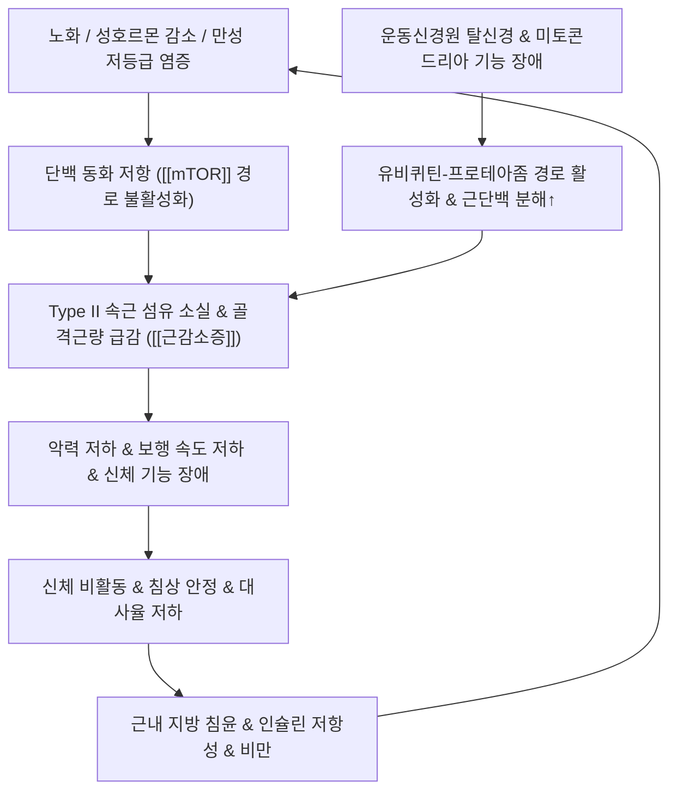

# 🩺 [[근감소증]] (Sarcopenia / 筋減少症, ICD-10 M62.84 / KCD M62.84)

> **핵심 3줄 요약 (Key Summary)**:
> - 📍 병소 부위 & 해부·병태생리: 노화, 비활동, 만성 질환, 단백 동화 저하로 인해 전신의 제2형(속근) 근섬유 위축 및 골격근량과 근력이 비가역적으로 소실되는 전신 대사-근골격계 질환.
> - 🚩 전형적 임상 양상 & 3대 징후: [[악력]] 저하(남성 <28kg, 여성 <18kg), [[5회 의자 일어서기 검사]] 시간 지연(>12초), 보행 속도 저하(<1.0m/s), 낙상 및 골절 위험 급증, 피로감과 독립적 일상수행능력 상실.
> - 🛠️ 핵심 감별 검사 & 한·양방 다각적 치료 전략: AWGS 2019 및 EWGSOP2 진단 알고리즘(악력 + 5TSTS + BIA/DXA 골격근지수 SMI), 점진적 저항운동(주 3세트 60~70% 1RM) + 단백질(1.2~1.5g/kg/일) 영양 처방, 비주사말(脾主四末) 기반 [[보중익기탕]]·[[십전대보탕]] 및 근육 재생 약침 요법.
> - ⚠️ 응급 의뢰 레드플래그 & 악화 요인: 급격한 전신 쇠약 및 악액질(Cachexia), 루게릭병(ALS)·길랑-바레 증후군 등 급성 신경근 질환 의심 징후, 삼킴장애(연하곤란) 동반 연하성 폐렴 위험, 무리한 단식성 체중 감량(세마글루타이드 등 GLP-1 투여 시 근손실 주의).

---

## 📌 목차
1. [질환 개요 & 해부학적 병태생리](#1-질환-개요--해부학적-병태생리)
2. [병태생리 메커니즘 & 생체역학적 악순환 네트워크](#2-병태생리-메커니즘--생체역학적-악순환-네트워크)
3. [임상 증상 & 이학적 검사(Physical Exam) 알고리즘](#3-임상-증상--이학적-검사physical-exam-알고리즘)
4. [감별 진단 매트릭스 (Differential Diagnosis)](#4-감별-진단-매트릭스-differential-diagnosis)
5. [한의 통합 치료 프로토콜 (침·약침·추나·한약)](#5-한의-통합-치료-프로토콜-침약침추나한약)
6. [양방 치료 & 병용·의뢰 기준 (Conventional Treatment & Referral)](#6-양방-치료--병용의뢰-기준-conventional-treatment--referral)
7. [재활 운동 & 생활습관 티칭 가이드](#6-재활-운동--생활습관-티칭-가이드)
8. [💡 사용자 진료실 핵심 필기 & 임상 노하우 (Melt-In 잔여 심화 집약)](#7--사용자-진료실-핵심-필기--임상-노하우-melt-in-잔여-심화-집약)
9. [출처 및 학술 참고 문헌 (References)](#8-출처-및-학술-참고-문헌-references)

---

## 1. 질환 개요 & 해부학적 병태생리

![[근감소증_정상근육_대_위축근육_근섬유직경_비교도해.png|450]]
> [그림 1: 정상 골격근 대비 근감소증 및 노화에 따른 근섬유 직경 감소, 속근섬유(Type II) 위축 및 근내 지방 침윤 도해]

* **질환 정의 및 역학**:
  * 근감소증(Sarcopenia)은 단순한 노화 현상이 아니라, **골격근량(Skeletal Muscle Mass)의 점진적 감소와 함께 근력(Muscle Strength) 및 신체 기능(Physical Performance)이 동반 저하**되어 낙상, 골절, 신체 장애, 대사질환 악화, 사망률을 유의하게 증가시키는 진행성 골격근 질환입니다.
  * 2016년 세계보건기구(WHO)에서 정식 질병코드(ICD-10 M62.84, 한국 KCD M62.84)를 부여받았으며, 65세 이상 노인 인구의 10~25%에서 호발합니다.
* **관련 해부학적 구조물**:
  * **근섬유 아형**: 주로 폭발적인 힘을 내는 **제2형 속근 섬유(Type II fast-twitch fibers)**의 선택적 위축 및 탈신경(Denervation)이 두드러지며, 제1형 지근 섬유(Type I slow-twitch fibers)는 상대적으로 보존됩니다.
  * **위성세포(Satellite Cells)**: 근초(Sarcolemma)와 기저막 사이에 위치하여 근섬유 재생을 담당하는 근육 줄기세포의 수와 활성도가 노화로 급감합니다.
  * **근간 및 근내 지방조직(Myosteatosis)**: 근육 내 지질 방울 및 지방세포 침윤으로 인해 근육의 수축 질(Muscle quality)이 심각하게 퇴화합니다.
  * **주요 호발 근육군**: 하지의 항중력근인 [[대퇴사두근]], [[둔근]], [[비복근]], [[가자미근]] 및 척추 기립근인 [[흉최장근]], [[요장늑근]].

---

## 2. 병태생리 메커니즘 & 생체역학적 악순환 네트워크

### 1) 분자생물학적 병태생리 (근단백 합성-분해 불균형)
* **단백 동화 신호전달계 억제**: 노화 및 단백질 섭취 부족으로 혈중 [[인슐린]] 및 [[IGF-1]] 농도가 감소하고, 근육 내 Akt/[[mTOR]] 신호전달 경로가 둔화되어 단백 합성 반응이 급격히 떨어지는 **단백 동화 저항(Anabolic Resistance)**이 발생합니다.
* **근단백 분해 경로 항진**: 만성 염증성 사이토카인(TNF-α, IL-6) 상승과 글루코코르티코이드 과다로 인해 FoxO 전사인자가 활성화되고, 유비퀴틴-프로테아좀(Ubiquitin-proteasome) 시스템 및 오토파지가 과작동하여 액틴·미오신 필라멘트가 빠르게 분해됩니다.
* **[[마이오스타틴]](Myostatin) 과발현**: 근육 성장을 억제하는 마이오킨인 마이오스타틴이 증가하고, 이를 억제하는 폴리스타틴(Follistatin)이 감소하여 위성세포 분화와 근비대가 차단됩니다.

### 2) 생체역학적 연쇄 반응 및 근감소성 비만 (Sarcopenic Obesity)
* **보행 메커니즘 붕괴**: [[대퇴사두근]] 및 [[둔근]]의 약화로 인해 보폭 감소, 보행 속도 둔화, 지지기(Stance phase) 불안정성이 초래되어 낙상 위험이 3배 이상 증가합니다.
* **근감소성 비만**: 근육량 감소는 기초대사량 저하와 인슐린 표적 조직의 결손을 불러와 내장지방 축적과 이상지질혈증을 악화시키며, 지방조직에서 분비되는 염증 물질이 다시 근육을 파괴하는 치명적인 악순환을 유발합니다.

---

## 3. 임상 증상 & 이학적 검사(Physical Exam) 알고리즘

![[근감소증_신체기능평가_악력계_측정_임상사진.jpg|450]]
> [그림 2: 디지털 악력계를 이용한 상지 등척성 근력 측정 임상 시연 (AWGS 기준: 남성 <28kg, 여성 <18kg 절단값)]

![[근감소증_신체기능평가_의자일어서기검사_동작시연.jpg|450]]
> [그림 3: 양팔을 가슴에 교차한 채 의자에서 5회 연속 일어서기를 수행하는 5회 의자 일어서기 검사(5TSTS) 시연 (>12초 소요 시 신체 기능 저하)]

### 1) 주소증 및 신체 기능 저하 양상
* **전형적 주소증**: "계단을 오를 때 다리에 힘이 풀려 난간을 잡아야 한다", "의자나 방바닥에서 일어날 때 손을 짚지 않으면 일어날 수 없다", "물건을 쥐는 힘이 약해져 병뚜껑을 따기 힘들다", "걸음걸이가 눈에 띄게 느려져 횡단보도를 시간 내에 건너기 버겁다".
* **이차적 합병증**: 반복적 낙상, 대퇴골 경부 및 척추 압박골절, 침상 고정으로 인한 폐렴 및 욕창.

### 2) AWGS 2019 / EWGSOP2 표준 진단 알고리즘
국제 가이드라인(아시아 근감소증 진단기준 AWGS 2019 및 유럽 EWGSOP2)에 따른 확진 3단계:

* **1단계: 근력 평가 ([[악력]] Handgrip Strength)**:
  * 양손을 2~3회 번갈아 측정하여 최대값 채택.
  * **AWGS 2019 절단값: 남성 <28.0 kg, 여성 <18.0 kg**. (절단값 미만 시 근감소증 의증).
* **2단계: 신체 기능 평가 ([[5회 의자 일어서기 검사]] & 보행 속도)**:
  * **[[5회 의자 일어서기 검사]](5TSTS)**: 양팔을 가슴에 모으고 의자에서 완전히 앉았다 일어서기 5회 반복. **소요 시간 ≥12초** 시 기능 저하 판정.
  * **6m 보행 속도 검사**: **<1.0 m/s** 시 신체 기능 저하 판정.
  * **[[SARC-CalF]] 설문**: 설문 점수 + 종아리 둘레(남 <34cm, 여 <33cm) 결합 점수가 **≥11점**인 경우 선별 양성.
* **3단계: 골격근량 확진 검사 ([[골격근지수(SMI)]])**:
  * **이중에너지 X선 흡수계측법(DXA)** 또는 **생체전기저항분석법(BIA)**으로 사지골격근량(ASM)을 신장 제곱(m²)으로 나눈 값.
  * **AWGS DXA 기준**: 남성 <7.0 kg/m², 여성 <5.4 kg/m².
  * **AWGS BIA 기준**: 남성 <7.0 kg/m², 여성 <5.7 kg/m².
  * **진단 확정**: 근력 또는 신체기능 저하 + 골격근량 저하 동반 시 **근감소증(Sarcopenia)** 확진. 3가지 모두 충족 시 **중증 근감소증(Severe Sarcopenia)**.

---

## 4. 감별 진단 매트릭스 (Differential Diagnosis)

| 감별 질환 | 병태생리 및 원인 | 근육량 및 근력 특성 | 임상 감별 포인트 |
| :--- | :--- | :--- | :--- |
| [[근감소증]] (본 질환) | 노화, 단백 섭취 부족, 비활동, 만성 저등급 염증 | 점진적인 사지 근육량 및 악력·보행속도 저하 | 감각 장애 없음, CK 수치 정상, 점진적 진행 |
| [[악액질]] (Cachexia) | 암, 말기 심부전, 만성 신부전 등 심각한 기저 소모성 질환 | 극심한 식욕부진 + 급격한 체지방 및 제지방 동시 소실 | 체중의 >5%가 수개월 내 소실, 중증 염증 수치(CRP) 상승 |
| [[노쇠 증후군]] (Frailty) | 다발성 장기 기능 저하 및 생리적 예비능 상실 | 근력 저하 외에 탈진, 활동량 감소, 느린 보행 | 프라이드(Fried) 노쇠 5대 기준 중 3개 이상 부합 |
| 중증 근무력증 (Myasthenia Gravis) | 신경-근 접합부 아세틸콜린 수용체 자가항체 | 근육량은 정상이나 사용 시 피로도 급증, 휴식 시 회복 | 안검하수, 복시, 일중 변동성(오후 악화), 항AChR 양성 |
| 염증성 근병증 (다발근염/피부근염) | 근섬유에 대한 자가면역 염증 침윤 | 근위부 근육(대퇴부, 상완부)의 대칭적 근력 약화 | 혈청 CK 및 알돌라아제 급상승, 근전도 상 근병증 소견 |

---

## 5. 한의 통합 치료 프로토콜 (침·약침·추나·한약)

* **침구 치료 (Acupuncture)**:
  * **주요 경혈**: 비위 기능을 북돋우고 사지 기혈을 소통시키는 족삼리(足三里), 비수(脾兪), 신수(腎兪), 태계(太谿), 양릉천(陽陵泉), 삼음교(三陰交).
  * **하지 대퇴사두근 및 둔근 자침**: 대퇴직근, 내측광근, 둔근 운동점(Motor Point) 자침 및 2~100Hz 저주파 전침을 인가하여 근육 내 [[mTOR]] 신호 및 [[IGF-1]] 분비를 촉진하고 제2형 속근 섬유의 단백 합성을 유도.
* **약침 치료 (Pharmacopuncture)**:
  * **자하거(인태반) 약침**: 풍부한 아미노산, 성장인자, 펩타이드를 함유하여 간신휴손(肝腎虧損)형 노인성 근위축 환자의 족삼리, 신수, 관골근에 주입 시 단백 동화 촉진 및 피로 개선.
  * **신바로약침 / 녹용약침**: 만성 염증성 사이토카인 억제 및 골격근-골대사 동시 개선을 위해 대퇴사두근 건 및 척추 기립근에 시술.
* **추나 치료 (Chuna Manipulation)**:
  * **근막이완추나 (Myofascial Release)**: 단축되고 섬유화된 하지 굴곡근군([[장요근]], [[햄스트링]], [[비복근]])의 이완을 통해 관절 가동성을 확보하고 정상 보행 궤적 회복.
  * **관절가동추나**: 골반 및 고관절, 족관절의 가동성을 증진시켜 기립 시 고유수용성 감각 피드백을 향상.
  * ⚠️ 주의: 골다공증이 동반된 고령 환자에게 척추의 강한 고속저진폭(HVLA) 스러스트 기법은 늑골 및 척추 골절 위험이 있으므로 절대 금기.
* **한약 치료 (Herbal Medicine)**:
  * **비주사말(脾主四末), 비주기육(脾主肌肉)**: 비위의 소화흡수 기능이 저하되면 사지 근육이 마르고 위축(痿證)된다는 한의 병기론에 입각.
  * **보비익기(補脾益氣)**: 소화흡수력을 개선하여 식이 단백질의 체내 이용률을 극대화하는 처방 ([[보중익기탕]], [[사군자탕]], [[육군자탕]]).
  * **간신부족(肝腎不足) 및 기혈양허(氣血兩虛)**: 근골을 강하게 하고 노화성 소모를 보충하는 처방 ([[독활기생탕]], [[십전대보탕]], [[육미지황탕]], [[가미대보탕]]).

---

## 6. 양방 치료 & 병용·의뢰 기준 (Conventional Treatment & Referral)

> 🎯 **이 섹션의 목적**: 환자가 **양방약을 이미 복용 중인 경우가 많다.** 한의원 1차 진료에서 양방 치료를 이해하고, 병용 가능·주의·금기를 판단하며, 언제 의뢰할지 결정한다.

* **약물 치료 (Medication)**:
  * 계열별 약물·용량·기간 — 국내 처방 관행 반영.
  * 작용 기전과 한의 치료와의 상호작용.
* **비약물 시술 (Procedures)**:
  * 주사·차단술·물리치료·보조기 등.
* **수술·시술 적응증 (Surgical Indication)**:
  * 언제 수술로 가는가 — 절대·상대 적응증, 수술 후 경과.
* **한의 병용 판단 (Combination Therapy)**:
  * 병용 가능 / 주의 / 금기. 복용 중 환자의 감량 타이밍·반동 현상.
* **양방·전문과 의뢰 기준 (Referral Criteria)**:
  * 응급 의뢰 트리거와 전문과 의뢰 기준(정형외과·신경외과·내과 등).

	(작성 필요)

---

## 7. 재활 운동 & 생활습관 티칭 가이드

* **점진적 저항운동 (Progressive Resistance Training)**:
  * **운동 강도 및 볼륨**: **주 2~3회, 8~12주 이상, 3세트, 60~70% 1RM(1회 최대반복중량)** 강도로 실시.
  * **허약 및 고령 노인**: 40~50% 1RM의 저강도로 시작하여 점진적으로 부하를 올리며, 탄력 밴드(TheraBand) 또는 체중을 이용한 스쿼트, 까치발 들기(Calf raise), 브릿지(Bridge) 동작 수행.
  * **수축 템포**: 부상 방지와 근비대 신호 전달을 위해 천천히 내리고(신장성 수축 2~3초) 폭발적으로 미는 형태 권고.
* **식이 단백질 및 영양 섭취 프로토콜 (PROT-AGE 가이드라인)**:
  * **권장 단백질량**: 고령 환자는 단백 동화 저항을 극복하기 위해 **체중당 1.2~1.5 g/kg/일** 섭취 권장 (신기능 저하 환자는 eGFR 모니터링 필요).
  * **류신(Leucine) 섭취**: mTOR 경로를 직접 자극하는 필수 아미노산인 류신이 풍부한 양질의 단백질(살코기, 계란, 생선, 대두)을 매 끼니 25~30g씩 분산 섭취.
  * **비타민 D**: 혈중 25(OH)D 농도를 30 ng/mL 이상으로 유지하여 근섬유 내 비타민 D 수용체(VDR) 활성화.

---

## 8. 💡 사용자 진료실 핵심 필기 & 임상 노하우 (Melt-In 잔여 심화 집약)

* **저항운동의 '근력 vs 근육량' 생체 반응 해리 (Meta-analysis Insight)**:
  * 959명 대상 메타분석(Arch Gerontol Geriatr 2025)에 따르면, 저항운동 중재 시 **근력(악력 SMD 0.83, 무릎 신전력 SMD 0.90)은 매우 크고 빠르게 상승**하지만, **근육량 증가(상대 근육량 SMD 0.25, 절대 근육량 SMD 0.28)는 작고 느리게** 나타납니다.
  * 환자가 "운동을 1달 했는데 체성분 검사에서 근육량이 그대로예요"라고 실망할 때, 신경학적 근력(악력 및 의자 일어서기 속도)의 조기 향상을 먼저 확인시켜 주며 꾸준한 지속을 유도해야 합니다.
  * 생체지표 상 IGF-1(SMD 0.70), 항염증 IL-10(SMD 0.61), 폴리스타틴(SMD 0.56)이 유의하게 상승하므로 운동 자체가 강력한 항염증·근합성 신호를 만듭니다.
* **감독 운동 $\to$ 자가관리 전환 시 '디트레이닝(Detraining)' 방지 전략 (RCT 임상 적용)**:
  * 당뇨병성 근감소증 노인 62명 대상 RCT(Acta Diabetol 2026, PMID: 42440096) 결과:
    * 12주간 병원에서 감독 하에 밴드 운동을 할 때는 악력, 5TSTS, SARC-CalF가 모두 유의하게 호전되었으나, **가정 내 자가관리로 전환 후 24주차에는 순응도가 93.5%에서 38.7%로 폭락하며 세 지표가 모두 치료 전 상태로 후퇴**했습니다.
    * 반면 **골격근지수(SMI)는 24주차에 오히려 지연성으로 유의 개선(β 0.20 kg/m²)**되는 해리 반응을 보였습니다.
    * **진료실 수칙**: 환자를 퇴원시키거나 자가운동으로 넘길 때 절대 방치하지 말고, **① 4~8주 주기 정기 내원 재평가, ② 스마트폰 알림/전화 모니터링, ③ 자필 운동일지 점검** 중 최소 2개를 진료 프로토콜에 필수로 결합해야 치료 효과가 유지됩니다.
* **체중 감량 약물(GLP-1 세마글루타이드) 투여 환자의 근손실 경고**:
  * 비만 치료제(위고비, 삭센다 등)로 단기간에 체중을 감량하는 노인 및 중장년 환자는 감량된 체중의 30~40%가 제지방(근육량)일 수 있습니다.
  * 체중 감량제 복용 환자에게는 반드시 주 2회 이상의 저항운동과 단백질 1.2g/kg/일 이상의 섭취를 의무적으로 티칭하여 근감소성 비만으로의 악화를 차단해야 합니다.
* **진료실 3대 추적 루틴 수치 (Red-Line Cutoff)**:
  1. [[악력]]: 남성 <28.0 kg, 여성 <18.0 kg
  2. [[5회 의자 일어서기 검사]](5TSTS): >12.0초
  3. [[SARC-CalF]]: ≥11점

---

## 9. 출처 및 학술 참고 문헌 (References)

* Cruz-Jentoft AJ, Bahat G, Bauer J, Boirie Y, Bruyère O, Cederholm T, et al. (2019). Sarcopenia: revised European consensus on definition and diagnosis (EWGSOP2). *Age and Ageing*, 48(1), 16-31.
  * [PubMed Link](https://pubmed.ncbi.nlm.nih.gov/30312372/)
  * [연구 요약] 유럽 노인의학회(EWGSOP2)의 개정 진단 합의문으로, 근감소증 진단의 핵심 지표를 단순 근육량에서 '근력(Muscle strength) 저하' 중심으로 전환하고 악력 및 신체기능 검사 기반의 임상 알고리즘을 정립함.
* Chen LK, Woo J, Assantachai P, Arai H, et al. (2020). Asian Working Group for Sarcopenia: 2019 Consensus Update on Sarcopenia Diagnosis and Treatment (AWGS 2019). *Journal of the American Medical Directors Association*, 21(3), 300-307.
  * [PubMed Link](https://pubmed.ncbi.nlm.nih.gov/32033882/)
  * [연구 요약] 아시아인의 체격과 역학적 특성을 반영한 AWGS 2019 진단 기준으로, 악력 절단값(남 <28kg, 여 <18kg), 5회 의자 일어서기(≥12초), 6m 보행속도(<1.0m/s), DXA/BIA 골격근지수 기준치를 표준화함.
* Bauer J, Biolo G, Cederholm T, Cesari M, Cruz-Jentoft AJ, Morley JE, et al. (2013). Evidence-based recommendations for optimal dietary protein intake in older people: a position paper from the PROT-AGE Study Group. *Journal of the American Medical Directors Association*, 14(8), 542-559.
  * [PubMed Link](https://pubmed.ncbi.nlm.nih.gov/23867520/)
  * [연구 요약] PROT-AGE 연구 그룹의 고령자 최적 단백질 섭취 가이드라인으로, 노인의 단백 동화 저항 극복을 위해 일일 체중당 1.2~1.5 g/kg의 단백질 섭취와 식사당 2.5~3g의 류신 섭취 필요성을 임상적으로 입증함.
* Lin CH, Chen YH, Chen SC, Huang YC, Liu YC. (2026). Supervised resistance training to self-management transition in diabetic sarcopenia: a randomized controlled trial. *Acta Diabetologica*, 63(9), 1601-1613.
  * [PubMed Link](https://pubmed.ncbi.nlm.nih.gov/42440096/)
  * [연구 요약] 제2형 당뇨병 동반 근감소증 노인 62명을 대상으로 감독 저항운동 12주 후 자가관리 전환 시의 순응도 및 신체기능 해리를 추적한 RCT로, 근육량(SMI)의 지연 개선과 근력·기능의 조기 디트레이닝 특성 및 주기적 모니터링의 임상적 필수성을 규명함.

---
## 📎 개념 학습 보충 (2026-09-19 논문 연계)

### 가정형 복합운동 12주 RCT — 근감소증 노인 (Clin Interv Aging 2024;19:1581-1595, [PMID: 39355281](https://pubmed.ncbi.nlm.nih.gov/39355281/))
- **대상**: 중국 지역사회 거주 60세 이상, **AWGS 기준 충족** 근감소증 86명(중재 41 / 대조 45, ITT). 평균 74.2세, 여성 65.1%, **BMI 20.6 kg/m²(마른 근감소증 다수)**, 고혈압 46.5%·당뇨 22.1%
- **중재**: ① 저항운동 — 7동작 중 개별 3~7개, **1일 3동작군 × 10회, 주 3일 × 12주**, **RPE 12~14**, 4주마다 단계 조정(Level 1~4, L4는 모래주머니 상지 0.5 kg·하지 1.0 kg) ② 유산소 — 만보계 기반 걸음수 목표(**10분 이상 연속 보행만 유효 걸음**), 주 3일 이상
- **결과**: **6MWD +57.68 m(95% CI 35.35~80.01, p<0.001)**, **TUG −1.220초(p<0.001)**, 무릎 신전 +1.800 kg(p=0.036), 30초 의자 일어서기 1.5회 우위(p=0.019), 앉아 앞으로 굽히기 +6.190 cm(p<0.001). **악력(0.460 kg, p=0.680)·6 m 보행속도(p=0.177)·눈감고 외발서기(p=0.059)·체성분·삶의 질은 비유의** → 12주에는 **근육 '양'보다 신경근 적응**이 먼저 움직인다 → [[신경근 적응]]
- **진료실 적용**: 별도 장비 없이 의자·모래주머니·만보계만으로 재현 가능. 단 **비만형 근감소증·80세 이상 남성으로 일반화 어려움**, PEDro 7/10(피험자·치료자 눈가림 불가)
- 관련: [[AWGS 기준]] · [[6분 보행검사]] · [[TUG 검사]] · [[30초 의자 일어서기 검사]] · [[신경근 적응]] · [[저항운동]] · [[유산소운동]] · [[단백질]] · [[2026-09-19_대사노인질환_심층리뷰]] 2번

---
## 📎 개념 학습 보충 (2026-09-23 논문 연계)

### 근감소증 + 골감소증 동반(골감소성 근감소증)에서 고강도 저항운동 (J Bone Miner Res 2020;35(9):1634-1644, [PMID: 32270891](https://pubmed.ncbi.nlm.nih.gov/32270891/))
- **대상 정의**: 좌식 생활 남성 73~91세 43명으로, **[[골감소증]]·[[골다공증]]과 [[근감소증]]을 동시에 충족**하는 집단(골격근량지수 기반) — 즉 노인 근골격 관리에서 **가장 위험도가 높은 조합**
- **결과**: 12개월 **주 2회·단일 세트·기계식 고강도 저항운동**으로 **골격근량지수 증가(운동군) vs 감소(대조군), P<0.001·SMD 1.95**, 레그프레스 근력 SMD 1.92, 요추 골밀도 유지(SMD 0.90). **손상 0건·출석률 95%**
- **09-19·09-12 회차 근거와의 정합**: 09-19 가정형 복합운동 RCT([PMID: 39355281](https://pubmed.ncbi.nlm.nih.gov/39355281/))는 12주에 **근력·기능만 먼저** 움직이고 체성분은 정체였다([[신경근 적응]]). 이번 12개월 근거는 **1년 규모에서는 체성분(골격근량)도 함께 움직인다**는 시간 축의 답을 준다 — 즉 **"12주에 근육량이 안 늘었다"는 실망은 시점 문제이지 실패가 아니다**
- **진료실 처방 세트**: ① 주 2회 저항운동(초기 8~12주 적응) ② [[유청단백]] 1.5~1.7 g/kg/일·끼니당 단백질 분배 ③ [[비타민 D]]·[[칼슘]] 보충 ④ **6~12개월 단위로 기대치 설정** ⑤ 신기능 저하 환자는 단백질 목표를 반드시 조정
- **⚠️ 한계**: 남성 43명·좌식 생활자 한정. 여성·요양시설·중증 허약 환자로의 일반화는 금지 → [[허약]]
- 관련: [[골감소성 근감소증]] · [[골밀도]] · [[골격근지수(SMI)]] · [[유청단백]] · [[저항운동]] · [[2026-09-23_재활운동의학_심층리뷰]] 3번
