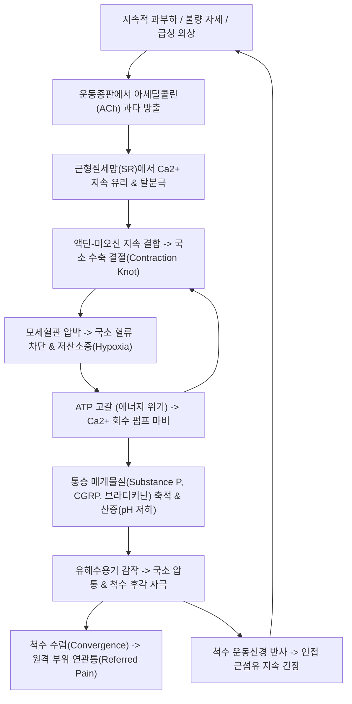

# 🩺 [[근막통증증후군]] (Myofascial Pain Syndrome / 筋膜痛症症候群, M79.1)

> **핵심 3줄 요약 (Key Summary)**:
> - 📍 병소 부위 & 해부·병태생리: 골격근의 단단한 띠(Taut band) 내에 위치하는 과민한 압통점인 통증유발점(Trigger point, TrP)과 국소 수축 결절(Contraction knot), Simons의 에너지 위기설(지속적 ACh 방출·Ca2+ 축적·허혈·대사산물 저류).
> - 🚩 전형적 임상 양상 & 3대 징후: 압박 시 원격 부위로 방사되는 고유의 연관통(Referred pain), 촉진 또는 자침 시 튀어오르는 국소연축반응(Local Twitch Response, LTR), 가동범위 제한 및 근력 저하(근위축 없음).
> - 🛠️ 핵심 감별 검사 & 한·양방 다각적 치료 전략: 전신 다발성 압통점의 [[섬유근육통]] 및 신경근병증 감별, 아시혈 자침 및 심부 건침술(Dry Needling), 약침(작약감초·소염약침), 온침·전침(2Hz 저주파 연축 유도), 활혈통락 [[갈근탕]]·[[작약감초탕]].
> - ⚠️ 응급 의뢰 레드플래그 & 악화 요인: 경추/요추 신경근 압박성 마비(Myotome 결손), 심부 감염(농양), 흉벽/배부 자침 시 기흉(Pneumothorax) 위험, 단순 TrP로 오인된 악성 골종양 의심 시 정밀 영상 검사 의뢰.

---

## 📌 목차
1. [질환 개요 & 해부학적 병태생리](#1-질환-개요--해부학적-병태생리)
2. [병태생리 메커니즘 & 생체역학적 악순환 네트워크](#2-병태생리-메커니즘--생체역학적-악순환-네트워크)
3. [임상 증상 & 이학적 검사(Physical Exam) 알고리즘](#3-임상-증상--이학적-검사physical-exam-알고리즘)
4. [감별 진단 매트릭스 (Differential Diagnosis)](#4-감별-진단-매트릭스-differential-diagnosis)
5. [한의 통합 치료 프로토콜 (침·약침·추나·한약)](#5-한의-통합-치료-프로토콜-침약침추나한약)
6. [양방 치료 & 병용·의뢰 기준 (Conventional Treatment & Referral)](#6-양방-치료--병용의뢰-기준-conventional-treatment--referral)
7. [재활 운동 & 생활습관 티칭 가이드](#6-재활-운동--생활습관-티칭-가이드)
8. [💡 사용자 진료실 핵심 필기 & 임상 노하우 (Melt-In 잔여 심화 집약)](#7--사용자-진료실-핵심-필기--임상-노하우-melt-in-잔여-심화-집약)
9. [출처 및 학술 참고 문헌 (References)](#8-출처-및-학술-참고-문헌-references)

---

## 1. 질환 개요 & 해부학적 병태생리

![[Trigger_Point_Complex.jpg|450]]
> [그림 1: 근막통증증후군의 병태생리적 기초. 상부 [[승모근]] 내 형성된 단단한 띠(Taut band, 적색 음영)와 이를 현미경적으로 확대한 근섬유 내 국소 수축 결절(Contraction knot)의 구조 도해]

* **질환 정의 및 개요**:
  * 골격근과 이를 둘러싼 근막 내에 과민한 지점인 통증유발점(Myofascial Trigger Point, MTrP)이 형성되어, 국소 통증뿐만 아니라 특정 피부분절과 무관하게 원격지로 투사되는 고유의 연관통(Referred pain)과 자율신경계 증상을 야기하는 임상 증후군입니다.
  * 1차 외래에서 만성 근골격계 통증 환자의 약 30~85%에서 원인 또는 주요 기여 요인으로 관찰되는 가장 흔한 근육 질환입니다.
* **관련 해부학적 구조물**:
  * **골격근 및 근절 (Sarcomere)**: 액틴과 미오신 필라멘트가 겹치는 근수축 단위. MTrP 부위에서는 근절이 영구적으로 과단축된 수축 결절(Contraction knot)을 형성하고, 인접한 근절은 보상적으로 과신장(Stretched)되어 장력을 형성합니다.
  * **단단한 띠 (Taut Band)**: 수축 결절을 포함하는 근섬유들이 직렬로 팽팽하게 긴장되어 근육 주행 방향을 따라 밧줄처럼 만져지는 구조물.
  * **신경근접합부 (Neuromuscular Junction, NMJ)**: 운동신경 말단과 운동종판(Motor endplate) 사이의 시냅스 간극. 운동종판의 기능 이상(Motor endplate noise)이 MTrP 형성의 시발점입니다.
  * **호발 근육군**:
    * 두경부/견배부: [[승모근]], [[견갑거근]], [[판상근]], [[흉쇄유돌근]], [[극하근]], [[능형근]]
    * 요배부/골반부: [[요방형근]], [[둔근]], [[이상근]], [[장요근]], [[척추기립근]]

---

## 2. 병태생리 메커니즘 & 생체역학적 악순환 네트워크

![[Trapezius_TriggerPoints.jpg|380]]
> [그림 2: 상부 [[승모근]]의 대표적 통증유발점(TP1, 검은 십자)과 그로부터 유발되어 후두부, 측두부, 하악각으로 투사되는 전형적인 '물음표(?)' 패턴의 연관통(Referred pain, 적색 점선 및 면적) 도해]

### 1) 통합 가설 (Integrated Hypothesis) & 에너지 위기설 (Energy Crisis)
* David Simons와 Janet Travell이 제안하고 Jay Shah의 생화학적 연구로 검증된 핵심 메커니즘입니다.
* **ACh 지속 유출**: 손상된 운동신경 말단에서 아세틸콜린이 비정상적으로 소포체 단위로 지속 분비되어 근세포막의 칼슘 통로가 열립니다.
* **국소 지속 수축과 허혈**: 유리된 칼슘 이온에 의해 근절이 지속 수축하여 모세혈관을 짓누르고 국소 허혈과 저산소증이 발생합니다.
* **ATP 고갈**: 미토콘드리아가 산소 부족으로 ATP 생성을 중단하면, 칼슘 이온을 근형질세망으로 되돌려 보내는 능동 수송 펌프($\text{Ca}^{2+}\text{-ATPase}$)가 작동을 멈추어 근절이 이완되지 못하는 '국소 사후경직(Local rigor mortis)' 상태에 빠집니다.
* **생화학적 염증 칵테일**: 활동성 TrP 주변 미세투석액 분석 결과, Substance P, CGRP, 브라디키닌, 세로토닌, 노르에피네프린, TNF-$\alpha$, IL-1$\beta$가 농축되어 있으며 pH는 4~5 수준으로 심각하게 산성화되어 있습니다.

### 2) 연관통 (Referred Pain)의 신경생리학적 기전
* **척수 후각 수렴-투사설 (Convergence-Projection Theory)**: TrP에서 기원한 C섬유 및 A-$\delta$ 구심성 신호가 척수 후각의 광역 역치 뉴런(Wide Dynamic Range, WDR neuron)에 시냅스할 때, 동일 분절의 피부나 다른 근육에서 오는 감각 신호와 수렴됩니다.
* 뇌는 이를 TrP 부위가 아닌 해당 신경 분절이 투사하는 원격 부위(예: 상부 승모근 TrP $\rightarrow$ 측두부 두통; 극하근 TrP $\rightarrow$ 전면 삼각근 및 상완 외측 방사통)의 통증으로 인지합니다.

---

## 3. 임상 증상 & 이학적 검사(Physical Exam) 알고리즘

### 1) 주소증 및 3대 핵심 징후
* **활동성 통증유발점 (Active MTrP)**: 자극하지 않아도 자발통(Spontaneous pain)과 연관통을 일으키며, 환자가 평소 호소하던 '익숙한 통증'을 재현합니다.
* **잠재성 통증유발점 (Latent MTrP)**: 평소에는 자발통이 없으나 압박 시에만 통증과 연관통을 유발합니다. 관절 가동범위 제한과 근력 약화의 숨은 원인입니다.
* **국소연축반응 (Local Twitch Response, LTR)**: 팽팽한 띠를 수직 방향으로 빠르게 튕기듯 누르거나(Snapping palpation), 침술 바늘로 TrP 중심부를 정확히 관통할 때 근섬유가 순간적으로 불수의적으로 펄떡거리며 수축하는 현상입니다.

### 2) 필수 진단 기준 (Simons Diagnostic Criteria)

| 필수 진단 항목 (Major Criteria) | 임상적 확인 방법 |
| :--- | :--- |
| **단단한 띠 (Taut band)** | 촉진 가능한 골격근 내 밧줄 같은 단단한 근섬유 띠 |
| **국소 압통점 (Focal tenderness)** | 팽팽한 띠 내 가장 예민하게 압통을 느끼는 결절 부위 |
| **환자 통증의 재현 (Recognition of pain)** | 결절 압박 시 평소 느끼던 임상 증상과 동일한 통증 발현 |
| **가동범위 제한 (Limitation of ROM)** | 근육의 완전 신장(Stretching) 시 통증에 의한 가동 제한 |

* **확진을 돕는 부속 소견 (Minor Signs)**:
  * 튕김 촉진 시 **국소연축반응(LTR)** 관찰.
  * 압박 지속 시 해당 근육 고유의 **연관통(Referred pain)** 영역으로 통증 방사.
  * 자율신경계 증상: 국소 혈관 수축(창백/냉감), 발한, 기모 반응(소름), 결막 충혈 등.

---

## 4. 감별 진단 매트릭스 (Differential Diagnosis)

| 감별 질환 | 호발 병소 및 병태생리 | 주소증 및 연관통 양상 | 특이적 이학적 소견 및 감별점 |
| :--- | :--- | :--- | :--- |
| [[근막통증증후군]] (본 질환) | 국소 골격근 (TrP, 에너지 위기) | 비대칭적, 국소~분절성 연관통 | Taut band 및 LTR 존재, 압박 시 연관통 |
| [[섬유근육통]] (FMS) | 중추신경계 감작 (통증 조절 실패) | 전신 대칭성 다발통 (4개 사분면) | 광범위 압통점(18개 중 11개), 피로·불면 수반 |
| [[경추 추간판 탈출증]] | 경추 신경근 압박 (Disc 탈출) | 피부분절(Dermatome) 주행 방사통 | [[스펄링 검사]] 양성, 감각저하·근력저하·DTR 저하 |
| [[회전근개 파열]] | 극상근/극하근 건의 구조적 손상 | 외전/거상 시 통증, 야간통 | Drop arm sign 양성, 초음파/MRI 건 결손 |
| 근염 / 다발근염 | 자가면역성 근섬유 괴사 염증 | 대칭성 근위부 근력 약화, 근육통 | 근효소(CK) 고도 상승, 근전도 다상성 전위 |

---

## 5. 한의 통합 치료 프로토콜 (침·약침·추나·한약)

![[Dry_needling_and_infrared_light_on_the_back_of_body.jpg|450]]
> [그림 3: 배부 및 견배부 근막통증증후군 환자에 대한 침술 자침(Dry needling) 및 적외선(IR) 온열 병용 치료 임상 실사. 팽팽한 띠 내 TrP(아시혈)에 대한 심부 자침을 통해 수축 결절을 물리적으로 파괴하고 국소 혈류를 재관류시키는 과정]

### 1) 침구 치료 (Acupuncture & Dry Needling)
침술은 MTrP 치료에서 가장 강력하고 입증된 중재법으로, 한의학의 **아시혈(阿是穴)** 개념과 현대 서양의학의 **건침(Dry Needling)**은 95% 이상 일치합니다:
* **심부 침습 자침술 (Trigger Point Deactivation)**:
  * TrP 부위를 핀치 파지(Pincer palpation) 또는 평면 촉진으로 고정한 뒤 호침(0.25~0.30mm)을 수직으로 신속히 자입.
  * 바늘 끝이 수축 결절을 통과할 때 순간적인 **국소연축반응(LTR)**이 나타나며, 이는 비정상적인 종판 전위를 즉시 종결시키고 과다 축적된 $\text{Ca}^{2+}$을 재분산시키는 지표가 됩니다.
* **전침 치료 (Electroacupuncture)**:
  * 2Hz 저주파: 엔도르핀 및 다이노르핀 분비를 유도하여 중추성 진통을 유발하고, 리드미컬한 근수축을 통해 정체된 대사 찌꺼기를 펌핑 배출.
  * 100Hz 고주파: 척수 관문조절설(Gate control)을 자극하여 급성 연관통을 신속히 차단.
* **온침 및 뜸 치료**: 국소 혈관 확장을 통한 허혈 상태 개선.

### 2) 약침 치료 (Pharmacopuncture)
* **작약감초 약침**: 백작약의 파에오니플로린(Paeoniflorin)과 감초의 글리시리진(Glycyrrhizin) 성분이 골격근 세포 내 칼슘 유입을 억제하여 즉각적인 근육 연축 완화 및 경련 해소.
* **중성어혈 / 소염 약침**: 국소 산증과 염증 칵테일(Substance P, TNF-$\alpha$)을 중화하고 미세순환을 촉진하기 위해 TrP 중심부와 주변 결합조직에 0.1~0.3cc씩 포인트 주입.

### 3) 추나 치료 및 근막 이완술 (Chuna & Myofascial Release)
* **허혈성 압박술 (Ischemic Compression)**: 엄지나 주두(Elbow)로 환자가 참을 수 있는 한계(통증 6~7/10)까지 30~90초간 지속 압박한 뒤 서서히 떼어 반동성 충혈(Reactive hyperemia)을 유도.
* **신전-냉각 기법 (Stretch and Spray)**: 환부 근육을 수동적으로 점진적 신전시키면서 냉각 스프레이를 분사하여 통증 관문을 차단하고 안전하게 최대 근 길이를 회복.
* **관절 교정 추나**: 해당 근육이 부착된 척추 분절 및 관절(예: 상부 승모근 $\rightarrow$ 경추 C1-C4, 늑골 제1관절)의 부정렬(Subluxation)을 정형 교정.

### 4) 한약 치료 (Herbal Medicine)
한의학적으로 MPS는 풍한습(風寒濕) 사기가 근육과 경락에 침범한 **근비(筋痺)** 또는 기혈 응체로 인한 **어혈조락(瘀血阻絡)**입니다:
* **급성 발작기 (근육 경직, 급격한 담 결림)**:
  * [[갈근탕]] (葛根湯): 갈근의 푸에라린 성분이 혈관을 확장하고 승모근·경항부 근육 연축을 신속히 해소.
  * [[작약감초탕]] (芍藥甘草湯): 골격근 근육통 및 급성 경련의 '천연 근이완제'.
* **만성 고정통 (기혈어혈, 난치성 결절)**:
  * 서경활혈탕(舒經活血湯) 또는 활락효영단: 관절과 근육 심부의 어혈과 담음을 제거하고 순환을 회복.
* **기혈 허약형 (만성 피로, 재발성)**:
  * 쌍화탕(雙和湯) 또는 십전대보탕 가 갈근·위령선: 근육과 인대에 영양을 공급(영근골)하여 긴장 저항력 증대.

---

## 6. 양방 치료 & 병용·의뢰 기준 (Conventional Treatment & Referral)

> 🎯 **이 섹션의 목적**: 환자가 **양방약을 이미 복용 중인 경우가 많다.** 한의원 1차 진료에서 양방 치료를 이해하고, 병용 가능·주의·금기를 판단하며, 언제 의뢰할지 결정한다.

* **약물 치료 (Medication)**:
  * 계열별 약물·용량·기간 — 국내 처방 관행 반영.
  * 작용 기전과 한의 치료와의 상호작용.
* **비약물 시술 (Procedures)**:
  * 주사·차단술·물리치료·보조기 등.
* **수술·시술 적응증 (Surgical Indication)**:
  * 언제 수술로 가는가 — 절대·상대 적응증, 수술 후 경과.
* **한의 병용 판단 (Combination Therapy)**:
  * 병용 가능 / 주의 / 금기. 복용 중 환자의 감량 타이밍·반동 현상.
* **양방·전문과 의뢰 기준 (Referral Criteria)**:
  * 응급 의뢰 트리거와 전문과 의뢰 기준(정형외과·신경외과·내과 등).

	(작성 필요)

---

## 7. 재활 운동 & 생활습관 티칭 가이드

* **자가 근막 이완 (Self-Myofascial Release, SMR)**:
  * 폼롤러나 마사지 볼(라크로스 공)을 이용하여 통증 결절 부위를 체중으로 30~60초간 지그시 압박. 통증이 잦아들면 인접 관절을 천천히 능동 움직임(Active release).
* **가동범위 내 부드러운 정적 신전 (Static Stretching)**:
  * 근육이 차가운 상태에서 과도하게 당기면 오히려 신전 반사(Stretch reflex)로 TrP가 악화되므로, 온찜질 후 호흡을 내쉬며 20~30초간 부드럽게 늘림.
* **자세 교정 및 작업 환경 수정**:
  * 모니터 높이 조절(눈높이), 턱 당김(Chin-in), 어깨를 으쓱하는 거상 습관 교정. 50분 작업 후 반드시 5분간 기지개 및 견갑골 후인(Retraction) 운동.

---

## 8. 💡 사용자 진료실 핵심 필기 & 임상 노하우 (Melt-In 잔여 심화 집약)

* **진료실 TrP 촉진 3초 감별 팁**:
  * 환자가 "여기가 아파요"라고 가리키는 부위는 대부분 **연관통 영역(Referred zone)**이지 실제 원인인 TrP가 아닙니다.
  * 예: "관자놀이가 쑤시고 편두통이 와요" $\rightarrow$ 측두근을 누르기 전에 반드시 **상부 [[승모근]]의 앞쪽 두터운 능선**과 **[[흉쇄유돌근]] 쇄골지**를 꼬집듯 잡아보아야 합니다. 거기를 꽉 쥐었을 때 "어! 바로 그 머리 아픈 자리가 그대로 찌릿하게 울려요" 하면 100% MPS성 두통입니다.
* **LTR(국소연축반응) 유도 자침 노하우**:
  * 호침을 천천히 밀어 넣으면 TrP가 바늘을 피해 미끄러집니다. Taut band를 손가락으로 팽팽하게 펴서 바닥에 고정한 뒤, 바늘 끝으로 TrP 중심을 전광석화처럼 찔러 넣고 살짝 뺐다가 각도를 3도 정도 틀어 재진입(Fanning / 피스토닝)하면 펄떡하는 LTR과 함께 즉각 이완됩니다.
* **기흉(Pneumothorax) 절대 주의 구역**:
  * 견갑골 내측의 [[능형근]], 상부 [[승모근]], 쇄골상와의 [[사각근]] 자침 시 절대로 흉벽 방향으로 깊숙이 직자하지 않습니다. 반드시 늑골면과 평행하게 사자하거나, 근육을 들어 올려 뼈를 등지고 자침해야 합니다.

---

## 9. 출처 및 학술 참고 문헌 (References)

* Simons DG. Review of enigmatic MTrPs as a common cause of enigmatic musculoskeletal pain and dysfunction. *J Electromyogr Kinesiol*. 2004;14(1):95-107. [PMID: 14759755](https://pubmed.ncbi.nlm.nih.gov/14759755/)
  - `[연구 요약]`: 근막통증증후군의 병태생리학적 핵심 기전인 '통합 가설'과 '에너지 위기설'을 총괄 정리하고, 근절 수축 결절 및 운동종판의 비정상적 전기 활동에 대한 과학적 근거를 확립한 기념비적 종설.
* Shah JP, Thaker N, Heimur J, Aredo JV, Sikdar S, Gerber L. Myofascial Trigger Points Then and Now: A Historical and Scientific Perspective. *PM R*. 2015;7(7):746-761. [PMID: 25724849](https://pubmed.ncbi.nlm.nih.gov/25724849/)
  - `[연구 요약]`: 생체 내 미세투석(Microdialysis) 기술을 통해 활동성 TrP 주변의 생화학적 염증 인자(Substance P, CGRP, IL-1b, TNF-a) 및 산성 pH를 실시간 측정하여 분자 수준에서 MPS의 생물학적 실체를 증명.
* Gattie E, Cleland JA, Snodgrass S. The Effectiveness of Trigger Point Dry Needling for Musculoskeletal Conditions by Physical Therapists: A Systematic Review and Meta-analysis. *J Orthop Sports Phys Ther*. 2017;47(3):133-149. [PMID: 28158962](https://pubmed.ncbi.nlm.nih.gov/28158962/)
  - `[연구 요약]`: 근막통증 및 근골격계 질환 환자에서 트리거포인트 건침(Dry needling, 침 치료)의 통증 완화 및 기능 개선 효과를 입증한 대규모 체계적 문헌고찰 및 메타분석.

<!-- 보관 태그(1회용·링크오류, 필요시 복원): M79.1 -->
