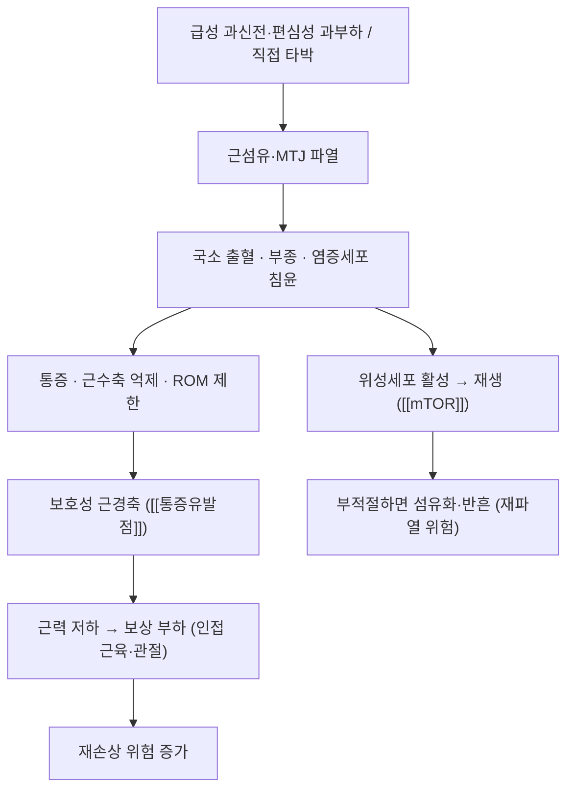

# 🩺 근손상 (Muscle Injury / 筋肉損傷)

> 🖼️ **이미지 미확보** — 이번 회차에 환부 실사·영상 소견·해부 도해를 확보하지 못했다. 다음 보강 회차에서 초음파 소견과 근육 해부 도해·테이핑 실사를 채울 대상이다.

> **핵심 3줄 요약 (Key Summary)**:
> - 📍 병소 부위 & 해부·병태생리: 근섬유·근건접합부(MTJ)의 파열로 **외상성(좌상·타박·파열)** 과 **비외상성(운동 유발 근손상·[[횡문근융해증]]·허혈·독성)** 으로 나뉜다.
> - 🚩 전형적 임상 양상: 급성 외상 시 '뚝' 소리·즉시 통증, 국소 압통·멍·부종, 저항 수축 시 통증 재현, 정도에 따라 근력 저하·결손 촉지.
> - 🛠️ 핵심 검사 & 치료 전략: MMT·ROM·촉진으로 등급을 추정하고 [[크레아틴키나아제]]·초음파·MRI로 확인. 초기 보호 후 **등척성 → 등장성 → [[편심성 운동]]** 순서로 점진적 재부하한다.
> - ⚠️ 응급 의뢰 레드플래그: 완전 파열(함몰·기능 상실), 소변 콜라색·심한 종창·전신 증상([[횡문근융해증]]), 진행하는 신경 마비.

---

## 📌 목차
1. [질환 개요 & 해부학적 병태생리](#1--질환-개요---해부학적-병태생리)
2. [병태생리 메커니즘 & 생체역학적 악순환 네트워크](#2--병태생리-메커니즘---생체역학적-악순환-네트워크)
3. [임상 증상 & 이학적 검사(Physical Exam) 알고리즘](#3--임상-증상---이학적-검사-physical-exam--알고리즘)
4. [감별 진단 매트릭스 (Differential Diagnosis)](#4--감별-진단-매트릭스--differential-diagnosis-)
5. [한의 통합 치료 프로토콜 (침·약침·추나·한약)](#5--한의-통합-치료-프로토콜--침-약침-추나-한약-)
6. [양방 치료 & 병용·의뢰 기준 (Conventional Treatment & Referral)](#6-양방-치료--병용의뢰-기준-conventional-treatment--referral)
7. [재활 운동 & 생활습관 티칭 가이드](#6--재활-운동---생활습관-티칭-가이드)
8. [💡 사용자 진료실 핵심 필기 & 임상 노하우 (Melt-In 잔여 심화 집약)](#7----사용자-진료실-핵심-필기---임상-노하우--melt-in-잔여-심화-집약-)
9. [출처 및 학술 참고 문헌 (References)](#8--출처-및-학술-참고-문헌--references-)

---

## 1. 질환 개요 & 해부학적 병태생리

- **정의**: 근육(근섬유·근건접합부·근막)의 손상. 임상에서는 ① **외상성 근손상**(좌상/strain, 타박, 열상, 완전 파열) ② **비외상성 근손상**(운동 유발 근손상, [[횡문근융해증]], 허혈, 독성·약물, 대사성)으로 나눠 접근한다
- **외상성 좌상의 등급(임상 추정)**:
  - **1도(경증)**: 소수 근섬유 손상, 통증은 있으나 근력 저하 미미
  - **2도(중등도)**: 부분 파열, 저항 수축 시 통증·근력 저하·국소 부종
  - **3도(중증)**: 완전 파열, 결손 촉지·기능 상실
- **호발 부위·인자**: 급성 스프린트·방향 전환(햄스트링·[[대퇴사두근]]·[[비복근]]), 비훈련 상태의 갑작스러운 부하, 이전 손상력, 피로·수면 부족, 나이
- **관련 해부 구조**: 근건접합부(MTJ), 근내 결합조직, 근육 내 신경·혈관, 근육을 감싸는 근막 → 손상 시 국소 출혈·부종이 근막 내압을 올려 통증을 키운다

## 2. 병태생리 메커니즘 & 생체역학적 악순환 네트워크

- **재생 3상**: ① 손상·출혈 ② 염증·대식세포 청소 ③ 재생(위성세포 증식·근관 형성). 이때 **저부하 점진적 부하**가 정상 근관 형성에 유리하고, 완전 무부하는 섬유화·위축을 키운다
- **운동 유발 근손상과의 구분**: 비외상성은 부하 후 지연성으로 나타나며([[지연성 근육통]]), 혈중 [[크레아틴키나아제]]·[[지질과산화]]로 추적한다
- **위험 신호**: 손상 범위가 크면 CK가 크게 오르고 미오글로빈이 신장을 통과해 [[급성신손상]]으로 이어질 수 있다 → [[횡문근융해증]]

## 3. 임상 증상 & 이학적 검사(Physical Exam) 알고리즘

- **증상**: 급성 통증(순간 '뚝' 소리), 국소 압통·멍·부종, 저항 수축 시 통증, 정도에 따른 근력 저하·기능 제한
- **이학적 검사**:
  - 촉진: 결손부 함몰·근복 형태 변화(완전 파열), 압통 위치
  - 근력: MMT 등급(0~5), 좌우 비교 — 통증성 약화(부분 손상)와 진성 마비(신경 손상) 구분
  - ROM: 능동·수동 ROM 제한 양상
  - 특수 검사: 부위별 저항 검사(예: 햄스트링은 복와위 무릎 굴곡 저항)
- **검사실**: [[크레아틴키나아제]](시계열), 미오글로빈, 소변 색·잠혈, 전해질·신기능(대규모 손상 시)
- **영상**: 초음파(급성부 종창·섬유 연속성), MRI(손상 범위·정도, 스포츠 복귀 판단). 운동선수 과사용 손상의 영상 감별은 문헌 정리가 있다([PMID 42390527](https://pubmed.ncbi.nlm.nih.gov/42390527/))

## 4. 감별 진단 매트릭스 (Differential Diagnosis)

| 감별 질환 | 병소·원인 | 임상 차이 | 감별 포인트 |
| :--- | :--- | :--- | :--- |
| 근손상(본 질환) | 근섬유·MTJ 파열 | 외상 직후 국소 통증·멍 | 저항 수축 시 통증 재현, 결손 촉지 |
| 인대 염좌 | 관절 인대 | 관절선 통증·불안정 | 스트레스 검사 양성 |
| 건 파열·건병증 | 건 실질·부착부 | 부하 의존성 통증, 특정 동작 | 초음파 건 연속성, [[힘줄병증]] 감별 |
| [[횡문근융해증]] | 광범위 근손상 | 종창·콜라색 소변·전신 증상 | CK 대폭 상승, 신기능 이상 |
| 심부정맥혈전증 | 심부 정맥 | 한쪽 종창·열감 | 좌우 차이, 도플러 |
| 신경 손상(포착·압박) | 신경 | 저림·감각 저하·근력 저하 | 신경 분포 양상, 신경전도 |

## 5. 한의 통합 치료 프로토콜 (침·약침·추나·한약)

- **단계별 접근(원칙)**:
  - **급성기(0~72시간)**: 손상 부위 **직접 자극은 최소화**한다. 원위 취혈·경락 유도 자침, 부종 조절을 위한 냉온 요법, 안정·압박·거상 교육이 먼저다
  - **회복기(3일~2주)**: 국소 아시혈·근복 주위 자침 + 저빈도 [[전침]], 저농도 약침([[자하거약침]]·[[신바로약침]])으로 통증·부종 조절. 강한 자극성 약침(고농도 [[봉약침]])은 피한다
  - **재활기(2주~)**: 어혈 제거 후 점진적 부하. [[도수치료]]·[[근막이완술]]·[[심부 횡마찰 마사지]]로 유착·반흔 관리, 유착이 심하면 [[건침]]을 선택적으로 사용
- **한약 치료**: 급성기 활혈거어·소종지통([[순기활혈탕]]·[[서경탕]] 운용), 회복기 强筋骨·補肝腎([[독활기생탕]]·[[오적산]] 운용). 변증에 따라 처방을 고른다
- **주의**: 급성 출혈기 부항(습식)·강자극 도침은 손상 범위를 넓힐 수 있다. 항응고제 복용자는 모든 자극 시술 전 확인한다

## 6. 양방 치료 & 병용·의뢰 기준 (Conventional Treatment & Referral)

> 🎯 **이 섹션의 목적**: 급성 근손상 환자는 응급·정형외과 초기 처치 후 한의원에 오는 경우가 많다. 초기 처치를 이해하고 병용 시점을 정한다.

- **약물 치료 (Medication)**: [[NSAIDs]]·[[아세트아미노펜]]로 통증 조절. 다만 염증 반응이 재생에 필요하다는 관점에서 초기 NSAIDs가 회복을 지연시킬 수 있다는 **논쟁**이 있으므로 단정하지 않는다
- **비약물 시술 (Procedures)**: 초기 보호·압박·거상, 필요 시 보조기·테이핑. 혈종이 크면 흡인·배액을 고려한다(정형외과)
- **수술·시술 적응증 (Surgical Indication)**: 완전 파열, 큰 혈종, 근육 탈출(근막 파열), 근위 햄스트링 2개 이상 건 파열·[[좌골신경]] 압박 → 정형외과 수술 상담
- **한의 병용 판단 (Combination Therapy)**:
  - **병용 가능**: 72시간 이후 국소 자극·약침 + 단계적 부하 운동
  - **주의**: 항응고제 복용자, 신장질환자, 2도 이상 손상 급성기
  - **금기**: 완전 파열 부위 직접 자극·강한 신연, 콜라색 소변 동반 시 모든 강자극
- **전문과 의뢰 기준 (Referral Criteria)**:
  - **응급**: 기능 완전 상실·결손 촉지, 소변 콜라색·무뇨·심한 종창, 진행하는 감각·운동 마비
  - **일반**: 2~3주 호전 없음, CK 지속 상승, 반복 재손상

## 7. 재활 운동 & 생활습관 티칭 가이드

- **4단계 점진적 재부하(전 단계 통증 4/10 이하·24시간 내 2점 초과 증가 없음)**:
  1. **등척성(통증 없는 범위)** 30~45초 × 3~5회 — 근수축 자체로 통증이 심하면 무부하 관절가동운동부터
  2. **등장성 저부하**(3-0-3 템포) — 근위축 방지, 가동범위 회복
  3. **[[편심성 운동]]** — 근-건 강도·재손상 저항성 회복 → [[점진적 과부하]]
  4. **파워·스포츠 특이 동작**([[에너지 저장·방출 운동]]) — 복귀 기준: 통증 없음 + 좌우 근력 차 10% 이내 등
- **생활 티칭**: 회복기 수분·단백질·수면, 손상 부위 온열은 부종이 가라앉은 뒤, 재개 초기에는 준비운동 시간을 2배로 → [[지연성 근육통]] · [[걷기 운동]]
- **환자 스크립트**: "근육이 다친 뒤에는 완전히 쉬기보다 아프지 않은 범위에서 조금씩 힘을 주는 것이 회복에 좋습니다. 다만 멍·부기가 심하거나 소변이 콜라색이면 즉시 검사가 필요합니다. 복귀는 통증이 아니라 근력과 동작 완성도로 결정합니다."

## 8. 💡 사용자 진료실 핵심 필기 & 임상 노하우 (Melt-In 잔여 심화 집약)

- **급성기 문진 3문**: ① 언제 어떤 동작에서 다쳤는가(즉시 통증 vs 지연 통증) ② 멍·부기의 범위 ③ 소변색·전신 증상. 이 세 답으로 **외상성 vs 비외상성, 응급 vs 외래**를 가른다.
- **시술 타이밍**: 손상 직후 강한 자극(도침·고농도 약침·습식부항)은 손상 범위를 넓힐 수 있다. 72시간을 기준으로 **원위 취혈·경락 유도 → 국소 자극** 순으로 전환한다.
- **환자 오해 교정**: "멍이 들었으니 완전히 쉬어야 한다"는 인식이 재활을 지연시킨다. 1도·2도 손상에서는 **통증 범위 내 조기 능동 운동**이 표준임을 설명한다.
- **기록**: 손상 부위·등급(추정)·초기 CK와 추적 CK·MMT 좌우 차·복귀 기준을 첫 방문에 문서화한다.

## 9. 출처 및 학술 참고 문헌 (References)

1. **Skeletal muscle overuse injury: pathophysiological mechanisms, molecular pathways, and rehabilitation strategies (2026)**. *Frontiers in Physiology*. [PMID: 42311330](https://pubmed.ncbi.nlm.nih.gov/42311330/)
   - **[연구 요약]** 과사용성 근손상의 분자 경로(염증·재생·섬유화)와 재활 전략을 정리 — 점진적 재부하 원칙의 배경 문헌이다.
2. **Mendes-Junior EM, et al. (2021)**. *Nutrients*, 14(1):78. [PMID: 35010953](https://pubmed.ncbi.nlm.nih.gov/35010953/)
   - **[연구 요약]** 편심성 운동 유발 근손상에서 CK·지질과산화·사이토카인 변화를 추적한 인체 교차시험 — 비외상성 근손상의 지표 해석 근거다.
3. **Imaging characterization and differential diagnosis of DOMS in athletes (2026)**. *Skeletal Radiology*. [PMID: 42390527](https://pubmed.ncbi.nlm.nih.gov/42390527/)
   - **[연구 요약]** 운동 유발 근손상의 영상 소견과 외상성 근손상 감별 기준을 정리했다.
4. **Exertional rhabdomyolysis: does elevated blood creatine kinase foretell renal failure? (2006)**. *Current Sports Medicine Reports*, 5(2):87-91. [PMID: 16529674](https://pubmed.ncbi.nlm.nih.gov/16529674/)
   - **[연구 요약]** 운동성 횡문근융해에서 CK 상승과 신부전 위험의 관계를 검토했다 — 상승 폭만으로 예후를 단정하지 않는다.

---

## 관련 노트

- [[지연성 근육통]] · [[횡문근융해증]] · [[크레아틴키나아제]] · [[편심성 운동]] · [[등척성 운동]] · [[점진적 과부하]] · [[에너지 저장·방출 운동]] · [[급성신손상]] · [[통증유발점]] · [[2026-09-30_재활운동의학_심층리뷰]] 1번
