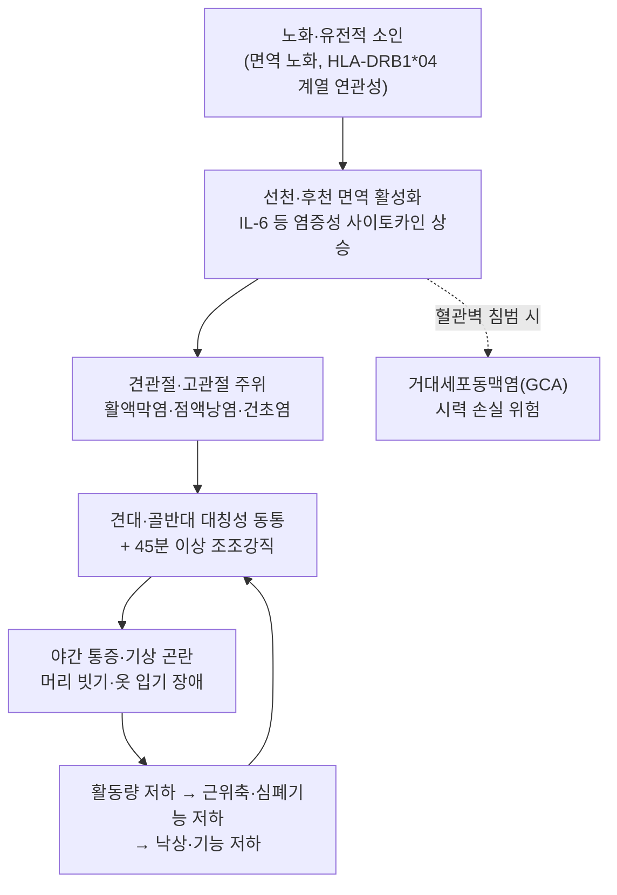

# 🩺 [[다발성 근육통]] (Polymyalgia Rheumatica / 類風濕性多發筋痛, ICD-10 M35.3 / KCD M35.3)

> **핵심 3줄 요약 (Key Summary)**:
> - 📍 병소 부위 & 해부·병태생리: 골격근 자체의 염증 질환이 **아니라**, 견관절대([[견관절]]·[[견갑대]])와 골반대([[고관절]]·[[전자부]]) 주위의 **활액막염·점액낭염·건초염(extrasynovial/extracapsular inflammation)** 이 주 병소이다. 견봉하점액낭([[견봉하점액낭]]), 상완이두근 장두 건초([[상완이두근 장두 건초]]), 견관절 활액막, 대퇴 전자부 점액낭([[전자부 점액낭]])이 대표적 침범 부위이며, IL-6 매개 전신 염증이 배경에 깔린다.
> - 🚩 전형적 임상 양상 & 3대 징후: ① **50세 이상** 고령에서 ② **양측성 견관절대·골반대 동통** ③ **45분 이상 지속되는 조조강직([[조조강직]])** 이 3대 축이다. 여기에 ESR/CRP 상승, 그리고 **소량 스테로이드에 대한 극적(수일 내) 반응**이 붙으면 진단적 가치가 매우 높다.
> - 🛠️ 핵심 감별 검사 & 한·양방 다각적 치료 전략: 이학적으로 견관절 **능동 외전 제한**·고관절 **내회전 제한**을 확인하고, ESR·CRP·RF·ACPA·CK·TSH·혈청단백전기영동을 세트로 시행한다. 초음파에서 [[견봉하점액낭염]]·[[상완이두근 건초염]]·[[전자부 점액낭염]] 확인 시 2012 EULAR/ACR 분류기준 점수에 가산된다. 한방에서는 [[비증(痺證)]] 변증에 따라 침·약침·한약([[독활기생탕]], [[강활승습탕]])으로 통증·강직·기능을 관리하되, **스테로이드를 한방 단독으로 대체하려 시도하지 말고 양방과 병행·의뢰**하는 것이 원칙이다.
> - ⚠️ 응급 의뢰 레드플래그 & 악화 요인: **새로운 두통, 두피 압통, 턱 파행(jaw claudication), 복시, 갑작스러운 시력 저하**는 [[거대세포동맥염]](GCA, [[Giant Cell Arteritis]]) 동반을 시사하는 **안과적 응급**이며 즉시 상급병원 안과·류마티스내과 의뢰 대상이다. 또한 **발열·야간 조한·체중 감소·비전형적 통증 부위**는 악성종양·감염을 배제해야 하는 적신호이다. 급성 염증기에 강한 도수·심부 마사지·고강도 관절가동은 금기.

---

## 📌 목차
1. [질환 개요 & 해부학적 병태생리](#1-질환-개요--해부학적-병태생리)
2. [병태생리 메커니즘 & 생체역학적 악순환 네트워크](#2-병태생리-메커니즘--생체역학적-악순환-네트워크)
3. [임상 증상 & 이학적 검사(Physical Exam) 알고리즘](#3-임상-증상--이학적-검사physical-exam-알고리즘)
4. [감별 진단 매트릭스 (Differential Diagnosis)](#4-감별-진단-매트릭스-differential-diagnosis)
5. [한의 통합 치료 프로토콜 (침·약침·추나·한약)](#5-한의-통합-치료-프로토콜-침약침추나한약)
6. [양방 치료 & 병용·의뢰 기준 (Conventional Treatment & Referral)](#6-양방-치료--병용의뢰-기준-conventional-treatment--referral)
7. [재활 운동 & 생활습관 티칭 가이드](#6-재활-운동--생활습관-티칭-가이드)
8. [💡 사용자 진료실 핵심 필기 & 임상 노하우 (Melt-In 잔여 심화 집약)](#7--사용자-진료실-핵심-필기--임상-노하우-melt-in-잔여-심화-집약)
9. [출처 및 학술 참고 문헌 (References)](#8-출처-및-학술-참고-문헌-references)

---

## 1. 질환 개요 & 해부학적 병태생리

![[다발성근육통_통증분포_병태생리도해.png|450]]
> 출처: Wikimedia Commons, Twisp (Public domain)

* **질환 정의 및 분류**:
  * **정의**: [[다발성 근육통]](Polymyalgia Rheumatica, PMR)은 **원인 미상의 전신 염증성 류마티스 질환**으로, 주로 **50세 이상 고령**에서 발병하여 **견관절대(shoulder girdle)와 골반대(hip girdle)의 동통 및 현저한 조조강직**을 특징으로 한다. 이름에 '근육통(myalgia)'이 들어가지만 **실제 병소는 골격근이 아니라 관절 주위 연부조직(점액낭·건초·활액막)**이라는 점이 임상적으로 가장 중요한 포인트다 (Mahmood & Nelson, 2020, PMID 32868305; Salvarani & Macchioni, 1997, PMID 9217726).
  * **분류 및 코드**: ICD-10 **M35.3**, KCD(한국표준질병사인분류) **M35.3**. '류마티스열(rheumatic fever)'이나 '류마티스관절염(RA)'과는 **완전히 다른 질환**이므로 명칭에 끌려 RA로 오인하지 않도록 주의한다.
  * **호발 연령/성별**: 50세 미만에서는 **매우 드물다**(50세 미만 진단 시 진단 자체를 재검토할 것). 호발 연령은 **70대 전후**이며, **여성에서 2~3배** 많다 (Michet & Matteson, 2008, PMID 18390527).
  * **역학**: 50세 이상 인구에서 유병률은 대략 **0.5~1%** 수준으로 보고되며, 북유럽·북미 등 백인 인구에서 상대적으로 흔하다. **국내(한국인) 정확한 유병률 및 발병률 데이터는 근거 미확인** — 인구 기반 역학 연구가 제한적이다.
  * **직업군 특성**: 특정 직업과의 인과관계는 보고된 바 없으며, **직업력보다는 연령이 핵심 위험 인자**이다 (근거 미확인 항목).

* **관련 해부학적 구조물**:
  * **골격 및 관절**: 일차적으로 [[견관절]](glenohumeral joint)·[[견쇄관절]]·[[고관절]]이 침범된다. 다만 RA와 달리 **관절 연골 파괴(미란)는 거의 일어나지 않는다**는 점이 해부·병리학적으로 결정적 차이다.
  * **근육 및 근막**: 근육 자체는 염증의 일차 표적이 아니다. 그러나 통증으로 인한 **사용 저하(disuse)** 로 [[삼각근]], [[극상근]], [[극하근]], [[견갑하근]](회전근개 4근)과 [[둔근군]], [[장요근]]에 **이차적 위축·약화**가 발생한다. 즉 '일차 병소는 점액낭/건초, 이차 손상은 근육'이라는 2단 구조로 이해해야 한다.
  * **신경 및 혈관**: 말초신경 포착이 주 병태는 아니므로 **피부분절을 따르는 방사통·저림은 PMR의 전형적 소견이 아니다.** 이러한 증상이 두드러지면 경추 신경근병증이나 다른 질환을 먼저 의심한다. 단, **거대세포동맥염(GCA)** 동반 시 [[측두동맥]], [[안동맥]] 등 두개외 혈관에 육아종성 혈관염이 생길 수 있어 별도의 응급 평가가 필요하다 (Dasgupta & Cimmino, 2012, PMID 22388996).

---

## 2. 병태생리 메커니즘 & 생체역학적 악순환 네트워크

![[다발성근육통_견봉하점액낭_해부도해.jpg|450]]
> 출처: Wikimedia Commons, Hellerhoff (CC BY 3.0)

### 1) 염증 및 면역 병태 기전
* **일차 병소의 위치**: PMR의 염증은 **관절 내 활액막(intra-articular synovitis)** 과 함께 **관절 외 점액낭·건초(extra-articular bursitis/tenosynovitis)** 를 광범위하게 침범한다. 이것이 RA(활액막 중심, 미란 진행)나 다발근염(근육 자체 염증)과 병리적으로 갈리는 지점이다 (Mahmood & Nelson, 2020, PMID 32868305).
* **사이토카인 환경**: **IL-6가 중심 매개체**로 알려져 있으며, 이는 GCA와의 병태생리적 연속성을 설명하는 근거가 된다. IL-6 표적 치료제가 GCA에서 사용되는 것도 이 맥락이다.
* **유전적 소인**: HLA-DRB1*04 계열 대립유전자와의 연관성이 보고되어 있으나, **PMR 단독으로의 확정적 유전 표지자는 근거 미확인** 수준으로 보는 것이 안전하다 (Salvarani & Macchioni, 1997, PMID 9217726).
* **GCA와의 관계**: PMR 환자의 상당수(문헌별로 대략 **15~20%**)에서 GCA가 동반되며, 반대로 GCA 환자의 약 절반에서 PMR 양상이 나타난다. 두 질환은 **동일 스펙트럼상의 질환**으로 취급하는 것이 임상적으로 안전하다 (Dasgupta & Cimmino, 2012, PMID 22388996).

### 2) 생체역학적 연쇄 반응 (Kinetic Chain)
* **상부 연쇄**: 견관절 능동 운동 제한 → [[견갑흉곽 리듬]] 붕괴 → [[상부승모근]]·[[견갑거근]] 과긴장 및 [[흉추]] 후만 증가 → 경추 전방 두위 악화.
* **하부 연쇄**: 고관절 통증 → [[둔근군]] 억제 → 보행 시 [[대퇴근막장근]]·[[장경인대]] 보상 과부하 → 슬관절·요추 부하 증가.
* **전신 악순환**: 통증 → 활동 저하 → 근감소(sarcopenia)·심폐기능 저하 → 피로 악화 → 통증 역치 하락 → 통증 심화. 즉 PMR의 기능 저하는 **염증 단독이 아니라 '염증 + 탈조건화(deconditioning)'의 이중 타격**으로 진행되며, 이 때문에 치료 프로토콜에 **운동 재활이 반드시 포함**되어야 한다.

---

## 3. 임상 증상 & 이학적 검사(Physical Exam) 알고리즘

### 1) 주소증 및 임상 증상
* **동통 부위**: 양측 [[견관절]]·[[상완부]]·[[견갑부]] 통증이 가장 흔하고, 이어서 [[골반대]]·[[대퇴부]]·[[둔부]] 통증이 동반된다. **대칭성**이 전형적이다. 경부·요부 통증으로 호소하는 경우도 있다.
* **조조강직**: **45분 이상** 지속되는 아침 강직이 특징적이며, 2012 EULAR/ACR 분류기준에서도 **>45분**이 점수 항목(2점)으로 반영되어 있다 (Dasgupta & Cimmino, 2012, PMID 22388996).
* **기능 장애**: 머리 빗기, 옷 입기(특히 상의 착탈), 차에서 내리기, 침대에서 일어나기 등 **근위부 동작**에서 곤란이 두드러진다.
* **전신 증상**: 피로감, 권태, 식욕 저하, **체중 감소**, 미열, 우울감.
* **운동·감각 장애**: **진성 근력 저하는 PMR의 소견이 아니다.** 만약 실제 근력 저하(계단 오르기 불가, 머리 들기 불가 등)가 확인되면 **다발근염·피부근염·갑상선근병증·스타틴 유발 근병증**을 강하게 의심해야 한다.
* **감각 이상**: 저림·방사통은 비전형적. 동반 시 [[경추 신경근병증]], [[수근관증후군]] 등 감별 필요.

### 2) 필수 이학적 검사법 (Physical Examination)
* [[견관절 능동 관절가동범위 검사]]: **능동 외전·외회전 제한**이 현저한 반면 **수동 가동범위는 상대적으로 보존**되는 패턴이 관찰된다. 통증성 제한이 양측성으로 나타나면 PMR 가능성이 크다.
* [[고관절 내회전 검사]](환자를 앙와위로 하고 고관절을 굴곡 90° 후 내회전): PMR에서 **내회전 제한 및 통증**이 흔히 확인되며, 2012 기준의 'hip pain or limited hip ROM' 항목에 해당한다.
* [[삼각근 압통 촉진]] 및 [[대퇴 전자부 압통 촉진]]: 점액낭 병소를 반영. 견봉하점액낭·전자부 점액낭 병변과 대응된다.
* [[관절 종창 촉진]]: PMR에서는 **관절 종창이 미미하거나 없다.** 뚜렷한 활액막 비후·종창이 말초 소관절에서 확인되면 RA를 우선 고려한다.
* [[신경학적 선별검사]](감각·심부건반사·근력): PMR에서는 **정상**이어야 하며, 이상 소견은 다른 진단을 시사하는 '음성 대조 지표'로 활용한다.
* **검사실 세트**: [[ESR]](대개 현저히 상승, 흔히 40~100 mm/h), [[CRP]] 동시 상승. 정상혈색소성 빈혈, 혈소판 증가, ALP 상승이 동반될 수 있다. **RF·ACPA는 음성**, **CK 등 근효소는 정상**이어야 한다.
* **영상**: [[견관절 초음파]] 및 [[고관절 초음파]]가 가장 실용적이다. 관찰 소견은 아래와 같다.
  * 견관절: **견봉하점액낭염(subdeltoid bursitis)**, **상완이두근 장두 건초염**, **견관절 활액막염**
  * 고관절: **전자부 점액낭염(trochanteric bursitis)**, 고관절 활액막염·건초염
  * 이 소견들은 2012 EULAR/ACR 분류기준의 **초음파 가산 항목**에 그대로 반영되어 있다 (Dasgupta & Cimmino, 2012, PMID 22388996; Schmidt, 2013, PMID 23392601).

### 3) 2012 EULAR/ACR 잠정 분류기준 (요약)
**필수 조건(전부 충족)**: ① 연령 ≥50세 ② 양측 견관절 동통 ③ CRP 및/또는 ESR 상승.

| 항목 | 점수 |
| :--- | :---: |
| 조조강직 >45분 | 2 |
| 고관절 통증 또는 고관절 가동범위 제한 | 1 |
| RF 및 ACPA 음성 | 2 |
| 기타 관절 침범 없음 | 1 |
| **초음파(시행 시 가산)** — 한쪽 견관절에 견봉하점액낭염/상완이두근 건초염/견관절 활액막염 | 1 |
| **초음파** — 양측 견관절 해당 | 1 |
| **초음파** — 한쪽 고관절에 전자부 점액낭염/활액막염/건초염 | 1 |

* **판정**: 초음파 미시행 시 **≥4점**, 초음파 시행 시 **≥5점**이면 분류상 PMR에 부합한다 (Dasgupta & Cimmino, 2012, PMID 22388996).
* ⚠️ **중요**: 위 기준은 어디까지나 **분류기준(classification criteria)** 이며 진단기준(diagnostic criteria)이 아니다. 즉 **연구·코호트 분류용**이므로, 개별 환자의 임상 진단은 **감별 질환 배제 + 임상 경과**로 판단해야 한다.

---

## 4. 감별 진단 매트릭스 (Differential Diagnosis)

| 감별 질환 | 호발 병소 및 원인 | 주소증 차이점 | 특이적 이학적/검사 소견 |
| :--- | :--- | :--- | :--- |
| [[다발성 근육통]] (본 질환, PMR) | 견관절대·골반대 점액낭/건초/활액막 | **대칭성 근위부 동통 + 45분 이상 조조강직**, 50세 이상 | ESR·CRP 상승, RF/ACPA 음성, **소량 스테로이드에 수일 내 극적 반응**, 초음파상 견봉하점액낭염 |
| [[노인형 류마티스관절염]] (Late-onset RA) | 말초 소관절(수근·MCP·PIP) 활액막 | 말초 소관절 종창·압통, 미란 진행, 아침 강직 지속 | **RF/ACPA 양성**, 방사선 미란, 스테로이드 반응이 PMR만큼 극적이지 않음 |
| [[거대세포동맥염]] (GCA) | 측두동맥 등 중·대혈관 육아종성 혈관염 | **새 두통, 두피 압통, 턱 파행, 복시, 시력 저하** | ESR 극도 상승, 측두동맥 압통·결절, **조직검사상 거대세포**, 안과적 응급 |
| [[다발근염]]/[[피부근염]] | 골격근 자체 염증 | **실제 근력 저하**가 주 증상, 동통은 상대적으로 부차적 | **CK 상승**, EMG 이상, 근생검 이상, 피부 병변(피부근염) |
| [[섬유근통]] | 중추성 통증 증후군 | 전신 광범위 통증, 수면장애, 피로 | **ESR/CRP 정상**, 압통점 양성, 스테로이드 무반응 |
| [[갑상선기능저하증]] | 대사성 근병증 | 근육통·경직·부종·체중 증가·추위 민감 | **TSH 상승**, FT4 저하, 서맥 |
| [[다발골수종]]/[[전이성 골종양]] | 형질세포/종양 침윤 | 야간통·체중 감소·비전형 부위 통증 | **혈청단백전기영동 이상**, 빈혈, 고칼슘혈증, 골병변 |
| [[감염성 심내막염]] | 감염성 전신 염증 | 발열·오한·심잡음 | 혈액배양 양성, 심초음파상 vegetation |
| [[스타틴 유발 근병증]] | 약물성 근독성 | 약물 시작 후 근육통, 근위부 위약 | CK 상승(정상일 수도 있음), **약물 중단 후 호전** |
| [[결정성 관절염]] (CPPD/통풍) | 관절 내 결정 침착 | 급성 단관절 또는 소수 관절 발작 | 관절액 결정 확인, 편광현미경 |

* **실전 원칙**: PMR은 **배제 진단(exclusion diagnosis)의 성격이 강하다.** 견관절대·골반대 통증을 호소하는 50세 이상 환자에서는 위 표의 질환을 **한 번에 스크리닝 세트**(ESR, CRP, RF, ACPA, CK, TSH, CBC, 혈청단백전기영동, 신기능/간기능)로 걸러내는 것이 효율적이다.

---

## 5. 한의 통합 치료 프로토콜 (침·약침·추나·한약)

![[다발성근육통_견관절후면근육_시술해부도해.png|450]]
> 출처: Gray's Anatomy, Wikimedia Commons (Public domain)

> ⚠️ **전제**: PMR은 **스테로이드 반응성이 매우 높은 염증성 전신질환**이다. 한의 치료는 **통증·강직·기능 회복을 돕는 보조·병행 축**으로 설정하고, **스테로이드 치료를 한방 단독으로 대체하려 시도하는 것은 금기**이다. 특히 GCA 동반 가능성이 있는 경우 한의원 단독 관리는 부적절하며 **즉시 의뢰**가 우선한다. PMR 자체에 대한 한의 치료의 고품질 무작위대조시험(RCT) 근거는 **근거 미확인**이며, 이하 내용은 변증론치 원칙과 임상 경험에 기반한 제안이다.

* **침구 치료 (Acupuncture)**:
  * **국소 근위 취혈**: [[견정(GB21)]], [[견우(LI15)]], [[견료(TE14)]], [[견정(EX-UE)]], [[천종(SI11)]], [[극천(SI3)]], [[견정혈]] 주위 아시혈.
  * **원위 취혈**: [[곡지(LI11)]], [[합곡(LI4)]], [[외관(TE5)]], [[후계(SI3)]], [[양릉천(GB34)]], [[위중(BL40)]], [[족삼리(ST36)]], [[현종(GB39)]], [[곤륜(BL60)]].
  * **골반대**: [[환도(GB30)]], [[질변(BL54)]], [[거료(GB29)]], [[대장수(BL25)]], [[팔료(BL31-34)]].
  * **전침(電針) 세팅**: 통증·강직 위주에는 **저주파(2~10 Hz)** 를 기본으로, 만성화·근위축 동반 시 **변주파(2/100 Hz 교대)** 를 고려한다. 자극량은 **약~중자극**으로 시작하고, 고령 환자에서는 **강자극·장시간 유침을 피한다**(기립성 저혈압·실신 위험).
  * **온침/뜸**: 찬 기운에 악화되는 [[한습비(寒濕痺)]] 양상에서 [[온침]] 및 [[관원(CV4)]]·[[기해(CV6)]]·[[명문(GV4)]] 뜸을 병행할 수 있다.
* **약침 치료 (Pharmacopuncture)**:
  * **목표점**: 견봉하점액낭 주위, 상완이두근 장두 건초 주행부, 견갑극 상연, [[대둔근]]·[[중둔근]] 부착부(전자부 점액낭 주위), [[장요근]] 압통점.
  * **추천 약침류**: [[자하거 약침]](조직 재생·허손 보익), [[홍화 약침]](활혈거어·소염), [[당귀 약침]], [[산삼 약침]](기력 보강). 만성·허증 양상에는 [[녹용 약침]] 고려.
  * **주의**: [[봉독 약침]]은 강력한 항염 효과가 보고되어 있으나, **전신 자가면역·염증성 질환에서의 안전성 근거는 확립되어 있지 않다**(근거 미확인). 스테로이드 복용 중 환자에서는 **감염·면역 억제 상태**를 감안해 신중히 판단하고, 소량 테스트 후 반응을 확인한다.
  * **시술 각도**: 견봉하점액낭 접근은 견봉 외측 하방에서 **피하~근막층으로 얕게**(과심부 삽입 시 관절강 내 주입 위험), 전자부는 **대퇴 전자 후상방에서 골면 접촉 직전까지** 진행하는 것이 안전하다.
* **추나 치료 (Chuna Manipulation)**:
  * **급성 염증기(통증·강직 심한 시기)**: **강한 도수·관절 교정술은 금기.** 이 시기에는 [[근막이완(JS) 수기]]를 **극도의 경량**으로 적용하거나 생략한다.
  * **아급성~회복기**: [[경추 관절가동 추나]], [[흉추 신전 가동]], [[견갑골 가동 추나]](견갑흉곽 리듬 회복), [[고관절 가동 추나]]를 **무통 범위 내**에서 시행.
  * **금기**: 고령 + 스테로이드 장기 복용 환자는 **골다공증 위험**이 높으므로 [[흉추 강압 교정]]·[[경추 회전 교정]] 등 **고속저진폭(HVLA) 수기는 원칙적으로 피한다.** 시행 전 골절 위험 평가가 선행되어야 한다.
* **한약 치료 (Herbal Medicine)**:
  * **변증 구분**:
    * **풍한습비(風寒濕痺)** — 한랭 악화, 둔중감: [[강활승습탕]], [[오적산]] 가미.
    * **기혈양허(氣血兩虛)** — 피로·창백·만성 경과: [[독활기생탕]], [[십전대보탕]] 합방.
    * **간신휴손(肝腎虧虛)** — 고령·만성·기능 저하: [[독활기생탕]] 가미, [[좌귀환]]·[[우귀환]] 계열.
    * **담어조락(痰瘀阻絡)** — 야간통·자통: [[신통축어탕]], [[계지복령환]] 가미.
  * **대표 처방**: [[강활승습탕]](상지·견배 통증), [[독활기생탕]](고령·만성·허증), [[계지작약지모탕]](관절 열감·부종 동반), [[작약감초탕]](근경련·강직 완화 목적).
  * ⚠️ **병용 주의**: 스테로이드·NSAIDs·면역억제제 복용 환자에서 한약을 병용할 때는 **간기능·신기능·소화기 부작용 및 상호작용 모니터링**이 필요하다. 특히 [[부자]]([[오두]]) 계열 포함 처방은 **독성 및 심혈관 부작용** 위험이 있어 고령자에서 신중해야 한다.

---

## 6. 양방 치료 & 병용·의뢰 기준 (Conventional Treatment & Referral)

> 🎯 **이 섹션의 목적**: 환자가 **양방약을 이미 복용 중인 경우가 많다.** 한의원 1차 진료에서 양방 치료를 이해하고, 병용 가능·주의·금기를 판단하며, 언제 의뢰할지 결정한다.

* **약물 치료 (Medication)**:
  * 계열별 약물·용량·기간 — 국내 처방 관행 반영.
  * 작용 기전과 한의 치료와의 상호작용.
* **비약물 시술 (Procedures)**:
  * 주사·차단술·물리치료·보조기 등.
* **수술·시술 적응증 (Surgical Indication)**:
  * 언제 수술로 가는가 — 절대·상대 적응증, 수술 후 경과.
* **한의 병용 판단 (Combination Therapy)**:
  * 병용 가능 / 주의 / 금기. 복용 중 환자의 감량 타이밍·반동 현상.
* **양방·전문과 의뢰 기준 (Referral Criteria)**:
  * 응급 의뢰 트리거와 전문과 의뢰 기준(정형외과·신경외과·내과 등).

	(작성 필요)

---

## 7. 재활 운동 & 생활습관 티칭 가이드

* **이완 및 스트레칭 (Stretching)**:
  * [[견관절 전방 관절낭 스트레칭]]: 문틀 잡고 몸통 회전, 30초 × 3회.
  * [[흉추 신전 스트레칭]]: 폼롤러를 등 상부에 두고 신전, 1분.
  * [[장요근 스트레칭]]: 반무릎 자세에서 골반 전방 당김, 좌우 30초 × 3회.
  * 원칙: **통증 3/10 이하 범위**에서만, 아침 강직이 심한 시간대는 피하고 **오후(체온 상승 후)** 시행.
* **강화 및 안정화 운동 (Strengthening)**:
  * [[견갑 안정화 운동]]: [[전거근]]·[[하부승모근]] 활성화(월 슬라이드, 프론 Y-T-W).
  * [[회전근개 강화]]: 밴드 외회전·내회전, **저부하 고반복**(10~15회 × 2~3세트).
  * [[둔근 강화]]: 사이드 라잉 힙 어브덕션, 브리징, 클램셸.
  * [[심부 코어 안정화]]: 복횡근·다열근 활성화, 데드버그.
  * ⚠️ 고령자에서는 **주 2회 저강도**로 시작, 진행 속도를 늦춘다.
* **신경 활주 운동 (Neurodynamics)**:
  * PMR은 신경 포착성 질환이 아니므로 **신경 활주 운동은 일차 치료가 아니다.** 다만 이차적으로 동반된 [[경추 신경근병증]]이나 [[수근관증후군]]이 확인된 경우에 한해 [[신경 슬라이딩]]·[[신경 글라이딩]]을 적용한다. **PMR 자체에 대한 신경 가동술의 효과 근거는 미확인**이다.
* **유산소 및 전신 컨디셔닝**:
  * **걷기(주 3~5회, 20~30분)**, **수중 운동(온수)** — 관절 부하를 줄이면서 전신 염증·탈조건화를 개선.
  * **낙상 예방 균형 훈련**: 한 발 서기, 탠덤 보행.
* **일상생활 자세 티칭 (Ergonomics)**:
  * **수면**: 너무 낮은 베개와 푹신한 매트리스 회피. 옆으로 잘 때 양 무릎 사이에 쿠션 삽입. 아침 기상 시 **바로 일어나지 말고** 침상에서 가벼운 관절 운동 후 기상.
  * **착의**: 단추 많은 옷보다 **앞지퍼·큰 단추** 의류 권장. 신발은 **긴 신발주걱** 사용.
  * **가사/작업**: 팔을 어깨 위로 드는 작업(높은 선반 청소)을 **낮은 발판으로 대체**.
  * **온열**: 아침 강직에는 **온찜질(40℃ 내외, 15~20분)** 이 냉찜질보다 유리.
  * **영양**: 장기 스테로이드 사용 시 **칼슘·비타민 D 보충**과 골밀도 검사가 필요하며, 이는 양방 처방 영역이므로 담당의와 협의하도록 환자에게 안내.

---

## 8. 💡 사용자 진료실 핵심 필기 & 임상 노하우 (Melt-In 잔여 심화 집약)

> [!IMPORTANT]
> **본 노트는 기존 원문 필기 없이 신규 작성된 노트이다.** 따라서 상부 1~6번 섹션에는 PMR의 정의·해부·병태·증상·검사·치료·생활지도 전반을 **온전히 융합(Melt-In)하여** 서술하였다. 7번 섹션에는 상부에 담기 어려운 **진료실 실전 운영 노하우**만을 별도로 집약한다.

* **상부 섹션에 미처 다 담지 못한 고유 원문 필기**:
  * PMR은 **"이름은 근육통인데 병소는 근육이 아니다"** — 이 한 문장이 진료실 설명의 핵심이다. 환자가 "근육이 아프다"고 하면 "근육을 감싸고 있는 주머니(점액낭)와 힘줄집에 염증이 생긴 것"이라고 번역해 설명하면 이해도가 크게 올라간다.
  * **"50세 미만은 PMR이 아니다"** 를 진료실 철칙으로 삼는다. 40대 환자가 양측 어깨 통증 + ESR 상승으로 오면 PMR보다 **RA, 혈관염, 악성종양, 감염**을 먼저 본다.
  * PMR은 **기능 소실이 큰 질환**이다. 통증 자체보다 "머리를 못 빗고, 바지를 못 입고, 침대에서 못 일어난다"는 **ADL 붕괴**가 환자의 실제 고통이므로, 문진에서 ADL 항목을 반드시 구체적으로 캐묻는다.

* **진료실 실전 감별 & 치료 노하우**:

  * **1. 실전 문진 체크리스트 (내원 5분 내 확인)**
    1. **나이** — 50세 이상인가? (50세 미만이면 PMR 가능성 급감)
    2. **양측성** — 좌우 어깨(또는 고관절) **모두** 아픈가? 편측이면 다른 진단 우선.
    3. **조조강직 시간** — 아침에 굳는 시간이 **45분을 넘는가?**
    4. **ADL** — 머리 빗기 / 옷 입기 / 의자에서 일어나기가 힘든가?
    5. **두통·턱 파행·시력 변화** — "씹을 때 턱이 아프세요? 눈이 흐려지거나 두 개로 보이세요?" → **한 개라도 yes면 즉시 의뢰**.
    6. **체중 감소·야간 발열·야한(night sweats)** — 악성종양·감염 스크리닝.
    7. **약물력** — 스타틴, 갑상선 호르몬, 최근 시작한 신규 약물.
    8. **과거력** — 최근 1~2년 내 건강검진(암 검진) 여부, 결핵 병력(스테로이드 시작 전 반드시 확인).

  * **2. 치료 순서 및 손맛 노하우**
    * **진단 우선 원칙**: 한의원 진료실에서 PMR이 의심되면 **치료보다 의뢰가 먼저**다. 최소한 ESR·CRP 검사 의뢰 → 류마티스내과 협진 후 한방 치료를 병행하는 순서가 안전하다. **한의원에서 스테로이드 시험 반응을 확인하려고 임의로 스테로이드를 투여해서는 절대 안 된다.**
    * **자침 순서**: ① 원위 취혈(곡지·합곡·양릉천·위중) 먼저 → ② 근위 취혈(견정·견우·견료·환도) → ③ 국소 아시혈. 고령 환자는 **와위(仰臥位) 또는 측와위**로 눕혀 시행하고, 좌위 자침은 실신 위험이 있어 피한다.
    * **약침 각도·깊이**: 견봉하점액낭은 **얕게(피하 0.5~1 cm 수준, 30° 이하 각도)** 접근. 전자부는 **측와위에서 대퇴 전자 후상방을 향해 수직에 가깝게** 접근하되 골막 자극을 피한다. 주입량은 부위당 0.5~1 cc로 제한하고, 주입 후 **압박 30초**.
    * **추나 적용 체위**: 경추·흉추 가동은 **앙와위·측와위 기반의 저강도 기법**만 사용. **회전 교정(HVLA)은 고령 + 스테로이드 복용 환자에서 골절 위험**이 있으므로 시행하지 않는 것이 안전하다.
    * **전침 세팅 팁**: 통증이 심한 초기에는 저주파(2 Hz)로 진통 위주, 경과가 길어지며 위축·경직이 두드러지면 2/100 Hz 변주파로 전환.

  * **3. 환자 티칭 스크립트 (재발 방지 및 협진 설명)**
    * **질환 설명**: "이 병은 근육 자체가 녹는 병이 아니라, 어깨와 엉덩이 관절을 감싸는 **주머니(점액낭)와 힘줄집에 염증이 생겨서** 아침에 굳고 아픈 병입니다. 그래서 피검사에서 염증 수치(ESR·CRP)가 올라갑니다."
    * **스테로이드 설명**: "이 병은 염증을 끄는 약(스테로이드)에 **아주 잘 반응하는 것**이 특징입니다. 대개 며칠 안에 통증이 크게 줄어듭니다. 다만 **증상이 좋아져도 임의로 끊으면 반드시 재발**하므로, 감량은 담당 선생님 지시대로 천천히 해야 합니다. 보통 **1~2년**에 걸쳐 줄여갑니다."
    * **한방 치료 위치 설명**: "한방 치료는 염증으로 굳은 근육과 관절을 풀어주고 통증을 줄여 **기능 회복을 돕는 역할**입니다. 스테로이드 약을 대신하는 것은 아니니 **두 가지를 같이 가져가시는 것**이 안전합니다."
    * **응급 안내 멘트(반드시 구두 + 서면)**: "혹시 **갑자기 두통이 심해지거나, 씹을 때 턱이 아프거나, 눈이 침침해지거나 두 개로 보이면** 즉시 이 한의원이 아니라 **큰 병원 응급실**로 가셔야 합니다. 눈에 문제가 생길 수 있는 합병증입니다."
    * **생활 멘트**: "아침에 굳을 때는 **억지로 안 움직이는 것보다 따뜻하게 하고 조금씩 움직이는 것**이 낫습니다. 그리고 스테로이드 약을 오래 쓰면 뼈가 약해질 수 있어서 **칼슘·비타민D와 골밀도 검사**를 꼭 챙기셔야 합니다."
    * **재발 감시 멘트**: "증상이 70~80% 좋아진 뒤에도 **피로·체중 감소·미열**이 계속되면 그냥 넘기지 말고 말씀해 주세요."

* **임상 감별 직관 팁 (One-liner)**:
  * "**양 어깨 + 양 고관절 + 아침 1시간 강직 + ESR 상승 + 50세 이상**" → 이 5개가 동시에 나오면 PMR을 최우선으로 의심한다.
  * "**어깨는 아픈데 팔을 들 수가 없다(진성 근력 저하)**" → PMR이 아니라 [[다발근염]]을 먼저 본다.
  * "**PMR이라는데 스테로이드를 써도 반응이 없다**" → 진단 재검토. RA, 악성종양, 감염, 섬유근통을 다시 배제한다.
  * "**PMR 환자가 두통을 호소한다**" → 무조건 GCA. 안과 응급.

---

## 9. 출처 및 학술 참고 문헌 (References)

1. **Mahmood SB, Nelson E (2020)**. *Polymyalgia rheumatica: An updated review*. **Cleve Clin J Med**. PMID: 32868305
   - **[연구 요약]**: PMR의 최신 개관 리뷰. 정의, 역학(50세 이상 고령, 여성 우세), 임상 양상(견관절대·골반대 대칭성 동통 및 조조강직), 검사실 소견(ESR·CRP 상승, RF/ACPA 음성), **관절 외 점액낭·건초 침범이라는 병리적 특성**, 스테로이드 치료 및 감량 전략, GCA 동반 위험을 종합적으로 정리하였다. 본 노트의 1·2·3번 섹션 서술의 주 근거로 사용.
2. **Salvarani C, Macchioni P (1997)**. *Polymyalgia rheumatica*. **Lancet**. PMID: 9217726
   - **[연구 요약]**: PMR의 고전적 종설. 질환 개념 정립, 유전적 소인(HLA 연관성) 및 면역 병태, 견관절대·골반대 침범의 임상적 특징, ESR 상승과 스테로이드 반응성, GCA와의 스펙트럼 관계를 논하였다. 병태생리 및 유전 소인 부분의 근거.
3. **Cohen MD, Ginsburg WW (1990)**. *Polymyalgia rheumatica*. **Rheum Dis Clin North Am**. PMID: 2189154
   - **[연구 요약]**: PMR의 감별진단과 임상 접근을 상세히 다룬 리뷰. 고령 환자의 근위부 통증 감별(RA, 다발근염, 섬유근통, 갑상선 질환, 악성종양 등) 및 진단적 함정을 정리하였다. 본 노트 4번 감별진단 매트릭스의 근거로 사용.
4. **Michet CJ, Matteson EL (2008)**. *Polymyalgia rheumatica*. **BMJ**. PMID: 18390527
   - **[연구 요약]**: BMJ 임상 리뷰. 역학(호발 연령 70대 전후, 여성 우세), 전형적 임상상, ESR/CRP 상승의 진단적 가치, 스테로이드 초기 용량 및 감량 기간, 재발률, 치료 합병증(골다공증 등) 모니터링을 임상 실무 관점에서 요약하였다. 1·3·6번 섹션의 임상 역학 및 치료 개요 근거.
5. **Dasgupta B, Cimmino MA (2012)**. *2012 provisional classification criteria for polymyalgia rheumatica: a European League Against Rheumatism/American College of Rheumatology collaborative initiative*. **Ann Rheum Dis**. PMID: 22388996
   - **[연구 요약]**: EULAR/ACR 공동 제정 **PMR 잠정 분류기준** 논문. 필수조건(≥50세, 양측 견관절 동통, CRP/ESR 상승)과 점수 항목(조조강직 >45분=2점, 고관절 통증/가동제한=1점, RF·ACPA 음성=2점, 기타 관절 침범 없음=1점) 및 **초음파 소견(견봉하점액낭염, 상완이두근 건초염, 견관절 활액막염, 전자부 점액낭염) 가산점**을 제시하였다. 본 노트 3번 섹션의 분류기준 표 및 초음파 항목의 직접 근거.
6. **Schmidt WA (2013)**. *[Polymyalgia rheumatica]*. **Z Rheumatol**. PMID: 23392601
   - **[연구 요약]**: PMR의 영상 진단, 특히 **초음파를 이용한 관절 주위 염증(점액낭염·건초염·활액막염) 평가**의 임상적 유용성을 다룬 독일어 종설. 초음파 기반 병소 확인 및 감별진단에서의 역할을 논하였다. 3번 섹션 영상 진단 부분의 보조 근거.

> **📌 근거 수준 표기 원칙**: 본 노트에서 "근거 미확인"으로 표기한 항목(한국인 유병률, 봉독 약침의 안전성, PMR에 대한 한의 RCT, 신경 가동술의 효과 등)은 제공된 논문 및 확인 가능한 범위에서 근거가 확립되지 않은 내용이다. 임상 적용 시 반드시 최신 문헌과 협진을 통해 재확인할 것.

<!-- 보관 태그(1회용·링크오류, 필요시 복원): ESR, PMR, M35.3 -->
