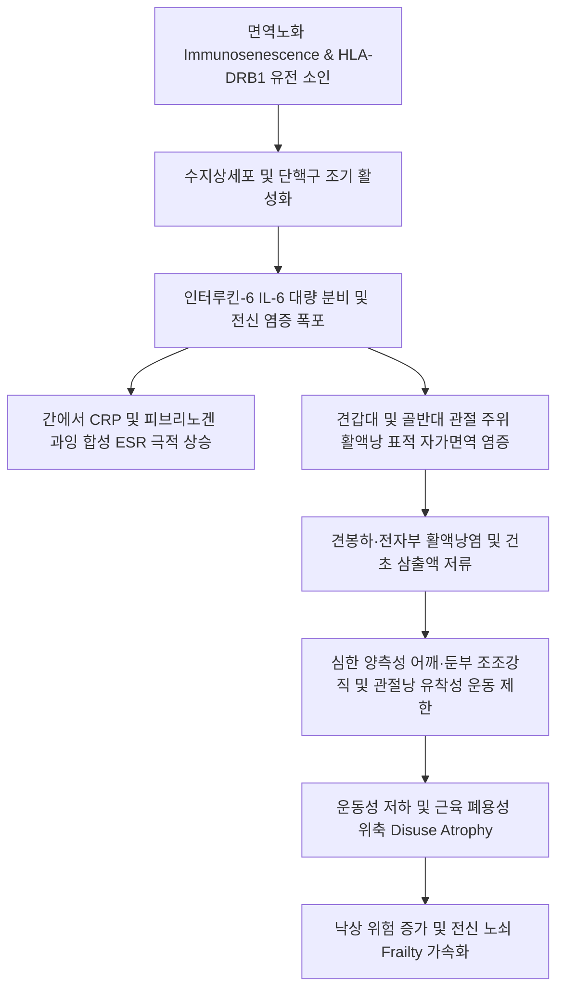

# 🩺 류마티스성 다발근통 (Polymyalgia Rheumatica, PMR)

> **핵심 3줄 요약 (Key Summary)**:
> - 📍 **병소 부위 & 해부·병태생리**: 50세 이상 고령층에서 호발하는 원인 불명의 만성 전신 염증 질환으로, 근육 자체의 괴사가 아닌 양측 견갑대(shoulder girdle) 및 골반대(pelvic girdle)의 관절 주위 활액낭(견봉하·전자부 활액낭)과 관절낭, 건초의 자가면역성 활액막염(bursitis & synovitis)이 핵심 병태생리이다.
> - 🚩 **전형적 임상 양상**: 대칭적인 양측 어깨, 목, 둔부·대퇴부의 심한 근육통과 45분 이상 지속되는 조조강직(morning stiffness), 전신 쇠약감·미열·체중 감소가 급격히 발생하며, 옷 입기나 의자에서 일어나기가 극히 어려워진다.
> - 🛠️ **핵심 검사 & 치료 전략**: 적혈구침강속도(ESR > 40~50 mm/hr) 및 CRP의 극적인 상승, 정상 크레아틴 키나아제(CK, 근육효소), 음성 자가항체(RF/anti-CCP 음성)가 특징이며, 저용량 경구 코르티코스테로이드(Prednisolone 12.5~25mg/일) 투여 후 24~72시간 이내에 극적인 통증 호전(dramatic response)을 보인다. 한의 임상에서는 비증(痺證) 변증에 기반하여 양방 스테로이드 감량기(tapering) 부작용 완화 및 재발 방지를 목표로 [[견정]]·[[견우]]·[[환도]] 자침, 소염약침, [[독활기생탕]]·[[보중익기탕]] 복용을 병용한다.
> - ⚠️ **응급 의뢰 레드플래그**: PMR 환자의 15~20%에서 [[거세포동맥염]](Giant Cell Arteritis, GCA; 측두동맥염)이 동반되므로, 새로운 두통, 측두동맥 압통·비후, 턱 파행(음식 씹을 때 턱 통증), 일과성 흑암시(amaurosis fugax)나 급성 시력 장애 발생 시 비가역적 실명을 막기 위해 즉시 고용량 스테로이드 투여 및 응급 상급병원(류마티스내과/안과)으로 전원해야 한다.

---

## 📌 목차
1. [질환 개요 & 해부학적 병태생리](#1-질환-개요--해부학적-병태생리)
2. [병태생리 메커니즘 & 생체역학적 악순환 네트워크](#2-병태생리-메커니즘--생체역학적-악순환-네트워크)
3. [임상 증상 & 이학적 검사(Physical Exam) 알고리즘](#3-임상-증상--이학적-검사physical-exam-알고리즘)
4. [감별 진단 매트릭스 (Differential Diagnosis)](#4-감별-진단-매트릭스-differential-diagnosis)
5. [한의 통합 치료 프로토콜 (침·약침·추나·한약)](#5-한의-통합-치료-프로토콜-침약침추나한약)
6. [양방 치료 & 병용·의뢰 기준 (Conventional Treatment & Referral)](#6-양방-치료--병용의뢰-기준-conventional-treatment--referral)
7. [재활 운동 & 생활습관 티칭 가이드](#7-재활-운동--생활습관-티칭-가이드)
8. [💡 사용자 진료실 핵심 필기 & 임상 노하우 (Melt-In 잔여 심화 집약)](#8--사용자-진료실-핵심-필기--임상-노하우-melt-in-잔여-심화-집약)
9. [출처 및 학술 참고 문헌 (References)](#9-출처-및-학술-참고-문헌--references)

---

## 1. 질환 개요 & 해부학적 병태생리

류마티스성 다발근통(Polymyalgia Rheumatica, PMR)은 50세 이상(평균 발병 연령 70~75세)의 노년층에서 발생하는 가장 흔한 염증성 류마티스 질환 중 하나이다. 명칭에는 '다발근통(polymyalgia)'이라는 단어가 포함되어 있어 근육 자체의 질환으로 오인되기 쉬우나, 실제 해부학적 병변은 근육 조직이 아니라 **근위부 관절 및 관절 주위 활액 조직(periarticular synovial structures)**의 염증이다.

초음파 및 MRI 연구를 통해 밝혀진 PMR의 핵심 해부학적 병변은 다음과 같다:
1. **견갑대 병변**: 양측 견봉하-삼각근하 활액낭염(subacromial-subdeltoid bursitis), 상완이두근 장두 건초염(bicipital tenosynovitis), 견관절 활액막염.
2. **골반대 병변**: 양측 대퇴 전자부 활액낭염(trochanteric bursitis), 장요근 활액낭염(iliopsoas bursitis), 고관절 활액막염.
3. **경추 및 척추 병변**: 경추 극간 활액낭염(interspinous bursitis).

이러한 관절 주위 활액낭의 대칭성 무균 염증으로 인해 환자는 심한 어깨와 엉덩이의 '근육통'을 호소하게 되며, 특히 대혈관 혈관염인 [[거세포동맥염]](Giant Cell Arteritis, GCA)과 밀접한 병태생리적 연관성(동일 질환 스펙트럼의 양 극단)을 가진다.

---

## 2. 병태생리 메커니즘 & 생체역학적 악순환 네트워크

PMR의 정확한 병인은 아직 완전히 규명되지 않았으나, 노화에 따른 면역 체계의 변화(면역노화, immunosenescence), 유전적 감수성(HLA-DRB1\*04 대립유전자), 환경적 유발 인자(감염원 등)가 복합적으로 작용하는 자가면역 질환이다.

### 병태생리 3대 특징
1. **인터루킨-6(IL-6)의 중추적 역할**: IL-6는 PMR의 질병 활성도와 가장 밀접하게 비례하는 핵심 사이토카인으로, 간을 자극하여 CRP를 대량 생산하고 적혈구 침강을 촉진하여 극심한 전신 쇠약감, 미열, 체중 감소를 유도한다.
2. **근육 효소 정상과 근육 병리의 부재**: 다발성근염(Polymyositis)과 달리 근섬유의 괴사나 염증 침윤이 없으므로 혈청 크레아틴 키나아제(CK), 알돌라아제(Aldolase) 등 근육 효소 수치가 완벽히 정상이다.
3. **혈청음성(Seronegativity)**: 류마티스 인자(RF) 및 항CCP 항체(anti-CCP)가 음성이며, 자가면역 항체가 관여하는 전형적인 항체 매개 질환보다는 선천면역 및 T세포/단핵구 매개 질환의 양상을 띤다.

---

## 3. 임상 증상 & 이학적 검사(Physical Exam) 알고리즘

### 임상 증상 (Clinical Features)
- **발병 양상**: 수일~수주 사이에 급격하게 발병(환자가 통증이 시작된 날짜를 정확히 기억할 정도로 급성).
- **통증 및 강직 부위**: 양측 어깨(70~90%에서 첫 증상), 목, 골반대(엉덩이, 서혜부, 대퇴 후면)의 깊은 통증과 뻣뻣함.
- **조조강직(Morning Stiffness)**: 아침에 일어났을 때 45분 이상(대개 1~2시간 이상) 몸을 움직이기 힘들 정도로 굳어 있음.
- **기능적 장애**: 침대에서 몸을 일으키기 어려움, 셔츠를 입거나 머리를 빗지 못함, 낮은 의자에서 일어나기 어려움.
- **전신 증상(Systemic B-symptoms)**: 환자의 약 30~50%에서 미열, 만성 피로, 식욕 부진, 체중 감소 동반.
- **말초 증상**: 약 10~15%에서 손목, 무릎의 경미한 비미란성 비대칭 관절염이나 수근관 증후군, 손등의 오목부종(RS3PE 증후군 유사) 발생 가능.

### 2012 ACR/EULAR 잠정 진단 기준 (2012 Provisional Classification Criteria)
- **필수 조건**: 50세 이상, 양측 어깨 통증, 비정상적 ESR 및/또는 CRP 상승.
- **임상 점수 (초음파 미포함 시 4점 이상, 초음파 포함 시 5점 이상 시 분류)**:
  1. 조조강직 > 45분 (2점)
  2. 고관절 통증 또는 제한된 가동역 (1점)
  3. RF 및 anti-CCP 음성 (2점)
  4. 다른 관절 통증의 부재 (1점)
  5. [초음파 항목] 최소 1개 어깨의 견봉하 활액낭염/이두근 건초염 + 최소 1개 고관절 활액낭염 (1점), 양측 어깨 활액낭염/건초염 (2점).

### 이학적 검사
1. **능동적 vs 수동적 가동역 평가**:
   - 환자가 팔을 들어 올리려 할 때 통증으로 인해 능동 외전(abduction)이 90도 이하로 제한되나, 검사자가 부드럽게 받쳐 올리면 수동적 가동역은 상대적으로 보존됨(진정한 관절 유착이 아닌 통증성 억제).
2. **근력 평가**:
   - 통증으로 인해 힘을 주지 못하는 가성 근력 저하(give-way weakness)를 보이나, 통증을 배제하면 실제 근신경학적 근력 자체는 정상임.
3. **측두동맥 촉진 (필수 선별 검사)**:
   - 양측 관자놀이의 측두동맥을 촉진하여 비후, 결절, 박동 소실, 압통 유무를 반드시 확인한다 (거세포동맥염 스크리닝).

---

## 4. 감별 진단 매트릭스 (Differential Diagnosis)

| 감별 질환 | 호발 연령 | 통증 부위 및 양상 | 근육 효소 (CK) | 자가항체 (RF/CCP) | 감별 핵심 포인트 (Discriminator) |
| :--- | :--- | :--- | :--- | :--- | :--- |
| **류마티스성 다발근통 (PMR)** | 50세 이상 (평균 70대) | 양측 어깨·골반대, 심한 조조강직 | **정상** | **음성** | ESR/CRP 현저한 상승, 저용량 스테로이드 24~72시간 내 극적 호전 |
| **[[류마티스 관절염]] (노년 발병 EORA)** | 60세 이상 | 말초 대칭성 소관절 (손목, MCP/PIP) | 정상 | **양성 (80%)** | 관절 미란(erosion), 활액막 비후, 항CCP 항체 강양성 |
| **[[다발성근염]] (Polymyositis)** | 40~60대 | 근위부 대칭성 근육 (통증보다 근력 약화) | **현저한 상승 (5~20배)** | 항Jo-1 등 양성 | 통증보다 진성 근력 소실(Gowers 징후), 근전도 이상, 근생검 괴사 |
| **[[섬유근통]] (Fibromyalgia)** | 30~50대 여성 | 전신 광범위 통증, 압통점 | 정상 | 음성 | **ESR/CRP 정상**, 수면장애·두통·과민대장 동반, 스테로이드 무반응 |
| **양측 [[회전근개 증후군]] / [[견관절 유착성 관절낭염]]** | 50~70대 | 어깨 국소 통증 | 정상 | 음성 | 전신 증상 및 염증 수치 정상, 골반대 통증 없음, 수동 ROM도 완전 고정 |
| **악성 종양 부수 현상 (Paraneoplastic)** | 노년층 | 체중 감소, 골통증 | 정상/상승 | 음성 | 고령의 비전형적 PMR 증상(스테로이드 불응, 극심한 빈혈) 시 종양 선별 필수 |

---

## 5. 한의 통합 치료 프로토콜 (침·약침·추나·한약)

한의학에서 PMR은 고령으로 기혈(氣血)과 간신(肝腎)이 허약해진 상태에서 풍·한·습(風寒濕)의 사기가 경락과 근맥(筋脈)에 침범하여 영위(營衛)의 순환이 저체되어 발생하는 **비증(痺證, 頑痺, 歷節風)**의 범주로 파악한다. 

> 🎯 **한의 임상 전략의 핵심 목표**:
> 1. 양방 저용량 스테로이드 치료 초기의 통증 경감 효과를 유지하면서,
> 2. 스테로이드 장기 복용으로 인한 부작용(골다공증, 근위축, 면역저하, 쿠싱 증후군)을 완화하고,
> 3. 스테로이드 감량(Tapering) 과정에서 빈발하는 재발(Flare-up)을 억제하는 상호보완적 치료를 시행한다.

### 1) 침구 치료 (Acupuncture)
- **견갑대 취혈**:
  - [[견정]](GB21): 승모근 상부 긴장 해소 및 견배부 기혈 순환 촉진.
  - [[견우]](LI15) & [[견료]](TE14): 견봉하 활액낭 주변 삼각근 이완 및 관절내압 완화.
  - [[천종]](SI11): 극하근 건포착 해소 및 견갑골 주변 혈행 개선.
  - [[대저]](BL11): 골회(骨會) 혈위로 경항부 강직 완화.
- **골반대 취혈**:
  - [[환도]](GB30): 대퇴 전자부 활액낭 및 둔근 심부 긴장 해제, 좌골신경 순환.
  - [[질변]](BL54) & [[신수]](BL23): 신정(腎精) 보익 및 요둔부 강직 완화.
  - [[양릉천]](GB34): 근회(筋會) 혈위로 전신 근막 이완.
  - [[족삼리]](ST36): 보기보혈(補氣補血) 및 만성 피로 개선.
- **전침 치료**: 양측 견우-견료, 환도-양릉천에 2Hz 저주파 전침을 20분간 적용하여 내인성 통증 억제 물질 분비 유도.
- **간접구(뜸 치료)**: 신수, 관원, 족삼리에 온구 요법을 시행하여 양기를 북돋우고 노인성 한습(寒濕) 정체를 개선.

### 2) 약침 치료 (Pharmacopuncture)
- **주입 부위**: 견봉하 활액낭 부착부, 상완이두근 장두 건초, 대퇴 대전자 점액낭 압통점.
- **신바로약침**: 국소 연부조직 염증 제거 및 연골하 조직 보호, 각 포인트당 0.2~0.5cc 주입.
- **중성어혈약침**: 관절 주위 혈류 정체와 야간 둔통 완화 목적으로 트리거 포인트에 주입.
- **자하거약침(Hominis Placenta)**: 고령 환자의 정혈 부족과 스테로이드 투여로 인한 골다공증 예방 목적으로 족삼리, 신수에 각 0.5cc 피내·피하 주입.

### 3) 추나요법 (Chuna Manual Therapy)
- **근막 이완술(Myofascial Release)**: 견갑배신경 및 상완신경총 주위 승모근, 견갑거근, 능형근의 부드러운 수기 이완.
- **견관절·고관절 관절가동술(Mobilization)**: 염증성 통증이 심한 급성기에는 고속충격기법(HVLA)을 절대 금하며, Maitland Grade I~II의 부드러운 회전 및 축성 신연(traction) 기법만 적용하여 2차성 오십견(동결견) 유착을 방지.

### 4) 한약 치료 (변증별 방제)
- **간신부족·풍한습비형(肝腎不足·風寒濕痺型)**: 노년기 PMR의 가장 전형적인 유형. 체격이 왜소하고 허리와 다리에 힘이 없으며 날씨가 흐리면 어깨와 엉덩이가 쑤시고 굳는 경우.
  - [[독활기생탕]](獨活寄生湯) 가감: 보기혈, 보간신, 거풍습지통.
- **기혈양허·어혈조체형(氣血兩虛·瘀血阻滯型)**: 오랜 투병으로 안색이 창백하고 피로감이 극심하며 통증 부위가 고정되어 야간에 심해지는 경우.
  - [[대방풍탕]](大防風湯) 또는 [[보중익기탕]](補中益氣湯) 합 당귀수산: 비위 기운을 올려 면역을 조절하고 미세혈류 순환 개선.
- **습열울비형(濕熱鬱痺型)**: 발병 초기에 미열이 나고 관절 주위가 붓고 화끈거리며 CRP 수치가 극심하게 높은 경우.
  - [[당귀점통탕]](當歸拈痛湯) 또는 가미이묘탕(加味二妙湯): 청열이습, 활혈통락.

---

## 6. 양방 치료 & 병용·의뢰 기준 (Conventional Treatment & Referral)

### 1) 표준 양방 약물 치료
- **저용량 경구 코르티코스테로이드 (1차 표준 치료)**:
  - **초기 용량**: Prednisolone 12.5 ~ 25 mg/일 (일반적으로 15 mg/일 아침 단일 복용).
  - **치료 반응**: 적절한 용량 투여 시 24~72시간 이내에 통증과 조조강직이 70% 이상 극적으로 소실됨. (1주일 내 반응이 없으면 진단을 재고해야 함).
  - **감량(Tapering) 프로토콜**:
    - 15 mg/일을 3~4주간 유지하여 증상 호전 및 ESR/CRP 정상화 확인.
    - 4주마다 2.5 mg씩 감량하여 10 mg/일까지 도달.
    - 10 mg/일 이하에서는 1~2개월마다 1 mg씩 매우 서서히 감량.
    - 총 치료 기간은 대개 1~2년 소요되며, 급격한 감량 시 50% 이상에서 재발(relapse)함.
- **스테로이드 절약제 (Steroid-sparing agents)**:
  - 스테로이드 감량 중 반복 재발하거나 당뇨, 골다공증 등 심각한 부작용 위험이 높은 환자에서 Methotrexate (MTX, 7.5~15 mg/주) 병용 고려 (2015 EULAR/ACR 권고).
  - 최근 생물학적 제제인 IL-6 억제제(Tocilizumab, Sarilumab)가 난치성 PMR의 2차 치료제로 FDA 승인됨.
- **골보호 치료 병용**: 모든 환자에서 칼슘(1,000~1,200 mg/일) + 비타민 D(800~1,000 IU/일) 및 골밀도 검사 결과에 따른 비스포스포네이트 병용 필수.

### 2) 한의 병용 판단 및 상호작용
- **병용 적극 권장**: 스테로이드 감량기(10mg 이하 구간)에 한약(독활기생탕 등)과 침구 치료를 병용하면 부신피질 기능의 회복을 돕고 반동 현상(rebound flare)을 억제하여 스테로이드 총 누적 용량을 줄일 수 있음.
- **모니터링 주의**: 한약 복용 중에도 정기적인 혈액검사(ESR, CRP)를 추적하여 염증 지표가 안정적으로 유지되는지 감시해야 함.

### 3) 양방 전문과 및 응급 의뢰 기준
- **🚨 즉각 응급 전원 (거세포동맥염 GCA 의심 시)**:
  1. 새로운 편측 두통, 관자놀이 통증.
  2. 두피 압통(머리를 빗을 때 아픔).
  3. 측두동맥 비후, 결절, 박동 감소.
  4. 턱 파행(음식을 씹을 때 턱 근육 피로/통증).
  5. 시력 저하, 복시, 일과성 흑암시(눈앞이 캄캄해짐).
  -> 확인 즉시 실명 방지를 위해 고용량 스테로이드(Methylprednisolone 충격요법 또는 Prednisolone 40~60mg/일) 투여가 필요하므로 3차 병원 류마티스내과/안과로 응급 전원.
- **정밀 검사 의뢰**:
  - 저용량 스테로이드 15mg 투여 후 1주일이 지나도 증상 호전이 전혀 없는 경우 (악성 종양, 다발성 골수종, 감염성 심내막염 감별).

---

## 7. 재활 운동 & 생활습관 티칭 가이드

### 1) 급성 염증기 안정 및 부드러운 스트레칭
- 초기 통증이 극심할 때는 과도한 저항 운동을 피하고, 따뜻한 온찜질 후 어깨 진자 운동(Codman pendulum exercise)으로 관절 유착 방지.

### 2) 관절 가동역 유지 운동
- 수건이나 봉을 이용한 양손 전방 거상 및 외회전 스트레칭.
- 벽 기어오르기(Finger wall climbing) 운동을 통해 어깨 외전 가동역 점진적 확보.

### 3) 근감소증 및 골다공증 예방 생활 티칭
- **체중 부하 운동**: 통증 완화기에는 하루 30분 평지 걷기 운동 시행.
- **낙상 예방**: 조조강직으로 인해 아침 기상 시 낙상 위험이 높으므로, 침대에서 일어나기 전 누운 상태에서 팔다리를 가볍게 5분간 움직인 후 서서히 기립하도록 교육.
- **식이요법**: 고단백 식이와 함께 비타민 D 합성을 위한 주 3회 20분 일광욕 권장.

---

## 8. 💡 사용자 진료실 핵심 필기 & 임상 노하우 (Melt-In 잔여 심화 집약)

1. **오십견 환자로 오진하기 쉬운 함정**:
   - 노인 환자가 "양쪽 어깨가 다 굳어서 옷도 못 입겠다"며 오면 양측성 오십견(동결견)으로 쉽게 생각할 수 있다. 그러나 오십견은 수동적 가동역 자체가 물리적으로 완전히 잠겨 있는 반면, PMR은 검사자가 살살 들어주면 생각보다 팔이 많이 올라간다. 여기에 "엉덩이와 허벅지도 같이 쑤시고 아침에 일어나기 힘들다"는 병력이 더해지면 즉시 ESR/CRP를 확인해야 한다.
2. **스테로이드의 기적과 양날의 검**:
   - PMR 환자에게 저용량 스테로이드를 투여하면 환자가 "하룻밤 사이에 다시 태어난 것 같다"며 명의 소리를 듣게 된다. 그러나 이 드라마틱한 반응 때문에 환자가 약을 임의로 지속하거나 과용하기 쉽다. 환자에게 이것은 면역 조절을 위한 장기 치료이며, 골다공증과 당뇨 예방을 위해 한의 치료를 병용하면서 단계적으로 줄여나가야 함을 진료 초기부터 강력히 교육해야 한다.
3. **PMR 환자 내원 시마다 3대 질문 필수 체크**:
   - 진료실에 들어올 때마다 매번 물어야 한다:
     ① "머리 한쪽이 새로 지끈거리며 아프지 않으신가요?"
     ② "음식을 씹을 때 턱이 뻐근해서 쉬어야 하나요?"
     ③ "눈앞이 흐려지거나 번쩍거리거나 깜깜해진 적이 있나요?"
     이 중 하나라도 "그렇다"고 답하면 그날 즉시 류마티스내과나 대학병원 안과로 의뢰장을 써야 환자의 실명을 막을 수 있다.

---

## 9. 출처 및 학술 참고 문헌 (References)

1. **Salvarani C, et al. (2002)**. Polymyalgia rheumatica and giant-cell arteritis. *The New England Journal of Medicine*, 347(4):261-271. [PMID: 12140303](https://pubmed.ncbi.nlm.nih.gov/12140303/)

2. **Dejaco C, et al. (2015)**. 2015 Recommendations for the management of polymyalgia rheumatica: a European League Against Rheumatism/American College of Rheumatology collaborative initiative. *Annals of the Rheumatic Diseases*, 74(10):1799-1807. [PMID: 26359488](https://pubmed.ncbi.nlm.nih.gov/26359488/)

---

## 관련 노트

- [[거세포동맥염]]
- [[류마티스 관절염]]
- [[골관절염]]
- [[견관절 유착성 관절낭염]]
- [[회전근개 증후군]]
- [[섬유근통]]
- [[다발성근염]]
