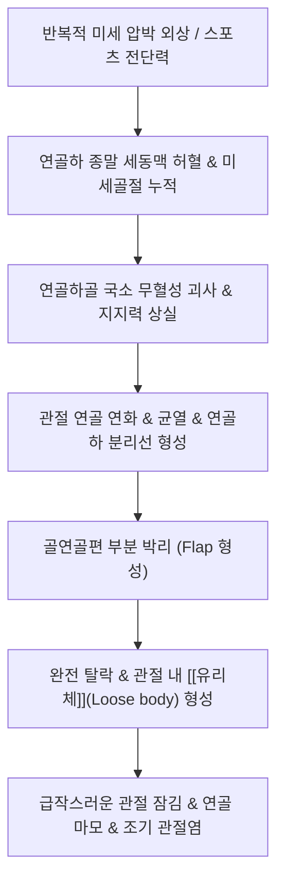

---
aliases:
  - 박리성 골연골증
  - 박리성골연골증
  - Osteochondritis Dissecans
  - OCD
  - 剝離性 骨軟骨症
  - M93.2
tags:
  - 이론
  - 질환
  - 근골격계
  - 관절
  - 소아청소년
  - 스포츠손상
title: 박리성 골연골증
date: 2026-09-17
출처: "https://pubmed.ncbi.nlm.nih.gov/29278912/"
---

# 🩺 [[박리성 골연골증]] (Osteochondritis Dissecans, OCD / 剝離性 骨軟骨症, ICD-10 M93.2)

> **핵심 3줄 요약 (Key Summary)**:
> - 📍 병소 부위 & 해부·병태생리: 관절 연골 바로 아래의 연골하골(Subchondral bone)에 반복적 미세외상 및 국소 혈류 장애로 무혈성 괴사가 발생하여 관절 연골과 골편이 분리·박리(Flap 및 [[유리체]] 형성)되는 연골 질환.
> - 🚩 전형적 임상 양상 & 3대 징후: 체중 부하 시 깊은 관절통 및 뻐근함, 보행 중 갑자기 관절이 걸려 펴지지 않는 관절 잠김(Locking) 현상, 반복적인 관절 부종(관절 수종) 및 탄발음(Clicking).
> - 🛠️ 핵심 감별 검사 & 한·양방 다각적 치료 전략: [[윌슨 검사]](Wilson's test) 유발 검사, 터널 방사선 촬영(Tunnel view X-ray) 및 MRI(ICRS 1~4기 병기 판정), 초기 비체중부하 보존 치료, 관절 내 혈행 개선 침·약침 및 골기질 강화 [[보신장골]] 한약 요법.
> - ⚠️ 응급 의뢰 레드플래그 & 악화 요인: 골편이 완전히 분리되어 관절 내를 떠도는 불안정성 유리체(ICRS 4기), 지속적인 관절 잠김으로 인한 관절면의 급격한 2차 파괴, 성장판 폐쇄 후 성인형 OCD의 보존 치료 불응 시 정형외과적 관절경 수술 의뢰.

---

## 📌 목차
1. [질환 개요 & 해부학적 병태생리](#1-질환-개요--해부학적-병태생리)
2. [병태생리 메커니즘 & 생체역학적 악순환 네트워크](#2-병태생리-메커니즘--생체역학적-악순환-네트워크)
3. [임상 증상 & 이학적 검사(Physical Exam) 알고리즘](#3-임상-증상--이학적-검사physical-exam-알고리즘)
4. [감별 진단 매트릭스 (Differential Diagnosis)](#4-감별-진단-매트릭스-differential-diagnosis)
5. [한의 통합 치료 프로토콜 (침·약침·추나·한약)](#5-한의-통합-치료-프로토콜-침약침추나한약)
6. [재활 운동 & 생활습관 티칭 가이드](#6-재활-운동--생활습관-티칭-가이드)
7. [💡 사용자 진료실 핵심 필기 & 임상 노하우 (Melt-In 잔여 심화 집약)](#7--사용자-진료실-핵심-필기--임상-노하우-melt-in-잔여-심화-집약)
8. [출처 및 학술 참고 문헌 (References)](#8-출처-및-학술-참고-문헌-references)

---

## 1. 질환 개요 & 해부학적 병태생리

![[박리성골연골증_관절연골_및_연골하골_박리_병태도해.jpg|450]]
> [그림 1: 슬관절 과간와 방사선 사진(Notch view X-ray)에서 관찰되는 내측 대퇴과(MFC) 연골하골의 골편 분리 및 골연골 결손 소견 (화살표)]

* **질환 정의 및 역학**:
  * 박리성 골연골증(Osteochondritis Dissecans, OCD)은 윤활관절의 **연골하골(Subchondral bone) 판에 국소적 허혈과 무혈성 괴사(Avascular necrosis)가 발생하여 이를 덮고 있는 초자연골(Hyaline cartilage)이 함께 약화되어 부분적 또는 완전하게 떨어져 나가는 질환**입니다.
  * 주로 활동량이 많은 10~20대 청소년 및 운동선수(축구, 농구, 체조 등)에서 호발하며, 남성이 여성보다 2~3배 많습니다.
  * 성장판이 열려 있는 연소형(Juvenile OCD)은 보존적 치료로 자연 치유율이 50~70%에 달하지만, 성장판이 닫힌 성인형(Adult OCD)은 골편 불안정성이 높아 조기 골관절염으로 이환될 위험이 큽니다.
* **관련 해부학적 3대 호발 부위**:
  * **슬관절 (Knee, 전체의 75~85%)**: 주로 **내측 대퇴골과(Medial Femoral Condyle, MFC)의 외측면(과간와 인접부, 70%)**에 호발하며, 외측 대퇴골과(LFC, 15~20%), 슬개골(5%) 순입니다.
  * **족관절 (Ankle, 전체의 10~15%)**: **거골 원개(Talus dome)**의 후내측(Posteromedial, 55%) 및 전외측(Anterolateral, 45%).
  * **주관절 (Elbow, 전체의 5~10%)**: 야구 투수나 체조선수에서 호발하는 **상완골 소두(Capitellum)**.

---

## 2. 병태생리 메커니즘 & 생체역학적 악순환 네트워크

![[박리성골연골증_Xray_및_CT_영상소견.jpg|450]]
> [그림 2: 거골(Talus) 박리성 골연골증 환자의 횡단면, 관상면, 시상면 CT 및 전후방 단순 방사선 사진: 연골하 골편의 분리 및 골 결손 병변]

### 1) 혈류 장애 및 반복 미세외상 기전
* **연골하 종말 동맥의 취약성**: 대퇴골 내측과의 특정 부위는 혈관 분포가 상대적으로 희소한 종말 동맥 구역입니다.
* **경골 과간융기(Intercondylar eminence)와의 충돌**: 슬관절이 굴곡 및 내회전될 때 경골 과간융기 또는 후방십자인대 부착부가 내측 대퇴골과와 반복적으로 충돌(Impingement)하여 미세골절과 허혈성 괴사를 유발합니다.
* **ICRS 병기 분류 (International Cartilage Repair Society)**:
  * **1기 (안정형)**: 연골 표면은 정상이나 연골하골에 허혈 및 연화 발생.
  * **2기 (부분 박리)**: 연골 표면에 균열(Fissure)이 발생하나 골편은 안정적.
  * **3기 (불안정형)**: 연골하 골편이 완전히 떨어져 나왔으나 제자리에 위치(In situ flap). 활액이 골편 아래로 유입되어 고신호강도 테두리 형성.
  * **4기 (유리체 형성)**: 골편이 관절와에서 완전히 탈락하여 관절강 내를 부유하는 관절 내 유리체(Loose body) 형성, 결손 분화구(Crater) 노출.

---

## 3. 임상 증상 & 이학적 검사(Physical Exam) 알고리즘

![[박리성골연골증_슬관절_MRI_시상면_T2_소견.jpg|450]]
> [그림 3: 슬관절 시상면 T2 강조 MRI 영상: 내측 대퇴골과의 연골하 분리선 및 골편 주위의 고신호강도 활액 침투 소견 (화살표)]

### 1) 주소증 및 임상 양상
* **초기 (1~2기)**: 활동 시 심해지는 막연한 무릎 안쪽의 뻐근한 통증, 계단 내려갈 때 불안정감, 운동 후 관절 부종.
* **진행기 (3~4기)**:
  * **관절 잠김(Locking)**: 걷거나 운동 중 갑자기 무릎이 특정 각도에서 걸려 펴지지도 굽혀지지도 않음.
  * **탄발음(Clicking) 및 덜걱거림(Giving way)**: 관절을 움직일 때 뚝 하는 소리와 함께 다리에 힘이 빠짐.
  * **관절 내 종괴 촉지**: 부유하는 유리체가 관절낭 구석(주로 슬개상낭)에서 일시적으로 만져지다 사라짐.

### 2) 필수 이학적 검사법 (Physical Examination)
* **[[윌슨 검사]](Wilson's test)**:
  * **검사 목적**: 슬관절 내측 대퇴골과(MFC)의 박리성 골연골증 특이 유발 검사.
  * **검사 방법**: 앙와위에서 환자의 무릎을 90도 굴곡시킨 후 **경골을 능동/수동으로 내회전(Internal rotation)** 시킨 상태에서 천천히 무릎을 신전(Extension)시킵니다.
  * **양성 반응**: 신전 약 30도 부근에서 경골 과간융기가 내측 대퇴과 병변에 충돌하면서 **심한 통증이 발생**하고, 이때 **경골을 외회전(External rotation)시키면 통증이 즉시 소실**됩니다.
* **관절선 압통 및 수종 검사**:
  * 슬관절 굴곡 상태에서 내측 관절면 및 대퇴과 전하방의 국소 압통 확인.
  * 부구 검사(Patellar ballottement test)로 활액막염 및 관절강 내 삼출액 저류 평가.

---

## 4. 감별 진단 매트릭스 (Differential Diagnosis)

| 감별 질환 | 병태생리 및 호발 연령 | 관절 잠김(Locking) 양상 | 진단 영상 감별 소견 |
| :--- | :--- | :--- | :--- |
| [[박리성 골연골증]] (본 질환) | 연골하골 무혈성 괴사 및 골편 박리, 10~20대 호발 | 유리체에 의한 간헐적·불규칙적 잠김 | X-ray(Notch view) 및 MRI 상 연골하 결손 분화구 |
| [[반월판 손상]] (Bucket-handle tear) | 섬유연골성 반월판의 기계적 파열, 전 연령 | 특정 굴곡 각도에서의 지속적 굴곡 구축 | MRI 상 반월판 파열선 및 과간와 전위(Double PCL sign) |
| [[슬개골 연골연화증]] | 슬개골 관절연골의 연화 및 세열화, 20~30대 여성 | 잠김 없음, 장시간 앉은 후 기립 시 뻐근함 | 축사 방사선(Merchant view) 상 슬개대퇴관절 협착 |
| [[퇴행성 관절염]] | 관절연골의 전반적 마모 및 골극 형성, 50대 이상 | 조조강직(30분 이내), 기계적 마찰음 | 체중부하 X-ray 상 관절강 협착, 골극, 연골하 경화 |
| [[활액막성 연골종증]] | 활액막의 화생으로 다발성 연골 결절 형성 | 다발성 유리체에 의한 반복적 잠김 | 수십~수백 개의 둥근 석회화 결절이 관절강 내 산재 |

---

## 5. 한의 통합 치료 프로토콜 (침·약침·추나·한약)

* **침구 치료 (Acupuncture)**:
  * **슬관절 주위 경혈**: 독비(犢鼻), 내슬안(內膝眼), 양릉천(陽陵泉), 음릉천(陰陵泉), 혈해(血海), 양구(梁丘).
  * 관절낭 심부 자침 및 저주파 전침(2~4Hz)을 인가하여 연골하골 주위 미세혈관의 일산화질소(NO) 분비 촉진, 국소 허혈 완화 및 골 재생 유도.
* **약침 치료 (Pharmacopuncture)**:
  * **자하거(인태반) 약침 / 녹용약침**: 풍부한 성장인자(FGF, TGF-β)와 펩타이드를 함유하여 연골하골 기질 재생 및 조골세포 활성화를 위해 내측 대퇴과 부착부 및 관절강 내 주입.
  * **신바로약침 / 소염약침**: 활액막염 및 관절 삼출액이 동반된 급성 부종기에 관절강 내 주입하여 염증성 사이토카인(IL-1β, TNF-α) 억제.
* **추나 치료 (Chuna Manipulation)**:
  * **관절견인 가동추나 (Traction Mobilization)**: 슬관절의 장축 견인을 통해 관절강 내 압력을 낮추고 관절 연골면 간의 과도한 압박 마찰을 제거.
  * **대퇴사두근 및 햄스트링 근막 이완(JS)**: 관절에 비정상적인 전단력을 가하는 주변 근육군의 불균형 완화.
  * ⚠️ 절대 금기: ICRS 3~4기 불안정성 골편 또는 유리체가 있는 상태에서 강한 비틀림이나 고속저진폭(HVLA) 스러스트 추나는 연골편 완전 탈락을 촉진하므로 금기.
* **한약 치료 (Herbal Medicine)**:
  * **신주골(腎主骨), 보신장골(補腎壯骨)**: 골대사를 촉진하고 연골하골 무혈성 괴사의 회복을 돕는 처방.
  * 처방: [[독활기생탕]], [[가미대보탕]], [[오적산]], [[숙지황]]·[[두충]]·[[속단]]·[[우슬]] 가미방.

---

## 6. 재활 운동 & 생활습관 티칭 가이드

* **비체중부하(Non-weight bearing) 및 체중부하 제한**:
  * 연소형 1~2기 안정형 환자는 6~8주간 목발(Crutch)을 사용하여 환측 체중 부하를 줄이고 골편의 자연 골유합 유도.
  * 달리기, 점프, 쪼그려 앉기, 축구 등 충격이 큰 운동 엄격히 제한.
* **대퇴사두근 등척성 운동 (Isometric Quad Sets)**:
  * 무릎 밑에 수건을 받치고 바닥을 누르는 대퇴사두근 등척성 수축 운동 및 하지직거상(SLR) 운동으로 관절 압박 없이 근위축 방지.
* **수영 및 실내 자전거 (저부하)**:
  * 체중 부하가 없는 자유형/배영 발차기 및 안장을 높인 저저항 고정식 자전거 타기로 관절액 순환 촉진.

---

## 7. 💡 사용자 진료실 핵심 필기 & 임상 노하우 (Melt-In 잔여 심화 집약)

* **청소년 운동선수의 무릎 통증: 단순 '성장통'으로 넘기지 말 것**:
  * 축구, 농구를 하는 중·고등학생이 "무릎 깊은 곳이 뻐근하게 아프고 붓는다"고 내원할 때 오스굿-슐라터병이나 슬개건염뿐 아니라 반드시 **[[윌슨 검사]](경골 내회전 후 신전 시 통증, 외회전 시 소실)**를 시행해야 합니다.
  * 단순 X-ray 정면/측면에서는 대퇴과 연골하 병변이 가려지므로, 의심 시 반드시 **과간와 터널 뷰(Intercondylar notch view) 방사선 촬영**을 의뢰해야 놓치지 않습니다.
* **관절 잠김(Locking)의 응급 감별**:
  * 굴곡된 상태에서 완전히 펴지지 않는 지속적 잠김이 발생하면 관절경적 정복이 필요한 반월판 양동이 손잡이형 파열(Bucket-handle tear)을 먼저 배제해야 합니다.
  * 반면 걷다가 순간적으로 뚝 걸렸다가 다리를 흔들면 다시 풀리는 간헐적 잠김은 박리성 골연골증의 **관절 내 부유 유리체(Loose body)**를 강력히 시사합니다.
* **치료 기간 및 수술 의뢰 가이드라인**:
  * 성장판이 열린 연소형(Juvenile) 1~2기는 한의 통합 보존 치료(체중부하 제한 + 침/약침 + 보골 한약)로 6개월 내에 뼈가 잘 붙습니다.
  * 그러나 **① 성인형 환자, ② MRI상 골편 주위로 활액이 완전히 둘러싼 불안정형(3기), ③ 유리체가 관절강 내로 떨어져 나온 4기**는 보존 치료만으로 유합되지 않으므로, 관절경하 골편 고정술(Herbert screw)이나 자가 골연골 이식술(OATS)을 위해 정형외과로 의뢰해야 합니다.

---

## 8. 출처 및 학술 참고 문헌 (References)

* Andriolo L, Candrian C, Papio T, Cavicchioli A, Perdisa F, Filardo G. (2019). Osteochondritis Dissecans of the Knee - Conservative Treatment Strategies: A Systematic Review. *Cartilage*, 10(3), 267-277.
  * [PubMed Link](https://pubmed.ncbi.nlm.nih.gov/29278912/)
  * [연구 요약] 슬관절 박리성 골연골증(OCD) 환자 758명을 대상으로 한 체계적 문헌고찰로, 성장판이 열린 연소형 환자에서 비체중부하 및 관절 가동 제한 등 보존적 치료의 유합 성공률(50~67%)과 ICRS 병기별 치료 알고리즘을 체계화함.
* Accadbled F, Vial J, Sales de Gauzy J. (2018). Osteochondritis dissecans of the knee. *Orthopaedics & Traumatology: Surgery & Research*, 104(1S), S97-S105.
  * [PubMed Link](https://pubmed.ncbi.nlm.nih.gov/29197636/)
  * [연구 요약] 슬관절 OCD의 반복 미세외상성 발병 기전, 내측 대퇴골과(MFC) 호발 해부학, Wilson 검사의 진단적 가치 및 단순 방사선 터널 뷰와 MRI 기반의 안정성 평가 프로토콜을 정립함.
* Zanon G, Di Vico G, Marullo M. (2014). Osteochondritis dissecans of the talus. *Joints*, 2(3), 115-123.
  * [PubMed Link](https://pubmed.ncbi.nlm.nih.gov/25606555/)
  * [연구 요약] 거골(Talus) 박리성 골연골증의 후내측 및 전외측 병변 특성, 발목 염좌 후 미분류 통증과의 감별 진단, 관절 연골 표면 보존 여부에 따른 예후 인자를 분석함.
