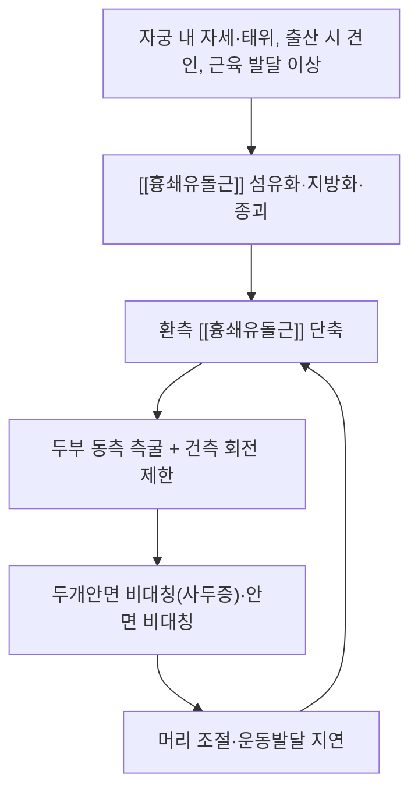

# 🩺 사경 (斜頸, Torticollis)

> **핵심 3줄 요약 (Key Summary)**:
> - 📍 병소 부위 & 해부·병태생리: [[흉쇄유돌근]]의 단축·섬유화가 핵심이다. 두경부가 환측으로 기울고(측굴) 건측 회전이 제한된다. 선천성 근성 사경은 영아기에서 세 번째로 흔한 근골격계 질환이다.
> - 🚩 전형적 임상 양상: 두부 기울기(흔히 >15°)와 회전 제한, [[흉쇄유돌근]] 종괴(위종), 두개안면 비대칭(사두증), 운동발달 지연. 경증·자연경과 호전례가 많다.
> - 🛠️ 핵심 감별 & 치료 전략: 안성(사시)·신경성(경부근긴장이상)·골성 사경 감별이 선행이고, 표준 치료는 [[수동 신장]] + 능동·능동보조 유도(handling) + 보호자 교육(터미타임)이다.
> - ⚠️ 응급 의뢰 레드플래그: 급성 후천성 사경에 발열·경부 강직·신경학적 증상이 동반되면 중추신경계 감염·후인두 농양·추골동맥 박리·후두개염을 먼저 배제한다.

---

## 📌 목차
1. [질환 개요 & 해부학적 병태생리](#1-질환-개요--해부학적-병태생리)
2. [병태생리 메커니즘 & 생체역학적 악순환 네트워크](#2-병태생리-메커니즘--생체역학적-악순환-네트워크)
3. [임상 증상 & 평가 알고리즘](#3-임상-증상--평가-알고리즘)
4. [감별 진단 매트릭스 (Differential Diagnosis)](#4-감별-진단-매트릭스-differential-diagnosis)
5. [한의 통합 치료 프로토콜 (침·약침·추나·한약)](#5-한의-통합-치료-프로토콜-침약침추나한약)
6. [양방 치료 & 병용·의뢰 기준 (Conventional Treatment & Referral)](#6-양방-치료--병용의뢰-기준-conventional-treatment--referral)
7. [재활 운동 & 생활습관 티칭 가이드](#7-재활-운동--생활습관-티칭-가이드)
8. [💡 진료실 핵심 필기 & 임상 노하우](#8--진료실-핵심-필기--임상-노하우)
9. [출처 및 학술 참고 문헌 (References)](#9-출처-및-학술-참고-문헌-references)

---

## 1. 질환 개요 & 해부학적 병태생리

![[사경_01_임상_역사도해.jpg|420]]
> [그림 1: 사경 환자의 임상 소견 — 두부가 한쪽으로 기울고 반대 방향 회전이 제한된 자세 (19세기 의학 문헌 도판, Wikimedia Commons, Public domain)]

* **질환 정의 및 분류**:
  * 사경은 두경부가 환측으로 측굴(기울)되고 건측으로 회전이 제한되는 자세 이상이다. 병인에 따라 다음과 같이 나눈다.
  * **선천성 근성 사경 (CMT, congenital muscular torticollis)**: 출생 시 또는 생후 수주 내 발현. [[흉쇄유돌근]]의 단축·섬유화·종괴(위종, pseudotumor)가 병소다. 영아기에서 세 번째로 흔한 근골격계 질환으로 알려져 있다.
  * **후천성(급성) 사경 (wry neck)**: 경부 근육 염좌·경추 관절 기능부전·림프절염·상기도 감염 후 편측 경부 근경련으로 발생. 소아에서는 바이러스성 근염·편도주위 농양, 성인에서는 경추 추간판·후관절 병변과 감별한다.
  * **감별 갈래**: 안성 사경(사시·안구운동 이상으로 두부 자세 보상), 신경성 사경(경부근긴장이상, 痙性斜頸), 골성 사경(Klippel-Feil 증후군 등 선천성 경추 기형).
* **관련 해부학적 구조물**:
  * **근육 및 근막**: [[흉쇄유돌근]](흉골두·쇄골두), [[승모근]] 상부섬유, 경부 심부 굴곡근. CMT에서는 [[흉쇄유돌근]]이 우세하게 단축된다.
  * **신경**: [[부신경]](CN XI)이 [[흉쇄유돌근]] 운동을 지배하며, 고유감각은 [[경신경총]](C2·C3 전지)이 담당한다.
  * **골격·랜드마크**: 흉골병, 쇄골 내측단, [[유양돌기]], 후두골 상항선.
  * **혈관**: 심부에 [[총경동맥]]·[[내경정맥]]·[[미주신경]]이 주행하므로 경부 심자 시 반드시 감별한다.

---

## 2. 병태생리 메커니즘 & 생체역학적 악순환 네트워크

![[사경_02_흉쇄유돌근_해부도해.png|420]]
> [그림 2: 흉쇄유돌근의 해부학적 위치 — 흉골병·쇄골 내측단에서 유양돌기로 주행하는 경부 전외측 근육 (해부 모델 도해, Wikimedia Commons, CC BY 4.0 — DrJanaOfficial)]

### 1) 근 조직 수준 기전 — 섬유화·지방화
* CMT의 [[흉쇄유돌근]]은 단순 구축이 아니라 **섬유화·지방화·근위축이 혼재**한 변화를 보인다. 종괴(위종)는 주로 근육 손상 후 국소 섬유화·염증성 재형성으로 설명된다.
* 자궁 내 자세 압박, 태위 이상, 출산 시 견인 등이 유발 인자로 제시되지만 단일 원인으로 단정되지 않는다 — 병리조직학적 소견과 영아 자연경과가 함께 작용한다.

### 2) 생체역학적 연쇄 (Kinetic Chain)
* 편측 [[흉쇄유돌근]] 단축은 두부를 동측으로 측굴·건측으로 회전시킨다. 지속되면 두개골 편평화(사두증)와 안면 비대칭으로 이어지고, 머리 조절·턱 조절을 통해 섭식·운동발달에도 영향을 준다.
* 온열요법 단독군도 치료 전후 자체 비교에서 개선된 것은 **성장·자연경과 효과가 크다**는 뜻이다(2026-10-04 리뷰 2번). 임상 지표는 근육 형태(두께)보다 **수동 가동범위(두부 회전각)** 를 본다.

---

## 3. 임상 증상 & 평가 알고리즘

### 1) 주소증 및 소견
* **두부 기울기·회전 제한**: 각도기(arthrodial protractor)로 기울기를 측정한다. 평가지표는 두부 기울기(°)와 회전범위(°)다.
* **종괴(위종)**: 생후 2~4주 흉쇄유돌근 내 촉지되는 단단한 결절. 대개 수개월 내 흡수된다.
* **두개안면 비대칭**: 편평두증(사두증)·안면 비대칭.

### 2) 평가 항목
* **경부 가동범위**: 수동 회전·측굴 각도 기록(사진 병기). 임상적으로 중요한 지표는 수동 회전각이다.
* **초음파**: [[흉쇄유돌근]] 두께와 환측/건측 비(A/N ratio) 측정. 다만 이 지표는 군 간 차이가 잘 나지 않아 추적의 보조로 쓴다.
* **감별 검사**: 고관절·경추 기형 확인, 안구운동·사시 검사(안성 감별), 이상 반사·근긴장 이상(신경성 감별). 필요 시 경추 영상(골성 감별).

> 🖼️ 이미지 미확보 — 이학적 검사 시연(각도기 두부 회전각 측정), 한의 술기(소아추나), 재활 운동 실사는 이번 회차에 확보하지 못했다(Wikimedia Commons 검색 한계). 다음 회차에 재시도한다.

---

## 4. 감별 진단 매트릭스 (Differential Diagnosis)

| 감별 질환 | 호발 연령·원인 | 주소증 차이점 | 특이 감별 소견 |
| :--- | :--- | :--- | :--- |
| 선천성 근성 사경 (본 질환) | 영아기, [[흉쇄유돌근]] 단축 | 두부 기울기·회전 제한, 종괴 | 각도기 회전 제한, 초음파 두께 증가 |
| 안성 사경 | 어느 연령, 사시·안구운동 이상 | 두부 자세 보상 | 안과 검사에서 사시·안근마비 |
| 신경성 사경(경부근긴장이상) | 성인, 기저핵 회로 이상 | 불수의적 경부 근수축·떨림 | 근긴장이상 패턴, 신경과 평가 |
| 골성 사경 | 신생아·영아, 경추 기형 | 회전 제한 고정 | 경추 X-ray에서 Klippel-Feil 등 |
| 급성 후천성 사경(근염·농양) | 소아·성인, 감염 뒤 | 통증성 급성 경부 강직 | 발열·림프절종대·염증 수치 상승 |

> 🚩 **레드플래그 감별**: 발열·심한 경부 강직·삼킴곤란·신경학적 증상이 동반된 급성 사경, 외상 후 사경은 응급 감별(중추신경 감염·후인두 농양·추골동맥 박리)을 먼저 한다.

---

## 5. 한의 통합 치료 프로토콜 (침·약침·추나·한약)

> ⚠️ 영아·소아에서는 자침·약침보다 **소아추나·지압·온침·보호자 교육**이 우선이다.

* **침구 치료 (Acupuncture)**: 경항부 혈위(천정·천용·인영·부돌·완골·예풍·풍지 등)는 국소 강자극을 피하고 **가볍고 얕게** 자침한다. 성인의 급성 후천성 사경에는 국소 온침·전침을 병용할 수 있다. 3개월 미만 영아에는 자침을 지양한다.
* **약침 치료 (Pharmacopuncture)**: 성인의 급성 사경에서 [[흉쇄유돌근]] 근복에 약침을 고려할 수 있으나, 영아에는 시행하지 않는다.
* **추나 치료 (소아추나)**: 경항부 揉法·拿法 위주로 부드럽게 시행하고 강한 회전·신연은 금한다 → [[소아추나]].
* **한약 치료 (Herbal Medicine)**: 睡驚·夜啼를 동반하면 안신 처방(甘麥大棗湯類 등)을 짧게 쓴다. 근 긴장이 뚜렷한 성인에는 舒筋活絡 축을 참고한다.

---

## 6. 양방 치료 & 병용·의뢰 기준 (Conventional Treatment & Referral)

![[사경_03_보툴리눔_경부주입.jpg|400]]
> [그림 3: 경부 근육에 보툴리눔 톡신을 다점 주입한 자국 — 경부근긴장이상(성인 사경) 치료 장면 (Wikimedia Commons, CC BY-SA 4.0)]

* **비약물 치료 (Procedures)**:
  * **물리치료**: 2026-10-04 리뷰 2번(단일맹검 3군 RCT)에서 **수동 신장군이 두부 회전각 개선에서 능동·능동보조 유도군과 온열군보다 유의하게 우수**했다 — [[수동 신장]].
  * **보툴리눔 톡신**: 성인 경부근긴장이상(경부 사경)의 1차 치료, 난치성 CMT의 보조. 경부 근육 다점 주입.
* **수술·시술 적응증 (Surgical Indication)**: 생후 1세 이후에도 뚜렷한 잔여 단축·두개안면 변형이 지속되면 건 절단·Z-성형(Brown) 등 수술을 고려한다. 대개 1세 이전 조기 비수술 치료로 대부분 호전된다.
* **한의 병용 판단 (Combination Therapy)**: 물리치료·보조기와 한의 수기 치료는 병용 가능하다. 보툴리눔 주입 후에는 국소 마사지·온열 강도를 낮추고 주사 부위 자극을 피한다.
* **의뢰 기준 (Referral Criteria)**: 안성·골성·신경학적 원인 의심, 생후 4개월 이후에도 뚜렷한 증상, 3~4주간 호전 없음 → 소아정형·소아재활·신경과 의뢰.

---

## 7. 재활 운동 & 생활습관 티칭 가이드

* **수동 신장 (보호자 교육)**: 하루 3~5회, 각 20~30초 유지·3~5회 반복. **"아이가 아파 우는 것을 참고 늘린다"는 지도는 금물** — 통증 없는 범위에서만 시행한다.
* **능동·능동보조 유도(handling)**: 환측 [[흉쇄유돌근]]을 신장하고 건측을 활성화하도록 자세조절·눈추적·청각 자극을 이용해 두부 회전을 유도한다.
* **터미타임 (tummy time)**: 하루 여러 번 짧게 엎드린 자세를 유지해 경부 근력·머리 조절을 촉진한다.
* **일상 티칭 (Ergonomics)**: 수면 시 머리 방향을 번갈아, 수유·안기 시 환측으로 돌아보게 유도.
* **경과 판정**: 대개 1~2개월 내 기울기 개선이 관찰되며 생후 6개월까지 정상화를 목표로 한다.

---

## 8. 💡 진료실 핵심 필기 & 임상 노하우

* **안전 규칙 (영아)**: 3개월 미만에서는 **경추 HVLA(도수교정) 절대 금지**. 강한 회전·신연 금지. 앙와위에서 목을 젖히는 자세 회피, 손은 후두부를 감싸 지지한 채 천천히 움직인다. 울음이 멈추지 않거나 보채면 즉시 중단한다.
* **기대치 설정**: [[흉쇄유돌근]] 두께는 즉시 줄지 않는다(3군 RCT에서 두께·A/N ratio는 군 간 차이 없음). 성과는 **두부 기울기(°)와 회전범위(°)** 로 추적한다.
* **실전 문진 체크리스트**: ① 출생력·태위 ② 두부 기울기·회전각 측정(사진 병기) ③ 고관절·경추 기형 여부 ④ 안구운동·사시(안성 감별) ⑤ 발열·경부 강직(급성 감염 감별).
* **환자 티칭 스크립트**: "아기 목이 한쪽으로 기울고 반대쪽으로 잘 돌아가지 않는 상태를 사경이라고 합니다. 생후 3개월 안에 치료를 시작할수록 좋습니다. 치료실에서 천천히 늘여주고, 어머니께서 집에서 하루 몇 번 짧게 같은 동작을 해주시는 방식으로 진행하겠습니다. 아기가 아파 울면 참지 말고 그 범위까지만 하시고, 수유·안아줄 때와 잠잘 때 머리 방향을 번갈아 해주세요."

---

## 9. 출처 및 학술 참고 문헌 (References)

1. **Yoon JA, et al. (2021)**. *Effect of physical therapy intervention on thickness and ratio of the sternocleidomastoid muscle and head rotation angle in infants with congenital muscular torticollis: A randomized clinical trial (CONSORT)*. **Medicine (Baltimore)**, 100(33):e26998. [PMID 34414985](https://pubmed.ncbi.nlm.nih.gov/34414985/) · [DOI 10.1097/MD.0000000000026998](https://doi.org/10.1097/MD.0000000000026998)
   - **[연구 요약]** 3개월 미만 CMT 영아 57명 3군 RCT — 환측 두부 회전각은 수동 신장군이 능동유도·온열군보다 유의하게 우수(−25.71° 대 −20.00° 대 −15.00°), 두께·A/N ratio는 군 간 차이 없음.
2. **Non-surgical, non-pharmacological treatments for congenital muscular torticollis: a systematic review and meta-analysis (2025)**. **BMC Musculoskelet Disord**. [PMID 39979901](https://pubmed.ncbi.nlm.nih.gov/39979901/)
   - **[연구 요약]** CMT 비수술·비약물 중재의 체계적 고찰·메타분석 — 능동 대조군에 수기치료를 추가하면 수동 경추 회전·대칭적 두부 자세가 개선되고 흉쇄유돌근 종괴 두께가 감소했으나, 근거 확실성은 매우 낮음~낮음이었다.
3. **Kaplan SL, Coulter C, Sargent B (2018)**. *Physical Therapy Management of Congenital Muscular Torticollis: A 2018 Evidence-Based Clinical Practice Guideline From the APTA Academy of Pediatric Physical Therapy*. **Pediatr Phys Ther**, 30(4):240-290. [PMID 30277962](https://pubmed.ncbi.nlm.nih.gov/30277962/) · [pediatricapta.org](https://pediatricapta.org/clinical-practice-guidelines/)
   - **[연구 요약]** 신생아기 조기 선별, 자세·놀이(터미타임) 교육, 제한 정도에 따른 단계적 수동 신장과 능동 강화 병행을 권고하는 CMT 표준 지침.
4. **시연 영상** — "Congenital Muscular Torticollis: Carries and Side Bends" (The Children's Hospital of Philadelphia) — https://www.youtube.com/watch?v=OAlAcHjVlLs · "Torticollis and Total Motion Release (TMR)" (Kid PT) — https://www.youtube.com/watch?v=ocaMH4psJR4
   - **[연구 요약]** 좌·우 사경별 캐리·측굴 신장과 중력을 이용한 체간 기울이기 시연으로, 보호자 교육에 그대로 활용할 수 있다.

## 함께 보기
- [[흉쇄유돌근]] · [[수동 신장]] · [[소아추나]] · [[유양돌기]] · [[부신경]] · [[경신경총]] · [[승모근]]
- [[2026-10-04_부인과소아과_심층리뷰]] 2번
