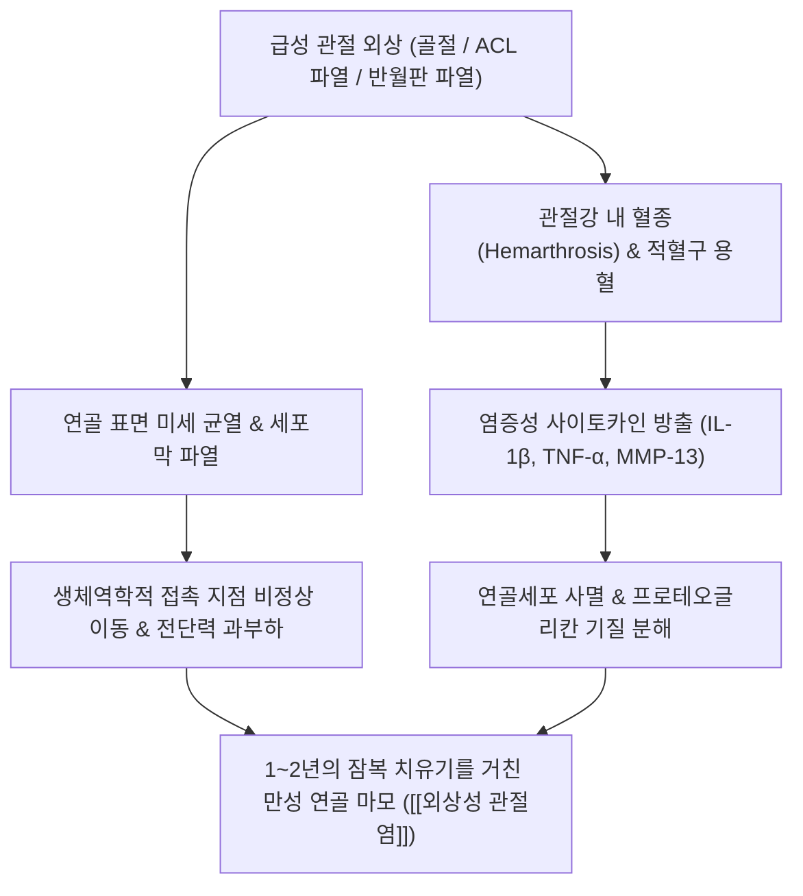

---
aliases:
  - 외상성 관절염
  - 외상성관절염
  - 외상 후 관절염
  - Post-traumatic Osteoarthritis
  - PTOA
  - 外傷性 關節炎
  - M19.1
tags:
  - 이론
  - 질환
  - 근골격계
  - 관절
  - 스포츠손상
  - 퇴행성관절염
title: 외상성 관절염
date: 2026-09-17
출처: "https://pubmed.ncbi.nlm.nih.gov/28557657/"
---

# 🩺 [[외상성 관절염]] (Post-traumatic Osteoarthritis, PTOA / 外傷性 關節炎, ICD-10 M19.1)

> **핵심 3줄 요약 (Key Summary)**:
> - 📍 병소 부위 & 해부·병태생리: 관절내 골절, [[전방십자인대]] 파열, [[반월판 손상]], 중증 탈구 등 심각한 외상 후 관절 연골의 기계적 파열과 조기 염증성 사이토카인 폭풍 및 생체역학적 접촉 압력 불균형으로 발생하는 이차성 골관절염.
> - 🚩 전형적 임상 양상 & 3대 징후: 외상 후 수개월~수년 뒤 서서히 발생하는 관절 부종 및 운동통, 관절 가동범위(ROM)의 점진적 구축 및 뻣뻣함, 체중 부하 시 관절의 기계적 마찰음(Crepitus) 및 불안정감.
> - 🛠️ 핵심 감별 검사 & 한·양방 다각적 치료 전략: 단순 방사선(체중부하 X-ray 상 비대칭적 관절강 협착, 골극, 연골하 경화), 약 1년간의 자가치유·잠복기 동안 진통 및 조직 회복 보조, 관절 유착 방지 수동 관절가동술(Joint Mobilization 추나), 관절강 소염 재생 약침 및 [[독활기생탕]] 투여.
> - ⚠️ 응급 의뢰 레드플래그 & 악화 요인: 외상 후 급격한 발열과 발적을 동반한 화농성 관절염 병발, 불유합 또는 부정유합으로 인한 관절면의 급격한 붕괴, 심한 관절 불안정증으로 인한 보행 불능.

---

## 📌 목차
1. [질환 개요 & 해부학적 병태생리](#1-질환-개요--해부학적-병태생리)
2. [병태생리 메커니즘 & 생체역학적 악순환 네트워크](#2-병태생리-메커니즘--생체역학적-악순환-네트워크)
3. [임상 증상 & 이학적 검사(Physical Exam) 알고리즘](#3-임상-증상--이학적-검사physical-exam-알고리즘)
4. [감별 진단 매트릭스 (Differential Diagnosis)](#4-감별-진단-매트릭스-differential-diagnosis)
5. [한의 통합 치료 프로토콜 (침·약침·추나·한약)](#5-한의-통합-치료-프로토콜-침약침추나한약)
6. [재활 운동 & 생활습관 티칭 가이드](#6-재활-운동--생활습관-티칭-가이드)
7. [💡 사용자 진료실 핵심 필기 & 임상 노하우 (Melt-In 잔여 심화 집약)](#7--사용자-진료실-핵심-필기--임상-노하우-melt-in-잔여-심화-집약)
8. [출처 및 학술 참고 문헌 (References)](#8-출처-및-학술-참고-문헌-references)

---

## 1. 질환 개요 & 해부학적 병태생리

![[외상성관절염_선행외상_전방십자인대파열_도해.jpg|450]]
> [그림 1: 외상성 관절염의 대표적 선행 원인인 전방십자인대(ACL) 파열 및 관절 불안정성 유발 해부학적 도해]

* **질환 정의 및 역학**:
  * 외상성 관절염(Post-traumatic Osteoarthritis, PTOA)은 관절에 가해진 급성 외상(골절, 인대 파열, 반월판 손상, 관절낭 파열 등)으로 인해 **관절 연골의 물리적 손상과 생체역학적 정렬 이상, 그리고 만성 염증 반응이 복합적으로 작용하여 발생하는 이차성 골관절염**입니다.
  * 전체 골관절염 환자의 약 12%를 차지하며, 통상적인 노인성 퇴행성 관절염과 달리 **20~40대의 젊고 활동적인 연령층에서 호발**합니다.
  * 전방십자인대 파열이나 반월판 절제술을 받은 환자의 50% 이상이 손상 후 10~15년 내에 방사선학적 외상성 관절염으로 진행합니다.
* **관련 해부학적 구조물**:
  * **골격 및 관절면**: [[대퇴골]], [[경골]], [[슬개골]], [[거골]], [[비골]], [[요골]], 관절면의 정렬(Joint congruity).
  * **인대 및 안정화 구조**: [[전방십자인대]], [[후방십자인대]], [[내측측부인대]], [[외측측부인대]], [[전거비인대]], [[종비인대]].
  * **섬유연골 및 초자연골**: [[내측반월판]], [[외측반월판]], 관절면 초자연골 기질(제2형 콜라겐, 프로테오글리칸).
  * **활액막 및 관절낭**: 급성 혈관절증(Hemarthrosis) 및 만성 활액막 비후 구역.

---

## 2. 병태생리 메커니즘 & 생체역학적 악순환 네트워크

![[외상성관절염_슬관절_Xray_관절강협착_골극형성.jpg|450]]
> [그림 2: 외상 후 슬관절 전후방 X-ray: 내측 관절강의 현저한 비대칭적 협착, 연골하골 경화 및 골극(Osteophyte) 형성 소견]

### 1) 급성기 염증 폭풍과 분자생물학적 기전
* **혈관절증(Hemarthrosis)의 독성**: 외상 직후 관절강 내로 쏟아진 적혈구가 용혈되면서 유리 헤모글로빈과 철(Iron) 이온이 방출되어 활성산소종(ROS)을 대량 형성하고 연골세포의 지질 과산화 및 세포자멸사를 촉진합니다.
* **이화 효소(Catabolic enzymes) 폭발**: 활액막 대식세포에서 분비된 IL-1β와 TNF-α는 연골세포를 자극하여 콜라겐 분해효소인 MMP-1, MMP-13 및 아그레칸 분해효소(ADAMTS-4, ADAMTS-5)를 과발현시켜 연골 기질을 녹입니다.

### 2) 생체역학적 불균형과 1년 자가치유·잠복기 (Window of Opportunity)
* **생체역학적 접촉 부위 이동**: 인대 파열이나 관절면 부정유합으로 인해 체중 부하 중심선이 정상 연골 부위에서 마모에 취약한 주변부로 이동하며 비정상적 전단력(Shear stress)이 지속됩니다.
* **1년의 자가치유 및 잠복기**: 외상 발생 후 약 1년간은 신체가 스스로 연골 손상을 치유하려는 섬유연골 재생 시도와 함께 뚜렷한 증상이 없는 무증상 잠복기가 유지됩니다. 이 시기에 적절한 체중 부하 조절과 관절가동 치료가 이루어지지 않으면 비가역적 관절염으로 직행합니다.

---

## 3. 임상 증상 & 이학적 검사(Physical Exam) 알고리즘

### 1) 주소증 및 임상적 진행 단계
* **급성 외상기 (0~3개월)**: 심한 통증, 관절강 내 혈종, 관절 가동 제한.
* **잠복 및 아급성기 (3개월~1년)**: 부종은 가라앉았으나 오래 걷거나 운동 후 뻐근한 관절통, 관절의 미세한 뻣뻣함, 계단 하강 시 불안정감.
* **만성 관절염 진행기 (1년 이후)**: 활동 후 악화되는 둔통, 조조강직(15~30분), 뼈끼리 부딪히는 기계적 마찰음(Crepitus), 비대칭적 관절 변형(O다리 등).

### 2) 필수 이학적 검사법 (Physical Examination)
* **관절 안정성 유발 검사**:
  * **[[라크만 검사]](Lachman test)** 및 **[[전방 서랍 검사]](Anterior drawer test)**: 선행 인대(ACL) 파열로 인한 전방 불안정성 평가.
  * **[[맥머레이 검사]](McMurray test)**: 동반된 반월판 파열 및 관절선 압통 평가.
* **수동 관절가동범위(PROM) 및 끝느낌(End-feel) 평가**:
  * 굴곡 및 신전의 최종 가동범위 제한과 골극 또는 관절낭 구축에 따른 단단한 뼈 끝느낌(Hard end-feel) 확인.
* **부구 검사(Patellar ballottement test)**:
  * 슬개골을 아래로 튕겨 관절강 삼출액 저류 및 활액막염 정도 확인.

---

## 4. 감별 진단 매트릭스 (Differential Diagnosis)

| 감별 질환 | 호발 연령 및 선행 요인 | 증상 발현 양상 | 방사선학적 특징 |
| :--- | :--- | :--- | :--- |
| [[외상성 관절염]] (본 질환) | 20~50대, 뚜렷한 골절·인대파열 외상력 | 외상 후 1년 내외 잠복기 거쳐 단일 관절 비대칭 발현 | 외상 부위 중심의 국소 관절강 협착, 골편 변형 |
| [[퇴행성 관절염]] (원발성 골관절염) | 60대 이상 고령, 노화 및 비만 | 양측성 대칭성 서서히 진행, 조조강직 | 양측 내측 관절강 대칭 협착, 연골하 골극 |
| [[류마티스 관절염]] | 30~50대 여성, 자가면역 질환 | 대칭성 다발성 관절통, 조조강직 1시간 이상 | 관절강 대칭 협착, 관절 변연부 골미란(Erosion) |
| [[화농성 관절염]] | 전 연령, 세균 감염 (상처, 침습 시술) | 급격한 고열, 발적, 극심한 박동성 통증, 체중부하 불가 | 관절액 흡인 상 혼탁한 농, WBC >50,000/μL |
| [[반월판 손상]] 단독 | 10~40대 스포츠 손상 | 특정 각도 관절 잠김(Locking), 관절선 국소 압통 | 단순 X-ray 정상, MRI 상 파열선 관찰 |

---

## 5. 한의 통합 치료 프로토콜 (침·약침·추나·한약)

![[외상성관절염_수동_관절가동술_Maitland_Kaltenborn_등급도해.png|450]]
> [그림 3: 외상 후 관절의 통증 완화 및 가동범위 회복을 위한 메이틀랜드(Maitland) 및 칼텐본(Kaltenborn) 관절가동술(Joint Mobilization) 등급 체계]

* **수동 관절가동추나 (Joint Mobilization Chuna)**:
  * **원문 필기 반영**: 외상 후 관절낭 및 인대 유착으로 굳어가는 관절을 수동적으로 움직여주는 관절가동술 적용.
  * **메이틀랜드 1~2등급 (Grade I~II)**: 관절 가동범위 초기에서 통증 없는 미세 진폭의 진동을 주어 관절낭 고유수용기를 자극하고 관절통을 즉각 억제.
  * **칼텐본 1~2단계 견인(Traction Grade I~II)**: 관절면에 가해지는 압박력을 상쇄하고 유착된 활액낭을 분리하여 관절 내 활액 분비 및 순환 촉진.
  * **칼텐본 3등급 활주(Gliding Grade III)**: 조직 저항을 넘어서는 부드러운 수동 신장을 통해 손실된 굴곡·신전 관절 가동범위 회복.
* **침구 치료 (Acupuncture)**:
  * 슬관절 독비(犢鼻), 내슬안(內膝眼), 양릉천(陽陵泉), 곡천(曲泉), 족삼리(足三里).
  * 관절낭 심부 및 손상된 인대 부착부에 자침하여 국소 혈류 개선 및 엔도르핀 분비 촉진.
* **약침 치료 (Pharmacopuncture)**:
  * **급성 및 아급성 활액막염기**: 황련해독탕 약침 또는 소염약침을 관절강 내 주입하여 IL-1β 및 TNF-α 분비 억제.
  * **1년 잠복 치유기 및 만성기**: 신바로약침, 자하거 약침, 녹용약침을 관절강 및 인대 부착부에 시술하여 연골 기질(제2형 콜라겐) 합성 촉진 및 연골하골 지지력 보강.
* **한약 치료 (Herbal Medicine)**:
  * **손상 초기 어혈 제거 및 진통**: [[당귀수산]], [[화어전]].
  * **1년 자가치유기 및 만성 연골 퇴행 억제**: 풍한습비(風寒濕痺)를 다스리고 연골과 뼈를 튼튼히 보하는 처방 ([[독활기생탕]], [[대강활탕]], [[오적산]], [[방기황기탕]]).

---

## 6. 재활 운동 & 생활습관 티칭 가이드

* **대퇴사두근 및 하지 항중력근 폐쇄사슬 운동 (CKC Exercise)**:
  * 관절에 전단력을 주지 않는 벽 스쿼트(Wall squat, 0~45도), 미니 스쿼트, 브릿지(Bridge) 운동으로 대퇴사두근 및 둔근 강화.
* **체중 부하 조절 및 지팡이/보조기 활용**:
  * 외상 후 약 1년간의 치유기 동안 체중이 1kg 증가할 때마다 슬관절 부하는 4kg씩 증가하므로 철저한 체중 감량(5~7%) 티칭.
  * 보행 시 반대쪽 손에 지팡이(Cane)를 짚어 환측 관절 부하를 최대 30%까지 경감.
* **저충격 유산소 운동**:
  * 관절 연골에 충격이 없는 수중 걷기, 아쿠아로빅, 고정식 실내 자전거 타기를 주 3~5회, 회당 30분 권고.

---

## 7. 💡 사용자 진료실 핵심 필기 & 임상 노하우 (Melt-In 잔여 심화 집약)

* **외상 후 '1년의 골든타임(Golden Time)' 티칭의 절대적 중요성**:
  * 환자들은 인대 재건술이나 깁스 치료 후 3~6개월이 지나 붓기와 통증이 가라앉으면 "이제 다 나았다"고 생각하고 무리한 축구, 달리기, 등산을 재개합니다.
  * **외상 후 약 1년간은 미세 연골 손상이 스스로 아물거나 반대로 비가역적 관절염으로 굳어지는 중대한 갈림길(자가치유 기간)**입니다.
  * 이 기간 동안의 치료 목표는 단순 진통이 아니라, **① 관절 내 만성 염증 억제, ② 생체역학적 보조, ③ 관절 연골 회복 보조**임을 환자에게 명확히 교육해야 합니다.
* **수동 관절가동술(Joint Mobilization)의 실전 적용 노하우**:
  * 굳어버린 외상 후 관절을 환자 스스로 강제로 굽히거나 펴게 하면 관절면 충돌로 연골 마모가 가속됩니다.
  * 진료실에서 **시술자가 수동으로 관절면을 잡고 축성 견인(Traction)을 유지한 상태에서 부드럽게 전후 활주(Glide)를 주는 수동 관절가동추나**를 적용해야 관절면 손상 없이 관절낭 유착을 안전하게 분리할 수 있습니다.
* **진료실 문진 체크리스트**:
  * "10~20년 전 젊었을 때 군대나 운동 중에 무릎을 크게 다치거나 수술한 적이 있습니까?"
  * 40~50대에 조기 관절염 증상을 호소하는 환자에게 과거 외상력을 반드시 문진하여 원발성 퇴행성 관절염과 구분하고, 잔여 인대 불안정성을 평가해야 합니다.

---

## 8. 출처 및 학술 참고 문헌 (References)

* Thomas AC, Hubbard-Turner T, Wikstrom EA, Palmieri-Smith RM. (2017). Epidemiology of Posttraumatic Osteoarthritis. *Journal of Athletic Training*, 52(6), 491-496.
  * [PubMed Link](https://pubmed.ncbi.nlm.nih.gov/28557657/)
  * [연구 요약] 전방십자인대 파열, 반월판 파열, 발목 골절 등 스포츠 외상 후 10~15년 내에 50% 이상의 환자에서 조기 외상 후 골관절염(PTOA)이 발생하는 역학적 자연 경과와 조기 생체역학적 중재의 중요성을 규명함.
* Lieberthal J, Sambamurthy N, Scanzello CR. (2015). Inflammation in post-traumatic osteoarthritis: An open open issue. *Osteoarthritis and Cartilage*, 23(11), 1809-1822.
  * [PubMed Link](https://pubmed.ncbi.nlm.nih.gov/26521727/)
  * [연구 요약] 관절 외상 직후 관절강 내에 방출되는 염증성 사이토카인(IL-1β, TNF-α)과 기질 분해효소(MMP-13, ADAMTS-5)가 초기 무증상 잠복기 동안 연골세포 사멸과 기질 분해를 촉진하는 분자생물학적 악순환 네트워크를 고찰함.
* Bennell KL, Hall M, Hinman RS. (2016). Physical therapy operations in the management of osteoarthritis: a modern view. *Annals of Physical and Rehabilitation Medicine*, 59(1), 24-29.
  * [PubMed Link](https://pubmed.ncbi.nlm.nih.gov/26654763/)
  * [연구 요약] 외상 후 관절염 환자에서 수동 관절가동술(Passive joint mobilization)과 근력 강화 운동의 결합이 관절 내 활액 분비 및 통증 신경 억제에 미치는 임상적 유효성을 체계적으로 검증함.