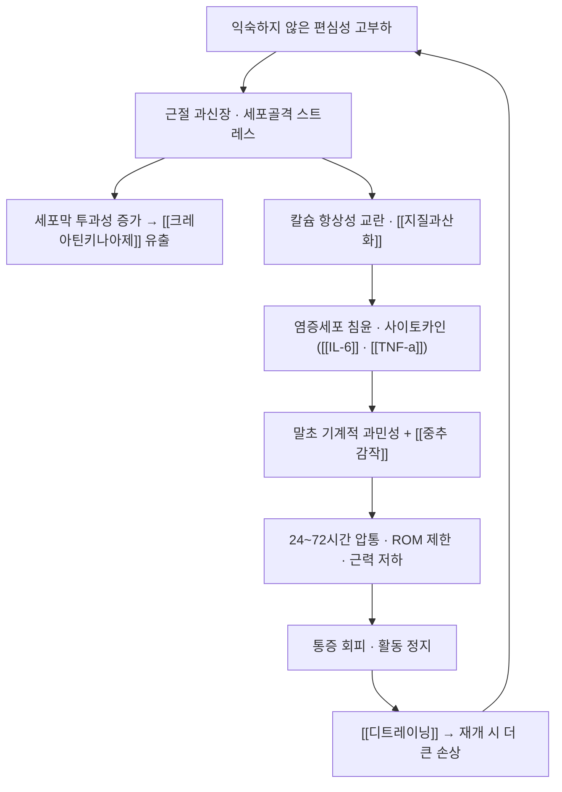

# 🩺 지연성 근육통 (Delayed Onset Muscle Soreness, DOMS)

> 🖼️ **이미지 미확보** — 이번 회차에 질환 실사·영상 도해를 확보하지 못했다. 다음 보강 회차에서 초음파·MRI 소견과 해부 도해를 채울 대상이다.

> **핵심 3줄 요약 (Key Summary)**:
> - 📍 병소 부위 & 해부·병태생리: 익숙하지 않은 고부하 **편심성 수축** 후 근섬유 미세손상·세포외기질 스트레스로 생기는 **비외상성 운동 유발 근손상** 상태. 염증 반응과 신경 기계적 과민성이 겹친다.
> - 🚩 전형적 임상 양상: 운동 후 **24~72시간에 정점**을 보이는 근육 압통·강직, ROM 제한, 근력 저하. 통증은 대개 5~7일 내 자연 소실된다.
> - 🛠️ 핵심 검사 & 치료 전략: 촉진 압통·MMT·ROM으로 평가하고 [[크레아틴키나아제]]·소변색으로 중증도를 감별. 치료의 핵심은 **가벼운 능동 회복(부하 재개)**이며 침·약침으로 통증을 낮춰 진입을 돕는다.
> - ⚠️ 응급 의뢰 레드플래그: 소변 콜라색·심한 종창·근력 급격 저하·전신 증상은 [[횡문근융해증]] 의심 → 즉시 의뢰.

---

## 📌 목차
1. [질환 개요 & 해부학적 병태생리](#1--질환-개요--해부학적-병태생리)
2. [병태생리 메커니즘 & 생체역학적 악순환 네트워크](#2--병태생리-메커니즘--생체역학적-악순환-네트워크)
3. [임상 증상 & 이학적 검사(Physical Exam) 알고리즘](#3--임상-증상--이학적-검사-physical-exam--알고리즘)
4. [감별 진단 매트릭스 (Differential Diagnosis)](#4--감별-진단-매트릭스--differential-diagnosis-)
5. [한의 통합 치료 프로토콜 (침·약침·추나·한약)](#5--한의-통합-치료-프로토콜--침약침추나한약-)
6. [양방 치료 & 병용·의뢰 기준 (Conventional Treatment & Referral)](#6-양방-치료--병용의뢰-기준--conventional-treatment--referral-)
7. [재활 운동 & 생활습관 티칭 가이드](#6--재활-운동---생활습관-티칭-가이드)
8. [💡 진료실 핵심 필기 & 임상 노하우](#7----진료실-핵심-필기---임상-노하우--melt-in-잔여-심화-집약-)
9. [출처 및 학술 참고 문헌 (References)](#8--출처-및-학술-참고-문헌--references-)

---

## 1. 질환 개요 & 해부학적 병태생리

- **정의**: 익숙하지 않거나 강도가 갑자기 올라간 운동(특히 편심성 수축) 후 24~72시간에 정점을 보이는 근육 통증·압통·기능 저하다. 질환이라기보다 **운동 유발 근손상(exercise-induced muscle damage)의 정상적 경과**에 가깝다.
- **역학·호발**:
  - 비훈련자, 새로운 동작(내리막 달리기·하산·깊은 스쿼트·새 근력 프로그램 첫 주)
  - 스포츠 복귀 초기, 시즌 첫 훈련, 장시간 인터벌
  - 흔히 '늦게 나타나는' 특성 때문에 환자가 운동과의 인과를 놓치기 쉽다
- **관련 해부·생리 구조**:
  - 근섬유(특히 type II 섬유), 근절(sarcomere)과 세포골격(데스민·틴틴), 근육 내 결합조직(근내막·근주막)
  - 근육 내 통각 수용기(자유신경종말)와 근방추·[[골지건 기관]]의 감각 입력 변화 → [[고유수용감각]]
  - 순환: 미세혈관 손상·부종이 국소 압력과 통증을 키운다

## 2. 병태생리 메커니즘 & 생체역학적 악순환 네트워크

- **손상–염증–재생 3상**: ① 기계적 미세손상 ② 염증·부종(호중구·대식세포) ③ 재생(위성세포 활성 → [[mTOR]] 경로 단백 합성). 적절한 재생은 4~7일, 과도하면 섬유화·기능 저하로 이어진다
- **통증은 손상 정도와 비례하지 않는다**: 2026-09-30 리뷰 1번에서 혈중 [[크레아틴키나아제]]·[[지질과산화]]가 개선돼도 **주관적 통증은 변하지 않았다** — 통증에는 중추 감작·기계적 과민성이 크게 관여한다
- **반복 효과(repeated bout effect)**: 같은 부하를 반복하면 손상·통증이 줄어든다 — 재활 프로그램 설계의 근거다 → [[점진적 과부하]]

## 3. 임상 증상 & 이학적 검사(Physical Exam) 알고리즘

- **증상**: 국소 근육의 둔통·압통, 강직감, 관절 ROM 제한, 근력 저하, 경미한 부종. 24~72시간 정점 후 5~7일 내 소실
- **이학적 검사**:
  - 촉진: 근복·근건접합부 압통(정량은 [[압통역치(PPT)]])
  - ROM: 수동 ROM은 대체로 유지, **능동 ROM은 통증으로 제한**
  - 근력: MMT에서 통증성 약화(통증 억제) — 완전 파열과 달리 저항을 걸면 통증이 재현된다
  - 감각·신경: 피부분절 분포 이상이 있으면 신경 병변을 감별
- **검사실**: [[크레아틴키나아제]](시계열로 해석), 미오글로빈, 소변 잠혈·색
- **영상**: 대개 불필요. 초음파·MRI는 감별이 어려울 때(T2 신호 변화로 부종 확인) — 급성 근손상 영상 감별은 문헌 정리가 있다([PMID: 42390527](https://pubmed.ncbi.nlm.nih.gov/42390527/))

## 4. 감별 진단 매트릭스 (Differential Diagnosis)

| 감별 질환 | 병소·원인 | 임상 차이 | 감별 포인트 |
| :--- | :--- | :--- | :--- |
| [[지연성 근육통]] (본 질환) | 근육 미세손상, 운동 후 24~72시간 | 지연성·대칭성·군 단위 | 운동력 명확, 5~7일 내 호전 |
| 근육 좌상([[근손상]]) | 급성 외상성 섬유 파열 | 즉시 발생, 국소 멍·결손 | 급성 외상력, 국소 압통·멍 |
| [[횡문근융해증]] | 심한 근손상·열손상·약물 | 심한 종창, 콜라색 소변, 전신 증상 | CK 대폭 상승, 신기능·전해질 이상 |
| 심부정맥혈전증 | 심부 정맥 혈전 | 한쪽 하지 종창·열감·압통 | 좌우 차이, 위험인자, 도플러 |
| 근막통증증후군([[통증유발점]]) | 발통점 | 지속성, 연관통 | 발통점 압박 시 연관통 재현 |
| 염증성 근육증 | 자가면역 | 수주~수개월 진행, 전신 증상 | 근력 저하 지속, CK 지속 상승 |

## 5. 한의 통합 치료 프로토콜 (침·약침·추나·한약)

- **치료 목표 설정**: DOMS는 자연 회복되는 상태다. 한의 치료의 목적은 **통증을 낮춰 정상 활동·훈련을 조기에 재개하게 하는 것**이지, '손상을 제거하는 것'이 아니다. 환자에게 이 목표를 먼저 설명한다.
- **침구 치료 (Acupuncture)**: 근복·근건접합부 주위 아시혈 자침, 통증이 심한 국소에 저빈도(2~4 Hz) [[전침]] 15~20분. 자극은 **통증을 악화시키지 않는 강도**로 제한한다(강자극은 미세손상을 더할 수 있다) → [[침 자극 강도와 용량]]
- **약침·부항**: 부종·열감이 뚜렷한 초기에는 강한 자극성 약침(고농도 봉약침)·습식부항을 피하고, 자하거·신바로 계열 저농도로 근막 주위에 시행한다. 후기 강직기에는 [[심부 횡마찰 마사지]]·[[근막이완술]]을 더한다 → [[자하거약침]] · [[신바로약침]] · [[봉약침]]
- **한약 치료**: 급성기에는 활혈거어·행기止痛 계열([[순기활혈탕]]·[[서경탕]] 운용), 회복·허약 동반 시 보익 계열([[오적산]]·[[독활기생탕]] 운용). 처방 선택은 변증에 따른다
- **주의**: 항응고제 복용자, 신장질환자, 콜라색 소변이나 심한 종창이 있는 환자에서는 시술 전 의뢰 판단을 먼저 한다

## 6. 양방 치료 & 병용·의뢰 기준 (Conventional Treatment & Referral)

> 🎯 **이 섹션의 목적**: 환자가 이미 진통소염제를 복용하거나 보충제를 먹고 오는 경우가 많다. 병용 가능·주의·금기를 구분한다.

- **약물 치료 (Medication)**:
  - 경구 [[NSAIDs]]·[[아세트아미노펜]]은 **통증 조절**에는 쓰이지만, 염증 반응이 재생에 필요하다는 관점에서 **회복·적응을 지연시킬 수 있다는 논쟁**이 있다(근거가 상충한다 — "반드시 피한다" 또는 "써도 된다"로 단정하지 않는다)
  - 항산화 보충제(비타민 C·E 고용량)도 적응 신호를 약화시킬 수 있다는 논쟁이 있다 → [[서양삼]] 등 항산화 계열 보충 상담 시 함께 언급
- **비약물 시술 (Procedures)**: 마사지·폼롤러·압박 의류·냉온 요법은 **증상 완화 목적**이며 손상 회복을 앞당긴다는 근거는 제한적이다
- **수술·시술 적응증 (Surgical Indication)**: 해당 없음(외상성 파열이 동반된 경우는 [[근손상]]으로 접근)
- **한의 병용 판단 (Combination Therapy)**:
  - **병용 가능**: 침·전침·약침·부항(저자극) + 부하 재개 프로그램
  - **주의**: 항응고제·항혈소판제 복용자(부항·자침 부위 출혈), 신장질환자(수분·전해질)
  - **금기**: [[횡문근융해증]] 의심 상태에서의 강한 국소 자극·운동 강행
- **전문과 의뢰 기준 (Referral Criteria)**:
  - **응급**: 소변 콜라색·무뇨·심한 종창·근력 급격 저하·발열 → 응급실·신장내과
  - **일반**: 2주 이상 호전 없음, 지속적 CK 상승, 전신 근육 증상 → 정형외과·류마티스내과

## 7. 재활 운동 & 생활습관 티칭 가이드

- **원칙 3가지(그대로 지도 가능)**:
  1. **가벼운 능동 회복**: 완전 휴식보다 가벼운 유산소(걷기·고정식 자전거)와 관절가동운동이 통증·기능 회복에 유리하다 → [[걷기 운동]] · [[유산소운동]]
  2. **회복 창 존중**: 편심성 부하가 큰 활동 후 **48~72시간은 동일 근군 고강도 훈련을 피한다**(2026-09-30 리뷰 1번의 프로토콜) → [[편심성 운동]]
  3. **점진적 재부하**: 통증 4/10 이하에서 시작해 템포·부하를 단계적으로 올린다(반복 효과 활용) → [[점진적 과부하]] · [[등척성 운동]]
- **생활 티칭**: 수분·단백질 섭취, 수면 확보(회복의 핵심), 카페인·알코올 과다 자제, 운동 일지에 통증 점수 기록
- **환자 스크립트**: "미세하게 손상된 근육은 2~3일 뒤 가장 아프고, 대개 일주일 안에 좋아집니다. 완전히 쉬는 것보다 가볍게 움직이는 편이 회복이 빠르고, 같은 동작을 다시 하면 손상이 훨씬 줄어듭니다. 다만 소변이 콜라색으로 변하거나 부기가 심하면 즉시 검사가 필요합니다."

## 8. 💡 진료실 핵심 필기 & 임상 노하우

- **문진 3문**: ① 언제, 어떤 운동을 처음/오래 했는가 ② 통증이 운동 직후인가 다음날인가 ③ 소변색·부기·근력은 어떤가 — 첫 두 답으로 DOMS, 세 번째로 위험도를 가른다.
- **한의원에서 흔한 오해**: "근육이 놀랐다"며 강한 자극(도침·고농도 약침·강한 부항)을 요구하는 환자가 있다. DOMS는 회복 과정이므로 강자극이 이득이라는 근거가 없고, 부종기에는 오히려 악화 요인이 될 수 있다 — 저자극+부하 재개가 정석임을 설명한다.
- **보충제 상담의 정직성**: 혈중 지표(예: [[크레아틴키나아제]])가 좋아져도 **환자가 느끼는 근육통은 변하지 않을 수 있다**(2026-09-30 리뷰 1번). "통증 개선"을 기대하고 보충제를 시작하는 환자에게는 목표를 '회복 지표 보조'로 좁혀 설명한다 → [[서양삼]]
- **기록 습관**: 운동 전후 통증 NRS와 다음날 아침 강직을 적게 하면, 부하를 올릴지 말지가 숫자로 판정된다.

## 9. 출처 및 학술 참고 문헌 (References)

1. **Mendes-Junior EM, et al. (2021)**. Nutrients 2021;14(1):78. [PMID: 35010953](https://pubmed.ncbi.nlm.nih.gov/35010953/)
   - **[연구 요약]** 편심성 운동(하향 달리기 60분) 후 혈중 근손상·산화 지표는 서양삼군에서 개선됐으나 **주관적 근육통은 군간 차이가 없었다** — DOMS 통증이 말초 손상 지표만으로 결정되지 않음을 보여준다.
2. **Imaging characterization and differential diagnosis of delayed-onset muscle soreness (DOMS) in athletes (2026)**. *Skeletal Radiology*. [PMID: 42390527](https://pubmed.ncbi.nlm.nih.gov/42390527/)
   - **[연구 요약]** 운동선수에서 DOMS의 영상(T2 신호 변화·부종) 소견과 다른 급성 근손상의 감별 기준을 정리했다.
3. **Skeletal muscle overuse injury: pathophysiological mechanisms, molecular pathways, and rehabilitation strategies (2026)**. *Frontiers in Physiology*. [PMID: 42311330](https://pubmed.ncbi.nlm.nih.gov/42311330/)
   - **[연구 요약]** 과사용성 근손상의 분자 경로(염증·재생·섬유화)와 재활 전략을 정리한 리뷰 — 회복 창·점진적 재부하 원칙의 배경 문헌이다.
4. **How much can exercise raise creatine kinase level (2008)**. *Journal of Family Practice*, 57(8):524-526. [PMID: 18687233](https://pubmed.ncbi.nlm.nih.gov/18687233/)
   - **[연구 요약]** 운동 후 CK 상승 폭의 범위와 무증상 상승을 해석하는 기준을 제공한다.

---

## 관련 노트

- [[근손상]] · [[크레아틴키나아제]] · [[지질과산화]] · [[편심성 운동]] · [[점진적 과부하]] · [[등척성 운동]] · [[중추 감작]] · [[디트레이닝]] · [[서양삼]] · [[2026-09-30_재활운동의학_심층리뷰]] 1번
