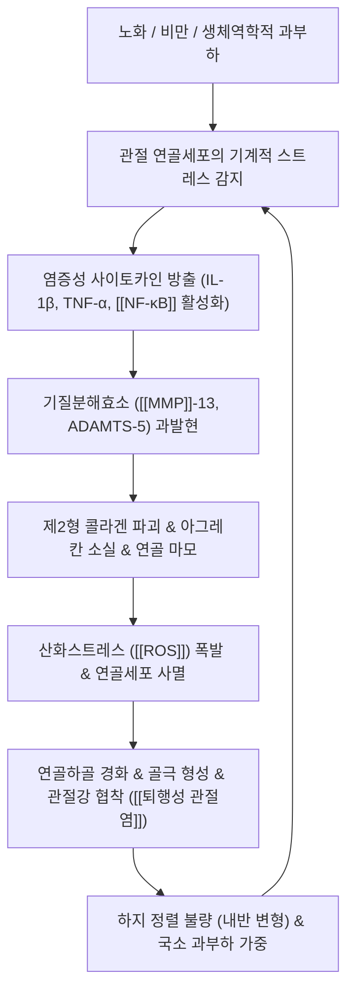

# 🩺 [[퇴행성 관절염]] (Osteoarthritis, OA / 退行性 關節炎, ICD-10 M15 / M17)

> **핵심 3줄 요약 (Key Summary)**:
> - 📍 병소 부위 & 해부·병태생리: 관절 연골의 점진적 마모뿐 아니라 연골하골, 활액막, 인대, 관절낭 전체가 관여하는 전(全) 관절 만성 질환으로, 염증성 사이토카인(IL-1β, TNF-α)과 분해효소([[MMP]], ADAMTS) 및 산화스트레스([[ROS]])에 의해 제2형 콜라겐과 프로테오글리칸 기질이 분해되고 연골세포 사멸 및 연골하 골극 형성이 진행.
> - 🚩 전형적 임상 양상 & 3대 징후: 체중 부하 및 계단 보행 시 악화되는 관절통, 30분 미만의 조조강직(Morning stiffness), 관절의 거친 마찰음(Crepitus) 및 골성 팽륜과 내반(O다리) 변형.
> - 🛠️ 핵심 감별 검사 & 한·양방 다각적 치료 전략: 체중부하 방사선 사진([[Kellgren-Lawrence 등급]] KL 1~4기 평가), [[WOMAC]] 기능 평가 지수, 체중 감량 및 대퇴사두근 강화 운동, 저주파 전침(MMP 억제 및 ROS 소거)과 활혈제습 강근골 처방([[독활기생탕]], [[대강활탕]]).
> - ⚠️ 응급 의뢰 레드플래그 & 악화 요인: 급격한 발열과 발적을 동반한 [[화농성 관절염]] 병발, 관절 내 급성 혈관절증 및 골괴사증(SPONK), 보행 불능 수준의 말기(KL 4기) 불응성 통증 시 인공관절 치환술 의뢰.

---

## 📌 목차
1. [질환 개요 & 해부학적 병태생리](#1-질환-개요--해부학적-병태생리)
2. [병태생리 메커니즘 & 생체역학적 악순환 네트워크](#2-병태생리-메커니즘--생체역학적-악순환-네트워크)
3. [임상 증상 & 이학적 검사(Physical Exam) 알고리즘](#3-임상-증상--이학적-검사physical-exam-알고리즘)
4. [감별 진단 매트릭스 (Differential Diagnosis)](#4-감별-진단-매트릭스-differential-diagnosis)
5. [한의 통합 치료 프로토콜 (침·약침·추나·한약)](#5-한의-통합-치료-프로토콜-침약침추나한약)
6. [재활 운동 & 생활습관 티칭 가이드](#6-재활-운동--생활습관-티칭-가이드)
7. [💡 사용자 진료실 핵심 필기 & 임상 노하우 (Melt-In 잔여 심화 집약)](#7--사용자-진료실-핵심-필기--임상-노하우-melt-in-잔여-심화-집약)
8. [출처 및 학술 참고 문헌 (References)](#8-출처-및-학술-참고-문헌-references)

---

## 1. 질환 개요 & 해부학적 병태생리

![[퇴행성관절염_정상관절_대_골관절염_병태비교도해.png|450]]
> [그림 1: 정상 슬관절의 매끄러운 초자연골 대비 퇴행성 골관절염(OA)에서 발생하는 광범위한 연골 마모, 연골하 골극 형성, 활액막 비후 도해]

* **질환 정의 및 역학**:
  * 퇴행성 관절염(Osteoarthritis, OA)은 단순히 기계적으로 관절이 '닳아 없어지는 병'이 아니라, **관절 연골세포의 대사 불균형, 활액막의 저등급 만성 염증, 연골하골의 경화 및 골극 형성, 인대 이완 등이 얽혀 관절 단위 전체가 퇴행하는 능동적 전(全) 관절 질환**입니다.
  * 60세 이상 성인의 30% 이상에서 호발하며, 여성이 남성보다 2배 이상 많습니다(특히 폐경 후 에스트로겐 결핍 시 급증).
* **관련 해부학적 구조물**:
  * **초자연골(Hyaline Cartilage)**: 수분 70~80%, 제2형 콜라겐 섬유망, 친수성 프로테오글리칸(아그레칸)으로 구성되어 완충 작용 수행.
  * **연골하골(Subchondral Bone)**: 연골 마모로 인해 충격 흡수 능력이 떨어지면서 미세골절과 경화(Sclerosis), 연골하 낭종(Subchondral cyst)이 형성되고, 관절 변연부에 뼈가 웃자라는 골극(Osteophyte) 형성.
  * **활액막 및 활액**: 대식세포 침윤으로 만성 활액막염이 발생하고, 정상적인 히알루론산 농도와 점탄성이 급감.
  * **주요 호발 관절**: 체중 부하 관절인 [[슬관절]](가장 흔함), [[고관절]], [[요추부]] 후관절, 수부 원위지절간관절(DIP, 헤버딘 결절), 근위지절간관절(PIP, 부샤르 결절).

---

## 2. 병태생리 메커니즘 & 생체역학적 악순환 네트워크

### 1) 분자생물학적 기전 (이화 작용과 산화스트레스)
* **연골 기질 분해효소의 폭발**: 관절 연골세포가 IL-1β 및 [[TNF-a]] 자극을 받으면 세포 내 [[NF-κB]] 신호전달계가 활성화되어 메탈로프로테아제([[MMP]]-1, MMP-3, MMP-13)와 아다말리신(ADAMTS-4, ADAMTS-5)을 분비합니다. 이 효소들이 연골 기질의 뼈대인 제2형 콜라겐망과 아그레칸을 분해합니다.
* **산화스트레스([[ROS]])와 세포자멸사**: 연골세포 내 미토콘드리아 기능 저하로 활성산소종([[ROS]])과 일산화질소(NO)가 증가하여 연골세포의 DNA를 손상시키고 세포자멸사(Apoptosis)를 유도합니다.

### 2) 생체역학적 연쇄 반응 (내반 변형과 내측 구획 과부하)
* **내측 구획 과부하**: 정상 보행 시 체중의 60~70%가 무릎 내측 구획을 통과합니다. 내측 반월판 파열이나 연골 마모가 시작되면 관절 내반(O다리) 변형이 가속화되며 내측 연골에 비정상적인 전단력이 집중됩니다.
* **골극 형성(Osteophytosis)**: 연골하골이 과도한 접촉 압력을 분산시키기 위해 관절 가장자리에 골기질을 과증식시켜 골극을 만듭니다.

---

## 3. 임상 증상 & 이학적 검사(Physical Exam) 알고리즘

![[퇴행성관절염_슬관절_KL등급_2기_및_3기_Xray.jpg|450]]
> [그림 2: 체중부하 슬관절 전후방 단순 방사선 사진: 좌측 무릎의 경미한 골극(KL 2기, 화살표) 대비 우측 무릎의 뚜렷한 내측 관절강 협착 및 연골하 경화증(KL 3기, 화살표)]

![[퇴행성관절염_고관절_골관절염_골극_연골마모_Xray.jpg|450]]
> [그림 3: 고관절 골관절염의 4대 핵심 병리 도해: 1. 비구 및 대퇴골두 골극, 2. 연골하골 경화, 3. 연골하 낭종, 4. 상외측 관절강 협착]

### 1) 주소증 및 임상 양상
* **체중부하성 통증**: 평지를 걸을 때보다 계단을 오르내릴 때, 방바닥에서 쪼그려 앉았다 일어날 때 무릎 안쪽이 시큰거리고 욱신거림.
* **조조강직(Morning Stiffness)**: 아침에 일어났을 때 관절이 뻣뻣하나, 가볍게 움직여주면 **30분 이내에 풀림** (류마티스 관절염의 1시간 이상 지속 강직과 감별점).
* **관절 마찰음(Crepitus)**: 무릎을 굽히고 펼 때 자갈 굴러가는 듯한 거친 마찰음이 손으로 느껴짐.

### 2) Kellgren-Lawrence (KL) 등급 분류 체계
* **KL 1기 (의심)**: 미세한 골극 의심, 관절강 협착 없음.
* **KL 2기 (경도, 방사선학적 확진)**: 뚜렷한 골극 형성, 경미한 관절강 협착 가능성.
* **KL 3기 (중등도)**: 다발성 중등도 골극, 뚜렷한 관절강 협착, 연골하골 경화 소견.
* **KL 4기 (중증)**: 거대 골극, 관절강 완전 소실(뼈와 뼈가 맞닿음), 심한 골 경화 및 관절 변형.
* ⚠️ **임상적 주의**: 방사선학적 KL 등급과 환자가 실제로 느끼는 통증 강도는 일치하지 않는 경우가 많으므로, 단순 X-ray 사진만으로 환자의 상태를 단정하지 않고 [[WOMAC]](Western Ontario and McMaster Universities Osteoarthritis Index) 지수로 일상 기능 장애를 복합 평가해야 합니다.

---

## 4. 감별 진단 매트릭스 (Differential Diagnosis)

| 감별 질환 | 호발 연령 및 성별 | 조조강직 지속 시간 | 주요 이환 관절 | 혈액학적/영상학적 특징 |
| :--- | :--- | :--- | :--- | :--- |
| [[퇴행성 관절염]] (본 질환) | 50대 이상 고령, 여성 우세 | 30분 이내 (단시간) | 슬관절, 고관절, DIP/PIP (체중부하 관절) | 염증 수치 정상, 비대칭 협착, 골극 형성 |
| [[류마티스 관절염]] | 30~50대 여성 | 1시간 이상 (장시간) | 손목, MCP, PIP (대칭성 다발성 관절) | RF, Anti-CCP 양성, ESR/CRP 상승, 골미란 |
| [[통풍성 관절염]] | 40~60대 남성 | 급성 발작성 격통 | 제1 중족지절관절(엄지발가락), 발목 | 요산치 상승, 관절액 편광현미경 상 바늘모양 결정 |
| [[가성통풍]] (CPPD) | 60대 이상 고령 | 급성 또는 아급성 | 슬관절, 손목 (단일 또는 소수 관절) | X-ray상 연골석회화증(Chondrocalcinosis), 능형 결정 |
| [[화농성 관절염]] | 전 연령 | 전신 발열 동반 지속 격통 | 무릎, 엉덩이 (주로 단일 관절) | 관절액 백혈구 >50,000/μL, 세균 배양 양성 |

---

## 5. 한의 통합 치료 프로토콜 (침·약침·추나·한약)

* **침구 및 전침 치료 (Acupuncture & Electroacupuncture)**:
  * **주요 경혈**: 독비(犢鼻), 내슬안(內膝眼), 양릉천(陽陵泉), 음릉천(陰陵泉), 혈해(血海), 양구(梁丘), 족삼리(足三里).
  * **저주파 전침(2~4Hz)의 분자생물학적 기전**: 관절강 내 활액 세포의 [[MMP]]-13 및 ADAMTS-5 발현을 억제하고 산화스트레스([[ROS]])를 소거하여 제2형 콜라겐 파괴를 차단. [[WOMAC]] 통증 점수를 유의하게 개선.
* **약침 치료 (Pharmacopuncture)**:
  * **신바로약침 / 녹용약침 / 자하거 약침**: 관절강 내 및 내측 관절선 압통점에 주입하여 연골세포의 아그레칸 합성 촉진, 항염증 및 연골하골 지지력 보강.
  * **황련해독탕 약침 / 소염약침**: 급성 활액막염으로 관절이 붓고 열감이 있는 활성기에 주입하여 관절 삼출액 조기 흡수.
* **추나 치료 (Chuna Manipulation)**:
  * **관절견인 및 활주 추나**: 슬관절 장축 견인을 통해 관절강 내 압력을 낮추고, 메이틀랜드 1~2등급의 부드러운 가동술로 관절낭 고유수용기를 자극하여 진통 효과 유도.
  * **주변 근막 이완(MFR)**: 단축된 [[장요근]], [[대퇴근막장근]], [[비복근]]을 이완하고, 약화된 [[대퇴사두근]] 내측광근(VMO)을 활성화하여 슬개골 외측 편위 방지.
* **한약 치료 (Herbal Medicine)**:
  * **간주근(肝主筋), 신주골(腎主骨)**: 간신부족(肝腎不足)과 풍한습사(風寒濕邪) 및 어혈 정체를 변증하여 투여.
  * 처방: [[독활기생탕]], [[대강활탕]], [[오적산]], [[방기황기탕]](비만형 수종 관절염), [[가미대보탕]].

---

## 6. 재활 운동 & 생활습관 티칭 가이드

* **체중 감량 (핵심 중의 핵심)**:
  * 체중이 1kg 줄어들 때마다 걸을 때 무릎에 가해지는 부하는 **4kg씩 감소**합니다. BMI 30 이상인 비만 환자에서 5~10% 체중 감량은 통증을 절반으로 줄이는 가장 강력한 치료입니다.
* **대퇴사두근 강화 운동 (폐쇄사슬 운동)**:
  * **벽 스쿼트(Wall Squat)**: 등을 벽에 대고 0~45도 범위 내에서 버티기.
  * **의자에 앉아 다리 펴기(Seated Quad Extension)**: 발목에 모래주머니를 차고 통증 없는 범위에서 등척성 버티기.
* **저충격 유산소 운동**:
  * 관절 연골에 체중 충격이 없는 **수영(자유형 발차기), 아쿠아로빅, 고정식 실내 자전거** 주 3~5회, 회당 30분 권고.
* **절대 피해야 할 생활 습관**:
  * 쪼그려 앉기, 방바닥 양반다리, 무릎 꿇고 걸레질하기, 가파른 산 하산하기(내리막길에서 무릎 부하 7~8배 증가).

---

## 7. 💡 사용자 진료실 핵심 필기 & 임상 노하우 (Melt-In 잔여 심화 집약)

* **X-ray 사진(KL 등급)에 속지 않는 임상 혜안**:
  * X-ray를 찍어보면 무릎 뼈가 다 닿아 있는 KL 4기인데도 "산에 잘만 다닌다"며 거의 안 아파하는 환자가 있고, 반대로 KL 1~2기로 뼈가 거의 멀쩡한데 "아파서 한 발자국도 못 걷겠다"며 우는 환자가 있습니다.
  * 골관절염의 통증은 연골 자체(통각 신경이 없음)에서 오는 것이 아니라, **활액막의 급성 염증, 연골하골의 골수 부종, 주변 건초염(거위발건염 등) 및 근육 경련**에서 비롯됩니다.
  * 환자가 방사선 사진을 보고 "뼈가 다 닳았으니 수술해야 하냐"며 공포를 느낄 때, "통증을 일으키는 활액막 염증과 다리 근육의 긴장을 한의 치료로 잡아주면 수술 없이도 통증 없이 편안하게 걸으실 수 있습니다"라고 안심시키는 것이 치료의 첫걸음입니다.
* **거위발 점액낭염(Pes Anserine Bursitis)과의 동반율 70%**:
  * 퇴행성 관절염 환자가 무릎 안쪽 통증을 호소할 때, 실제 압통점은 관절선보다 2~3cm 아래인 **거위발건 부착부([[봉공근]], [[박근]], [[반건양근]])**에 있는 경우가 70% 이상입니다.
  * 관절강뿐 아니라 거위발 부착부에 약침과 침 치료를 병행하면 관절염 환자의 보행통이 극적으로 빠르게 호전됩니다.
* **진료실 수술 권유 기준 (Red-Line)**:
  * 3~6개월간의 비약물·한의 통합 치료(체중 감량, 침, 약침, 한약, 운동)에도 불구하고, **밤에 잠을 잘 수 없는 야간통이 지속되거나 보행 거리가 50m 이하로 제한되는 말기(KL 4기) 환자**는 인공관절 치환술(TKA)을 위해 상급 정형외과로 의뢰합니다.

---

## 8. 출처 및 학술 참고 문헌 (References)

* Hunter DJ, Bierma-Zeinstra S. (2019). Osteoarthritis. *The Lancet*, 393(10182), 1745-1759.
  * [PubMed Link](https://pubmed.ncbi.nlm.nih.gov/31034380/)
  * [연구 요약] 골관절염을 관절 연골, 연골하골, 활액막 전체가 관여하는 '전 관절(Whole-joint) 질환'으로 재정립하고, Kellgren-Lawrence 방사선학적 등급 체계와 함께 체중 감량 및 운동요법 중심의 1차 치료 가이드라인을 집대성함.
* Arden NK, Perry TA, Bannuru RR, Bruyère O, et al. (2021). Non-surgical management of knee osteoarthritis: comparison of ESCEO and OARSI 2019 guidelines. *Nature Reviews Rheumatology*, 17(1), 59-66.
  * [PubMed Link](https://pubmed.ncbi.nlm.nih.gov/33116279/)
  * [연구 요약] 국제골관절염학회(OARSI)와 유럽골대사학회(ESCEO)의 최신 치료 지침을 비교 분석하여 국소 NSAIDs의 최우선 권고 및 관절 부하 경감을 위한 체중 조절의 핵심 임상적 유효성을 입증함.
* Lin X, Huang K, Shen X, Jing X, et al. (2020). Acupuncture for Knee Osteoarthritis: A Systematic Review of Randomized Clinical Trials with Trial Sequential Analysis. *Frontiers in Medicine (Lausanne)*, 7, 577.
  * [PubMed Link](https://pubmed.ncbi.nlm.nih.gov/33195324/)
  * [연구 요약] 슬관절 골관절염 환자 대상 침 및 전침 치료의 통증 감소(VAS) 및 기능 개선(WOMAC) 효과를 검증하고, 관절강 내 MMP-13 분해효소 억제 및 ROS 소거를 통한 연골 보호 분자생물학적 기전을 규명한 체계적 문헌고찰.

<!-- 보관 태그(1회용·링크오류, 필요시 복원): OA -->
