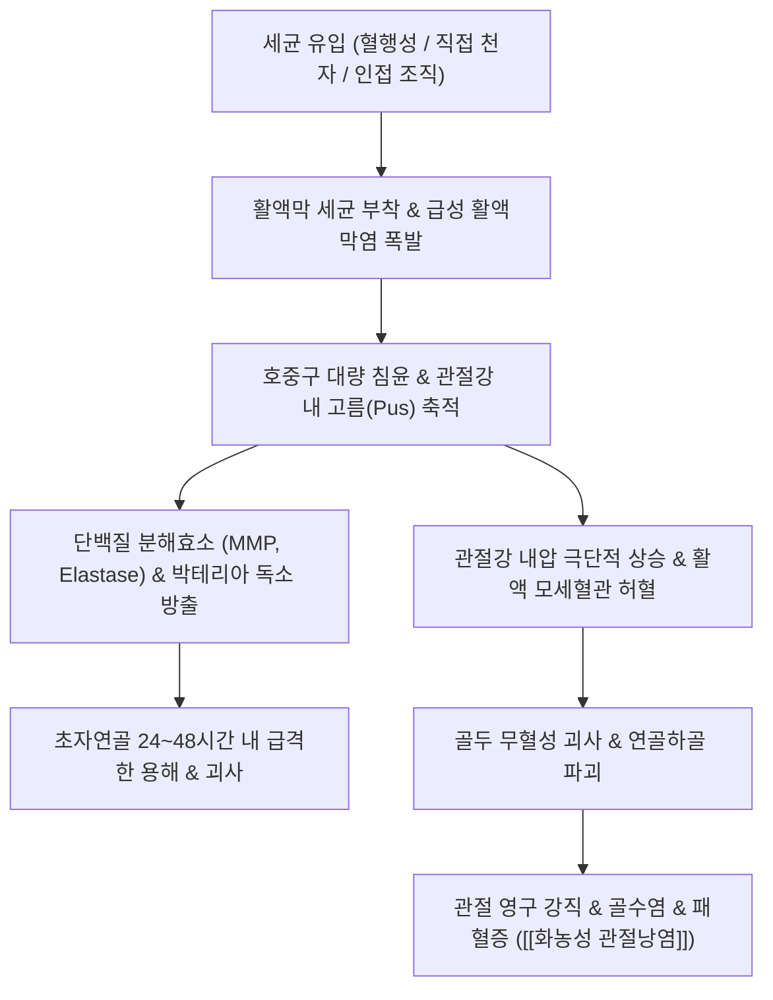

---
aliases:
  - 화농성 관절낭염
  - 화농성관절낭염
  - 화농성 관절염
  - 화농성관절염
  - Septic Arthritis
  - Suppurative Arthritis
  - Suppurative Bursitis
  - 化膿性 關節囊炎
  - 化膿性 關節炎
  - M00
tags:
  - 질환
  - 근골격계
  - 관절
  - 감염질환
  - 응급질환
---

# 🩺 [[화농성 관절낭염]] (Septic Arthritis & Suppurative Capsulitis / 化膿性 關節囊炎, ICD-10 M00 / M71.1)

> **핵심 3줄 요약 (Key Summary)**:
> - 📍 병소 부위 & 해부·병태생리: 황색포도상구균([[Staphylococcus aureus]]) 등 화농성 세균이 혈행성 파급 또는 직접 관절강·관절낭 내로 침투하여 호중구의 대량 침윤과 단백질 분해효소 방출로 24~48시간 내에 관절 연골을 급격히 비가역적으로 융해시키는 정형외과적 응급 감염 질환.
> - 🚩 전형적 임상 양상 & 3대 징후: 오한 및 전신 고열(>38.5℃), 단일 관절의 극심한 발적·열감·팽륜, 통증으로 인해 관절을 단 1도도 움직이지 못하는 가성 마비(Pseudoparalysis).
> - 🛠️ 핵심 감별 검사 & 한·양방 다각적 치료 전략: 관절강 천자액(Arthrocentesis) 검사(백혈구 >50,000/μL, 중성구 >75%, 혼탁한 황갈색/녹색 고름), 혈청 염증 수치(CRP, ESR 급상승), 상급 병원 응급 전원(외과적 관절경 세척 배농술 + 정맥 감수성 항생제 투여), 회복기 조직 재생 한의 보조 치료.
> - ⚠️ 응급 의뢰 레드플래그 & 악화 요인: 진단 및 감압 배농 지연 시 관절 연골의 완전 영구 파괴, 골수염 및 패혈성 쇼크(Septic Shock)로 사망 위험. 의심 즉시 한의원 내 침·부항·약침 시술을 절대 금기하고 즉각 응급실로 전원 의뢰.

---

## 📌 목차
1. [질환 개요 & 해부학적 병태생리](#1-질환-개요--해부학적-병태생리)
2. [병태생리 메커니즘 & 생체역학적 악순환 네트워크](#2-병태생리-메커니즘--생체역학적-악순환-네트워크)
3. [임상 증상 & 이학적 검사(Physical Exam) 알고리즘](#3-임상-증상--이학적-검사physical-exam-알고리즘)
4. [감별 진단 매트릭스 (Differential Diagnosis)](#4-감별-진단-매트릭스-differential-diagnosis)
5. [한의 통합 치료 프로토콜 (침·약침·추나·한약)](#5-한의-통합-치료-프로토콜-침약침추나한약)
6. [재활 운동 & 생활습관 티칭 가이드](#6-재활-운동--생활습관-티칭-가이드)
7. [💡 사용자 진료실 핵심 필기 & 임상 노하우 (Melt-In 잔여 심화 집약)](#7--사용자-진료실-핵심-필기--임상-노하우-melt-in-잔여-심화-집약)
8. [출처 및 학술 참고 문헌 (References)](#8-출처-및-학술-참고-문헌-references)

---

## 1. 질환 개요 & 해부학적 병태생리

![[화농성관절염_급성기_슬관절_Xray_수종소견.jpg|450]]
> [그림 1: 화농성 슬관절염 환자의 관절경(Arthroscopy) 소견: 활액막의 극심한 화농성 비후 및 육아종성 침윤(A)과 관절 초자연골의 급성 융해 및 궤양성 결손(B)]

* **질환 정의 및 역학**:
  * 화농성 관절낭염 및 관절염(Septic Arthritis / Suppurative Capsulitis)은 박테리아, 진균 등 병원성 미생물이 관절강 내 활액막과 관절낭에 침범하여 발생하는 **급성 파괴성 화농성 염증 질환**입니다.
  * 모든 연령에서 발생할 수 있으나 면역력이 취약한 소아(2세 미만), 65세 이상 고령자, 당뇨병, 간경변, 인공관절 치환술 환자에서 호발합니다.
  * 진단과 외과적 배농이 24~48시간만 지연되어도 관절 연골이 녹아내려 평생 관절 장애가 남을 수 있는 대표적인 **정형외과적 응급 질환(Orthopedic Emergency)**입니다.
* **관련 해부학적 구조물 및 원인균**:
  * **호발 관절**: 주로 **[[슬관절]](전체의 50% 이상)**에 가장 흔하며, [[고관절]](20%), [[견관절]](10%), [[족관절]](10%), [[주관절]] 순으로 발생합니다. 대다수(80~90%)가 단일 관절(Monoarticular)을 침범합니다.
  * **원인 병원균**:
    * **황색포도상구균(Staphylococcus aureus)**: 전체 원인균의 50~60% 이상을 차지하는 최다 원인균 (MRSA 포함).
    * 연쇄상구균(Streptococcus pneumoniae, Group A/B Strep): 15~20%.
    * 그람 음성 간균(Pseudomonas, E. coli): 고령자, 면역저하자, 약물 남용자.
    * 임균(Neisseria gonorrhoeae): 성생활이 활발한 젊은 성인의 파종성 임균 감염.
  * **감염 경로**:
    1. **혈행성 전파(Hematogenous spread, 최다)**: 다른 부위(피부 종창, 요로감염, 호흡기 등)의 균혈증에서 활액막의 풍부한 모세혈관망을 통해 유입.
    2. **직접 침습(Direct inoculation)**: 관절강 주사, 침술, 수술, 외상성 관통상.
    3. **인접 조직 파급(Contiguous spread)**: 인접 골수염, 연조직염, 화농성 점액낭염의 관절낭 관통.

---

## 2. 병태생리 메커니즘 & 생체역학적 악순환 네트워크

![[화농성관절염_관절강천자_화농성_활액삼출물_임상사진.jpg|450]]
> [그림 2: 화농성 관절염 환자에게서 관절강 천자(Arthrocentesis)로 흡인된 전형적인 혼탁한 황갈색 화농성 삼출액 (WBC >50,000/μL, 다형핵구 >75%)]

### 1) 24~48시간 내 연골 파괴의 분자생물학적 기전
* **박테리아 독소와 호중구 분해효소의 협공**: 관절강 내로 유입된 세균은 활액막에 달라붙어 독소를 분비하고, 이를 방어하기 위해 수만 개의 호중구가 활액 내로 쏟아져 나옵니다.
* **연골 기질의 융해**: 호중구가 세균을 식균하면서 터져 나올 때 분비되는 엘라스타아제(Elastase), 카텝신, [[MMP]] 등 강력한 단백 분해효소가 관절 연골의 제2형 콜라겐과 프로테오글리칸을 수일 만에 완전히 녹여버립니다.
* **관절 내압 상승과 허혈성 괴사**: 밀폐된 관절낭 내에 고름(Pus)이 가득 차면서 관절강 내 압력이 모세혈관 관류압을 초과하여 관절낭과 연골하골의 국소 허혈성 괴사가 동반됩니다.

---

## 3. 임상 증상 & 이학적 검사(Physical Exam) 알고리즘

![[화농성관절낭염_슬개전점액낭염_급성종창_임상사진.jpg|450]]
> [그림 3: 우측 슬관절 슬개골 전방에 발생한 급성 점액낭염 및 관절낭염 종창 임상 사진: 국소 피부 발적, 열감 및 파동성 팽륜 관찰]

### 1) 3대 전형적 임상 증상
* **격렬한 단일 관절통**: 가만히 있어도 쑤시고 욱신거리는 극심한 통증.
* **전신 발열과 오한**: 체온이 38.5℃ 이상으로 급상승하며 오한 동반 (단, 고령자나 면역저하자는 발열이 미약할 수 있어 주의).
* **가성 마비 (Pseudoparalysis)**: 통증과 관절강 팽창으로 인해 환자가 다리를 전혀 움직이지 못하며, 검사자가 살짝만 건드려도 비명을 지름.

### 2) 필수 감별 검사 (Physical Exam & Arthrocentesis)
* **수동 관절가동범위(PROM) 소실 검사**:
  * 단순 관절염이나 점액낭염은 일정 각도까지 수동 움직임이 가능하지만, **화농성 관절염은 수동 가동 시 관절 전 방향에서 극심한 통증과 근육 연축으로 가동범위가 0도에 가깝게 소실**됩니다.
* **관절강 천자액(Synovial Fluid) 정밀 분석 (골드 스탠다드)**:
  * **성상**: 정상 활액(맑고 점조한 담황색)과 달리 **혼탁하고 불투명한 황색·녹색의 농양 성상**.
  * **백혈구 수(WBC)**: **> 50,000 /μL** (종종 100,000 /μL 초과).
  * **다형핵 백혈구 비율**: **> 75~90%**.
  * **그람 염색 및 균 배양 검사**: 세균 동정 및 항생제 감수성 검사 필수.
  * **혈액 검사**: 혈청 백혈구(WBC) 상승, CRP 및 ESR 급격한 동반 상승.

---

## 4. 감별 진단 매트릭스 (Differential Diagnosis)

| 감별 질환 | 발병 양상 및 체온 | 관절강 천자액 백혈구(WBC) | PROM 가동 제한 특징 | 확진 핵심 지표 |
| :--- | :--- | :--- | :--- | :--- |
| [[화농성 관절낭염]] (본 질환) | 수시간~수일 내 급성, 고열(>38.5℃) | **> 50,000/μL (농양 성상)** | **전 방향 완전 불능 (가성마비)** | 그람 염색 및 세균 배양 양성 |
| [[통풍성 관절염]] | 야간 급성 발작, 미열 가능 | 20,000~50,000/μL | 심한 제한 있으나 일부 굴곡 가능 | 편광현미경 상 요산염 바늘 결정 |
| [[가성통풍]] (CPPD) | 급성 단일 관절통, 미열 | 10,000~30,000/μL | 중등도 제한 | 편광현미경 상 능형 피로인산칼슘 결정 |
| [[반응성 관절염]] | 위장관/비뇨기 감염 2~4주 후 | 10,000~30,000/μL | 비대칭 소수 관절염 | 무균성 활액 (세균 배양 음성), HLA-B27 |
| 단순 점액낭염 (비감염성) | 만성 기계적 마찰, 발열 없음 | < 2,000/μL (맑은 장액) | 관절 자체의 능동/수동 ROM 정상 | 관절강 내가 아닌 피하 점액낭 종창 |

---

## 5. 한의 통합 치료 프로토콜 (침·약침·추나·한약)

* **⚠️ 급성 활동기 절대 금기 수칙 (CRITICAL RED FLAG)**:
  * **급성 화농성 관절염 의심 시 한의원 내의 침, 뜸, 부항, 약침, 추나 치료는 절대 금기**입니다.
  * 관절낭 내 세균 감염이 있는 상태에서 침을 놓거나 음압 사혈(습부항)을 시행하면 감염이 피하 조직으로 확산되거나 이차 중복 감염을 유발하여 패혈증을 촉발할 수 있습니다.
  * 발견 즉시 환자에게 위험성을 설명하고 **상급 종합병원 정형외과 응급실로 즉시 전원 의뢰**해야 합니다.
* **현대의학적 표준 응급 치료 (상급 병원 연계)**:
  * **응급 관절경하 세척 및 배농술 (Arthroscopic debridement & lavage)**: 관절강 내 고름과 피브린 찌꺼기를 대량의 생리식염수로 세척하고 배액관 삽입.
  * **경정맥 항생제 요법 (IV Antibiotics)**: 1차 경험적 항생제(세파졸린, 반코마이신 등) 투여 후 배양 결과에 따라 표적 항생제 4~6주간 유지.
* **수술 및 항생제 치료 완료 후 '회복기' 한의 보조 치료**:
  * 급성 감염이 완전히 박멸되고 염증 수치(CRP/ESR)가 정상화된 후, 잔여 관절 뻣뻣함과 근위축을 회복시키는 단계에서 한의 치료 개입.
  * **침구 치료**: 독비, 내슬안, 양릉천에 자침하여 수술 후 관절강 주위 혈류 개선 및 섬유화 유착 완화.
  * **한약 치료**: 만성 소모성 감염 후 기혈 손상을 보하고 관절 연골을 회복시키는 처방 ([[보중익기탕]], [[십전대보탕]], [[독활기생탕]]).

---

## 6. 재활 운동 & 생활습관 티칭 가이드

* **감염기 절대 부동화(Immobilization)**:
  * 항생제 투여 및 배농 초기에는 관절을 깁스나 보조기로 고정하여 세균성 염증의 파급을 막고 관절강 내압을 안정화.
* **관절 구축 방지 지속적 수동 운동 (CPM)**:
  * 염증 수치가 안정화된 후 조기에 지속적 수동 운동 장치(CPM)를 이용하여 무리한 능동 부하 없이 관절 유착 방지.
* **당뇨병 및 면역 기저 질환 철저 관리**:
  * 혈당 조절 실패는 관절 감염의 재발 위험을 3배 이상 높이므로 당화혈색소 7.0% 이하 엄격 관리.

---

## 7. 💡 사용자 진료실 핵심 필기 & 임상 노하우 (Melt-In 잔여 심화 집약)

* **진료실 10초 감별 공식: '통풍'인 줄 알고 온 환자의 세균성 관절염 스크리닝**:
  * 환자가 "무릎이 갑자기 빨갛게 부어오르고 불덩이처럼 뜨거워요, 통풍인가요?" 하고 절뚝거리며 들어올 때:
    1. **체온 측정**: 38℃ 이상의 전신 발열이 있는가?
    2. **수동 ROM 테스트**: 검사자가 발목을 잡고 무릎을 살짝 굽히려 할 때 비명을 지르며 다리를 단 1도도 못 구부리게 하는가?
    3. **최근 시술력 확인**: "최근 1~2주 내에 다른 병의원이나 무자격자에게 무릎 주사나 관절 천자, 침을 맞은 적이 있습니까?"
  * 이 3가지 중 2개 이상 해당되면 통풍보다 **화농성 관절염(Septic Arthritis)**을 최우선으로 의심해야 합니다.
* **절대 침을 꽂지 말아야 할 순간**:
  * 관절 피부가 붉게 달아오르고 팽팽하게 부풀어 오른 환자에게 "염증을 빼준다"며 아시혈 자침이나 습부항(사혈)을 하는 것은 치명적인 의료사고로 이어집니다.
  * 의심 즉시 "이것은 단순 관절염이 아니라 관절 속에 균이 차서 연골이 녹을 수 있는 급성 감염 질환이므로, 지금 바로 큰 병원 응급실로 가서 균 검사와 항생제 주사를 맞으셔야 합니다"라고 단호히 전원시켜야 환자의 관절을 살릴 수 있습니다.

---

## 8. 출처 및 학술 참고 문헌 (References)

* Sharff KA, Richards EP, Townes JM. (2013). Clinical management of septic arthritis. *Current Rheumatology Reports*, 15(6), 332.
  * [PubMed Link](https://pubmed.ncbi.nlm.nih.gov/23591823/)
  * [연구 요약] 화농성 관절염의 역학, 황색포도상구균(S. aureus) 중심의 미생물학적 원인, 관절 천자액 백혈구 기준(>50,000/μL, 다형핵구 >75%) 및 24~48시간 내 응급 외과적 관절강 세척 배농술의 필수성을 정립함.
* Margaretten ME, Kohlwes J, Moore D, Bent S. (2007). Does this adult patient have septic arthritis?. *JAMA*, 297(13), 1478-1488.
  * [PubMed Link](https://pubmed.ncbi.nlm.nih.gov/17405973/)
  * [연구 요약] 성인 화농성 관절염 진단에서 이학적 소견과 검사 지표의 우도비(Likelihood Ratio)를 메타분석하여, 관절강 활액 백혈구 수치 상승과 수동 관절가동 시의 극심한 통증이 가장 강력한 예측 인자임을 입증함.
* Aaron DL, Patel A, Kayiaros S, Calfee R. (2011). Four common types of bursitis: diagnosis and management. *Journal of the American Academy of Orthopaedic Surgeons*, 19(6), 359-367.
  * [PubMed Link](https://pubmed.ncbi.nlm.nih.gov/21628647/)
  * [연구 요약] 슬개전 및 주두 점액낭염에서 감염성(화농성) 대 비감염성 병변의 감별 지표(국소 발적, 열감, 관절강 외 종창) 및 화농성 점액낭염의 외과적 배농과 항생제 치료 원칙을 체계화함.
