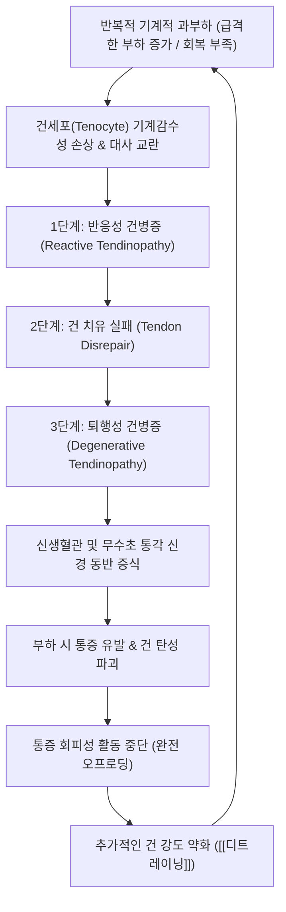

---
aliases:
  - 힘줄병증
  - Tendinopathy
  - 건병증
  - Tendinosis
  - 텐디노시스
  - 건증
  - 腱病症
  - M76
  - M77
tags:
  - 이론
  - 질환
  - 근골격계
  - 건병증
  - 과사용증후군
  - 재활
title: 힘줄병증
date: 2026-09-22
출처: "PMID: 40011018"
---

# 🩺 [[힘줄병증]] (Tendinopathy / 腱病症, ICD-10 M76 / M77)

> **핵심 3줄 요약 (Key Summary)**:
> - 📍 병소 부위 & 해부·병태생리: 건(Tendon) 및 그 부착부(Enthesis)에 반복적 과부하와 미세손상이 누적되어 염증(-itis)이 아닌 건세포 자멸사, 제1형 콜라겐 감소, 제3형 콜라겐 및 비정상적 기질 변성과 신생혈관·무수초 신경 증식이 발생하는 '실패한 치유(Failed healing)' 퇴행성 병변.
> - 🚩 전형적 임상 양상 & 3대 징후: 부하 의존성 국소 통증(점프, 계단, 그립 동작 등), 건 부착부 1~2cm 부위의 뚜렷한 국소 압통, 아침 기상 시 또는 장시간 휴식 후 첫 움직임에서의 뻣뻣함(Morning stiffness).
> - 🛠️ 핵심 감별 검사 & 한·양방 다각적 치료 전략: 부위별 저항성 유발 검사 및 초음파(건 비후, 저에코성 변성, 도플러 신생혈관 확인), 등척성 수축을 통한 즉각 진통 후 점진적 편심성(Eccentric) 부하 재활, 침·도침·약침으로 통증 역치를 올려 운동 진입을 돕는 한의 통합 치료.
> - ⚠️ 응급 의뢰 레드플래그 & 악화 요인: 건의 급성 완전 파열(체중 지지 불가, 보행 불능, 함몰 촉지), 국소 스테로이드 반복 주사로 인한 건 파열 위험 급증, 장기 지속 야간통 및 감염 의심 징후.

---

## 📌 목차
1. [질환 개요 & 해부학적 병태생리](#1-질환-개요--해부학적-병태생리)
2. [병태생리 메커니즘 & 생체역학적 악순환 네트워크](#2-병태생리-메커니즘--생체역학적-악순환-네트워크)
3. [임상 증상 & 이학적 검사(Physical Exam) 알고리즘](#3-임상-증상--이학적-검사physical-exam-알고리즘)
4. [감별 진단 매트릭스 (Differential Diagnosis)](#4-감별-진단-매트릭스-differential-diagnosis)
5. [한의 통합 치료 프로토콜 (침·약침·추나·한약)](#5-한의-통합-치료-프로토콜-침약침추나한약)
6. [재활 운동 & 생활습관 티칭 가이드](#6-재활-운동--생활습관-티칭-가이드)
7. [💡 사용자 진료실 핵심 필기 & 임상 노하우 (Melt-In 잔여 심화 집약)](#7--사용자-진료실-핵심-필기--임상-노하우-melt-in-잔여-심화-집약)
8. [출처 및 학술 참고 문헌 (References)](#8-출처-및-학술-참고-문헌-references)

---

## 1. 질환 개요 & 해부학적 병태생리

![[힘줄병증_슬개건병증_점퍼스니_해부병태도해.jpg|450]]
> [그림 1: 슬개건병증(점퍼스 니, Jumper's Knee)의 슬개골 하단 부착부 미세손상 및 부하 집중 구역 해부학적 도해]

* **질환 정의 및 용어 체계**:
  * 힘줄병증(Tendinopathy)은 힘줄(Tendon)과 그 뼈 부착부(Enthesis)에 반복적이고 과도한 기계적 부하가 가해져 발생하는 만성 과사용성 건 질환입니다.
  * 조직병리학적으로 염증세포(호중구, 림프구) 침윤이 거의 없고, 건세포의 기질 퇴행과 혈관섬유아세포성 증식(Angiofibroblastic hyperplasia)이 주를 이루므로 '건염(Tendinitis)'이라는 용어 대신 **'건병증(Tendinopathy)' 또는 '건증(Tendinosis)'**이 표준 의학 용어입니다.
* **관련 해부학적 구조물 및 호발 부위**:
  * **주관절**: [[단요측수근신근]](ECRB) 기시부의 [[외측상과염]](테니스 엘보), 굴곡-회내근 기시부의 [[내측상과염]](골퍼 엘보).
  * **하지 및 족부**:
    * [[아킬레스건]]: 중간부(종골 상방 2~6cm 저혈류 구역) 및 종골 부착부(Insertional).
    * [[슬개건]]: 슬개골 하극 부착부의 [[슬개골하건염]](점퍼스 니).
    * [[후경골근건]]: 내측 족관절 후방 주행부(후경골근건 기능부전).
  * **견관절**: [[극상근]], [[극하근]], [[견갑하근]](회전근개 건병증), [[상완이두근]] 장두건.
  * **신경학적 연계**: 만성 힘줄병증에서는 병변 부위의 무수초 통각 신경 증식뿐 아니라 인접 신경의 기계적 감수성 증가(예: 테니스 엘보에서 [[요골신경]])와 중추 감작(Central sensitization)이 흔히 동반됩니다.

---

## 2. 병태생리 메커니즘 & 생체역학적 악순환 네트워크

![[힘줄병증_슬개건_부착부_건병증_MRI_시상면.jpg|450]]
> [그림 2: 슬관절 시상면 PDW 지방억제(FS) MRI 소견: 슬개골 하극 부착부 슬개건 근위부의 현저한 비후 및 고신호강도 건병증 병변]

### 1) 쿡 & 퍼담의 3단계 건병증 연속체 모델 (Cook & Purdam Continuum Model)
* **1단계: 반응성 건병증 (Reactive Tendinopathy)**: 급격한 부하 증가 후 발생하는 비염증성 증식 반응. 건세포가 부풀어 오르고 프로테오글리칸을 과분비하여 단기적으로 건이 두꺼워지며 스트레스를 분산시킴. 부하를 줄이면 정상 회복 가능.
* **2단계: 건 치유 실패 (Tendon Disrepair)**: 지속적인 과부하로 건 기질의 해체가 본격화됨. 제1형 콜라겐 섬유가 끊어지고 무질서한 제3형 콜라겐이 침착되며 세포외 기질이 붕괴됨.
* **3단계: 퇴행성 건병증 (Degenerative Tendinopathy)**: 건세포가 대량으로 자멸사(Apoptosis)하고 무혈관/무세포성 기질 괴사 구역이 발생. 비정상적인 신생혈관(Neovascularization)과 통각 신경섬유가 함께 침투하여 비가역적 구조 변화 초래.

### 2) 인장 부하(Tensile Load) vs 압박 부하(Compressive Load)의 이원화
* **인장 부하**: 스프린트나 점프 시 스프링처럼 에너지를 저장하고 방출할 때 건 복부에 가해지는 견인력.
* **압박 부하**: 뼈의 돌출부 위를 건이 돌아가는 부착부(Enthesis)에서 건이 뼈에 직접 눌리는 기계적 압박력.
  * 예: **아킬레스건 삽입부 건병증**은 발목이 배측굴곡될 때 종골 후상방 뼈 돌출부가 아킬레스건을 찌그러뜨리는 압박력이 핵심 발병 기전입니다. 따라서 삽입부 병변에서는 과도한 스트레칭(배측굴곡)이 오히려 건을 파괴합니다.

---

## 3. 임상 증상 & 이학적 검사(Physical Exam) 알고리즘

![[힘줄병증_아킬레스건병증_해부도해.png|450]]
> [그림 3: 아킬레스건 중간부(Midportion, 종골 부착부 2~6cm 상방)의 국소 건병증 병변 및 족저근막과의 생체역학적 연결 도해]

### 1) 주소증 및 부하 특이적 임상 양상
* **워밍업 현상 (Warm-up Phenomenon)**: 운동이나 활동을 시작할 때는 뻑뻑하고 아프다가, 몸이 풀리면 통증이 줄어들고, 운동이 끝난 후나 다음 날 아침에 다시 극심한 둔통과 강직감이 찾아옴.
* **기능적 저하**: 악력 약화(테니스 엘보), 점프 후 착지 불안정(슬개건), 뒤꿈치 들기 불능(아킬레스건).

### 2) 필수 이학적 검사법 (Physical Examination)
* **국소 압통 촉진 (Palpation)**:
  * 힘줄의 부착부 또는 중간부 1~2cm 국소 부위를 정밀 압박 시 극심한 압통 유발.
  * 압통역치(PPT) 측정으로 정량화.
* **저항성 등척성 부하 검사**:
  * **외측상과염**: 코젠 검사(Cozen's test, 손목 저항 신전) 및 밀스 검사(Mill's test).
  * **슬개건병증**: 한 발 쇠퇴 스쿼트 검사(Single-leg decline squat test, 25도 경사판에서 무릎 굴곡 시 슬개골 하단 극심한 통증).
  * **아킬레스건병증**: 한 발 뒤꿈치 들기(Single-leg heel raise) 반복 검사 및 호핑(Hopping) 검사.
* **초음파 및 MRI 소견**:
  * 건의 방추형 비후, 정상적인 빗살무늬 섬유 패턴 소실 및 국소 저에코(Hypoechoic) 음영, 파워 도플러 상 신생혈관 혈류 신호 확인.

---

## 4. 감별 진단 매트릭스 (Differential Diagnosis)

| 감별 질환 | 호발 병소 및 병태생리 | 증상 발현 양상 | 이학적 감별 포인트 |
| :--- | :--- | :--- | :--- |
| [[힘줄병증]] (본 질환) | 건 실질 및 부착부, 기계적 과부하 | 부하 의존성 국소 통증, 워밍업 현상 | 건 국소 압통, 저항 수축 시 통증 재현 |
| 말초 신경 포착 (예: [[요골신경 포착]]) | 신경 주행 경로 협착 | 저림, 찌릿함, 방사통, 야간 악화 | 신경긴장검사(ULNT) 양성, 감각 저하 동반 |
| 관절 내 병변 (반월판·연골 손상) | 관절 연골 및 관절강 내부 | 관절선 통증, 관절 잠김, 관절 삼출액 | 관절선 압통, 맥머레이/애플리 검사 양성 |
| 전신 염증성 관절염 (척추관절염) | 자가면역성 다발성 부착부염 | 아침 강직 1시간 이상, 휴식 시 악화 | 다발성 관절 침범, HLA-B27, CRP 상승 |
| 급성 건 완전 파열 | 고강도 외력에 의한 건 단열 | 순간적인 '뚝' 소리와 함께 기능 완전 상실 | 건 연속성 소실, 결손 부위 함몰 촉지 |

---

## 5. 한의 통합 치료 프로토콜 (침·약침·추나·한약)

* **침구 치료 (Acupuncture)**:
  * **원칙**: 침 치료는 단순히 통증만 끄는 것이 아니라, **'통증 역치를 즉각 낮추어 점진적 부하 운동으로 진입할 수 있는 문을 열어주는 역할'**을 수행.
  * 건 부착부 주위 [[아시혈]] 및 운동점 자침, 2~4Hz 저주파 전침을 인가하여 국소 일산화질소(NO) 분비 및 건 미세혈류 촉진.
* **도침 및 건침 치료 (Acupotomy & Dry Needling)**:
  * 만성 난치성 퇴행성 건병증 구역에 도침을 시술하여 유착된 섬유성 반흔을 미세 박리하고, 국소 출혈과 급성 치유 반응(성장인자 PDGF, TGF-β 분비)을 유도하여 정상 제1형 콜라겐 리모델링 재가동.
* **약침 치료 (Pharmacopuncture)**:
  * **신바로약침 / 자하거 약침**: 건 실질 내 직접 주입은 피하고 건 주위 근막 및 부착부에 주입하여 건세포의 기질 단백 합성 및 재생 유도.
  * ⚠️ 주의: 자극성이 너무 강한 봉약침 고농도 시술은 급성 건막염을 유발할 수 있으므로 보수적 농도 조절 필요.
* **추나 치료 (Chuna Manipulation)**:
  * **관절가동추나 (Mulligan MWM / Maitland)**: 건에 가해지는 생체역학적 전단력을 줄이기 위해 인접 관절의 정렬 교정 및 부수적 활주 회복.
  * **신경가동술(Neurodynamics)**: 신경 기계감수성이 항진된 경우 신경 슬라이딩 기법 병용.
* **한약 치료 (Herbal Medicine)**:
  * **강근골(壯筋骨), 활혈거어(活血祛瘀)**: 만성 과사용으로 인한 근건 퇴행을 보익하는 처방.
  * 처방: [[독활기생탕]], [[서경탕]], [[오적산]], [[순기활혈탕]].

---

## 6. 재활 운동 & 생활습관 티칭 가이드

* **점진적 부하 운동 4단계 프로토콜 (치료의 핵심 기둥)**:
  * **1단계: 등척성 운동 (Isometric Loading)**:
    * 관절 움직임 없이 건에 장력만 가하는 운동 (예: 스페인 스쿼트 버티기, 발꿈치 들고 45초 버티기 5세트).
    * 중추신경계의 억제를 해제하고 **즉각적인 진통 효과(Analgesic effect)** 유도.
  * **2단계: 등장성 동심성-원심성 운동 (Isotonic Heavy Slow Resistance)**:
    * 무거운 무게로 3초간 천천히 올리고 3초간 천천히 내리기 (주 3회).
  * **3단계: 에너지 저장 및 플라이오메트릭 운동 (Energy Storage)**:
    * 줄넘기, 가벼운 호핑(Hopping) 등 빠른 신장-단축 주기 훈련.
  * **4단계: 스포츠 특이적 기능 훈련 (Sport-specific Return)**.
* **부착부 vs 중간부 아킬레스 건병증의 재활 감별 (RCT 근거)**:
  * **중간부형**: 알프레드손(Alfredson) 편심성 운동 및 계단 끝에서 뒤꿈치를 발판 아래로 깊게 내리는 스트레칭 수행.
  * **부착부(삽입부)형**: 계단 아래로 내리는 동작은 종골 돌출부의 압박력을 극대화하므로 절대 금기! **평지에서만 뒤꿈치를 들고 내리는 저압박 부하 훈련** 수행 및 신발에 힐 리프트(Heel lift) 패드 착용.
* **통증 모니터링 규칙 (Traffic Light System)**:
  * 운동 중 통증은 0~3점(초록불, 안전) 범위 내에서 허용.
  * 운동 후 24시간이 지난 다음 날 아침 통증이 운동 전보다 증가하지 않아야 적정 부하 용량으로 판정.

---

## 7. 💡 사용자 진료실 핵심 필기 & 임상 노하우 (Melt-In 잔여 심화 집약)

* **국소 스테로이드 주사의 치명적 역설 (Steroid Trap)**:
  * 환자가 정형외과나 통증클리닉에서 '뼈주사(스테로이드)'를 맞고 1~2주간 통증이 씻은 듯이 나았다고 좋아할 때가 가장 위험합니다.
  * 코크란 리뷰와 최신 임상 가이드라인에 따르면, 국소 스테로이드는 강력한 항염 작용으로 단기 통증만 마비시킬 뿐, **건세포의 콜라겐 합성을 억제하고 건을 괴사시켜 6~12개월 후 재발률을 3배 이상 높이고 완전 파열을 유발**합니다.
  * 진료실에서 환자에게 스테로이드의 일시적 속임수와 반복 주사의 파열 위험성을 명확히 설명하고, 점진적 부하 운동으로 근본 인장력을 회복해야 함을 설득해야 합니다.
* **'치료 + 부하' 동일 세션 연결 공식**:
  * 침, 약침, 도침 시술 후 환자를 그냥 귀가시키면 치료 효과가 반감됩니다.
  * ① 침/도침 치료로 통증 역치를 즉각 상승시킨 후(진료실 내에서 저항 검사로 즉시 통증 감소 확인), ② 그 자리에서 바로 통증이 줄어든 상태로 수행할 수 있는 1단계 등척성 운동(Isometric)을 시연 지도하고, ③ 환자 맞춤형 자가 운동 처방전을 손에 쥐여주어야 합니다.
  * **"침과 도침은 힘줄을 고치는 것이 아니라, 힘줄이 스스로 튼튼해질 수 있도록 운동할 수 있는 문을 열어주는 열쇠입니다."**라는 설명 스크립트를 환자에게 전달하십시오.

---

## 8. 출처 및 학술 참고 문헌 (References)

* Cook JL, Purdam CR. (2009). Is tendon pathology a continuum? A pathology model to explain the clinical presentation of load-induced tendinopathy. *British Journal of Sports Medicine*, 43(6), 409-416.
  * [PubMed Link](https://pubmed.ncbi.nlm.nih.gov/18812414/)
  * [연구 요약] 과사용 건 질환을 반응성 건병증, 건 치유 실패, 퇴행성 건병증의 3단계 '연속체 모델(Continuum model)'로 최초 정립하고, 염증이 아닌 기계적 부하 불균형에 따른 세포 기질 변성 병태생리를 체계화함.
* Scott A, Squier K, Alfredson H, Bahr R, et al. (2020). ICON 2019: International Scientific Tendinopathy Symposium Consensus: Clinical Terminology. *British Journal of Sports Medicine*, 54(5), 260-262.
  * [PubMed Link](https://pubmed.ncbi.nlm.nih.gov/31405891/)
  * [연구 요약] 전 세계 건병증 전문가 합의문으로, 과거의 혼란스러운 '건염/건막염' 명칭을 배제하고 '건병증(Tendinopathy)' 표준 임상 용어와 부하 기반 재활 치료 원칙을 정립함.
* Rio E, Kidgell D, Purdam C, Gaida J, Moseley GL, Pearce AJ, Cook J. (2015). Isometric exercise induces analgesia and reduces inhibition in patellar tendinopathy. *British Journal of Sports Medicine*, 49(19), 1277-1283.
  * [PubMed Link](https://pubmed.ncbi.nlm.nih.gov/25979840/)
  * [연구 요약] 슬개건병증 환자에서 중등도 등척성 수축 운동(Isometric exercise, 45초 5회)이 즉각적인 진통 효과(Pain reduction)와 피질척수로 억제 완화를 유도하여 점진적 편심성 운동 진입을 돕는 신경생리학적 메커니즘을 규명함.

---
## 📎 개념 학습 보충 (2026-09-22 논문 연계)

- **인장 부하(tensile load) vs 압박 부하(compression)의 분리 — 삽입부 건병증의 핵심 개념(2026-09-22 리뷰 3번)**: BJSM 2025;59(9):640-650, [PMID: 40011018](https://pubmed.ncbi.nlm.nih.gov/40011018/)
  - **인장 부하**는 건 재형성에 **필요한** 자극이고, **압박**은 삽입부 병리에서 **해로운** 자극이다. 그런데 대다수 재활 프로토콜(종아리 스트레칭·배측굴곡 종말 범위 운동)이 **오히려 압박을 증가시키는 방향**으로 설계돼 있었다
  - **LTCR(저압박 재활)의 전략**: **인장 부하는 유지하면서 압박 요소만 차단** — 배측굴곡 제한, 스트레칭 배제, 뒤꿈치 리프트, 종아리 마사지. 이 '부하의 종류를 구분하는 원리'가 이 회차의 병태생리 핵심이다
  - **결과**: VISA-A 12주 군간차 **12.9(95% CI 6.2–19.6, P<0.001)**, 24주 **10.4(95% CI 3.7–17.1, P<0.001)** — MCID 10점 초과
- **기존 '압박 가설 축'(09-16 회차)에 추가되는 실천 원칙**: ① **"아킬레스 삽입부 통증에는 종아리 스트레칭을 시키지 말고 뒤꿈치를 올려라"** ② **"스트레칭을 하면 더 아픈가?"** 를 문진의 스크리닝 질문으로 삼는다 → [[뒤꿈치 리프트]]
- **한계·정직성**: LTCR은 **복합 개입(교육 + 배측굴곡 제한 + 리프트 + 마사지)** 이어서 어느 요소가 결정적이었는지 분리 불가. 또한 그룹 간 대화에서 '압박' 정보를 의도적으로 통제했으므로 **교육·인지 요소의 기여를 배제할 수 없다**(저자 명시) — "압박 교육만으로 좋아진다"는 주장은 성립하지 않는다 → [[생물리사회적 모델]]
- 관련: [[아킬레스건염]] · [[등척성 운동]] · [[에너지 저장·방출 운동]] · [[VISA-A]] · [[2026-09-22_근골격계-사지말초_심층리뷰]] 3번
