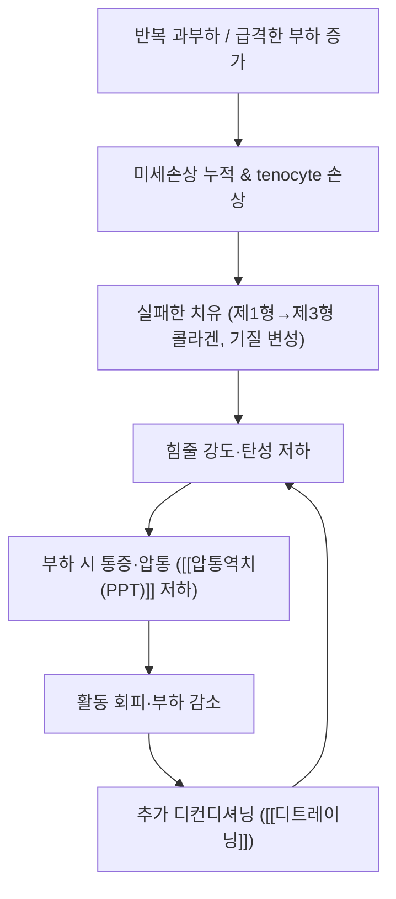

---
aliases:
  - 힘줄병증
  - Tendinopathy
  - 건병증
  - Tendinosis
  - 텐디노시스
  - 건증
tags:
  - 질환
  - 근골격계질환
  - 건병증
  - 과사용증후군
  - 재활
---
# 🩺 힘줄병증 (Tendinopathy, 건병증 / 텐디노시스)

> **핵심 3줄 요약 (Key Summary)**:
> - 📍 병소·병태생리: 힘줄의 만성 과사용성 병변으로, **염증(-itis)이 아니라 '실패한 치유(disrepair)'** 과정 — tenocyte 세포자멸·제1형 콜라겐 감소 → 제3형 콜라겐·기질 변성, 신생혈관·무수초신경 동반 ([[외측상과염]]·[[아킬레스건염]]·[[슬개골하건염]])
> - 🚩 임상 양상: 부하 시 통증(특정 동작에서 뚜렷), 국소 압통, **아침·휴식 후 첫 움직임의 강직감**, 점진적 악화·장기 지속 (>3개월 = 만성)
> - 🛠️ 치료 전략: **점진적 부하 운동(편심성 등)이 축** + 통증 조절(침·도침·주사는 '부하 진입을 돕는' 보조) — 국소 스테로이드는 단기 통증 완화에 그치고 **장기 재발을 늘린다**
> - ⚠️ 레드플래그: 야간 통증·체중 감소·발열, 급성 완전 파열, 종양 의심 → 영상 검사·정형외과 의뢰.

---

## 1. 질환 개요 & 해부학적 병태생리
- **정의**: 힘줄(건)과 그 부착부(enthesis)의 만성 과사용성 병변. 병리 소견상 **염증세포 침윤이 거의 없고 퇴행성·변성 소견이 우세**하므로 '건염(tendinitis)'보다 **'건병증(tendinopathy)·건증(tendinosis)'** 이 정확한 용어다
- **용어 정리**
  - **건병증(tendinopathy)**: 임상 증상 + 병리 변화를 아우르는 총칭
  - **건증(tendinosis)·건증성 병변**: 병리 소견(콜라겐 변성·혈관섬유아세포성 증식)을 강조할 때(Nirschl의 angiofibroblastic tendinosis)
  - **부착부 병증(enthesopathy)**: 골 부착부에 국한된 경우
- **관련 해부·역학**: 힘줄은 반복 부하를 견디도록 설계된 조직이지만, **부하 증가 속도가 조직 적응 속도를 앞지르면** 미세손상이 누적된다. 호발 부위는 부하가 집중되는 ECRB 기시부(외측상과염), 아킬레스건, 회전근개, 슬개건, 후경골건 등
- **동반 요소**: [[힘줄병증]] 환자의 상당수에서 **신경 기계감수성 증가**(예: 외측상과염에서 요골신경)와 **중추 감작**이 동반돼 통증이 확대된다 — 순수 국소 병변으로 보지 않는다

---

## 2. 병태생리 메커니즘 & 생체역학적 악순환 네트워크

- **부하-용량 모델**: 건 조직은 **점진적·반복적 부하에 적응(mechanotransduction → 콜라겐 합성·재형성)** 하지만, **급격한 증량·회복 부족**에서는 퇴행이 앞선다. 임상 경과는 반응성(reactive) → 치유 실패(disrepair) → 퇴행성(degenerative) 단계의 연속체로 설명된다
- **통증 기전**: 병변 부위의 **무수초 신경·신생혈관 동반**, 국소 염증매개체·신경성 염증물질, 그리고 중추 감작이 복합돼 통증이 '조직 손상 정도와 불일치'하게 나타난다
- **치유 지연 요인**: 스테로이드 주사, 급격한 휴식(완전 오프로딩), 고령·당뇨·흡연, 부적절한 부하 관리

---

## 3. 임상 증상 & 이학적 검사 알고리즘
- **주소증**
  - 특정 동작에서 시작되는 통증(그립·계단·점프·머리 위 작업), **국소 압통(부착부 1~2cm)**
  - 아침 첫 움직임의 **강직감**(수 분 내 완화), 활동 후 통증 증가
  - 악력·점프력 등 **기능 저하**(객관 지표로 확인 가능)
- **이학적 검사(부위별 예시)**
  - 외측상과염: 저항성 손목 신전·중지 신전 검사(Cozen·Mill 검사), 신경긴장검사(요골신경 ULNT2b) 병행
  - 아킬레스건병증: 부착부·건 복부 압통, 단일·반복 뒤꿈치 들기 검사, 왕복 점프
  - 공통: **압통역치(PPT)·VAS·부위 특이 PROM(예: [[PRTEE]])** 로 정량화

---

## 4. 감별 진단 매트릭스 (Differential Diagnosis)

| 감별 질환 | 호발 병소·원인 | 주소증 차이 | 특이 소견 |
| :--- | :--- | :--- | :--- |
| [[힘줄병증]] (본 질환) | 건·부착부 과부하 | 부하 시 국소 통증, 아침 강직 | 국소 압통, 저항 검사 양성 |
| 신경 포착(예: [[요골신경 포착]]) | 신경 주행부 압박 | 저림·방사통, 야간 악화 | 신경긴장검사 양성, 신경 지배역 이상 |
| 관절 내 병변(반월판·연골) | 관절 내 구조 | 관절선 통증·잠김·부종 | 관절선 압통, 특이 검사 양성 |
| 염증성 관절염(부착부염) | 전신 염증 | 다발성·아침 1시간 이상 강직 | 전신 증상·혈액검사 이상 |
| 급성 파열·골절 | 외상 | 급성 격통·기능 상실 | 결손 촉지·영상 확인(응급) |

---

## 5. 한의 통합 치료 프로토콜 (침·약침·추나·한약)
- **침구 치료**: 국소 압통점([[아시혈]]) + 건 부착부 주위 자침, 필요 시 [[전침]] 저주파(진통·국소 혈류). 근위 경혈 배합(부위별)
- **도침·건침**: 퇴행성 건 조직에 의도적 미세손상 → 성장인자 동원·재형성 촉진([[건침]]) — 만성 난치성에서 특히 고려
- **약침 치료**: 건 부착부·주위 근막 주입. 자극성 있는 약침은 오히려 염증을 악화시킬 수 있어 농도·용량을 보수적으로
- **추나·수기**: 관절 활주·가동성 회복([[도수치료]]·[[Mulligan MWM]]·[[Maitland 관절가동술]]), 신경 기계감수성이 높으면 [[신경가동술]] 병용
- **한약**: 급성 염증·어혈기 활혈거어·소염, 만성 퇴행기에 보익·강근골 계열(임상 판단)
- **핵심 원칙(중요)**: 침·주사·수기는 모두 **'통증을 낮춰 점진적 부하 운동으로 진입하게 하는 문'** 이다 — 이 문을 열고 **운동을 병행하지 않으면 재발한다** ([[운동요법]])

---

## 6. 재활 운동 & 생활습관 티칭 가이드
- **편심성 운동(eccentric)**: 힘줄 재형성의 중심 — 통증 없는 범위에서 느린 속도로 시작, 다음날 통증이 24시간 이상 남으면 용량 복귀 원칙
- **점진적 과부하**: 강도·용량을 주 단위로 소폭 증량([[점진적 과부하]]) — '통증 0~3/10 범위에서 수행' 규칙을 환자와 합의
- **완전 휴식은 금물**: 완전 오프로딩은 건을 더 약화시킨다([[디트레이닝]]). 활동 제한은 '통증 유발 동작 한정'
- **신경 슬라이딩**: 저림·방사통 동반 시 가정 슬라이더 처방([[신경가동술]])
- **작업·생활 수정**: 그립 보조 도구, 계단·점프 감축, 작업 전 워밍업(경부·상지 예시)

---

## 7. 💡 진료실 핵심 필기 & 임상 노하우
- **실전 문진 체크리스트**
  1. 통증이 '어느 동작에서' 시작되는가(부하 특이성) — 병변 추정의 핵심
  2. 최근 **부하가 급증했는가**(운동량·직업·계절 작업) — 예후·교육 포인트
  3. 저림·야간통 유무 — 신경원성 동반 감별
  4. 스테로이드 주사 이력과 횟수 — 반복 주사는 재발 위험 인자
- **치료 순서 노하우**: ① 침·약침·도침으로 통증 역치를 올린 뒤(즉시 재검사) ② 같은 세션에서 통증 없는 능동 동작을 지도하고 ③ 다음 회차까지 자가 편심성 운동 처방문을 건넨다 → **'치료 + 부하' 순환**을 만드는 것이 재발을 줄이는 실전 전략
- **환자 티칭 스크립트**: "힘줄은 '쉬면 낫는' 조직이 아니라 **적당한 부하를 줘야 다시 튼튼해지는** 조직입니다. 통증이 0~3 정도로만 느껴지는 강도로, 다음날까지 통증이 남지 않게 조절하면서 조금씩 늘려가시면 됩니다."

---

## 8. 출처 및 학술 참고 문헌 (References)
1. 대한정형외과학회 / 대한스포츠의학회 교과서 — 건병증 병태생리 및 재활 원칙.
2. **2026-09-15 심층리뷰 2번**(Journal of Back and Musculoskeletal Rehabilitation 2026;39(5):1727-1738, [PMID: 42095617](https://pubmed.ncbi.nlm.nih.gov/42095617/)) — 외측상과염(ECRB 건병증) 45명 3군 RCT: 요골신경 신경가동술·Mulligan MWM·Maitland 관절가동술 + 전 군 편심성 운동 6주, 군 간 유의차 없음.
   - `[연구 요약]` 힘줄병증에서 수기 기법 선택의 상대적 우월성은 입증되지 않고, **공통 요소인 편심성 운동이 기반**임을 시사.
3. **[[외측상과염]]** 노트 참조 — Nirschl RP, Pettrone FA. J Bone Joint Surg Am. 1979;61(6):832-839 ([PMID: 479229](https://pubmed.ncbi.nlm.nih.gov/479229/)) : 혈관섬유아세포성 건증(angiofibroblastic tendinosis) 개념 정립.
4. **Cochrane 체계적 고찰** — Wallis JA, et al. Cochrane Database Syst Rev. 2024;5(5):CD013042 ([PMID: 38802121](https://pubmed.ncbi.nlm.nih.gov/38802121/)): 외측 주관절 통증에서 수기치료+운동의 효과 크기는 작고 근거 확실성은 낮음.
