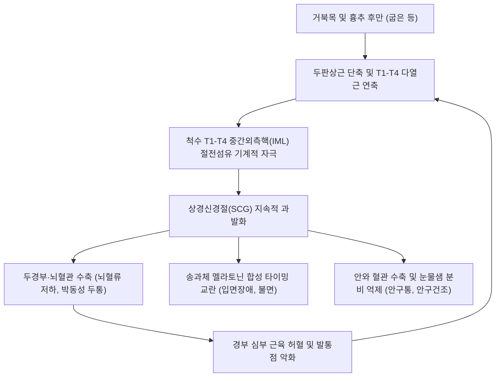

---
aliases:
  - SCG syndrome
  - 상경신경절 증후군
  - Superior cervical ganglion syndrome
  - 두경부 자율신경실조증
  - 경추성 교감신경 항진증
  - Cervical sympathetic hyperactivity
tags:
  - 이론
  - 질환
  - 신경계
  - 자율신경
  - 두경부
  - 수면장애
title: SCG syndrome
date: 2026-09-22
출처: "PMID: 31335051"
---

# 🩺 [[상경신경절 증후군]] (SCG Syndrome / Superior Cervical Ganglion Syndrome, G90.8)

> **핵심 3줄 요약 (Key Summary)**:
> - 📍 병소 부위 & 해부·병태생리: 제2~3 경추(C2-C3) 횡돌기 전방에 위치한 [[상경신경절]](Superior Cervical Ganglion)이 [[두판상근]] 및 상흉추 [[다열근]] 연축으로 만성 과흥분되어 두경부 혈류, 안구, 외분비, 송과체 멜라토닌 분비축을 교란하는 복합 증후군입니다.
> - 🚩 전형적 임상 양상 & 3대 징후: 박동성 [[두통]]과 안구통(눈 충혈/건조), 입면 장애 및 만성 피로(시차증 양상), 목 회전 시 악화되는 자율신경 실조 증상(어지럼증, 심계항진).
> - 🛠️ 핵심 감별 검사 & 한·양방 다각적 치료 전략: C2-C3 전방 SCG 직접 압진 검사 양성, 유양돌기 부착부 및 T1-T4 화타협척혈 약침·전침, 상부 경추 및 상흉추 교정 추나, [[천왕보심단]]·[[시호가용골모려탕]] 투여.
> - ⚠️ 응급 의뢰 레드플래그 & 악화 요인: 동측 안검하수·축동·안면 무한증을 보이는 [[호너 증후군]], 내경동맥 박리, 판코스트 종양 등 파괴성 병변은 즉각 상급 병원 영상 검사 의뢰 필수.

---

## 📌 목차
1. [질환 개요 & 해부학적 병태생리](#1-질환-개요--해부학적-병태생리)
2. [병태생리 메커니즘 & 생체역학적 악순환 네트워크](#2-병태생리-메커니즘--생체역학적-악순환-네트워크)
3. [임상 증상 & 이학적 검사(Physical Exam) 알고리즘](#3-임상-증상--이학적-검사physical-exam-알고리즘)
4. [감별 진단 매트릭스 (Differential Diagnosis)](#4-감별-진단-매트릭스-differential-diagnosis)
5. [한의 통합 치료 프로토콜 (침·약침·추나·한약)](#5-한의-통합-치료-프로토콜-침약침추나한약)
6. [재활 운동 & 생활습관 티칭 가이드](#6-재활-운동--생활습관-티칭-가이드)
7. [💡 사용자 진료실 핵심 필기 & 임상 노하우 (Melt-In 잔여 심화 집약)](#7--사용자-진료실-핵심-필기--임상-노하우-melt-in-잔여-심화-집약)
8. [출처 및 학술 참고 문헌 (References)](#8-출처-및-학술-참고-문헌-references)

---

## 1. 질환 개요 & 해부학적 병태생리

![[Pasted image 20240228174154.png|450]]
> [그림 1: 상경신경절(SCG)의 신경해부학적 기전: T1~T4 척수 측각(IML)에서 기시하여 SCG로 연접 후 뇌혈관, 안구, 비강, 침샘, 송과체로 분지하는 투사 경로]

* **질환 정의**:
  * [[상경신경절]](Superior Cervical Ganglion, SCG) 증후군은 경추 및 상흉추부 근육·관절의 생체역학적 이상으로 인해 경부 교감신경계의 최상위 중추인 SCG가 지속적으로 과흥분(Sympathetic Hyperactivity)되어 두경부 자율신경 실조, 뇌혈류 저하, 수면-각성 주기 교란을 초래하는 증후군입니다.
* **관련 해부학적 구조물**:
  * **골격 및 관절**: C2-C3 경추 횡돌기, 상흉추(T1-T4) 후관절, 제1늑골.
  * **근육 및 근막**: [[두판상근]](Splenius capitis), [[경판상근]](Splenius cervicis), [[두장근]](Longus capitis), [[경장근]](Longus colli), [[흉쇄유돌근]](Sternocleidomastoid), 상흉추 [[다열근]](Multifidus).
  * **신경 및 혈관**: [[상경신경절]], 내경동맥총(Internal carotid plexus), 외경동맥총, 척수 중간외측핵(IML), 총경동맥, 내경동맥.

![[자율신경계_교감신경_주행도해.jpg|400]]
> [그림 2: 척수 중간외측핵(T1-L2)과 척추주위 신경절 연접 및 최상부 상경신경절(SCG)의 두경부 말초 장기 투사 도해]

* **SCG의 주요 지배 장기 및 생리적 표적**:
  1. **안구 및 부속기**: 동공산대근, 뮐러근(안검 거상 보조), 안구 혈관 수축, 눈물샘 분비 억제.
  2. **뇌혈관 및 두개내 맥관**: 내경동맥총을 통해 대뇌 윌리스환(Circle of Willis), 연막동맥, 맥락얼기(Choroid plexus)의 뇌척수액(CSF) 생성 조절.
  3. **두경부 외분비선 및 점막**: 비강 점막 혈관 수축, 악하선·설하선·이하선의 점조한 타액 분비 유도.
  4. **송과체(Pineal Gland) 및 생체리듬**: 멜라토닌(Melatonin)의 일주기 합성 지휘.

---

## 2. 병태생리 메커니즘 & 생체역학적 악순환 네트워크

![[Splenius_capitis_TriggerPoints.jpg|380]]
> [그림 3: 두판상근(Splenius capitis)의 발통점과 경추 후방 긴장, SCG 과흥분성 연관통 발현 도해]

### 1) 두판상근 및 상흉추 다열근 연축의 유발 기전
* **절전섬유 경로 자극**: SCG로 진입하는 모든 교감신경 절전섬유는 척수 T1-T4 분절의 측각(IML)에서 기시합니다. 스마트폰 과사용 및 흉추 후만으로 상흉추 다열근이 단축되면 백색교통지가 압박·자극됩니다.
* **경추 아탈구와 SCG 마찰**: C2-C3 횡돌기 전방에 위치한 SCG는 [[두판상근]] 및 [[두장근]]의 과긴장으로 경추 관절이 변위될 때 직접적인 기계적 마찰과 압박을 받습니다.

### 2) 시교차상핵(SCN) - 송과체 축의 교란
* 정상 수면 리듬: 망막 $\rightarrow$ 시교차상핵(SCN) $\rightarrow$ 척수 T1-T3 IML $\rightarrow$ SCG $\rightarrow$ 송과체 멜라토닌 합성.
* 만성 SCG 과흥분 시 야간 멜라토닌 분비 피크가 소실되어, 중추 생체시계와 말초 장기(간, 장관)의 시계 유전자 간에 내적 탈동기화(Internal desynchrony)가 발생하여 만성 피로와 시차증(Jet lag) 증후군을 유발합니다.

---

## 3. 임상 증상 & 이학적 검사(Physical Exam) 알고리즘

### 1) 계통별 임상 양상

| 조절 계통 | SCG 과흥분 시 주요 임상 증상 | 발병 기전 및 경로 |
| :--- | :--- | :--- |
| **뇌혈류 및 신경계** | 박동성 [[두통]], 머리가 멍한 브레인 포그, 어지럼증 | 두개내 연막동맥 수축에 따른 허혈 및 반동성 혈관 확장 |
| **수면 및 생체리듬** | 입면 장애, 야간 빈번한 각성, 자고 일어나도 개운치 않은 피로 | SCN-SCG-송과체 축 교란에 따른 멜라토닌 합성 결핍 |
| **안구 증상** | 눈 뒤가 빠질 듯한 안구통, 눈부심, 결막 충혈, 안구건조증 | 안와 혈관 수축, 동공산대근 긴장, 눈물샘 분비 억제 |
| **이비인후 증상** | 원인 불명의 이명, 귀먹먹함(이충만감), 비점막 건조 | 내이동맥 혈류 저하 및 접형구개신경절 교감신경 항진 |
| **순환기 및 전신** | 심계항진(가슴 두근거림), 안면 상열감, 수족냉증 | 경부 심장신경 과흥분 및 말초 모세혈관 수축 |

### 2) 필수 이학적 검사법
* **SCG 직접 압진 검사 (SCG Palpation Test)**:
  * 앙와위에서 [[흉쇄유돌근]]을 외측으로 부드럽게 젖히고, 설골 대각 높이(C2-C3 레벨)의 경동맥초 후내측 심부를 압박.
  * 심한 압통과 함께 안구 뒤쪽 뻐근함, 측두부 박동통, 자율신경 반응이 즉각 재현되면 양성.
* **두판상근 및 상흉추 협척 촉진**:
  * 유양돌기 부착부 [[두판상근]] 발통점 및 T1-T4 극돌기 외측 1.5cm [[다열근]] 압통 확인.
* **기립성 활력징후 검사**:
  * 기립 후 수축기 혈압 20mmHg 이상 하강 또는 보상성 빈맥(맥박 30회/분 이상 상승) 확인.

---

## 4. 감별 진단 매트릭스 (Differential Diagnosis)

| 감별 질환 | 병소 및 병태 기전 | 핵심 증상 감별점 | 특이 검사 소견 |
| :--- | :--- | :--- | :--- |
| **[[상경신경절 증후군]]** | SCG 기계적 자극 및 교감신경 과흥분 | 안구통, 박동성 두통, 수면장애, 피로 복합 | C2-C3 SCG 압진 시 증상 유발 |
| **[[호너 증후군]]** | 교감신경로의 마비·파괴 (종양, 박리) | 동측 안검하수, 축동, 안면 무한증 (3대 징후) | 교감신경 마비 징후 양성, 영상 진단 |
| **[[경추성 두통]]** | C1-C3 대후두신경 포착 및 삼차경추복합체 | 후두부에서 정수리로 뻗치는 편측성 방사통 | [[스펄링 검사]] 양성, 후두하근 압통 |
| **[[편두통]]** | 삼차신경혈관 펩타이드(CGRP) 염증 | 오심·구토 동반, 박동성 편측 두통, 전조 증상 | 특정 유발 인자(빛, 소리, 음식) 반응 |

---

## 5. 한의 통합 치료 프로토콜 (침·약침·추나·한약)

### 1) 침구 및 전침 치료
* **SCG 및 경부 투사 혈자리**:
  * 인영(ST9), 천정(LI17): 총경동맥 후방 및 SCG 투사 부위 완자(緩刺).
  * 풍지(GB20), 천주(BL10): [[두판상근]] 및 후두하 신경총 긴장 완화.
  * 궐음수(BL14), 심수(BL15), T1-T4 화타협척혈: 교감신경 절전섬유 기시부 이완.
* **자율신경 안정 혈자리**: 백회(GV20), 신문(HT7), 내관(PC6), 태충(LR3), 삼음교(SP6).
* **전침 자극**: 풍지-상흉추 협척혈에 1~2Hz 저주파 통전으로 중추성 부교감신경 활성 유도.

### 2) 약침 치료
* **시술 부위**:
  * C2-C3 레벨 [[두장근]] 표면 SCG 인접부.
  * 유양돌기 하방 [[두판상근]] 건골부착부.
* **추천 제제**:
  * **황련해독탕 약침**: 교감신경 항진, 안구 충혈, 상열형 급성기.
  * **신바로약침 / 중성어혈약침**: 경추 후관절낭 및 근막 유착 소염.
  * **자하거 약침**: 만성 피로, 자율신경실조 허증 불면.

### 3) 추나 요법
* **상부 경추(C1-C3) 앙와위 가동술**: 후관절 변위 교정 및 경추 전방 연부조직 신장.
* **상흉추(T1-T4) 신전 교정술**: 흉추 후만 및 늑골 관절 가동술로 척수 IML 분절 압박 해소.

### 4) 한약 치료
* [[천왕보심단]](天王補心丹): 심신불교(心腎不交)형 교감신경 과항진, 불면, 불안, 심계항진.
* [[시호가용골모려탕]](柴胡加龍骨牡蠣湯): 중추신경계 과흥분, 안구통, 두통을 동반한 자율신경실조증.
* [[귀비탕]](歸脾湯): 생체시계 교란으로 인한 만성 피로 및 기혈양허형 수면장애.
* [[소풍활혈탕]](疎風活血湯): 경추부 심부 근막의 만성 어혈성 유착 해소.

### 5) 양방 치료 협진 참고
* 초음파 유도하 상경신경절 차단술(SCGB) 또는 성상신경절 차단술(SGB).
* 약물 요법: 베타차단제(프로프라놀롤: 빈맥 및 교감 흥분 완화), 멜라토닌 수용체 작용제, 가바펜티노이드.

---

## 6. 재활 운동 & 생활습관 티칭 가이드

* **두판상근 및 흉쇄유돌근 스트레칭**:
  * 턱을 가볍게 당긴 상태(Chin-tuck)에서 고개를 반대측 45도 회전 후 굴곡하여 후경부 근막을 20초간 부드럽게 신장.
* **상흉추 신전 운동 및 흉곽 가동성 증진**:
  * 폼롤러를 날개뼈 아래(T4-T6)에 대고 양손으로 머리를 받친 채 흉추 신전 운동 15회 반복.
* **복식호흡 및 부교감신경 활성화**:
  * 4초 들숨, 7초 멈춤, 8초 날숨의 4-7-8 호흡법으로 흉강 내압을 낮추고 횡격막 호흡 유도.
* **생체시계 리셋 생활습관**:
  * **아침 기상 직후 10분 햇볕 쬐기**: 망막-SCN 경로를 통해 야간 멜라토닌 합성 타이밍 정상화.
  * **취침 전 2시간 블루라이트 차단**: 야간 스마트폰 불빛은 SCN을 자극하여 SCG의 멜라토닌 분비를 즉시 억제하므로 엄격히 차단.

---

## 7. 💡 사용자 진료실 핵심 필기 & 임상 노하우 (Melt-In 잔여 심화 집약)

### 1) 진료실 핵심 임상 팁: "두통, 불면, 눈 충혈, 만성 피로의 4종 세트"
* 외래에서 "뒷목이 뻐근하면서 머리가 쿵쾅거리고, 눈이 빠질 듯 아프며, 잠을 전혀 못 자고 낮에는 시차 적응이 안 된 것처럼 녹초가 돼요"라고 호소하는 환자는 전형적인 **상경신경절(SCG) 증후군**입니다.
* 두통약, 수면제, 인공눈물로 호전되지 않던 환자도 **경추 전방 C2-C3 높이(인영혈 외측 깊은 곳)를 손가락으로 가볍게 압진**하면 전기가 오르듯 비명을 지릅니다.
* SCG 압통점과 후방의 [[두판상근]] 정착부를 약침으로 2~3회만 치료해도 "머리에 낀 안개가 걷히고 눈이 맑아지며 수년 만에 깊은 잠을 잤다"는 극적인 호전을 보입니다.

### 2) 흉추 T1-T4를 교정하지 않으면 SCG는 반드시 재발한다
* 목 앞쪽의 SCG만 치료해서는 재발을 막을 수 없습니다.
* 교감신경 절전섬유가 기시하는 **상흉추 T1-T4의 굽은 등(흉추 후만)과 얕은 흉식호흡을 반드시 교정**해야 합니다.
* 흉추 신전 추나와 함께 늑간근 이완, 복식호흡을 티칭하여 흉강 내압을 낮추어야 교감신경 절전섬유의 이상 발화가 원천 차단됩니다.

---

## 8. 출처 및 학술 참고 문헌 (References)

1. Waxenbaum, J. A., Reddy, V., & Bordoni, B. (2023). Anatomy, Head and Neck: Superior Cervical Ganglia. *StatPearls Publishing*. [PMID: 31335051](https://pubmed.ncbi.nlm.nih.gov/31335051/)
   - `[연구 요약]` 상경신경절(SCG)의 상세 신경해부학적 주행, 안면·뇌혈관·송과체 투사 경로 및 임상적 의의를 종합 정리한 표준 해부 지침.
2. Hamner, J. W., & Tan, C. O. (2014). Autonomic nervous system control of the cerebral circulation. *Clin Auton Res*, 24(1), 37-43. [PMID: 24095126](https://pubmed.ncbi.nlm.nih.gov/24095126/)
   - `[연구 요약]` 경부 교감신경절(SCG)이 뇌순환 및 대뇌 자동조절능에 미치는 영향을 고찰하고, 교감신경 과흥분이 뇌혈류 장애 및 편두통성 혈관 반응에 미치는 핵심 메커니즘을 규명함.
3. Perreau-Lenz, S., Kalsbeek, A., Garidou, M. L., Wortel, J., van der Vliet, J., van Heijningen, C., Simonneaux, V., Pévet, P., & Buijs, R. M. (2003). Suprachiasmatic control of melatonin synthesis in rats: inhibitory and stimulatory mechanisms. *Eur J Neurosci*, 17(2), 221-228. [PMID: 12542658](https://pubmed.ncbi.nlm.nih.gov/12542658/)
   - `[연구 요약]` 시각교차위핵(SCN)에서 상경신경절(SCG)을 거쳐 송과체 멜라토닌 합성에 이르는 다신경절 신경전달 경로를 명확히 입증하고, 교감신경 자극 부조화가 생체리듬 장애를 유발함을 증명함.
