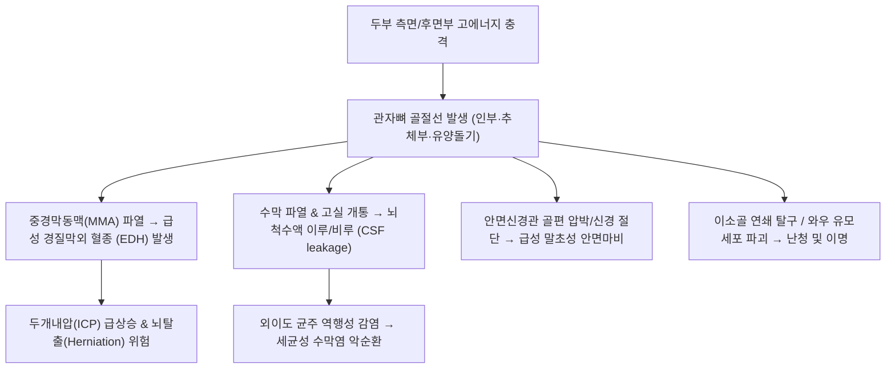

# 🩺 [[관자뼈 골절]] (Temporal Bone Fracture / 측두골 골절, KCD S02.1)

> **핵심 3줄 요약 (Key Summary)**:
> - 📍 **병소 부위 & 해부·병태생리**: 두개저 외측을 이루며 청각·평형기관([[와우]], [[반고리관]])과 제7([[안면신경]]), 제8([[전정와우신경]]) 뇌신경, [[중경막동맥]], 내경동맥을 감싸는 관자뼈(측두골 — 인부·추체부·유양돌기부)의 고에너지 외상성 골절.
> - 🚩 **전형적 임상 양상**: 골절선 방향에 따른 3대 징후 — 외이도 출혈(이출혈), 고막 파열 및 혈고실(Hemotympanum), 뇌척수액 이루(CSF otorrhea), 유양돌기 부위 피하 반상출혈([[배틀 징후]]), 말초성 안면신경 마비, 전도성/감각신경성 난청 및 어지럼증(현훈).
> - 🛠️ **핵심 검사 & 치료 전략**: 측두골 고해상도 CT(HRCT, 기포 징후 및 액체면 확인), 안면신경 근전도(ENoG); 급성기 침상 안정(상체 30도 거상, 수막염 예방), 신경외과·이비인후과 협진(안면신경 감압술, 경질막 봉합술); 회복기 안면마비·이명·현훈 침구(예풍·하관·청궁) 및 건비영신·활혈거어 한약([[당귀수산]], [[견정산]]).
> - ⚠️ **응급 의뢰 레드플래그**: 관자뼈 인부 골절에 의한 [[중경막동맥]](MMA) 파열 → 급성 **경질막외 혈종(EDH, 의식 명료기 후 급격한 혼수)**, 지속적 뇌척수액 누출로 인한 세균성 수막염, 즉각적인 완전 안면마비 발생 시 즉시 권역응급의료센터 신경외과 긴급 전원.

---

## 📌 목차
1. [질환 개요 & 해부학적 병태생리 (Disease Overview & Anatomy)](#1-질환-개요--해부학적-병태생리-disease-overview--anatomy)
2. [병태생리 메커니즘 & 임상적 악순환 (Pathophysiology & Vicious Cycle)](#2-병태생리-메커니즘--임상적-악순환-pathophysiology--vicious-cycle)
3. [임상 증상 & 이학적 검사 (Clinical Presentation & Physical Exam)](#3-임상-증상--이학적-검사-clinical-presentation--physical-exam)
4. [감별 진단 매트릭스 (Differential Diagnosis Matrix)](#4-감별-진단-매트릭스-differential-diagnosis-matrix)
5. [한의 통합 치료 프로토콜 (KMD Integrated Protocol)](#5-한의-통합-치료-프로토콜-kmd-integrated-protocol)
6. [양방 치료 & 병용·의뢰 기준 (Conventional Treatment & Referral)](#6-양방-치료--병용의뢰-기준-conventional-treatment--referral)
7. [단계별 재활 & 자가 운동 티칭 (Rehabilitation & Self-Care)](#7-단계별-재활--자가-운동-티칭-rehabilitation--self-care)
8. [💡 진료실 핵심 필기 & 임상 노하우](#8--진료실-핵심-필기--임상-노하우)
9. [출처 및 학술 참고 문헌 (References)](#9-출처-및-학술-참고-문헌-references)

---

## 1. 질환 개요 & 해부학적 병태생리 (Disease Overview & Anatomy)

![[측두근-1753861075465.png|450]]
> [그림 1: ① 병태생리·해부 — 측두골 인부, 추체부, 유양돌기 부위와 측두와 해부학적 구조 — Wikipedia(PD)]

* **질환 정의 및 개요**:
  * [[관자뼈 골절]](Temporal Bone Fracture, 側頭骨骨折)은 교통사고, 추락, 폭행 등 두부에 가해진 강력한 둔상으로 인해 측두골(Temporal bone)에 발생하는 복합 골절입니다.
  * 측두골은 인부(Squamous), 추체부(Petrous), 고실부(Tympanic), 유양돌기부(Mastoid)의 4개 구역으로 이루어져 있으며, 인체에서 가장 단단한 골질인 추체골 내부에 청각과 평형을 담당하는 내이(와우·반고리관)와 제7 뇌신경인 [[안면신경]](Facial nerve)이 주행하는 안면신경관(Fallopian canal)을 포함하고 있어 손상 시 복합 신경·이과 증상이 초래됩니다(Ohira et al., 2026).
* **고전적 분류 체계 (추체골 장축 기준)**:
  * **종골절 (Longitudinal Fracture, 70~80%)**:
    * 측두부나 두정부에 측면 충격이 가해질 때 발생하며, 골절선이 추체골 장축과 평행하게 주행합니다.
    * 외이도 후상벽, 고막 파열, 이소골 탈구(전도성 난청), 이출혈이 흔하며, 안면신경 마비 빈도는 약 20%로 상대적으로 낮고 불완전 마비가 많습니다.
  * **횡골절 (Transverse Fracture, 10~20%)**:
    * 후두부나 전두부에 전후방 충격이 가해질 때 발생하며, 골절선이 추체골 장축과 직각으로 내이낭(Otic capsule)을 관통합니다.
    * 고막은 온전한 채 혈고실(Hemotympanum)이 관찰되며, 와우·전정 파괴로 영구적 감각신경성 난청과 심한 현훈이 발생하고, 안면신경 마비 빈도가 50% 이상으로 높고 즉각적 완전 마비가 다발합니다.
  * **현대적 분류 (내이낭 침범 유무 기준, Otic Capsule Sparing vs Violating)**:
    * 현재 임상에서는 예후 예측도가 더 높은 내이낭 보존(OCS) 및 내이낭 침범(OCV) 분류가 표준으로 사용됩니다.

---

## 2. 병태생리 메커니즘 & 임상적 악순환 (Pathophysiology & Vicious Cycle)

![[안면신경_주행_연접_해부도.png|450]]
> [그림 2: ② 관련 해부 구조물 — 관자뼈 추체부 내부 내이도(IAC)와 안면신경관(Fallopian canal) 및 와우·전정기관 주행 해부도 — Wikipedia(PD)]

![[안면신경_경유돌공_이하선_표정근분지_해부도_Gray.png|450]]
> [그림 3: ② 안면신경 분지 해부도 — 측두골 경유돌공(Stylomastoid foramen)을 빠져나와 안면표정근으로 분지하는 안면신경 주행 — Gray's Anatomy(PD)]

### 1) 혈관 및 경질막 손상 기전
* 관자뼈 인부의 내면에는 [[중경막동맥]](Middle meningeal artery)이 주행하는 동맥구가 위치합니다. 인부 선상 골절 시 이 동맥이 파열되면서 두개골 내판과 경질막 사이에 혈종이 급격히 고이는 **경질막외 혈종(Epidural Hematoma, EDH)**이 발생하며, 이는 몇 시간 내에 뇌간을 압박하는 치명적 뇌탈출을 유발할 수 있습니다.

### 2) 뇌척수액 누출과 중추신경계 감염
* 추체골 골절이 경질막과 고막 또는 이관(Eustachian tube)을 동시에 파열시키면 뇌척수액이 외이도를 통해 흘러나오는 **뇌척수액 이루(CSF otorrhea)**나 이관을 거쳐 비강으로 넘어오는 **뇌척수액 비루(CSF rhinorrhea)**가 초래됩니다. 이는 외부 세균이 지주막하강으로 직접 침투하는 경로가 되어 치명적인 세균성 수막염(Meningitis)을 유발합니다(Azrak et al., 2026).

---

## 3. 임상 증상 & 이학적 검사 (Clinical Presentation & Physical Exam)

![[안면신경마비_벨마비_환자_안면비대칭_임상소견.jpg|420]]
> [그림 4: ③ 임상 증상 — 관자뼈 횡골절 시 안면신경 손상으로 초래되는 말초성 안면마비(이마 주름 소실, Bell 현상) 임상 소견 — 자가보관자료]

![[뇌졸중_뇌경색_중대뇌동맥_고음영혈전_저음영경색_뇌CT.jpg|420]]
> [그림 5: ③ 영상의학적 진단 — 두부 외상 후 측두골 추체부 골절선 및 경질막외 혈종(EDH)을 평가하기 위한 뇌 CT 스캔 — 자가보관영상]

### 1) 주요 임상 증상
* **이출혈 및 혈고실**: 외이도로 피가 흘러나오거나, 이경 검사상 고막 뒤에 검붉은 혈액이 차 있는 혈고실 소견.
* **배틀 징후 ([[배틀 징후]])**: 귀 뒤쪽 유양돌기 부위 피부에 외상 후 1~3일 뒤 나타나는 특징적인 피하 멍(Ecchymosis). 두개저 골절의 강력한 지표.
* **청력 장애 및 이명**: 이소골 탈구(추골·침골·등골 분리)에 의한 전도성 난청, 또는 와우 손상에 의한 영구적 감각신경성 난청(Fasanella et al., 2026).
* **말초성 안면신경 마비**: 환측 이마 주름 잡기 불능, 눈 감기 불능(토안), 입꼬리 처짐 및 구개열 비대칭.
* **어지럼증 (현훈, Vertigo)**: 전정기관 손상으로 인한 자발 안진(Spontaneous nystagmus) 및 극심한 회전성 어지럼, 구토.

### 2) 이학적 검사 알고리즘
* **뇌척수액 누출 검사 (Halo Test / Ring Sign)**:
  * 귀나 코에서 나오는 분비물을 거즈에 떨어뜨렸을 때, 중심부의 붉은 혈액 주위로 맑은 체액이 둥근 달무리(Halo) 모양으로 퍼져나가면 CSF 누출 양성.
  * 확실한 감별을 위해 분비물 내 Beta-2 transferrin 검사 시행.
* **안면신경 기능 평가 (House-Brackmann Grade)**:
  * Grade I(정상)부터 Grade VI(완전 마비)까지 운동 기능 정량 평가.
* **음차 검사 (Weber & Rinne Test)**:
  * 512Hz 음차를 이용해 전도성 난청(골도>기도, 병변측 편위)과 감각신경성 난청(기도>골도, 건측 편위) 감별.

---

## 4. 감별 진단 매트릭스 (Differential Diagnosis Matrix)

| 감별 질환 | 손상 기전 및 호발 부위 | 주요 임상 소견 | 진단 및 감별 핵심 |
| :--- | :--- | :--- | :--- |
| **[[관자뼈 골절]]** | 두부 측면/후면부 고에너지 충격 | 이출혈, 혈고실, Battle 징후, 안면마비, 청력 상실 | 측두골 고해상도 CT(HRCT), 이경 검사 |
| **단순 외이도 열상 / 고막 천공** | 면봉, 이물 등 국소적 직접 손상 | 경미한 이출혈, 국소 통증, 골절선 없음 | 측두골 CT 정상, 신경학적 결손 없음 |
| **특발성 안면신경마비 ([[벨마비]])** | 바이러스 재활성화 (외상력 없음) | 편측 말초성 안면마비 단독 | 외상력 없음, 고막 정상, CT 정상 |
| **전두골/사골 골절 (전두개저)** | 안면 중심부 타박 | 라쿤 눈(Raccoon eyes), 후각 상실, 비루 | 사골동 침범, 후신경 손상 |
| **양성 돌발성 두위현훈 ([[BPPV]])** | 이석 탈락 (외상 후 발생 가능) | 특정 두위 변환 시 수초간의 회전성 현훈 | 이경 정상, 난청 및 안면마비 없음, 딕스-홀파이크 양성 |

---

## 5. 한의 통합 치료 프로토콜 (KMD Integrated Protocol)

![[안면신경마비_침구치료_경혈자침_임상사진.jpg|420]]
> [그림 6: ⑤ 한의 침구 치료 — 측두골 골절 후유증인 안면신경 마비 및 이명·난청 회복을 위한 이주 주변 예풍·하관 및 안면부 전침 시술 실사 — 자가보관자료]

* **⚠️ 급성기 원칙: 신경외과적 안정화 우선**:
  * 급성 골절기에는 두개내 출혈 및 뇌척수액 누출에 대한 신경외과 치료가 완료되어야 합니다. 한의 치료는 **두개내압 안정 및 감염 위험 소실 후의 후유증기(안면마비, 이명, 난청, 현훈, 두통)**에 집중 적용합니다.
* **침구 치료 (Acupuncture)**:
  * **안면신경 마비 후유증**: [[예풍]](TE17 — 경유돌공 부위), [[하관]](ST7), [[협거]](ST6), [[지창]](ST4), [[양백]](GB14), [[찬죽]](BL2).
  * **청각·전정 후유증**: [[청궁]](SI19), [[이문]](TE21), [[청회]](GB2), [[풍지]](GB20).
  * **시술 방법**: 예풍혈에 0.25×30mm 호침으로 유양돌기 앞쪽을 향해 15~20mm 직자하여 안면신경 줄기 주변 혈류를 개선하고, 마비된 표정근 부위에 2Hz 저주파 전침을 통전합니다.
* **약침 치료 (Pharmacopuncture)**:
  * 신경 재생 및 만성 염증 잔여물 흡수를 위해 신바로약침 또는 자하거(태반) 약침(0.5~1.0cc)을 예풍, 하관, 완골(GB12) 부위에 주입합니다.
* **한약 치료 (Herbal Medicine)**:
  * **외상 후 어혈(瘀血) 및 두통**: [[당귀수산]](當歸鬚散), [[통규활혈탕]](通竅活血湯).
  * **안면마비 회복 촉진**: [[견정산]](牽正散) 합 [[이기거풍산]](理氣祛風散).
  * **기혈양허 및 만성 현훈·이명**: [[자음건비탕]](滋陰健脾湯), [[보중익기탕]] 가감.

---

## 6. 양방 치료 & 병용·의뢰 기준 (Conventional Treatment & Referral)

* **보존적 급성기 치료 (Conservative Management)**:
  * 침상 안정(Bed rest) 및 상체 30도 거상(두개내압 강하 및 CSF 누출 감소).
  * 코 풀기, 기침, 변비 시 과도한 힘주기 금지(기뇌증 및 뇌척수액 역류 방지).
  * 외이도 패킹이나 세척은 감염 위험으로 엄격히 금지.
* **약물 치료**:
  * 급성 안면신경 마비 발생 시 고용량 스테로이드(Prednisolone 1mg/kg 10~14일 테이퍼링).
  * 세균성 수막염 의심 시 혈액-뇌 장벽(BBB)을 통과하는 3세대 세팔로스포린계 항생제 정맥 투여.
* **수술적 적응증 (Surgical Indication)**:
  * **안면신경 감압술/문합술**: 신경근전도(ENoG)상 90% 이상의 변성이 6일 이내 급격히 진행된 즉각적 완전 안면마비.
  * **뇌척수액 누출 수술**: 7~10일 이상의 보존적 치료에도 지속되는 CSF 이루(경질막 재건술).
  * **경질막외 혈종(EDH) 개두술**: 혈종 두께 > 15mm 또는 정중선 변위(Midline shift) > 5mm 시 응급 혈종제거술.

---

## 7. 단계별 재활 & 자가 운동 티칭 (Rehabilitation & Self-Care)

* **1단계: 안면근 보호 및 각막 보호 (급성기 1~2주)**:
  * 토안(눈이 감기지 않음)으로 인한 노출성 각막염을 막기 위해 인공눈물 수시 점안 및 수면 시 안대/안연고 테이핑 필수.
* **2단계: 안면근 능동 수축 재활 (3~6주)**:
  * 거울을 보며 이마 찌푸리기, 눈 꽉 감기, 휘파람 불기, '아-에-이-오-우' 발음 훈련을 1일 3회 10분간 시행(비정상적 연합운동 방지를 위해 과도한 힘주기는 제한).
* **3단계: 전정 재활 운동 (Vestibular Rehabilitation)**:
  * 잔여 현훈 환자를 위한 브란트-다로프(Brandt-Daroff) 운동 및 시선 고정 두부 회전 훈련.

---

## 8. 💡 진료실 핵심 필기 & 임상 노하우

* **'귀에서 피가 난다'는 환자는 절대로 외이도를 후비거나 솜으로 틀어막지 말라**:
  * 두부 타박 후 귀에서 피나 맑은 물이 흘러나올 때 솜을 깊게 틀어막으면 외이도의 상재균이 부러진 뼈틈을 통해 뇌 속으로 밀려 들어가 치명적인 **세균성 뇌수막염**을 일으킵니다. 멸균 거즈를 귓바퀴 바깥에 가볍게 대기만 하고 즉시 응급실로 보내야 합니다.
* **지연성 안면마비와 즉각성 안면마비의 판이한 예후**:
  * 다친 직후부터 얼굴이 완전히 마비된 경우(Immediate onset)는 뼈 조각에 신경이 잘렸거나(Transection) 심하게 짓눌린 것이므로 응급 수술이 필요합니다. 반면 다치고 2~3일 뒤부터 서서히 마비가 온 경우(Delayed onset)는 신경 부종이나 혈종 압박이 원인이므로 스테로이드와 한방 침구 치료로 90% 이상 완전 회복됩니다.

---

## 9. 출처 및 학술 참고 문헌 (References)

1. **Azrak O, et al. (2026)**. Predictive Value of Air Bubble and Meniscus Signs on Routine Trauma Head CT for Nondisplaced Temporal Bone Fractures. *AJNR Am J Neuroradiol*, 47(5), 680-686. [PMID 42209150](https://pubmed.ncbi.nlm.nih.gov/42209150/)

   - [연구 요약]: 두부 외상 루틴 CT에서 유양돌기 및 중이강 내 미세 기포 징후와 액체면을 통해 비변위 관자뼈 미세 골절을 조기 선별하는 진단적 유효성 입증.
2. **Ohira S, et al. (2026)**. Biomechanical Elucidation of Temporal Bone Fracture Mechanisms Using Finite Element Analysis: Identification of Stress-Concentration Sites and Crack Propagation Simulation Under Static Loading. *Otol Neurotol*, 47(8), 920-928. [PMID 42383427](https://pubmed.ncbi.nlm.nih.gov/42383427/)

   - [연구 요약]: 유한요소해석 모델을 통해 측두골 충격 방향에 따른 응력 집중 부위 및 추체골 골절선의 생체역학적 전파 경로 시뮬레이션 규명.
3. **Fasanella D, et al. (2026)**. Revision Cochlear Implantation via Middle Turn Insertion in Post-Traumatic Basal Turn Ossification : Revision cochlear implantation. *Eur Arch Otorhinolaryngol*, 283(9), 3511-3518. [PMID 42671594](https://pubmed.ncbi.nlm.nih.gov/42671594/)

   - [연구 요약]: 관자뼈 외상성 골절 후 내이 기저회전 골화증으로 인한 불응성 감각신경성 난청 환자에서 중간회전 인공와우 삽입 재수술 임상 결과 고찰.

---

## 관련 노트
- [[두개골 골절]]
- [[안면신경]]
- [[안면마비]]
- [[배틀 징후]]
- [[예풍]]
- [[당귀수산]]
