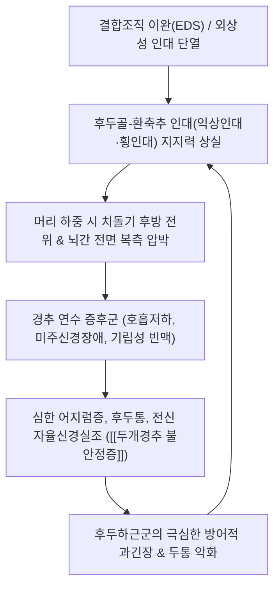

# 🩺 [[두개경추 불안정증]] (Craniocervical Instability / 頭蓋頸椎不安定症, M53.21 / ICD-10)

> 📐 **이 템플릿은 근골격계·신경·통증 계열 질환 전용입니다.**

> 🖼️ **이미지 규격(정본)**: 질환 노트 7장 (①손상 기전 도해 ②해부 도해 환축추인대 ③해부 도해 후두하근 ④이학적 검사 레르미트 실사 ⑤한의 술기 경추추나 ⑥초음파 유도 시술 ⑦재활 운동).

> **핵심 3줄 요약 (Key Summary)**:
> - 📍 병소 부위 & 해부·병태생리: 후두골-환추(C0-C1) 및 환축추(C1-C2) 복합체, 대후두공(Foramen magnum) 주변 인대(익상인대, 덮개막, 환추횡인대) 결손으로 뇌간(Medulla oblongata) 및 상위 척수, 추골동맥이 만성적·동적으로 압박되는 질환.
> - 🚩 전형적 임상 양상 & 3대 징후: 머리가 목 위에 불안정하게 얹혀 있는 느낌(Bobble-head sensation), 누워 있을 때만 호전되고 기립 시 악화되는 중증 후두통 및 현훈, 자율신경계 이상(POTS 유사 빈맥, 기립성 어지럼).
> - 🛠️ 핵심 감별 검사 & 한·양방 다각적 치료 전략: 직립 굴곡-신전 동적 MRI(Upright dynamic MRI - CXA, BPI 계측), 샤프-퍼서 검사, [[후두하근군]] 이완 및 등척성 경추 심부 안정화, 고도 불안정증 시 후두-경추 유합술 의뢰.
> - ⚠️ 응급 의뢰 레드플래그 & 악화 요인: 연수 척수 압박 증후군(호흡 부전, 연하 곤란, 사지 마비, 반사항진), 엘러스-단로스 증후군(EDS) 및 류마티스 환자. **급격한 경추 스러스트(HVLA 회전/신전 수기)는 연수 손상을 유발하므로 절대 엄금**.

---

## 📌 목차
1. [질환 개요 & 해부학적 병태생리](#1-질환-개요--해부학적-병태생리)
2. [병태생리 메커니즘 & 생체역학적 악순환 네트워크](#2-병태생리-메커니즘--생체역학적-악순환-네트워크)
3. [임상 증상 & 이학적 검사(Physical Exam) 알고리즘](#3-임상-증상--이학적-검사physical-exam-알고리즘)
4. [감별 진단 매트릭스 (Differential Diagnosis)](#4-감별-진단-매트릭스-differential-diagnosis)
5. [한의 통합 치료 프로토콜 (침·약침·추나·한약)](#5-한의-통합-치료-프로토콜-침약침추나한약)
6. [양방 치료 & 병용·의뢰 기준 (Conventional Treatment & Referral)](#6-양방-치료--병용의뢰-기준-conventional-treatment--referral)
7. [재활 운동 & 생활습관 티칭 가이드](#7-재활-운동--생활습관-티칭-가이드)
8. [💡 사용자 진료실 핵심 필기 & 임상 노하우 (Melt-In 잔여 심화 집약)](#8--사용자-진료실-핵심-필기--임상-노하우-melt-in-잔여-심화-집약)
9. [출처 및 학술 참고 문헌 (References)](#9-출처-및-학술-참고-문헌-references)

---

## 1. 질환 개요 & 해부학적 병태생리

![[편타손상_경추_과신전_과굴곡_기전도해.png|450]]
> [그림 1: ① 손상 기전 및 환부 도해 — 두경부 외상 시 발생하는 과신전-과굴곡 외력과 두개경추 이행부 인대 파열 기전 — Simbio Vault Archive]

![[경추불안정증_02_해부도해_환축추인대구조_Gray307.png|450]]
> [그림 2: ② 관련 해부학적 구조물 — 두개경추 이행부의 주요 수동 안정화 구조(환추횡인대, 익상인대, 덮개막) 해부 도해 — Gray's Anatomy Fig 307 (Public Domain)]

* **질환 정의 및 병태 개요**:
  * **[[두개경추 불안정증]]**(Craniocervical Instability, CCI)은 두개골 기저부(후두골)와 상위 경추(C1, C2) 사이의 인대 복합체가 이완되거나 파열되어, 머리의 하중과 움직임에 따라 척추골이 비정상적으로 미끄러지며 뇌간, 척수, 추골동맥, 미주신경 등 주요 신경혈관 구조물을 동적으로 압박하는 심각한 병리적 상태입니다(Henderson FC Sr, et al. 2024).
  * 과거에는 교통사고나 고에너지 외상성 골절 후에만 드물게 발생하는 것으로 여겨졌으나, 최근에는 과가동성 결합조직 질환([[엘러스-단로스 증후군]], EDS), 류마티스 관절염, 만성 편타손상 증후군 환자군에서 중요한 원인 질환으로 규명되고 있습니다.
* **관련 해부학적 구조물**:
  * **골성 구조**: 후두골 기저부(Clivus, Basion), 제1경추(Atlas), 제2경추(Axis)의 치돌기(Dens).
  * **인대 결합부**: 치돌기를 후두골에 묶어주는 **익상인대(Alar ligaments)**, 치돌기를 전방으로 고정하는 **환추횡인대(Transverse ligament)**, 후종인대의 연장선인 **덮개막(Membrana tectoria)**.
  * **임계 신경혈관 구역**: 대후두공을 통과하는 연수(Medulla), 하위 뇌신경(CN IX, X, XI, XII), 상부 경수, 횡돌기공을 관류하는 [[추골동맥]].

---

## 2. 병태생리 메커니즘 & 생체역학적 악순환 네트워크

![[후두하근-20240914193517231.png|450]]
> [그림 3: ③ 관련 해부학적 구조물 — 후두골 하단과 상위 경추를 연결하는 후두하근군 및 신경혈관 주행 해부 — Simbio Vault Archive]

### 1) 복측 뇌간 압박 (Ventral Brainstem Compression) 기전
* 정상적인 경추 전만이 무너지거나 기립 시 머리의 무게가 가해지면, 이완된 C0-C1-C2 복합체가 앞으로 꺾이면서(Kyphotic angulation) 치돌기가 대후두공 내부의 연수복측을 직접 누르게 됩니다.
* 이로 인해 발생하는 증상 복합체를 **경추 연수 증후군(Cervical Medullary Syndrome)**이라 부르며, 뇌간 망상체와 심혈관 조절 중추가 자극되어 맥박 변동, 혈압 저하, 수면 무호흡, 극심한 만성 피로가 유발됩니다(Henderson FC Sr, et al. 2019).

### 2) 방사선학적 생체역학 지표
* **BPI (Basion-Posterior Axial Line Distance)**: 바시온(Basion)과 C2 후방 피질선 사이의 수직 거리로, 9mm를 초과하면 전방 불안정성을 의미합니다.
* **CXA (Clivo-Axial Angle)**: 클리부스(Clivus) 선과 C2 추체 후방선이 이루는 각도로, 굴곡 시 **135도 미만**으로 꺾이면 뇌간 변형 및 압박이 발생합니다.

---

## 3. 임상 증상 & 이학적 검사(Physical Exam) 알고리즘

### 1) 전형적 주소증 및 신경학적 증상
* **두부 불안정감 (Bobble-Head Sensation)**:
  * 머리가 볼링공처럼 무겁게 느껴져 목 위에 가만히 얹혀 있지 못하고 흔들리는 느낌을 받으며, 목을 지탱하기 위해 항상 손으로 턱을 받칩니다.
* **두통 및 현훈**:
  * 후두골 기저부에서 시작하여 정수리와 안구 뒤쪽으로 뻗치는 격렬한 두통, 기립 시 심해지고 누우면 수 분 내로 급격히 가라앉는 체위성 양상을 띱니다.
* **뇌신경 및 척수 압박 증상**:
  * 사래 걸림(연하 곤란), 쉰 목소리, 이명, 시야 흐림, 손발의 찌릿한 전격통, 젓가락질 둔화.

### 2) 필수 이학적 검사법 (Physical Examination)

![[레르미트징후_1단계_좌위_경추중립_실사.png|420]]
> [그림 4: ④ 이학적 검사 시연 — 경추 중립 및 굴곡 시 척수 압박 전격통을 유발하는 레르미트 검사(Lhermitte's sign) 실사 — Simbio Vault Archive]

* **샤프-퍼서 검사 (Sharp-Purser Test)**:
  * 머리를 약간 숙인 상태에서 C2 극돌기를 후방에서 고정하고 이마를 뒤로 밀어 정복될 때 "덜컹" 소리와 함께 신경 증상이 호전되는지 확인합니다.
* **익상인대 스트레스 검사 (Alar Ligament Test)**:
  * C2 극돌기를 잡고 머리를 5도 측굴했을 때 반대편 극돌기의 즉각적인 회전 움직임이 느껴지지 않으면 인대 단열을 의심합니다.
* **상위 운동신경원 징후 (Upper Motor Neuron Signs)**:
  * 호프만 반사(Hoffmann), 바빈스키(Babinski), 족간대(Clonus) 양성 반응 확인.

---

## 4. 감별 진단 매트릭스 (Differential Diagnosis)

| 감별 질환 | 호발 병소 및 기전 | 주소증 차이점 | 특이적 영상 및 검사 소견 |
| :--- | :--- | :--- | :--- |
| **[[두개경추 불안정증]] (본 질환)** | C0-C2 인대 결손, 대후두공 뇌간 압박 | 기립 시 악화-와위 시 호전, 머리 흔들림 | 동적 MRI상 CXA < 135°, BPI > 9mm, 샤프-퍼서 양성 |
| **[[경추 불안정증]]** | C1-C7 척추 분절의 전위 및 과가동성 | 목 통증 위주, 국소 분절 걸림(Catch) | ADI > 3mm, 분절간 3mm 이상 전위 |
| **[[키아리 기형]] (Chiari Malformation)** | 소뇌 편도의 대후두공 하방 탈출 | 기침·발살바 시 터질 듯한 후두통 | 뇌 MRI상 소뇌 편도 5mm 이상 탈출 |
| **기립성 빈맥 증후군 (POTS)** | 자율신경계 혈관 수축 부전 | 기립 시 30회 이상 맥박 폭증, 실신 | 틸트 테이블 검사 양성, 경추 구조 정상 |
| **경추 척수증 (Myelopathy)** | 하위 경추 척추관 협착, 척수 연화 | 손의 부자연스러움, 계단 보행 곤란 | 경수 MRI상 고신호 강도 병변 |

---

## 5. 한의 통합 치료 프로토콜 (침·약침·추나·한약)

![[경추 추나-20240920065624673.png|400]]
> [그림 5: ⑤ 한의 술기 실사 — 상경추 과가동성을 제어하고 흉경추 이행부 정렬을 바로잡는 비침습적 경추 추나 수기 실사 — Simbio Vault Archive]

![[PNP_Fig_Occipital_Injection.png|400]]
> [그림 6: ⑥ 초음파 유도 시술 실사 — 후두하 인대 및 대후두신경 주변 초음파 유도 정밀 약침 주입 도해 — Simbio Vault Archive]

* **침구 치료 (Acupuncture)**:
  * ⚠️ **심부 직자 금기**: 후두하 부위의 깊은 직자는 뇌간과 추골동맥 손상 위험이 극도로 높으므로, 풍지·천주혈 자침 시 15mm 이내 사자(외측 방향)를 엄수합니다.
  * **원위부 경혈 취혈**: [[후계]](SI3), [[신맥]](BL62), [[풍식]](GB31)을 배합하여 경추 척추 기둥의 독맥 기운을 통하게 하고 승모근 방어성 긴장을 완화합니다.
* **약침 치료 (Pharmacopuncture)**:
  * **[[자하거약침]](Hominis Placenta) / 녹용약침**: 상위 경추 극간인대 및 항인대 부착부에 프롤로테라피 원리로 미세 주입하여 약화된 결합조직 합성을 촉진합니다.
* **추나 요법 (Chuna Manipulation)**:
  * ⛔ **고속저진폭(HVLA) 스러스트 및 회전 기법 절대 엄금**: 인대가 지탱하지 못하는 관절을 꺾으면 연수 손상 및 척수경색을 초래하므로 절대 금기입니다.
  * **경추 축성 중립 유지 추나**: 견인을 가하지 않고 두경부의 비틀림만 미세하게 바로잡는 정적 지지 수기를 적용합니다.
* **한약 치료 (Herbal Medicine)**:
  * **결합조직 강화 및 보기보혈**: [[독활기생탕]](獨活寄生湯) 합 [[보중익기탕]](補中益氣湯) 가감방을 장기 투여하여 근육과 인대의 탄력성을 보강합니다.

---

## 6. 양방 치료 & 병용·의뢰 기준 (Conventional Treatment & Referral)

* **보존적 외고정 장치**:
  * 기립 시 머리의 하중을 상쇄하기 위해 단단한 경추 칼라(Aspen collar)를 처방받아 착용합니다.
* **수술적 치료 적응증 (Surgical Indication)**:
  * **후두-경추 유합술 (Occipitocervical Fusion, OCF)**:
    * 보존적 치료에 반응하지 않고 뇌간 압박으로 인한 연수 증후군(중증 무호흡, 연하 곤란, 사지 마비)이 명확한 경우, 후두골과 상위 경추(C1, C2, C3)를 나사못과 플레이트로 영구 고정하는 수술을 시행합니다(Henderson FC Sr, et al. 2019).
* **한의 병용 판단 (Combination Therapy)**:
  * 경증 불안정 환자의 침·약침 치료는 근경련 완화에 유효하나, 수술적 적응증에 해당하는 중증 연수 압박 소견이 확인되면 지체 없이 신경외과로 전원해야 합니다.
* **양방·전문과 의뢰 기준 (Referral Criteria)**:
  * 호흡 곤란, 삼킴 장애, 의식 혼탁, 사지 마비 등 급성 연수 압박 소견 발생 시 즉시 대학병원 척추신경외과 응급 의뢰.

---

## 7. 재활 운동 & 생활습관 티칭 가이드

![[경추견인검사_1단계_후두하파지_포지셔닝.jpg|400]]
> [그림 7: ⑦ 재활 운동 실사 — 경추 심부 안정화 및 중립 지지 재활 실사 — Simbio Vault Archive]

* **초기 등척성 심부 안정화 (Isometric Stabilization)**:
  * 고개를 숙이거나 젖히는 등가동성 운동은 금기이며, 목을 중립에 둔 채 손바닥 저항에 버티는 등척성 수축만 조심스럽게 시행합니다.
* **생활습관 티칭 (Ergonomics)**:
  * 앉아 있을 때 머리를 앞으로 빼지 말고 등받이에 머리를 대고 지탱하도록 합니다.
  * 격렬한 접촉 스포츠, 롤러코스터, 요가/필라테스의 목 꺾기 동작은 절대 금지합니다.

---

## 8. 💡 사용자 진료실 핵심 필기 & 임상 노하우 (Melt-In 잔여 심화 집약)

> 🛡️ **Melt-In 원칙**: 기존 스텁의 빈 뼈대를 상부 섹션에 완전 수용하고, 본 섹션에는 원장님의 실전 진료실 노하우를 집약합니다.

* **실전 문진 & 진찰 체크리스트**:
  * 1. **"머리가 목 위에 가만히 있지 않고 흔들거리나요? 턱을 손으로 받쳐야 편안한가요?"** $\rightarrow$ 두개경추 이행부 결손의 전형적인 단서.
  * 2. **"서 있으면 머리가 멍하고 찢어질 듯 아픈데, 침대에 눕기만 하면 통증이 가라앉나요?"** $\rightarrow$ 중력에 의한 복측 뇌간 압박 여부 확인.
* **치료 순서 및 손맛 노하우**:
  * **절대 목을 만져서 소리 내지 말 것**: 이 환자들은 관절을 뚝 꺾어주는 도수를 받으면 생명이 위험해집니다. 오직 흉곽과 어깨뼈의 안정성을 세우고, 목은 손가락 끝으로 부드럽게 지탱만 해주는 기법으로 치료해야 안전합니다.
* **환자 티칭 스크립트**:
  * "환자분의 목은 머리라는 무거운 공을 받쳐주는 경첩 나사가 헐거워진 상태입니다. 무리하게 목 스트레칭을 하면 경첩이 더 뜯어지므로 스트레칭은 절대 금물입니다. 목 칼라로 머리 무게를 덜어주고 등척성 운동으로 주변 근육 벽을 쌓아주어야 안전합니다."

---

## 9. 출처 및 학술 참고 문헌 (References)

1. **대한정형외과학회**. (2020). *정형외과학 제8판*. 최신의학사.
2. **Henderson FC Sr, et al**. (2024). Craniocervical instability in patients with Ehlers-Danlos syndromes: outcomes analysis following occipito-cervical fusion. *Neurosurg Rev*, 47(1):47. [PMID 38163828](https://pubmed.ncbi.nlm.nih.gov/38163828/)
   - **[연구 요약]**: 결합조직 질환(EDS) 환자에서 발생하는 두개경추 불안정증의 임상적 특성 및 후두-경추 유합술 후 예후 분석.
3. **Henderson FC Sr, et al**. (2019). Cervical medullary syndrome secondary to craniocervical instability and ventral brainstem compression in hereditary hypermobility connective tissue disorders: 5-year follow-up after craniocervical reduction, fusion, and stabilization. *Neurosurg Rev*, 42(4):915-936. [PMID 30627832](https://pubmed.ncbi.nlm.nih.gov/30627832/)
   - **[연구 요약]**: 두개경추 불안정성으로 인한 복측 뇌간 압박과 경추 연수 증후군의 병태생리 및 5개년 수술 추적 결과 보고.

---

## 관련 노트

- [[경추 불안정증]]
- [[경추성 어지럼증]]
- [[후두하근군]]
- [[레르미트 징후]]
- [[자하거약침]]
- [[추골동맥]]
- [[독활기생탕]]
