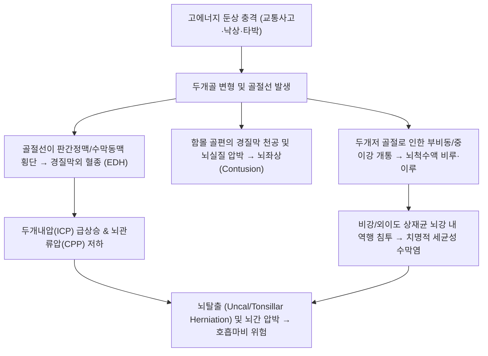

# 🩺 [[두개골 골절]] (Skull Fracture / 두개관·두개저 골절, KCD S02.0, S02.1)

> **핵심 3줄 요약 (Key Summary)**:
> - 📍 **병소 부위 & 해부·병태생리**: 뇌를 보호하는 두개관(전두골·두정골·측두골·후두골) 및 두개저(사골·접형골·측두골 추체부)에 강한 둔상 에너지가 가해져 골 피질의 연속성이 소실된 외상성 골절.
> - 🚩 **전형적 임상 양상**: 선상 골절의 국소 두피 혈종·압통; 함몰 골절의 두개골 계단상 결손 촉진; 두개저 골절의 4대 징후 — **라쿤 눈([[라쿤 눈]])**, **배틀 징후([[배틀 징후]])**, **뇌척수액 비루/이루(CSF leakage)**, 뇌신경 마비(후각·안면·청각).
> - 🛠️ **핵심 검사 & 치료 전략**: 뇌 비조영 CT(Bone window setting — 골편 함몰 깊이 및 기뇌증 확인); 단순 선상 골절의 보존적 관찰; 두개골 두께 이상 함몰·개방성 골절 시 신경외과적 개두술 및 골편 거상술; 회복기 외상후 증후군(두통·현훈) 침구([[백회]], [[풍지]]) 및 어혈 한약([[당귀수산]], [[통규활혈탕]]).
> - ⚠️ **응급 의뢰 레드플래그**: 동반된 [[경질막외 혈종]](EDH) 또는 [[경질막하 혈종]](SDH)에 의한 의식 저하, 동공 부동(Anisocoria), 쿠싱 삼징후(Cushing's triad: 서맥·고혈압·불규칙 호흡), 활동성 뇌척수액 누출 시 즉시 119 구급차를 통해 권역외상센터 응급실로 긴급 이송.

---

## 📌 목차
1. [질환 개요 & 해부학적 병태생리 (Disease Overview & Anatomy)](#1-질환-개요--해부학적-병태생리-disease-overview--anatomy)
2. [병태생리 메커니즘 & 임상적 악순환 (Pathophysiology & Vicious Cycle)](#2-병태생리-메커니즘--임상적-악순환-pathophysiology--vicious-cycle)
3. [임상 증상 & 이학적 검사 (Clinical Presentation & Physical Exam)](#3-임상-증상--이학적-검사-clinical-presentation--physical-exam)
4. [감별 진단 매트릭스 (Differential Diagnosis Matrix)](#4-감별-진단-매트릭스-differential-diagnosis-matrix)
5. [한의 통합 치료 프로토콜 (KMD Integrated Protocol)](#5-한의-통합-치료-프로토콜-kmd-integrated-protocol)
6. [양방 치료 & 병용·의뢰 기준 (Conventional Treatment & Referral)](#6-양방-치료--병용의뢰-기준-conventional-treatment--referral)
7. [단계별 재활 & 자가 운동 티칭 (Rehabilitation & Self-Care)](#7-단계별-재활--자가-운동-티칭-rehabilitation--self-care)
8. [💡 진료실 핵심 필기 & 임상 노하우](#8--진료실-핵심-필기--임상-노하우)
9. [출처 및 학술 참고 문헌 (References)](#9-출처-및-학술-참고-문헌-references)

---

## 1. 질환 개요 & 해부학적 병태생리 (Disease Overview & Anatomy)

![[측두근-1753861075465.png|450]]
> [그림 1: ① 병태생리·해부 — 두개관(Calvaria)을 이루는 전두골, 두정골, 측두골의 해부학적 봉합선 및 골격 구조 — Wikipedia(PD)]

* **질환 정의 및 3대 분류**:
  * [[두개골 골절]](Skull Fracture, 頭蓋骨骨折)은 외력에 의해 뇌를 둘러싼 두개골 볼트(Calvaria) 또는 두개저(Skull base)에 발생하는 골절입니다. 골절 자체보다 **하부 뇌 실질 손상, 경질막 파열, 뇌혈관 손상(출혈)**의 지표로서 막대한 임상적 중요성을 갖습니다.
  1. **선상 골절 (Linear Skull Fracture, 70~80%)**:
     * 골편의 전위나 함몰 없이 금만 간 형태로, 성인에서 가장 흔함. 골절선이 혈관구나 정맥동을 가로지를 경우 출혈 위험.
  2. **함몰 골절 (Depressed Skull Fracture, 15~20%)**:
     * 골편이 두개강 내측으로 밀려 들어간 상태. 골편이 두개골 두께(보통 5~10mm) 이상 함몰되면 뇌 실질 타박 및 뇌전증 위험이 급증함.
  3. **두개저 골절 (Basilar Skull Fracture, 5~10%)**:
     * 전두개저(사골 엽상판), 중두개저(측두골 추체부·접형골), 후두개저(후두골)에 발생하는 골절로 뇌신경 마비와 뇌척수액 누출을 동반함(Simon et al., 2023).
* **해부학적 구조와 역학적 관계**:
  * 두개골은 외판(Outer table), 판간층(Diploe, 해면골), 내판(Inner table)의 3층 구조로 이루어져 충격을 완충합니다.
  * 소아의 두개골은 얇고 유연하여 탁구공이 찌그러지듯 들어가는 **탁구공 골절(Ping-pong fracture)** 형태가 나타나기도 합니다(Krishnaprasadh et al., 2026; Lee et al., 2026).

---

## 2. 병태생리 메커니즘 & 임상적 악순환 (Pathophysiology & Vicious Cycle)

![[경추불안정증_02_해부도해_환축추인대구조_Gray307.png|450]]
> [그림 2: ② 관련 해부 구조물 — 후두골 및 두개저(Skull base)와 상부 경추 이행부의 인대 및 대후두공 구조 — Gray's Anatomy(Plate 307, PD)]

### 1) 혈관 파열 및 두개내 출혈 기전
* 두개골 내판에는 중경막동맥, 시상정맥동, 횡정맥동이 밀착하여 주행합니다. 측두골-두정골 선상 골절 시 중경막동맥 파열로 급성 EDH가 발생하며, 골절 충격의 반작용으로 반대측 뇌가 두개골에 부딪히며 발생하는 대측 뇌좌상(Coup-contrecoup injury)이 동반됩니다.

### 2) 경질막 파열과 두개강-외부 개통
* 두개저 골절 시 뇌를 싸고 있는 경질막과 지주막이 찢어지면서 사골동, 접형골동, 전두동 또는 중이강과 교통하게 됩니다. 뇌척수액이 외부로 유출되는 동시에 공기가 뇌 안으로 유입되는 **기뇌증(Pneumocephalus)**이 발생하며, 박테리아가 유입되어 중추신경계 감염을 초래합니다.

---

## 3. 임상 증상 & 이학적 검사 (Clinical Presentation & Physical Exam)

![[두개골골절_03_임상증상_라쿤눈_안와주위반상출혈.jpg|420]]
> [그림 3: ③ 임상 증상 — 전두개저 골절 시 안와 상벽 골절로 인한 양측 안와 주위 피하 반상출혈(라쿤 눈, Raccoon eyes) 환자 실사 — Wikipedia(CC BY-SA 4.0)]

![[두개골골절_03_임상증상_배틀징후_유양돌기반상출혈.png|420]]
> [그림 4: ③ 임상 증상 — 중두개저/측두골 골절 시 유양돌기 부위 피하 어혈을 나타내는 배틀 징후(Battle's sign) 임상 실사 — Wikipedia(CC BY-SA 3.0)]

![[두개골골절_03_영상의학_두개골골절_EDH_뇌CT.jpg|420]]
> [그림 5: ③ 영상의학적 진단 — 두개골 골절선(Skull fracture) 및 중경막동맥 파열로 동반된 전형적인 볼록렌즈형 급성 경질막외 혈종(EDH) 뇌 CT 스캔 — Wikimedia(CC BY-SA 3.0)]

### 1) 주요 임상 증상
* **선상 골절 증상**: 국소 두피의 모세혈관 파열로 인한 박동성 두피하 혈종(Cephalohematoma), 국소 압통, 경미한 두통.
* **함몰 골절 증상**: 두피를 만졌을 때 뼈가 푹 꺼져 들어간 계단상 턱(Step-off deformity)이 촉진됨. 열상 동반 시 개방성 골절로 뇌 실질 노출 가능.
* **두개저 골절의 4대 클래식 징후**:
  * **라쿤 눈 ([[라쿤 눈]] / Raccoon Eyes)**: 전두개저 골절 시 안와 상벽이 부러져 안와 주위 피하로 혈액이 번지는 양측성 눈 주위 반상출혈.
  * **배틀 징후 ([[배틀 징후]] / Battle's Sign)**: 중두개저/측두골 골절 시 유양돌기 후방 피하에 나타나는 멍.
  * **뇌척수액 누출**: 코로 맑은 액체가 흘러나오는 비루(CSF rhinorrhea), 귀로 흘러나오는 이루(CSF otorrhea).
  * **뇌신경 마비**: 제1(후각 상실), 제7(안면마비), 제8(난청·현훈) 뇌신경 손상.

### 2) 이학적 검사 알고리즘
* **글래스고 혼수 척도 (GCS Score)**:
  * 눈뜨기(E), 언어반응(V), 운동반응(M)을 즉시 평가(13~15점 경증, 9~12점 중등도, 3~8점 중증 두부 손상).
* **타겟 징후 검사 (Target / Halo Sign)**:
  * 비강이나 외이도 분비물을 여과지에 떨어뜨려 중심 혈액과 외곽의 맑은 뇌척수액 링 확인.
* **동공 반사 (Pupillary Light Reflex)**:
  * 대광반사 소실 및 편측 동공 산대(Unilateral dilated pupil)는 동측 동안신경 압박 및 뇌탈출(Uncal herniation)의 초응급 징후.

---

## 4. 감별 진단 매트릭스 (Differential Diagnosis Matrix)

| 감별 질환 | 골절 및 손상 부위 | 주요 임상 징후 | 응급 조치 및 진단 |
| :--- | :--- | :--- | :--- |
| **[[두개골 골절]]** | 두개관 볼트 또는 두개저 | 라쿤눈, 배틀징후, 함몰 촉진, CSF 누출, 기뇌증 | **뇌 CT(Bone window)**, 신경외과 의뢰 |
| **단순 두피 혈종 / 열상** | 모상건막(Galea) 상하층 | 두피 종창, 뼈의 연속성 정상, 신경학적 결손 없음 | X-ray/CT상 골절 음성, 소독 및 봉합 |
| **[[관자뼈 골절]]** | 측두골 추체부 국한 | 심한 이출혈, 혈고실, 안면마비, 감각신경성 난청 | 측두골 고해상도 CT(HRCT) |
| **안와 골절 (안와 취약 골절)** | 안와 하벽/내벽 골절 | 안구 운동 제한(복시), 안구 함몰, 뺨 감각 저하 | 안와 CT, 이비인후과/성형외과 |
| **경추 골절 / 척수 손상** | 경추 추체 및 후궁 | 경부 극통, 사지 마비, 감각 소실 (두부외상 환자 필수 동반 감별) | 경추 CT, 넥칼라 고정 필수 |

---

## 5. 한의 통합 치료 프로토콜 (KMD Integrated Protocol)

![[두개골골절_05_응급처치_경추보호_넥칼라적용.png|420]]
> [그림 6: ⑤ 응급 신경학적 평가 및 경추 보호 — 두부 외상 및 두개골 골절 환자에서 동반 경추 손상 배제 전까지 필수 적용하는 넥칼라(Cervical collar) 고정 시술 실사 — Wikimedia(CC BY-SA 4.0)]

* **⚠️ 급성기 절대 원칙**:
  * 급성 골절 및 두개내 출혈기는 신경외과 전담 영역입니다. 한의 치료는 **골유합기 및 신경학적 안정화 이후의 외상후 증후군(Post-concussion syndrome: 두통, 현훈, 불면, 인지 저하)**에 적용합니다.
* **침구 치료 (Acupuncture)**:
  * **주요 경혈**: [[백회]](GV20), [[풍지]](GB20), [[태양]](EX-HN5), [[인당]](EX-HN3), [[합곡]](LI4), [[태충]](LR3).
  * **시술 방법**:
    * 함몰 골절 부위는 직접 자침을 피하고, 원위부 및 족소양담경, 독맥 혈위를 취혈합니다.
    * 풍지와 천주(BL10)에 0.25×40mm 호침으로 완만한 사자 후 유침하여 두판상근 및 후두하근 경직을 이완시키고 뇌혈류를 촉진합니다.
* **한약 치료 (Herbal Medicine)**:
  * **어혈두통 및 혈종 흡수 촉진 (외상 초기~아급성기)**: [[당귀수산]](當歸鬚散), [[통규활혈탕]](通竅活血湯) 가감.
  * **뇌진탕 후유증 (두통, 어지럼증, 메스꺼움)**: [[반하백출천마탕]](半夏白朮天麻湯), [[택사탕]](澤瀉湯).
  * **정신적 불안 및 외상 후 불면증**: [[온담탕]](溫膽湯), [[귀비탕]](歸脾湯).

---

## 6. 양방 치료 & 병용·의뢰 기준 (Conventional Treatment & Referral)

* **선상 골절의 관리**:
  * 신경학적 증상이 없고 뇌 CT상 두개내 출혈이 없는 폐쇄성 선상 골절은 특별한 치료 없이 24~48시간 입원 관찰 후 퇴원.
* **수술적 치료 적응증 (Surgical Indication)**:
  * **함몰 골절 거상술**: 내판 함몰 깊이가 8~10mm 이상이거나 두개골 두께를 초과하는 경우, 신경 결손 동반 시, 정맥동을 압박하는 경우.
  * **개방성 골절 변연절제술**: 경질막 파열을 동반한 개방성 함몰 골절은 오염된 골편 제거 및 경질막 성형술 시행(감염 방지).
  * **두개내 혈종 제거술**: EDH > 30mL 또는 SDH 두께 > 10mm 시 응급 개두술(Craniotomy).
* **약물 치료**:
  * 두개저 골절 환자에서 예방적 항생제 사용은 논란이 있으나 감염 징후 시 즉시 투여. 뇌부종 조절을 위한 만니톨(Mannitol) 또는 고장성 식염수 투여.

---

## 7. 단계별 재활 & 자가 운동 티칭 (Rehabilitation & Self-Care)

* **1단계: 절대 안정 및 뇌압 상승 행위 차단 (1~2주)**:
  * 기침, 코 풀기, 무거운 물건 들기, 변비로 힘주기 절대 금지(기뇌증 발생 방지).
  * 스마트폰, TV, 독서 등 시각적 뇌 자극을 최소화하고 암실 휴식.
* **2단계: 가벼운 일상 복귀 및 유산소 산책 (3~4주)**:
  * 두통과 어지럼증이 유발되지 않는 범위 내에서 평지 20분 걷기.
* **3단계: 접촉 스포츠 제한 (최소 3~6개월)**:
  * 축구(헤딩), 농구, 격투기 등 재충격 위험이 있는 운동은 골유합이 완전히 확인될 때까지 엄격히 금지(Second impact syndrome 예방).

---

## 8. 💡 진료실 핵심 필기 & 임상 노하우

* **'의식 명료기(Lucid Interval)'의 함정에 빠지지 마라**:
  * 두부를 다치고 잠시 기절했다가 완전히 멀쩡하게 깨어나 "원장님, 저 이제 안 아파요, 괜찮아요"라고 웃으며 걸어 들어오는 환자가 가장 위험합니다. 이것이 바로 **경질막외 혈종(EDH)의 전형적인 의식 명료기**이며, 2~3시간 뒤 급격히 뇌탈출이 오면서 혼수에 빠질 수 있습니다. 두부 타박 환자는 찰과상만 보여도 반드시 당일 뇌 CT 촬영 여부를 확인해야 합니다.
* **코에서 물이 뚝뚝 떨어질 때 비염 소청룡탕을 쓰면 안 되는 이유**:
  * 두부 외상 환자가 "다친 뒤로 맑은 콧물이 멈추지 않는다"며 내원할 때 비염으로 오진하여 소청룡탕을 투약하는 사고가 있습니다. 고개를 숙일 때 맑은 물이 주르륵 흐르고 단맛이 느껴진다면 알레르기 비염이 아니라 **전두개저 골절에 의한 뇌척수액 비루(CSF rhinorrhea)**입니다. 코를 풀게 하면 뇌 안으로 공기와 균이 들어가 뇌수막염이 발생하므로 즉시 상급병원으로 전원해야 합니다.

---

## 9. 출처 및 학술 참고 문헌 (References)

1. **Simon LV, et al.** (2023). Basilar Skull Fractures. *StatPearls*. [PMID 29261908](https://pubmed.ncbi.nlm.nih.gov/29261908/)

   - [연구 요약]: 두개저 골절의 해부학적 위치별 임상 징후(Battle 징후, Raccoon eyes, CSF 누출) 및 뇌신경 마비와 세균성 뇌수막염 합병증 진단 지침 제시.
2. **Krishnaprasadh D, et al.** (2026). Pediatric Skull Fractures. *StatPearls*. [PMID 29489156](https://pubmed.ncbi.nlm.nih.gov/29489156/)

   - [연구 요약]: 소아 두개골의 생체역학적 특성과 탁구공 골절(Ping-pong fracture), 선상 골절의 보존적 경과 및 성장 골절(Growing skull fracture) 감별 관리 지침.
3. **Lee HS, et al. (2026)**. Automated Diagnosis of Infantile Skull Fractures From X-Ray Images Using an Ensemble Deep Learning Model. *J Korean Med Sci*, 41(36), e289. [PMID 42708481](https://pubmed.ncbi.nlm.nih.gov/42708481/)

   - [연구 요약]: 영유아 두개골 단순 방사선 X-ray 영상에서 봉합선(Suture)과 미세 선상 골절을 딥러닝 앙상블 모델로 정밀 감별하는 자동화 진단 연구.

---

## 관련 노트
- [[관자뼈 골절]]
- [[라쿤 눈]]
- [[배틀 징후]]
- [[백회]]
- [[풍지]]
- [[당귀수산]]
